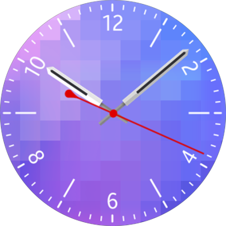

# DALi Watch Application


You can create a watch application with DALi to retrieve the current date and time and display it accurately on the screen.

This feature is supported in wearable applications only.

To create a DALi watch application, you must:

- Use the [Dali::WatchApplication class](#api).

	> **Note**
    >
	> A DALi watch application is implemented similarly to a [DALi basic UI application](dali-basic-app.md), since the [Dali::WatchApplication](../../../api/wearable/latest/classDali_1_1WatchApplication.html) class inherits from the [Dali::Application](../../../api/wearable/latest/classDali_1_1Application.html) class. Consequently, make sure you are familiar with the basic UI application details before tackling a watch application.

- Make sure you [start the event loop](#mainloop).

- [React to application events](#callback) with callbacks.

- Manage the time handle and display the time with the DALi 3D UI.

  The `TimeTickSignal()` and `AmbientTickSignal()` functions trigger callback functions to update the display with the new accurate time. The `WatchTime` handle is provided with the callback function to help you to update the current time properly.

**Figure: DALi watch application**



For the steps of creating the basic parts of a simple DALi watch application, see [Basics of Creating a DALi Watch Application](#create).

<a name="api"></a>
## Main Application Classes

If you want to use DALi for your watch application, you must create the application with the `Dali::WatchApplication` class. This class provides the means for initializing the resources required by DALi.

The following table lists the main functions you need in your application to retrieve the current time. They are all provided by the [Dali::WatchTime](../../../api/wearable/latest/classDali_1_1WatchTime.html) class.

**Table: Main functions**

| Function      | Description                              |
|---------------|------------------------------------------|
| `GetHour()`   | Get the hour from the `WatchTime` handle. |
| `GetHour24()` | Get the hour from the `WatchTime` handle in 24-hour format. |
| `GetMinute()` | Get the minute from the `WatchTime` handle. |
| `GetSecond()` | Get the second from the `WatchTime` handle. |

<a name="mainloop"></a>
## Event Loop

Like all ordinary Tizen applications, the DALi watch application must start the main event loop. Afterwards, it can receive usual platform events and dedicated watch events from the platform.

The `mainloop()` function is used to start the event loop. If you do not call the function and start the event loop, DALi cannot call any callback functions for application events.

<a name="callback"></a>
## Event Callbacks

The `Dali::WatchApplication` class emits several signals which you can connect to.

The following table lists the callbacks for the watch application signals provided by the `Dali::WatchApplication` class. These signals originally occur in the Tizen application framework, and you can use the callbacks to react to them.

**Table: Callbacks for watch application event signals**

| Callback                 | Description                              |
|--------------------------|------------------------------------------|
| `TimeTickSignal()`       | Called every second. You can use the signal to update the time on the screen. |
| `AmbientTickSignal()`    | Called every minute when the device is in the ambient mode. You can use the signal to update the time on the screen. |
| `AmbientChangedSignal()` | Called when the device enters or exits the ambient mode. |


<a name="create"></a>
## Basics of Creating a DALi Watch Application

To create a DALi watch application, set the time, and draw the UI:

1. Initialize the application:

   1. To use the functions and data types of the DALi watch application, include the `<dali/public-api/dali-wearable.h>` header file in your application:
      ```
      #include <dali/public-api/dali-wearable.h>
      ```
   2. Like in a basic UI application, use the following 2 `using` directives for convenience, because all DALi APIs are contained in either `Dali` or `Dali::Toolkit` namespace:
      ```
      using namespace Dali;
      using namespace Dali::Toolkit;
      ```
2. Create the `Dali::WatchApplication` class instance to initialize and set up DALi for a watch application:
   ```
   WatchApplication application = WatchApplication::New( &argc, &argv );
   ```

3. Connect signals to keep yourself informed when certain system events occur.

   1. To manage signal connection safely, DALi provides the [Dali::ConnectionTracker](../../../api/wearable/latest/classDali_1_1ConnectionTracker.html) class. A typical way to start a DALi application is to create a class derived from the `Dali::ConnectionTracker` class and use its member functions as callback functions for DALi signals.

      When the application receives the `InitSignal()`, it can create UI components. Connect the `WatchExample::Create()` callback to the `Dali::WatchApplication::InitSignal()` function:
      ```
      class WatchExample : public ConnectionTracker
      {
        public:
          WatchExample( WatchApplication& application )
            : mApplication( application )
          {
            mApplication.InitSignal().Connect( this, &WatchExample::Create );
          }

          void Create( Application& application )
          {
            // Create a DALi UI component
          }

        private:
          WatchApplication& mApplication;
      }
      ```

   2. Handle the tick signals.

      The `TimeTickSignal()` callback is triggered once per second. Retrieve the current time from the `WatchTime` time handle to draw the updated time.

      You can get the current hour, minute, and second from the `WatchTime` time handle by using the `time.GetHour()`, `time.GetMinute()`, and `time.GetSecond()` functions.

      ```
      mApplication.TimeTickSignal().Connect( this, &WatchExample::OnTimeTick );

      // Update clock hands on the tick event
      void OnTimeTick( Application& application, const WatchTime& time )
      {
        UpdateClockHands(time.GetHour(), time.GetMinute(), time.GetSecond());
      }

      void UpdateClockHands(int hour, int min, int sec)
      {
        // Update the angle of each hand
      }
      ```

## Related Information
- Dependencies
  - Tizen 3.0 and Higher for Wearable
