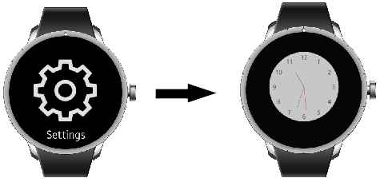
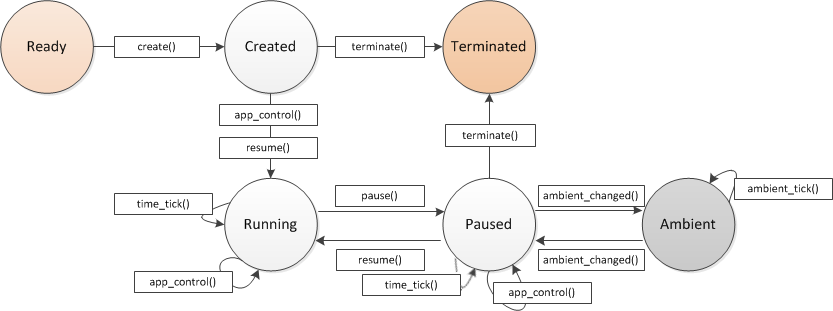

# EFL Watch Application


Tizen allows you to create a watch application and manage its life-cycle to [retrieve the current date and time](#current) and display it accurately on the screen.

This feature is supported in wearable applications only.

The main features of the Watch Application API include:

- Managing the application life-cycle

  You can control the application execution by [defining actions in the life-cycle event callbacks](#lifecycle). You can also [react to system events with callbacks](#systemrelated).

- Managing the time handle and displaying the time

  You can manage the time handle and retrieve the window object for the watch UI. With the time handle, you can [draw the UI](#timehandle) for your watch application.

- Managing the ambient mode

  On a low-powered wearable device, an ambient mode is available. In this mode, the watch application shows a limited UI and receives only the ambient tick event every minute to reduce power consumption.

  To use the ambient mode, the user must enable it in the device settings. You can [define callbacks to monitor when the application enters and exits the ambient mode](#ambient).

When a watch application is successfully installed on a device, its UI is visible in the **Clock** menu of the device **Settings** menu. The user can use the settings to change between the available watch application UIs.

**Figure: Clock menu**



## Prerequisites

To enable your application to use the watch functionality:

1. To use the [Watch Application](../../api/wearable/latest/group__CAPI__WATCH__APP__MODULE.html) API's `watch_app_ambient_tick_cb()` callback in the ambient mode, the application has to request permission by adding the following privilege to the `tizen-manifest.xml` file:

   ```
   <privileges>
      <privilege>http://tizen.org/privilege/alarm.set</privilege>
   </privileges>
   ```

2. To use the high color mode for the ambient mode, make sure that the device supports it:

   ```
   bool support;
   int ret;

   ret = system_info_get_platform_bool("http://tizen.org/feature/screen.always_on.high_color", &support);
   ```

3. To use the functions and data types of the Watch Application API, include the `<watch_app.h>` and `<watch_app_efl.h>` header files in your application:
   ```
   #include <watch_app.h>
   #include <watch_app_efl.h>
   ```

4. Edit the watch application settings in the [manifest](../../../tizen-studio/native_tools/manifest-text-editor.md#watch_app) file.

<a name="lifecycle"></a>
## Managing the Application Life-cycle

You can create and initialize a watch application with the `main()` function. To start an event loop, use the `watch_app_main()` function. Before calling this function, set up the `watch_app_lifecycle_callback_s` structure variable, which contains the required event callbacks.

The following figure illustrates the watch application states during the application life-cycle:

- Before the main loop of the application starts, the application is in the Created state.
- When the application is running, it is in the Running state.
- When the application is invisible, it is in the Paused state.
- When the application is in the ambient mode, it is in the Ambient state.
- When the application exits, it is in the Terminated state.

**Figure: Watch application life-cycle**



The following table lists the callbacks you can use as the application state changes.

**Table: Application state change callbacks**

| Callback                | Description                              |
|-------------------------|------------------------------------------|
| `app_create()`          | Called before the main loop of the application starts. In this callback, you can initialize application resources, such as window creation and data structure. |
| `app_control()`         | Used to take necessary actions when a service call arrives from another application. |
| `app_pause()`           | Called when the application is completely obscured by another application and becomes invisible. |
| `app_resume()`          | Called when the application becomes visible. |
| `app_terminate()`       | Called when the application main loop exits. |
| `app_time_tick()`       | Called at least once per second. Watch applications can get the current time from the `watch_time_h` handle and draw the normal watch. |
| `app_ambient_tick()`    | Called at least once per minute or when the device enters the ambient mode. Watch applications can get the current time from the `watch_time_h` handle and draw the ambient mode watch. |
| `app_ambient_changed()` | Called when the device enters or exits the ambient mode. |

To manage the life-cycle callbacks:

1. Register the necessary callbacks:
   - The `create` event is triggered before the application main loop starts. In this callback, you can initialize the application resources, such as create windows and data structures.
   ```
   bool
    app_create(int width, int height, void* user_data)
    {
        /* Hook to take necessary actions before the main event loop starts */
        /* This usually means initializing the UI and application data */

        return true;
    }
   ```
   - The `app_control` event is triggered when another application sends a launch request to the application.
   ```
    void
    app_control(app_control_h app_control, void* user_data)
    {
        /* Handle the launch request */
        /* Show the user the task requested through the "app_control" parameter */
    }
   ```
   - The `pause` event is triggered when the application is completely obscured by another application and becomes invisible.
   ```
    void
    app_pause(void* user_data)
    {
        /* Take necessary actions when application becomes invisible */
        /* Release the resources needed to draw the normal watch */
    }
   ```
   - The `resume` event is triggered when the application becomes visible.
   ```
    void
    app_resume(void* user_data)
    {
        /* Take the necessary actions when application becomes visible */
        /* Acquire the resources needed to draw the normal watch */
    }
   ```
   - The `terminate` event is triggered when the application main loop exits.
   ```
    void
    app_terminate(void* user_data)
    {
        /* Release all resources */
    }
   ```
   - The `time_tick` event is triggered at least once per second. The watch applications can get the current time from the `watch_time` time handle to draw a normal watch. Platform can invoke this event even in the background state. So even if your watch app is in the background if this event is invoked, you need to update the UI.
   ```
    void
    app_time_tick(watch_time_h watch_time, void* user_data)
    {
        /* Called at least once per second */
        /* Draw a normal watch with the hour, minute, and second */
    }
   ```
2. Set the life-cycle callbacks in the `watch_app_lifecycle_callback_s` structure, and pass the structure to the `watch_app_main()` function that starts the watch application event loop:
```
int
main(int argc, char* argv[])
{
    appdata ad = {0,};
    watch_app_lifecycle_callback_s callback = {0,};

    callback.create = app_create;
    callback.app_control = app_control;
    callback.terminate = app_terminate;
    callback.pause = app_pause;
    callback.resume = app_resume;
    callback.time_tick = app_time_tick;
    /* Ambient mode callbacks */

    int ret = watch_app_main(argc, argv, &callback, &ad);
    if (ret != APP_ERROR_NONE)
        dlog_print(DLOG_ERROR, LOG_TAG, "watch_app_main() failed. err = %d", ret);

    return ret;
}
```

<a name="systemrelated"></a>
## Managing System-related Callbacks

To manage callbacks related to system status changes:

1. Define the following callback functions:

   - `lang_changed()`: Triggered when the system language changes and the messages are translated.
   - `region_changed()`: Triggered when the time zone changes.
   - `low_memory()`: Triggered when the system is running low on memory. Use the callback to save the current work and release resources; if this is not enough, the platform frees resources automatically and can even kill some applications.
   - `low_battery()`: Triggered when the system is running low on battery (less than 5%). Use the callback to save the current work and avoid battery-draining workloads.

   ```
   void
   lang_changed(app_event_info_h event_info, void* user_data)
   {
       /* Take the necessary actions when the language setting changes */
   }

   void
   region_changed(app_event_info_h event_info, void* user_data)
   {
       /* Take the necessary actions when the region setting changes */
   }

   void
   low_battery(app_event_info_h event_info, void* user_data)
   {
       /* Take the necessary actions when the system is running low on battery */
   }

   void
   low_memory(app_event_info_h event_info, void* user_data)
   {
       /* Take the necessary actions when the system is running low on memory */
   }
   ```

2. Register the callback functions:

   ```
   bool
   app_create(void *user_date)
   {
       /* Register a callback for each system event */
       if (watch_app_add_event_handler(&handler, APP_EVENT_LANGUAGE_CHANGED, lang_changed, NULL) != APP_ERROR_NONE)
           dlog_print(DLOG_ERROR, LOG_TAG, "watch_app_add_event_handler() failed");

       if (watch_app_add_event_handler(&handler, APP_EVENT_REGION_FORMAT_CHANGED, region_changed, NULL) != APP_ERROR_NONE)
           dlog_print(DLOG_ERROR, LOG_TAG, "watch_app_add_event_handler() failed");

       if (watch_app_add_event_handler(&handler, APP_EVENT_LOW_BATTERY, low_battery, NULL) != APP_ERROR_NONE)
           dlog_print(DLOG_ERROR, LOG_TAG, "watch_app_add_event_handler() failed");

       if (watch_app_add_event_handler(&handler, APP_EVENT_LOW_MEMORY, low_ memory, NULL) != APP_ERROR_NONE)
           dlog_print(DLOG_ERROR, LOG_TAG, "watch_app_add_event_handler() failed");

       return true;
   }
   ```

<a name="timehandle"></a>
## Drawing the Watch UI

To draw an accurate clock in various formats on the screen, use the Watch Application getter APIs with the `watch_time_h` time handle. You can get the handle with the `watch_time_get_current_time()` function.

With the time handle, you can draw the UI for your watch application:

1. Get the window object with the `watch_app_get_elm_win()` function:
    ```
    struct _appdata {
        Evas *evas;
        Evas_Object *win;
        Evas_Object *conform;
        Evas_Object *label;
    };
    typedef struct _appdata appdata;

    static void
    __create_base_gui(appdata *ad, int width, int height)
    {
        int ret;
        watch_time_h watch_time = NULL;
        ret = watch_app_get_elm_win(&ad->win);

        if (ret != APP_ERROR_NONE) {
            dlog_print(DLOG_ERROR, LOG_TAG, "failed to get window. err = %d", ret);

            return;
        }
        evas_object_resize(ad->win, width, height);
        ad->conform = elm_conformant_add(ad->win);
        evas_object_size_hint_weight_set(ad->conform, EVAS_HINT_EXPAND, EVAS_HINT_EXPAND);
        elm_win_resize_object_add(ad->win, ad->conform);
        evas_object_show(ad->conform);
        ad->label = elm_label_add(ad->conform);
        evas_object_resize(ad->label, width, height / 3);
        evas_object_move(ad->label, 0, height / 3);
        evas_object_show(ad->label);
    ```
2. Get the time handle for the current time with the `watch_time_get_current_time()` function:
    ```
        ret = watch_time_get_current_time(&watch_time);
        if (ret != APP_ERROR_NONE)
            dlog_print(DLOG_ERROR, LOG_TAG, "failed to get current time. err = %d", ret);
        __update_watch(ad, watch_time);
    }

    bool
    app_create(void *user_date)
    {
        /* Define system callbacks */

        appdata *ad = data;
        __create_base_gui(ad, width, height);

        return true;
    }
    ```
3. When you no longer need the `watch_time_h` time handle, release it with the `watch_time_delete()` function.

> **Note**  
> To draw the UI, use a single window that is returned by the `watch_app_get_elm_win()` function. Do not create additional windows. A stack of watch application windows gets corrupted, because the platform handles the watch application window in a special way.

<a name="current"></a>
## Getting the Current Time

You can get the current local time in various formats using the Watch Application methods and the time handle. When retrieving the current local time, the time handle parameter cannot be `NULL`.

For example, you can use the `watch_time_get_minute()` function to retrieve the current minute value.

```
static void
__update_watch(appdata *ad, watch_time_h watch_time)
{
    watch_text[TEXT_BUF_SIZE];
    int hour24;
    int minute;
    int second;

    if (watch_time == NULL)
        return;

    watch_time_get_hour24(watch_time, &hour24);
    watch_time_get_minute(watch_time, &minute);
    watch_time_get_second(watch_time, &second);
    snprintf(watch_text, TEXT_BUF_SIZE,
             "<align=center>Hello Watch<br/>%02d:%02d:%02d</align>",
             hour24, minute, second);
    elm_object_text_set(ad->label, watch_text);
}

static void
__create_base_gui(appdata *ad, int width, int height)
{
    /* Get the window object and time handle */

    __update_watch(ad, watch_time);
}
```

You can also get the UTC time and time zone, if needed, using the `watch_time_get_utc_time()`, `watch_time_get_utc_timestamp()`, and `watch_time_get_time_zone()` functions.

<a name="ambient"></a>
## Using the Ambient Mode

The details of the limited UI drawn in the ambient mode depend on the device. In addition, due to the ambient mode being a low power mode, there are limits to the colors that can be shown on the screen. Usually, when designing the ambient mode UI, draw it with limited colors (cyan, magenta, yellow, red, green, blue, black and white), and use less than 15% of the pixels on the screen. If you do not want to draw your own ambient mode UI, set the `ambient-support` attribute to `false` in the watch application [manifest file](../../../tizen-studio/native_tools/manifest-text-editor.md#watch_app) to allow the platform to show a default ambient mode UI.

Since Tizen 2.3.2, some devices introduce a high color mode for the ambient mode. In the high color mode, you can use more colors (usually, 24-bit color) for drawing the ambient mode UI.

To use the ambient mode:

1. Define the ambient mode callbacks.

   - The `ambient_changed` event is triggered when the ambient mode is enabled or disabled on the device. You can use the callback to initialize your ambient mode UI.
   - The `ambient_tick` event is triggered every minute while the device is in the ambient mode. You can use the callback to update the time on your watch application in the ambient mode. In this callback, do not perform time-consuming tasks and always update the UI as quickly as possible. The platform can put the device to sleep shortly after the ambient tick expires.

   ```
   void
   app_ambient_tick(watch_time_h watch_time, void* user_data)
   {
       appdata *ad = user_data;
       __update_watch(ad, watch_time);
   }

   void
   app_ambient_changed(bool ambient_mode, void* user_data)
   {
       if (ambient_mode)
           /* Prepare to enter the ambient mode */
       else
           /* Prepare to exit the ambient mode */
   }
   ```

2. Register the ambient mode callbacks:

   ```
   int
   main(int argc, char* argv[])
   {
       appdata ad = {0,};
       watch_app_lifecycle_callback_s callback = {0,};

       /* Other life-cycle callbacks */

       callback.ambient_tick = app_ambient_tick;
       callback.ambient_changed = app_ambient_changed;

       int ret = watch_app_main(argc, argv, &callback, &ad);
       if (ret != APP_ERROR_NONE)
           dlog_print(DLOG_ERROR, LOG_TAG, "watch_app_main() failed. err = %d", ret);

       return ret;
   }
   ```

## Related Information
- Dependencies
  - Tizen 2.4 and Higher for Mobile
  - Tizen 2.3.1 and Higher for Wearable
