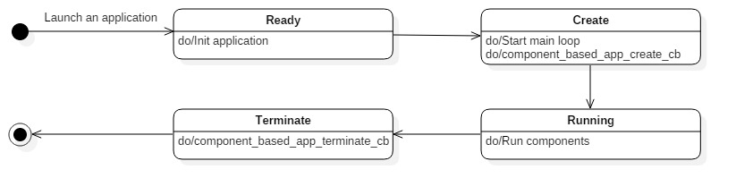
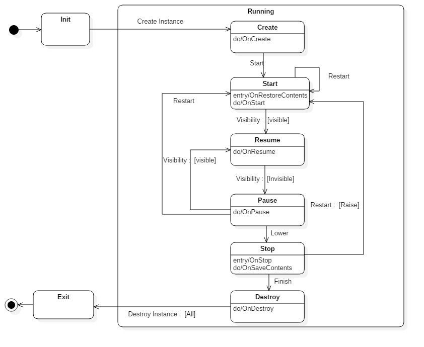
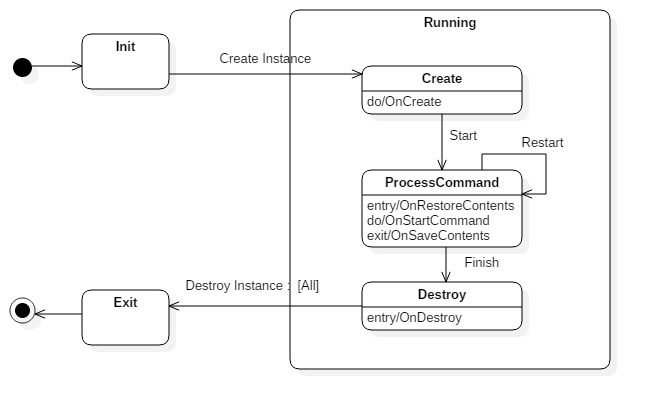

# Component Based Applications


The component based application is one of the Tizen application models. This application model enables you to create an application that provides multiple components in one process.
In the component based application model, there are two types of components. Each component type has its own lifecycle:

- Service component: The service component has a lifecycle for managing services without UI.
- Frame component: The frame component has a lifecycle for managing UI resources.

As you create a Tizen project, you can add components to your project. The registered components create instances when the component based application receives a launch request.

The main component based application API features include:

- Application states

  A Tizen native component based application [transitions through various states](#application_states) during its lifecycle.

- Application event callbacks

  The component based application can receive application state change events. You can register [callbacks for these events](#application_register) to react to them.

- Frame component states

  A frame component [transitions through various states](#frame_component_states) during its lifecycle.

- Frame component event callbacks

  The component based application can receive frame component state change events. You can register [callbacks for these events](#frame_component_callbacks) to react to them.

- Service component states

  A service component [transitions through various states](#service_component_states) during its lifecycle.

- Service component event callbacks

  The component based application can receive service component state change events. You can register [callbacks for these events](#service_component_callbacks) to react to them.

- Application behavior attributes

  You can [declare components and its specific attributes](#attribute) in the application manifest file.


<a name="application_states"></a>
## Application States

The following figure and table describe the component based application states:



| State        | Description                         |
|--------------|-------------------------------------|
| `Ready`      | Application is launched.            |
| `Create`     | Application starts the main loop.   |
| `Running`    | Application runs components.        |
| `Terminate`  | Application is terminated.          |

  > **Note**
  >
  > The component based application is created by requesting the creation of the first component and terminates if there are no running instances.
  > In the `RUNNING` state, the component based application creates instances of registered components. The registered component can have multiple instances.


<a name="application_register"></a>
## Application Event Callbacks

You can control the component based application execution by [managing the application state events](#application_monitoring).

The following table lists the callbacks for the application state events:

| Callback                     | Description                              |
|------------------------------|------------------------------------------|
| `component_based_app_create_cb()`    | Used to take necessary actions before the main event loop starts. Place the initialization code (such as setting up the dbus connection) and add components here.|
| `component_based_app_terminate_cb()` | Used to take necessary actions when the application terminates. This callback releases all resources, especially the allocated and shared resources, so that the other running applications can fully use the shared resources. |


<a name="frame_component_states"></a>
## Frame Component States

The following figure and table describe the frame component states:



| State        | Description                         |
|--------------|-------------------------------------|
| `Create`     | The frame component instance is created.            |
| `Start`      | The frame component instance is started and is ready to receive visibility events.   |
| `Resume`     | The frame component instance is visible. |
| `Pause`      | The frame component instance is invisible. |
| `Stop`       | The frame component instance is stopped. Therefore, it stops receiving visibility events. |
| `Destroy`    | The frame component instance is destroyed.          |


<a name="frame_component_callbacks"></a>
## Frame Component Event Callbacks

You can control the frame component lifecycle by [managing the frame component state events](#frame_component_monitoring).

The following table lists the callbacks for the frame component state events:

| Callback                     | Description                              |
|------------------------------|------------------------------------------|
| `frame_component_create_cb()`    | Used to take necessary actions before the lifecycle of a frame component instance starts. Place the initialization code here. You must create a window at this point. It will be called once in the instance's lifecycle. |
| `frame_component_restore_content_cb()`    | Used to restore the current state of an instance. The data stored in  `frame_component_save_content_cb` will be passed by parameter. |
| `frame_component_start_cb()`    | Used to start an instance. Requested `app_control_h` will be passed by parameter. |
| `frame_component_resume_cb()`    | Used to take necessary actions when the application becomes visible. If you have released any resources in the `frame_component_pause_cb()` callback, re-allocate those resources before the application resumes. |
| `frame_component_pause_cb()`    | Used to take necessary actions when the application becomes invisible. For example, release the memory resources so that other applications can use them. |
| `frame_component_stop_cb()`    | Used to take necessary actions when the frame component instance window is lowered. The window is lowered when the frame component window is not activated for a long time. |
| `frame_component_save_content_cb()`    | Used to take necessary actions when there is a need to store or restore data for launching the next instance. This callback will be called right before `frame_component_destroy_cb`. |
| `frame_component_destroy_cb()` | Used to take necessary actions when the frame component instance is terminating. This callback releases all resources, especially the allocated and shared resources. |
| `frame_component_action_cb()` | Used to take necessary actions when another application sends a launch request. To receive an action event, you must [register an action](#managing_action).|

The frame component instance can also receive some basic system events. The following table shows available system events callbacks:

| Callback                               | Description                              |
|----------------------------------------|------------------------------------------|
| `frame_component_low_memory_cb`                 | Event type for the callback function that is responsible for saving data from the main memory to a persistent memory or storage to avoid data loss. Data loss can occur if the Tizen platform low memory killer kills your application to free more memory. The callback function must release any cached data in the main memory to secure more free memory. |
| `frame_component_low_battery_cb`                | Event type for the callback function that is responsible for saving data from the main memory to a persistent memory or storage to avoid data loss in case of complete power failure. The callback function must also stop heavy CPU consumption or power consumption activities to save the remaining power. |
| `frame_component_device_orientation_changed_cb` | Event type for the callback function that is responsible for changing the display orientation to match the device orientation. |
| `frame_component_language_changed_cb`           | Event type for the callback function that is responsible for refreshing the display into a new language. |
| `frame_component_region_format_changed_cb`      | Event type for the callback function that is responsible for refreshing the display into a new time zone. |
| `frame_component_suspended_state_changed_cb`    | Event type for the callback function that is responsible for taking necessary actions before entering the suspended state or after exiting from the state. |


<a name="service_component_states"></a>
## Service Component States

The following figure and table describe the service component states:



| State        | Description                         |
|--------------|-------------------------------------|
| `Create`      | The service component instance is created.            |
| `Process Command`    | The service component instance handles the requested command. |
| `Destroy` | The service component instance is destroyed.          |


<a name="service_component_callbacks"></a>
## Service Component Event Callbacks

You can control the service component lifecycle by [managing the service component state events](#service_component_monitoring).

The following table lists the callbacks for the service component state events:

| Callback                     | Description                              |
|------------------------------|------------------------------------------|
| `service_component_create_cb()`    | Used to take necessary actions before the lifecycle of a service component instance starts. Place the initialization code here. It will be called once in the instance's lifecycle. |
| `service_component_restore_content_cb()`    | Used to restore the current state of an instance. The data stored in  `service_component_save_content_cb` will be passed by parameter. |
| `service_component_start_command_cb()`    | Used to start an instance. Requested `app_control_h` will be passed by parameter. |
| `service_component_save_content_cb()`    | Used to take necessary actions when there is a need to store or restore data for launching the next instance. This callback will be called right before `service_component_destroy_cb`. |
| `service_component_destroy_cb()` | Used to take necessary actions when the frame component instance is terminating. This callback releases all resources, especially the allocated and shared resources. |
| `service_component_action_cb()` | Used to take necessary actions when another application sends a launch request.  To receive an action event, you must [register an action](#managing_action).|

The service component instance can also receive some basic system events. The following table shows available system events callbacks:

| Callback                             | Description                              |
|----------------------------------------|------------------------------------------|
| `service_component_low_memory_cb`                 | Event type for the callback function that is responsible for saving data from the main memory to a persistent memory or storage to avoid data loss. Data loss can occur if the Tizen platform low memory killer kills your application to free more memory. The callback function must release any cached data in the main memory to secure more free memory. |
| `service_component_low_battery_cb`                | Event type for the callback function that is responsible for saving data from the main memory to a persistent memory or storage to avoid data loss in case of complete power failure. The callback function must also stop heavy CPU consumption or power consumption activities to save the remaining power. |
| `service_component_device_orientation_changed_cb` | Event type for the callback function that is responsible for changing the display orientation to match the device orientation. |
| `service_component_language_changed_cb`           | Event type for the callback function that is responsible for refreshing the display into a new language. |
| `service_component_region_format_changed_cb`      | Event type for the callback function that is responsible for refreshing the display into a new time zone. |
| `service_component_suspended_state_changed_cb`    | Event type for the callback function that is responsible for taking necessary actions before entering the suspended state or after exiting from the state. |


<a name="attribute"></a>
## Application Attributes

Define your component based application attributes in the manifest file. The attributes determine the application behavior. The following code example illustrates how you can define the attributes:

```xml
<?xml version="1.0" encoding="utf-8"?>
<manifest xmlns="http://tizen.org/ns/packages" api-version="5.5" package="@PACKAGE_NAME@" install-location="internal-only" version="0.1.1">
    <label>Sample</label>
    <author email="tizenappfw@samsung.com" href="www.samsung.com">Tizen App Framework</author>
    <description>Sample</description>
    <component-based-application appid="org.tizen.base-component" exec="@BINDIR@/base-component" type="capp">
        <label>Base-component application</label>
        <icon>@DESKTOP_ICON@</icon>
        <service-component id="base-service" main="false">
            <label>base-service</label>
        </service-component>
        <frame-component id="base-frame" launch_mode="caller" main="true" icon-display="true" taskmanage="true">
            <icon>org.tizen.sample.png</icon>
            <label>base-frame</label>
            <label xml:lang="en-us">base-frame</label>
            <label xml:lang="ko-kr">base-frame[KOR]</label>
        </frame-component>
    </component-based-application>
    <privileges>
        <privilege>http://tizen.org/privilege/appmanager.launch</privilege>
    </privileges>
</manifest>
```

Following are the main attributes:

- `id`

  Every component element has an `id` attribute. The attribute ID must be globally unique in a device. If not, the application installation fails. This attribute is also used by other applications to confirm which component must be created.

- `main`

  Component based applications can have multiple components and there is one main component. The main component is the component that is created when the component based application receives a launch request without a specific component ID. To set the main component, set the `main` attribute to `true`.

- `icon-display`

  This attribute is only for the frame component element. If this value is set to `true`, the home application will display an icon on the app tray for the frame components.

- `launch_mode`

  This attribute is only for the frame component element. Application launch mode values are:
  - Single: Launched as the main application.
  - Group: Launched as a sub-application.
  - Caller: Defines the launch mode with `app_control_set_launch_mode()`.

- `taskmanage`

  This attribute is only for the frame component element. This attribute indicates whether the application appears in the task manager or not. The available values are `true` and `false`.

## Prerequisites

To use the functions and data types of the component based application API (in [mobile](../../api/mobile/latest/group__COMPONENT__BASED__APPLICATION__MODULE.html) and [wearable](../../api/wearable/latest/group__COMPONENT__BASED__APPLICATION__MODULE.html) applications), include the `<component_based_app.h>` header file in your application:

```
#include <component_based_app.h>
```

<a name="application_monitoring"></a>
## Start Component Based Application

To start a component based application, you must register the component based application callbacks and start a main event loop as shown in the following code:

```
component_class_h __app_create_cb(void *user_data)
{
    component_class_h comp_class = NULL;
    return comp_class;
}

void __app_terminate_cb(void *user_data)
{
}

int main(int argc, char** argv)
{
    int ret;
    component_based_app_lifecycle_callback_s callback = {
        .create = __app_create_cb,
        .terminate = __app_terminate_cb
    };

    ret = component_based_app_main(argc, argv, &callback, NULL);
    if (ret != APP_ERROR_NONE)
        return ret;

    return 0;
}
```

<a name="frame_component_monitoring"></a>
## Manage Frame Component

To add and manage frame components, you must add a frame component and register the frame component callbacks.

1. Declare a frame component in the manifest file:
    ```
    <component-based-application appid="org.tizen.base-component" exec="@BINDIR@/base-component" nodisplay="false" multiple="false" type="capp">
        <label>Base-component application</label>
        <icon>@DESKTOP_ICON@</icon>
        <frame-component id="base-frame" launch_mode="caller" main="true" icon-display="false" taskmanage="true">
            <icon>org.tizen.sample.png</icon>
            <label>base-frame</label>
            <label xml:lang="en-us">base-frame</label>
            <label xml:lang="ko-kr">base-frame[KOR]</label>
        </frame-component>
    </component-based-application>
    ```

2. Add a frame component to the component based application:
    ```
    component_class_h frame_component_add(component_class_h comp_class,
            const char *component_id, void *user_data)
    {
        frame_component_lifecycle_callback_s callback = {
            .create = __frame_component_create_cb,
            .start = __frame_component_start_cb,
            .resume = __frame_component_resume_cb,
            .pause = __frame_component_pause_cb,
            .stop = __frame_component_stop_cb,
            .destroy = __frame_component_destroy_cb,
            .restore_content = __frame_component_restore_content_cb,
            .save_content = __frame_component_save_content_cb,
            .action = __frame_component_action_cb,
            .device_orientation_changed = __frame_component_device_orientation_changed_cb,
            .language_changed = __frame_component_language_changed_cb,
            .region_format_changed = __frame_component_region_format_changed_cb,
            .low_battery = __frame_component_low_battery_cb,
            .low_memory = __frame_component_low_memory_cb,
            .suspended_state_changed = __frame_component_suspended_state_changed_cb,
        };

        return component_based_app_add_frame_component(comp_class,
                component_id, &callback, user_data);
    }

    component_class_h __app_create_cb(void *user_data)
    {
         component_class_h comp_class = NULL;
         comp_class = frame_component_add(comp_class, "base-frame", NULL);
        return comp_class;
    }

    void __app_terminate_cb(void *user_data)
    {
    }

    int main(int argc, char** argv)
    {
        int ret;
        component_based_app_lifecycle_callback_s callback = {
            .create = __app_create_cb,
            .terminate = __app_terminate_cb
        };

        ret = component_based_app_main(argc, argv, &callback, NULL);
        if (ret != APP_ERROR_NONE)
            return ret;

        return 0;
    }
    ```

<a name="service_component_monitoring"></a>
## Manage Service Component
To add and manage service component, you must add a service component and register the service component callbacks.

1. Declare a service component in the manifest file:
    ```
    <component-based-application appid="org.tizen.base-component" exec="@BINDIR@/base-component" nodisplay="false" multiple="false" type="capp">
        <label>Base-component application</label>
        <icon>@DESKTOP_ICON@</icon>
        <service-component id="base-service" launch_mode="caller" main="false" icon-display="false" taskmanage="true">
            <icon>org.tizen.sample.png</icon>
            <label>base-service</label>
            <label xml:lang="en-us">base-service</label>
            <label xml:lang="ko-kr">base-service[KOR]</label>
        </service-component>
    </component-based-application>
    ```

2. Add a service component to the component based application:
    ```
    component_class_h service_component_add(component_class_h comp_class,
            const char *component_id, void *user_data)
    {
        service_component_lifecycle_callback_s callback = {
            .create = __service_component_create_cb,
            .start_command = __service_component_start_command_cb,
            .destroy = __service_component_destroy_cb,
            .restore_content = __service_component_restore_content_cb,
            .save_content = __service_component_save_content_cb,
            .action = __service_component_action_cb,
            .device_orientation_changed = __service_component_device_orientation_changed_cb,
            .language_changed = __service_component_language_changed_cb,
            .region_format_changed = __service_component_region_format_changed_cb,
            .low_battery = __service_component_low_battery_cb,
            .low_memory = __service_component_low_memory_cb,
            .suspended_state_changed = __service_component_suspended_state_changed_cb,
        };

        return component_based_app_add_service_component(comp_class,
                component_id, &callback, user_data);
    }

    component_class_h __app_create_cb(void *user_data)
    {
         component_class_h comp_class = NULL;
         comp_class = frame_component_add(comp_class, "base-frame", NULL);
         comp_class = service_component_add(comp_class, "base-service", NULL);
        return comp_class;
    }

    void __app_terminate_cb(void *user_data)
    {
    }

    int main(int argc, char** argv)
    {
        int ret;
        component_based_app_lifecycle_callback_s callback = {
            .create = __app_create_cb,
            .terminate = __app_terminate_cb
        };

        ret = component_based_app_main(argc, argv, &callback, NULL);
        if (ret != APP_ERROR_NONE)
            return ret;

        return 0;
    }
    ```

<a name="managing_action"></a>
## Manage Actions

The component based application can register actions and receive action events. You can send an action event to other applications using `app-control`.

1. Declare `app-control` in the manifest file:
    ```
    <component-based-application appid="org.tizen.base-component" exec="@BINDIR@/base-component" nodisplay="false" multiple="false" type="capp">
        <label>Base-component application</label>
        <icon>@DESKTOP_ICON@</icon>
        <app-control id="dial">
            <operation name="http://tizen.org/appcontrol/operation/dial"/>
            <mime name="*"/>
        </app-control>
        <app-control id="dial-for-excel">
            <operation name="http://tizen.org/appcontrol/operation/dial"/>
            <mime name="application/vnd.ms-excel"/>
        </app-control>
    ```

2.  Register actions.

    To receive action events from other applications, each component instance must register the actions.

    You can register an action as shown in the following code:
    ```
    static void __frame_component_action_cb(component_h context,
            const char *action, app_control_h app_control,
            void *user_data)
    {
    }

    static Evas_Object *__frame_component_create_cb(component_h context, void *user_data)
    {
        component_register_action(context, "dial-for-excel")
        return frame_get_window(ad->frame);
    }

    component_class_h app_control_component_add(component_class_h comp_class,
            const char *component_id, void *user_data)
    {
        frame_component_lifecycle_callback_s callback = {
            .create = __frame_component_create_cb,
            .action = __frame_component_action_cb,
        };

        return component_based_app_add_frame_component(comp_class,
                component_id, &callback, user_data);
    }
    ```

3.  Send an action event to other applications.

    Actions are declared in the manifest files. To send a proper action, you must set `app-control` values according to the manifest file `app-control` specification. In this example, the `app-control` will be set for the **dial-for-excel** action:
    ```
    static int __app_control_send(const char *app_id, const char *component_id,
            void *user_data)
    {
        app_control_h handle = NULL;
        int ret;

        ret = app_control_create(&handle);
        if (ret != APP_CONTROL_ERROR_NONE)
            return ret;

        ret = app_control_set_operation(handle, "http://tizen.org/appcontrol/operation/dial");
        if (ret != APP_CONTROL_ERROR_NONE) {
            app_control_destroy(handle);
            return ret;
        }

        ret = app_control_set_mime(handle, "application/vnd.ms-excel");
        if (ret != APP_CONTROL_ERROR_NONE) {
            app_control_destroy(handle);
            return ret;
        }

        ret = app_control_send_launch_request_async(handle,
                __app_control_result_cb, NULL, user_data);
        if (ret != APP_CONTROL_ERROR_NONE) {
            app_control_destroy(handle);
            return ret;
        }
        return 0;
    }

    static void __button_clicked_cb(void *data, Evas_Object *obj,
        void *event_info) {
        __app_control_send("org.tizen.base-component", "base-frame", NULL);
    }
    ```


<a name="launch_application"></a>
## Launch Component Based Application

To launch a component based application:

1. Declare the launch privilege in the manifest file:
    ```
    <?xml version="1.0" encoding="utf-8"?>
    <manifest xmlns="http://tizen.org/ns/packages" api-version="5.5" package="@PACKAGE_NAME@" install-location="internal-only" version="0.1.1">
        <label>Sample</label>
        <author email="tizenappfw@tizen.com" href="www.tizen.org">Tizen App Framework</author>
        <description>Sample</description>
        <ui-application appid="org.tizen.sample" exec="@BINDIR@/sample" nodisplay="false" multiple="false" type="capp" taskmanage="true" launch_mode="caller">
            <label>Sample</label>
            <icon>@DESKTOP_ICON@</icon>
        </ui-application>
        <privileges>
            <privilege>http://tizen.org/privilege/appmanager.launch</privilege>
        </privileges>
    </manifest>
    ```

2.  Send launch request.

    You can send a launch request using `app_control_h`. `app_control_h` contains the component based application's ID and the component ID. The component ID is optional. If you do not set the component ID, the main component instance will be created.

    You can launch a component based application as shown in the following code:
    ```
    static int __app_control_send(const char *app_id, const char *component_id,
            void *user_data)
    {
        app_control_h handle = NULL;
        int ret;

        ret = app_control_create(&handle);
        if (ret != APP_CONTROL_ERROR_NONE)
            return ret;

        ret = app_control_set_app_id(handle, app_id);
        if (ret != APP_CONTROL_ERROR_NONE)
            return ret;

        if (component_id) {
            ret = app_control_set_component_id(handle, component_id);
            if (ret != APP_CONTROL_ERROR_NONE) {
                app_control_destroy(handle);
                return ret;
            }
        }

        ret = app_control_set_launch_mode(handle,
                APP_CONTROL_LAUNCH_MODE_GROUP);
        if (ret != APP_CONTROL_ERROR_NONE) {
            app_control_destroy(handle);
            return ret;
        }

        ret = app_control_send_launch_request_async(handle,
                __app_control_result_cb, NULL, user_data);
        if (ret != APP_CONTROL_ERROR_NONE) {
            app_control_destroy(handle);
            return ret;
        }

        return 0;
    }

    static void __button_clicked_cb(void *data, Evas_Object *obj,
        void *event_info) {
        __app_control_send("org.tizen.base-component", "base-frame", NULL);
    }
    ```

<a name="group_launch"></a>
## Group Launch Management

The component based application also provides an [application group feature](../app-management/app-controls.md#group). To use the application group feature, follow these steps:

1. Declare the launch privilege in the manifest file:
    ```
    <component-based-application appid="org.tizen.base-component" exec="@BINDIR@/base-component" nodisplay="false" multiple="false" type="capp">
        <frame-component id="base-frame" launch_mode="caller" main="true" icon-display="true" taskmanage="true">
            <icon>org.tizen.sample.png</icon>
            <label>FrameComponent</label>
            <label xml:lang="en-us">FrameComponent</label>
            <label xml:lang="ko-kr">FrameComponent[KOR]</label>
        </frame-component>
        <label>BasicComponent</label>
        <icon>BasicComponent.png</icon>
    </component-based-application>
    <privileges>
        <privilege>http://tizen.org/privilege/appmanager.launch</privilege>
    </privileges>
    ```

2.  Send launch request using `component_h`:

    You have to send a launch request with `component_h` so that the application framework can determine which component instance requests the launch of the application group:
    ```
    static void __launch_clicked_cb(void *user_data, Evas_Object *obj, void *event_info) {
        component_h context = (component_h)user_data;
        app_control_h handle = NULL;
        int ret;

        ret = app_control_create(&handle);
        if (ret != APP_CONTROL_ERROR_NONE)
            return;

        ret = app_control_set_app_id(handle, "org.tizen.group_app");
        if (ret != APP_CONTROL_ERROR_NONE) {
            app_control_destroy(handle);
            return;
        }

        ret = app_control_set_component_id(handle, "base-frame");
        if (ret != APP_CONTROL_ERROR_NONE)
            return;

        ret = app_control_set_launch_mode(handle, APP_CONTROL_LAUNCH_MODE_GROUP);
        if (ret != APP_CONTROL_ERROR_NONE) {
            app_control_destroy(handle);
            return;
        }

        ret = component_send_launch_request_async(context, handle,
                    __app_control_result_cb, NULL, NULL);
        if (ret != APP_CONTROL_ERROR_NONE) {
            app_control_destroy(handle);
            return;
        }
        app_control_destroy(handle);
    }
    ```

## Related Information
- Dependencies
  - Tizen 5.5 and Higher for Mobile
  - Tizen 5.5 and Higher for Wearable
