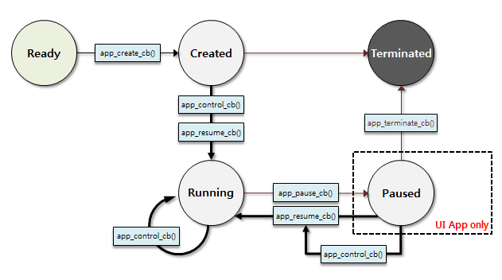
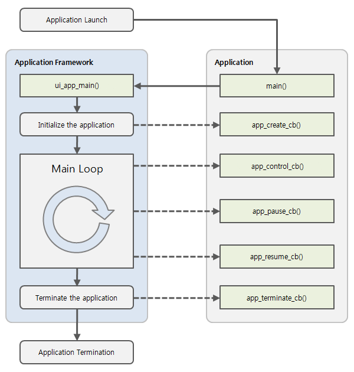

# Applications

A Tizen native application is similar to a conventional Linux application, with some additional features optimized for TV, IoT, and other devices. The additional features have constraints, such as a relatively small screen size and lack of system resources compared to a larger system. For example, for power management reasons, the application can take actions to reduce usage when it finds out that it has its display window covered over by another application window. State change events are delivered to make it possible to detect these situations.

## Native Application Models

Tizen provides various application models to allow you to create applications targeted for specific tasks:

- [Service Applications](service-app.md)

  The service application is a Tizen native application without a graphical user interface that runs in the background. They can be very useful in performing activities (such as getting sensor data in the background) that need to run periodically or continuously, but do not require any user intervention.

- [Component Based Applications](component-based-app.md)

  The component based application provides a way to implement multiple model applications. It means you can provide multiple service components and multiple frame components in one application process. The frame component has a window and a lifecycle to manage user interfaces. The service component does not have a window and runs in the background. Every registered component can create multiple instances.

## Native Application Life-Cycle

The Tizen Native application model handles application life-cycle and system events. Tizen native application life-cycle is handled by the [Application API](../../api/common/latest/group__CAPI__APPLICATION__MODULE.html). It provides functions to manage the main event loop, the application state change events, and basic system events.

Tizen supports both UI applications (which have a graphical user interface) and service applications (which have no graphical user interface). The UI and service applications can be packaged together, if necessary; however, a combined application package must contain only one UI application, while it can have several service applications.

Applications in the same package follow the same installation life-cycle, which is handled by the application package manager. Each application in the package follows its own application life-cycle. Each application (UI application or service application) in an application package can be identified by its own ID.

<a name="state_change"></a>
## Native Application State Change Callbacks

A Tizen native application can be in one of several different states. Typically, the application is launched by the user from the Launcher, or by another application. When the application is starting, the `app_create_cb()` function is executed and the main event loop starts. The application is normally at the top of the window, with focus.

When the application loses the focus status, the `app_pause_cb()` callback is invoked. The application can go into the pause state, which means that your application is not terminated but continues to run in the background, when:

- A new application is launched by the request of your application.
- The user requests to go to the home screen.
- A system event (such as an incoming phone call) occurs and causes a resident application with a higher priority to become active and temporarily hide your application.
- An alarm is triggered for another application, which becomes the topmost window and hides your application.

Since Tizen 2.4, an application in the background goes into a suspended state. In the suspended state, the application process is executed with limited CPU resources. In other words, the platform does not allow the running of the background applications, except for some exceptional applications (such as Media and Download) that necessarily work in the background. In this case, the application can [designate their background category as an allowed category](#allow_bg) to avoid going into the suspended state.

When your application becomes visible again, the `app_resume_cb()` callback is invoked. The visibility returns, when:

- Another application requests your application to run (for example, the Task Navigator, which shows all running applications and lets the user select any application to run).
- All applications on top of your application in the window stack finish.
- An alarm is triggered for your application, bringing it to the front and hiding other applications.

> **Note**
>
> From Tizen 5.5, you can get the display state by using the `app_get_display_state()` function when the `app_resume_cb()` callback or the `app_pause_cb()` callback is invoked.

When your application starts exiting, the `app_terminate_cb()` callback is invoked. Your application can start the termination process, when:

- Your application itself requests to exit by calling the `ui_app_exit()` or `service_app_exit()` function to terminate the event loop.
- The low memory killer is killing your application in a low memory situation.

The following figure shows the UI and service application states.

**Figure: UI and service application states**



Because a service application has no UI, neither does it have a pause state. Since Tizen 2.4, a service application can go into the suspended state. Basically, the service application is running in the background by its nature; so the platform does not allow running the service application unless the application has a background category defined in its manifest file. However, when the UI application that is packaged with the service application is running on the foreground, the service application is also regarded as a foreground application and it can be run without a designated background category.

Application state changes are managed by the underlying framework. For more information on application state transitions, see [Application States and Transitions](#state_trans).

<a name="state_trans"></a>
## Application States and Transitions

The Tizen Native application can be in one of several different [application states](#state_change).

The Application API defines 5 states with corresponding transition handlers. A state transition callback is triggered after each state change, whenever the application is created, starts running, or is paused, resumed, or terminated. The application must react to each state change appropriately.

**Table: Application states**

| State        | Description                              |
|--------------|------------------------------------------|
| `READY`      | Application is launched.                 |
| `CREATED`    | Application starts the main loop.        |
| `RUNNING`    | Application is running and visible to the user. |
| `PAUSED`     | Application is running but invisible to the user. |
| `TERMINATED` | Application is terminated.               |

The following figure illustrates the application state transitions.

**Figure: Application state transitions**



<a name="allow_bg"></a>
## Background Categories

Since Tizen 2.4, an application is not allowed to run in the background except when it is explicitly declared to do so. The following table lists the background categories that allow an application to run in the background.

<a name="allow_bg_table"></a>
**Table: Allowed background application policy**

| Background category            | Description                              | Related APIs                             | Manifest file \<background-category\> element value |
|--------------------------------|------------------------------------------|------------------------------------------|------------------------------------------|
| Media                          | Playing audio, recording, and outputting streaming video in the background | [Multimedia API](../../api/common/latest/group__CAPI__MEDIA__FRAMEWORK.html) | `media`                                  |
| Download                       | Downloading data with the Tizen Download-manager API | [Download API](../../api/common/latest/group__CAPI__WEB__DOWNLOAD__MODULE.html) | `download`                               |
| Background network             | Processing general network operations in the background (such as sync-manager, IM, and VOIP) | [Sync Manager API](../../api/common/latest/group__CAPI__SYNC__MANAGER__MODULE.html), Socket, and [Curl API](../../api/common/latest/group__OPENSRC__CURL__FRAMEWORK.html) | `background-network`                     |
| Location                       | Processing location data in the background | [Location API](../../api/common/latest/group__CAPI__LOCATION__FRAMEWORK.html) | `location`                               |
| Sensor (context)               | Processing context data from the sensors, such as gesture | [Sensor API](../../api/common/latest/group__CAPI__SYSTEM__SENSOR__MODULE.html) | `sensor`                                 |
| IoT Communication/Connectivity | Communicating between external devices in the background (such as Wi-Fi and Bluetooth) | [Wi-Fi](../../api/common/latest/group__CAPI__NETWORK__WIFI__PACKAGE.html) and [Bluetooth API](../../api/common/latest/group__CAPI__NETWORK__BLUETOOTH__MODULE.html) | `iot-communication`                      |

  > **Note**
  >
  > Since Tizen 4.0, even if the background network category is declared, the running application stops if the network is not connected.

### Describing the Background Category

An application with a background running capability must declare the background category in its manifest file:

```
<?xml version="1.0" encoding="utf-8"?>
<manifest xmlns="http://tizen.org/ns/packages" api-version="2.4" package="org.tizen.test" version="1.0.0">
   <ui-application appid="org.tizen.test" exec="text" type="capp" multiple="false" taskmanage="true" nodisplay="false">
      <icon>rest.png</icon>
      <label>rest</label>
      <!--For API version 2.4 and higher-->
      <background-category value="media"/>
      <background-category value="download"/>
      <background-category value="background-network"/>
   </ui-application>
   <service-application appid="org.tizen.test-service" exec="test-service" multiple="false" type="capp">
      <background-category value="background-network"/>
      <background-category value="location"/>
   </service-application>
</manifest>
```

> **Note**
>
> The `<background-category>` element is supported since the API version 2.4. An application with a `<background-category>` element declared can fail to be installed on devices with a Tizen version lower than 2.4. In this case, declare the background category as `<metadata key="http://tizen.org/metadata/background-category/<value>"/>`.
> ```
> <?xml version="1.0" encoding="utf-8"?>
> <manifest xmlns="http://tizen.org/ns/packages" api-version="2.3" package="org.tizen.test" version="1.0.0">
>    <ui-application appid="org.tizen.test" exec="text" type="capp" multiple="false" taskmanage="true" nodisplay="false">
>       <icon>rest.png</icon>
>       <label>rest</label>
>       <!--For API version lower than 2.4-->
>       <metadata key="http://tizen.org/metadata/background-category/media"/>
>       <metadata key="http://tizen.org/metadata/background-category/download"/>
>       <metadata key="http://tizen.org/metadata/background-category/background-network"/>
>    </ui-application>
>    <service-application appid="org.tizen.test-service" exec="test-service" multiple="false" type="capp">
>       <metadata key="http://tizen.org/metadata/background-category/background-network"/>
>       <metadata key="http://tizen.org/metadata/background-category/location"/>
>    </service-application>
> </manifest>
> ```
>
> The `<metadata key="http://tizen.org/metadata/bacgkround-category/<value>"/>` element has no effect on Tizen 2.3 devices, but on Tizen 2.4 and higher devices, it has the same effect as the `<background-category>` element.

The background category of your application can be specified in the [application project settings](../../guides/development/setting-properties.md#manifest) in Tizen Studio.

## Related Information
- Dependencies
  - Since Tizen 2.4
- API References
  - [UI Applications](../../api/common/latest/group__CAPI__APPLICATION__MODULE.html)
  - [Service Applications](../../api/common/latest/group__CAPI__SERVICE__APP__MODULE.html)
  - [Component Based Applications](../../api/common/latest/group__COMPONENT__BASED__APPLICATION__MODULE.html)
