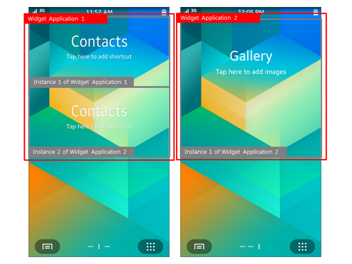
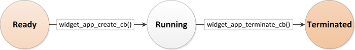
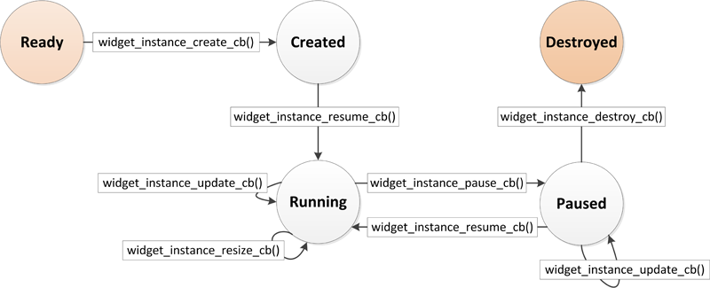
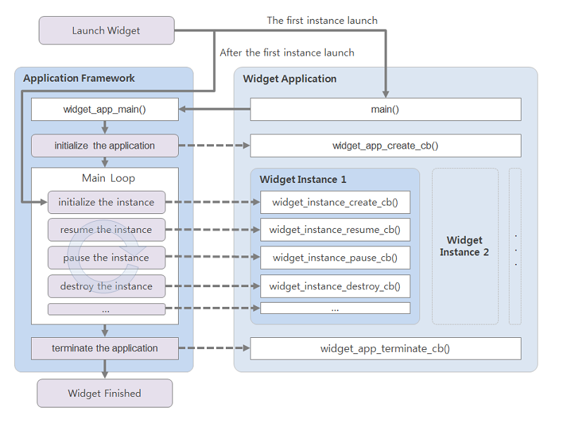

# EFL Widget Application


You can create widget applications, which are Tizen native applications shown on the home screen. They are launched by the home screen when the user selects them in the **Add Widget** menu.

The main features of the Widget Application API include:

- Creating widget applications

  You can [create a widget application](#create), which usually has 1 process for maintaining the main loop. Within the process, the framework can [create multiple widget instances](#app_instance) that can share the same resources.

  The widget application can also [share data](#share) with other applications.

- Managing multiple widget instances

  Whenever a widget instance is requested, the framework creates one. You can [manage the widget instances](#get_instance) by updating or destroying them, or by retrieving information about them.

- Managing the life-cycles

  You can manage the [widget application](#app) and [widget instance](#instance) life-cycles through callbacks that are triggered as the application or instance state changes.

- Creating the widget UI

  The widget application can [draw a UI on the home screen](#get_window).

  > **Note**
  >
  > The widget application UI has a limitation with the scroll action to provide a better user experience. Design the widget UI to display all the information within the given area of the screen points.
  >
  > To draw the UI, use a single window that is returned by the `widget_app_get_elm_win()` function. Do not create additional windows. A stack of widget application windows gets corrupted, because the platform handles the widget application window in a special way.

<a name="app_instance"></a>
## Widget Application and Widget Instance

The widget application provides a life-cycle and methods for making and managing a widget class. It consists of 1 process and makes the widget class in the `widget_app_create()` callback function. With this class, the framework can make instances whenever applications for widget viewers, such as home screen and lock screen, request for a widget instance.

The widget instance has its own life-cycle similar to the widget application. However, the widget instance is only an object shown by the applications for widget viewers. Many widget instances can be running on the same widget application process.

**Figure: Each widget application has 1 or more widget instances**



<a name="app"></a>
## Widget Application States and Events

The following figure illustrates the widget application states during the application life-cycle:

- When the application is launched, it is in the Ready state.
- When the application is running in the background, it is in the Running state.
- When the application exits, it is in the Terminated state.

**Figure: Widget application life-cycle**



The following table lists the callbacks you can use as the application state changes.

**Table: Application state change callbacks**

| Callback                    | Description                              |
|-----------------------------|------------------------------------------|
| `widget_app_create_cb()`    | Called before the main loop of the application starts. |
| `widget_app_terminate_cb()` | Called after the main loop of the application exits. |

<a name="instance"></a>
## Widget Instance States and Events

The following figure illustrates the widget instance states during the instance life-cycle:

- When the application is in the Ready state, the instance does not exist.
- When the instance is created, it is in the Created state.
- When the instance is visible, it is in the Running state.
- When the instance is invisible, it is in the Paused state.
- When the instance is destroyed, it is in the Destroyed state.

**Figure: Widget instance life-cycle**



The following table lists the [callbacks you can use as the instance state changes](#life-cycle).

**Table: Instance state change callbacks**

| Callback                       | Description                              |
|--------------------------------|------------------------------------------|
| `widget_instance_create_cb()`  | Called after the widget instance is created. |
| `widget_instance_destroy_cb()` | Called before the widget instance is destroyed. |
| `widget_instance_pause_cb()`   | Called when the widget is invisible.     |
| `widget_instance_resume_cb()`  | Called when the widget is visible.       |
| `widget_instance_resize_cb()`  | Called before the widget size is changed. |
| `widget_instance_update_cb()`  | Called when an event for updating the widget is received. |

To register widget instance callbacks, use the `widget_app_class_create()` function within the `widget_app_create_cb()` callback function:

```
static widget_class_h
widget_app_create(void *user_data)
{
    widget_instance_lifecycle_callback_s ops = {
        .create = widget_instance_create,
        .destroy = widget_instance_destroy,
        .pause = widget_instance_pause,
        .resume = widget_instance_resume,
        .update = widget_instance_update,
        .resize = widget_instance_resize,
    };

    return widget_app_class_create(ops, user_data);
}
```

When the widget launch is requested for the first time, the widget application is initialized and the widget instance is created only after the initialization. If there are additional launch requests for the same widget, a new widget instance for those is created directly, since the widget application has already been initialized.

**Figure: Launching widget instances**



## Prerequisites

To enable your application to use the widget functionality:

1. To use the functions and data types of the Widget Application API (in [mobile](../../api/mobile/latest/group__CAPI__WIDGET__APP__MODULE.html) and [wearable](../../api/wearable/latest/group__CAPI__WIDGET__APP__MODULE.html) applications), include the `<widget_app.h>` and `<widget_app_efl.h>` header files in your application:
   ```
   #include <widget_app.h>
   #include <widget_app_efl.h>
   ```

2. Edit the widget application settings in the [manifest](../../../tizen-studio/native_tools/manifest-text-editor.md#widget_app) file.

<a name="create"></a>
## Creating the Widget Application

The widget application starts with the `main()` function, which creates and initializes the application. The `widget_app_main()` function is used to start the application event loop. Before calling this function, set up the `widget_app_lifecycle_callback_s` structure variable, which is passed to the function.

To create the widget application:

1. Start and initialize the application with the `main()` function.

   Set up the `widget_app_lifecycle_callback_s` structure variable for the widget application life-cycle callbacks, define the functions themselves (`widget_app_create()` for initialization and `widget_app_terminate()` for termination), and call the `widget_app_main()` function to start the application event loop.

   ```
   int
   main(int argc, char *argv[])
   {
       widget_app_lifecycle_callback_s ops = {0,};
       int ret;

       ops.create = widget_app_create;
       ops.terminate = widget_app_terminate;

       ret = widget_app_main(argc, argv, &ops, NULL);
       if (ret != WIDGET_ERROR_NONE)
           dlog_print(DLOG_ERROR, LOG_TAG, "widget_app_main() failed. err = %d", ret);

       return ret;
   }
   ```

2. Use the `widget_app_create()` life-cycle function to initialize any resources that can be shared among widget instances. This function is called before the main event loop starts.
    ```
    widget_class_h
    widget_app_create(void *user_data)
    {
        /* Hook to take necessary actions before main event loop starts */
        widget_instance_lifecycle_callback_s obj_callback = {0,};
        app_event_handler_h handlers[5] = {NULL,};

        /* Register the callback functions for the widget instance life-cycle */
    ```

3. Register the callback functions for the system events.

   At the end of the `widget_app_create()` function, remember to create a widget instance class and return a handle for it, so that the handle can be used for making widget instances.

   ```
       /* Register the callback functions for system events */
       widget_app_add_event_handler(&handlers[APP_EVENT_LOW_BATTERY], APP_EVENT_LOW_BATTERY,
                                    widget_app_low_battery, NULL);
       widget_app_add_event_handler(&handlers[APP_EVENT_LOW_MEMORY], APP_EVENT_LOW_MEMORY,
                                    widget_app_low_memory, NULL);
       widget_app_add_event_handler(&handlers[APP_EVENT_LANGUAGE_CHANGED], APP_EVENT_LANGUAGE_CHANGED,
                                    widget_app_lang_changed, NULL);
       widget_app_add_event_handler(&handlers[APP_EVENT_REGION_FORMAT_CHANGED],
                                    APP_EVENT_REGION_FORMAT_CHANGED, widget_app_region_changed, NULL);

       return widget_app_class_create(obj_callback, user_data);
   }
   ```

   When the system-related callback are no longer needed, remove them with the `widget_app_remove_event_handler()` function.

4. Define the callback functions for the system events:

   ```
   void
   widget_app_lang_changed(app_event_info_h event_info, void* user_data)
   {
       /* Take actions when language setting changes and messages must be translated */
       char *locale = NULL;
       app_event_get_language(event_info, &locale);
       elm_language_set(locale);
       free(locale);
   }

   void
   widget_app_region_changed(app_event_info_h event_info, void* user_data)
   {
       /* Take actions when the time zone changes */
   }

   void
   widget_app_low_battery(app_event_info_h event_info, void* user_data)
   {
       /* Take actions when system is running low on battery (less than 5%) */
       /* Save the work and avoid battery-intensive processes */
       widget_app_exit();
   }

   void
   widget_app_low_memory(app_event_info_h event_info, void* user_data)
   {
       /* Take actions when system is running on low memory */
       /* Save the work and release resources; if necessary, some apps can be killed */
       widget_app_exit();
   }
   ```

5. When you no longer need the widget application, release the resources and terminate the application:

   ```
   static void
   widget_app_terminate(void *user_data)
   {
       /* Release all resources */
   }
   ```

<a name="life-cycle"></a>
## Managing Widget Instance Life-cycle Callbacks

To manage the widget instance life-cycle:

1. Define the widget instance life-cycle callbacks:

   - This callback is triggered when the widget instance is created.

     Initialize resources for this widget instance and [draw the UI](#get_window). If bundle content is not `NULL`, restore the previous status.

     ```
     int
     widget_instance_create(widget_context_h context, bundle *content, int w, int h, void *user_data)
     {
         widget_instance_data_s *wid = (widget_instance_data_s*)malloc(sizeof(widget_instance_data_s));
         int ret;

         if (content != NULL)
             /* Recover the previous status with the bundle object */

         /* Create the UI */

         return WIDGET_ERROR_NONE;
     }
     ```

   - This callback is triggered when the widget instance is destroyed.

     Release all widget resources. If the `reason` for the termination is not `WIDGET_APP_DESTROY_TYPE_PERMANENT`, store the current status with the incoming bundle.

     ```
     int
     widget_instance_destroy(widget_context_h context, widget_app_destroy_type_e reason,
                             bundle *content, void *user_data)
     {
         if (reason != WIDGET_APP_DESTROY_TYPE_PERMANENT)
             /* Save the current status at the bundle object */

         return WIDGET_ERROR_NONE;
     }
     ```

   - This callback is triggered when the widget instance is paused.

     Take the necessary actions when the widget instance becomes invisible. The framework can destroy a paused widget instance.

     ```
     int
     widget_instance_pause(widget_context_h context, void *user_data)
     {
         return WIDGET_ERROR_NONE;
     }
     ```

   - This callback is triggered when the widget instance is resumed.

     Take the necessary actions when the widget instance becomes visible.

     ```
     int
     widget_instance_resume(widget_context_h context, void *user_data)
     {
         return WIDGET_ERROR_NONE;
     }
     ```

   - This callback is triggered before the widget instance is resized.

     Take the necessary actions to accommodate the new size.

     ```
     int
     widget_instance_resize(widget_context_h context, int w, int h, void *user_data)
     {
         return WIDGET_ERROR_NONE;
     }
     ```

   - This callback is triggered when a widget update event is received.

     Take the necessary actions for the widget update. If the `force` parameter is `true`, the widget can be updated even in the pause state.

     ```
     int
     widget_instance_update(widget_context_h context, bundle *content, int force, void *user_data)
     {
         return WIDGET_ERROR_NONE;
     }
     ```

2. Register the callbacks in the `widget_instance_lifecycle_callback_s` structure during the widget application initialization:
   ```
   widget_class_h
   widget_app_create(void *user_data)
   {
       widget_instance_lifecycle_callback_s obj_callback = {0,};
       /* Register the callback functions */
       obj_callback.create = widget_instance_create;
       obj_callback.destroy = widget_instance_destroy;
       obj_callback.pause = widget_instance_pause;
       obj_callback.resume = widget_instance_resume;
       obj_callback.resize = widget_instance_resize;
       obj_callback.update = widget_instance_update;

       /* Register system-related callbacks */

       return widget_app_class_create(obj_callback, user_data);
   }
   ```

<a name="get_window"></a>
## Drawing the Widget UI

To draw the widget UI, you must get a window object with the `widget_app_get_elm_win()` function and create the UI on the home screen:

```
struct widget_instance_data {
    Evas_Object *win;
    Evas_Object *conform;
    Evas_Object *label;
};
typedef struct widget_instance_data widget_instance_data_s;

static int
widget_instance_create(widget_context_h context, bundle *content, int w, int h, void *user_data)
{
    widget_instance_data_s *wid = (widget_instance_data_s*)malloc(sizeof(widget_instance_data_s));

    int ret;
    if (content != NULL)
        /* Recover the previous status with the bundle object */

    /* Window */
    ret = widget_app_get_elm_win(context, &wid->win);
    if (ret != WIDGET_ERROR_NONE) {
        dlog_print(DLOG_ERROR, LOG_TAG, "failed to get window. err = %d", ret);

        return WIDGET_ERROR_FAULT;
    }

    evas_object_resize(wid->win, w, h);

    /* Conformant */
    wid->conform = elm_conformant_add(wid->win);
    evas_object_size_hint_weight_set(wid->conform, EVAS_HINT_EXPAND, EVAS_HINT_EXPAND);
    elm_win_resize_object_add(wid->win, wid->conform);
    evas_object_show(wid->conform);

    /* Label */
    wid->label = elm_label_add(wid->conform);
    evas_object_resize(wid->label, w, h / 3);
    evas_object_move(wid->label, 0, h / 3);
    evas_object_show(wid->label);
    elm_object_text_set(wid->label, "Hello widget");

    /* Show the window after the base GUI is set up */
    evas_object_show(wid->win);

    widget_app_context_set_tag(context, wid);

    return WIDGET_ERROR_NONE;
}

int
widget_instance_destroy(widget_context_h context, widget_app_destroy_type_e reason,
                        bundle *content, void *user_data)
{
    if (reason != WIDGET_APP_DESTROY_TYPE_PERMANENT)
        /* Save the current status at the bundle object */

    widget_instance_data_s *wid = NULL;
    widget_app_context_get_tag(context, (void**)&wid);

    if (wid->win)
        evas_object_del(wid->win);

    free(wid);

    return WIDGET_ERROR_NONE;
}
```

<a name="get_instance"></a>
## Managing the Widget Instance

To manage the widget instance:

1. You can set a customized widget instance with the `widget_app_context_set_tag()` function when the instance is created. To update or destroy the customized widget, get the instance with the `widget_app_context_get_tag()` function.
    ```
    struct _user_defined_s {
        int val1;
    };
    typedef struct _user_defined_s user_defined_s;

    int
    widget_instance_create(widget_context_h context, bundle *content, int w, int h, void *user_data)
    {
        user_defined_s *uds = (user_defined_s*)malloc(sizeof(user_defined_s));
        uds->val1 = 0;
        widget_app_context_set_tag(context, uds);
    }

    int
    widget_instance_destroy(widget_context_h context, widget_destroy_type_e reason,
                            bundle *content, void *user_data)
    {
        user_defined_s *uds = NULL;
        widget_app_context_get_tag(context, (void**)&uds);
        free(uds);
    }

    int
    widget_instance_update(widget_context_h context, bundle *content, int force, void *user_data)
    {
        user_defined_s *uds = NULL;
        widget_app_context_get_tag(context, (void**)&uds);
        uds->val1 = 1;
    }
    ```
2. Get the widget instance ID:

   ```
   int
   widget_instance_update(widget_context_h context, bundle *content, int force, void *user_data)
   {
       const char *inst_id = NULL;
       inst_id = widget_app_get_id(context);
   }
   ```

<a name="share"></a>
## Data Sharing Between the Widget Application and Other Applications

You can share data between widget applications and UI (or service) applications. However, you must understand that this kind of data sharing is dependent on the file system. The reason is that the system (Home screen) controls the widget application life-cycle, while the UI application life-cycle is mostly explicitly controlled by the user.

For example, consider the differences between a Weather application and a Weather widget:

- The Weather application is launched when user selects it from the application list.
- The widget is launched when the Home screen is on screen and is terminated when the Home screen is hidden.

Although the widget wants to share some data from the Weather application (such as the user's favorite city), it is ineffective for the widget to launch the Weather application every time to retrieve such data. This inefficiency makes it difficult to use typical IPC mechanisms, such as sockets and [message ports](message_port_n.htm), for which both the receiver and sender processes must be alive. To overcome this limitation, the widget application must use a communication method that stores data permanently somewhere in the system.

In the Tizen platform, applications in the same package (including widget applications) can access files in the `data` directory of the package installation path. This means that the UI (or service) application can first write files to the `data` directory, and the widget can later read them, or vice versa.

**Figure: Sharing through the data directory**


To manage data through the `data` directory:

- You can set and get data in the `data` directory using the Preference API functions (in [mobile](../../api/mobile/latest/group__CAPI__PREFERENCE__MODULE.html) and [wearable](../../api/wearable/latest/group__CAPI__PREFERENCE__MODULE.html) applications). You can use the functions to [store and retrieve key-value data](app_preferences_n.htm) in the `data` directory.

- You can share the `data` directory content with SQLite, by creating an SQLite database file in the `data` directory.

  The SQLite database has an advantage to the direct use of a file in error handling, such as journaling. Consequently, if the application must handle complex data rather than primitive values, [use SQLite to store and retrieve the data](../data/sql.htm).

If an application requires complex control over a widget, such as Music Player, it must implement a service application in the middle and use the Data Control API (in [mobile](../../api/mobile/latest/group__CAPI__DATA__CONTROL__MODULE.html) and [wearable](../../api/wearable/latest/group__CAPI__DATA__CONTROL__MODULE.html) applications).

For example, a music-player-service service application is needed to control the audio device, process audio files, and handle play and stop signals. The music-player-ui and music-player-widget applications display the UI controls, title, album art, and other content retrieved from the music-player-service service application. The service application can export its data using the Data Control to [provide data to the other applications](data_control.md) (widget and UI) simultaneously. The following figure illustrates the typical data control flows between the set of UI, service, and widget applications.

**Figure: Sharing through data control**


> **Note**
>
> For user convenience, a STANDALONE widget application package is not allowed in the Tizen Store.
>
> You can make a STANDALONE widget application in the Tizen Studio for test purposes. However, to publish it, you must combine it with at least 1 UI application in the package. For more information, see [Developing Multiple Projects as a Combined Package](../../tutorials/process//app-dev-process.md#develop).


## Related Information
- Dependencies
  - Tizen 2.4 and Higher for Mobile
  - Tizen 2.3.1 and Higher for Wearable
