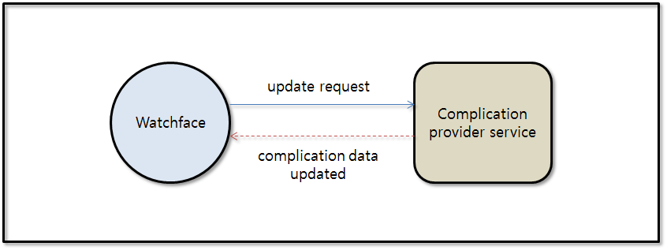
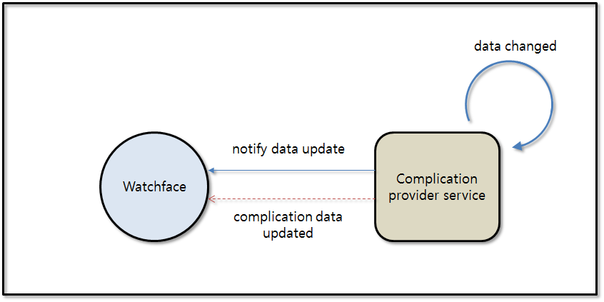
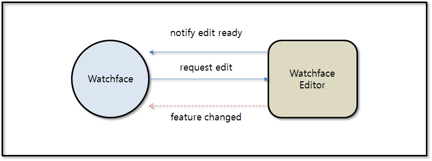

# Watch Face Complication

The complication shows key information from an application in an economical way. You can tap complications to open the corresponding application and see more detailed information.

The complication data is provided from the complication provider application and the watch face application decides how to display the complications using that data.
The watch face can select the complication and request to update the complication to the complication provider application.

There are two ways to update the complication data.

1. Watch Face can request to update complication data to complication provider application. The complication provider application receives the request and update the complication data. Then, the complication update callback is called in watch face.

    
 

2. If the complication data is changed, the complication provider application can notify to the watch face. If the complication received the notification, it requests to update automatically. Then, the update request comes to the complication provider. The complication provider must set the updated data in update requested callback. After the complication data is updated, the complication update callback is called in the watch face.

    
 

## Types of Watch Face Complication

The complication support type is the types of data that can be provided from complication provider.
The complication provider have to support at least one type. In addition, one complication provider can support multiple types.
Watch Face can set the complication support types to support specific type of complications.

The followings are types of watch face complication:

| Support type name | Mandatory data | Optional data   |
|-------------------|----------------|-----------------|
| short text type   | short text     | title           |
|                   |                | icon path       |
|                   |                | extra data      |
| long text type    | long text      | title           |
|                   |                | icon path       |
|                   |                | extra data      |
| ranged value type | min value      | title           |
|                   | max value      | short text      |
|                   | current value  | icon path       |
|                   |                | extra data      |
| image type        | image path     | extra data      |
| icon type         | icon path      | extra data      |
| time type         | timestamp      | short text      |
|                   |                | extra data      |
| empty             |                |                 |

 
## Prerequisites

1. To use the Watch Face Complication API, the application has to request permission by adding the following privilege to the `tizen-manifest.xml` file:

    ```xml
    <privileges>
    	<privilege>http://tizen.org/privilege/datasharing</privilege>
    	<privilege>http://tizen.org/privilege/appmanager.launch</privilege>
    </privileges>
    ```
 
2. To use the functions and data types for the Watch Face Complication API, include the `<watchface-complication.h>` header file in application:

    ```cpp
    #include <watchface-complication.h>
    ```

 
## Creating Watch Face Complication

Watch Face must create the complication handle to add the default complication.
You can choose the support types of complication that can be selected in the position of complication.
And also choose the touch event type that can be supported.


```cpp
{
	int ret;
	int comp_id = 1;
	complication_h complication;

	ret = watchface_complication_create(comp_id, "org.tizen.sample",
			WATCHFACE_COMPLICATION_TYPE_SHORT_TEXT,
			WATCHFACE_COMPLICATION_TYPE_SHORT_TEXT|WATCHFACE_COMPLICATION_TYPE_ICON,
			WATCHFACE_COMPLICATION_EVENT_TAP, &complication);
}
```

The default **provider id** and **type** are the items to set for initial display. As the default provider they must not be `null`.
If they are null, the complication receives an error. Also, if you select the other provider and type, that they are no longer used.
 
  
## Updating Complication Data

To receive the updated complication data, `watchface_complication_updated_cb()` must be added in the watch face by using `watchface_complication_add_updated_cb()`. And, if complication provider is not available (disabled, uninstalled), `watchface_complication_error_cb()` is called. In this case, watch face can add fallback logic in error callback such as display error message or launch editor interface.

```cpp
void _watchface_complication_updated_cb(int complication_id,
		const char *provider_id,
		watchface_complication_type_e type,
		const bundle *data, void *user_data)
{
}

void _watchface_complication_error_cb)(
		int complication_id,
		const char *provider_id,
		watchface_complication_type_e type,
		watchface_complication_error_e error,
		void *user_data)
{
}

static void _init_complication()
{
	watchface_complication_add_updated_cb(complication,
		_watchface_complication_updated_cb,
		_watchface_complication_error_cb,  NULL);
} 
```
 
When the complication provider data is updated, `watchface_complication_updated_cb()` is called.
Watch Face can get the information from the bundle parameter of callback by using `watchface_complication_data_get_*`.

To get the complication provider data, the following functions can be used:


| Function name | Data type |
|---------------|-----------|
| `watchface_complication_data_get_type()` | watchface complication type |
| `watchface_complication_data_get_short_text()` | short text |
| `watchface_complication_data_get_long_text()` | long text |
| `watchface_complication_data_get_title()` | title text |
| `watchface_complication_data_get_timestamp()` | timestamp |
| `watchface_complication_data_get_image_path()` | image path |
| `watchface_complication_data_get_ranged_value()` | min / max / current value |
| `watchface_complication_data_get_icon_path()` | icon path |
| `watchface_complication_data_get_extra_data()` | extra data |

```cpp
void _watchface_complication_updated_cb(int complication_id,
		const char *provider_id,
		watchface_complication_type_e type,
		const bundle *data, void *user_data)
{
	char *shorttext;
	if (type == WATCHFACE_COMPLICATION_TYPE_SHORT_TEXT)
		watchface_complication_data_get_short_text(data, &shorttext);
}
```


If the callback is not used any more, it must be removed by using `watchface_complication_remove_updated_cb()`:

```cpp
{
	watchface_complication_remove_updated_cb(complication,
		_watchface_complication_updated_cb);
}
```


If the watch face wants the updated complication data, watch face can request to update the data to the complication provider:

```cpp
{
	watchface_complication_send_update_request(complication);
}
```


## Specifying to Support only Specific Complication Provider

Watch Face can support the specific complication provider by using `allowed_list`.
In This case, watch face supports complications only in allowed complication list:

```cpp
{
	complication_allowed_list_h allowed_list;

	watchface_complication_allowed_list_create(&allowed_list); 
	watchface_complication_allowed_list_add(allowed_list, "PROVIDER_ID_1", 
			WATCHFACE_COMPLICATION_TYPE_SHORT_TEXT); 
	watchface_complication_allowed_list_add(allowed_list, "PROVIDER_ID_2", 
			WATCHFACE_COMPLICATION_TYPE_SHORT_TEXT); 
	watchface_complication_allowed_list_apply(complication, allowed_list);

	watchface_complication_allowed_list_destroy(allowed_list);
}
```


## Watch Face Edit with Editable Feature

The watch face application can provide the changeable features (such as, complication, color, font, and so on) with watch face editable APIs.

The features can be changed by watch face editor application:




1. To use the functions and data types for the Watch Face Editable API, include the `<watchface-editable.h>` header file in your application:

    ```cpp
    #include <watchface-editable.h>
    ```

2. When the editor is ready to edit, it notifies that it is ready. To receive the notification from the editor, `watchface_editable_edit_ready_cb()` must be added:

    ```cpp
    void _watchface_editable_edit_ready_cb(watchface_editable_container_h handle,
    		const char *editor_appid,
    		void *user_data)
    {
    }

    {
    	watchface_editable_add_edit_ready_cb(_watchface_editable_edit_ready_cb, NULL);
    }
    ```
 
3. Watch Face can create the `complication_candidates_list_h` to identify the editable features to request to editor.
Watch Face can request to edit the features by using `watchface_editable_request_edit()`.

4. The watch face editor can draw highlight to give the information about editing.
To inform the position of editable features, `watchface_editable_highlight_h` must be used.
The highlight handle can be created by `watchface_editable_highlight_create()` with watch face shape type.

    The following are shape types:

    | Shape types | Description |
    |-------------|-------------|
    | `WATCHFACE_EDITABLE_SHAPE_TYPE_CIRCLE` | circle |
    | `WATCHFACE_EDITABLE_SHAPE_TYPE_RECT` | rectangle |


    The position of editable feature can be set by using `watchface_editable_highlight_set_geometry()`.
    The parameters of this function means the position(x,y) and size(width, height).


    >**Note**
    >
    >`watchface_editable_highlight_h` must be released. It can be released by using `watchface_editable_highlight_destroy()`.


5. According to the editable feature, `watchface_editable_add_design_element()` and `watchface_editable_add_complication()` are used to add editable features to the `watchface_editable_container_h`.


    ```cpp
    static void _watchface_editable_edit_ready_cb(watchface_editable_container_h handle,
    		const char *editor_appid, void *user_data)
    {
    	bundle *candidate1;
    	bundle *candidate2;
    	complication_h comp;
    	watchface_editable_highlight_h hi;
    	complication_candidates_list_h candidates_list = NULL;

    	watchface_editable_candidates_list_create(&candidates_list);

    	candidate1 = bundle_create();
    	bundle_add_str(candidate1, "TEST_COLOR", "RED");
    	watchface_editable_candidates_list_add(candidates_list, candidate1);
    	bundle_free(candidate1);

    	candidate2 = bundle_create();
    	bundle_add_str(candidate2, "TEST_COLOR", "YELLOW");
    	watchface_editable_candidates_list_add(candidates_list, candidate2);
    	bundle_free(candidate2);

    	watchface_editable_highlight_create(&hi, WATCHFACE_EDITABLE_SHAPE_TYPE_CIRCLE);
    	watchface_editable_highlight_set_geometry(hi, 50, 50, 100, 100);
    	watchface_editable_add_design_element(handle, COLOR_EDIT, cur_idx, candidates_list, hi, "Color");
    	watchface_editable_highlight_destroy(hi);

    	watchface_editable_candidates_list_destroy(list_handle);

    	watchface_editable_highlight_create(&hi, WATCHFACE_EDITABLE_SHAPE_TYPE_CIRCLE);
    	watchface_editable_highlight_set_geometry(hi, 100, 100, 100, 100);
    	watchface_editable_add_complication(handle, comp_id, comp, hi);
    	watchface_editable_highlight_destroy(hi);

    	watchface_editable_request_edit(handle, _watchface_editable_update_requested_cb, user_data);
    }
    ```

6. If some features are changed from editor, `watchface_editable_update_requested_cb()` is called.
Watch Face can verify the `watchface_editable_edit_state_e` from the parameter of that callback to get the edit state.

    The following are the edit state:

    | Edit state | Description |
    |------------|-------------|
    | `WATCHFACE_EDITABLE_EDIT_STATE_COMPLETE` | edit complete |
    | `WATCHFACE_EDITABLE_EDIT_STATE_ONGOING` | ongoing edit |
    | `WATCHFACE_EDITABLE_EDIT_STATE_CANCEL` | edit canceled |

    ```cpp
    static void _watchface_editable_update_requested_cb(const watchface_editable_h handle,
    		int selected_idx,
    		const watchface_editable_edit_state_e state,
    		void *user_data)
    {
    	bundle *data;
    	int ed_id;

    	watchface_editable_get_current_data(handle, &data);
    	watchface_editable_get_editable_id(handle, &ed_id);

    }
    ```


## Transferring Touch Event

Complication can provide additional action for touching when the complication is touched.
To trigger the complication touch action, watch face must transfer the touch event to complication provider when the complication is touched.

The following are event types:

| Event type | Description |
|------------|-------------|
| `WATCHFACE_COMPLICATION_EVENT_NONE` | The complication is not tapped. |
| `WATCHFACE_COMPLICATION_EVENT_TAP` | The complication is tapped. |
| `WATCHFACE_COMPLICATION_EVENT_DOUBLE_TAP` | The complication is double tapped. |

Watch Face transfers by using `watchface_complication_transfer_event()`:

```cpp
void _on_complication_clicked(complication_h handle)
{
	watchface_complication_transfer_event(handle, WATCHFACE_COMPLICATION_EVENT_TAP);
}
```

## Related Information
- Dependencies
  - Tizen 5.0 and Higher for Wearable
