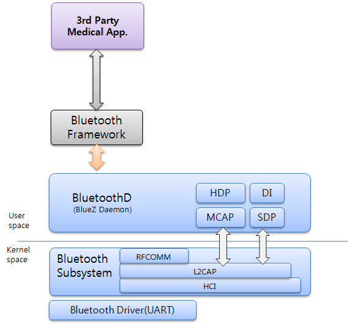

# Bluetooth


Tizen enables you to use Bluetooth functionalities, such as managing the local Bluetooth adapter, bonding, and exchanging data between Bluetooth-enabled devices. The Bluetooth standard provides a peer-to-peer (P2P) data exchange functionality over short distance between compliant devices.

**Figure: Bluetooth connections**


The main features of the Bluetooth API include:

- Managing the local Bluetooth adapter

  The Bluetooth Adapter API (in [mobile](../../api/mobile/latest/group__CAPI__NETWORK__BLUETOOTH__ADAPTER__MODULE.html) and [wearable](../../api/wearable/latest/group__CAPI__NETWORK__BLUETOOTH__ADAPTER__MODULE.html) applications) provides functions for setting up Bluetooth and discovering other devices. The API is used to control the Bluetooth adapter: you must [enable the adapter](#enable) before any other Bluetooth actions, and when you no longer need it, disable it to save device power. You can [check and monitor the adapter state](#state).

  You can control the visibility of the device, meaning whether its name appears to others searching for Bluetooth devices. In addition, you can discover neighboring Bluetooth devices. This process is asynchronous, so you must build and hold the list of devices in the neighborhood.

- Discovering devices

  The Bluetooth Device API (in [mobile](../../api/mobile/latest/group__CAPI__NETWORK__BLUETOOTH__DEVICE__MODULE.html) and [wearable](../../api/wearable/latest/group__CAPI__NETWORK__BLUETOOTH__DEVICE__MODULE.html) applications) provides functions for managing bonds with other devices and searching for supported services. The API is used to handle the connection with other devices and to search for services available on remote devices.

  You can [discover other Bluetooth devices](#find). The device discovery process can retrieve multiple types of Bluetooth devices, such as printers, mobile phones, and headphones.

- Creating a bond with a Bluetooth device

  You can create a bond with another device with the Bluetooth Device API. Bonding allows the 2 devices to establish a connection.

  Connected devices exchange keys needed for encrypted communication, but each connection has to be approved by the latest application user. You can also set authorization of other devices. Authorized devices are connected automatically without the latest user being asked for authorization.

- Connecting to and exchanging data with a Bluetooth device using a Bluetooth socket

  The Bluetooth Socket API (in [mobile](../../api/mobile/latest/group__CAPI__NETWORK__BLUETOOTH__SOCKET__MODULE.html) and [wearable](../../api/wearable/latest/group__CAPI__NETWORK__BLUETOOTH__SOCKET__MODULE.html) applications) provides functions for managing connections to other devices and exchanging data. The API is used for exchanging data between 2 Bluetooth devices, where your device can have the role both of a server (service provider) and client (service user). The connection creation process depends on the role. After the connection is established, the processes for exchanging data and disconnecting are the same for both roles.

  When you attempt to open a connection to another device, a Service Discovery Protocol (SDP) look-up is performed on the device, and the protocol and channel to be used for the connection are determined. If a connection is established and the socket is opened successfully, a `BluetoothSocket` instance with an open state is returned. The socket is subsequently used for exchanging data between the connected devices.

  You can use Serial Port Profile (SPP) operations to [connect to other devices](#connect), [exchange data](#exchange), and [disconnect from connected devices](#disconnect).

- Connecting to audio devices with Bluetooth

  Connect to Bluetooth audio devices, such as headset, hand-free, and headphone using the Bluetooth Audio API (in [mobile](../../api/mobile/latest/group__CAPI__NETWORK__BLUETOOTH__AUDIO__MODULE.html) and [wearable](../../api/wearable/latest/group__CAPI__NETWORK__BLUETOOTH__AUDIO__MODULE.html) applications).

- Handling attributes with Bluetooth GATT

  The Bluetooth GATT API (in [mobile](../../api/mobile/latest/group__CAPI__NETWORK__BLUETOOTH__GATT__MODULE.html) and [wearable](../../api/wearable/latest/group__CAPI__NETWORK__BLUETOOTH__GATT__MODULE.html) applications) provides functions for creating and destroying the GATT client handle, discovering, reading, and modifying attributes, and setting and releasing callbacks to be notified when characteristic values are changed at the remote device.

  As a client, you can connect to and use a specific service on the server device. Once the connection is established, the client can manage the service attributes. When the GATT client operations are no longer required, deregister the callbacks and destroy the GATT client handle.

  You can use GATT operations to [handle preconditions](#pre_gatt), [manage client operations](#gatt), [manage getter operations](#gatt_getter), and [manage setter operations](#gatt_setter).

- Connecting to health devices with Bluetooth HDP

  Manage connections to health devices and exchange data using the Bluetooth HDP API (in [mobile](../../api/mobile/latest/group__CAPI__NETWORK__BLUETOOTH__HDP__MODULE.html) and [wearable](../../api/wearable/latest/group__CAPI__NETWORK__BLUETOOTH__HDP__MODULE.html) applications).

  The following figure illustrates the Tizen HDP architecture.

  **Figure: Tizen HDP architecture**

  

- Connecting to devices with Bluetooth HID

  Connect to a Bluetooth HID, such as a keyboard or mouse, using the Bluetooth HID API (in [mobile](../../api/mobile/latest/group__CAPI__NETWORK__BLUETOOTH__HID__MODULE.html) and [wearable](../../api/wearable/latest/group__CAPI__NETWORK__BLUETOOTH__HID__MODULE.html) applications).

- Sending and receiving objects with the Bluetooth OPP client and server

  [Push and accept objects](#exc), such as pictures.

- Exchanging data with Bluetooth LE

  The Bluetooth LE Adapter API (in [mobile](../../api/mobile/latest/group__CAPI__NETWORK__BLUETOOTH__ADAPTER__LE__MODULE.html) and [wearable](../../api/wearable/latest/group__CAPI__NETWORK__BLUETOOTH__ADAPTER__LE__MODULE.html) applications) provides functions for managing the Bluetooth Low Energy (BLE) connections with other BLE devices and exchanging data between them.

  You can control the visibility of the BLE device, meaning whether its name appears to others searching for BLE devices. In addition, you discover neighboring BLE devices. This process is asynchronous, so you must build and hold the list of devices in the neighborhood.

  You can use LE operations to [manage scans](#le_scan), [discover nearby devices](#le_discovery), [set scanning filters](#le_scan_filter), [add advertising data](#add_adv_data), [set the advertising connectable mode](#set_adv_conn), [set the advertising mode](#set_adv_mode), and [start and stop advertising](#start_adv).

- Controlling remote audio and video devices with Bluetooth AVRCP

  The Bluetooth AVRCP feature (in [mobile](../../api/mobile/latest/group__CAPI__NETWORK__BLUETOOTH__AVRCP__MODULE.html) applications) provides functions for remotely controlling audio and video devices.

  Bluetooth AVRCP is used with A2DP. You can handle remote controls (such as play, pause, stop, equalizer, repeat, shuffle, and scan) through AVRCP.

Remember to [release all resources](#release) when you are done.

Bluetooth use is based on profiles. Tizen Bluetooth features support the Audio, GATT, HDP, HID, and OPP client and server profiles.

## Prerequisites

To enable your application to use the Bluetooth functionality:

1. To use the Bluetooth API (in [mobile](../../api/mobile/latest/group__CAPI__NETWORK__BLUETOOTH__MODULE.html) and [wearable](../../api/wearable/latest/group__CAPI__NETWORK__BLUETOOTH__MODULE.html) applications), the application has to request permission by adding the following privilege to the `tizen-manifest.xml` file:

   ```
   <privileges>
      <privilege>http://tizen.org/privilege/bluetooth</privilege>
   </privileges>
   ```

2. To use the functions and data types of the Bluetooth API, include the `<bluetooth.h>` header file in your application:

   ```
   #include <bluetooth.h>
   ```

3. Initialize Bluetooth:

   ```
   #include <dlog.h>

   bt_error_e ret;

   ret = bt_initialize();
   if (ret != BT_ERROR_NONE) {
       dlog_print(DLOG_ERROR, LOG_TAG, "[bt_initialize] failed.");

       return;
   }
   ```

   > **Note**
   >
   > The Bluetooth feature is not thread-safe and depends on the main loop. Implement Bluetooth within the main loop, and do not use it in a thread.

<a name="enable"></a>
## Enabling and Disabling Bluetooth

To allow the user to enable or disable Bluetooth, use the application control to display the Bluetooth activation settings.

The Bluetooth API does not contain functions for enabling or disabling Bluetooth. You must display the Bluetooth activation settings application to allow the user to toggle the Bluetooth state.

**Figure: Bluetooth activation settings application (off screen on the left and on screen on the right)**


```
#include <app_control.h>
#include <dlog.h>

int
bt_onoff_operation(void)
{
    int ret = 0;
    app_control_h service = NULL;
    app_control_create(&service);
    if (service == NULL) {
        dlog_print(DLOG_INFO, LOG_TAG, "service_create failed!\n");

        return 0;
    }
    app_control_set_operation(service, APP_CONTROL_OPERATION_SETTING_BT_ENABLE);
    ret = app_control_send_launch_request(service, NULL, NULL);

    app_control_destroy(service);
    if (ret == APP_CONTROL_ERROR_NONE) {
        dlog_print(DLOG_INFO, LOG_TAG, "Succeeded to Bluetooth On/Off app!\n");

        return 0;
    } else {
        dlog_print(DLOG_INFO, LOG_TAG, "Failed to relaunch Bluetooth On/Off app!\n");

        return -1;
    }

    return 0;
}
```

<a name="state"></a>
## Checking the Bluetooth Adapter State

To communicate with other devices using Bluetooth, learn how to check the Bluetooth adapter state:

1. Check whether the Bluetooth adapter is enabled on your device:

   ```
   bt_adapter_state_e adapter_state;

   /* Check whether the Bluetooth adapter is enabled */
   ret = bt_adapter_get_state(&adapter_state);
   if (ret != BT_ERROR_NONE) {
       dlog_print(DLOG_ERROR, LOG_TAG, "[bt_adapter_get_state] failed");

       return;
   }
   /* If the Bluetooth adapter is not enabled */
   if (adapter_state == BT_ADAPTER_DISABLED)
       dlog_print(DLOG_ERROR, LOG_TAG, "Bluetooth adapter is not enabled. You should enable Bluetooth!!");
   ```

2. To monitor changes in the Bluetooth adapter state, define and register the Bluetooth adapter state callback function:

   ```
   #include <dlog.h>

   bt_error_e ret;

   void
   adapter_state_changed_cb(int result, bt_adapter_state_e adapter_state, void* user_data)
   {
       if (result != BT_ERROR_NONE) {
           dlog_print(DLOG_ERROR, LOG_TAG, "[adapter_state_changed_cb] failed! result=%d", result);

           return;
       }
       if (adapter_state == BT_ADAPTER_ENABLED) {
           dlog_print(DLOG_INFO, LOG_TAG, "[adapter_state_changed_cb] Bluetooth is enabled!");

           /* Get information about Bluetooth adapter */
           char *local_address = NULL;
           bt_adapter_get_address(&local_address);
           dlog_print(DLOG_INFO, LOG_TAG, "[adapter_state_changed_cb] Adapter address: %s.", local_address);
           if (local_address)
               free(local_address);
           char *local_name;
           bt_adapter_get_name(&local_name);
           dlog_print(DLOG_INFO, LOG_TAG, "[adapter_state_changed_cb] Adapter name: %s.", local_name);
           if (local_name)
               free(local_name);
           /* Visibility mode of the Bluetooth device */
           bt_adapter_visibility_mode_e mode;
           /*
              Duration until the visibility mode is changed
              so that other devices cannot find your device
           */
           int duration = 1;
           bt_adapter_get_visibility(&mode, &duration);
           switch (mode) {
           case BT_ADAPTER_VISIBILITY_MODE_NON_DISCOVERABLE:
               dlog_print(DLOG_INFO, LOG_TAG,
                          "[adapter_state_changed_cb] Visibility: NON_DISCOVERABLE");
               break;
           case BT_ADAPTER_VISIBILITY_MODE_GENERAL_DISCOVERABLE:
               dlog_print(DLOG_INFO, LOG_TAG,
                          "[adapter_state_changed_cb] Visibility: GENERAL_DISCOVERABLE");
               break;
           case BT_ADAPTER_VISIBILITY_MODE_LIMITED_DISCOVERABLE:
               dlog_print(DLOG_INFO, LOG_TAG,
                          "[adapter_state_changed_cb] Visibility: LIMITED_DISCOVERABLE");
               break;
           }
       } else {
           dlog_print(DLOG_INFO, LOG_TAG, "[adapter_state_changed_cb] Bluetooth is disabled!");
           /*
              When you try to get device information
              by invoking bt_adapter_get_name(), bt_adapter_get_address(),
              or bt_adapter_get_visibility(), BT_ERROR_NOT_ENABLED occurs
           */
       }
   }
   ret = bt_adapter_set_state_changed_cb(adapter_state_changed_cb, NULL);
   if (ret != BT_ERROR_NONE)
       dlog_print(DLOG_ERROR, LOG_TAG, "[bt_adapter_set_state_changed_cb()] failed.");
   ```

<a name="find"></a>
## Finding Other Devices

To find remote Bluetooth devices, you can either discover them and bond with them, or you can query the list of previously bonded devices:

- Discover and bond with new devices:

  1. Define and register the discovery state change callback.

     Register the callback with the `bt_adapter_set_device_discovery_state_changed_cb()` (classic Bluetooth) or `bt_adapter_le_set_device_discovery_state_changed_cb()` (Bluetooth LE) function.

     Use the callback to manage the discovery process:

     - The first callback parameter defines the result of the Bluetooth discovery process. If successful, the parameter value is `BT_ERROR_NONE`. If the discovery failed to start due to an error, the parameter value is `BT_ERROR_TIMEOUT`.

     - The second callback parameter defined the current state of the discovery process using the enumerators `bt_adapter_device_discovery_state_e` (classic Bluetooth) (in [mobile](../../api/mobile/latest/group__CAPI__NETWORK__BLUETOOTH__ADAPTER__MODULE.html#gaae6b21353576e515e5bb1e76d25472bd) and [wearable](../../api/wearable/latest/group__CAPI__NETWORK__BLUETOOTH__ADAPTER__MODULE.html#gaae6b21353576e515e5bb1e76d25472bd) applications) or `bt_adapter_le_device_discovery_state_e` (Bluetooth LE) (in [mobile](../../api/mobile/latest/group__CAPI__NETWORK__BLUETOOTH__ADAPTER__LE__MODULE.html#ga4b90a954c6cfb51b60d520c114d8f62d) applications):
       - When you start the discovery process, the callback is triggered with the `BT_ADAPTER_DEVICE_DISCOVERY_STARTED` or `BT_ADAPTER_LE_DEVICE_DISCOVERY_STARTED` state.

         Similarly, when you stop the discovery process, the callback is triggered with the `BT_ADAPTER_DEVICE_DISCOVERY_FINISHED` or `BT_ADAPTER_LE_DEVICE_DISCOVERY_FINISHED` state.

       - Each time a remote Bluetooth device is found, the callback is triggered with the `BT_ADAPTER_DEVICE_DISCOVERY_FOUND` or `BT_ADAPTER_LE_DEVICE_DISCOVERY_FOUND` state.

         In this state, you can get some information about the discovered device, such as the device MAC address, name, class, RSSI (received signal strength indicator), and bonding state. Using this information, you can bond with the discovered device.

     The following example shows the callback implementation for classic Bluetooth. Bluetooth LE is implemented in the same way.

     ```
     #include <glib.h> /* For GList */
     void
     adapter_device_discovery_state_changed_cb(int result, bt_adapter_device_discovery_state_e discovery_state,
                                               bt_adapter_device_discovery_info_s *discovery_info, void* user_data)
     {
         if (result != BT_ERROR_NONE) {
             dlog_print(DLOG_ERROR, LOG_TAG, "[adapter_device_discovery_state_changed_cb] failed! result(%d).", result);

             return;
         }
         GList** searched_device_list = (GList**)user_data;
         switch (discovery_state) {
         case BT_ADAPTER_DEVICE_DISCOVERY_STARTED:
             dlog_print(DLOG_INFO, LOG_TAG, "BT_ADAPTER_DEVICE_DISCOVERY_STARTED");
             break;
         case BT_ADAPTER_DEVICE_DISCOVERY_FINISHED:
             dlog_print(DLOG_INFO, LOG_TAG, "BT_ADAPTER_DEVICE_DISCOVERY_FINISHED");
             break;
         case BT_ADAPTER_DEVICE_DISCOVERY_FOUND:
             dlog_print(DLOG_INFO, LOG_TAG, "BT_ADAPTER_DEVICE_DISCOVERY_FOUND");
             if (discovery_info != NULL) {
                 dlog_print(DLOG_INFO, LOG_TAG, "Device Address: %s", discovery_info->remote_address);
                 dlog_print(DLOG_INFO, LOG_TAG, "Device Name is: %s", discovery_info->remote_name);
                 bt_adapter_device_discovery_info_s * new_device_info = malloc(sizeof(bt_adapter_device_discovery_info_s));
                 if (new_device_info != NULL) {
                     memcpy(new_device_info, discovery_info, sizeof(bt_adapter_device_discovery_info_s));
                     new_device_info->remote_address = strdup(discovery_info->remote_address);
                     new_device_info->remote_name = strdup(discovery_info->remote_name);
                     *searched_device_list = g_list_append(*searched_device_list, (gpointer)new_device_info);
                 }
             }
             break;
         }
     }

     GList *devices_list = NULL;
     ret = bt_adapter_set_device_discovery_state_changed_cb(adapter_device_discovery_state_changed_cb,
                                                            (void*)&devices_list);

     if (ret != BT_ERROR_NONE)
         dlog_print(DLOG_ERROR, LOG_TAG, "[bt_adapter_set_device_discovery_state_changed_cb] failed.");
     ```

  2. Start the discovery process:

     ```
     /* Classic Bluetooth */
     ret = bt_adapter_start_device_discovery();

     /* Bluetooth LE */
     int bt_adapter_le_start_device_discovery(void);

     if (ret != BT_ERROR_NONE)
         dlog_print(DLOG_ERROR, LOG_TAG, "[bt_adapter_start_device_discovery] failed.");
     ```

     You can discover a nearby remote Bluetooth device, if the remote device Bluetooth is enabled and in a discovery mode.

     To stop the device discovery, call the `bt_adapter_stop_device_discovery()` (classic Bluetooth) or `bt_adapter_le_stop_device_discovery()` (Bluetooth LE) function.

  3. To bond with a discovered remote device, use the `bt_device_create_bond()` function. To cancel bonding, call the `bt_device_cancel_bonding()` function.

     ```
     ret = bt_device_create_bond(bt_server_address);
     if (ret != BT_ERROR_NONE) {
         dlog_print(DLOG_ERROR, LOG_TAG, "[bt_device_create_bond] failed.");

         return;
     } else {
         dlog_print(DLOG_INFO, LOG_TAG, "[bt_device_create_bond] succeeded. device_bond_created_cb callback will be called.");
     }
     ```

     To get notified when the bonding process has finished, register a bond created callback using the `bt_device_set_bond_created_cb()` function. From the callback, you can get the service UUID and the list of services provided by the remote Bluetooth device.

     ```
     void
     device_bond_created_cb(int result, bt_device_info_s *device_info, void *user_data)
     {
         if (result != BT_ERROR_NONE) {
             dlog_print(DLOG_ERROR, LOG_TAG, "[bt_device_bond_created_cb] failed. result(%d).", result);

             return;
         }

         if (device_info != NULL && !strcmp(device_info->remote_address, remote_server_address)) {
             dlog_print(DLOG_INFO, LOG_TAG, "Callback: A bond with chat_server is created.");
             dlog_print(DLOG_INFO, LOG_TAG, "Callback: The number of service - %d.", device_info->service_count);
             int i = 0;
             dlog_print(DLOG_INFO, LOG_TAG, "Callback: is_bonded - %d.", device_info->is_bonded);
             dlog_print(DLOG_INFO, LOG_TAG, "Callback: is_connected - %d.", device_info->is_connected);
         } else {
             dlog_print(DLOG_ERROR, LOG_TAG, "Callback: A bond with another device is created.");
         }
     }

     /*
        You can get bt_server_address from bt_adapter_bonded_device_cb()
        or bt_device_service_searched_cb()
        device_info->remote_address in bt_adapter_bonded_device_cb()
        sdp_info->remote_address in bt_device_service_searched_cb()
     */

     ret = bt_device_set_bond_created_cb(device_bond_created_cb, bt_server_address);
     if (ret != BT_ERROR_NONE) {
         dlog_print(DLOG_ERROR, LOG_TAG, "[bt_device_set_bond_created_cb] failed.");

         return;
     }
     ```

     After you have successfully bonded with a remote device, it is included in the bonded device list. When you want to connect to that device again in the future, you do not need to discover it again. Instead, you can simply query the bonded device list to receive the information (such as address and name) you need to connect to the device. You can also query the bonded device list to verify that bonding was successful.

- Query the bonded device list.

  To query the list of previously bonded devices, use the `bt_adapter_foreach_bonded_device()` function. The function triggers a callback for each bonded device, and the callback provides you information about the bonded device (such as name, MAC address, and service list) that you need to connect to the device.

  Make sure that the callback returns `true` until you have found the device you want. When the callback returns `false`, the iterations stop and no more callbacks are called even if there are more devices in the bonded list.

  ```
  /* Server address for connecting */
  char *bt_server_address = NULL;
  const char *remote_server_name = "server device";

  bool
  adapter_bonded_device_cb(bt_device_info_s *device_info, void *user_data)
  {
      if (device_info == NULL)
          return true;
      if (!strcmp(device_info->remote_name, (char*)user_data)) {
          dlog_print(DLOG_INFO, LOG_TAG, "The server device is found in bonded device list. address(%s)",
                     device_info->remote_address);
          bt_server_address = strdup(device_info->remote_address);
          /* If you want to stop iterating, you can return "false" */
      }
      /* Get information about bonded device */
      int count_of_bonded_device = 1;
      dlog_print(DLOG_INFO, LOG_TAG, "Get information about the bonded device(%d)", count_of_bonded_device);
      dlog_print(DLOG_INFO, LOG_TAG, "remote address = %s.", device_info->remote_address);
      dlog_print(DLOG_INFO, LOG_TAG, "remote name = %s.", device_info->remote_name);
      dlog_print(DLOG_INFO, LOG_TAG, "service count = %d.", device_info->service_count);
      dlog_print(DLOG_INFO, LOG_TAG, "bonded?? %d.", device_info->is_bonded);
      dlog_print(DLOG_INFO, LOG_TAG, "connected?? %d.", device_info->is_connected);
      dlog_print(DLOG_INFO, LOG_TAG, "authorized?? %d.", device_info->is_authorized);

      dlog_print(DLOG_INFO, LOG_TAG, "major_device_class %d.", device_info->bt_class.major_device_class);
      dlog_print(DLOG_INFO, LOG_TAG, "minor_device_class %d.", device_info->bt_class.minor_device_class);
      dlog_print(DLOG_INFO, LOG_TAG, "major_service_class_mask %d.", device_info->bt_class.major_service_class_mask);
      count_of_bonded_device++;

      /* Keep iterating */

      return true;
  }

  ret = bt_adapter_foreach_bonded_device(adapter_bonded_device_cb, remote_server_name);
  if (ret != BT_ERROR_NONE)
      dlog_print(DLOG_ERROR, LOG_TAG, "[bt_adapter_foreach_bonded_device] failed!");

  if (bt_server_address != NULL)
      free(bt_server_address);
  ```

  To remove a device from the bonded list, call the `bt_device_destroy_bond()` function.

	> **Note**
    >
	> A Bluetooth device must be in a discovery mode (visible) for other devices to find it and connect to it. If you want other devices to find your device, you must set the device to be visible.

To manage the device visibility and enable discovery:

1. Check the current visibility of your device:

   ```
   /* Visibility mode of the Bluetooth device */
   bt_adapter_visibility_mode_e mode;
   /*
      Duration until the visibility mode is changed
      so that other devices cannot find your device
   */
   int duration = 1;
   bt_adapter_get_visibility(&mode, &duration);
   if (mode == BT_ADAPTER_VISIBILITY_MODE_NON_DISCOVERABLE)
       dlog_print(DLOG_INFO, LOG_TAG, "The device is not discoverable.");
   else if (mode == BT_ADAPTER_VISIBILITY_MODE_GENERAL_DISCOVERABLE)
       dlog_print(DLOG_INFO, LOG_TAG, "The device is discoverable. No time limit.");
   else
       dlog_print(DLOG_INFO, LOG_TAG, "The device is discoverable for a set period of time.");
   ```

2. To allow the user to change the visibility mode of the device, use the application control to display the Bluetooth visibility setting application.

   The Bluetooth API does not contain functions for changing the visibility. You must display the Bluetooth visibility setting application to allow the user to toggle the visibility state.

   

   ```
   #include <app_control.h>
   #include <dlog.h>

   int
   bt_set_visibility_operation(void)
   {
       int ret = 0;
       app_control_h service = NULL;
       app_control_create(&service);
       if (service == NULL) {
           dlog_print(DLOG_INFO, LOG_TAG, "service_create failed!\n");

           return 0;
       }
       app_control_set_operation(service, APP_CONTROL_OPERATION_SETTING_BT_VISIBILITY);
       ret = app_control_send_launch_request(service, NULL, NULL);

       app_control_destroy(service);
       if (ret == APP_CONTROL_ERROR_NONE) {
           dlog_print(DLOG_INFO, LOG_TAG, "Succeeded to Bluetooth On/Off app!\n");

           return 0;
       } else {
           dlog_print(DLOG_INFO, LOG_TAG, "Failed to relaunch Bluetooth On/Off app!\n");

           return -1;
       }

       return 0;
   }
   ```

3. To get a notification when the visibility mode changes, define and register a visibility mode change callback:

   ```
   void
   adapter_visibility_mode_changed_cb(int result, bt_adapter_visibility_mode_e visibility_mode, void* user_data)
   {
       if (result != BT_ERROR_NONE) {
           /* Error handling */

           return;
       }
       if (visibility_mode == BT_ADAPTER_VISIBILITY_MODE_NON_DISCOVERABLE)
           dlog_print(DLOG_INFO, LOG_TAG, "[visibility_mode_changed_cb] None discoverable mode!");
       else if (visibility_mode == BT_ADAPTER_VISIBILITY_MODE_GENERAL_DISCOVERABLE)
           dlog_print(DLOG_INFO, LOG_TAG, "[visibility_mode_changed_cb] General discoverable mode!");
       else
           dlog_print(DLOG_INFO, LOG_TAG, "[visibility_mode_changed_cb] Limited discoverable mode!");
   }

   ret = bt_adapter_set_visibility_mode_changed_cb(adapter_visibility_mode_changed_cb, NULL);
   if (ret != BT_ERROR_NONE)
       dlog_print(DLOG_ERROR, LOG_TAG, "[bt_adapter_set_visibility_mode_changed_cb] failed.");
   ```

<a name="connect"></a>
## Connecting to Other Devices Using SPP

To connect to other devices:

- Connect as a server:

  1. To establish a connection with your device acting as a server, create an RFCOMM Bluetooth socket using the `bt_socket_create_rfcomm()` function.

     The first parameter is the UUID of the service, which uniquely identifies which service to provide. The UUID must match with the UUID in the client's incoming connection for the connection to be accepted. The second parameter is the RFCOMM socket file descriptor as an output parameter.

     ```
     const char* my_uuid="00001101-0000-1000-8000-00805F9B34FB";
     int server_socket_fd = -1;
     bt_error_e ret;

     ret = bt_socket_create_rfcomm(my_uuid, &server_socket_fd);
     if (ret != BT_ERROR_NONE)
         dlog_print(DLOG_ERROR, LOG_TAG, "bt_socket_create_rfcomm() failed.");
     ```

  2. To listen for an incoming connection from a client, call the `bt_socket_listen_and_accept_rfcomm()` function. The first parameter is the socket file descriptor passed from `bt_socket_create_rfcomm()`, defining the socket that starts listening. The second parameter is the maximum number of pending connections that a Bluetooth server can store.

     ```
     ret = bt_socket_listen_and_accept_rfcomm(server_socket_fd, 5);
     if (ret != BT_ERROR_NONE) {
         dlog_print(DLOG_ERROR, LOG_TAG, "[bt_socket_listen_and_accept_rfcomm] failed.");

         return;
     } else {
         dlog_print(DLOG_INFO, LOG_TAG, "[bt_socket_listen_and_accept_rfcomm] Succeeded. bt_socket_connection_state_changed_cb will be called.");
         /* Waiting for incoming connections */
     }
     ```

  3. Register the socket connection state change callback using the `bt_socket_set_connection_state_changed_cb()` function.

     The callback in invoked whenever the connection state changes (for example, when a client connects to your service). In its parameters, the callback provides the result of the connection state change, the new connection state, and a pointer to the `bt_socket_connection_s` structure (in [mobile](../../api/mobile/latest/structbt__socket__connection__s.html) and [wearable](../../api/wearable/latest/structbt__socket__connection__s.html) applications) that specifies the details of the connection, including the client device MAC address.

     ```
     void
     socket_connection_state_changed(int result, bt_socket_connection_state_e connection_state,
                                     bt_socket_connection_s *connection, void *user_data)
     {
         if (result != BT_ERROR_NONE) {
             dlog_print(DLOG_ERROR, LOG_TAG, "[socket_connection_state_changed_cb] failed. result =%d.", result);

             return;
         }

         if (connection_state == BT_SOCKET_CONNECTED) {
             dlog_print(DLOG_INFO, LOG_TAG, "Callback: Connected.");
             if (connection != NULL) {
                 dlog_print(DLOG_INFO, LOG_TAG, "Callback: Socket of connection - %d.", connection->socket_fd);
                 dlog_print(DLOG_INFO, LOG_TAG, "Callback: Role of connection - %d.", connection->local_role);
                 dlog_print(DLOG_INFO, LOG_TAG, "Callback: Address of connection - %s.", connection->remote_address);
                 /* socket_fd is used for sending data and disconnecting a device */
                 server_socket_fd = connection->socket_fd;
             } else {
                 dlog_print(DLOG_INFO, LOG_TAG, "Callback: No connection data");
             }
         } else {
             dlog_print(DLOG_INFO, LOG_TAG, "Callback: Disconnected.");
             if (connection != NULL) {
                 dlog_print(DLOG_INFO, LOG_TAG, "Callback: Socket of disconnection - %d.", connection->socket_fd);
                 dlog_print(DLOG_INFO, LOG_TAG, "Callback: Address of connection - %s.", connection->remote_address);
             } else {
                 dlog_print(DLOG_INFO, LOG_TAG, "Callback: No connection data");
             }
         }
     }

     bt_error_e ret;
     ret = bt_socket_set_connection_state_changed_cb(socket_connection_state_changed, NULL);
     if (ret != BT_ERROR_NONE) {
         dlog_print(DLOG_ERROR, LOG_TAG, "[bt_socket_set_connection_state_changed_cb] failed.");

         return;
     }
     ```

     When you no longer want to accept any other connections or provide a service, call the `bt_socket_destroy_rfcomm()` function.

- Connect as a client:

  1. Define and register the socket connection state change callback using the `bt_socket_set_connection_state_changed_cb()` function.

     The callback is invoked whenever the connection state changes (for example, when you connect to the server device).
     ```
     ret = bt_socket_set_connection_state_changed_cb(socket_connection_state_changed, NULL);
     if (ret != BT_ERROR_NONE) {
         dlog_print(DLOG_ERROR, LOG_TAG, "[bt_socket_set_connection_state_changed_cb] failed.");

         return;
     }
     ```
     > **Note**
     >
     > When you connect to a Bluetooth server device, retrieve the server socket file descriptor (`bt_socket_connection_s->socket_fd`) in the callback and store it for later use. You need the file descriptor when sending data or disconnecting from the service.

  2. Request a connection to the Bluetooth server using the `bt_socket_connect_rfcomm()` function.

     The first parameter is the address of the remote device. You can get it from the `bt_device_info_s` structure (in [mobile](../../api/mobile/latest/structbt__device__info__s.html) and [wearable](../../api/wearable/latest/structbt__device__info__s.html) applications), which is returned in a callback after you bond with the server device or query a previously bonded device. The second parameter is the UUID for the specific RFCOMM-based service on a remote device. The UUID must match the UUID used by the server device in the `bt_socket_create_rfcomm()` function.

     ```
     const char *service_uuid="00001101-0000-1000-8000-00805F9B34FB";

     ret = bt_socket_connect_rfcomm(bt_server_address, service_uuid);
     if (ret != BT_ERROR_NONE) {
         dlog_print(DLOG_ERROR, LOG_TAG, "[bt_socket_connect_rfcomm] failed.");

         return;
     } else {
         dlog_print(DLOG_INFO, LOG_TAG, "[bt_socket_connect_rfcomm] Succeeded. bt_socket_connection_state_changed_cb will be called.");
     }
     ```

<a name="exchange"></a>
## Exchanging Data Using SPP

To share data between devices after establishing a connection:

1. To write data, use the `bt_socket_send_data()` function. The first parameter is the socket file descriptor from the socket connection state change callback, the second parameter is the data to be sent, and the third parameter is the data length.

   ```
   bt_error_e ret;
   char data[] = "Sending test";
   int client_socket_fd = 0;

   ret = bt_socket_send_data(client_socket_fd, data, sizeof(data));
   if (ret != BT_ERROR_NONE)
       dlog_print(DLOG_ERROR, LOG_TAG, "[bt_socket_send_data] failed.");
   ```

2. To read data from other devices, you must set up the data received callback, which is invoked when your device receives data from other Bluetooth devices.

   Use the `bt_socket_set_data_received_cb()` function to register the data received callback. In the callback, the first parameter is a pointer to the `bt_socket_received_data_s` structure (in [mobile](../../api/mobile/latest/structbt__socket__received__data__s.html) and [wearable](../../api/wearable/latest/structbt__socket__received__data__s.html) applications) that can specify the received data, data size, and socket file descriptor.

   ```
   bt_error_e ret;

   void
   bt_socket_data_received_cb(bt_socket_received_data_s* data, void* user_data)
   {
       if (data == NULL) {
           dlog_print(DLOG_INFO, LOG_TAG, "No received data!");

           return;
       }
       dlog_print(DLOG_INFO, LOG_TAG, "Socket fd: %d", data->socket_fd);
       dlog_print(DLOG_INFO, LOG_TAG, "Data: %s", data->data);
       dlog_print(DLOG_INFO, LOG_TAG, "Size: %d", data->data_size);
   }

   ret = bt_socket_set_data_received_cb(bt_socket_data_received_cb, NULL);
   if (ret != BT_ERROR_NONE)
       dlog_print(DLOG_ERROR, LOG_TAG, "[bt_socket_data_received_cb] regist failed.");
   ```

<a name="disconnect"></a>
## Disconnecting from the Connected Device Using SPP

To disconnect from a device:

- If your device is a Bluetooth server, disconnect from the client with the `bt_socket_destroy_rfcomm()` function:
    ```
    bt_error_e ret;

    /* You can get "server_socket_fd" from output of bt_socket_create_rfcomm() */
    ret = bt_socket_destroy_rfcomm(server_socket_fd);
    if (ret != BT_ERROR_NONE)
        dlog_print(DLOG_ERROR, LOG_TAG, "[bt_socket_destroy_rfcomm] failed.");
    else
        dlog_print(DLOG_INFO, LOG_TAG, "[bt_socket_destroy_rfcomm] succeeded. socket_fd = %d", server_socket_fd);
    ```
- If your device is a Bluetooth client, disconnect from the server with the `bt_socket_disconnect_rfcomm()` function:
    ```
    bt_error_e ret;

    /* You can get "server_socket_fd" from bt_socket_connection_state_changed_cb() */
    ret = bt_socket_disconnect_rfcomm(server_socket_fd);
    if (ret != BT_ERROR_NONE)
        dlog_print(DLOG_ERROR, LOG_TAG, "[bt_socket_destroy_rfcomm] failed. server_socket_fd = %d.", server_socket_fd);
    else
        dlog_print(DLOG_INFO, LOG_TAG, "[bt_socket_destroy_rfcomm] succeeded. server_socket_fd = %d.", server_socket_fd);
    ```

<a name="pre_gatt"></a>
## Handling GATT Operation Preconditions

Before you can use the GATT APIs, you must successfully connect to the BLE target.

To connect to the BLE target:

```
int ret = BT_ERROR_NONE;
/* For more information on the callback, see Managing Bluetooth LE Scans */
ret = bt_adapter_le_start_scan(__bt_adapter_le_scan_result_cb, NULL);
if (ret != BT_ERROR_NONE)
    dlog_print(DLOG_ERROR, LOG_TAG, "[bt_adapter_le_start_scan] failed.");
/* Wait while the system searches for the LE target you want to connect to */
/* If you find the LE target you want, stop the scan */
ret = bt_adapter_le_stop_scan();

ret = bt_gatt_connect(ADDRESS_BLE_DEVICE_YOU_WANT, false);
if (ret != BT_ERROR_NONE)
    dlog_print(DLOG_ERROR, LOG_TAG, "Failed to connect LE device.");
```

<a name="gatt"></a>
## Managing the GATT Client Operations

To perform GATT client operations:

1. Register a callback for connection state changes:

   ```
   int ret = 0;
   /* Register for GATT connection callback */
   void
   __bt_gatt_connection_state_changed_cb(int result, bool connected,
                                         const char *remote_address, void *user_data)
   {
       if (connected)
           dlog_print(DLOG_INFO, LOG_TAG, "LE connected");
       else
           dlog_print(DLOG_INFO, LOG_TAG, "LE disconnected");
   }

   ret = bt_gatt_set_connection_state_changed_cb(__bt_gatt_connection_state_changed_cb, NULL);
   ```

2. Create a client to connect to a remote service device:

   ```
   int ret = 0;

   ret = bt_gatt_client_create(remote_addr, &client);
   if (ret == BT_ERROR_NONE)
       dlog_print(DLOG_INFO, LOG_TAG, "Success");

   return;
   ```

3. Get the address of the remote device:

   ```
   int ret = 0;
   char *addr = NULL;

   ret = bt_gatt_client_get_remote_address(client, &addr);
   if (ret == BT_ERROR_NONE)
       dlog_print(DLOG_INFO, LOG_TAG, "Success");

   return;
   ```

4. Discover the service, characteristics, and descriptors of the remote service:

   1. Discover the service:
      ```
      int ret = 0;

      ret = bt_gatt_client_foreach_services(client, __bt_gatt_client_foreach_svc_cb, NULL);
      if (ret != BT_ERROR_NONE)
          dlog_print(DLOG_INFO, LOG_TAG, "failed");

      return;
      ```

   2. Use the `bt_gatt_client_foreach_svc_cb()` callback to initiate the service characteristics discovery:
      ```
      bool
      __bt_gatt_client_foreach_svc_cb(int total, int index, bt_gatt_h svc_handle, void *data)
      {
          int ret;
          char *uuid = NULL;

          bt_gatt_get_uuid(svc_handle, &uuid);
          dlog_print(DLOG_INFO, LOG_TAG, "[%d / %d] uuid: (%s)", index, total, uuid);

          g_free(uuid);

          ret = bt_gatt_service_foreach_characteristics(svc_handle,
                                                        __bt_gatt_client_foreach_chr_cb, NULL);
          if (ret != BT_ERROR_NONE)
              dlog_print(DLOG_INFO, LOG_TAG, "bt_gatt_service_foreach_characteristics failed: %d", ret);

          return true;
      }
      ```

   3. Use the `bt_gatt_client_foreach_chr_cb()` callback to discover the characteristic descriptors:
      ```
      bool
      __bt_gatt_client_foreach_chr_cb(int total, int index, bt_gatt_h chr_handle, void *data)
      {
          int ret;
          char *uuid = NULL;

          bt_gatt_get_uuid(chr_handle, &uuid);

          dlog_print(DLOG_INFO, LOG_TAG, "\t[%d / %d] uuid: (%s)", index, total, uuid);

          g_free(uuid);

          ret = bt_gatt_characteristic_foreach_descriptors(chr_handle,
                                                           __bt_gatt_client_foreach_desc_cb, NULL);
          if (ret != BT_ERROR_NONE)
              dlog_print(DLOG_INFO, LOG_TAG, "bt_gatt_characteristic_foreach_descriptors failed: %d", ret);

          return true;
      }
      ```

   4. Use the `bt_gatt_client_foreach_desc_cb()` callback to get the descriptor data:
      ```
      bool
      __bt_gatt_client_foreach_desc_cb(int total, int index, bt_gatt_h desc_handle, void *data)
      {
          char *uuid = NULL;

          bt_gatt_get_uuid(desc_handle, &uuid);

          dlog_print(DLOG_INFO, LOG_TAG, "\t\t[%d / %d] uuid: (%s)", index, total, uuid);

          g_free(uuid);

          return true;
      }
      ```

5. Read the value of the given attribute handle:

   ```
   char *svc_uuid = "0000180f-0000-1000-8000-00805f9b34fb"; /* Battery service */
   char *chr_uuid = "00002a19-0000-1000-8000-00805f9b34fb"; /* Battery level */
   /* Client characteristic configuration */
   char *desc_uuid = "00002902-0000-1000-8000-00805f9b34fb";
   bt_gatt_h svc = NULL;
   bt_gatt_h chr = NULL;
   bt_gatt_h desc = NULL;

   ret = bt_gatt_client_get_service(client, svc_uuid, &svc);
   if (ret != BT_ERROR_NONE) {
       dlog_print(DLOG_INFO, LOG_TAG, "bt_gatt_client_get_service failed: %d", ret);

       return;
   }

   ret = bt_gatt_service_get_characteristic(svc, chr_uuid, &chr);
   if (ret != BT_ERROR_NONE) {
       dlog_print(DLOG_INFO, LOG_TAG, "bt_gatt_service_get_characteristic failed: %d", ret);

       return;
   }

   ret = bt_gatt_characteristic_get_descriptor(chr, desc_uuid, &desc);
   if (ret != BT_ERROR_NONE) {
       dlog_print(DLOG_INFO, LOG_TAG, "bt_gatt_characteristic_get_descriptor failed: %d", ret);

       return;
   }

   ret = bt_gatt_client_read_value(desc, __bt_gatt_client_read_complete_cb, NULL);
   if (ret != BT_ERROR_NONE) {
       dlog_print(DLOG_INFO, LOG_TAG, "bt_gatt_client_read_value failed: %d", ret);

       return;
   }
   ```

   After the reading operation is complete, use the `bt_gatt_client_read_complete_cb()` callback to handle values:

   ```
   void
   __bt_gatt_client_read_complete_cb(int result, bt_gatt_h gatt_handle, void *data)
   {
       char *uuid = NULL;

       bt_gatt_get_uuid(gatt_handle, &uuid);

       dlog_print(DLOG_INFO, LOG_TAG, "Read %s for uuid: (%s)",
                  result == BT_ERROR_NONE ? "Success" : "Fail", uuid);

       g_free(uuid);

       if (result != BT_ERROR_NONE)
           return;

       return;
   }
   ```

6. Set a value for the given attribute handle:

   ```
   char *svc_uuid = "0000180f-0000-1000-8000-00805f9b34fb"; /* Battery service */
   char *chr_uuid = "00002a19-0000-1000-8000-00805f9b34fb"; /* Battery level */
   /* Client characteristic configuration */
   char *desc_uuid = "00002902-0000-1000-8000-00805f9b34fb";
   bt_gatt_h svc = NULL;
   bt_gatt_h chr = NULL;
   bt_gatt_h desc = NULL;

   ret = bt_gatt_client_get_service(client, svc_uuid, &svc);
   if (ret != BT_ERROR_NONE) {
       dlog_print(DLOG_INFO, LOG_TAG, "bt_gatt_client_get_service failed: %d", ret);

       return;
   }

   ret = bt_gatt_service_get_characteristic(svc, chr_uuid, &chr);
   if (ret != BT_ERROR_NONE) {
       dlog_print(DLOG_INFO, LOG_TAG, "bt_gatt_service_get_characteristic failed: %d", ret);

       return;
   }

   ret = bt_gatt_characteristic_get_descriptor(chr, desc_uuid, &desc);
   if (ret != BT_ERROR_NONE) {
       dlog_print(DLOG_INFO, LOG_TAG, "bt_gatt_characteristic_get_descriptor failed: %d", ret);

       return;
   }

   ret = __bt_gatt_client_set_value("int32", "1234", desc);
   if (ret != BT_ERROR_NONE) {
       dlog_print(DLOG_INFO, LOG_TAG, "bt_gatt_set_value failed: %d", ret);

       return;
   }

   ret = bt_gatt_client_write_value(desc, __bt_gatt_client_write_complete_cb, NULL);

   if (ret != BT_ERROR_NONE) {
       dlog_print(DLOG_INFO, LOG_TAG, "bt_gatt_client_write_value failed: %d", ret);

       return;
   }
   ```

   The `__bt_gatt_client_set_value()` function is defined below:

   ```
   int
   __bt_gatt_client_set_value(char *type, char *value, bt_gatt_h h)
   {
       int ret;
       int s_val;
       unsigned int u_val;
       char *buf;
       int len;

       if (strcasecmp(type, "int8") == 0) {
           s_val = atoi(value);
           buf = (char *)&s_val;
           len = 1;
       } else if (strcasecmp(type, "int16") == 0) {
           s_val = atoi(value);
           buf = (char *)&s_val;
           len = 2;
       } else if (strcasecmp(type, "int32") == 0) {
           s_val = atoi(value);
           buf = (char *)&s_val;
           len = 4;
       } else if (strcasecmp(type, "uint8") == 0) {
           u_val = strtoul(value, NULL, 10);
           buf = (char *)&u_val;
           len = 1;
       } else if (strcasecmp(type, "uint16") == 0) {
           u_val = strtoul(value, NULL, 10);
           buf = (char *)&u_val;
           len = 2;
       } else if (strcasecmp(type, "uint32") == 0) {
           u_val = strtoul(value, NULL, 10);
           buf = (char *)&u_val;
           len = 4;
       } else if (strcasecmp(type, "str") == 0) {
           buf = value;
           len = strlen(buf);
       } else {
           return BT_ERROR_INVALID_PARAMETER;
       }

       ret = bt_gatt_set_value(h, buf, len);
       if (ret != BT_ERROR_NONE)
           TC_PRT("bt_gatt_set_value failed: %d", ret);

       return ret;
   }
   ```

   After the writing operation is complete, use the `bt_gatt_client_write_complete_cb()` callback to finish the task:

   ```
   void
   __bt_gatt_client_write_complete_cb(int result, bt_gatt_h gatt_handle, void *data)
   {
       char *uuid = NULL;

       bt_gatt_get_uuid(gatt_handle, &uuid);

       dlog_print(DLOG_INFO, LOG_TAG, "Write %s for uuid: (%s)",
                  result == BT_ERROR_NONE ? "Success" : "Fail", uuid);

       g_free(uuid);

       return;
   }
   ```

7. Register a callback function to be invoked when the characteristic value changes on the remote device:

   ```
   char *svc_uuid = "0000180f-0000-1000-8000-00805f9b34fb";
   char *chr_uuid = "00002a19-0000-1000-8000-00805f9b34fb";
   bt_gatt_h svc = NULL;
   bt_gatt_h chr = NULL;

   ret = bt_gatt_client_get_service(client, svc_uuid, &svc);
   if (ret != BT_ERROR_NONE) {
       dlog_print(DLOG_INFO, LOG_TAG, "bt_gatt_client_get_service failed: %d", ret);

       return;
   }

   ret = bt_gatt_service_get_characteristic(svc, chr_uuid, &chr);
   if (ret != BT_ERROR_NONE) {
       dlog_print(DLOG_INFO, LOG_TAG, "bt_gatt_service_get_characteristic failed: %d", ret);

       return;
   }

   ret = bt_gatt_client_set_characteristic_value_changed_cb(chr, __bt_gatt_client_value_changed_cb, NULL);
   if (ret != BT_ERROR_NONE) {
       dlog_print(DLOG_INFO, LOG_TAG, "bt_gatt_client_set_characteristic_value_changed_cb failed: %d", ret);

       return;
   }
   ```

   After registering the callback operation, use the `__bt_gatt_client_value_changed_cb()` callback to display the changed value:

   ```
   void
   __bt_gatt_client_value_changed_cb(bt_gatt_h chr, char *value, int len, void *user_data)
   {
       char *uuid = NULL;
       int i;

       bt_gatt_get_uuid(chr, &uuid);

       dlog_print(DLOG_INFO, LOG_TAG, "Value changed for [%s]", uuid);
       dlog_print(DLOG_INFO, LOG_TAG, "len [%d]", len);
       for (i = 0; i < len; i++)
           dlog_print(DLOG_INFO, LOG_TAG, "value %u", value[i]);
       g_free(uuid);

       return;
   }
   ```

   When you no longer need the value change notifications, deregister the callback.

   ```
   char *svc_uuid = "0000180f-0000-1000-8000-00805f9b34fb"; /* Battery service */
   char *chr_uuid = "00002a19-0000-1000-8000-00805f9b34fb"; /* Battery level */
   bt_gatt_h svc = NULL;
   bt_gatt_h chr = NULL;

   ret = bt_gatt_client_get_service(client, svc_uuid, &svc);
   if (ret != BT_ERROR_NONE) {
       dlog_print(DLOG_INFO, LOG_TAG, "bt_gatt_client_get_service failed: %d", ret);

       return;
   }

   ret = bt_gatt_service_get_characteristic(svc, chr_uuid, &chr);
   if (ret != BT_ERROR_NONE) {
       dlog_print(DLOG_INFO, LOG_TAG, "bt_gatt_service_get_characteristic failed: %d", ret);

       return;
   }

   ret = bt_gatt_client_unset_characteristic_value_changed_cb(chr);
   if (ret != BT_ERROR_NONE) {
       dlog_print(DLOG_INFO, LOG_TAG, "bt_gatt_client_unset_characteristic_value_changed_cb failed: %d", ret);

       return;
   }
   ```

8. When you no longer need the client, deregister the connection state change callback, disconnect from the remote service, and destroy the client:

   ```
   int ret = 0;

   /* Deregister the GATT connection callback */
   ret = bt_gatt_unset_connection_state_changed_cb();

   /* Destroy the client */
   ret = bt_gatt_client_destroy(client);
   if (ret == BT_ERROR_NONE)
       dlog_print(DLOG_INFO, LOG_TAG, "Success");
   client = NULL;

   return;
   ```

<a name="gatt_getter"></a>
## Managing Common GATT Getter Operations

To perform getter operations for client-related information:

- Get the type of a service, characteristic, or descriptor handle:

  ```
  int ret = 0;
  bt_gatt_h gatt_handle = NULL;
  bt_gatt_type_e gatt_type;

  /* Handle is already created for service/characteristic/descriptor */

  ret = bt_gatt_get_type(gatt_handle, &gatt_type);
  if (ret != BT_ERROR_NONE)
      dlog_print(DLOG_INFO, LOG_TAG, "bt_gatt_get_type failed: %d", ret);
  ```

- Get the UUID of a service, characteristic, or descriptor handle:

  ```
  int ret = 0;
  bt_gatt_h gatt_handle = NULL;
  char *uuid = NULL;

  /* Handle is already created for service/characteristic/descriptor */

  ret = bt_gatt_get_uuid(gatt_handle, &uuid);
  if (ret != BT_ERROR_NONE)
      dlog_print(DLOG_INFO, LOG_TAG, "bt_gatt_get_uuid failed: %d", ret);
  ```

- Get the value of a characteristic or descriptor handle:

  ```
  int ret = 0;
  int len = 0;
  bt_gatt_h gatt_handle = NULL;
  char *value = NULL;

  /* Handle is already created for characteristic/descriptor */

  ret = bt_gatt_get_value(gatt_handle, &value, &len);
  if (ret != BT_ERROR_NONE)
      dlog_print(DLOG_INFO, LOG_TAG, "bt_gatt_get_value failed: %d", ret);
  ```

- Get the value of a characteristic or descriptor handle as an `integer` type:
    ```
    int ret = 0;
    int offset = 0;
    bt_data_type_int_e type;
    bt_gatt_h gatt_handle = NULL;
    int value;

    /* Assuming all the input parameters (gatt_handle, type, and offset) are available */

    ret = bt_gatt_get_int_value(gatt_handle, type, offset, &value);
    if (ret != BT_ERROR_NONE)
        dlog_print(DLOG_INFO, LOG_TAG, "bt_gatt_get_int_value failed: %d", ret);
    ```

- Get the value of a characteristic or descriptor handle as a `float` type:
    ```
    int ret = 0;
    int offset = 0;
    bt_data_type_float_e type;
    bt_gatt_h gatt_handle = NULL;
    float value;

    /* Assuming all the input parameters (gatt_handle, type, and offset) are available */

    ret = bt_gatt_get_float_value(gatt_handle, type, offset, &value);
    if (ret != BT_ERROR_NONE)
        dlog_print(DLOG_INFO, LOG_TAG, "bt_gatt_get_float_value failed: %d", ret);
    ```

- Get a service handle with a specific UUID:

  ```
  char *svc_uuid = "0000180f-0000-1000-8000-00805f9b34fb"; /* Battery service */
  bt_gatt_h svc = NULL;

  ret = bt_gatt_client_get_service(client, svc_uuid, &svc);
  if (ret != BT_ERROR_NONE)
      dlog_print(DLOG_INFO, LOG_TAG, "bt_gatt_client_get_service failed: %d", ret);
  ```

- Get a characteristic handle with a specific UUID:

  ```
  char *svc_uuid = "0000180f-0000-1000-8000-00805f9b34fb"; /* Battery service */
  char *chr_uuid = "00002a19-0000-1000-8000-00805f9b34fb"; /* Battery level */
  bt_gatt_h svc = NULL;
  bt_gatt_h chr = NULL;

  ret = bt_gatt_client_get_service(client, svc_uuid, &svc);
  if (ret != BT_ERROR_NONE) {
      dlog_print(DLOG_INFO, LOG_TAG, "bt_gatt_client_get_service failed: %d", ret);
      break;
  }

  ret = bt_gatt_service_get_characteristic(svc, chr_uuid, &chr);
  if (ret != BT_ERROR_NONE)
      dlog_print(DLOG_INFO, LOG_TAG, "bt_gatt_service_get_characteristic failed: %d", ret);
  ```

- Get a descriptor handle with a specific UUID:

  ```
  char *svc_uuid = "0000180f-0000-1000-8000-00805f9b34fb"; /* Battery service */
  char *chr_uuid = "00002a19-0000-1000-8000-00805f9b34fb"; /* Battery level */
  /* Client characteristic configuration */
  char *desc_uuid = "00002902-0000-1000-8000-00805f9b34fb";
  bt_gatt_h svc = NULL;
  bt_gatt_h chr = NULL;
  bt_gatt_h desc = NULL;

  ret = bt_gatt_client_get_service(client, svc_uuid, &svc);
  if (ret != BT_ERROR_NONE) {
      dlog_print(DLOG_INFO, LOG_TAG, "bt_gatt_client_get_service failed: %d", ret);
      break;
  }

  ret = bt_gatt_service_get_characteristic(svc, chr_uuid, &chr);
  if (ret != BT_ERROR_NONE) {
      dlog_print(DLOG_INFO, LOG_TAG, "bt_gatt_service_get_characteristic failed: %d", ret);
      break;
  }

  ret = bt_gatt_characteristic_get_descriptor(chr, desc_uuid, &desc);
  if (ret != BT_ERROR_NONE)
      dlog_print(DLOG_INFO, LOG_TAG, "bt_gatt_characteristic_get_descriptor failed: %d", ret);
  ```

- Get the properties using the characteristic handle:

  ```
  bt_gatt_h chr = NULL;
  int properties;

  /* Get the characteristic handle using bt_gatt_service_get_characteristic() */

  ret = bt_gatt_characteristic_get_properties(chr, &properties);
  if (ret != BT_ERROR_NONE)
      dlog_print(DLOG_INFO, LOG_TAG, "bt_gatt_characteristic_get_properties failed: %d", ret);
  ```

- Get the service handle to which the specified characteristic belongs:

  ```
  bt_gatt_h svc = NULL;
  bt_gatt_h chr = NULL;
  /* chr = Assuming characteristic handle is already available */

  ret = bt_gatt_characteristic_get_service(chr, &svc);
  if (ret != BT_ERROR_NONE)
      dlog_print(DLOG_INFO, LOG_TAG, "bt_gatt_characteristic_get_service failed: %d", ret);
  ```

- Get the characteristic handle to which the specified descriptor belongs:

  ```
  bt_gatt_h chr = NULL;
  bt_gatt_h dsc = NULL;
  /* dsc = Assuming descriptor handle is already available */

  ret = bt_gatt_descriptor_get_characteristic(dsc, &chr);
  if (ret != BT_ERROR_NONE)
      dlog_print(DLOG_INFO, LOG_TAG, "bt_gatt_descriptor_get_characteristic failed: %d", ret);
  ```

- Get the client handle to which the specified service belongs:

  ```
  bt_gatt_h svc = NULL;
  bt_gatt_client_h client = NULL;
  /* svc = Assuming service handle is already available */

  ret = bt_gatt_service_get_client(svc, &client);
  if (ret != BT_ERROR_NONE)
      dlog_print(DLOG_INFO, LOG_TAG, "bt_gatt_service_get_client failed: %d", ret);
  ```

- Get the write type of the specified characteristic:

  ```
  bt_gatt_h chr = NULL;
  bt_gatt_write_type_e write_type;
  /* svc = Assuming characteristic handle is already available */

  ret = bt_gatt_characteristic_get_write_type(chr, &write_type);
  if (ret != BT_ERROR_NONE)
      dlog_print(DLOG_INFO, LOG_TAG, "bt_gatt_characteristic_get_write_type failed: %d", ret);
  ```

- Get an included service's handle with a specific UUID:

  ```
  bt_gatt_h svc = NULL;
  bt_gatt_h included_svc = NULL;
  char *uuid = NULL;
  bt_gatt_write_type_e write_type = NULL;
  /* svc = Assuming service handle and UUID are already available */

  ret = bt_gatt_service_get_included_service(svc, uuid, &included_svc);
  if (ret != BT_ERROR_NONE)
      dlog_print(DLOG_INFO, LOG_TAG, "bt_gatt_service_get_included_service failed: %d", ret);
  ```

<a name="gatt_setter"></a>
## Managing Common GATT Setter Operations

To set the client properties and attribute values:

- Set or update the characteristic value (`unit8` or `char` type value):
    ```
    int ret = 0;
    char char_value[1] = {1 + (rand()%100)};
    bt_gatt_h characteristic_handle = NULL;

    /*
       For client, the characteristic handle is retrieved from the client created
       using gatt_client_create() by using bt_gatt_service_get_characteristic()
    */

    ret = bt_gatt_set_value(characteristic_handle, char_value, 1);
    if (ret == BT_ERROR_NONE)
        dlog_print(DLOG_INFO, LOG_TAG, "Success");
    ```

- Set or update the characteristic value (`integer` type value):
    ```
    int ret = 0;
    int char_value = 60 + (rand()%60);
    bt_gatt_h characteristic_handle = NULL;

    /*
       For client, the characteristic handle is retrieved from the client created
       using gatt_client_create() by using bt_gatt_service_get_characteristic()
    */

    ret = bt_gatt_set_int_value(characteristic_handle, BT_DATA_TYPE_UINT16, char_value, 1);
    if (ret == BT_ERROR_NONE)
        dlog_print(DLOG_INFO, LOG_TAG, "Success");
    ```

- Set or update the characteristic value (`float` type value):
    ```
    int ret = 0;
    bt_gatt_h characteristic_handle = NULL;

    /*
       For client, the characteristic handle is retrieved from the client created
       using gatt_client_create() by using bt_gatt_service_get_characteristic()
       Here the char value is, value: 123 exponent -2
    */
    ret = bt_gatt_set_float_value(characteristic_handle, BT_DATA_TYPE_FLOAT, 123, -2, 1);
    if (ret == BT_ERROR_NONE)
        dlog_print(DLOG_INFO, LOG_TAG, "Success");
    ```

- Set the characteristic write type:

  ```
  void
  __write_completed_cb(int result, bt_gatt_h request_handle, void *user_data)
  {
      if (result != BT_ERROR_NONE)
      dlog_print(DLOG_INFO, LOG_TAG, "Write request failed");
  }

  int
  main()
  {
      int ret = 0;
      bt_gatt_h svc = NULL;
      bt_gatt_h battery_svc = NULL;
      bt_gatt_h control_point = NULL;
      char *svc_uuid = "0000180f-0000-1000-8000-00805f9b34fb"; /* Battery service */
      char *chr_uuid = "00002a19-0000-1000-8000-00805f9b34fb"; /* Battery level */

      ret = bt_gatt_client_get_service(client, svc_uuid, &battery_svc);
      if (ret == BT_ERROR_NONE)
          dlog_print(DLOG_INFO, LOG_TAG, "Success");

      ret = bt_gatt_service_get_characteristic(svc, chr_uuid, &control_point);
      if (ret == BT_ERROR_NONE)
          dlog_print(DLOG_INFO, LOG_TAG, "Success");

      ret = bt_gatt_characteristic_set_write_type(control_point, BT_GATT_WRITE_TYPE_WRITE);
      if (ret == BT_ERROR_NONE)
          dlog_print(DLOG_INFO, LOG_TAG, "Success");

      ret = bt_gatt_set_value(control_point, value, len);
      if (ret == BT_ERROR_NONE)
          dlog_print(DLOG_INFO, LOG_TAG, "Success");

      ret = bt_gatt_client_write_value(control_point, __write_completed_cb, NULL);
      if (ret == BT_ERROR_NONE)
          dlog_print(DLOG_INFO, LOG_TAG, "Success");

      return ret;
  }
  ```

<a name="exc"></a>
## Exchanging Data Using OPP

The OPP is a basic profile for sending objects, such as pictures, virtual business cards, or schedules. The sender, which is a client, always initiates the transactions (called "push"), not the receiver, which is a server.

To exchange data with Object Push Profile (OPP):

- Exchange data in a server role:

  1. Initialize the OPP server to be ready for client connections using the `bt_opp_server_initialize_by_connection_request()` function.

     The second parameter defines a callback that is invoked whenever a client requests an OPP connection to the server.

     ```
     bt_error_e ret;
     char *directory = NULL;
     storage_get_directory(0, STORAGE_DIRECTORY_DOWNLOADS, &directory);

     void
     connection_requested_cb_for_opp_server(const char *remote_address, void *user_data)
     {
         dlog_print(DLOG_INFO, LOG_TAG, "remote_address: %s", remote_address);
     }

     ret = bt_opp_server_initialize_by_connection_request(directory, connection_requested_cb_for_opp_server, NULL);
     if (ret != BT_ERROR_NONE)
         dlog_print(DLOG_ERROR, LOG_TAG, "[bt_opp_server_initialize_by_connection_request] failed.");
     free(directory);
     ```

  2. When a client requests a file push, accept or reject it using the following functions:

     ```
     bt_error_e ret;
     const char file_name [18] = "tempfile";

     void
     bt_opp_server_transfer_progress_cb_for_opp(const char *file, long long size, int percent, void *user_data)
     {
         dlog_print(DLOG_INFO, LOG_TAG, "file: %s", file);
         dlog_print(DLOG_INFO, LOG_TAG, "size: %ld", size);
         dlog_print(DLOG_INFO, LOG_TAG, "percent: %d", percent);
     }

     void
     bt_opp_server_transfer_finished_cb_for_opp(int result, const char *file, long long size, void *user_data)
     {
         dlog_print(DLOG_INFO, LOG_TAG, "result: %d", result);
         dlog_print(DLOG_INFO, LOG_TAG, "file: %s", file);
         dlog_print(DLOG_INFO, LOG_TAG, "size: %ld", size);
     }

     ret = bt_opp_server_accept(bt_opp_server_transfer_progress_cb_for_opp,
                                bt_opp_server_transfer_finished_cb_for_opp,
                                file_name, NULL, NULL);
     if (ret != BT_ERROR_NONE)
         dlog_print(DLOG_ERROR, LOG_TAG, "[bt_opp_server_accept] failed.");

     ret = bt_opp_server_reject();
     if (ret != BT_ERROR_NONE)
         dlog_print(DLOG_ERROR, LOG_TAG, "[bt_opp_server_reject] failed.");
     ```

- Exchange data in a client role:

  1. Initialize the client using the `bt_opp_client_initialize()` function:

     ```
     bt_error_e ret;

     ret = bt_opp_client_initialize();
     if (ret != BLUETOOTH_ERROR_NONE) {
         dlog_print(DLOG_ERROR, LOG_TAG, "bt_opp_client_initialize() failed");

         return -1;
     }
     ```

  2. Define the properties of the file that can be sent to the server device using the `bt_opp_client_add_file()` function:

     ```
     bt_error_e ret;
     char *resource_path = NULL;
     char caller_id_path[1024] = {'\0',};

     resource_path = app_get_resource_path();
     snprintf(caller_id_path, sizeof(caller_id_path)-1, "%s/image1.jpg", resource_path);
     free(resource_path);

     ret = bt_opp_client_add_file(caller_id_path);

     if (ret != BLUETOOTH_ERROR_NONE) {
         dlog_print(DLOG_ERROR, LOG_TAG, "bt_opp_client_add_file() failed");

         return -1;
     }
     ```

  3. Send the file to the server using the `bt_opp_client_push_files()` function:

     ```
     bt_error_e ret;
     char remote_addr[18] = REMOTE_DEVICE_MAC_ADDRESS;

     void
     __bt_opp_client_push_responded_cb(int result,
                                       const char *remote_address,
                                       void *user_data)
     {
         dlog_print(DLOG_INFO, LOG_TAG, "result: %d", result);
         dlog_print(DLOG_INFO, LOG_TAG, "remote_address: %s", remote_address);
     }

     void
     __bt_opp_client_push_progress_cb(const char *file,
                                      long long size,
                                      int percent,
                                      void *user_data)
     {
         dlog_print(DLOG_INFO, LOG_TAG, "size: %ld", (long)size);
         dlog_print(DLOG_INFO, LOG_TAG, "percent: %d", percent);
         dlog_print(DLOG_INFO, LOG_TAG, "file: %s", file);
     }

     void
     __bt_opp_client_push_finished_cb(int result,
                                      const char *remote_address,
                                      void *user_data)
     {
         dlog_print(DLOG_INFO, LOG_TAG, "result: %d", result);
         dlog_print(DLOG_INFO, LOG_TAG, "remote_address: %s", remote_address);
     }

     ret = bt_opp_client_push_files(remote_addr, __bt_opp_client_push_responded_cb,
                                    __bt_opp_client_push_progress_cb,
                                    __bt_opp_client_push_finished_cb, NULL);
     if (ret != BT_ERROR_NONE)
         dlog_print(DLOG_ERROR, LOG_TAG, "[bt_opp_client_push_files] failed.");
     else
         dlog_print(DLOG_INFO, LOG_TAG, "[bt_opp_client_push_files] succeeded.");
     ```

  4. After the push is finished by the client, call the `bt_opp_client_clear_files()` and `bt_opp_client_deinitialize()` to release the Bluetooth resources related to the OPP client:

     ```
     bt_error_e ret;

     /* Delete file info */
     ret = bt_opp_client_clear_files();
     if (ret != BLUETOOTH_ERROR_NONE) {
         dlog_print(DLOG_ERROR, LOG_TAG, "bt_opp_client_clear_files() failed");

         return -1;
     }

     ret = bt_opp_client_deinitialize();
     if (ret != BLUETOOTH_ERROR_NONE) {
         ERR("bt_opp_client_initialize ");
         dlog_print(DLOG_ERROR, LOG_TAG, "bt_opp_client_initialize failed.");

         return -1;
     }
     ```

<a name="le_scan"></a>
## Managing Bluetooth LE Scans

To discover nearby LE devices, perform an LE scan operation:

1. To start the BLE scan:

   ```
   int
   main()
   {
       int ret = BT_ERROR_NONE;
       ret = bt_adapter_le_start_scan(__bt_adapter_le_scan_result_cb, NULL);

       if (ret != BT_ERROR_NONE)
           dlog_print(DLOG_ERROR, LOG_TAG, "[bt_adapter_le_start_scan] failed.");

       /*
          Wait while the system searches for the LE target you want to connect to
          When you find the LE target you want, stop the LE scan

          bt_adapter_le_start_scan() operates continually
          until you call bt_adapter_le_stop_scan()
          If you do not call bt_adapter_le_stop_scan() after calling
          bt_adapter_le_start_scan(), calling bt_adapter_le_start_scan() again
          can cause an in-progress error
       */

       ret = bt_adapter_le_stop_scan();
       if (ret != BT_ERROR_NONE)
           dlog_print(DLOG_ERROR, LOG_TAG, "[bt_adapter_le_stop_scan] failed.");

       return;
   }
   ```

2. Use the callback defined in the `bt_adapter_le_start_scan()` function to retrieve the scan results. The callback contains information on all the LE scanned devices, such as the device names, scanned devices' transmission level, service data list, appearance of the devices, and manufacturer data of the devices.

   To handle the scan result:

   ```
   int ret;
   int i;

   void
   __bt_adapter_le_scan_result_cb(int result,
                                  bt_adapter_le_device_scan_result_info_s *info,
                                  void *user_data)
   {
       bt_adapter_le_packet_type_e pkt_type = BT_ADAPTER_LE_PACKET_ADVERTISING;

       if (info == NULL) {
           dlog_print(DLOG_INFO, LOG_TAG, "No discovery_info!");

           return;
       }

       if (info->adv_data_len > 31 || info->scan_data_len > 31) {
           dlog_print(DLOG_INFO, LOG_TAG, "Data length exceeds 31");
           bt_adapter_le_stop_scan();
           dlog_print(DLOG_INFO, LOG_TAG, "Scanning stopped");

           return;
       }

       for (i = 0; i < 2; i++) {
           char **uuids;
           char *device_name;
           int tx_power_level;
           bt_adapter_le_service_data_s *data_list;
           int appearance;
           int manufacturer_id;
           char *manufacturer_data;
           int manufacturer_data_len;
           int count;

           pkt_type += i;
           if (pkt_type == BT_ADAPTER_LE_PACKET_ADVERTISING && info->adv_data == NULL)
               continue;
           if (pkt_type == BT_ADAPTER_LE_PACKET_SCAN_RESPONSE && info->scan_data == NULL)
               break;

           if (bt_adapter_le_get_scan_result_service_uuids(info, pkt_type, &uuids, &count) == BT_ERROR_NONE) {
               int i;
               for (i = 0; i < count; i++) {
                   dlog_print(DLOG_INFO, LOG_TAG, "UUID[%d] = %s", i + 1, uuids[i]);
                   g_free(uuids[i]);
               }
               g_free(uuids);
           }
           if (bt_adapter_le_get_scan_result_device_name(info, pkt_type, &device_name) == BT_ERROR_NONE) {
               dlog_print(DLOG_INFO, LOG_TAG, "Device name = %s", device_name);
               g_free(device_name);
           }
           if (bt_adapter_le_get_scan_result_tx_power_level(info, pkt_type, &tx_power_level) == BT_ERROR_NONE)
               dlog_print(DLOG_INFO, LOG_TAG, "TX Power level = %d", tx_power_level);
           if (bt_adapter_le_get_scan_result_service_solicitation_uuids(info, pkt_type, &uuids, &count) == BT_ERROR_NONE) {
               int i;
               for (i = 0; i < count; i++) {
                   dlog_print(DLOG_INFO, LOG_TAG, "Solicitation UUID[%d] = %s", i + 1, uuids[i]);
                   g_free(uuids[i]);
               }
               g_free(uuids);
           }
           if (bt_adapter_le_get_scan_result_service_data_list(info, pkt_type, &data_list, &count) == BT_ERROR_NONE) {
               int i;
               for (i = 0; i < count; i++) {
                   dlog_print(DLOG_INFO, LOG_TAG, "Service Data[%d] = [0x%2.2X%2.2X:0x%.2X...]", i + 1,
                              data_list[i].service_uuid[0], data_list[i].service_uuid[1], data_list[i].service_data[0]);
               }
               bt_adapter_le_free_service_data_list(data_list, count);
           }
           if (bt_adapter_le_get_scan_result_appearance(info, pkt_type, &appearance) == BT_ERROR_NONE)
               dlog_print(DLOG_INFO, LOG_TAG, "Appearance = %d", appearance);
           if (bt_adapter_le_get_scan_result_manufacturer_data(info, pkt_type, &manufacturer_id,
                                                               &manufacturer_data, &manufacturer_data_len) == BT_ERROR_NONE) {
               dlog_print(DLOG_INFO, LOG_TAG, "Manufacturer data[ID:%.4X, 0x%.2X%.2X...(len:%d)]",
                          manufacturer_id, manufacturer_data[0], manufacturer_data[1], manufacturer_data_len);
               g_free(manufacturer_data);
           }
       }
   }
   ```

<a name="le_discovery"></a>
## Discovering Bluetooth LE Devices

Perform the LE discovery operation to discover nearby Bluetooth LE devices. You can register and deregister a callback for the LE discovery operation through the set and unset callback functions. The registered device discovery callback provides details of the discovered devices and the state of the discovery (started, finished, found).

> **Note**
>
> The APIs used in this use case are deprecated since Tizen 2.3.1. For scanning nearby BLE devices in Tizen 2.3.1 and higher, see [Managing Bluetooth LE Scans](#le_scan).

To start the BLE discovery operation:

```
static void
__bt_adapter_le_device_discovery_state_changed_cb(int result,
                                                  bt_adapter_le_device_discovery_state_e discovery_state,
                                                  bt_adapter_le_device_discovery_info_s *discovery_info,
                                                  void *user_data)
{
    if (discovery_info == NULL && discovery_state == BT_ADAPTER_LE_DEVICE_DISCOVERY_FOUND)
        dlog_print(DLOG_ERROR, LOG_TAG, "No discovery_info!");

    return;

    if (discovery_state != BT_ADAPTER_LE_DEVICE_DISCOVERY_FOUND) {
        dlog_print(DLOG_INFO, LOG_TAG, "LE discovery %s",
                   discovery_state == BT_ADAPTER_LE_DEVICE_DISCOVERY_STARTED ? "Started" : "Finished");
    } else {
        dlog_print(DLOG_INFO, LOG_TAG, "%s Adv %d Scan resp %d RSSI %d Addr_type %d",
                   discovery_info->remote_address, discovery_info->adv_data_len, discovery_info->scan_data_len,
                   discovery_info->rssi, discovery_info->address_type);

        if (discovery_info->adv_data_len > 31 || discovery_info->scan_data_len > 31)
            bt_adapter_le_stop_device_discovery();
    }
}

int
main()
{
    int ret = BT_ERROR_NONE;

    ret = bt_adapter_le_set_device_discovery_state_changed_cb(__bt_adapter_le_device_discovery_state_changed_cb, NULL);

    ret = bt_adapter_le_start_device_discovery();

    if (ret != BT_ERROR_NONE)
        dlog_print(DLOG_ERROR, LOG_TAG, "[bt_adapter_le_start_device_discovery] failed.");
    /* To unset the LE device discovery state change callback */
    ret = bt_adapter_le_unset_device_discovery_state_changed_cb();

    return;
}
```

<a name="le_scan_filter"></a>
## Adding an LE Scan Filter

You can register a filter for the LE scanning operation to limit the number of LE advertisements found. You can register the filter with specific attributes, such as an address, device name, or service UUID. If an attribute is set, the filter accepts only those advertisements that match the set attribute.

To register an LE scan filter:

1. Create a filter, set an attribute for it, and register the filter.

   In this example, an address attribute is set.

   ```
   int ret = BT_ERROR_NONE;
   char remote_addr[18];
   bt_scan_filter_h scan_filter;

   ret = bt_adapter_le_scan_filter_create(&scan_filter);
   if (ret != BT_ERROR_NONE)
       dlog_print(DLOG_ERROR, LOG_TAG, "Could not create scan filter");

   ret = bt_adapter_le_scan_filter_set_device_address(scan_filter, remote_addr);
   if (ret != BT_ERROR_NONE)
       dlog_print(DLOG_ERROR, LOG_TAG, "Could not set device address");

   ret = bt_adapter_le_scan_filter_register(scan_filter);
   if (ret != BT_ERROR_NONE)
       dlog_print(DLOG_ERROR, LOG_TAG, "Could not register the scan filter");
   ```

2. When no longer needed, unregister the filter:

   ```
   int ret = BT_ERROR_NONE;

   ret = bt_adapter_le_scan_filter_unregister(scan_filter);
   if (ret != BT_ERROR_NONE)
       dlog_print(DLOG_ERROR, LOG_TAG, "Could not unregister the scan filter");

   ret = bt_adapter_le_scan_filter_destroy(scan_filter);
   if (ret != BT_ERROR_NONE)
       dlog_print(DLOG_ERROR, LOG_TAG, "Could not destroy the scan filter");
   ```

<a name="add_adv_data"></a>
## Adding Advertising Data to the LE Advertisement

LE advertising data can be added to the LE advertisement or the scan response data. You can add various information, such as the device name, service UUID, service solicitation UUID, advertising appearance, advertising transmission power level, device name, and manufacturer data.

To add the advertising data:

1. Create an advertiser and add the advertising data to it:

   ```
   static bt_advertiser_h advertiser = NULL;
   static bt_advertiser_h advertiser_list[3] = {NULL,};
   static int advertiser_index = 0;

   int manufacturer_id = 117;
   char *manufacture = NULL;
   char manufacture_0[] = {0x0, 0x0, 0x0, 0x0};
   char manufacture_1[] = {0x01, 0x01, 0x01, 0x01};
   char manufacture_2[] = {0x02, 0x02, 0x02, 0x02};
   char manufacture_3[] = {0x03, 0x03, 0x03, 0x03};
   char service_data[] = {0x01, 0x02, 0x03};
   const char *time_svc_uuid_16 = "1805";
   const char *battery_svc_uuid_16 = "180f";
   const char *heart_rate_svc_uuid_16 = "180d";
   const char *immediate_alert_svc_uuid_16 = "1802";
   const char *ancs_uuid_128 = "7905F431-B5CE-4E99-A40F-4B1E122D00D0";
   int appearance = 192; /* 192 is a generic watch */

   advertiser = advertiser_list[advertiser_index];

   if (advertiser == NULL) {
       ret = bt_adapter_le_create_advertiser(&advertiser);
       dlog_print(DLOG_INFO, LOG_TAG, "created le advertiser(%d)", ret);
       advertiser_list[advertiser_index] = advertiser;
   } else {
       ret = bt_adapter_le_clear_advertising_data(advertiser, BT_ADAPTER_LE_PACKET_ADVERTISING);
       if (ret != BT_ERROR_NONE)
           dlog_print(DLOG_INFO, LOG_TAG, "clear advertising data [0x%04x]", ret);
       ret = bt_adapter_le_clear_advertising_data(advertiser, BT_ADAPTER_LE_PACKET_SCAN_RESPONSE);
       if (ret != BT_ERROR_NONE)
           dlog_print(DLOG_INFO, LOG_TAG, "clear scan response data [0x%04x]", ret);
   }

   ret = bt_adapter_le_add_advertising_service_uuid(advertiser, BT_ADAPTER_LE_PACKET_ADVERTISING,
                                                    time_svc_uuid_16);
   if (ret != BT_ERROR_NONE)
       dlog_print(DLOG_INFO, LOG_TAG, "add service_uuid [0x%04x]", ret);

   ret = bt_adapter_le_add_advertising_service_uuid(advertiser, BT_ADAPTER_LE_PACKET_ADVERTISING,
                                                    battery_svc_uuid_16);
   if (ret != BT_ERROR_NONE)
       dlog_print(DLOG_INFO, LOG_TAG, "add service_uuid [0x%04x]", ret);

   ret = bt_adapter_le_add_advertising_service_solicitation_uuid(advertiser,
                                                                 BT_ADAPTER_LE_PACKET_ADVERTISING,
                                                                 heart_rate_svc_uuid_16);
   if (ret != BT_ERROR_NONE)
       dlog_print(DLOG_INFO, LOG_TAG, "add service_solicitation_uuid [0x%04x]", ret);

   ret = bt_adapter_le_add_advertising_service_solicitation_uuid(advertiser,
                                                                 BT_ADAPTER_LE_PACKET_ADVERTISING,
                                                                 immediate_alert_svc_uuid_16);
   if (ret != BT_ERROR_NONE)
       dlog_print(DLOG_INFO, LOG_TAG, "add service_solicitation_uuid [0x%04x]", ret);

   ret = bt_adapter_le_set_advertising_appearance(advertiser, BT_ADAPTER_LE_PACKET_ADVERTISING, appearance);
   if (ret != BT_ERROR_NONE)
       dlog_print(DLOG_INFO, LOG_TAG, "add appearance data [0x%04x]", ret);

   ret = bt_adapter_le_set_advertising_tx_power_level(advertiser, BT_ADAPTER_LE_PACKET_ADVERTISING, true);
   if (ret != BT_ERROR_NONE)
       dlog_print(DLOG_INFO, LOG_TAG, "add tx_power_level [0x%04x]", ret);

   manufacture = manufacture_3;

   /* Default scan response data */
   ret = bt_adapter_le_add_advertising_service_data(advertiser, BT_ADAPTER_LE_PACKET_SCAN_RESPONSE,
                                                    time_svc_uuid_16, service_data, sizeof(service_data));
   if (ret != BT_ERROR_NONE)
       dlog_print(DLOG_INFO, LOG_TAG, "add service_data [0x%04x]", ret);

   ret = bt_adapter_le_set_advertising_device_name(advertiser, BT_ADAPTER_LE_PACKET_SCAN_RESPONSE, true);
   if (ret != BT_ERROR_NONE)
       dlog_print(DLOG_INFO, LOG_TAG, "set device name [0x%04x]", ret);

   ret = bt_adapter_le_add_advertising_manufacturer_data(advertiser, BT_ADAPTER_LE_PACKET_SCAN_RESPONSE,
                                                         manufacturer_id, manufacture, sizeof(manufacture_0));
   if (ret != BT_ERROR_NONE)
       dlog_print(DLOG_INFO, LOG_TAG, "add manufacturer data [0x%04x]", ret);
   ```

2. When you are done, destroy the LE advertiser:

   ```
   int ret = BT_ERROR_NONE;
   ret = bt_adapter_le_destroy_advertiser(advertiser);

   if (ret != BT_ERROR_NONE)
       dlog_print(DLOG_ERROR, LOG_TAG, "[bt_adapter_le_destroy_advertiser] failed.");

   return;
   ```

<a name="set_adv_conn"></a>
## Setting the LE Advertising Connectable Mode

When advertising to a remote device, use the `bt_adapter_le_set_advertising_connectable()` function to define whether the advertising type is connectable or non-connectable:

```
static bt_advertiser_h advertiser = NULL;
static bt_advertiser_h advertiser_list[3] = {NULL,};
static int advertiser_index = 0;
int type = BT_ADAPTER_LE_ADVERTISING_CONNECTABLE;

advertiser = advertiser_list[advertiser_index];

if (advertiser == NULL) {
    ret = bt_adapter_le_create_advertiser(&advertiser);
    dlog_print(DLOG_INFO, LOG_TAG, "created le advertiser(%d)", ret);
    advertiser_list[advertiser_index] = advertiser;
}

ret = bt_adapter_le_set_advertising_connectable(advertiser, type);
if (ret != BT_ERROR_NONE)
    dlog_print(DLOG_INFO, LOG_TAG, "add scan response data [0x%04x]", ret);
```

<a name="set_adv_mode"></a>
## Setting the LE Advertising Mode

The advertising mode controls the advertising power and latency, and can be set to be balanced, low latency, or low energy.

To set the advertising mode:

```
static bt_advertiser_h advertiser = NULL;
static bt_advertiser_h advertiser_list[3] = {NULL,};
static int advertiser_index = 0;

int mode = BT_ADAPTER_LE_ADVERTISING_MODE_BALANCED;

advertiser = advertiser_list[advertiser_index];

if (advertiser == NULL) {
    ret = bt_adapter_le_create_advertiser(&advertiser);
    dlog_print(DLOG_INFO, LOG_TAG, "created le advertiser(%d)", ret);
    advertiser_list[advertiser_index] = advertiser;
}

ret = bt_adapter_le_set_advertising_mode(advertiser, mode);
if (ret != BT_ERROR_NONE)
    dlog_print(DLOG_INFO, LOG_TAG, "add scan response data [0x%04x]", ret);
```

<a name="start_adv"></a>
## Starting and Stopping LE Advertising

To manage advertising:

1. To start advertising with the given advertiser and advertising parameters information, use the `bt_adapter_le_start_advertising_new()` function:

   ```
   static void
   __bt_adapter_le_advertising_state_changed_cb(int result, bt_advertiser_h advertiser,
                                                bt_adapter_le_advertising_state_e adv_state,
                                                void *user_data)
   {
       dlog_print(DLOG_INFO, LOG_TAG, "Result: %d", result);
       dlog_print(DLOG_INFO, LOG_TAG, "Advertiser: %p", advertiser);
       dlog_print(DLOG_INFO, LOG_TAG, "Advertising %s [%d]",
                  adv_state == BT_ADAPTER_LE_ADVERTISING_STARTED ? "started" : "stopped", adv_state);
   }

   static void
   __bt_adapter_le_advertising_state_changed_cb_2(int result, bt_advertiser_h advertiser,
                                                  bt_adapter_le_advertising_state_e adv_state,
                                                  void *user_data)
   {
       dlog_print(DLOG_INFO, LOG_TAG, "Result: %d", result);
       dlog_print(DLOG_INFO, LOG_TAG, "Advertiser: %p", advertiser);
       dlog_print(DLOG_INFO, LOG_TAG, "Advertising %s [%d]",
                  adv_state == BT_ADAPTER_LE_ADVERTISING_STARTED ? "started" : "stopped", adv_state);
   }

   static void
   __bt_adapter_le_advertising_state_changed_cb_3(int result, bt_advertiser_h advertiser,
                                                  bt_adapter_le_advertising_state_e adv_state,
                                                  void *user_data)
   {
       dlog_print(DLOG_INFO, LOG_TAG, "Result: %d", result);
       dlog_print(DLOG_INFO, LOG_TAG, "Advertiser: %p", advertiser);
       dlog_print(DLOG_INFO, LOG_TAG, "Advertising %s [%d]",
                  adv_state == BT_ADAPTER_LE_ADVERTISING_STARTED ? "started" : "stopped", adv_state);
   }

   bt_adapter_le_advertising_state_changed_cb cb;

   if (advertiser_index == 0)
       cb = __bt_adapter_le_advertising_state_changed_cb;
   else if
       (advertiser_index == 1) cb = __bt_adapter_le_advertising_state_changed_cb_2;
   else
       cb = __bt_adapter_le_advertising_state_changed_cb_3;

   advertiser = advertiser_list[advertiser_index];
   advertiser_index++;
   advertiser_index %= 3;

   if (advertiser == NULL) {
       ret = bt_adapter_le_create_advertiser(&advertiser);
       dlog_print(DLOG_INFO, LOG_TAG, "created le advertiser(%d)", ret);
       advertiser_list[advertiser_index] = advertiser;
   }

   ret = bt_adapter_le_start_advertising_new(advertiser, cb, NULL);
   if (ret < BT_ERROR_NONE)
       dlog_print(DLOG_INFO, LOG_TAG, "failed with [0x%04x]", ret);
   ```

2. To stop advertising with the given advertiser, use the `bt_adapter_le_stop_advertising()` function:

   ```
   if (advertiser != NULL) {
       ret = bt_adapter_le_stop_advertising(advertiser);
       if (ret < BT_ERROR_NONE)
           dlog_print(DLOG_INFO, LOG_TAG, "failed with [0x%04x]", ret);
   }
   ```

<a name="release"></a>
## Releasing All Resources

To release all Bluetooth resources, call the `bt_deinitialize()` function:

```
/* Deregister callbacks */
bt_adapter_unset_state_changed_cb();
bt_adapter_unset_device_discovery_state_changed_cb();
bt_device_unset_service_searched_cb();
bt_socket_unset_data_received_cb();
bt_socket_unset_connection_state_changed_cb();

/* Release resources */

/* Deinitialize Bluetooth */
ret = bt_deinitialize();
if (ret != BT_ERROR_NONE)
    dlog_print(DLOG_ERROR, LOG_TAG, "[bt_deinitialize] failed.");
```

## Related Information
- Dependencies
  - Tizen 2.4 and Higher for Mobile
  - Tizen 2.3.1 and Higher for Wearable
