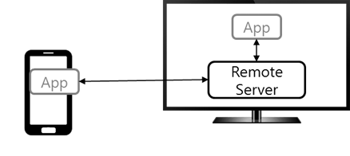
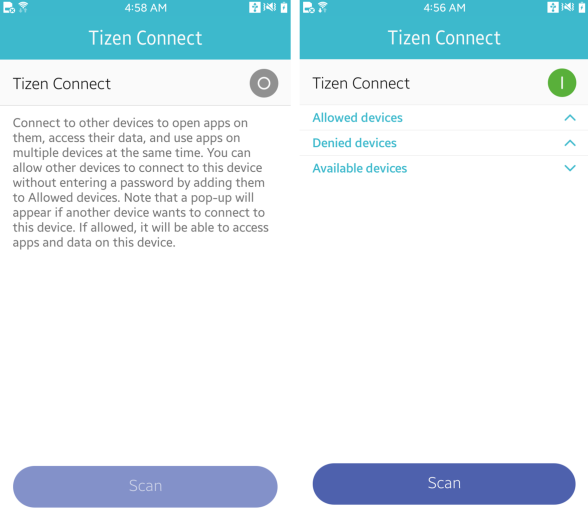

# Convergence


As the number of Tizen devices is increasing, platform features that allow connections between different devices as well as sharing data and commands among them is required. Tizen device-to-device (D2D) connectivity framework provides this feature through a collection of D2D convergence services and the Convergence API. Being a part of the platform, the D2D connectivity framework is available on all Tizen TV, mobile, and wearable devices. The D2D connectivity features are aimed at streamlining the application development process and guaranteeing the compatibility and extensibility in the future.

The D2D connectivity framework allows applications and devices in the network to discover, connect, and communicate to each other through convergence services. The app communication service opens logical channels for exchanging messages across devices, while the remote app control service starts and controls an application on a remote device.

> **Note**  
> The D2D connectivity framework supports only Wi-Fi networks. More connectivity types, such as Bluetooth, Bluetooth Low Energy, and Wi-Fi Direct™, are going to be added in future versions.Only 2 services, app communication and remote app control, are currently supported. More services are going to be introduced in the future versions of Tizen. All convergence services are predefined in the platform, which means that you cannot add new ones on your own.

The main features of the Convergence API include:

- Discovering and connecting to devices

  You can [discover nearby devices](#discovery) and get information about them. After discovering a device that provides a service you need, you can [connect to the device service](#connect_service).

- Communicating with remote devices

  You can use the [app communication service](#app_communication) to connect to remote services and communicate with remote applications by sending a payload.

- Launching applications on remote devices

  You can use the [remote app control service](#remote_app_control) to launch applications on a remote device. The access to the remote device is [controlled using passcodes](#access_control).

The Convergence API includes features to implement a typical convergence application workflow: discovering nearby devices and browsing available services, connecting to a specific service, and using the service. The payload functions defined for packaging data and transferring messages between end-points accept plain strings, byte arrays, and application control data. The payload also contains several [predefined fields](#payload) for your use.

The following figure illustrates the workflow of the D2D connectivity features.

**Figure: D2D connectivity workflow**


## App Communication Service

The convergence architecture allows the app communication service to launch an application on a device equipped with the remote server, and communicate with the server application by [sending a payload](#send_message). The remote server application can also use the app communication service to send responses to the local (client-side) application. In this way, a sophisticated data exchange protocol can be established. Before using the app communication service, [set up the listener callbacks and initialize the application](#init_app_communication).

The following figure illustrates the architecture.

**Figure: App communication service**



> **Note**  
> Currently, the remote server can only be implemented on a TV device based on Tizen 3.0, which means that you can remotely launch applications on TV devices only. You can develop a mobile or wearable client for the app communication service, if a server exists.

A typical app communication service work flow starts with the discovery step, in which the mobile or wearable device discovers the service provided by the TV. When the service is found, the mobile or wearable device launches an application in the TV remotely and communicates with it. The app-to-app communication is bidirectional, so both local and remote applications usually play the roles of sender and listener.

The app communication service has a client-server architecture:

- The app communication service relies on the remote server. This means that the server application (the application on the remote server, such as TV) initialization and execution differs slightly from the client application (the application on the mobile or wearable device).
- The client application can remotely launch the application on the server side or connect to the already running server application, but not the other way round. Both client and server side applications can send payloads and listen to each other.
- More than 1 client can be connected to a server application. For example, multiple players on mobile devices can connect to a game application on the TV, which takes a role of a server.

The app communication service channel specifies the server application the client wants to connect with. The channel data is composed of a URI and channel ID, which are assigned to the channel handle:

```
conv_channel_set_string(channel_handle, "uri", "org.example.d2d_test");
conv_channel_set_string(channel_handle, "channel_id", "test");
```

The channel URI is the URI of the server side application, while the channel ID is a developer-defined value. Note that both URI and ID fields are mandatory for using the app communication service. If not provided, the `CONV_ERROR_INVALID_PARAMETER` error occurs. You must know the server side application URI: you either develop both the client and server application yourself, or acquire the server application URI from other sources.


## Remote App Control Service

In contrast to the app communication service, the remote app control service does not need a server. The service is based on a peer-to-peer scheme, which means that the communication between 2 remote devices is symmetric. In addition, the remote app control service does not provide channels.

The connection between applications is based on [IoTivity](https://www.iotivity.org/), as illustrated in the following figure.

**Figure: Remote app control service**


In Tizen 3.0, the remote app control service is supported in mobile and wearable profiles. With this service, you can [use the Tizen App Control feature across remote devices](#init_remote).

The typical remote app control service workflow starts with the discovery of the remote app control service on the nearby devices. When the service is found, the [application control](../app-management/app-controls.md) feature can be used to launch an application on the remote device and receive results of operations performed by the launched application.

### Access Control

The remote app control service can attempt to launch an application on a remote device without user permission. To prevent this, an access control module is implemented within the D2D connectivity framework.

The access control setup is similar to the pairing of Bluetooth devices. When a device tries to access a remote device with the `conv_service_start()` function, a passcode pops up on the remote device screen and the user must enter that passcode on the original device. Once the passcode is entered correctly, the remote device is managed as an allowed device and a passcode is not asked for again.

The following figure shows the device on the left trying to access the device on the right.

**Figure: Access control**


You can manage allowed devices in the **Tizen Connect** tab of the Tizen settings application. When the Tizen Connect feature is enabled, all discovered nearby devices are presented to the user in 3 lists: allowed, denied, and available. The user can allow or deny each device by selecting the device name in the list.

All remote devices in the **Allowed devices** list can access the original device without the passcode, while all devices in **Denied devices** list cannot access the original device at all. The user can refresh the list of available nearby devices by clicking **Scan**.

**Figure: Tizen Connect**



## Prerequisites

To enable your application to use the D2D connectivity functionality:

1. To use the Convergence API (in [mobile](../../api/mobile/latest/group__CAPI__CONVERGENCE__FRAMEWORK.html) and [wearable](../../api/wearable/latest/group__CAPI__CONVERGENCE__FRAMEWORK.html) applications), the application has to request permission by adding the following privileges to the `tizen-manifest.xml` file:
    ```
    <privileges>
       <privilege>http://tizen.org/privilege/internet</privilege>
       <privilege>http://tizen.org/privilege/bluetooth</privilege>
       <privilege>http://tizen.org/privilege/d2d.datasharing</privilege>
    </privileges>
    ```

2. To use the functions and data types of the Convergence API, include the `<d2d_conv_manager.h>` header file in your application:
    ```
    #include <d2d_conv_manager.h>
    ```

<a name="Discovery"></a>
## Discovering Devices

Discovery is a procedure for searching for convergence services provided by nearby devices in the same device-to-device network.

To discover devices:

1. Create the device handle.

   During the discovery process, the framework returns handles of found devices (JSON objects with basic device information and lists of available services). The following example shows the conceptual structure of device handle:

   ```
   {
       "device_id": "DEVICE_ID", /* Unique device ID */
       "device_name": "DEVICE_NAME", /* Unique device name */
       "device_type": "DEVICE_TYPE", /* Device profile, such as mobile or wearable */
       [
           /* Handle for service A */
           {
               service_type: TYPE_A,
               jservice: JSON auxiliary data of service A
           },
           /* Handle for service B */
           {
               service_type: TYPE_B,
               jservice: JSON auxiliary of service B
           },
       ]
   }
   ```

   - The device ID is a unique identifier string, generated with the following rule: if a remote server is installed on the device (such as TV), the device ID is assigned by the app communication service. Usually, it has a format of service name and version. Otherwise (such as on mobile or wearable devices), the device ID is the device MAC address.

   - Device name is the one that is set in the device settings (**Settings > About Devices > Device Name**).

   - The service list includes all services supported by the device.

     Each service has either the `CONV_SERVICE_APP_TO_APP_COMMUNICATION` or `CONV_SERVICE_REMOTE_APP_CONTROL` type and auxiliary data. The service type constants are defined in the `conv_service_e` enumeration (in [mobile](../../api/mobile/latest/group__CAPI__D2D__CONVERGENCE__MANAGER__SERVICE__MODULE.html#gaea7544e24c248a658abc06d7015719a6) and [wearable](../../api/wearable/latest/group__CAPI__D2D__CONVERGENCE__MANAGER__SERVICE__MODULE.html#gaea7544e24c248a658abc06d7015719a6)applications).

   > **Note**  
   > The device ID and device type are defined in the platform, and cannot be changed.The `jservice` data is used by the framework internally for the connection and execution of the service. You as a developer do not need to know these details.

2. Start the discovery by calling the `conv_discovery_start()` function. The discovered device handles are retrieved in the `conv_discovery_cb()` callback.In the following example, the `conv_discovery_start()` function runs a 30 seconds long discovery procedure. Each time a nearby device is discovered, the framework invokes the `discovery_cb()` callback with the device handle and the `CONV_DISCOVERY_RESULT_SUCCESS` result code. At the end of discovery procedure, the callback is invoked with the `CONV_DISCOVERY_RESULT_FINISHED` result code and an empty device handle.The result codes are defined in the `conv_discovery_result_e` enumeration (in [mobile](../../api/mobile/latest/group__CAPI__D2D__CONVERGENCE__MANAGER__FRAMEWORK.html#gaac8da8a6d95bf9c77039c4d9360b31e3) and [wearable](../../api/wearable/latest/group__CAPI__D2D__CONVERGENCE__MANAGER__FRAMEWORK.html#gaac8da8a6d95bf9c77039c4d9360b31e3) applications).The device ID, name, and type can be read from the device handle by passing the `CONV_DEVICE_ID`, `CONV_DEVICE_NAME`, and `CONV_DEVICE_TYPE` keys to the `conv_device_get_property_string()` function. To use the discovered device handle outside the callback, it must be cloned with the `conv_device_clone()` function.
    ```
    static void
    discovery_cb(conv_device_h device, int result, void *user_data)
    {
        if (result == CONV_DISCOVERY_RESULT_SUCCESS) {
            /* Discovered device */
            char* device_id = NULL;
            char* device_name = NULL;
            char* device_type = NULL;

            conv_device_get_property_string(device, CONV_DEVICE_ID, &device_id);
            printf("device id = %s\n", device_id);
            free(device_id);

            conv_device_get_property_string(device, CONV_DEVICE_NAME, &device_name);
            printf("device name = %s\n", device_name);
            free(device_name);

            conv_device_get_property_string(device, CONV_DEVICE_TYPE, &device_type);
            printf("device TYPE = %s\n", device_type);
            free(device_type);

            /* Clone the device handle for use outside this callback */
            conv_device_h clone_device;
            conv_device_clone(device, &clone_device);
        } else if (result == CONV_DISCOVERY_RESULT_FINISHED) {
            /* Discovery has finished */
            /* Do something */
        } else if (result == CONV_DISCOVERY_RESULT_ERROR) {
            /* Discovery has triggered an error */
            /* Error handling */
        }
    }

    static void
    start_discovery_example()
    {
        /* Create a convergence manager */
        int error = conv_create(&conv_h);
        if (error != CONV_ERROR_NONE)
            /* Error handling */

        /* Start discovery */
        error = conv_discovery_start(conv_h, 30, discovery_cb, NULL);
        if (error != CONV_ERROR_NONE)
            /* Error handling */
    }
    ```
To stop the ongoing discovery process, call the `conv_discovery_stop()` function.

3. Get the list of services.

   The remaining part of the device handle is a list of services. Pull this information by using the `conv_device_foreach_service()` function:

   ```
   static void
   service_foreach_cb(conv_service_h service_handle, void *user_data)
   {
       conv_service_e e = CONV_SERVICE_NONE;

       conv_service_get_type(service_handle, &e);
       printf("service_get_type = %d\n", (int)e);

       conv_service_h clone_service_handle;
       conv_service_clone(service_handle, &clone_service_handle);
   }

   static void
   foreach_service_example()
   {
       conv_device_h device = data;
       conv_device_foreach_service(device, service_foreach_cb, NULL);
   }
   ```

   While iterating through the available services, the framework generates a new handle for each service and passes it to the `conv_service_foreach_cb()` type callback. To use the service handle outside the callback, clone it with the `conv_service_clone()`function.

## Connecting to the App Communication Service

To connect to the app communication service provided by a remote device, call the `conv_service_connect()` function.

The first parameter is the service handle extracted from the list in the device handle received during the discovery process. The second parameter is the `conv_service_connected_cb` type callback function, by which the `Connecting`, `Connected`, and `Disconnected`states of the remote service are delivered.

```
conv_service_connection_state_e state = CONV_SERVICE_CONNECTION_STATE_NONE;
conv_service_get_connection_state(service_handle, &state);
if (state == CONV_SERVICE_CONNECTION_STATE_NOT_CONNECTED)
    conv_service_connect(service_handle, callback, NULL);
```

You can check the connection state with the `conv_service_get_connection()` function, which returns one of values defined in the `conv_service_connection_state_e` enumeration (in [mobile](../../api/mobile/latest/group__CAPI__D2D__CONVERGENCE__MANAGER__SERVICE__MODULE.html#ga5da79e1a7ca434991e5ff6d28c0b0e13) and [wearable](../../api/wearable/latest/group__CAPI__D2D__CONVERGENCE__MANAGER__SERVICE__MODULE.html#ga5da79e1a7ca434991e5ff6d28c0b0e13) applications). If the service is not connected yet, the connection state is `CONV_SERVICE_CONNECTION_STATE_NOT_CONNECTED` and the service must be connected using the `conv_service_connect()` function.

> **Note**  
> Repeated attempts to connect to an already connected service result in the invalid state error. Attempts to start, publish, read, or stop a disconnected service also result in the invalid state error.

Technically, in case of the Wi-Fi network, when the framework runs the discovery procedure, all devices are already connected to the Access Point (AP), which means that the `conv_service_get_connection_state()` function always returns the `Connected` state and the `conv_service_connect()` function can be omitted. It is especially applied for the Tizen 3.0 convergence framework, which supports only Wi-Fi networks. In future versions with support for Bluetooth, Bluetooth Low Energy, or Wi-Fi Direct™, the connection procedure is mandatory. For the sake of future extensibility and compatibility, use the `conv_service_connect()` function even in Tizen 3.0.

## Initializing the App Communication Service

To initialize the app communication service:

1. Register the listener callback with the `conv_service_set_listener_cb()` function. This function must be called only once, regardless of the number of used service channels. In the runtime, all payloads from all channels are delivered there.
> **Note**  
> The listener callback must be registered before the service starts, because the `conv_service_start()` function result can only be received in the listener callback.
  - In the callback, the first parameter is the service handle, and it corresponds to the service, used in the `conv_set_listener_cb()` callback. The second parameter is the channel handle that indicates the particular channel through which the payload is delivered. The third parameter is the error parameter that indicates if the request is processed successfully on the remote device.The main role of the listener callback is to parse the payload:
    ```
    /* Client side callback */
    void
    listener_example(conv_service_h handle, conv_channel_h channel, int error,
                     conv_payload_h result, void *user_data)
    {
        char *result_type = NULL;
        char *payload_type = NULL; /* User-defined payload key */

        conv_payload_get_string(result, "result_type", &result_type);

        if (!strcmp(result_type, "onConnect"))
            /* Do something for onConnect */
        else if (!strcmp(result_type, "onStart"))
            /* Do something for onStart */
        else if (!strcmp(result_type, "onPublish"))
            /* Do something for onPublish */
        else if (!strcmp(result_type, "onStop"))
            /* Do something for onStop */
        else if (!strcmp(result_type, "onDisconnect"))
            /* Do something for onDisconnect */
        else if (!strcmp(result_type, "onClientDisconnect"))
            /* Do something for onClientDisconnect */
        else if (!strcmp(result_type, "onRead"))
            /* Do something for onRead */
        else
            /* Parsing user-defined portion of the payload */
    }
    ```
The structure of the listener is the same for both server and client sides.

  - If the application sends a payload using the `conv_service_publish()` function, the listener callback on the receiver side gets the following packet:
    ```
    "result_type": "onMessage"
    "from": unique ID of a client which sends the message
    "user_defined_key": custom user-defined key in the payload
    ```

  The following example demonstrates how to process a custom payload:
    ```
    void
    custom_listener_example(conv_service_h handle, conv_channel_h channel,
                            int error, conv_payload_h result, void *user_data)
    {
        char *result_type = NULL;
        char *payload_type = NULL; /* User-defined payload key */

        conv_payload_get_string(result, "result_type", &result_type);

        if (!strcmp(result_type, "onMessage")) {
            /* Parsing user-defined portion of the payload */
            conv_payload_get_string(result, "payload_type", &payload_type);
            if (!strcmp(payload_type, "Good_News"))
                /* Do something for the payload of the "Good News" type */
            else if (!strcmp(payload_type, "Bad_News"))
                /* Do something for the payload of the "Bad News" type */
        }
    }
    ```
  The example assumes that the message has a custom `payload_type` key and a string value that takes 1 of 2 variants: `"Good_News"` and `"Bad_News"`.In addition to strings, you can use a raw byte array payload. The `conv_payload_set_string()`, `conv_payload_get_string()`, `conv_payload_set_byte()`, and `conv_payload_get_byte()` functions are useful for working with payload types.

2. On the server side, an instance of the app communication service must be created and started by the application.

   At first, a service handle is created and assigned with the `CONV_SERVICE_APP_TO_APP_COMMUNICATION` type. Then, a channel is constructed with a pair of parameters: URI of the application, or the value specified in the application manifest, and a developer-defined channel ID. Finally, the listener is registered and the service is started.

   The following example demonstrates the server application creation and start:

   ```
   static void
   server_application_initialization_example()
   {
       /* Creating an instance of the app communication service */
       conv_service_create(&service_handle);
       conv_service_set_type(service_handle, CONV_SERVICE_APP_TO_APP_COMMUNICATION);

       /* Specifying service channel */
       /* Note, the URI value corresponds to URI of your server-side app */
       conv_channel_create(&channel_handle);
       conv_channel_set_string(channel_handle, "uri", "org.example.d2d_test");
       conv_channel_set_string(channel_handle, "channel_id", "test");

       /* Starting the service */
       /* Note that the listener must be set before starting the service */
       conv_service_set_listener_cb(service_handle, server_message_listener, NULL);
       conv_service_start(service_handle, channel_handle, NULL);
   }
   ```

3. On the client side, the app communication service handle must not be created, but obtained during the discovery. This means that no separate initialization is required on the client side.

   The client application can start the service and remotely launch the application on the server side using the obtained service handle.

   A client application registers a listener callback and starts the service:

   ```
   int
   app_communication_start_client_example()
   {
       conv_service_connect(service_handle, connect_cb, NULL);

       conv_channel_h channel_handle = NULL;
       conv_channel_create(&channel_handle);
       conv_channel_set_string(channel_handle, "uri", "org.example.d2d_test");
       conv_channel_set_string(channel_handle, "channel_id", "test");

       conv_service_set_listener_cb(service_handle, message_listener, NULL);
       conv_service_start(service_handle, channel_handle, NULL);

       conv_channel_destroy(channel_handle);
   }
   ```

   The service must be connected to the remote device using the `conv_service_connect()` function. The `service_handle` in this example is the one that the client application discovered earlier. The connection callback is omitted in this example for simplicity. However, it is meaningful to carefully implement it and observe that the connection result is `CONV_ERROR_NONE`. The payload retrieved to the callback is typically empty.

   A channel is set using the `conv_channel_set_string()` function. The start command goes to the server side, where the app communication service launches the application by the URI specified in the channel. The command result is asynchronously retrieved in the listener callback.

4. When you finish using the service channel, stop it using the `conv_service_stop()` function. When all clients have stopped using the service channel, the server side automatically terminates the application.

   The server listener is automatically deregistered by the framework in the `conv_service_stop()` function, so you do not need to do it explicitly. The use of the `conv_service_stop()` function is almost the same as the service start:

   ```
   int
   app_communication_stop_client_example()
   {
       conv_channel_h channel_handle = NULL;
       conv_channel_create(&channel_handle);
       conv_channel_set_string(channel_handle, "uri", "org.example.d2d_test");
       conv_channel_set_string(channel_handle, "channel_id", "test");

       conv_service_stop(service_handle, channel_handle, NULL);

       conv_channel_destroy(channel_handle);
   }
   ```

## Sending Messages to the Server Application

After starting a service channel, you can send a message or data to the remote server application. A payload to send to the other side must be packaged as shown in the following example. The app communication service accepts both string and byte types of payload, using the `conv_payload_set_string()` and `conv_payload_set_byte()` functions.

You can design a set of application-specific key-value pairs for maintaining the communication protocol between remote applications. It requires implementing a publishing routine for sending messages and a [listener routine](#listener_callback) for receiving and recognizing the messages on both client and server sides.

```
int
publish_example()
{
    conv_service_h service_handle = (conv_service_h)data;
    conv_channel_h channel_handle;
    conv_payload_h payload_handle;

    conv_channel_create(&channel_handle);
    conv_channel_set_string(channel_handle, "uri", "org.example.d2d_test");
    conv_channel_set_string(channel_handle, "channel_id", "test");

    conv_payload_create(&payload_handle);
    conv_payload_set_string(payload_handle, "user_defined_key", "user_defined_value");

    conv_service_publish(service_handle, channel_handle, payload_handle);
    /* or conv_service_read(service_handle, channel_handle, NULL); */
}
```

The channel used in this example is the same as described before. The `conv_service_publish()` function delivers the payload, composed of the `"user_defined_key"` and `"user_defined_value"` pairs, through the network to the remote server application where it is passed in the listener callback.

In the app communication service, the `conv_service_read()` function is only a command to get the information about the clients connected to the same channel. The `conv_service_read()` is called with `NULL` payload and it does not require additional parameters. You can [receive various information](#result_type) in the `conv_service_read()` function.

## Using the Remote App Control Service

The basic flow for the remote app control service is to build a payload with an application control handle, send it to a remote device and, optionally, receive a remote application control result.

To start the remote app control service, publish a message, and stop the service:

1. Register a listener callback.

   In the remote app control service, the application control, delivered to a remote device, is directly processed just like a local application control. It means that there is no need for a receiver to implement a special receiving routine on the remote device, and no need to register a listener callback on the receiver side. Instead, the listener callback is useful on the sender side to check whether the function is delivered to the remote device and processed correctly.

   The following example shows a listener callback, which handled the result of the access control process related to the remote app control service. After the user of the remote device has decided to allow or deny access with the passcode, the user choice is delivered to the remote device with the `"onStart"` result type and predefined error types:

   - If the passcode is entered correctly, the `"onStart"` returns with the `CONV_ERROR_NONE` value.
   - Otherwise, the `"onStart"` comes with the `CONV_ERROR_INVALID_OPERATION` value.

   ```
   static void
   service_result_callback(conv_service_h service_handle, conv_channel_h channel_handle,
                           conv_error_e error, conv_payload_h result, void* user_data)
   {
       char *reply_result = NULL;
       conv_payload_get_string(result, "result_type", &reply_result);
       if (!strcmp(reply_result, "onStart")) {
           if (error == CONV_ERROR_NONE) {
               /* Allowed */
               conv_service_publish(service_handle, NULL, payload_handle);
               conv_service_stop(service_handle, NULL, payload_handle);
               conv_payload_destroy(payload_handle);
               payload_handle = NULL;
           } else if (error == CONV_ERROR_INVALID_OPERATION) {
               /* Denied */
               conv_service_stop(service_handle, NULL, payload_handle);
               conv_payload_destroy(payload_handle);
               payload_handle = NULL;
           }
       }
       free(reply_result);
   }
   ```

2. Start the remote app control service.

   After registering the listener callback, start the service with the service handle, obtained from the near-by device discovery previously. Build an application control handle in a payload to launch an application on a remote device.

   The following example launches the `"org.example.d2d_test"` application:

   ```
   int
   app_control_service()
   {
       conv_service_set_listener_cb(service_handle, message_listener, NULL);
       conv_service_start(service_handle, NULL, NULL);

       conv_payload_h payload_handle;
       conv_payload_create(&payload_handle);

       app_control_h app_control = NULL;
       app_control_create(&app_control);
       app_control_set_app_id(app_control, "org.example.d2d_test");
       app_control_set_operation(app_control, APP_CONTROL_OPERATION_MAIN);

       conv_payload_set_app_control(payload_handle, "app_control", app_control);
       conv_payload_set_string(payload_handle, "reply", "1");

       conv_service_publish(service_handle, NULL, payload_handle);
   }
   ```

   The application control handle can be built [using the App Control functions](../app-management/app-controls.md). In the payload, there is a special `"reply"` string field, which indicates if an application control reply is returned after the sent application control is processed remotely. In other words, if `"reply"` is `"1"`, the remote device processes the application control and sends the resulting application control to the original device. In this case, the listener callback on the original device waits for an application control reply. This can be useful in designing interactive applications, such as chatting applications, in which bi-directional interplay service is required. If `"reply"` is `"0"` or this field is omitted, no response is received in the listener.

## Predefined Payload Fields

To send payloads, you can use various functions: use the `conv_service_start()` function to start a service, the `conv_service_read()` function to read information from the remote device, the `conv_service publish()` function to send data or messages, and the `conv_service_stop()` function to stop the service. The app communication service recognizes several predefined payload fields, including the `result_type`, which are used to specify the payload type or the quick response of some functions. The service implicitly adds these fields to the payload.

> **Note**  
> The `conv_service_read()` function is not used in the remote app control service.

When the `conv_service_start()`, `conv_service_publish()`, or `conv_service_stop()` function is called, a quick notice for success or failure with a specific `result_type` and extra information returns back to the function caller. For example, in case of the `conv_service_read()` function, the response includes the `result_type` of `onRead` and a list of connected clients. For the general payload sent from the other device with the `conv_service_publish()` and received in the client device listener, the `result_type` is `onMessage` and the message or data is stored in the payload argument. The detailed information for the predefined fields and payload formats is summarized in the following tables.

The success or failure result (including the correctness of the passcode input in the access control popup in the remote app control service) is delivered by the `conv_error_e` error parameter (in [mobile](../../api/mobile/latest/group__CAPI__D2D__CONVERGENCE__MANAGER__FRAMEWORK.html#ga37d3a4410cd70ca1253f20ce4005ac60) and [wearable](../../api/wearable/latest/group__CAPI__D2D__CONVERGENCE__MANAGER__FRAMEWORK.html#ga37d3a4410cd70ca1253f20ce4005ac60) applications) of the listener callback.

**Table: Predefined fields for the app communication service payloads**

| Function                                 | Predefined  payload field                |
|------------------------------------------|------------------------------------------|
| conv_service_start()                     | Sent to the  device that calls the function when connected to the remote  server:<br>     - "result_type":  "onConnect"<br>     - "client_is_host":  Whether the device is a server application (remote server). The possible  values are 0 and 1. <br>     - "client_connect_time":  Connection time <br>     - "client_id": Unique  client ID |
| conv_service_start()                     | Sent to the  device that calls the function when the application launch succeeds or  fails:<br>     - "result_type":  "onStart" |
| conv_service_start()                     | Sent to other  clients connected to the remote server:<br>     - "result_type":  "onClientConnect"<br>     - "client_is_host": Whether  the device is a server application (remote server). The possible values are 0  and 1.<br>     - "client_connect_time":  Connection time<br>     - "client_id": Unique  client ID |
| conv_service_publish()                   | "result_type": "onPublish"               |
| conv_service_stop()                      | Sent to the device which calls the function  when the server application stops:<br>    - "result_type": "onStop" |
| conv_service_stop()                      | Sent to the device which calls the function  when disconnected from the remote server:<br>     - "result_type":  "onDisconnect"<br>     - "client_is_host":  Whether the device is a server application (remote server). The  - possible values are 0 and  1.<br>     - "client_connect_time": Connection  time<br>     - "client_id": Unique  client ID<br> |
| conv_service_stop()                      | Sent to other clients connected to the remote  server:<br>     - "result_type":  "onClientDisconnect"<br>     - "client_is_host": Whether  the device is a server application (remote server). The possible values are 0  and 1.<br>     - "client_connect_time":  Connection time<br>     - "client_id": Unique  client ID |
| conv_service_read()                      | - "result_type":  "onRead"<br>     - "read_type":  "getClients"<br>     - "client_list":  json-array type client lists<br>    [ {"client_is_host": Whether the device is a server application  (remote server). The possible values are 0 and 1.<br>    "client_connect_time": Connection time<br>    "client_id": Unique client ID<br>    }, ... ] |
| conv_service_listener_cb()<br>    (When a message is received) | Sent to other  clients and server applications, registered listener  callback:<br>     - "result_type":  "onMessage"<br>     - "from": Unique client ID  which sends the message |

**Table: Predefined fields for receiving the remote app control service payloads**

| Function                 | Predefined fields                        |
|--------------------------|------------------------------------------|
| `conv_service_start()`   | `"result_type"`: `"onStart"`             |
| `conv_service_publish()` | -`"result_type"`: `"onPublish"`<br>-`"app_control_reply"`: Application control data, only valid if the receiver replied with an `app_control`, which means that the sender sent a payload with a `"reply"` of `"1"`.<br>-`"app_control_request"`: Requested application control data, only valid if the receiver replied with an `app_control` value, which means that the sender sent a payload with a `"reply"` of `"1"`.<br>-`"app_control_result"`: The `app_control_result_e` value for the request, only valid if the receiver replied with a value, which means that the sender sent a payload with a `"reply"` of `"1"`. |
| `conv_service_stop()`    | `"result_type"`: `"onStop"`              |

## Related Information
* Dependencies
 - Tizen 2.4 and Higher for Mobile
 - Tizen 2.3.1 and Higher for Wearable
