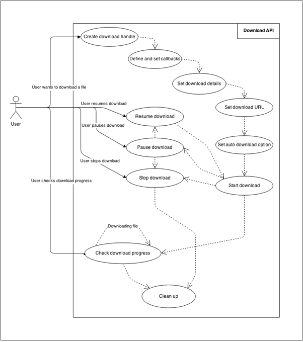
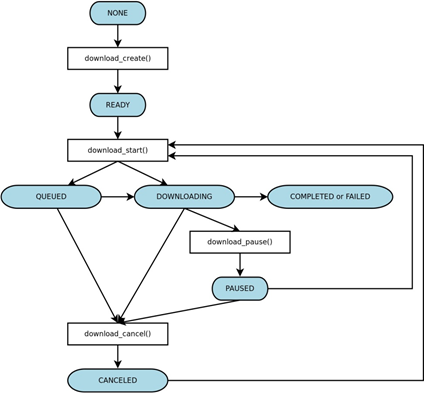

# Download


You can create and manage 1 or more download requests at a time. Each download process goes through a [set of states](#state), and you can manage the process though the states with specific functions.

This feature is supported in mobile applications only.

The following figure illustrates the user scenario for the download:

1. When the user wants to download a file, you can [create a new download process](#download), configure the download URL or destination, and launch the process.
2. During the download, you can pause, resume, or stop the process programmatically, or as a response to user requests. In addition, you can monitor the progress of the download process.

**Figure: User scenario**



<a name="state"></a>
## Download States

The following figure illustrates the various download states (such as READY and DOWNLOADING), and the functions (such as `download_start()`) that cause transitions between the states. The download states are defined in the [download_state_e](../../api/mobile/latest/group__CAPI__WEB__DOWNLOAD__MODULE.html#gae9d05ac4ab7a2ba2fe6b3c329d273810) enumerator.

Each function can only be called when the download process is in a specific state. To avoid undefined behavior in the application, make sure that you handle every possible scenario in the code.

**Figure: Download states**



When you stop the download:

- Use the `download_cancel()` function. It changes the download state to `DOWNLOAD_STATE_CANCELED`. From this state, you can restart the download with the `download_start()` function.
- After you stop a download, the download handle ID is stored for 48 hours (even if the device is powered off), allowing you to resume the download later. If you have no need to resume the process later, unload all data concerning the download handle from the memory with the `download_destroy()` function.

## Prerequisites

To use the functions and data types of the [Download](../../api/mobile/latest/group__CAPI__WEB__DOWNLOAD__MODULE.html) API, include the `<download.h>` header file in your application:

```
#include <download.h>
```

The downloading library needs no initialization prior to the API usage.

<a name="download"></a>
## Downloading Content from a URL

To download content:

1. Create the download handle.

   Before starting any downloading, assign a download ID with the `download_create()` function:

   ```
   download_error_e error;
   int download_id;

   error = download_create(&download_id);
   ```

   The download ID is used as a handle for managing the download.

2. Define and set download callbacks.

   Data specified by the URL is downloaded asynchronously, and each download-related event (start, pause, stop, finish, or progress update) is propagated to the application through a callback.

   Register the progress callback with the `download_set_progress_cb()` function, and the state change callback with the `download_set_state_changed_cb()` function:

   ```
   error = download_set_state_changed_cb(download_id, state_changed_cb, NULL);

   error = download_set_progress_cb(download_id, progress_cb, &content_size);
   ```

   The state change callback is called every time the download state changes, and the progress callback is called every time the download progress changes.

3. Set the download URL and destination.

   Before the download can be started, set the URL source path for the download:

   ```
   error = download_set_url(download_id, "http://tizen.org";
   ```

   You can also set the destination path and file name. If the values are not given, the default storage and an auto-generated file name are used.

   ```
   char *data_path = app_get_data_path();
   error = download_set_destination(download_id, data_path);
   free(data_path);

   error = download_set_file_name(download_id, "downloaded_file.bin");
   ```

4. Set the download options:

   - Auto download

     To set an automatic download, call the `download_set_auto_download()` function passing the download handle and setting the second parameter to `true`.

     This operation changes the download manager state so that it continues downloading even after the client process is terminated. Set the notification download option when using this feature to allow the user to receive the download result even after the client process has terminated.

     ```
     error = download_set_auto_download(download_id, true);
     ```

   - Network type

     To set the desired network type, use the `download_set_network_type()` function. The [download_network_type_e](../../api/mobile/latest/group__CAPI__WEB__DOWNLOAD__MODULE.html#gadf73239ac2efa6d4214a03751c76c9b8) enumeration defines the network types available for downloading. If no type is set, the `DOWNLOAD_NETWORK_ALL` default value is used.

     ```
     download_network_type_e value = 0;
     error_code = download_set_network_type(download_id, DOWNLOAD_NETWORK_ALL);

     error_code = download_get_network_type(download_id, &value);
     ```

   - Notifications

     To set notifications with a service action, use the `download_set_notification_type()` function. The [download_notification_type_e](../../api/mobile/latest/group__CAPI__WEB__DOWNLOAD__MODULE.html#gab2ec29afc07197987eb2b88614fac67f) enumeration defines the available download notification types. If no type is set, the `DOWNLOAD_NOTIFICATION_TYPE_NONE` default value is used.

     To change the title or description of the notification item, use the `download_set_notification_title()` or `download_set_notification_description()` function. To change the action when the notification item is clicked, use the `download_set_notification_service_handle()` function. If the service action is not set, the default operation is the following:

     - When clicking a completed notification message, the proper application for playing the downloaded content is launched. If there is no proper application, an error message is shown at the status tray.
     - When clicking a failed notification message, the client application requesting the download is launched.

     ```
     app_control_h app_control = NULL;
     error = app_control_create(&app_control);
     error = app_control_set_app_id(app_control, "org.tizen.tutorialdownload");
     error = download_set_notification_app_control(download_id,
                                                   DOWNLOAD_NOTIFICATION_APP_CONTROL_TYPE_FAILED,
                                                   app_control);

     download_notification_type_e noti_type = 0;
     char *title = NULL;
     char *desc = NULL;
     error = download_get_notification_type(download_id, &noti_type);
     error = download_get_notification_title(download_id, &title);
     error = download_get_notification_description(download_id, &desc);
     error = download_get_notification_app_control(download_id,
                                                   DOWNLOAD_NOTIFICATION_APP_CONTROL_TYPE_FAILED,
                                                   &app_control);
     error = app_control_destroy(app_control);
     ```

5. Control the download process.

   Downloading can be started, paused, or canceled using the `download_start()`, `download_pause()`, and `download_cancel()` functions. The download ID handle is used as a parameter for all these functions.

   ```
   error = download_start(download_id);

   error = download_pause(download_id);

   error = download_start(download_id);

   error = download_cancel(download_id);
   ```

   To pause a download, it must be in the `DOWNLOAD_STATE_DOWNLOADING` state. After pausing, the download state changes to `DOWNLOAD_STATE_PAUSED`. After the download is stopped, the download state changes to `DOWNLOAD_STATE_CANCELED`.

6. Monitor the download progress.

   Use the progress callback to monitor the download progress. The following example prints the number of bytes received and the total size of the file being downloaded. Since you do not know the file size at the beginning, use 0.

   1. Create the download:
      ```
      unsigned long long content_size = 0;

      error = download_create(&download_id);
      ```

   2. Register the progress callback and start the download:
      ```
      error = download_set_progress_cb(download_id, progress_cb, &content_size);

      error = download_start(download_id);
      ```

   3. When the file is being downloaded, get the total content size:
      ```
      download_state_e state = 0;
      content_size = 0;
      error = download_get_state(download_id, &state);
      if (state == DOWNLOAD_STATE_DOWNLOADING)
          error = download_get_content_size(download_id, &content_size);
      ```

   4. The received parameter of the `progress_cb()` callback function contains the size of the data received in bytes. In this example, print out the value and the total download size.
      ```
      static void
      progress_cb(int download_id, unsigned long long received, void *user_data)
      {
          dlog_print(DLOG_INFO, LOG_TAG, "received: %llu of %llu", received, *((unsigned long long*)user_data));
      }
      ```

7. Get error information.

   To get error information, use the `download_get_error()` function:
   ```
   download_error_e error_val = 0;
   error = download_get_error(download_id, &error_val);
   ```

   The [download_error_e](../../api/mobile/latest/group__CAPI__WEB__DOWNLOAD__MODULE.html#ga2d9ccc088c02cf1ab70879f1beda1cd1) enumeration defines the available error types.

8. Clean up.

   When the registered download is no longer needed (the downloading is finished or has been canceled), delete it using the `download_destroy()` function. In addition, unset all callback functions.
   ```
   download_unset_progress_cb(download_id);
   download_unset_state_changed_cb(download_id);
   error = download_destroy(download_id);
   ```

## Related Information
- Dependencies
  - Tizen 2.4 and Higher for Mobile
