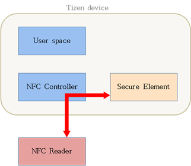

# Near Field Communication (NFC)


Tizen enables you to use Near Field Communication (NFC) functionalities, such as reading and writing tags, and emulating a smart card. NFC is an international standard (ISO/IEC 18092) that specifies an interface and a protocol for simple wireless interconnection of closely coupled devices. For more information, see the [NFC Forum](http://nfc-forum.org/).

The main features of the NFC API include:

- NFC management

  With the Manager API (in [mobile](../../api/mobile/latest/group__CAPI__NETWORK__NFC__MANAGER__MODULE.html) and [wearable](../../api/wearable/latest/group__CAPI__NETWORK__NFC__MANAGER__MODULE.html) applications), you can, for example:

  - Initialize and deinitialize NFC.
  - [Enable and disable NFC](#enable).
  - Set callbacks for NFC events.
  - [Manage NFC connections](#work).
  - [Get cached NFC messages](#get).
  - [Use the NFC application control](#appcontrol).

- NDEF support

  The NFC Data Exchange Format (NDEF) is a packet message format used in the reader/writer and peer-to-peer modes.

  With the NDEF API (in [mobile](../../api/mobile/latest/group__CAPI__NETWORK__NFC__NDEF__MODULE.html) and [wearable](../../api/wearable/latest/group__CAPI__NETWORK__NFC__NDEF__MODULE.html) applications), you can:

  - Create NDEF records.
  - Retrieve a specific field of an NDEF record.
  - Create NDEF messages.
  - Insert and remove NDEF records to and from an NDEF message.

- Reader/writer mode

  With the TAG API (in [mobile](../../api/mobile/latest/group__CAPI__NETWORK__NFC__TAG__MODULE.html) and [wearable](../../api/wearable/latest/group__CAPI__NETWORK__NFC__TAG__MODULE.html) applications), you can, for example:

  - Retrieve the tag type.
  - Read an NDEF message from a tag.
  - Write an NDEF message to a tag.
  - Format a tag for using NDEF.
  - Handle type-specific tag operations (currently only MIFARE).

- Peer-to-peer mode

  With the Peer to Peer API (in [mobile](../../api/mobile/latest/group__CAPI__NETWORK__NFC__P2P__MODULE.html) and [wearable](../../api/wearable/latest/group__CAPI__NETWORK__NFC__P2P__MODULE.html) applications), you can:

  - [Send an NDEF message](#send) to a peer device.
  - Receive an NDEF message from a peer device.

  [Prepare NFC P2P](#prepare_p2p) before you start.

- Card emulation mode

  The card emulation mode allows an NFC device to [function as a smart card](#cardemulation). The mode provides access to secure elements (SEs).

  The NFC controller in the device routes all data from the reader directly to the secure element, and an applet handles all of the data in the SE. The user does not participate at all in the operation.

  **Figure: Traditional card emulation**

  

  With the Card Emulation API (in [mobile](../../api/mobile/latest/group__CAPI__NETWORK__NFC__SE__MODULE.html) and [wearable](../../api/wearable/latest/group__CAPI__NETWORK__NFC__SE__MODULE.html) applications), you can:

  - Enable and disable the card emulation mode.
  - Retrieve the card emulation status.
  - Open and close a secure element.
  - Send an application protocol data unit (APDU) to a secure element.
  - Retrieve an Answer To Reset (ATR) from a secure element.

  > **Note**
  >
  > Pay attention to the following:
  > - Secure element access is not supported in Tizen 2.3. The Card Emulation API of Tizen 2.3 only supports enabling and disabling the NFC card emulation mode, and retrieving the card emulation status.
  >
  > - Security problems can occur in some Card Emulation APIs. The security level can be determined by the manufacturer usage. If a security issue occurs, contact the product manufacturer. For more information on the security levels, see the [GSMA specification](http://www.gsma.com/digitalcommerce/wp-content/uploads/2013/12/GSMA-NFC05-NFC-Handset-APIs-Requirement-Specification-version-4-1.pdf).

- Host-based card emulation (HCE)

  HCE is an on-device technology that permits a phone to perform card emulation on an NFC-enabled device without relying on access to a secure element (SE). The data is routed to the user space on which Tizen applications reside, instead of routing the data to a secure element.

  **Figure: Card emulation with HCE**

  

  HCE allows you to create your own card emulation system and bypass the SE. This approach brings 2 advantages:

  - For UICC-type SE, the mobile service provider is involved in the card emulation behavior. With HCE, you are independent of the service provider.
  - You do not need SE hardware chips within the device.

  To understand HCE behavior, mainly how data is internally routed to the correct application, consider how Tizen handles NFC routing:

  1. Assume that the user has an HCE application or installs one.

     The application has a "AID" value, which is stored in NFC routing table (blue arrow in the following figure).

  2. When the NFC reader attempts card emulation, the NFC controller checks the routing table to find the application to which the data is sent for emulation (red arrows in the following figure).

  3. When the application is uninstalled, the AID value is deleted from the routing table.

  **Figure: HCE routing**

  

## Prerequisites

To enable your application to use the NFC functionality:

1. To use the NFC API (in [mobile](../../api/mobile/latest/group__CAPI__NETWORK__NFC__MODULE.html) and [wearable](../../api/wearable/latest/group__CAPI__NETWORK__NFC__MODULE.html) applications), the application has to request permission by adding the following privileges to the `tizen-manifest.xml` file:

   ```
   <privileges>
      <privilege>http://tizen.org/privilege/nfc</privilege>
      <!--To create a host-based card emulation (HCE) application-->
      <privilege>http://tizen.org/privilege/nfc.cardemulation</privilege>
   </privileges>
   ```

2. To use the functions and data types of the NFC API, include the `<nfc.h>` header file in your application:

   ```
   #include <nfc.h>
   ```

   To enable and disable NFC on the device, the `<app_control.h>` and `<dlog.h>` header files have to be included.

3. Check whether the device you want to work with supports NFC. This can be done by calling the `nfc_manager_is_supported()` function. It takes no parameters and returns `true` if NFC is supported on the device.

   ```
   void
   Network_NFC_startup(void)
   {
       gmainloop = g_main_loop_new(NULL, FALSE);
       bool is_nfc_supported = nfc_manager_is_supported();
       if (!is_nfc_supported)
           dlog_print(DLOG_INFO, LOG_TAG, "is_nfc_supported NOT SUPPORTED");
   }
   ```

   The `gmainloop` created here is used to wait for the results of calling asynchronous functions.

4. To initialize NFC, call the `nfc_manager_initialize()` function to start the initialization:

   ```
   int error_code = NFC_ERROR_NONE;

   error_code = nfc_manager_initialize();
   if (NFC_ERROR_NONE != error_code)
       /* Error occurred */

   g_timeout_add(1000, timeout_func, gmainloop);
   g_main_loop_run(gmainloop);
   ```

   Run `gmainloop` to wait for the result of the initialization. It is closed when the time set in the `g_timeout_add()` function elapses. This time is in milliseconds so the `timeout_func` is called after 1 second passes.

5. When the work with NFC is finished, the `nfc_manager_deinitialize()` function must be called to clear the environment:

   ```
   void
   Network_NFC_cleanup(void)
   {
       g_main_loop_unref(gmainloop);
       nfc_manager_deinitialize();
   }
   ```

<a name="enable"></a>
## Enabling and Disabling NFC

To allow the user to enable or disable NFC, use the [application control](../app-management/common_appcontrol.md#settings_nfc) to display the NFC settings.

The NFC API does not contain functions for enabling or disabling NFC. You must display the NFC settings application to allow the user to toggle the NFC state.

**Figure: NFC settings application (off screen on the left and on screen on the right)**


```
#include <app_control.h>
#include <dlog.h>

int
nfc_onoff_operation(void)
{
    int ret = 0;
    app_control_h service = NULL;
    app_control_create(&service);
    if (service == NULL) {
        dlog_print(DLOG_INFO, LOG_TAG, "service_create failed!\n");

        return 0;
    }
    app_control_set_operation(service, APP_CONTROL_OPERATION_SETTING_NFC);
    ret = app_control_send_launch_request(service, NULL, NULL);

    app_control_destroy(service);
    if (ret == APP_CONTROL_ERROR_NONE) {
        dlog_print(DLOG_INFO, LOG_TAG, "Succeeded to NFC On/Off app!\n");

        return 0;
    } else {
        dlog_print(DLOG_INFO, LOG_TAG, "Failed to relaunch NFC On/Off app!\n");

        return -1;
    }

    return 0;
}
```

<a name="work"></a>
## Working with NFC Connections and Messages

To work with NFC manually, you need to register for notifications and handle connection events:

1. To register for notifications:

   1. Call the `nfc_manager_set_activation_changed_cb()` function to register a callback that is invoked every time the activation state of NFC changes:

      ```
      error_code = nfc_manager_set_activation_changed_cb(on_nfc_activation_changed, NULL);
      ```

      Define the callback. In this example, it only informs the user that the activation state has changed.

      ```
      static void
      on_nfc_activation_changed(bool activated, void *user_data)
      {
          if (activated)
              dlog_print(DLOG_INFO, LOG_TAG, "NFC activated");
          else
              dlog_print(DLOG_INFO, LOG_TAG, "NFC deactivated");
      }
      ```

   2. Use the `nfc_manager_set_tag_filter()` function to declare the tag filtering option. Use a bit operation of the `nfc_tag_filter_e` enumerator (in [mobile](../../api/mobile/latest/group__CAPI__NETWORK__NFC__MANAGER__MODULE.html#gaaedb205391ef13ef62d0c9a318a802ad) and [wearable](../../api/wearable/latest/group__CAPI__NETWORK__NFC__MANAGER__MODULE.html#gaaedb205391ef13ef62d0c9a318a802ad) applications) to specify the type of filtering. The default value is `NFC_TAG_FILTER_ALL_ENABLE`, which means that all tag types are enabled.

      ```
      nfc_manager_set_tag_filter(NFC_TAG_FILTER_ALL_ENABLE);
      ```

   3. Register callback functions to receive discovery notifications for tag, NDEF, peer-to-peer, secure element, and secure element transaction events:

      - Use the `nfc_manager_set_tag_discovered_cb()` function to register a tag discovery callback:

        ```
        error_code = nfc_manager_set_tag_discovered_cb(on_nfc_tag_discovered, NULL);
        if (NFC_ERROR_NONE != error_code)
            /* Error occurred */
        ```

      - Use the `nfc_manager_set_ndef_discovered_cb()` function to register an NDEF event callback:

        ```
        error_code = nfc_manager_set_ndef_discovered_cb(on_nfc_ndef_discovered, NULL);
        if (NFC_ERROR_NONE != error_code)
            /* Error occurred */
        ```

      - Use the `nfc_manager_set_p2p_target_discovered_cb()` function to register a peer-to-peer event callback:

        ```
        error_code = nfc_manager_set_p2p_target_discovered_cb(on_nfc_p2p_target_discovered,
                                                              NULL);
        if (NFC_ERROR_NONE != error_code)
            /* Error occurred */
        ```

      - Use the `nfc_manager_set_se_event_cb()` function to register a secure element event callback:

        ```
        error_code = nfc_manager_set_se_event_cb(on_nfc_se_event, NULL);
        if (NFC_ERROR_NONE != error_code)
            /* Error occurred */
        ```
      - Use the `nfc_manager_set_se_transaction_event_cb()` function to register a secure element transaction event callback:

        ```
        error_code = nfc_manager_set_se_transaction_event_cb(NFC_SE_TYPE_ESE,
                                                             on_nfc_se_transaction_event,
                                                             NULL);
        if (NFC_ERROR_NONE != error_code)
            /* Error occurred */
        ```

   4. Use the `nfc_manager_is_system_handler_enabled()` function to check whether system handling for tag and target discovery is enabled.

      By default, the system handling is enabled. If the function returns `FALSE`, enable system handling using the `nfc_manager_set_system_handler_enable()` function and pass `TRUE` as an input parameter.

      ```
      if (nfc_manager_is_system_handler_enabled() != true)
          nfc_manager_set_system_handler_enable(true);
      ```

   After registering the callbacks, you can start using NFC on the device. You can connect to other devices, resulting in launching the code from the registered callbacks.

2. Handling NFC tags and related events:

   1. Get basic tag information.

      When a tag is discovered, the `on_nfc_tag_discovered()` callback registered earlier is called. In the callback, you can check the NFC discovered type from the first callback parameter. The `nfc_discovered_type_e` enumerator (in [mobile](../../api/mobile/latest/group__CAPI__NETWORK__NFC__MANAGER__MODULE.html#ga27acb1707c933da6d9180d80a03f4402) and [wearable](../../api/wearable/latest/group__CAPI__NETWORK__NFC__MANAGER__MODULE.html#ga27acb1707c933da6d9180d80a03f4402) applications) defines the possible values. If the value is `NFC_DISCOVERED_TYPE_ATTACHED`, the tag has connected to the device, and you can read and print out information from the tag:

      1. Get the type of the tag with the `nfc_tag_get_type()` function. The first parameter is the tag handle (received in the second callback parameter) and the second is a pointer to an `nfc_tag_type_e` variable (in [mobile](../../api/mobile/latest/group__CAPI__NETWORK__NFC__TAG__MODULE.html#gac77f833a3dde9e3e12d2171f923d8fcb) and [wearable](../../api/wearable/latest/group__CAPI__NETWORK__NFC__TAG__MODULE.html#gac77f833a3dde9e3e12d2171f923d8fcb) applications), where the tag type is stored.

         ```
         nfc_tag_get_type(tag, &tag_type);
         ```

      2. Get the size of the NDEF message stored in the tag with the `nfc_tag_get_ndef_size()` function. The parameters are similar to the ones described above, but instead of the `tag_type` variable, the pointer is passed to an unsigned `int` variable where the current size of the tag is stored.

         ```
         nfc_tag_get_ndef_size(tag, &size);
         ```

      3. Use the `nfc_tag_get_maximum_ndef_size()` function to get the maximum NDEF message size that can be stored in the tag. The function takes 2 parameters, where the first one is a tag handle and the second is a pointer to an unsigned `int` where the maximum size of the tag is stored.

         ```
         nfc_tag_get_maximum_ndef_size(tag, &maximum_ndef_bytes_size);
         ```

      4. Retrieve all remaining tag information by calling the `nfc_tag_foreach_information()` function. The parameters are the tag that is operated on, the callback that is called for each found key and value pair in the tag, and the user data that can be passed to the callback. If there is no need to pass any data, `NULL` is passed as the last parameter.

         ```
         error_code = nfc_tag_foreach_information(tag, on_nfc_tag_information_event, NULL);

         if (NFC_ERROR_NONE != error_code)
             /* Error occurred */
         ```

         The `on_nfc_tag_information_event()` callback prints out the found keys and their values.

         ```
         on_nfc_tag_information_event(const char *key, const unsigned char *value,
                                      int value_size, void *user_data)
         {
             dlog_print(DLOG_INFO, LOG_TAG, "Title: %s, Value: %s", key, (char*)value);

             return true;
         }
         ```

         The iteration over the key and value pairs continues while the callback returns `true`.

   2. Check the NFC tag filter and print it out. This ensures that the callback was called and informs you what kind of a tag filter is set right now. For example, if the callback has not printed any information about the tag, but it printed out that the tag filter is `NFC_TAG_FILTER_ALL_DISABLE`, the filter needs to be set to the proper value to read the specific tag type. To check the current tag filter, use the `nfc_manager_get_tag_filter()` function:

      ```
      filter = nfc_manager_get_tag_filter();
      ```

   3. Read the tag data with the `nfc_tag_read_ndef()` function. The parameters are the tag handle, the callback evoked when the reading is completed, and user data passed to the callback.

      ```
      error_code = nfc_tag_read_ndef(tag, on_nfc_tag_read_completed, NULL);
      if (NFC_ERROR_NONE != error_code)
          /* Error occurred */
      ```

      After the tag message has been read, the `on_nfc_tag_read_completed()` callback is called. The parameters are the status of reading the message, the message read from the tag, and data passed to the callback. The last one can be `NULL` if no data need to be passed.

      ```
      static void
      on_nfc_tag_read_completed(int error_code, nfc_ndef_message_h message, void *user_data)
      {
          nfc_ndef_message_read_cb(clone_message(message));
      }
      ```

   4. If the `nfc_tag_read_ndef()` function returned no error (`error_code == NFC_ERROR_NONE`), you can operate on the retrieved message:

      1. To read information from the message, use the `nfc_ndef_message_read_cb()` function. The function takes as a parameter a handle to the tag message. Pass the cloned message to it.

         ```
         nfc_ndef_message_read_cb(clone_message(message));
         ```

         To create a cloned message:

         1. Clone the message by calling the `clone_message()` function:

            ```
            static
            nfc_ndef_message_h clone_message(nfc_ndef_message_h msg)
            {
                unsigned char *rawdata;
                unsigned int rawdata_size;
                nfc_ndef_message_h msg_cp;
            ```

         2. Get the copy of the bytes array of the NDEF message with the `nfc_ndef_message_get_rawdata()` function. The parameters are the handle to the NDEF message, the 2-dimensional bytes array, and the size of the bytes array.

            The parameters are variables that must be passed to be fulfilled inside the called function.

            ```
                nfc_ndef_message_get_rawdata(msg, &rawdata, &rawdata_size);
            ```

         3. Create an NDEF handle from raw serial bytes with the `nfc_ndef_message_create_from_rawdata()` function. Use it to create a copy of the message retrieved from the tag to make it possible to read information from the copy. The parameters are the message handle, `rawdata`, and `rawdata_size`.

            In the end, `rawdata` must be released with the `free()` function.

            ```
                nfc_ndef_message_create_from_rawdata(&msg_cp, rawdata, rawdata_size);
                free(rawdata);

                return msg_cp;
            }
            ```

      2. Get the number of records stored in the tag message with the `nfc_ndef_message_get_record_count()` function. It needs the handle to the message that is operated on and the pointer to an integer which is fulfilled by the function with the number of records in the message.

         ```
         error_code = nfc_ndef_message_get_record_count(message, &count);
         if (NFC_ERROR_NONE != error_code)
             /* Error occurred */
         ```

      3. Iterate through all the records in the message and get all information stored in each record. Call the `nfc_ndef_message_get_record()` function first. The parameters are the handle of the NDEF message, index of the record, and handle to the record. This function gets a record from the message by index. It returns a pointer to the record, so if you change the record, it directly affects the NDEF message.

         ```
         error_code = nfc_ndef_message_get_record(message, i, &rec);
         if (NFC_ERROR_NONE != error_code)
             /* Error occurred */
         ```
         Now, when the pointer to the specific record exists, get the record data:

         - Get the record ID by calling the `nfc_ndef_record_get_id()` function:
           ```
           error_code = nfc_ndef_record_get_id(rec, &id, &id_len);
           if (NFC_ERROR_NONE != error_code)
               /* Error occurred */
           ```
         - Get the record type using the `nfc_ndef_record_get_type()` function:
           ```
           error_code = nfc_ndef_record_get_type(rec, &type_str, &type_len);
           if (NFC_ERROR_NONE != error_code)
               /* Error occurred */
           ```
         - Get the record TNF (Type Name Format) with the `nfc_ndef_record_get_tnf()` function:
           ```
           error_code = nfc_ndef_record_get_tnf(rec, &tnf);
           if (NFC_ERROR_NONE != error_code)
               /* Error occurred */
           ```
         - Get the record payload by calling the `nfc_ndef_record_get_payload()` function:
           ```
           error_code = nfc_ndef_record_get_payload(record, &payload, &payload_len);
           if (NFC_ERROR_NONE != error_code)
               /* Error occurred */
           ```

      4. To get more information from the tag, specify what type of tag message you are dealing with:

         - If there is a message with `Type = "T"` and the TNF is `NFC_RECORD_TNF_WELL_KNOWN`, it is possible to get the following data:
           ```
           /* Get the record text */
           error_code = nfc_ndef_record_get_text(record, &text);
           if (NFC_ERROR_NONE != error_code)
               /* Error occurred */

           /* Get the record text language code */
           error_code = nfc_ndef_record_get_langcode(record, &language);
           if (NFC_ERROR_NONE != error_code)
               /* Error occurred */

           /* Get the record text encoding type */
           error_code = nfc_ndef_record_get_encode_type(record, &encode);
           if (NFC_ERROR_NONE != error_code)
               /* Error occurred */
           ```

         - If there is a message with `Type="U"` and TNF is also `NFC_RECORD_TNF_WELL_KNOWN`, you can get the URI using the `nfc_ndef_record_get_uri()` function:

           ```
           error_code = nfc_ndef_record_get_uri(record, &uri);
           if (NFC_ERROR_NONE != error_code)
               /* Error occurred */
           ```

         - If the TNF of the record is `NFC_RECORD_TNF_MIME_MEDIA`, it is possible to get the record MIME type:

           ```
           error_code = nfc_ndef_record_get_mime_type(record, &mime);
           if (NFC_ERROR_NONE != error_code)
               /* Error occurred */
           ```

3. Handling NFC NDEF messages and related events:

   NFC NDEF messages are handled in the same way as NFC tag NDEF messages, described above.

   In the registered `on_nfc_ndef_discovered()` callback, get the number of records in the message and then iterate through those records.

   Retrieve the record handles, and then the record payloads.

   ```
   static void
   on_nfc_ndef_discovered(nfc_ndef_message_h message, void *user_data)
   {
       int count;
       int i;
       unsigned int size;
       unsigned char * payload;
       nfc_ndef_record_h record;

       nfc_ndef_message_get_record_count(message, &count);
       dlog_print(DLOG_INFO, LOG_TAG, "on_nfc_ndef_discovered %d", count);

       for (i = 0; i < count; i++) {
           nfc_ndef_message_get_record(message, i, &record);
           nfc_ndef_record_get_payload(record, &payload, &size);
           dlog_print(DLOG_INFO, LOG_TAG, "Record Number: %d, Payload: %s", i, payload);
       }
   }
   ```

4. Handling a NFC P2P target and related events:

   1. When the device is connected to a P2P target, you can exchange NDEF data with that peer target by sending and receiving messages.

      In the registered `on_nfc_p2p_target_discovered()` callback, check the value of the first parameter, which defines the type of the NFC discovery using the `nfc_discovered_type_e` enumerator (in [mobile](../../api/mobile/latest/group__CAPI__NETWORK__NFC__MANAGER__MODULE.html#ga27acb1707c933da6d9180d80a03f4402) and [wearable](../../api/wearable/latest/group__CAPI__NETWORK__NFC__MANAGER__MODULE.html#ga27acb1707c933da6d9180d80a03f4402) applications). If the type is `NFC_DISCOVERED_TYPE_ATTACHED`, the remote device is attached to the device:

      ```
      if (type == NFC_DISCOVERED_TYPE_ATTACHED)
          /* Remote device is attached; execute code */
      ```

   2. Use the `nfc_p2p_set_data_received_cb()` function to register a callback that is invoked when any data from the connected target is received:

      ```
      error_code = nfc_p2p_set_data_received_cb(target, on_nfc_p2p_read_completed, 0);
      if (NFC_ERROR_NONE != error_code)
          /* Error occurred */
      ```

      Use the callback to read the received message. You can check its number of records using the `nfc_ndef_message_get_record_count()` function and get more detailed information about the message itself by calling the `nfc_ndef_message_read_cb()` function, similarly as with the NFC tag messages described earlier.

      ```
      static void
      on_nfc_p2p_read_completed(nfc_p2p_target_h target, nfc_ndef_message_h message,
                                void *user_data)
      {
          int count;
          dlog_print(DLOG_INFO, LOG_TAG, "on_nfc_p2p_read_completed");

          nfc_ndef_message_get_record_count(message, &count);
          nfc_ndef_message_read_cb(clone_message(message));
      }
      ```

5. Handling NFC secure elements and related events:

   1. The secure element event notification is received through the `on_nfc_se_event()` callback. The first parameter defines the event type, which determines the additional actions you can take.

      ```
      static void
      on_nfc_se_event(nfc_se_event_e event, void *user_data)
      {
          switch (event) {
          case NFC_SE_EVENT_START_TRANSACTION:
              /*
                 This event notifies the terminal host that it launches
                 an application associated with an NFC application in a
                 UICC (Universal Integrated Circuit Card) host
              */
              dlog_print(DLOG_INFO, LOG_TAG, "NFC EVENT: Start Transaction");
              break;
          case NFC_SE_EVENT_END_TRANSACTION:
              /*
                 This event notifies the terminal host that the current transaction
                 in process was ended
              */
              dlog_print(DLOG_INFO, LOG_TAG, "NFC EVENT: End Transaction");
              break;
          case NFC_SE_EVENT_CONNECTIVITY:
              /*
                 This event is a ready signal for UICC (Universal Integrated Circuit
                 Card) to communicate with terminal host. UICC
                 creates a pipe and opens the pipe channel. Then it sends the signal
                 to terminal host or host controller
              */
              dlog_print(DLOG_INFO, LOG_TAG, "NFC EVENT: Connectivity");
              break;
          case NFC_SE_EVENT_FIELD_ON:
              /*
                 When the CLF (Contactless Front-end) detects a 5ra RF field, the card
                 RF gate sends the event #NFC_SE_EVENT_FIELD_ON to the card
                 application gate. When there are multiple open card RF gates,
                 the CLF sends the #NFC_SE_EVENT_FIELD_ON on all open pipes
                 to these gates. Next the CLF starts the initialization
                 and anti-collision process as defined in ISO/IEC 14443-3 [6]
              */
              dlog_print(DLOG_INFO, LOG_TAG, "NFC EVENT: Field ON");
              break;
          case NFC_SE_EVENT_FIELD_OFF:
              /*
                 When the CLF (Contactless Front-end) detects that the RF field
                 is off, the card RF gate sends the event #NFC_SE_EVENT_FIELD_OFF to
                 the card application gate. When there are multiple open card RF
                 gates the CLF sends the #NFC_SE_EVENT_FIELD_OFF to one gate
                 only
              */
              dlog_print(DLOG_INFO, LOG_TAG, "NFC EVENT: Field OFF");
              break;
          case NFC_SE_EVENT_TRANSACTION:
              /*
                 This event signals that an external reader is trying to access a secure
                 element
              */
              dlog_print(DLOG_INFO, LOG_TAG, "NFC EVENT: Remote Start Transaction");
              break;
          default:
              dlog_print(DLOG_INFO, LOG_TAG, "NFC EVENT: DEFAULT:OTHER");
              break;
          }
      }
      ```

   2. The secure element transaction event gives you 4 information parameters and user data. You can get the application ID (specified in ISO/IEC 7816-4), the size of aid, the parameter list (specified in ISO/IEC 8825-1), and the size of the parameter.

      ```
      static void
      on_nfc_se_transaction_event(nfc_se_type_e se_type, unsigned char *aid, int aid_size,
                                  unsigned char *param, int param_size, void *user_data)
      {
          dlog_print(DLOG_INFO, LOG_TAG,
                     "Secure Element(SIM/UICC(Universal Integrated Circuit Card)) transaction event data");
      }
      ```

<a name="get"></a>
## Getting a Cached NFC Message

To get a cached NFC message:

1. Set the NFC tag filter with the `nfc_manager_set_tag_filter()` function:

    ```
    nfc_manager_set_tag_filter(NFC_TAG_FILTER_ALL_ENABLE);
    ```

2. Enable the NFC system handler:

   ```
   if (nfc_manager_is_system_handler_enabled() != true)
       nfc_manager_set_system_handler_enable(true);
   ```

3. Get the cached message by calling the `nfc_manager_get_cached_message()` function. Pass a variable of the `nfc_ndef_message_h` type, which is fulfilled with the cached message by the function.

    ```
    nfc_ndef_message_h message = NULL;

    error_code = nfc_manager_get_cached_message(&message);
    if (NFC_ERROR_NONE != error_code)
        /* Error occurred */
    ```

    After getting the message, get the detailed information from the message as described in [Working with NFC Connections and Messages](#work). First, check whether there are any errors and that the message is not `NULL`:

    ```
    if (message != NULL)
        on_nfc_ndef_discovered(clone_message(message), NULL);
    ```
4. Clean up at the application end.

<a name="cardemulation"></a>
## Using the Card Emulation Feature

To create a card emulation application:

1. Initialize the card emulation application:

   1. To initialize NFC, use the `nfc_manager_initialize()` function:

      ```
      int ret = NFC_ERROR_NONE;

      ret = nfc_manager_initialize();

      if (ret != NFC_ERROR_NONE) {
          dlog_print(DLOG_ERROR, LOG_TAG, "nfc_manager_initialize failed: %d", ret);

          return false;
      }
      ```

   2. Use the NFC settings app control to [enable NFC](#enable).

   3. Make sure that card emulation is enabled:

      ```
      nfc_se_card_emulation_mode_type_e ce_type;

      ret = nfc_se_get_card_emulation_mode(&ce_type);

      if (ret == NFC_ERROR_NONE && ce_type != true) {
          ret = nfc_se_enable_card_emulation();
          if (ret != NFC_ERROR_NONE) {
              dlog_print(DLOG_ERROR, LOG_TAG, "nfc_se_enable_card_emulation failed: %d", ret);

              return false;
          }
      } else {
          dlog_print(DLOG_ERROR, LOG_TAG, "nfc_se_get_card_emulation_mode failed: %d", ret);

          return false;
      }
      ```

   4. Specify an `AID` value for the application:

      1. To tell the platform which AID groups are requested by the application, a metadata element must be included in the manifest file:

         ```
         <?xml version="1.0" encoding="utf-8"?>
         <manifest xmlns="http://tizen.org/ns/packages" api-version="2.3.1"
                   package="org.tizen.basicuiapplication" version="1.0.0">
            <profile name="wearable"/>
            <ui-application appid="org.tizen.basicuiapplication" exec="basicuiapplication"
                            type="capp" multiple="false" taskmanage="true" nodisplay="false">
               <icon>basicuiapplication.png</icon>
               <label>basicuiapplication</label>
               <metadata key="http://tizen.org/metadata/nfc_cardemulation"
                         value="/shared/res/wallet.xml"/>
            </ui-application>
         </manifest>
         ```

         - The `metadata` element must contain the `key` and `value` attributes.
         - The `key` attribute must be `http://tizen.org/metadata/nfc_cardemulation`.
         - The `value` attribute must contain the AID XML file path.

           The `value` attribute is a relative path starting from the application root path.

      2. The metadata element points to an AID XML file. The following is an example of the file with an AID declaration:

         ```
         <?xml version="1.0" encoding="utf-8"?>
         <application name="org.tizen.basicuiapplication">
            <wallet>
               <aid-group category="payment">
                  <aid aid="325041592E5359532E4444463031"
                       se_type="hce" unlock="false" power="sleep"/>
               </aid-group>
            </wallet>
         </application>
         ```

         - The `application` element must contain a `name` attribute with an application name.
         - The `application` element must contain 1 or more `wallet` elements, each of which must contain 1 or more `aid-group` elements.
         - The `aid-group` element is required to contain a `category` attribute with the `payment` or `other` value.
         - Each `aid-group` element must contain 1 or more `aid` elements, each of which contains a single AID. The `aid-group` can have as many `aid` elements as you want.
         - The `aid` element must contain the `aid`, `se_type`, `unlock`, and `power` attributes.
         - The `se_type` attribute must contain `hce`, `ese`, or `uicc`. The `se_type` value can be added later.
         - The `unlock` attribute must contain one of the following:
           - `true`: The card cannot work when the device is locked.
           - `false`: The card can work when the device is locked.
         - The `power` must contain one of the following:
           - `on`: The card can work when the device is on.
           - `off`: The card can work when the device is off.
           - `sleep`: The card can work when the device is in the sleep mode.

2. To create a host-based card emulation (HCE) application:

   1. Define HCE event handling.

      The application must be able to handle an HCE event from the NFC reader. Define and register a callback that is triggered when data arrives from the NFC reader.

      Use the `nfc_hce_send_apdu_response()` function to send a response to the NFC reader. The actual data moving between the NFC reader and the application can be anything. The APDU protocol only defines a promise between the application producer and NFC reader.

      ```
      static void
      _hce_event_cb(nfc_se_h handle, nfc_hce_event_type_e event,
                    unsigned char *apdu, unsigned int apdu_len, void *user_data)
      {
          switch (event) {
          case NFC_HCE_EVENT_DEACTIVATED:
              /*
                 Do something when NFC_HCE_EVENT_DEACTIVATED event arrives
                 When the event arrives, apdu and apdu len is NULL and 0
              */
              break;
          case NFC_HCE_EVENT_ACTIVATED:
              /*
                 Do something when NFC_HCE_EVENT_ACTIVATED event arrives
                 When the event arrives, apdu and apdu len is NULL and 0
              */
              break;
          case NFC_HCE_EVENT_APDU_RECEIVED:
              unsigned char resp[] = {0x00, 0x01, 0x02, 0x03};

              /*
                 Do something when NFC_HCE_EVENT_APDU_RECEIVED event arrives
                 You can use the arrival apdu and apdu_len
                 and send a response to the NFC reader
              */

              nfc_hce_send_apdu_response(handle, NULL, 4);
              break;
          default:
              /* Error handling */
              break;
          }
      }

      ret = nfc_manager_set_hce_event_cb(_hce_event_cb, NULL);

      if (ret != NFC_ERROR_NONE) {
          dlog_print(DLOG_ERROR, LOG_TAG, "nfc_manager_set_hce_event_cb failed: %d", ret);

          return false;
      }
      ```

   2. Implement optional HCE features:

      - To determine whether the application is an active handler for a specific AID or category, use the `nfc_se_is_activated_handler_for_aid()` and `nfc_se_is_activated_handler_for_category()` functions:

        ```
        int ret = NFC_ERROR_NONE;
        const char aid[] = {0x00, 0x01, 0x02, 0x03};
        bool is_activated_handler = false;

        ret = nfc_se_is_activated_handler_for_aid(NFC_SE_TYPE_HCE, aid, &is_activated_handler);

        if (ret != NFC_ERROR_NONE) {
            if (is_activated_handler == true) {
                dlog_print(DLOG_INFO, LOG_TAG, "is_activate_handler is true");
                /* Do something */
            } else {
                dlog_print(DLOG_INFO, LOG_TAG, "is_activate_handler is false");
                /* Do something */
            }
        } else {
            dlog_print(DLOG_ERROR, LOG_TAG,
                       "nfc_se_is_activated_handler_for_aid failed: %d", ret);
        }

        ret = nfc_se_is_activated_handler_for_category(NFC_SE_TYPE_HCE,
                                                       NFC_CARD_EMULATION_CATEGORY_PAYMENT,
                                                       &is_activated_handler);

        if (ret != NFC_ERROR_NONE) {
            if (is_activated_handler == true) {
                dlog_print(DLOG_INFO, LOG_TAG, "is_activate_handler is true");
                /* Do something */
            } else {
                dlog_print(DLOG_INFO, LOG_TAG, "is_activate_handler is false");
                /* Do something */
            }
        } else {
            dlog_print(DLOG_ERROR, LOG_TAG,
                       "nfc_se_is_activated_handler_for_category failed: %d", ret);
        }
        ```

      - To register or deregister the AID at application runtime, use the `nfc_se_register_aid()` and `nfc_se_unregister_aid()` functions:

        ```
        int ret = NFC_ERROR_NONE;
        const char aid[] = {0x0A, 0x0B, 0x0C, 0x0D};

        ret = nfc_se_register_aid(NFC_SE_TYPE_HCE, NFC_CARD_EMULATION_CATEGORY_OTHER, aid);

        if (ret != NFC_ERROR_NONE) {
            dlog_print(DLOG_ERROR, LOG_TAG, "nfc_se_register_aid failed: %d", ret);

            return false;
        }

        ret = nfc_se_unregister_aid(NFC_SE_TYPE_HCE, NFC_CARD_EMULATION_CATEGORY_OTHER, aid);

        if (ret != NFC_ERROR_NONE) {
            dlog_print(DLOG_ERROR, LOG_TAG, "nfc_se_unregister_aid failed: %d", ret);

            return false;
        }
        ```

      - To check whether the application has a registered AID (including a registered AID at the install time), use the `nfc_se_foreach_registered_aids()` function (the callback is called for each AID value separately):

        ```
        static void
        _registered_aid_cb(nfc_se_type_e se_type, const char *aid,
                           bool read_only, void *user_data)
        {
            dlog_print(DLOG_INFO, LOG_TAG, "registered_aids callback is called");
            /* Do something */
        }

        ret = nfc_se_foreach_registered_aids(NFC_SE_TYPE_HCE, NFC_CARD_EMULATION_CATEGORY_OTHER,
                                             _registered_aid_cb, NULL);

        if (ret != NFC_ERROR_NONE) {
            dlog_print(DLOG_ERROR, LOG_TAG, "nfc_se_foreach_registered_aids failed: %d", ret);

            return false;
        }
        ```

		When an application receives an app control event, the application can receive the AID value using the `data` app control extra key.

   3. When HCE operations are no longer needed, deinitialize the resources:

      ```
      int ret = NFC_ERROR_NONE;

      nfc_manager_unset_hce_event_cb();

      ret = nfc_manager_deinitialize();
      if (ret != NFC_ERROR_NONE)
          dlog_print(DLOG_ERROR, LOG_TAG, "nfc_manager_deinitialize failed: %d", ret);
      ```

   The following example shows the entire HCE application sample code:

   ```
   #include <service_app.h>
   #include <nfc.h>
   #include <dlog.h>

   static void
   _hce_event_cb(nfc_se_h handle, nfc_hce_event_type_e event,
                 unsigned char *apdu, unsigned int apdu_len, void *user_data)
   {
       switch (event) {
       case NFC_HCE_EVENT_DEACTIVATED:
           /*
              Do something when NFC_HCE_EVENT_DEACTIVATED event arrives
              When the event arrives, apdu and apdu len is NULL and 0
           */
           break;
       case NFC_HCE_EVENT_ACTIVATED:
           /*
              Do something when NFC_HCE_EVENT_ACTIVATED event arrives
              When the event arrives, apdu and apdu len is NULL and 0
           */
           break;
       case NFC_HCE_EVENT_APDU_RECEIVED:
           unsigned char resp[] = {0x00, 0x01, 0x02, 0x03};

           /*
              Do something when NFC_HCE_EVENT_APDU_RECEIVED event arrives
              You can use the arrival apdu and apdu_len
              and send a response to the NFC reader
           */

           nfc_hce_send_apdu_response(handle, resp, 4);
           break;
       default:
           /* Error handling */
           break;
       }
   }

   bool
   service_app_create(void *data)
   {
       int ret = NFC_ERROR_NONE;
       nfc_se_card_emulation_mode_type_e ce_type;

       ret = nfc_manager_initialize();

       if (ret != NFC_ERROR_NONE) {
           dlog_print(DLOG_ERROR, LOG_TAG, "nfc_manager_initialize failed: %d", ret);

           return false;
       }

       /* App control */

       ret = nfc_se_get_card_emulation_mode(&ce_type);

       if (ret == NFC_ERROR_NONE && ce_type != true) {
           nfc_se_enable_card_emulation();
           if (ret != NFC_ERROR_NONE) {
               dlog_print(DLOG_ERROR, LOG_TAG, "nfc_se_enable_card_emulation failed: %d", ret);

               return false;
           }
       } else {
           dlog_print(DLOG_ERROR, LOG_TAG, "nfc_se_get_card_emulation_mode failed: %d", ret);

           return false;
       }

       ret = nfc_manager_set_hce_event_cb(_hce_event_cb, NULL);

       if (ret != NFC_ERROR_NONE) {
           dlog_print(DLOG_ERROR, LOG_TAG, "nfc_manager_set_hce_event_cb failed: %d", ret);

           return false;
       }

       return true;
   }

   void
   service_app_terminate(void *data)
   {
       int ret = NFC_ERROR_NONE;

       nfc_manager_unset_hce_event_cb();

       ret = nfc_manager_deinitialize();
       if (ret != NFC_ERROR_NONE)
           dlog_print(DLOG_ERROR, LOG_TAG, "nfc_manager_deinitialize failed: %d", ret);

       return;
   }

   void
   service_app_control(app_control_h app_control, void *data)
   {
       /* Todo: add your code here */

       return;
   }

   void
   service_app_low_memory_callback(void *data)
   {
       /* Todo: add your code here */
       service_app_exit();

       return;
   }

   void
   service_app_low_battery_callback(void *data)
   {
       /* Todo: add your code here */
       service_app_exit();

       return;
   }

   int
   main(int argc, char* argv[])
   {
       char ad[50] = {0,};
       service_app_event_callback_s event_callback;

       event_callback.create = service_app_create;
       event_callback.terminate = service_app_terminate;
       event_callback.app_control = service_app_control;
       event_callback.low_memory = service_app_low_memory_callback;
       event_callback.low_battery = service_app_low_battery_callback;

       return service_app_main(argc, argv, &event_callback, ad);
   }
   ```

3. To create a preferred application:

   You can register your application as a preferred handler through the "preferred" functions. Instead of the default handler selected in the NFC settings (the wallet application), the preferred handler receives a card emulation event.

   The "preferred" functions can be called when the application is on the foreground:

   - Call the `nfc_se_set_preferred_handler()` function when the application is resumed from the paused state.
   - Call the `nfc_se_unset_preferred_handler()` function when the application is paused.

   > **Note**
   >
   > The "preferred" functions are available since Tizen 3.0.
   >
   > Because of security issues, the API usage policy is different for each Tizen device. For example, if the application is in the payment category, using the "preferred" functions can be prohibited depending on the device.

   The following example shows the entire preferred application sample code:

   ```
   static void
   _on_resume_cb(void *user_data)
   {
       int ret;
       ret = nfc_se_set_preferred_handler();
       if (ret != NFC_ERROR_NONE)
           dlog_print("Set preferred handler failed! %s", get_error_message(ret));
   }

   static void
   _on_pause_cb(void *user_data)
   {
       int ret;
       ret = nfc_se_unset_preferred_handler();
       if (ret != NFC_ERROR_NONE)
           dlog_print("Unset preferred handler failed! %s", get_error_message(ret));
   }

   int
   app_run(app_data *user_data, int argc, char **argv)
   {
       ui_app_lifecycle_callback_s cbs = {
           .create = _on_create_cb,
           .terminate = _on_terminate_cb,
           .pause = _on_pause_cb,
           .resume = _on_resume_cb,
           .app_control = _on_app_control_cb,
       };

       return ui_app_main(argc, argv, &cbs, user_data);
   }
   ```

<a name="appcontrol"></a>
## Using the NFC Application Control

NFC application controls are events sent by the system to applications when NFC-based payment transactions occur. To receive these events, you must define the application control information in the **Application Control** tab of the manifest editor.

The platform supports the following application control operations for NFC applications:

- `default_changed`
The system sends the `http://tizen.org/appcontrol/operation/nfc/card_emulation/default_changed` application control event when the default wallet is changed. For example, in **Setting > NFC > Set Default Wallet App**, if the default wallet is changed, an application control with this operation is sent to the selected application (wallet).

  You have to define the `app_control_cb()` callback and register it to `ui_app_lifecycle_callback::app_control`.

- `host_apdu_service`
The system sends the `http://tizen.org/appcontrol/operation/nfc/card_emulation/host_apdu_service` application control event when an HCE event occurs. For example, when a mobile device receives a host-based APDU (HCE) event from a POS terminal, an application control with this operation is sent to NFC applications.

  You can get the target AID information using the `app_control_get_extra_data()` function with the `data` key. The target AID key comes packaged when the `http://tizen.org/appcontrol/operation/nfc/card_emulation/host_apdu_service`operation is launching.

  You have to define the `app_control_cb()` callback and register it to `ui_app_lifecycle_callback::app_control`.

- `off_host_apdu_service`
The system sends the `http://tizen.org/appcontrol/operation/nfc/card_emulation/off_host_apdu_service` application control event when an SE transaction occurs. For example, when a mobile device receives an off-host APDU event from a POS terminal, an application control with this operation is sent to NFC applications.

  You can get the target AID information using the `app_control_get_extra_data()` function with the `data` key. The target AID key comes packaged when the `http://tizen.org/appcontrol/operation/nfc/card_emulation/off_host_apdu_service` operation is launching.

  You have to define the `app_control_cb()` callback and register it to `ui_app_lifecycle_callback::app_control`.

To use the NFC application controls:

1. To tell the platform that your application is registered for the operation, add the applicable operations to the manifest file:

   ```
   <?xml version="1.0" encoding="utf-8"?>
   <manifest xmlns="http://tizen.org/ns/packages" api-version="2.3.1"
             package="org.tizen.basicuiapplication" version="1.0.0">
      <profile name="wearable"/>
      <ui-application appid="org.tizen.basicuiapplication" exec="basicuiapplication"
                      type="capp" multiple="false" taskmanage="true" nodisplay="false">
         <icon>basicuiapplication.png</icon>
         <label>basicuiapplication</label>
         <app-control>
            <operation name="http://tizen.org/appcontrol/operation/nfc/card_emulation/default_changed"/>
            <operation name="http://tizen.org/appcontrol/operation/nfc/card_emulation/host_apdu_service"/>
            <operation name="http://tizen.org/appcontrol/operation/nfc/card_emulation/off_host_apdu_service"/>
         </app-control>
      </ui-application>
   </manifest>
   ```

2. Define the callback and register it to `ui_app_lifecycle_callback::app_control`:

   ```
   #define NFC_APPCONTROL_STRING "http://tizen.org/appcontrol/operation/nfc/card_emulation/host_apdu_service"

   bool
   service_app_control(app_control_h service, void *data)
   {
       struct _appdata *ad = data;
       char *operation;
       char *aid;
       int ret = 0;

       app_control_get_operation(service, &operation);
       if ((strncmp(operation, NFC_APPCONTROL_STRING, strlen(NFC_APPCONTROL_STRING)) == 0)) {
           dlog_print(DLOG_INFO, "HCETESTAPP", "nfc appcontrol operation: [%s]", operation);
           app_control_get_extra_data(service, "data", &aid);
           dlog_print(DLOG_INFO, "HCETESTAPP", "nfc appcontrol uri: [%s]", aid);
       }
   }

   int
   main(int argc, char* argv[])
   {
       char ad[50] = {0,};
       service_app_event_callback_s event_callback;

       event_callback.create = service_app_create;
       event_callback.terminate = service_app_terminate;
       event_callback.app_control = service_app_control;
       event_callback.low_memory = service_app_low_memory_callback;
       event_callback.low_battery = service_app_low_battery_callback;

       return service_app_main(argc, argv, &event_callback, ad);
   }
   ```

<a name="prepare_p2p"></a>
## Preparing NFC P2P

To prepare NFC P2P:

1. Make sure you have 2 target devices that support the NFC P2P mode.

   > **Note**
   >
   > The device screen must be unlocked to use NFC.

2. To start using the NFC API, initialize the API by calling the `nfc_manager_initialize()` function:

    ```
    nfc_manager_initialize();
    ```

3. After the initialization of the NFC manager, ensure that NFC is supported and activated on the device. The `nfc_manager_is_supported()` function checks whether NFC is supported. The `nfc_manager_is_activated()` function gets the NFC activation state.

   ```
   if (!nfc_manager_is_supported())
       /* Report error, end the application */
   if (!nfc_manager_is_activated())
       /* Report error, ask the user to switch on NFC */
   ```

4. At the end of the application life-cycle, call the `nfc_manager_deinitialize()` function. It releases all resources of the NFC manager and disconnects the session between it and your application.

   ```
   nfc_manager_deinitialize();
   ```

<a name="send"></a>
## Sending and Receiving a Message through NFC P2P

This use case prepares a simple NDEF message containing a business card of the device owner (name, phone number, and email address), and exchanges it with a second device.

To send and receive messages using the NFC P2P mode:

1. Prepare the NDEF message.

   1. An NDEF message consists of several NDEF records. A record payload type is determined by 2 values: the TNF (Type Name Format) and type. There are a few TNFs and related types of the NDEF records, such as text record, URI record, and MIME record. In this example, only text records are used.

      The message in this example contains a name, phone number, and email address of the device owner. Values can be stored in a file or taken from the UI of the application – in this example, getting values has been omitted.

      To create a text record, use the `nfc_ndef_record_create_text()` function. The parameters are a record handle, the text to store, the language code (for example, en-US or ko-KR), and the encoding type. The following example creates 3 records for a name, phone number, and email address:

      ```
      nfc_ndef_record_h ndef_name_record = NULL;
      nfc_ndef_record_h ndef_phone_record = NULL;
      nfc_ndef_record_h ndef_email_record = NULL;

      const char *name = "John Doe";
      const char *phone = "+82556666888";
      const char *email = "john.doe@tizen.org";

      nfc_ndef_record_create_text(&ndef_name_record, name, "en-US", NFC_ENCODE_UTF_8);
      nfc_ndef_record_create_text(&ndef_phone_record, phone, "en-US", NFC_ENCODE_UTF_8);
      nfc_ndef_record_create_text(&ndef_email_record, email, "en-US", NFC_ENCODE_UTF_8);
      ```

   2. Create and initialize an NDEF message using the `nfc_ndef_message_create()` function. Pass a handle to the created message as the parameter.

      ```
      nfc_ndef_message_h ndef_message = NULL;
      nfc_ndef_message_create(&ndef_message);
      ```

   3. Append the created records to the message using the `nfc_ndef_message_append_record()` function. This function appends the record with the next index. To insert a record at the specified index, use the `nfc_ndef_message_insert_record()` function instead.

      ```
      nfc_ndef_message_append_record(ndef_message, ndef_name_record);
      nfc_ndef_message_append_record(ndef_message, ndef_phone_record);
      nfc_ndef_message_append_record(ndef_message, ndef_email_record);
      ```

2. Register a callback to receive notifications about discovered P2P targets.

   To exchange messages using P2P, register a callback for receiving notifications about discovered P2P targets using the `nfc_manager_set_p2p_target_discovered_cb()` function. When the P2P target is discovered, the callback provides a handle to that device and information on whether it is attached or detached.

   ```
   nfc_manager_set_p2p_target_discovered_cb(on_target_discovered, NULL);
   ```

3. Register a callback to receive notifications about the received data.

   In this example, both devices receive and send a message to each other, so when another P2P target is attached, register a callback for receiving notifications about received data from this device. Use the `nfc_p2p_set_data_received_cb()` function (the best way is to place this code in the callback called after the P2P device is discovered). Specify the peer target handle that was provided by the previously set callback.

   ```
   nfc_p2p_set_data_received_cb(target, on_p2p_data_received, NULL);
   ```

4. Send a message to another device.

   When another P2P device is attached, send the prepared message to it. You can use the `nfc_p2p_send()` function if you do not want to check permissions. Provide a target handle and a sent message handle. You can also set a callback called when the sending is completed.

   ```
   nfc_p2p_send(target, ndef_message, NULL, NULL);
   ```

5. Receive a message from another device.

   The callback about receive data is invoked when the device receives a message from another device. The callback provides a handle to the received message and a handle to the message source.

   Get the number of records in the received message using the `nfc_ndef_message_get_record_count()` function. In this example, the number must be 3, since there are 3 records: a name, phone number, and email address.

   ```
   int count;
   nfc_ndef_message_get_record_count(message, &count);
   ```

   To get a specified record from the message, use the `nfc_ndef_message_get_record()` function. Specify a message handle, a record index, and a handle to store the obtained record. When the text record is obtained, get the stored text using the `nfc_ndef_record_get_text()` function.

   ```
   nfc_ndef_record_h ndef_record;

   char *name = NULL;
   nfc_ndef_message_get_record(message, 0, &ndef_record);
   nfc_ndef_record_get_text(ndef_record, &name);

   char *phone = NULL;
   nfc_ndef_message_get_record(message, 1, &ndef_record);
   nfc_ndef_record_get_text(ndef_record, &phone);

   char *email = NULL;
   nfc_ndef_message_get_record(message, 2, &ndef_record);
   nfc_ndef_record_get_text(ndef_record, &email);
   ```

   You can use the obtained values to create, for example, a new contact.

   Depending on the record type, some obtained values must be freed and others must not. For example, you must free the obtained text from a text record.


## Related Information
- Dependencies
  - Tizen 2.4 and Higher for Mobile
  - Tizen 2.3.1 and Higher for Wearable
