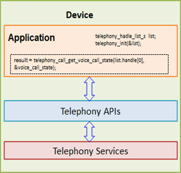

# Telephony Information


Through the telephony service, you can access various telephony features, such as call, SIM, network, and modem information.

The main Telephony Information API features are:

- Call information

  You can [retrieve information about the current call](#call_use) by using the Call API (in [mobile](../../api/mobile/latest/group__CAPI__TELEPHONY__INFORMATION__CALL.html) and [wearable](../../api/wearable/latest/group__CAPI__TELEPHONY__INFORMATION__CALL.html) applications) to retrieve a list of current call handles. You can also access voice and video call states, and use the state information in call-related actions.

  You can access the number, type, and status of the call. You can also determine the call direction (mobile-originated or mobile-terminated) and whether the call is a conference call.

- SIM information

  You can [extract information stored on a SIM card](#sim_use) using the SIM API (in [mobile](../../api/mobile/latest/group__CAPI__TELEPHONY__INFORMATION__SIM.html) and [wearable](../../api/wearable/latest/group__CAPI__TELEPHONY__INFORMATION__SIM.html) applications). You can get, for example, the ICC-ID (Integrated Circuit Card Identification), operator, and SPN (Service Provider Name) information.

- Network information

  You can [retrieve information about the current cellular network and telephony service](#network_use) using the Network API (in [mobile](../../api/mobile/latest/group__CAPI__TELEPHONY__INFORMATION__NETWORK.html) and [wearable](../../api/wearable/latest/group__CAPI__TELEPHONY__INFORMATION__NETWORK.html) applications). You can get, for example, the cell ID, LAC (Location Area Code), network type, and network name of the current cellular network and telephony service.

- Modem information

  You can [access information about the modem](#modem_use) using the Modem API (in [mobile](../../api/mobile/latest/group__CAPI__TELEPHONY__INFORMATION__MODEM.html) and [wearable](../../api/wearable/latest/group__CAPI__TELEPHONY__INFORMATION__MODEM.html) applications). You can get the IMEI (International Mobile Station Equipment Identity), MEID (Mobile Equipment Identifier), and power status of the modem.

- State changes

  You can receive notifications for various information change events related to call, SIM card, and network information. To monitor state change events, register state change callbacks with the `telephony_set_noti_cb()` function, by specifying the notification ID. The available notification IDs are defined in the `telephony_noti_e` enumeration (in [mobile](../../api/mobile/latest/group__CAPI__TELEPHONY__INFORMATION.html#ga3f9d407deee8c7c7f1f7ed946bc60b4d) and [wearable](../../api/wearable/latest/group__CAPI__TELEPHONY__INFORMATION.html#ga3f9d407deee8c7c7f1f7ed946bc60b4d) applications).

The following figure illustrates the telephony service and APIs.

**Figure: Telephony APIs and telephony service**



## Prerequisites

To enable your application to use the telephony information functionality:

1. To use the Telephony Information API (in [mobile](../../api/mobile/latest/group__CAPI__TELEPHONY__INFORMATION.html) and [wearable](../../api/wearable/latest/group__CAPI__TELEPHONY__INFORMATION.html) applications), the application has to request permission by adding the following privileges to the `tizen-manifest.xml` file:

   ```
   <privileges>
      <privilege>http://tizen.org/privilege/telephony</privilege>
      <privilege>http://tizen.org/privilege/location.coarse</privilege>
   </privileges>
   ```

2. To use the functions and data types of the Telephony Information API, include the `<telephony.h>` header file in your application:

   ```
   #include <telephony.h>
   ```

3. To create a telephony handle, use the `telephony_handle_list_s` structure that holds the handles for all the subscriptions defined in the `telephony_common.h` header file:

   ```
   struct _telephony_handle_list_s {
       unsigned int count;
       telephony_h *handle;
   };
   typedef struct _telephony_handle_list_s telephony_handle_list_s;
   ```

4. Get the telephony handle with the `telephony_init()` function. Pass the `telephony_handle_list_s` structure pointer as a parameter to get the telephony handles for all subscriptions.

   In a multi-SIM scenario, you must define which subscription (SIM1 or SIM2) you need, if your application is related to calling, networks, modems, or SIM cards. The telephony feature provides a function to create handles for different subscriptions. For example, there are 2 handles for a dual SIM device. In this case, `handle[0]` means the primary SIM and `handle[1]` means the secondary SIM. You can send requests to specific subscriptions using the telephony handle for that subscription.

   ```
   telephony_handle_list_s handle_list;

   int
   main()
   {
       int i;

       /* In the case of a single SIM, you get only one handle */
       ret = telephony_init(&handle_list);
       if (ret != TELEPHONY_ERROR_NONE) {
           /* Error handling */

           return -1;
       }
       for (i = 0; i < handle_list.count; i++) {
           dlog_print(DLOG_INFO, LOG_TAG, "telephony handle[%p] for subscription[%d]",
                      handle_list.handle[i], i);
       }

       return 0;
   }
   ```

5. When no longer needed, free the telephony handle with the `telephony_deinit()` function:

   ```
   void
   tutorial_telephony_deinit()
   {
       ret = telephony_deinit(&handle_list);
   }
   ```

<a name="call_use"></a>
## Retrieving Call Information

To get the voice and video call state and be notified when the user makes a voice or video call or hangs up the phone, use the Call API (in [mobile](../../api/mobile/latest/group__CAPI__TELEPHONY__INFORMATION__CALL.html) and [wearable](../../api/wearable/latest/group__CAPI__TELEPHONY__INFORMATION__CALL.html) applications).

Getting call information involves:

- [Getting the current call list](#call_list)
- [Receiving change notifications for the call state](#change_noti)

<a name="call_list"></a>
### Getting the Current Call List

To get the current call list:

1. Get the current call handle by using the `telephony_call_get_call_list()` function.

   After getting the handle, you can use it to retrieve various call information (such as handle ID, number, type, status, direction, and conference status).

   ```
   unsigned int count;
   telephony_call_h *call_list;

   void
   tutorial_telephony_call_get_call_list()
   {
       telephony_error_e ret;

       ret = telephony_call_get_call_list(handle_list.handle[0], &count, &call_list);
       if (ret != TELEPHONY_ERROR_NONE) {
           /* Error handling */
       } else {
           int i;
           unsigned int handle_id = 0;
           char *number = NULL;
           telephony_call_type_e type = 0;
           telephony_call_status_e status = 0;
           telephony_call_direction_e direction = 0;
           bool conf_status = 0;

           if (count == 0) {
               dlog_print(DLOG_INFO, LOG_TAG, "count[%d], No calls", count);

               return;
           }

           for (i = 0; i < count; i++) {
               telephony_call_get_handle_id(call_list[i], &handle_id);
               telephony_call_get_number(call_list[i], &number);
               telephony_call_get_type(call_list[i], &type);
               telephony_call_get_status(call_list[i], &status);
               telephony_call_get_direction(call_list[i], &direction);
               telephony_call_get_conference_status(call_list[i], &conf_status);

               dlog_print(DLOG_INFO, LOG_TAG,
                          "id[%d] number[%s] type[%s] status[%s] direction[%s] conference_status[%s]",
                          handle_id, number,
                          type == TELEPHONY_CALL_TYPE_VOICE ? "VOICE" :
                          type == TELEPHONY_CALL_TYPE_VIDEO ? "VIDEO" : "E911",
                          status == TELEPHONY_CALL_STATUS_IDLE ? "IDLE" :
                          status == TELEPHONY_CALL_STATUS_ACTIVE ? "ACTIVE" :
                          status == TELEPHONY_CALL_STATUS_HELD ? "HELD" :
                          status == TELEPHONY_CALL_STATUS_DIALING ? "DIALING" :
                          status == TELEPHONY_CALL_STATUS_ALERTING ? "ALERTING" :
                          status == TELEPHONY_CALL_STATUS_INCOMING ? "INCOMING" : "UNKNOWN",
                          direction == TELEPHONY_CALL_DIRECTION_MO ? "MO" : "MT",
                          conf_status ? "TRUE" : "FALSE");
               free(number);
           }
           telephony_call_release_call_list(count, &call_list);
       }
   }
   ```

2. When no longer needed, free the call handle with the `telephony_call_release_call_list()` function:

   ```
   void
   tutorial_telephony_call_release_call_list()
   {
       telephony_call_release_call_list(count, &call_list);
   }
   ```

<a name="change_noti"></a>
### Receiving Change Notifications for the Call State

To receive notifications of call state changes asynchronously, register a callback with the `telephony_set_noti_cb()` function.

You have to register the callback separately for each call state, using the applicable `TELEPHONY_NOTI_VOICE_CALL_XXX` or `TELEPHONY_NOTI_VIDEO_CALL_XXX` notification value in the second parameter of the `telephony_set_noti_cb()` function. The available values are defined in the `telephony_noti_e` enumerator (in [mobile](../../api/mobile/latest/group__CAPI__TELEPHONY__INFORMATION.html#ga3f9d407deee8c7c7f1f7ed946bc60b4d) and [wearable](../../api/wearable/latest/group__CAPI__TELEPHONY__INFORMATION.html#ga3f9d407deee8c7c7f1f7ed946bc60b4d) applications).

When the notifications are no longer needed, deregister the callback for each call state with the `telephony_unset_noti_cb()` function.

The following example registers callbacks for various voice call states:

```
static int
voice_call_noti_tbl[] =
{
    TELEPHONY_NOTI_VOICE_CALL_STATUS_IDLE,
    TELEPHONY_NOTI_VOICE_CALL_STATUS_ACTIVE,
    TELEPHONY_NOTI_VOICE_CALL_STATUS_HELD,
    TELEPHONY_NOTI_VOICE_CALL_STATUS_DIALING,
    TELEPHONY_NOTI_VOICE_CALL_STATUS_ALERTING,
    TELEPHONY_NOTI_VOICE_CALL_STATUS_INCOMING,
};

void
voice_call_status_noti_cb(telephony_h handle, telephony_noti_e noti_id, void *data, void* user_data)
{
    int ret_value;
    telephony_call_h *call_list;
    unsigned int count = 0;

    switch (noti_id) {
    case TELEPHONY_NOTI_VOICE_CALL_STATUS_IDLE:
        dlog_print(DLOG_INFO, LOG_TAG, "Noti!!! Voice Call Status Idle!!! [%d]", *(int *)data);
        break;
    case TELEPHONY_NOTI_VOICE_CALL_STATUS_ACTIVE:
        dlog_print(DLOG_INFO, LOG_TAG, "Noti!!! Voice Call Status Active!!! [%d]", *(int *)data);
        break;
    case TELEPHONY_NOTI_VOICE_CALL_STATUS_HELD:
        dlog_print(DLOG_INFO, LOG_TAG, "Noti!!! Voice Call Status Held!!! [%d]", *(int *)data);
        break;
    case TELEPHONY_NOTI_VOICE_CALL_STATUS_DIALING:
        dlog_print(DLOG_INFO, LOG_TAG, "Noti!!! Voice Call Status Dialing!!! [%d]", *(int *)data);
        break;
    case TELEPHONY_NOTI_VOICE_CALL_STATUS_ALERTING:
        dlog_print(DLOG_INFO, LOG_TAG, "Noti!!! Voice Call Status Alerting!!! [%d]", *(int *)data);
        break;
    case TELEPHONY_NOTI_VOICE_CALL_STATUS_INCOMING:
        dlog_print(DLOG_INFO, LOG_TAG, "Noti!!! Voice Call Status Incoming!!! [%d]", *(int *)data);
        break;
    default:
        dlog_print(DLOG_INFO, LOG_TAG, "Unknown noti");
        break;
    }

    ret_value = telephony_call_get_call_list(handle_list.handle[0], &count, &call_list);
    if (ret_value != TELEPHONY_ERROR_NONE) {
        dlog_print(DLOG_INFO, LOG_TAG, "telephony_call_get_call_list() failed!!! [0x%x]", ret_value);
    } else {
        int i;
        unsigned int handle_id = 0;
        char *number = NULL;
        telephony_call_type_e type = 0;
        telephony_call_status_e status = 0;
        telephony_call_direction_e direction = 0;
        bool conf_status = 0;

        for (i = 0; i < count; i++) {
            telephony_call_get_handle_id(call_list[i], &handle_id);
            telephony_call_get_number(call_list[i], &number);
            telephony_call_get_type(call_list[i], &type);
            telephony_call_get_status(call_list[i], &status);
            telephony_call_get_direction(call_list[i], &direction);
            telephony_call_get_conference_status(call_list[i], &conf_status);

            dlog_print(DLOG_INFO, LOG_TAG,
                       "id[%d] number[%s] type[%s] status[%s] direction[%s] conference_status[%s]",
                       handle_id, number,
                       type == TELEPHONY_CALL_TYPE_VOICE ? "VOICE" :
                       type == TELEPHONY_CALL_TYPE_VIDEO ? "VIDEO" : "E911",
                       status == TELEPHONY_CALL_STATUS_IDLE ? "IDLE" :
                       status == TELEPHONY_CALL_STATUS_ACTIVE ? "ACTIVE" :
                       status == TELEPHONY_CALL_STATUS_HELD ? "HELD" :
                       status == TELEPHONY_CALL_STATUS_DIALING ? "DIALING" :
                       status == TELEPHONY_CALL_STATUS_ALERTING ? "ALERTING" :
                       status == TELEPHONY_CALL_STATUS_INCOMING ? "INCOMING" : "UNKNOWN",
                       direction == TELEPHONY_CALL_DIRECTION_MO ? "MO" : "MT",
                       conf_status ? "TRUE" : "FALSE");
            free(number);
        }
        telephony_call_release_call_list(count, &call_list);
    }
}

void
tutorial_telephony_set_noti_cb_voice()
{
    telephony_error_e ret;
    int i;

    for (i = 0; i < (sizeof(voice_call_noti_tbl) / sizeof(int)); i++) {
        ret = telephony_set_noti_cb(handle_list.handle[0], voice_call_noti_tbl[i],
                                    voice_call_status_noti_cb, NULL);
        if (ret != TELEPHONY_ERROR_NONE)
            /* Error handling */
    }
}
```

<a name="sim_use"></a>
## Retrieving SIM Card Information

To extract information stored on a SIM card, use the SIM API (in [mobile](../../api/mobile/latest/group__CAPI__TELEPHONY__INFORMATION__SIM.html) and [wearable](../../api/wearable/latest/group__CAPI__TELEPHONY__INFORMATION__SIM.html) applications).

Getting SIM information involves:

- [Getting the SIM card state](#sim_state)
- [Receiving change notifications for the SIM card state](#sim_noti)
- [Getting SIM card details](#sim_info)

> **Note**  
> Before retrieving information from the SIM card, you must retrieve the state of the SIM card. You can get SIM-related information only if the SIM state is `TELEPHONY_SIM_STATE_AVAILABLE`.

<a name="sim_state"></a>
### Getting the SIM Card State

To get the state, call the `telephony_sim_get_state()` function. It returns the SIM card state in its second parameter, using the values of the `telephony_sim_state_e` enumerator (in [mobile](../../api/mobile/latest/group__CAPI__TELEPHONY__INFORMATION__SIM.html#ga08448f4cfaf7c59cd585008d3bf32b70) and [wearable](../../api/wearable/latest/group__CAPI__TELEPHONY__INFORMATION__SIM.html#ga08448f4cfaf7c59cd585008d3bf32b70) applications).

```
void
tutorial_telephony_sim_get_state()
{
    telephony_sim_state_e state;
    ret = telephony_sim_get_state(handle_list.handle[0], &state);
    if (ret != TELEPHONY_ERROR_NONE) {
        /* Error handling */
        return -1;
    }
    dlog_print(DLOG_INFO, LOG_TAG, "SIM status: [%d]", status);

    return 0;
}
```

<a name="sim_noti"></a>
### Receiving Change Notifications for the SIM Card State

To receive notifications of SIM card state changes asynchronously, register a callback with the `telephony_set_noti_cb()` function. The callback returns the SIM state in its third parameter.

When the notifications are no longer needed, deregister the callback with the `telephony_unset_noti_cb()` function by passing the notification ID as a parameter.

```
void
sim_state_noti_cb(telephony_h handle, telephony_noti_e noti_id, void *data, void* user_data)
{
    telephony_sim_state_e sim_state = *(int *)data;
    dlog_print(DLOG_INFO, LOG_TAG, "SIM state: [%d]", sim_state);
}

void
tutorial_telephony_set_noti_cb_sim()
{
    telephony_error_e ret;
    ret = telephony_set_noti_cb(handle_list.handle[0], TELEPHONY_NOTI_SIM_STATUS,
                                sim_state_noti_cb, NULL);
    if (ret != TELEPHONY_ERROR_NONE)
        /* Error handling */

    return 0;
}
```

<a name="sim_info"></a>
### Getting SIM Card Details

You can call various `telephony_sim_get_XXX()` functions to retrieve the SIM card details: ICC-ID, operator (MCC+MNC), MSIN, SPN, subscriber number, subscriber ID, and application list.

If the functions return `SIM_ERROR_NONE`, the requested SIM information is received and stored in an output parameter. Free all returned variables when they are no longer needed.

For example, to get ICC-ID information from a SIM card:

```
void
tutorial_telephony_sim_get_icc_id()
{
    telephony_error_e ret;
    char *iccid;
    ret = telephony_sim_get_icc_id(handle_list.handle[0], &iccid);
    if (ret == TELEPHONY_ERROR_NONE)
        dlog_print(DLOG_INFO, LOG_TAG, "Integrated Circuit Card IDentification: %s", iccid);
    free(iccid);

    return ret;
}
```

<a name="network_use"></a>
## Retrieving Network Information

To access information about the current cellular network and telephony service, use the Network API (in [mobile](../../api/mobile/latest/group__CAPI__TELEPHONY__INFORMATION__NETWORK.html) and [wearable](../../api/wearable/latest/group__CAPI__TELEPHONY__INFORMATION__NETWORK.html) applications).

Getting network information involves:

- [Getting the network service state](#network_state)
- [Receiving change notifications for the network service state](#network_noti)
- [Getting network details](#network_info)

> **Note**  
> Before retrieving information about the current cellular network and telephony service, you must retrieve the network service state. You can get network-related information only if the network state is `TELEPHONY_NETWORK_SERVICE_STATE_IN_SERVICE`.

<a name="network_state"></a>
### Getting the Network Service State

To get the state, call the `telephony_network_get_service_state()` function. It returns the network service state in its second parameter, using the values of the `telephony_network_service_state_e` enumeration (in [mobile](../../api/mobile/latest/group__CAPI__TELEPHONY__INFORMATION__NETWORK.html#gae9f3b6e54a1086b8734f4acc71fd001b) and [wearable](../../api/wearable/latest/group__CAPI__TELEPHONY__INFORMATION__NETWORK.html#gae9f3b6e54a1086b8734f4acc71fd001b) applications).

```
void
tutorial_telephony_network_get_service_state()
{
    telephony_network_service_state_e network_service_state;
    int ret;
    ret = telephony_network_get_service_state(handle_list.handle[0], &network_service_state);
    if (ret != TELEPHONY_ERROR_NONE) {
        /* Error handling */

        return -1;
    }
    dlog_print(DLOG_INFO, LOG_TAG, "Network Service State [%d]", network_service_state);

    return 0;
}
```

<a name="network_noti"></a>
### Receiving Change Notifications for the Network Service State

To receive notifications of network service state changes asynchronously, register a callback with the `telephony_set_noti_cb()` function. The callback returns the service state in its third parameter.

You have to register the callback separately for each service state (for example, Cell ID, RSSI level, network name, PS type, default data subscription, default subscription, or roaming state), using the applicable `TELEPHONY_NOTI_NETWORK_XXX` notification value in the second parameter of the `telephony_set_noti_cb()` function. The available values are defined in the `telephony_noti_e` enumerator (in [mobile](../../api/mobile/latest/group__CAPI__TELEPHONY__INFORMATION.html#ga3f9d407deee8c7c7f1f7ed946bc60b4d) and [wearable](../../api/wearable/latest/group__CAPI__TELEPHONY__INFORMATION.html#ga3f9d407deee8c7c7f1f7ed946bc60b4d) applications).

When the notifications are no longer needed, deregister the callback for each service state with the `telephony_unset_noti_cb()` function by passing the notification ID as a parameter.

The following example registers a callback for the network service states:

```
void
network_service_state_noti_cb(telephony_h handle, telephony_noti_e noti_id, void *data, void* user_data)
{
    telephony_network_service_state_e network_state = *(int *)data;
    dlog_print(DLOG_INFO, LOG_TAG, "Network service state: [%d]", network_state);
}

void
tutorial_telephony_set_noti_cb_network()
{
    telephony_error_e ret;
    ret = telephony_set_noti_cb(handle_list.handle[0], TELEPHONY_NOTI_NETWORK_SERVICE_STATE,
                                network_service_state_noti_cb, NULL);
    if (ret != TELEPHONY_ERROR_NONE)
        /* Error handling */

    return 0;
}
```

<a name="network_info"></a>
### Getting Network Details

You can call various `telephony_network_get_XXX()` functions to retrieve the network details: LAC, Cell ID, RSSI, roaming state, MCC, MNC, network provider name, PS type, and network type.

If the functions return `TELEPHONY_ERROR_NONE`, the requested network information is received and stored in an output parameter. Free all returned variables when they are no longer needed.

For example, to get the cell ID and MNC information:

```
/* Cell ID */
void
tutorial_telephony_network_get_cell_id()
{
    telephony_error_e ret;
    int cell_id;
    ret = telephony_network_get_cell_id(handle_list.handle[0], &cell_id);
    if (ret == TELEPHONY_ERROR_NONE)
        dlog_print(DLOG_INFO, LOG_TAG, "Cell Id: %d", cell_id);

    return ret;
}

/* MNC */
void
tutorial_telephony_network_get_mnc()
{
    telephony_error_e ret;
    char *mnc;
    ret = telephony_network_get_mnc(handle_list.handle[0], &mnc);
    if (ret == TELEPHONY_ERROR_NONE)
        dlog_print(DLOG_INFO, LOG_TAG, "mnc: %s", mnc);
    free(mnc);

    return ret;
}
```

<a name="modem_use"></a>
## Retrieving Modem Information

To access information about the modem, use the Modem API (in [mobile](../../api/mobile/latest/group__CAPI__TELEPHONY__INFORMATION__MODEM.html) and [wearable](../../api/wearable/latest/group__CAPI__TELEPHONY__INFORMATION__MODEM.html) applications).

You can call various `telephony_modem_get_XXX()` functions to retrieve the modem details: IMEI and power status.

If the functions return `TELEPHONY_ERROR_NONE`, the requested modem information is received and stored in an output parameter. Free all returned variables when they are no longer needed.

For example, to get IMEI information:

```
void
tutorial_telephony_modem_get_imei()
{
    telephony_error_e ret;
    char *imei;
    ret = telephony_modem_get_imei(handle_list.handle[0], &imei);
    if (ret == TELEPHONY_ERROR_NONE)
        dlog_print(DLOG_INFO, LOG_TAG, "imei: %s", imei);
    free(imei);

    return ret;
}
```

## Related Information
- Dependencies
  - Tizen 2.4 and Higher for Mobile
  - Tizen 2.3.1 and Higher for Wearable
