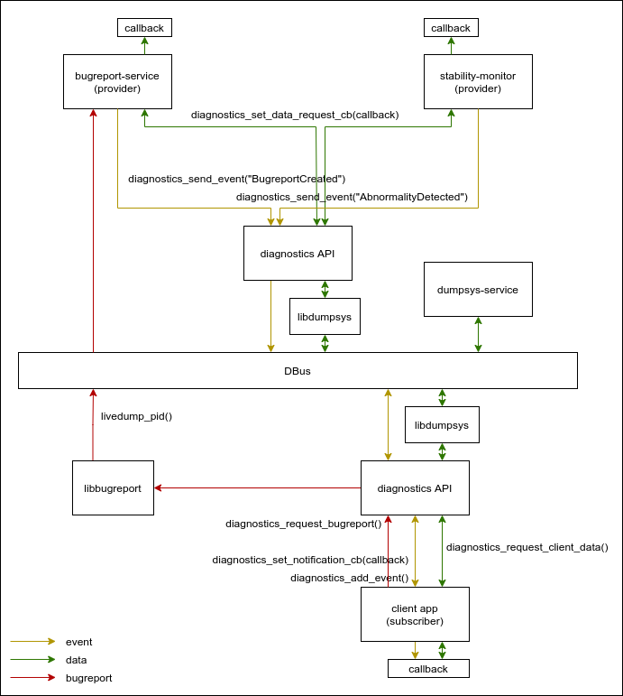
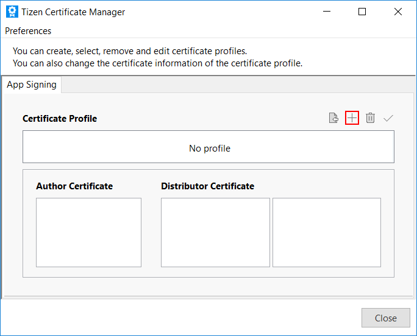
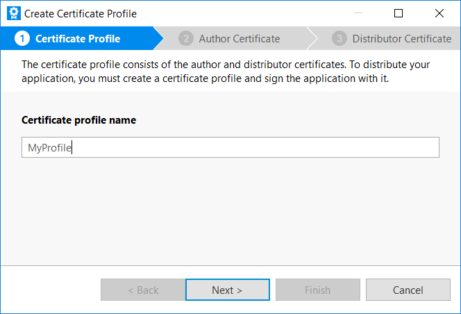
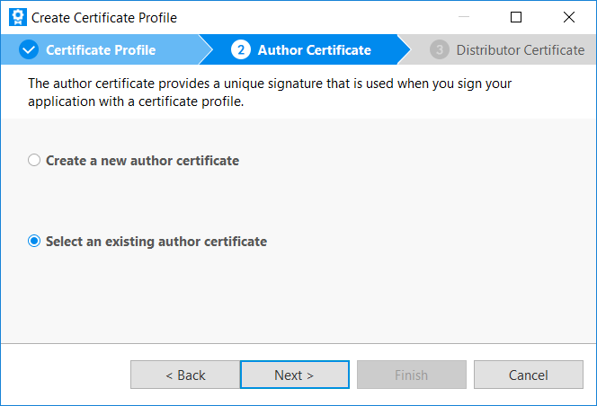
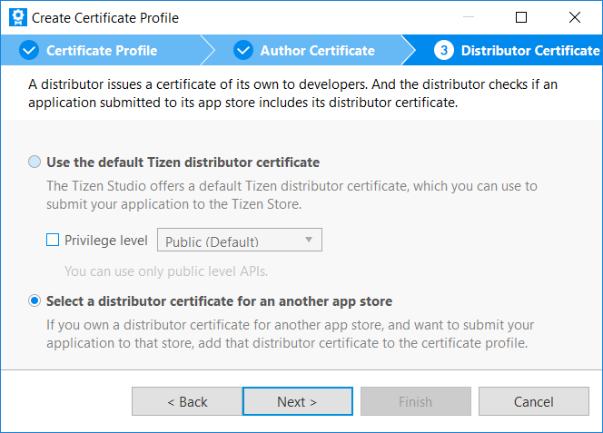
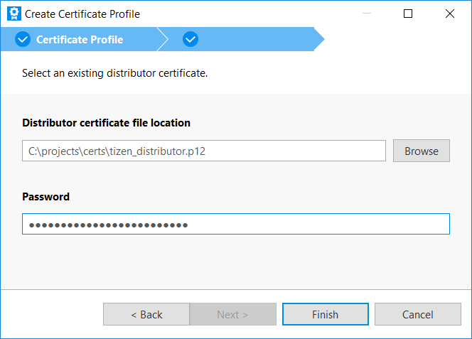
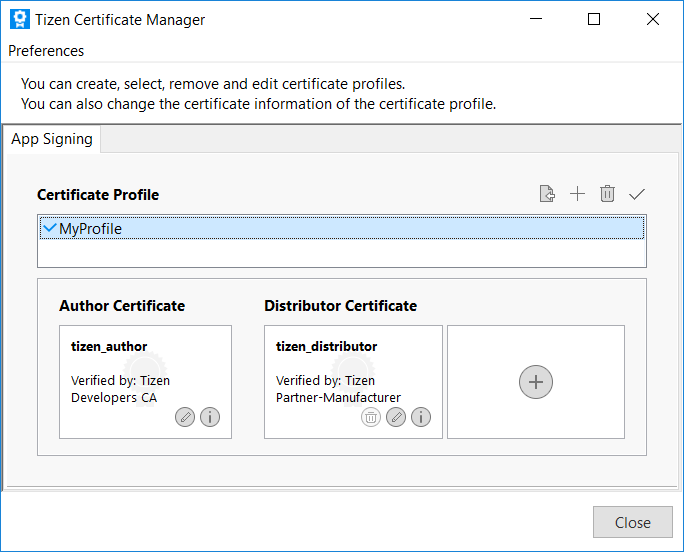

# Diagnostics API

Diagnostics API is used to collect data from applications and services, and allows to read crash reports if a process in the system crashes.

**Figure: Diagnostics API overall architecture**



## Prerequisites

1.  To use Diagnostics API to collect diagnostics data, the application must be signed with a platform level distributor certificate.

    To be able to sign application with a platform level certificate:

    1.  Open Certificate Manager in the Tizen Studio which is available in the **Tools** menu.
    2.  To add a new certificate profile, click **+** in the Certificate Manager.

        

    3.  Enter the profile name.

        

    4.  Select the option **Select an existing author certificate**.

        

    5.  Choose the **author certificate** from the disk using the **Browse** button.

        

    6.  Select the option **Select a distributor certificate for an another app store**.

        

    7.  Choose the **distributor certificate** from the disk using the **Browse** button.

        

    8.  Newly added profile should be visible in the profiles list. Close the window by clicking **Close** button.

        

2.  To use functions and data types of Diagnostics API, include the `<diagnostics.h>` header file in your application:

    ```cpp
    #include <diagnostics.h>
    ```

## Crash reports

Diagnostics API allows to read the crash reports in case the process in the system fails. To do so, it is necessary to register the callback that will be called when the crash report is created:

```cpp
void crash_callback(diagnostics_ctx_h ctx, void *user_data)
{
    [...]
}

int register_callback(void *user_data)
{
    return diagnostics_set_notification_cb(crash_callback, user_data);
}
```

> [!NOTE]
> To deregister the callback use:
> ```
> diagnostics_unset_notification_cb();
> ```

In case a new crash report is created, callback will be called. To read the content of the crash report use `diagnostics_get_data(...)` function.

```cpp
void crash_callback(diagnostics_ctx_h ctx, void *user_data)
{
    diagnostics_data_h data;
    const char *params[] = {"cs_info_json"};

    int ret = diagnostics_get_data(ctx, params, 1, &data);
    if (ret != DIAGNOSTICS_ERROR_NONE)
        return;

    [...]
}
```

By the `params` argument it is possible to specify which data should be read from the crash report. Currently the proper values are:

-   `"cs_info_json"` - JSON report will be returned, which contains information about crashed process (callstack, mapped memory regions, etc.)
-   `"cs_full"` - Full crash report ZIP archive will be collected.

The obtained data will be associated with the `data` Diagnostics handler. To read the data content it is necessary to use `diagnostics_data_read()` function.

```cpp
void crash_callback(diagnostics_ctx_h ctx, void *user_data)
{
    diagnostics_data_h data;
    const char *params[] = {"cs_info_json"};

    int ret = diagnostics_get_data(ctx, params, 1, &data);
    if (ret != DIAGNOSTICS_ERROR_NONE)
        return;

    char buff[0x1000];
    int timeout_ms = 0;
    size_t bytes_read;

    for (;;) {
        ret = diagnostics_data_read(data, buff, sizeof(buff), timeout_ms, &bytes_read);
        if (ret == DIAGNOSTICS_ERROR_TRY_AGAIN)
            continue;

        if (ret != DIAGNOSTICS_ERROR_NONE)
            break; // error occured

        if (bytes_read == 0)
            break; // no more data to read

        fwrite(buff, 1, bytes_read, stdout); // write received data to the STDOUT
    }
}
```

## Diagnostic data request

Diagnostics API can be used to request data from other application or service - especially diagnostic data that for various reasons cannot or should not be saved in logs e.g.:

-   binary or in custom format data,
-   large volume data,
-   reports that are time-consuming to create,
-   etc.

To do so, it is necessary to call `diagnostics_request_client_data()` function. The `client_id` variable should be the id of the process that supports Diagnostics API requests.

```cpp
void request_data()
{
    const char *client_id = "org.tizen.some_service";
    diagnostics_data_h data;
    const char *params[] = {"custom_parameter"};

    int ret = diagnostics_request_client_data(client_id, params, 1, &data);
    if (ret != DIAGNOSTICS_ERROR_NONE)
        return;

    char buff[0x1000];
    int timeout_ms = 0;
    size_t bytes_read;

    for (;;) {
        ret = diagnostics_data_read(data, buff, sizeof(buff), timeout_ms, &bytes_read);
        if (ret == DIAGNOSTICS_ERROR_TRY_AGAIN)
            continue;

        if (ret != DIAGNOSTICS_ERROR_NONE)
            break; // error occured

        if (bytes_read == 0)
            break; // no more data to read

        fwrite(buff, 1, bytes_read, stdout); // write received data to the STDOUT
    }
}
```

If `diagnostics_request_client_data()` returns no error, the obtained data can be read by `diagnostics_read_data()` function.

## Related information
- Dependencies
  - Tizen 6.0 and Higher for Mobile
  - Tizen 6.0 and Higher for Wearable
