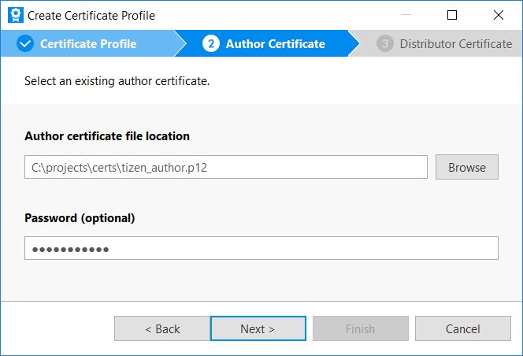

# Diagnostics

Diagnostics API is used to collect data from applications and services. This API also allows you to read crash reports if a process in the system crashes.

**Figure: Diagnostics overall architecture**


## Prerequisites

To enable your application to use Diagnostics API:

1. To use Diagnostics API to collect diagnostics data, the application must be signed with a platform level distributor certificate.

   To sign application with a platform level certificate:

   1. In Tizen Studio, select **Tools > Certificate Manager**.
   2. To add a new certificate profile, click **+** in the Certificate Manager window.

      

   3. Enter the profile name and click **Next**.

      

   4. Select **Select an existing author certificate** and click **Next**.

      

   5. Select an author certificate from the disk using **Browse**. Enter the password if needed and click **Next**.

      

   6. Select **Select a distributor certificate for an another app store** and click **Next**.

      

   7. Click **Browse** and select the distributor certificate. Enter the password and click **Finish**.

      

      This newly added profile appears in the profile list.

   8. Click **Close**.

      

2. To use functions and data types of Diagnostics API, include the `<diagnostics.h>` header file in your application:

   ```cpp
   #include <diagnostics.h>
   ```

## Diagnostic events

Diagnostics API allows you to send and receive diagnostic events. The events can contain additional data packed into the bundle.
To send diagnostic event, use `diagnostics_send_event()`:

```cpp
int main(int argc, char *argv[])
{
    bundle *event_data = bundle_create();

    // This is required for system services only, not applications
    diagnostics_set_client_id("diagnostics-client");

    bundle_add_str(event_data, "somekey", "somevalue");
    diagnostics_send_event("ConnectionBroken", event_data);

    bundle_free(event_data);
}
```

To receive diagnostic event, use `diagnostics_subscribe_event()` proceeded by `diagnostics_set_notification_cb()`:

```cpp
void notification_handler(diagnostics_ctx_h ctx, void *user_data)
{
    ...

    diagnostics_destroy(ctx);
}

int main(int argc, char **argv)
{
    diagnostics_set_notification_cb(notification_handler, NULL);
    diagnostics_subscribe_event("ConnectionBroken", "org.tizen.someapp");
}
```

## Diagnostic data request

Diagnostics API also can request data from other applications or services, especially you can request the diagnostic data that could not be saved in the logs due to various reasons. For example, if the volume of data is too large, the data format is not supported as it is in binary or custom format, reports that are time-consuming to create, and so on, such data can now be requested using this API.

To do so, call `diagnostics_request_client_data()`. The `client_id` variable must be the id of the process that supports Diagnostics API requests:

```cpp
void request_data()
{
    const char *client_id = "org.tizen.some_service";
    diagnostics_data_h data;
    const char *params[] = {"custom_parameter"};

    int ret = diagnostics_request_client_data(client_id, params, 1, &data);
    if (ret != DIAGNOSTICS_ERROR_NONE)
        return;

    char buff[0x1000];
    int timeout_ms = 0;
    size_t bytes_read;

    for (;;) {
        ret = diagnostics_data_read(data, buff, sizeof(buff), timeout_ms, &bytes_read);
        if (ret == DIAGNOSTICS_ERROR_TRY_AGAIN)
            continue;

        if (ret != DIAGNOSTICS_ERROR_NONE)
            break; // error occurred

        if (bytes_read == 0)
            break; // no more data to read

        fwrite(buff, 1, bytes_read, stdout); // write received data to the STDOUT
    }
}
```

If `diagnostics_request_client_data()` returns successfully, the obtained data can be read by `diagnostics_data_read()`.

Sometimes there is a need for getting data related to some specific diagnostics event. For example, Bugreport service sends an event that a new bug report has been created and the client wants to get the bug report's content after receiving the event. If the application supports event-specific data request, then `diagnostics_get_data()` must be used.

## Current implementations

### Bugreport service

Bugreport service provides a diagnostic interface to allow you to read the bug reports in case the process in the system fails. To do so, you must register the callback `diagnostics_set_notification_cb`, it is called when the bug report is created:

```cpp
void notification_handler(diagnostics_ctx_h ctx, void *user_data)
{
    ....
}

int main(int argc, char **argv)
{
    diagnostics_set_notification_cb(notification_handler, NULL);
    diagnostics_subscribe_event("BugreportCreated", "org.tizen.bugreport-service");
}
```

To deregister the callback, use `diagnostics_unset_notification_cb()`.

In case a new bug report is created, callback is called. To read the content of the bug report use `diagnostics_get_data()`:

```cpp
void notification_handler(diagnostics_ctx_h ctx, void *user_data)
{
    diagnostics_data_h data;
    const char *params[] = {"--type", "crash-info-json"};

    diagnostics_get_data(ctx, params, 2, &data);

    ...

    diagnostics_destroy(ctx);
}
```

Use the `param` argument to specify which data to read from the bug report. Currently, the proper values are:

-   `--type <report_type>` - Specify the report type. Available types are:
    -   `"bugreport"` - Bugreport file is returned, which contains information about system such as system logs, list of processes, and so on. The output can be modified by dump_systemstate configuration (default).
    -   `"crash-info"` - Returned report contains information about crashed process such as callstack, mapped memory regions, and so on.
    -   `"crash-info-json"` - crash-info report in JSON format.
    -   `"fullreport"` - Full crash report ZIP archive is collected (if single report specified).
    -   `"coredumptar"` - Coredump file in TAR archive (if single report specified).
-   `--last <seconds>` - Get reports generated within the last `<seconds>`.
-   `--from <timestamp>` - Get reports generated after specified time.
-   `--to <timestamp>` - Get reports generated before specified time (default: current time).
-   `<report_ident>` - Get one specific report.

The obtained data is associated with the `data` Diagnostics handler. To read the data content, use `diagnostics_data_read()`:

```cpp
void notification_handler(diagnostics_ctx_h ctx, void *user_data)
{
    diagnostics_data_h data;
    const char *params[] = {"--type", "fullreport"};

    int ret = diagnostics_get_data(ctx, params, 2, &data);
    if (ret != DIAGNOSTICS_ERROR_NONE) {
        diagnostics_destroy(ctx);
        return;
    }

    char buff[0x1000];
    int timeout_ms = 0;
    size_t bytes_read;

    for (;;) {
        ret = diagnostics_data_read(data, buff, sizeof(buff), timeout_ms, &bytes_read);
        if (ret ==  DIAGNOSTICS_ERROR_TRY_AGAIN)
            continue;

        if (ret != DIAGNOSTICS_ERROR_NONE)
            break; // error occurred

        if (bytes_read == 0)
            break; // no more data to read

        fwrite(buff, 1, bytes_read, stdout); // write received data to the STDOUT
    }

    diagnostics_destroy(ctx);
}
```

### Stability monitor

Stability monitor provides interface `org.tizen.stability-monitor` for getting process-specific data such as:

-   cpu usage
-   memory usage
-   io usage
-   number of open file descriptors

The following example shows how to get data for the process of pid 1234, collected within last 5 seconds:

```cpp
int main(int argc, char **argv)
{
    diagnostics_data_h data;
    const char *params[] = {"--pid", "1234", "--last", "5"};
    char buf[1000];
    size_t bytes_read;

    diagnostics_request_client_data("org.tizen.stability-monitor", params, sizeof(params)/sizeof(char*), &data);

    while (true) {
        diagnostics_data_read(data, buf, sizeof(buf)/sizeof(char), -1, &bytes_read);
        if (bytes_read == 0) // Reached EOF
            break;

        // Process the chunk of data
    }

    diagnostics_data_destroy(data);
}
```

Supported parameters:

-   `--pid <number>` - dump only process with given pid,
-   `--type <module>` - dump only specified module, ex. `cpu`, `mem`, `io`, or `fd`,
-   `--last <sec>` - dump data from last `<sec>` seconds,
-   `--help` - dump help message.

Additionally, stability monitor sends diagnostic event `AbnormalityDetected` in case of any of the monitored parameters exceed their limit set in the configuration.

## Related information
- Dependencies
  - Tizen 6.0 and Higher for Mobile
  - Tizen 6.0 and Higher for Wearable
