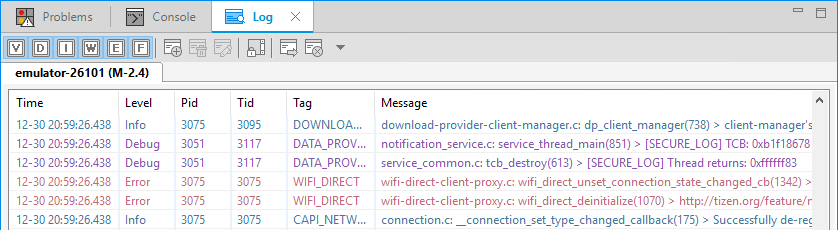
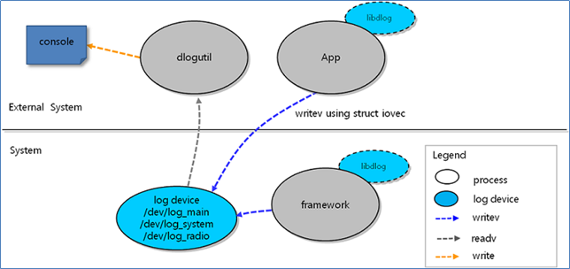

# System Logs


To generate and view system logs in Tizen, you can use the dlog logging service. It consists of the dlogutil dlog library, which sends log messages to a log device. The log device is a circular buffer used to collect log messages from various applications and the system.

Before you start, familiarize yourself with the priorities and tags you can use.

The main features of the dlog API include:

- Creating and sending log messages

  When you [define a log message with a specific priority and tag](#message) in the application code, the dlog service sends the log message to the circular buffer.

- Viewing the log output

  You can view the log output from the circular buffer in 2 ways:

  - In the device sdb shell (when testing with a target device), [use the logutil commands](#dlogutil).

    You can use the message priority and tag to filter the output and only view specific messages.

  - In the Tizen Studio (when testing with an emulator), use the **Log** view.

    You can filter the messages by their priority level. You can also search the messages by keywords, such as pid, tid, tag, and message.

    **Figure: Messages in the Log view**

    

The following figure illustrates the general architecture of the dlog logging service.

**Figure: Architecture**



<a name="message"></a>
## Log Message Content

The log message contains a priority level, tag, and the actual message text:

- The priority level indicates the urgency of the log message.

  **Table: Priority levels**

  | Priority     | Description                              |
  |--------------|------------------------------------------|
  | `DLOG_DEBUG` | Debugging message for an unexpected exception that needs to be checked |
  | `DLOG_INFO`  | Information message describing normal operation |
  | `DLOG_WARN`  | Warning message, which means that an error is likely to occur if no action is taken |
  | `DLOG_ERROR` | Error message describing a problem       |

- The tag is a short name indicating the system component from which the message originates.

  There are no naming limitations, but do not forget that the tag is an identification of a module, and each tag must be unique.

- The message text describes the situation or error to be logged.

## Message Handling

The log messages are used to provide information for testing purposes about errors and exceptional situations in the application operation. In a typical situation, a function is used to perform an action, and then the function return value is checked to make sure that the operation was successful. If the operation has failed, a log message is used to provide information about what happened:

```
location_manager_h location_handle;
/* Function call */
int result = location_manager_create(LOCATION_METHOD_GPS, location_handle);
/* Return value check */
if (result != LOCATIONS_ERROR_NONE) {
    /* If the function failed, provide information in a log message */
    dlog_print(DLOG_INFO, "MyTag", "Creation of the location manager failed.");

    return false;
}
```

To [create and send a log message](#send), use the `dlog_print()` and `dlog_vprint()` functions. The first parameter defines the priority level, and the second parameter defines the tag. Both functions return a value from the `dlog_error_e` enumerator (in [mobile](../../api/mobile/latest/group__CAPI__SYSTEM__DLOG.html#ga75b37fc3103da74bb4122d98968d8c17) and [wearable](../../api/wearable/latest/group__CAPI__SYSTEM__DLOG.html#ga75b37fc3103da74bb4122d98968d8c17) applications).

```
/* dlog_print */
#include <dlog.h>
int
main(void)
{
    int integer = 21;
    char string[] = "test dlog";
    dlog_print(DLOG_INFO, "USR_TAG", "test dlog");
    dlog_print(DLOG_INFO, "USR_TAG", "%s, %d", string, integer);

    return 0;
}

/* dlog_vprint */
#include <dlog.h>
void
my_debug_print(char *format, ...)
{
    va_list ap;
    va_start(ap, format);
    dlog_vprint(DLOG_INFO, "USR_TAG", format, ap);
    va_end(ap);
}

int
main(void)
{
    my_debug_print("%s", "test dlog");
    my_debug_print("%s, %d", "test dlog", 21);

    return 0;
}
```

The priority level for the log message can be defined using macros. The following examples show how to create log messages using different priority levels:

- Information message with the `DLOG_INFO` priority and the `MyTag` tag:

    ```
    /* Print the info message with the tag to the console */
    dlog_print(DLOG_INFO, "MyTag", "Initialization successful.");
    ```

- Debug message with the `DLOG_DEBUG` priority and the `MyTag` tag:

    ```
    /* Print the debug message with the tag to the console */
    dlog_print(DLOG_DEBUG, "MyTag", "string:", "%s", "Test");
    ```

- Error message with the `DLOG_ERROR` priority and the `MyTag` tag:

    ```
    if (something_wrong) {
        /* Print the error message with the tag to the console */
        dlog_print(DLOG_ERROR, "MyTag", "An unexpected error occurred");
    }
    ```

- Warning message with the `DLOG_WARN` priority and the `MyTag` tag:

    ```
    /* Print the warning message with the tag to the console */
    dlog_print(DLOG_WARN, "MyTag", "warning!");
    ```

<a name="dlogutil"></a>
## Logutil Commands

You can [collect, filter, and view the content of the log buffers](#check) with logutil using the following command:

```
dlogutil <option> <filter-spec>
```

- Options

  The following table lists the available options for the `dlogutil` command.

  **Table: Command options**

  | Option          | Description                              |
  |-----------------|------------------------------------------|
  | `-b <buffer>`   | Alternates the log buffer. The main buffer is used by the default buffer. |
  | `-c`            | Clears the entire log and exits.         |
  | `-d`            | Dumps the log and exits.                 |
  | `-f <filename>` | Writes the log to \<filename\>. The default filename is `stdout`. |
  | `-g`            | Prints the size of the specified log buffer and exits. |
  | `-n <count>`    | Sets the maximum number of rotated logs to \<count\>. The default value is 4. Requires the `-r` option. |
  | `-r <Kbytes>`   | Rotates the log file every \<Kbytes\> of output. The default value is 16. Requires the `-f` option. |
  | `-s`            | Sets the default filter spec to silent.  |
  | `-v <format>`   | Sets the output format for log messages.<br> The log messages contain a number of metadata fields in addition to tag and priority. This option modifies the output format for messages so that they display a specific metadata field. The supported output formats are:<br> - `brief` (default): Displays the priority/tag and PID of the originating process. <br> - `process`: Displays the PID only.<br> - `tag`: Displays the priority/tag only.<br> - `thread`: Displays the process:thread and priority/tag only.<br> - `raw`: Displays the raw log message, with no other metadata fields <br> - `time`: Displays the date, invocation time, priority/tag, and PID of the originating process.<br> - `long`: Displays all metadata fields and separates messages with blank lines. |

  For example, to print out all log messages using a format that only includes the message PID:

  ```
  # dlogutil -v <process>
  ```

- Filter specs

  You can use the filter specs in the `dlogutil` command to determine which commands are included in the output. Use the `tag:priority` format, where the tag indicates the message tag and the priority indicates the minimum level of priority to report for that tag. Only the messages that include the specified tag and are at least on the defined priority level are included in the command output.

  The priority is one of the following character values, ordered from the lowest to the highest priority:

  - D: Debug
  - I: Info
  - W: Warning
  - E: Error

  You can add any number of `tag:priority` specifications in a single command.

  For example, to print out all log messages on or above the info priority, or all log messages on or above the debug priority with the `MyApp` tag:

  ```
  /* All messages on or above info priority */
  # dlogutil *:I

  /* All messages on or above debug priority with MyApp tag */
  # dlogutil MyApp:D
  ```

## Prerequisites

To enable your application to use the dlog functionality:

1. To use the functions and data types of the dlog API (in [mobile](../../api/mobile/latest/group__CAPI__SYSTEM__DLOG.html) and [wearable](../../api/wearable/latest/group__CAPI__SYSTEM__DLOG.html) applications), include the `<dlog.h>` header file in your application:

   ```
   #include <dlog.h>
   ```

2. Make sure you have the necessary tools:

   - dlog library: `libdlog.so`

     The dlog library provides a logging function to send log messages to the kernel log device.

   - dlogutil: `dlogutil`

     dlogutil enables you to view log messages in the log device, and provides filtered message output.

   - linux-2.6.32 kernel

<a name="send"></a>
## Sending a Log Message

To send a log message with the `MY_APP` tag with various priorities, use the `dlog_print()` function:

```
#define TAG "MY_APP"

int
main(void)
{
    int integer = 21;
    char string[] = "test dlog";

    dlog_print(DLOG_DEBUG, TAG, "debug message");
    dlog_print(DLOG_INFO, TAG, "info message");
    dlog_print(DLOG_WARN, TAG, "warning message");
    dlog_print(DLOG_ERROR, TAG, "error message");
    dlog_print(DLOG_INFO, TAG, "%s, %d", string, integer);

    return 0;
}
```

<a name="check"></a>
## Checking the Output Logs

To check the content of the output log, execute dlogutil in the device sdb shell. The following code snippet shows examples of the various available commands and their output.

For information on connecting to the target and using it with SDB, see [Connecting Devices over Smart Development Bridge](../../../tizen-studio/common-tools/smart-development-bridge.md).

```
Desktop:~$ sdb shell
sh-3.2#
sh-3.2# dlogutil MY_APP
arc = 2, optind = 1, Kb 0, rotate 4
--------- beginning of /dev/log_system
--------- beginning of /dev/log_main
D/MY_APP  (11097): debug message
I/MY_APP  (11097): info message
W/MY_APP  (11097): warning message
E/MY_APP  (11097): error message
I/MY_APP  (11097): test dlog, 21
sh-3.2# dlogutil MY_APP:I
arc = 2, optind = 1, Kb 0, rotate 4
--------- beginning of /dev/log_system
--------- beginning of /dev/log_main
I/MY_APP  (11097): info message
W/MY_APP  (11097): warning message
E/MY_APP  (11097): error message
I/MY_APP  (11097): test dlog, 21
sh-3.2# dlogutil MY_APP:W
arc = 2, optind = 1, Kb 0, rotate 4
--------- beginning of /dev/log_system
--------- beginning of /dev/log_main
W/MY_APP  (11097): warning message
E/MY_APP  (11097): error message
sh-3.2# dlogutil MY_APP:E
arc = 2, optind = 1, Kb 0, rotate 4
--------- beginning of /dev/log_system
--------- beginning of /dev/log_main
E/MY_APP  (11097): error message
sh-3.2# dlogutil -v time MY_APP
arc = 4, optind = 3, Kb 0, rotate 4
--------- beginning of /dev/log_system
--------- beginning of /dev/log_main
12-26 07:06:02.084+0000 D/MY_APP  (11097): debug message
12-26 07:06:02.084+0000 I/MY_APP  (11097): info message
12-26 07:06:02.084+0000 W/MY_APP  (11097): warning message
12-26 07:06:02.084+0000 E/MY_APP  (11097): error message
12-26 07:06:02.084+0000 I/MY_APP  (11097): test dlog, 21
sh-3.2# dlogutil -v threadtime MY_APP
arc = 4, optind = 3, Kb 0, rotate 4
--------- beginning of /dev/log_system
--------- beginning of /dev/log_main
12-26 07:06:02.084+0000 11097 11097 D MY_APP  : debug message
12-26 07:06:02.084+0000 11097 11097 I MY_APP  : info message
12-26 07:06:02.084+0000 11097 11097 W MY_APP  : warning message
12-26 07:06:02.084+0000 11097 11097 E MY_APP  : error message
12-26 07:06:02.084+0000 11097 11097 I MY_APP  : test dlog, 21
sh-3.2# dlogutil -v long MY_APP
arc = 4, optind = 3, Kb 0, rotate 4
--------- beginning of /dev/log_system
--------- beginning of /dev/log_main
[ 12-26 07:06:02.084 11097:11097 D/MY_APP   ]
debug message

[ 12-26 07:06:02.084 11097:11097 I/MY_APP   ]
info message

[ 12-26 07:06:02.084 11097:11097 W/MY_APP   ]
warning message

[ 12-26 07:06:02.084 11097:11097 E/MY_APP   ]
error message

[ 12-26 07:06:02.084 11097:11097 I/MY_APP   ]
test dlog, 21
sh-3.2# dlogutil -v raw MY_APP
arc = 4, optind = 3, Kb 0, rotate 4
--------- beginning of /dev/log_system
--------- beginning of /dev/log_main
debug message
info message
warning message
error message
test dlog, 21
sh-3.2# dlogutil -v brief MY_APP
arc = 4, optind = 3, Kb 0, rotate 4
--------- beginning of /dev/log_system
--------- beginning of /dev/log_main
D/MY_APP  (11097): debug message
I/MY_APP  (11097): info message
W/MY_APP  (11097): warning message
E/MY_APP  (11097): error message
I/MY_APP  (11097): test dlog, 21
```

## Related Information
- Dependencies
  - Tizen 2.4 and Higher for Mobile
  - Tizen 2.3.1 and Higher for Wearable
