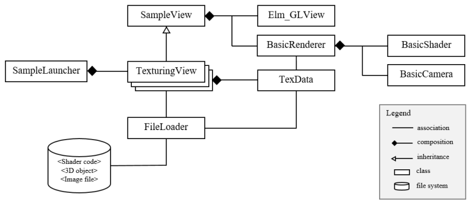
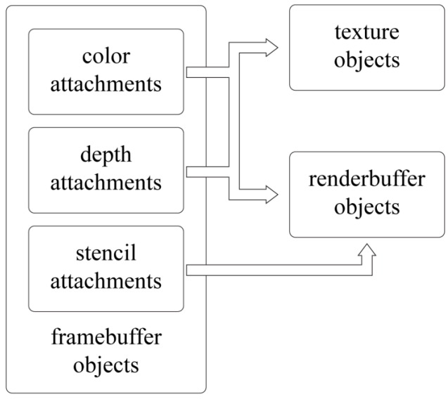
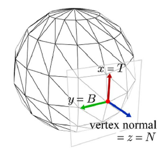
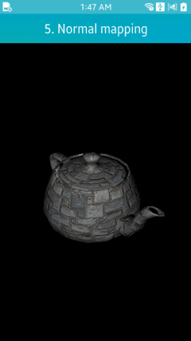

# Advanced Rendering


This topic introduces various advanced methods for rendering.

## Sample Applications Using the Renderer Architecture

In order to increase reusability, this section presents a simple OpenGL&reg; ES-based renderer and a sample view architecture based on the renderer. Its class diagram is shown in the following figure. SampleLauncher creates a sample view instance, such as TexturingView. Each sample view inherits from the SampleView class, which creates the GLView and BasicRenderer instances.

**Figure: Class diagram for sample views and renderer**



The callback functions for GLView are registered as presented in [Creating OpenGL&reg; ES Applications](creating-opengles.md). At the initialization stage, the sample view uses the FileLoader class to read the resource files, such as shaders, 3D objects, and texture images, from the Tizen application resource file path. These data are passed to BasicRenderer. At the initialization stage when the `init_glview()` callback is invoked, BasicRenderer uses the shader code and BasicShader to create, compile, and link the program object.

In addition to BasicShader, BasicRenderer uses, for example, BasicCamera, vertex array, and texture object ID, for rendering a scene. When rendering is requested by the sample view, BasicRenderer initializes color and depth buffers through the `glClear()` function, and then computes many data needed for rendering, such as world, view, and projection matrices. These are transferred to BasicShader, which invokes the `glUniformXXX()` function to pass them to the current program object. Finally, the `glDrawElements()` function is invoked.

For handling texture images, the sample uses the TexData class. The sample application creates a TexData instance and passes it to FileLoader together with the file name of the texture image. Then, FileLoader stores the decoded pixel data into the TexData instance. When the TexData instance is given to BasicRender, OpenGL&reg; ES functions, such as `glGenTexture()` and `glTexImage2D()`, are invoked. After the texture object is created and sampler uniforms, such as `sampler2D` and `samplerCube`, are passed to the fragment shader, texturing can be done.

For convenience, use the OpenGL&reg; mathematics library, GLM. GLM is a header only C++ mathematics library for graphics software based on the OpenGL&reg; shading language (GLSL) specification. GLM provides classes and functions designed and implemented with the same naming conventions and functionalities as in GLSL.

## Framebuffer Object and Render-to-texture

In Tizen, the drawing surface is created by GLView. To render a scene, OpenGL&reg; ES receives this surface, which is called 'on-screen buffer'. For simple applications, the on-screen-buffer alone is sufficient. However, if the application needs to render to a texture, for example, an 'off-screen-buffer' is helpful as it can be used as a texture. In OpenGL&reg; ES, the Framebuffer Object (FBO) can be an 'off-screen-buffer' and also supports 'render to texture.'

OpenGL&reg; ES provides functions to generate, bind, and configure an FBO. As shown in the following figure, the FBO consists of color, depth, and stencil attachments. It can be used as a texture by binding a texture object to its color or depth attachment point. On the other hand, OpenGL&reg; ES supports a renderbuffer object, which is a 2D image buffer and can be bound to color, depth or stencil attachment point. FBO is useful for environment mapping, shadow mapping, post-processing and effects, including, for example, motion blur.

**Figure: Framebuffer, renderbuffer, and texture objects**



FBO is defined as follows:

1. A texture or renderbuffer object is generated using the `glGenTextures()` or `glGenRenderbuffers()` function.
2. Binding is made using the `glBindTexture()` or `glBindRenderbuffer()` function before being attached to the FBO.
3. The `glTexParameteri()` or `glRenderbufferStorage()` function is called to specify the properties of the object.
4. The `glFramebufferRenderbuffer()` or `glFramebufferTexture2D()` function is invoked to attach the object to the FBO.

The following code creates an FBO as an 'off-screen-buffer' that enables render-to-texture:

```
/*
   This function shows how to create new framebuffer object
   with texture color buffer and depth render buffer
   To render a texture, bind framebuffer to 'newFbo' using
   glBindeFramebuffer() and make a drawcall. Then, simply
   use 'colorTex' as a general texture
   This function does not make a stencil buffer
   To use stencil buffer for off-screen-buffer, make another
   renderbuffer object and attach to framebuffer using
   glFramebufferRenderbuffer()
*/
void
createFbo()
{
    GLuint colorTex, depthRbo, newFbo;

    /* Size of texture and renderbuffer object */
    /*
       Check whether GL_MAX_RENDERBUFFER_SIZE >= width and height
       using glGetIntegerv(GL_MAX_RENDERBUFFER_SIZE, &maxSize)
    */
    GLint  texWidth = 256, texHeight = 256;

    /* Generate texture object */
    glGenTextures(1, &colorTex);
    glBindTexture(GL_TEXTURE_2D, colorTex);
    glTexImage2D(GL_TEXTURE_2D, 0, GL_RGBA,
                 texWidth, texHeight, 0, GL_RGBA, GL_UNSIGNED_BYTE, NULL);

    /* Set texture wrapping and filtering mode */
    glTexParameteri(GL_TEXTURE_2D, GL_TEXTURE_WRAP_S, GL_CLAMP_TO_EDGE);
    glTexParameteri(GL_TEXTURE_2D, GL_TEXTURE_WRAP_T, GL_CLAMP_TO_EDGE);
    glTexParameteri(GL_TEXTURE_2D, GL_TEXTURE_MIN_FILTER, GL_NEAREST);
    glTexParameteri(GL_TEXTURE_2D, GL_TEXTURE_MAG_FILTER, GL_NEAREST);

    /* Generate renderbuffer object */
    glGenRenderbuffers(1, &depthRbo);
    glBindRenderbuffer(GL_RENDERBUFFER, depthRbo);
    glRenderbufferStorage(GL_RENDERBUFFER, GL_DEPTH_COMPONENT16,
                          texWidth, texWidth); /* 16-bit depthbuffer */

    /*
       Generate framebuffer object and bind texture and
       renderbuffer object to attachment points
    */
    glGenFramebuffers(1, &newFbo);
    glBindFramebuffer(GL_FRAMEBUFFER, newFbo);
    glFramebufferTexture2D(GL_FRAMEBUFFER, GL_COLOR_ATTACHMENT0,
                           GL_TEXTURE_2D, colorTex, 0);
    glFramebufferRenderbuffer(GL_FRAMEBUFFER, GL_DEPTH_ATTACHMENT,
                              GL_RENDERBUFFER, depthRbo);

    /* Check for framebuffer complete */
    if (glCheckFramebufferStatus(GL_FRAMEBUFFER) != GL_FRAMEBUFFER_COMPLETE)
        dlog_print(DLOG_ERROR, LOG_TAG, "FrameBufferObject is not complete!\n");

    glBindFramebuffer(GL_FRAMEBUFFER, 0);
}
```

## Cube Mapping

**Environment mapping** is a technique to simulate a shiny object reflecting its surrounding environment, as shown in the following figure. Among several implementations of environment mapping, the most popular is **cube mapping**. It uses a **cube map** composed of 6 square image textures. The images are textured to the surface of the shiny object.

**Figure: Cube mapping example**


A cube map is created by positioning a camera at the center of the object and rendering along each positive/negative principal axis directions using a 90-degree field of view. The following figure shows how a cube map texture is composed. For a static environment, this is made at the preprocessing stage.

**Figure: Composition of the cubemap texture**


The [Texturing](texturing.md) topic presents how to create texture objects using OpenGL&reg; ES APIs. For using a cube map texture, provide `GL_TEXTURE_CUBE_MAP` instead of `GL_TEXTURE_2D` for the `glGenTexture()` and `glBindTexture()` functions.

The following code creates a cube map texture for environment mapping:

```
void
ImlRenderer::CreateCubeTex(const TexData *cubeTex, GLuint &target)
{
    glPixelStorei(GL_UNPACK_ALIGNMENT, 1);
    checkGlError("glPixelStorei");
    glGenTextures(1, &target);
    checkGlError("glGenTextures");

    glBindTexture(GL_TEXTURE_CUBE_MAP, target);
    checkGlError("glBindTexture");

    for (int i = 0; i < 6; ++i)
        TexBuffer((GLenum)GL_TEXTURE_CUBE_MAP_POSITIVE_X + i, cubeTex[i]);

    glGenerateMipmap(GL_TEXTURE_CUBE_MAP);
    checkGlError("glGenerateMipmap");

    glTexParameteri(GL_TEXTURE_CUBE_MAP, GL_TEXTURE_MIN_FILTER,
                    GL_LINEAR_MIPMAP_LINEAR);
    checkGlError("glTexParameteri");
    glTexParameteri(GL_TEXTURE_CUBE_MAP, GL_TEXTURE_MAG_FILTER, GL_LINEAR);
    checkGlError("glTexParameteri");

    glTexParameteri(GL_TEXTURE_CUBE_MAP, GL_TEXTURE_WRAP_S, GL_REPEAT);
    checkGlError("glTexParameteri");
    glTexParameteri(GL_TEXTURE_CUBE_MAP, GL_TEXTURE_WRAP_T, GL_REPEAT);
    checkGlError("glTexParameteri");

    glBindTexture(GL_TEXTURE_CUBE_MAP, 0);
}

void
ImlRenderer::TexBuffer(GLenum type, const TexData& newTex)
{
    LOGI("ImlRenderer::TexBuffer");

    glTexImage2D(type, 0, newTex.format, newTex.width, newTex.height, 0,
                 (GLenum)newTex.format, GL_UNSIGNED_BYTE, (void*)newTex.pixels);

    checkGlError("glTexImage2D");
}
```

In the above code, see `GL_TEXTURE_CUBE_MAP_POSITIVE_X`, a parameter of the `TexBuffer()` function. It represents which side of the environment is contained in the cube map texture.

To access the cube map texture in the fragment shader, compute a reflection vector. The viewing direction vector is reflected with respect to the normal. This vector is used as texture coordinates to fetch the cube map through the `textureCube()` function. The following shader code calculates the reflection vector and accesses the cube map texture:

```
precision mediump float;

uniform samplerCube s_texCube;
uniform vec3 eyePos;

varying vec3 v_normal;
varying vec2 v_texCoord;

void
main()
{
    vec3 nor = normalize(v_normal);
    vec3 ray = normalize(eyePos);

    vec3 reflec = 2.0 * nor * dot(nor, ray) - ray;
    vec4 envColor = textureCube(s_texCube, reflec);

    gl_FragColor = envColor;
}
```

## Normal Mapping with Multi-texturing

A **normal map** is a 2D texture that stores a normal vector at each texel. The red channel represents the `x` component, the green channel the `y` component, and the blue channel the `z` component. This triple is scaled and biased in the shader to map to a normal, each component of which is in [-1, 1].

The normals of a normal map are defined in the **tangent spaces** of the object surface. In a tangent space, the Z axis corresponds to the surface normal. The left side of the following figure shows 2 tangent spaces, one defined for a surface point `p` and the other for another point `q`. Observe that the tangent spaces vary across the object surface. Assuming that a tangent space is defined for a surface point to be normal-mapped, the normal fetched from the normal map is taken as being defined in the tangent space of the point. In this respect, it is named the **tangent-space normal**. The tangent-space normals perturb the surface normal.

**Figure: Tangent spaces**

 

The surface normal of a polygon mesh is computed per vertex at the modeling stage. It is the vertex normal. The tangent space is constructed per vertex so that its Z axis corresponds to the vertex normal, as shown in the right side of the above figure.

3 orthonormal vectors define the tangent space:

- Vertex normal denoted by `N`
- Vector denoted by `T` (for **tangent**)
- Vector denoted by `B` (for **binormal**)

Tangent vectors (`T`) are computed in BasicRenderer. Then, `N` and `T` are passed to the vertex shader, where `B` is computed by taking the cross product of `N` and `T` and then a rotation matrix is constructed from the `TBN` vectors. This **basis-change matrix** converts the world space light vector into the tangent space, so that lighting is computed at the tangent space by the fragment shader.

The following vertex shader presents how to construct the basis-change matrix from the `TBN` vectors:

```
uniform mat4 worldMat;
uniform mat4 viewMat;
uniform mat4 projMat;

uniform vec3 eyePos;
uniform vec3 lightPos;

attribute vec3 position;
attribute vec3 normal;
attribute vec2 texCoord;
attribute vec3 tangent;

varying vec2 v_texCoord;
varying vec3 v_lightDirTS;
varying vec3 v_viewTS;

void
main()
{
    vec4 world_pos = worldMat * vec4(position, 1.0);
    gl_Position = projMat * viewMat * world_pos;
    v_texCoord = texCoord;

    vec3 nor = mat3(worldMat) * normal;
    vec3 tan = mat3(worldMat) * normalize(tangent);
    vec3 bin = cross(nor, tan);
    mat3 worldToTangentSpace = mat3(tan.x, bin.x, nor.x,
                                    tan.y, bin.y, nor.y,
                                    tan.z, bin.z, nor.z);

    v_lightDirTS = worldToTangentSpace * (lightPos - world_pos.xyz);
    v_viewTS = worldToTangentSpace * (eyePos - world_pos.xyz);
}
```

The fragment shader in the following example accepts the per-fragment light vector, fetches the tangent-space normal from the normal map, and computes per-fragment lighting. The result of normal mapping is shown in the following figure.

```
precision mediump float;

uniform sampler2D s_tex0;
uniform sampler2D s_texNor;

varying vec2 v_texCoord;
varying vec3 v_lightDirTS;
varying vec3 v_viewTS;

vec3 phongLightFragNormal(vec3 Md, vec3 normal);

void
main()
{
    vec3 md = texture2D(s_tex0, v_texCoord).xyz;
    vec3 tanNor = normalize(texture2D(s_texNor, v_texCoord).xyz * 2.0 - vec3(1.0));
    gl_FragColor = vec4(phongLightFragNormal(md, tanNor), 1.0);
}
```

**Figure: Normal mapping example**



## Related Information
- Dependencies
  - Tizen 2.4 and Higher for Mobile
  - Tizen 2.3.1 and Higher for Wearable
