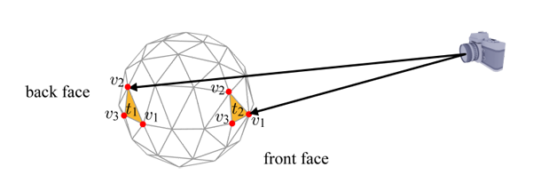
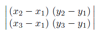
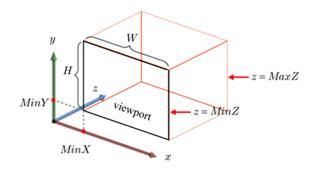
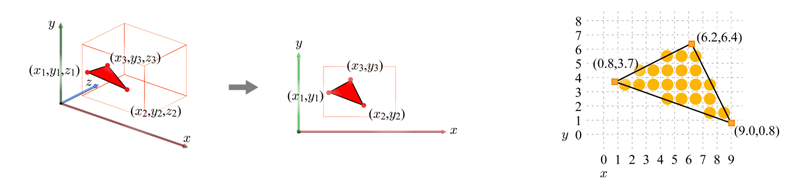
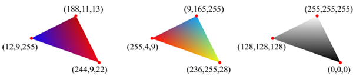

# Primitive Assembly and Rasterization

The vertex shader passes the clip-space vertices to the next stage named **primitive assembly and rasterization**. The goal of the primitive assembly is to combine the clip-space vertices into a sequence of **primitives**. The primitives are classified into points, lines, and triangles. Then, various operations are performed on each primitive. The operations include back-face culling, viewport transform, and scan conversion. The last operation, scan conversion, is a key in real-time graphics and is often called rasterization. The stage for primitive assembly and rasterization is hardwired, but to control the behaviors, it is necessary to understand how its substages work.

## Back Face Culling

**Back faces** are polygons facing away from the eye whereas polygons facing towards the eye are called **front faces**. In general, the front faces are to be accepted, but the back faces are discarded. The following figure compares a back face (`t1`) and a front face (`t2`).

**Figure: Seen from the eye position, t1 is a back face whereas t2 is a front face**

By default, vertices of every 3D triangle are in a counter-clockwise (CCW) order. In the above figure, for example, the vertices are ordered as (`v1`, `v2`, `v3`). While maintaining the view direction in the figure, consider only the x- and y-coordinates of the vertices. Then, `t1` and `t2` can be illustrated as in the following figure. Observe that `t1` (back face) has the clockwise (CW)-ordered vertices while `t2` (front face) has the CCW-ordered vertices.

**Figure: Vertices of a 2D back face are in a clockwise order (left) and the vertices of a 2D front face are in counter-clockwise order (right)**

To determine whether such a projected (2D) triangle has CW- or CCW-ordered vertices, use the **determinant** shown below. The first row is the vector connecting `v1` and `v2` and the second one connects `v1` and `v3`. If the determinant is negative, the triangle is a back face; if positive, it is a front face.

**Figure: Example of a determinant**

Note that back faces are not always culled, but often need to be rendered. Consider rendering a translucent sphere. For the back faces to show through the front faces, no face can be culled. On the other hand, consider culling only the front faces of a hollow sphere to obtain the cross-section view of the sphere.

Face culling is disabled by default. However, it can be activated by the `glEnable(GL_CULL_FACE)` function. When face culling is enabled, the `glCullFace()` function is used to specify which face is to be culled. The parameter can be `GL_FRONT`, `GL_BACK` (default value), or `GL_FRONT_AND_BACK`. Then, the `glFrontFace()` function specifies the orientation of the front face vertices. Either `GL_CW` or `GL_CCW` is given to the `glFrontFace()` function. The default value is `GL_CCW`.

## Viewport Transform

A window at the computer screen is associated with its own **window space**. A **viewport** is defined in the window space, as shown in the following figure.

**Figure: Viewport in the window space is defined by its bottom-left corner point (MinX, MinY), height H, width W, and the depth range [MinZ, MaxZ]**

A viewport is created by the `glViewport()` function. Then, the `glDepthRangef()` function is called to specify the desired depth range. The initial values for the first and second parameter are 0.0 and 1.0, respectively. The process of converting the scene object (within the 23-sized box in the View frustrum figure) into the viewport of the window space is called **viewport transform**.

## Rasterization (Scan Conversion)

The viewport transform has converted every primitive into the window space. Considering only the x- and y-coordinates of a triangle, the last substage, rasterizer, breaks up each window-space triangle into a set of **fragments**.

**Figure: Fragments for a triangle are colored in yellow**

The per-vertex attributes are interpolated to determine the per-fragment attributes. If colors are assigned to the vertices, they are interpolated across the triangle. The following figure shows color-interpolated triangle examples.

**Figure: Color-interpolated triangles**

In reality, however, the per-vertex attributes rarely include colors. In general, vertex normals and texture coordinates are interpolated. The following figure visualizes the interpolated normals, where the per-vertex normals (in blue) are first interpolated along the triangle edges (in green) and then interpolated along the scanlines (in red). These per-fragment attributes are passed to the fragment shader.

**Figure: Interpolated normals**

## Related Information
- Dependencies
  - Tizen 2.4 and Higher for Mobile
  - Tizen 2.3.1 and Higher for Wearable
