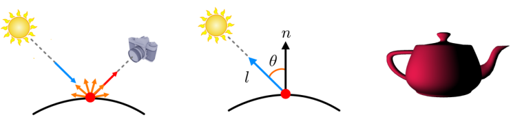

# Fragment Shader


The fragment shader has 2 important tasks: **texturing** and **lighting**. The texturing basics are covered in [Texturing](texturing.md), and the lighting is handled here.

The inputs to the fragment shader consist of:

- Varyings: Per-fragment variables, which are determined by interpolating the per-vertex output variables produced by the vertex shader
- Uniforms
- Samplers: Textures

The output of the fragment shader is the fragment color that is passed to the output merger.

**Figure: Vertex and fragment shader outputs**


The following example is a simple fragment shader, which performs only texturing. Given an `s_tex0` 2D image texture and the `v_texCoord` interpolated texture coordinates, the shader invokes the built-in `texture2D()` function to determine the color to be output to the built-in `gl_FragColor` variable:

```
uniform sampler2D s_tex0;
varying vec2 v_texCoord;

void
main()
{
    gl_FragColor = texture2D(s_tex0, v_texCoord);
}
```

<a name="phong"></a>
## Phong Lighting Model

Obviously, texturing alone is never enough to make an object look realistic. You need lighting or illumination, which refers to the technique handling the interaction between light sources and objects. The most popular real-time lighting technique is based on the **Phong lighting model**. It is composed of diffuse, specular, ambient, and emissive terms. For the sake of simplicity, this topic presents only the diffuse term. (For more information, see [Phong reflection model](https://en.wikipedia.org/wiki/Phong_reflection_model) in Wikipedia.)

The diffuse term is for the reflections from ideally diffuse surfaces, which are scattered with equal intensity in all directions (see the left image in the following figure). The amount of reflection perceived by the eye is proportional to the amount of incoming light. Consider a normalized **light vector** (denoted by `l`) connecting the surface point and the light source. The amount of incoming light is inversely proportional to the angle between `l` and the surface normal `n` (as shown in the middle image), and is described as `n⋅l`. In order to avoid negative reflection, it is modified into `max(n⋅l, 0)`.

<a name="diffuse"></a>
**Figure: Diffuse reflection**  



The reflected color of an object is determined by component-wise multiplication, as shown in the following figure. Suppose a white light source, (1,1,1). If an object lit by the light appears yellow, it means that the object reflects R and G and absorbs B. This kind of filtering can be implemented through the material parameter. For example, if it is (1,1,0), the reflected color is (1,1,1) ⊗ (1,1,0) = (1,1,0) where ⊗ is a component-wise multiplication.

**Figure: Component-wise multiplication for diffuse color**


The diffuse term combines the intensity and color: `max(n⋅l, 0) sd ⊗ md` where `sd` is the light source color and `md` is the object material color. The right side of the [Diffuse reflection](#diffuse) figure shows an object lit with the diffuse term only.

## Fragment Shader for Lighting and Texturing

The following example shows how to implement Phong lighting (with the diffuse term only) and texturing.

The vertex shader in the example computes the clip space vertex position and bypasses the texture coordinates, as usual. In addition, it outputs the 'world space' vertex position and normal of each vertex. The `v_position`, `v_normal`, and `v_texCoord` output variables are interpolated for fragments and the per-fragment attributes are provided for the fragment shader.

```
uniform mat4 viewProjMat;
uniform mat4 worldMat;

attribute vec3 position;
attribute vec3 normal;
attribute vec2 texCoord;

varying vec3 v_position;
varying vec3 v_normal;
varying vec2 v_texCoord;

void
main()
{
    gl_Position = viewProjMat * worldMat * vec4(position, 1.0);
    v_position = (worldMat * vec4(position, 1.0)).xyz;
    v_normal = mat3(worldMat) * normal;
    v_texCoord = texCoord;
}
```

The following fragment shader obtains the object material color (`md`) by filtering the texture and then asks the user-defined `phongDiffuse()` function to compute the diffuse term. It uses the `uniform vec3 lightPos` for calculating the light vector `l` (`lightDirection`) and simply implements `max(n⋅l, 0) sd ⊗ md` presented in [Phong Lighting Model](#phong).

```
uniform sampler2D s_tex0;
uniform vec3 lightPos;
uniform vec3 Sd;

varying vec3 v_position;
varying vec3 v_normal;
varying vec2 v_texCoord;

vec3 phongDiffuse(vec3 Md); /* Forward declaration */

void
main()
{
    vec3 Md = texture2D(s_tex0, v_texCoord).xyz;
    vec3 phongColor = phongDiffuse(Md);

    gl_FragColor = vec4(phongColor, 1.0);
}

vec3
phongDiffuse(vec3 Md)
{
    /* Diffuse term of Phong model per fragment */
    vec3 lightDirection = normalize(lightPos - v_position);
    vec3 nor = normalize(v_normal);

    /* Diffuse term */
    float Diffuse = max(dot(nor, lightDirection), 0.0);
    vec3 PhongDiffuse = Diffuse * Sd * Md;

    return PhongDiffuse;
}
```

## Related Information
- Dependencies
  - Tizen 2.4 and Higher for Mobile
  - Tizen 2.3.1 and Higher for Wearable
