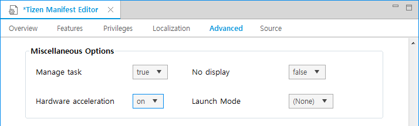

# Hardware Acceleration


Tizen supports hardware acceleration since Tizen 2.3.1. If hardware acceleration is enabled, it increases rendering performance and allows you to use OpenGL&reg; ES.

You can enable hardware acceleration in the `tizen-manifest` file, using the manifest editor's **Advanced** tab.

**Figure: Hardware acceleration option**



In the `tizen-manifest` file, the option is shows as follows:

```
<ui-application appid="example" hw-acceleration="on">
```

The possible values are `on` (enabled) and `off` (disabled). If the value is not defined, the default system policy determines whether the hardware acceleration is enabled.

Normally, it is enough to modify the manifest file to enable hardware acceleration. In the following special cases, however, additional actions are required:

- OpenGL&reg; ES application

  In addition to enabling hardware acceleration in the manifest file, you must also call the `elm_config_accel_preference_set()` function before creating an elm window.

  In an indirect rendering mode:

  ```
  elm_config_accel_preference_set("opengl");
  win = elm_win_util_standard_add(name, "OpenGL example");
  ```

  This function and option are supported since Tizen 2.3.

  In a direct rendering mode, if you want to use depth and stencil buffers or multisample, you have to specify them in the `elm_config_accel_preference_set()` function:

  ```
  elm_config_accel_preference_set("opengl:depth24:stencil8:msaa_high");
  win = elm_win_util_standard_add(name, "OpenGL example");
  ```

  In the above example, the depth buffer size is 24 bit, stencil buffer size is 8 bit and MSAA is on with a high bit.

  These special options are supported since Tizen 2.3.1. For more information, see the [OpenGL&reg; ES](opengl.md) guide.

- EFL WebKit (EWK) application

  In addition to enabling hardware acceleration in the manifest file, you must also call the `elm_config_accel_preference_set()` function before creating an elm window. Because EWK uses a 24-bit depth buffer and a 8-bit stencil buffer, you must also specify them in the `elm_config_accel_preference_set()` function:

  ```
  elm_config_accel_preference_set("opengl:depth24:stencil8");
  win = elm_win_util_standard_add(name, "EWK example");
  ```

  These special options are supported since Tizen 2.3.1. For more information, see the [Web View](../connectivity/web-view.md) guide.

## Related Information
- Dependencies
  - Tizen 2.4 and Higher for Mobile
  - Tizen 2.3.1 and Higher for Wearable
