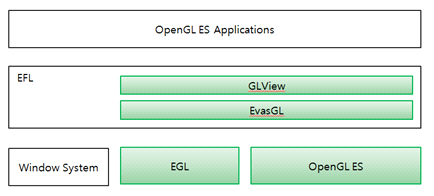

# OpenGL&reg; ES


Today, most smart devices are equipped with Graphics Processing Units (GPU). This is the case for Tizen devices, as well. OpenGL&reg; ES is an interface to the GPU that consists of well-defined subsets of the desktop OpenGL&reg; API.

Tizen native applications can use OpenGL&reg; ES not only for creating a 3D scene but also for a 2D scene that requires fast interaction. OpenGL&reg; ES is also good for improving performance and reducing power consumption when the native application performs computation-intensive tasks that can be run in parallel.

Different Tizen versions support different OpenGL&reg; ES versions:

-   OpenGL&reg; ES 1.1 and 2.0 are supported by Tizen 2.3 and higher.
-   OpenGL&reg; ES 3.0 is supported by Tizen 2.4 and higher.
-   OpenGL&reg; ES 3.1 is supported by Tizen 3.0 and higher.
-   OpenGL&reg; ES 3.2 is supported by Tizen 4.0 and higher.

EGL™ is another specification for binding OpenGL&reg; ES to the native windowing systems. To set up the EGL™ environment, you normally need to understand the native windowing system and EGL™ specification in detail. In Tizen, however, its native UI components and 2D canvas (Elementary and Evas, respectively) replace the role of EGL™ to provide a simple way to use OpenGL&reg; ES. To maintain the best device performance, the Tizen Studio makes the native windowing system and EGL™ APIs invisible.

The main features of the OpenGL&reg; ES API include:

- Declaring EvasGL objects

  You can [declare the application data](#declaration).

- Creating the Elm window and EvasGL

  You can [create a window and EvasGL](#creating).

- Getting OpenGL&reg; ES APIs

  You can [get OpenGL&reg; ES function pointers](#getapi).

- Using callbacks

  You can [set the callbacks](#callbacks).

- Setting a surface into the image object

  You can [set a native surface into the image object](#nativeset).

- Using OpenGL&reg; ES extensions

  You can [check whether an extension is available, and call it](#ext).

- Using EvasGL extensions

  You can [check whether an Evas extension is available, and use it](#evas_ext).

- Using Direct Rendering

  You can [enhance performance through the Direct Rendering option](#direct).

- Using client-side rotation

  You can [use client-side rotation](#client) when the application is using Direct Rendering.

Additional OpenGL&reg; ES details are covered in the following topics:

- To set up a native application which makes a simple 3D cube scene, see [Creating OpenGL&reg; ES Applications](creating-opengles.md).
- To draw a 3D scene step by step through GPU pipeline stages, see:
  - [Polygon Mesh in OpenGL&reg; ES](polygon-mesh.md)
  - [Vertex Shader](vertex-shader.md)
  - [Primitive Assembly and Rasterization](assembly.md)
  - [Texturing](texturing.md)
  - [Fragment Shader](fragment-shader.md)
  - [Output Merging](output-merging.md)
  - [Interactive UI](interactive-ui.md)
- To enhance your OpenGL&reg; ES usage on Tizen devices, see:
  - [Advanced Rendering](adv-rendering.md)
  - [Advanced Performance](adv-performance.md)

## Prerequisites

The EvasGL use cases assume that the application uses EvasGL directly instead of using the GLView. (If the application uses a GLView, EvasGL is created internally.)

To be able to call OpenGL&reg; ES functions directly, first declare the global variable using the `EVAS_GL_GLOBAL_GLES2_DEFINE()` macro. Then, create an EvasGL and use the `EVAS_GL_GLOBAL_GLES2_USE()` macro, which is similar to the GLView macro. For more information, see the `Evas_GL_GLES2_Helpers.h` file.

```
#include <app.h>
#include <Evas_GL_GLES2_Helpers.h>

/*
   This code is placed at the beginning of any function using OpenGL ES 2.0 APIs
   When using this macro, you can call all glFunctions without changing their code
   For details, see Evas_GL_GLES2_Helpers.h
*/
EVAS_GL_GLOBAL_GLES2_DEFINE();
```

<a name="declaration"></a>
## Declaring EvasGL Objects

To hold all the objects for your EvasGL application, define the application data structure:

```
struct appdata {
    Evas_Object *win; /* Application window */
    Evas_Object *img; /* OpenGL ES canvas */

    Evas_GL *evasgl; /* EvasGL object for rendering OpenGL ES in Evas */
    Evas_GL_Context *ctx; /* EvasGL context object, an OpenGL ES rendering context in Evas GL */
    Evas_GL_Surface *sfc; /* EvasGL surface object, an OpenGL ES rendering target in Evas GL */
    Evas_GL_Config *cfg; /* EvasGL surface configuration object for surface creation */
    Evas_Coord sfc_w;
    Evas_Coord sfc_h;

    unsigned int program;
    unsigned int vtx_shader;
    unsigned int fgmt_shader;
    unsigned int vbo;
};
typedef struct appdata appdata_s;
```

<a name="creating"></a>
## Creating the Elm Window and EvasGL

To create the Elm window and EvasGL:

1. Create a window and EvasGL.

   For developing an application with Elementary, you create a window by using the Elementary utility function, `elm_win_util_standard_add()`. To develop an OpenGL&reg; ES application and make the application use the GPU, you must call the `elm_config_accel_preference_set()` function before creating the window.

   ```
   Evas_Object *win;

   /*
      To use OpenGL ES, the application must switch on hardware acceleration
      To enable that, call elm_config_accel_preference_set() with "opengl"
      before creating the Elm window
      This function is supported since 2.3.
   */
   elm_config_accel_preference_set("opengl");
   /* Creating Elm window */
   ad->win = elm_win_util_standard_add("Evas_GL Example", "Evas_GL Example");
   ```

   You can create the EvasGL handler using the `evas_gl_new()` function. This initializer takes the Evas canvas on which OpenGL&reg; ES is to be used as a parameter. When developing an application with Elementary, use the canvas of your window:

   ```
   ad->evasgl = evas_gl_new(evas_object_evas_get(ad->win));
   ```

   To free the memory allocated to the handler, use the `evas_gl_free()` function.

2. Create a surface.

   You must allocate a new config object to fill out the surface using the `evas_gl_config_new()` function. As long as Evas creates the config object, it takes care of any backward compatibility issues. Once you have your config object, you can specify the surface settings:

   ```
   appdata_s *ad;
   ad->cfg = evas_gl_config_new();
   ad->cfg->color_format = EVAS_GL_RGBA_8888; /* Surface color format */
   ad->cfg->depth_bits = EVAS_GL_DEPTH_BIT_24; /* Surface depth format */
   ad->cfg->stencil_bits = EVAS_GL_STENCIL_NONE; /* Surface stencil format */
   /* Configuration options (here, no extra options are used) */
   ad->cfg->options_bits = EVAS_GL_OPTIONS_NONE;
   ```

   Once you have configured the surface behavior, you must initialize the surface using the `evas_gl_surface_create()` function. This function takes the given `Evas_GL` object as the first parameter and the pixel format, and the configuration of the rendering surface as the second parameter. The last 2 parameters are the width and height of the surface, which you can recover directly from the window.

   ```
   Evas_Coord w, h;
   evas_object_geometry_get(ad->win, NULL, NULL, &w, &h);
   ad->sfc = evas_gl_surface_create(ad->evasgl, ad->cfg, w, h);
   ```

   To manually delete a OpenGL&reg; ES surface, use the `evas_gl_surface_destroy()` function.

3. Create a context.

   Create a context for the `Evas_GL` object using the `evas_gl_context_create()` function. You can merge the context with a higher context definition that you must pass as a second parameter.

   ```
   ad->ctx = evas_gl_context_create(ad->evasgl, NULL);

   /*
      This macro sets the global variable holding the OpenGL ES API,
      so that it is available to the application
      Use it right after setting up the OpenGL ES context object
      For details, see Evas_GL_GLES2_Helpers.h
   */
   EVAS_GL_GLOBAL_GLES2_USE(ad->evasgl, ad->ctx);
   ```

   To delete the context later, use the `evas_gl_context_destroy()` function. To delete the entire configuration object, use the `evas_gl_config_free()` function instead.

<a name="getapi"></a>
## Getting OpenGL&reg; ES APIs

If you want to get the OpenGL&reg; ES API, you can get the API for rendering OpenGL&reg; ES with the `evas_gl_api_get()` function. This function returns a structure that contains all the OpenGL&reg; ES functions you can use to render in Evas. These functions consist of all the standard OpenGL&reg; ES 2.0 functions and any extra ones Evas has decided to provide in addition. If you have your code ported to OpenGL&reg; ES 2.0, it is easy to render to Evas.

If you already use a global macro, such as `EVAS_GL_GLOBAL_GLES2_XXX()`, you need not get the APIs.

```
Evas_GL_API *glapi;
glapi = evas_gl_api_get(ad->evasgl);
```

<a name="callbacks"></a>
## Using Callbacks

When you have configured the EvasGL environment, you can declare a UI component in which all the OpenGL&reg; ES transformation takes place. In the following example, the image component is used, because it provides callbacks that allow you to play with mouse events and coordinates. The image component is set to inherit the size of the parent window.

1. Add the image component:

   ```
   ad->img = evas_object_image_filled_add(evas_object_evas_get(ad->win));
   ```

2. Define the "OpenGL&reg; ES main loop" function that is called every time the program attempts to get pixels from the image. Put all the OpenGL&reg; ES statements in charge of rendering the scene in this callback.

   ```
   evas_object_image_pixels_get_callback_set(ad->img, img_pixels_get_cb, ad);
   ```

3. Define a function that takes care of the drawing using EvasGL (called the OpenGL&reg; ES main loop):

   ```
   static void
   img_pixels_get_cb(void *data, Evas_Object *obj)
   {
       appdata_s *ad = data;
       /* Rendering process */
       evas_gl_make_current(ad->evasgl, ad->sfc, ad->ctx);
       /* Because the surface size can be changed, set the viewport in this callback */
       glViewport(0, 0, ad->sfc_w, ad->sfc_h);
       /* Paint it blue */
       glClearColor(0.2, 0.2, 0.6, 1.0);
       glClear(GL_COLOR_BUFFER_BIT);
       /* Usual OpenGL ES draw commands come here */
       /* draw_scene(); */
   }
   ```

   At every tick, set the given context as a current context for the given surface using the `evas_gl_make_current()` function.

4. You can use the `Ecore_Animator` to define the OpenGL&reg; ES main loop.

   To use the `Ecore_Animator`, create a callback that is called on every animation tick. This animation callback is used only to mark the image as "dirty", meaning that it needs an update next time Evas renders. It calls the pixel get callback that redraws the scene.

   The animator callback function is also triggered when the display is off. Use the `ecore_animator_freeze()` and `ecore_animator_thaw()` functions in the `app_pause_cb()` and `app_resume_cb()` callbacks for power saving.

    ```
    static Eina_Bool
    animate_cb(void *data)
    {
        Evas_Object *img = data;
        evas_object_image_pixels_dirty_set(img, EINA_TRUE);

        return ECORE_CALLBACK_RENEW;
    }

    ecore_animator_add(animate_cb, ad->img);
    ```

5. Define other callbacks, as needed. These callbacks have an impact on the drawing depending on the mouse, resize, and deletion events:

   ```
   evas_object_event_callback_add(ad->img, EVAS_CALLBACK_DEL, img_del_cb, ad);
   evas_object_event_callback_add(ad->img, EVAS_CALLBACK_MOUSE_DOWN, mouse_down_cb, ad);
   evas_object_event_callback_add(ad->img, EVAS_CALLBACK_MOUSE_UP, mouse_up_cb, ad);
   evas_object_event_callback_add(ad->img, EVAS_CALLBACK_MOUSE_MOVE, mouse_move_cb, ad);
   evas_object_event_callback_add(ad->win, EVAS_CALLBACK_RESIZE, win_resize_cb, ad);
   ```

6. Because the window size can be changed, set a resize callback for the window. In the callback, you must recreate an `Evas_GL_Surface` and reset the viewport size with the new window size:

   ```
   static void
   win_resize_cb(void *data, Evas *e, Evas_Object *obj, void *event_info)
   {
       appdata_s *ad = data;

       if (ad->sfc) {
           evas_object_image_native_surface_set(ad->img, NULL);
           evas_gl_surface_destroy(ad->evasgl, ad->sfc);
           ad->sfc = NULL;
       }

       evas_object_geometry_get(obj, NULL, NULL, &ad->sfc_w, &ad->sfc_h);
       evas_object_image_size_set(ad->img, ad->sfc_w, ad->sfc_h);
       evas_object_resize(ad->img, ad->sfc_w, ad->sfc_h);
       evas_object_show(ad->img);

       if (!ad->sfc) {
           Evas_Native_Surface ns;
           ad->sfc = evas_gl_surface_create(ad->evasgl, ad->cfg, ad->sfc_w, ad->sfc_h);
           evas_gl_native_surface_get(ad->evasgl, ad->sfc, &ns);
           evas_object_image_native_surface_set(ad->img, &ns);
           evas_object_image_pixels_dirty_set(ad->img, EINA_TRUE);
       }
   }
   ```

<a name="nativeset"></a>
## Setting a Surface into the Image Object

You can fill in the native surface information from the given EvasGL surface. For example, to adapt the surface to the target image when the size of the canvas changes:

```
Evas_Native_Surface ns;
evas_gl_native_surface_get(ad->evasgl, ad->sfc, &ns);
evas_object_image_native_surface_set(ad->img, &ns);
```

<a name="ext"></a>
## Using OpenGL&reg; ES Extensions

EvasGL, offering an abstraction layer above OpenGL&reg; ES, provides an easy mechanism to check for support and use OpenGL&reg; ES extensions:

1. Detect support for an extension.

   In OpenGL&reg; ES, you must always call the `glGetString(GL_EXTENSIONS)` function. Make sure that the extension name is present in the list and then dynamically find the function pointer using the `dlsym()`, `eglGetProcAddress()`, or `glXGetProcAddress()` function.

   Since EvasGL exposes only a structure with the function pointers set to internal wrappers or the proper OpenGL&reg; ES implementation library, it can also expose all the detected extensions simply by setting their function pointers.

   To detect support for the `GL_OES_get_program_binary` extension or equivalent, and to get the function pointer associated:

   ```
   Evas_GL_API *gl = elm_glview_api_get(glview);

   /* Check for support for the Program Binary OES extension */
   if (gl->glGetProgramBinaryOES)
       printf("Program binary extension is supported.\n");
   ```

2. Call an extension.

   Calling an extension is similar to calling a function:

   ```
   if (gl->glGetProgramBinaryOES) {
       char buf[4096];
       size_t len;
       Glenum fmt;
       gl->glGetProgramBinaryOES(prgid, sizeof(buf), &len, &fmt, buf);
   }
   ```

<a name="evas_ext"></a>
## Using EvasGL Extensions

EvasGL is not only an abstraction layer on top of OpenGL&reg; ES, but also on top of EGL&trade; and GLX. As such, EvasGL tries to imitate EGL™ in a platform-independent manner, and exposes the underlying platform extensions when it can.

Image and sync support are the most commonly used EvasGL extensions. Both can be used for multi-thread rendering, but EvasGL images can also be used to share images between contexts.

- To use the image extension:

  There are 2 versions of the `evasglCreateImage()` function, out of which extra `Evas_GL_Context` is taken as a parameter. It is recommended to call the `evasglCreateImageForContext()` function if you are dealing with multiple contexts, otherwise calling the `evasglCreateImage()` function is sufficient.

  1. Check for support.

     Before using this extension, check whether it is supported.

     ```
     if (gl->evasglCreateImageForContext && gl->evasglDestroyImage)
         /* Good... */
     ```

  2. Create an image.

     Create a render buffer and bind it to an EvasGL image.

     ```
     const int width = 64;
     const int height = 64;
     GLuint fbo;
     GLuint color_rb;
     EvasGLImage *image;
     Evas_GL *evgl;
     Evas_GL_Context *ctx;

     gl->GenFramebuffers(1, &fbo);
     gl->glBindFramebuffer(GL_FRAMEBUFFER_EXT, fbo);
     gl->glGenRenderbuffers(1, &color_rb);
     gl->glBindRenderbuffer(GL_RENDERBUFFER_EXT, color_rb);
     gl->glRenderbufferStorage(GL_RENDERBUFFER_EXT, GL_RGBA, width, height);
     gl->glFramebufferRenderbufferEXT(GL_FRAMEBUFFER_EXT,
                                      GL_COLOR_ATTACHMENT0_EXT,
                                      GL_RENDERBUFFER_EXT,
                                      color_rb);

     evgl = elm_glview_evas_gl_get(glview);
     ctx = evas_gl_current_context_get(evgl);
     image = gl->evasglCreateImageForContext(evgl, ctx, EVAS_GL_TEXTURE_2D,
                                             (void *)(intptr_t)color_rb, NULL);
     ```

     The EvasGL image is now created and available for use from another context.

  3. Use an image.

     Draw something in the texture and render that texture to the screen. The following example shows how to skip the draw function.

     ```
     gl->glBindFramebuffer(GL_FRAMEBUFFER_EXT, fbo);
     draw_scene(glview);
     ```

     You can also bind the image to a texture for display on the back buffer:

     ```
     GLuint tex;

     gl->glBindFramebuffer(GL_FRAMEBUFFER_EXT, 0);
     gl->glGenTextures(1, &tex);
     gl->glBindTexture(GL_TEXTURE_2D, tex);
     gl->glEGLImageTargetTexture2DOES(GL_TEXTURE_2D, image);
     /* Draw the texture content on the screen */
     static const GLint verts[12] = {-5, -6, -10,  5, -6, -10,  -5, 4, 10,  5, 4, 10};
     static const GLint tex_coords[8] = {0, 0,  1, 0,  0, 1,  1, 1};

     gl->glClearColor(0, 0, 0, 0);
     gl->glClear(GL_COLOR_BUFFER_BIT | GL_DEPTH_BUFFER_BIT);
     gl->glEnable(GL_TEXTURE_2D);
     gl->glTexEnvf(GL_TEXTURE_ENV, GL_TEXTURE_ENV_MODE, GL_REPLACE);
     gl->glTexParameterf(GL_TEXTURE_2D, GL_TEXTURE_WRAP_R, GL_REPEAT);
     gl->glTexParameterf(GL_TEXTURE_2D, GL_TEXTURE_MIN_FILTER, GL_NEAREST);
     gl->glTexParameterf(GL_TEXTURE_2D, GL_TEXTURE_MAG_FILTER, GL_NEAREST);

     gl->glEnableClientState(GL_VERTEX_ARRAY);
     gl->glEnableClientState(GL_TEXTURE_COORD_ARRAY);
     gl->glVertexPointer(3, GL_INT, 0, verts);
     gl->glTexCoordPointer(2, GL_INT, 0, tex_coords);

     gl->glDrawArrays(GL_TRIANGLE_STRIP, 0, 4);

     gl->glDisableClientState(GL_VERTEX_ARRAY);
     gl->glDisableClientState(GL_COLOR_ARRAY);
     gl->glDisable(GL_TEXTURE_2D);
     ```

     The image content can be shared between different contexts.

  4. Destroy an image.

     After releasing all the associated resources, such as FBO and textures, release the image object itself.

     ```
     gl->evasglDestroyImage(image);
     ```

- To use the sync extension:

  Another commonly used extension is the fence sync extension along with the reusable sync and wait sync. This allows creating a semaphore-style object that is released as soon as all the previous render operations have been completed.

  This guide does not explain the details of these extensions, as they must behave in a similar way to their EGL™ implementations.

  As usual with extensions, check the support:

  ```
  if (gl->evasglCreateSync)
      /* fence_sync must be supported */
  ```

<a name="direct"></a>
## Using Direct Rendering

To enhance rendering performance, the Direct Rendering option is supported.

- To use direct rendering in GLView:

  In GLView, the `ELM_GLVIEW_DIRECT` option is one of GLView mode's enums and the option can be enabled using the `elm_glview_mode_set()` function.

  ```
  /* Tizen 2.3 */
  /* elm_config_accel_preference_set("opengl"); */

  /* Since Tizen 2.3.1 */
  elm_config_accel_preference_set("opengl:depth24:stencil8:msaa_high");
  Evas_Object *win = elm_win_util_standard_add("sample", "sample");

  Evas_Object *glview = elm_glview_add(win);
  elm_glview_mode_set(glview, ELM_GLVIEW_DEPTH_24 | ELM_GLVIEW_STENCIL_8 | ELM_GLVIEW_MULTISAMPLE_HIGH);
  ```

  To use the Direct Rendering mode since Tizen 2.3.1, set the same option values (depth, stencil, and MSAA) to a rendering engine and a GLView object. You can set the option values to a rendering engine using the `elm_config_accel_preference_set()` function and to a GLView object using the `elm_glview_mode_set()` function. If the GLView object option values are bigger or higher than the rendering engine's, the Direct Rendering mode is disabled.

- To use direct rendering in EvasGL:

  In EvasGL, the `EVAS_GL_OPTIONS_DIRECT` is one of EvasGL's config options and the option can be enabled by setting the `Evas_GL_Config` option.

  ```
  /* Tizen 2.3 */
  /* elm_config_accel_preference_set("opengl"); */

  /* Since Tizen 2.3.1 */
  elm_config_accel_preference_set("opengl:depth24:stencil8:msaa_high");
  Evas_Object *win = elm_win_util_standard_add("sample", "sample");

  Evas_GL_Config *cfg = evas_gl_config_new();
  cfg = evas_gl_config_new();

  cfg->color_format = EVAS_GL_RGB_888;
  cfg->depth_bits = EVAS_GL_DEPTH_BIT_24;
  cfg->stencil_bits = EVAS_GL_STENCIL_BIT_8;
  cfg->options_bits = EVAS_GL_OPTIONS_DIRECT;
  cfg->multisample_bits = EVAS_GL_MULTISAMPLE_HIGH;
  ```

  To use the Direct Rendering mode since Tizen 2.3.1, set the same option values (depth, stencil, and MSAA) to a rendering engine and an `Evas_GL_Config` object. You can set the option values to a rendering engine using the `elm_config_accel_preference_set()` function. If the `Evas_GL_Config` object option values are bigger or higher than the rendering engine's, the Direct Rendering mode is disabled.

  > **Note**
  >
  > If direct rendering is enabled, EvasGL renders directly to the back buffer of the window. Otherwise, EvasGL renders to the off screen buffer, then composited to the back buffer of the window.
  >
  > Although direct rendering is enabled, EvasGL not always renders directly to the back buffer. The following conditions disable direct rendering and force a fallback to indirect rendering in a frame buffer:
  > - If the object's color is not 255,255,255,255.
  > - If the object has an Evas map.
  > - If the object size is different from the viewport (`RESIZE_POLICY_SCALE`).
  > - If the window is rotated and `CLIENT_SIDE_ROTATION` is not set.
  > - If the GLView policy is set to `ALWAYS` render or the EvasGL does not use pixel getter callback.

  > **Caution**
  >
  > In the render callback function, call only OpenGL&reg; ES functions.
  >
  > If the OpenGL&reg; ES functions are called outside the render callback function, you must call the `evas_gl_make_current()` function before the OpenGL&reg; ES function calls. However, this results in a performance degradation due to context switching, and only works if the target surface is not an `Evas_GL_Surface` with Direct Rendering enabled.
  >
  > If the target buffer is an `Evas_GL_Surface` with Direct Rendering enabled, all OpenGL&reg; ES functions must be called from the render callback function only. All other operations can break the rendering order, causing unexpected rendering.

<a name="client"></a>
## Using Client-side Rotation

The Client Side Rotation is a special value that indicates to EFL that the application handles the view rotation when the device is rotated. This is needed only when the application requests Direct Rendering.

If the window is rotated and the Direct Rendering flag is set, Client Side Rotation can be used to avoid falling back to a frame buffer.

- To use GLView rotation:

  In GLView, the `ELM_GLVIEW_CLIENT_SIDE_ROTATION` option is one of GLView mode's enums and the option can be enabled by using the `elm_glview_mode_set()` function. This option is needed only when Direct Rendering is enabled.

  ```
  Evas_Object *gl;
  gl = elm_glview_add(win);

  elm_glview_mode_set(gl, ELM_GLVIEW_DEPTH | ELM_GLVIEW_DIRECT | ELM_GLVIEW_CLIENT_SIDE_ROTATION);
  ```

- To use EvasGL rotation:

  In EvasGL, the `EVAS_GL_OPTIONS_CLIENT_SIDE_ROTATION` is one of EvasGL's config options and this option can be enabled by setting the `Evas_GL_Config` option.

  ```
  Evas_GL_Config *cfg;
  cfg = evas_gl_config_new();

  cfg->options_bits = EVAS_GL_OPTIONS_DIRECT | EVAS_GL_OPTIONS_CLIENT_SIDE_ROTATION;
  ```

  Get the current rotation value:

  ```
  static void
  _draw_gl(Evas_Object *obj)
  {
      int w;
      int h;
      int rotation;
      elm_glview_size_get(obj, &w, &h);
      rotation = evas_gl_rotation_get(ad->evasgl);

      if (rotation % 180)
          /* Adjust gl size */
  }
  ```

  To get the current rotation of the view, in degrees, call the `evas_gl_rotation_get()` function to properly handle the current rotation of the view. It always returns 0 unless the option `EVAS_GL_OPTIONS_CLIENT_SIDE_ROTATION` has been set. Indeed, when Direct Rendering to the back buffer, the client application is responsible for properly rotating its view. This can generally be done by applying a rotation to a view matrix.

**Figure: OpenGL&reg; ES and EFL**



## Related Information
- Dependencies
  - Tizen 2.4 and Higher for Mobile
  - Tizen 2.3.1 and Higher for Wearable
