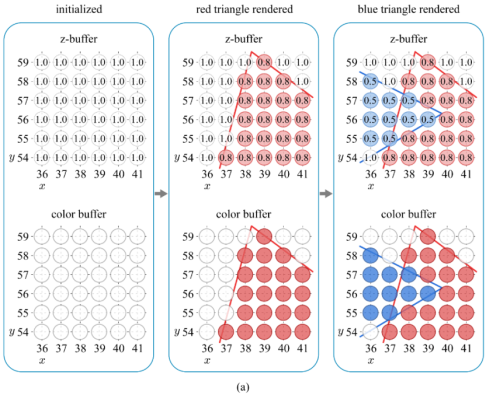

# Output Merging

The fragment shader returns a colored fragment, often called the **RGBAZ** fragment. A (for alpha) represents the fragment's opacity whereas Z represents the depth. In the output merger, the fragment competes or combines with the pixel in the **color buffer** to update the pixel's color. A and Z are used in this process. In addition to the color buffer, OpenGL&reg; ES supports another buffer named **depth buffer** or **z-buffer**. It has the same resolution as the color buffer and stores the depth values of the pixels.

## Depth Buffering

In the following figure, assume that `MinZ` of the viewport is 0.0, `MaxZ` is 1.0, the red triangle's depth is 0.8, and the blue triangle's is 0.5. By calling the `glClear()` function once per frame, the color and depth buffers are simultaneously cleared with the default values selected by the `glClearColor()` and `glClearDepthf()` functions, respectively.

**Figure: Depth buffering visualization: the rendering order is red to blue triangles**

 

When a fragment at `(x,y)` is passed from the fragment shader, its depth value is compared with the depth buffer value at `(x,y)`. If the fragment has a smaller depth value, its color and depth update the color buffer and depth buffer at `(x,y)`, respectively. Otherwise, the fragment is discarded. The above figure shows how the depth buffer is used for filling the color buffer. This method is called **depth buffering** or **z-buffering**.

## Alpha Blending

Suppose that the current fragment has a smaller depth than the pixel in the color buffer and is translucent. Then, the pixel must show through the fragment. This is achieved by blending the fragment color with the pixel color. The process uses the alpha value of the fragment, which is in the range of [0,1]: 0 denotes fully transparent and 1 denotes fully opaque.

A typical blending equation is `αcf + (1-α)cp`, where `α` represents the fragment's opacity, `cf` is the fragment color, and `cp` is the pixel color. Assume that, in the [Depth buffering visualization](#buffer) figure, all vertices of the blue triangle have the RGBA color, (0,0,1,0.5), and those of the red triangle have (1,0,0,1). The scan conversion algorithm interpolates the RGB channels and the alpha channel in the same manner. Therefore, all fragments of the blue triangle are assigned (0,0,1,0.5), and those of the red triangle are (1,0,0,1). Then, the blue fragment is blended with the red pixel at 3 pixel positions. The blended color is (0.5,0,0.5). This process is named **alpha blending**.

OpenGL&reg; ES supports the `glBlendFunc()` function, where the first parameter specifies the blending coefficient for the incoming (source) fragment and the second parameter specifies the blending coefficient for the destination pixel. Many values, such as `GL_ZERO` and `GL_ONE`, can be assigned to the parameters, but `GL_SRC_ALPHA` best fits the incoming fragment while `GL_ONE_MINUS_SRC_ALPHA` best fits the destination pixel.

## Related Information
- Dependencies
  - Tizen 2.4 and Higher for Mobile
  - Tizen 2.3.1 and Higher for Wearable
