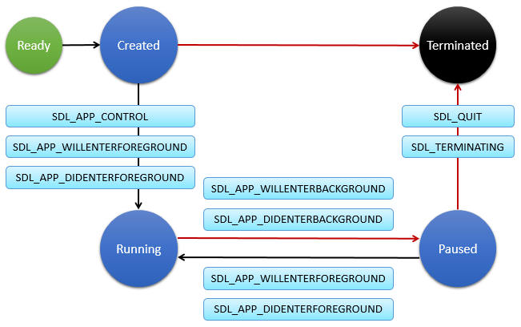

# Simple DirectMedia Layer (SDL)

You can access graphics hardware using Vulkan&reg; and OpenGL&reg; ES through the Simple DirectMedia Layer (SDL), a cross-platform software development library. SDL is used for creating high-performance computer games, multimedia applications, and emulators. It provides a low-level hardware abstraction layer to computer multimedia hardware components. It can run on many operating systems, such as Android™, iOS, Linux, macOS, Windows&reg;, and Tizen. For more information, see the [SDL Web site](https://libsdl.org/).

The main features of the SDL API include:

- Managing SDL applications

  You can manage the [SDL application life-cycle](#lifecycle).

- Handling screen orientation

  You can [set the supported screen orientations](#screen_orientation) for your SDL application.

- Showing the status bar **in mobile applications only**

  You can [manage the status bar](#setting_indicator) used to display icons or notifications.

SDL belongs to the hardware abstraction layer in Tizen. It allows managing video, audio, input devices, threads, and 3D graphics through graphics libraries, such as Vulkan&reg; and OpenGL&reg; ES. For information the comparative merits of Vulkan&reg; and OpenGL&reg;, see [Vulkan&reg; vs. OpenGL&reg;](#vulkan_vs_opengles). As shown in the following figure, SDL provides the application layer access to low-level 3D rendering API (Vulkan&reg; and OpenGL&reg; ES).

**Figure: SDL in the Tizen framework**


The following SDL features are currently supported in Tizen:

- SDL basic functions

  Use the `SDL.h`, `SDL_hints.h`, `SDL_error.h`, `SDL_log.h`, `SDL_assert.h`, `SDL_version.h`, `SDL_error.h`, and `SDL_stdinc.h` header files.

- Display and window management

  Use the `SDL_video.h` and `SDL_syswm.h` header files.

- Event handling

  Use the `SDL_events.h` and `SDL_keyboard.h` header files.

- Audio device management

  Use the `SDL_audio.h` header file.

- Thread and timer management

  Use the `SDL_thread.h`, `SDL_mutex.h`, `SDL_atomic.h`, and `SDL_timer.h` header files.

- Platform and power information

  Use the `SDL_platform.h` and `SDL_power.h` header files.

For the list of features not currently supported in Tizen, see the SDL API (in [mobile](../../api/mobile/latest/group__OPENSRC__SDL__FRAMEWORK.html) and [wearable](../../api/wearable/latest/group__OPENSRC__SDL__FRAMEWORK.html) applications). In Tizen, SDL supports the Vulkan and OpenGL&reg; ES graphics libraries only; the `SDL_render` library is not supported.

> **Note**
>
> The following SDL header files related to the `SDL_render` library are not included in the Tizen native API:
>  - `SDL_render.h`
>  - `SDL_pixels.h`
>  - `SDL_rect.h`
>  - `SDL_surface.h`

<a name="vulkan_vs_opengles"></a>
## Vulkan&reg; vs. OpenGL&reg;

When you consider the differences and advantages between Vulkan&reg; and OpenGL&reg;, Vulkan&reg; basically complements OpenGL&reg; by addressing specific users who want to have a quite low-level API with a much better abstraction of the modern hardware giving a lot of control, predictability, and high performance at much greater efficiency. On the other hand, OpenGL&reg; is a much higher-level API that does many things on your behalf inside the driver with less burden on you. It continues to be the API of choice for a wide range of developers who want to have the shortest path to a functionally correct application.

When selecting the open graphics API (Vulkan&reg; or OpenGL&reg;) to use for a new application, or when considering the need to migrate an existing application from OpenGL&reg; to Vulkan&reg;, ask yourself the following questions:

- Do you want to have really low-level access and explicit control over the underlying GPU?
- Is your application/driver CPU-bound, too slow, and consuming too much power?
- Can your graphic work creation be parallelized and reused?
- Can you deal with additional code complexity to squeeze out maximum performance?

If your answer to any of the questions is **Yes**, consider using Vulkan&reg; instead of OpenGL&reg;. However, remember that Vulkan&reg; comes at the cost of taking more responsibility at the application side from the driver.

The following table describes the differences and advantages between Vulkan&reg; and OpenGL&reg;.

**Table: Comparison between Vulkan&reg; and OpenGL&reg;**

|                         | Vulkan&reg;                                  | OpenGL&reg;                                  |
|-------------------------|------------------------------------------|------------------------------------------|
| GPU control             | Explicit API allows you to manage the state and resources as per specific application needs, and relieves you from hidden optimizations giving more control on the GPU. | Implicit driver manages the state and resources based on heuristics, leading to overhead and inefficiencies. The application has **no control**. |
| Multi-core friendliness | API is designed around asynchronous generation of command buffers across multiple threads and feeds them in sequence to a command pipeline, which reflects the realities of the modern hardware. | Originally designed for single-threaded architectures and does not allow the generation of graphic commands in parallel to command execution. |
| Efficiency              | Vulkan&reg; greatly reduces the CPU time spent in the driver with external validation and diagnostics layers that can be independently enabled and disabled, as needed. Offloads the render thread by delegating heavy CPU jobs to the application and opt-in layers. | Does a lot of redundant excessive validation for each draw call, such as runtime error checking, implicit tracking of resource usage, and synchronization, leading to much CPU overhead. |
| Shader portability      | Vulkan&reg; mandates the use of the intermediate byte code (SPIR-V) by the driver for shaders. This allows offline shader precompilation, and allows you to write shaders in languages other than GLSL. | Only GLSL is supported as a shader language, and the compiler is a part of the driver with vendor-specific semantics. No user control over the front end and higher runtime translation time. |
| Code complexity         | Vulkan&reg; is a much more verbose API, offering more control at the cost of more code complexity and responsibility at the application side. | OpenGL&reg; driver manages many tasks inside the driver relieving you from the burden of managing these at the application end. |

<a name="lifecycle"></a>
## SDL Application Life-cycle in Tizen

The Tizen native application model is responsible for the application life-cycle and system events. The SDL application life-cycle is handled by the `SDL_PollEvent()` function, which manages the main event loop, the application state change events, and basic system events ([general](#SDL_event) and [Tizen-specific](#tizen_event)).

**Figure: SDL application life-cycle**



The SDL application can be in one of several different states, and the state changes are managed by the underlying framework.

**Table: SDL application states**

| State      | Description                              |
|------------|------------------------------------------|
| READY      | Application starts the main loop.        |
| CREATED    | Application is launched.                 |
| RUNNING    | Application is running and visible to the user. |
| PAUSED     | Application is running but invisible to the user. |
| TERMINATED | Application is terminated.               |

Typically, the application is launched by the user from the Launcher, or by another application. The application is normally launched as the top window, with focus. When the application loses the focus status, the `SDL_APP_WILLENTERBACKGROUND` and `SDL_APP_DIDENTERBACKGROUND` events are invoked. The application can go into the pause state, which means that it is not terminated but continues to run in the background. The pause state can happen when:

- A new application is launched by the request of your application.
- The user requests to go to the home screen.
- A system event (such as an incoming phone call) occurs and causes a resident application with a higher priority to become active and temporarily hide your application.
- An alarm is triggered for another application, which becomes the topmost window and hides your application.

When the application becomes visible again, the `SDL_APP_WILLENTERFOREGROUND` and `SDL_APP_DIDENTERFOREGROUND` events are invoked. The visibility returns, when:

- Another application requests your application to run (such as the Task Navigator, which shows all running applications and lets user select any application to run).
- All applications on top of your application in the window stack finish.
- An alarm is triggered for your application, bringing it to the front and hiding other applications.

When the application starts exiting, the `SDL_QUIT` and `SDL_TERMINATING` events are invoked. Your application can start the termination process, when:

- The application itself requests to exit by calling the `ui_app_exit()` or `service_app_exit()` function to terminate the event loop.
- The low memory killer is terminating your application in a low memory situation.

## Prerequisites

Before using graphics libraries in Tizen, make sure you understand the basic functions of [OpenGL&reg; ES](https://www.khronos.org/opengles/) and [Vulkan&reg;](https://www.khronos.org/vulkan). For more information, see [SDL Graphics with OpenGL&reg; ES](sdl-opengles.md) and [SDL Graphics with Vulkan&reg;](vulkan.md).

<a name="SDL_event"></a>
## Handling General SDL Events

To handle general SDL events:

1. Call the `SDL_PollEvent()` function, which polls the currently pending events and returns the `SDL_Event` instance. Before calling the `SDL_PollEvent()` function, create an empty `SDL_Event` structure.

    ```
    void
    updateApp(appdata_s* ad)
    {
        /* SDL_Event is a union containing structures for different event types */
        SDL_Event event;
        while (SDL_PollEvent(&event)) {
            SDL_LogInfo(SDL_LOG_CATEGORY_APPLICATION, "[SDL] Event type: %x\n", event.type);
            handleEvent(&ad, &event);
        }
    }
    ```

2. The `SDL_PollEvent()` function removes the next event from the event queue. If there is no event in the queue, it returns 0. If there is an event, it fills the `SDL_Event` object with the event information.

    The `SDL_Event` object is a union that contains structures for the different event types. The `type` member specifies the event type, shared with all events. The `type` member is related to the [SDL_EventType](https://wiki.libsdl.org/SDL_EventType) enumeration.

    To handle each event type separately, use a switch statement:

    ```
    void
    handleEvent(appdata_s** data, SDL_Event* event)
    {
        appdata_s* ad = *data;

        switch (event->type) {
        case SDL_QUIT:
            SDL_LogInfo(SDL_LOG_CATEGORY_APPLICATION, "[SDL] Finish main loop ");
            ad->game_exit = 1;
            break;
        case SDL_KEYUP:
            char* scancodename = (char *)SDL_GetScancodeName(event->key.keysym.scancode);
            SDL_LogInfo(SDL_LOG_CATEGORY_APPLICATION, "[SDL] keyboard scancode: %s", scancodename);
            if (event->key.keysym.scancode == SDL_SCANCODE_AC_BACK) {
                SDL_LogInfo(SDL_LOG_CATEGORY_APPLICATION, "[SDL] Finish main loop ");
                ad->game_exit = 1;
            }
            break;
        case SDL_MOUSEBUTTONDOWN:
            SDL_LogInfo(SDL_LOG_CATEGORY_APPLICATION, "[SDL]Mouse Down: %d x %d", event->button.x, event->button.y);
            break;
        case SDL_MOUSEBUTTONUP:
            SDL_LogInfo(SDL_LOG_CATEGORY_APPLICATION, "[SDL]Mouse Up: %d x %d", event->button.x, event->button.y);
            break;
        case SDL_MOUSEMOTION:
            SDL_LogInfo(SDL_LOG_CATEGORY_APPLICATION, "[SDL]Mouse Motion: %d x %d", event->motion.x, event->motion.y);
            break;
        case SDL_ROTATEEVENT:
            ad->window_rotation = (int)event->user.data1;
            SDL_LogInfo(SDL_LOG_CATEGORY_APPLICATION, "[SDL] Rotation degree: %d", ad->window_rotation);
            break;
        case SDL_WINDOWEVENT:
            SDL_LogInfo(SDL_LOG_CATEGORY_APPLICATION, "SDL_WINDOWEVENT Event!!");
            if (event->window.event == SDL_WINDOWEVENT_SIZE_CHANGED)
                SDL_Log("SDL_WINDOWEVENT_SIZE_CHANGED!!!");
            break;
        } /* End switch */
    }
    ```

<a name="tizen_event"></a>
## Handling Tizen-specific SDL Events

To handle SDL events specifically added to the Tizen application framework:

- `SDL_APP_CONTROL`

  This event is invoked when the application is launched with some parameters.

  The application framework calls the application's control callback just after the application enters the main loop. This callback is passed to the `app_control` instance containing the reason why the application was launched. For example, the application can be launched to open a file to handle the request that has been sent by another application. In any case, the application is responsible for checking the `app_control` content and responding appropriately. The `app_control` content can be empty, if the application is launched from the launcher.

  In SDL, `SDL_APP_CONTROL` has been defined as a new `SDL_Event` event type for the application control. After the application enters the main loop, SDL sends the `SDL_APP_CONTROL` event to the application. This means that the application can confirm the `SDL_Event` in the event loop. The event is defined as an `SDL_UserEvent`, which is in the `user` member of the `SDL_Event` union.

  The `user` structure contains `data1` (`app_control`) and `data2` (`user_data`).

  In Tizen, you must include the `<app.h>` header file to use the application control. For more information, see the [Application Controls](../app-management/app-controls.md) guide.

    ```
    #include <app.h>

    case SDL_APP_CONTROL:
        app_control_h app_control = event.user.data1;
        void *user_data = event.user.data2;

        char *operation;
        char *uri;

        app_control_get_operation(app_control, &operation);
        if (!strcmp(operation, APP_CONTROL_OPERATION_VIEW)) {
            app_control_get_uri(app_control, &uri);
            app_control_get_extra_data(app_control, "action", &action);
            SDL_LogInfo(SDL_LOG_CATEGORY_APPLICATION, "Get path: [%s], action: [%s]", uri, action);
        }
        break;
    ```

- `SDL_APP_LOWBATTERY`

  This event is invoked when the device is low on battery. Use it to reduce power consumption, if possible. In Tizen, this event is called in the `_tizen_app_low_battery()` function.

  Get the low battery status from the given event info by calling the `app_event_get_low_battery_status()` function. The `app_event_low_battery_status_e` (in [mobile](../../api/mobile/latest/group__CAPI__APP__COMMON__MODULE.html#gacd053e5be8bdd4a4e3cc5bb20916af00) and [wearable](../../api/wearable/latest/group__CAPI__APP__COMMON__MODULE.html#gacd053e5be8bdd4a4e3cc5bb20916af00) applications) is the enumeration for the battery status: `APP_EVENT_LOW_BATTERY_POWER_OFF` means that the battery charge is under 1% and `APP_EVENT_LOW_BATTERY_CRITICAL_LOW` under 5%.

    ```
    #include <app.h>

    case SDL_APP_LOWBATTERY:
        SDL_LogInfo(SDL_LOG_CATEGORY_APPLICATION, "[SDL] SDL_APP_LOWBATTERY ");

        app_event_info_h event_info = event->user.data1;
        void *user_data = event->user.data2;

        app_event_low_battery_status_e status;
        int ret = app_event_get_low_battery_status(event_info, &status);
        if (ret == APP_ERROR_NONE) {
            if (status == APP_EVENT_LOW_BATTERY_POWER_OFF)
                SDL_LogInfo(SDL_LOG_CATEGORY_APPLICATION, "[SDL] The battery status is under 1% ");
            else if (status == APP_EVENT_LOW_BATTERY_CRITICAL_LOW)
                SDL_LogInfo(SDL_LOG_CATEGORY_APPLICATION, "[SDL] The battery status is under 5% ");
        }
        break;
    ```

- `SDL_APP_LANGUAGE_CHANGED` and `SDL_APP_REGION_FORMAT_CHANGED`

  These events are invoked when the displayed language and region are changed by the system.

  The `user` structure contains `data1` (language or region data).

    ```
    /* Displayed language is changed by system */
    case SDL_APP_LANGUAGE_CHANGED:
        SDL_LogInfo(SDL_LOG_CATEGORY_APPLICATION, "[SDL] SDL_APP_LANGUAGE_CHANGED: %s", (char*)event->user.data1);
        break;
    /* Displayed region is changed by system */
    case SDL_APP_REGION_CHANGED:
        SDL_LogInfo(SDL_LOG_CATEGORY_APPLICATION, "[SDL] SDL_APP_REGION_CHANGED: %s", (char*)event->user.data1);
        break;
    ```

<a name="screen_orientation"></a>
## Handling Screen Orientation

Tizen supports portrait and landscape screen orientations. You must take care of how your application responds to screen orientation changes.

To set the supported screen orientations for the application, use the `SDL_SetHint()` function with the first parameter set to `SDL_HINT_ORIENTATIONS`, and the second parameter listing the supported screen orientations as a string.

```
SDL_SetHint(SDL_HINT_ORIENTATIONS, "Portrait LandscapeLeft LandscapeRight");
```

The following table lists the screen orientations supported in SDL.

**Table: Screen orientations in SDL**

| Orientation      | Description                              |
|------------------|------------------------------------------|
| `LandscapeLeft`  | Landscape, with the top of the device facing left. |
| `LandscapeRight` | Landscape, with the top of the device facing right. |
| `Portrait`       | Portrait, with the top of the device facing up. |

<a name="setting_indicator"></a>
## Showing the Status Bar in Mobile Applications

Mobile devices have a status bar at the top of the screen. The status bar can contain icons for battery status or reception, or various notifications. Pulling the status bar down reveals the notification panel, which can display, for example, current downloads, new messages, or missed calls.

Since Tizen 4.0, you can manage the status bar appearance in SDL applications:

- To show the status bar, use the `SDL_SetWindowBordered()` function with the second parameter set to `SDL_TRUE`:

    ```
    SDL_SetWindowBordered(window, SDL_TRUE);
    ```

- To set the opacity of the status bar, use the `SDL_SetHint()` function, with the first parameter set to `SDL_HINT_TIZEN_INDICATOR_OPACITY` and the second parameter containing the desired opacity value as a string:

    ```
    SDL_SetHint(SDL_HINT_TIZEN_INDICATOR_OPACITY, "opaque");
    ```

The following table lists the available status bar opacity values.

**Table: Status bar opacity values**

| Opacity value    | Description                              |
|------------------|------------------------------------------|
| `opaque`         | Makes the status bar opaque.             |
| `translucent`    | Makes the status bar translucent.        |
| `transparent`    | Makes the status bar transparent. This is the default value. |
| `bg_transparent` | Makes the status bar background transparent. |

## Related Information
- Dependencies
  - Tizen 3.0 and Higher for Mobile
  - Tizen 3.0 and Higher for Wearable
