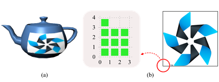
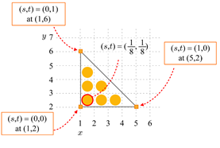
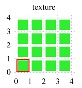

# Texturing


While the vertex shader outputs the clip space vertices, the rasterizer outputs a set of fragments at the window space. The per-fragment attributes usually include a normal and a set of texture coordinates. Using these data, the fragment shader determines the final color of each fragment. The most important things to do in the fragment shader are **lighting** and **texturing**.

Before moving on to the fragment shader, consider the basics of texturing. The simplest among the various texturing methods is image texturing. An image texture is a 2D array of **texels** (texture elements). Each texel has a unique position. In the first of the following figures, for example, the lower-left texel's position is (0.5,0.5). For accessing a texture, you can use 'normalized' texture coordinates (`s,t`) instead of the texel position (as shown in the second of the following figures).

**Figure: 2D array of texels**



**Figure: Accessing textures using normalized texture coordinates**


## Processing Texture Coordinates

The texture coordinates are assigned to the vertices of the polygon mesh. (This process is called **surface parameterization** or simply **parameterization**, and it is done by graphics packages, such as 3ds Max.) The scan conversion is also done with the texture coordinates. In the following figure, the scan conversion interpolates the per-vertex texture coordinates to determine the per-fragment texture coordinates. For example, the lower-left corner fragment is assigned the texture coordinates, (1/8,1/8). OpenGL&reg; ES simply multiplies the per-fragment texture coordinates by the texture resolution, `rx` and `ry`. If the resolution is 4x4, the texture coordinates, (1/8,1/8), are mapped to (0.5,0.5) and the lower-left corner texel is retrieved from the image texture.

**Figure: From the texture coordinates to the texel position**

  

## Texture Filtering

For a fragment located at (`x,y`) in the window, its texture coordinates (`s,t`) are mapped to (`s',t'`) as presented above. Basically, the fragment at (`x,y`) is **projected** onto (`s',t'`). In the contrived example given above, (`s',t'`) exactly falls into the center of a texel. In reality, however, this rarely happens. Then, the texels around (`s',t'`) are collected and combined to determine the texture color of the fragment. This process is called **texture filtering**.

Suppose a quad composed of 2 triangles. Depending on the view, view frustum, and viewport parameters, the quad size in the window space may vary. In the following figure, the top row shows a case where the window space quad appears larger than the given image texture. Then, the texture is **magnified** so as to be pasted onto the quad. In contrast, the window space quad in the bottom row appears smaller than the image texture, and the texture is **minified**. Note that the fragments are sparsely projected onto the texture space.

In the figure, the texture is depicted as a grid of dotted lines, where a texel is located in a grid cell. The gold dots represent the window space fragments projected onto the texture space.

**Figure: Magnification (top) vs. minification (bottom)**


### Filtering for Magnification

For magnification, you have 2 options. The first is **nearest point sampling**. Then, as you can see in the left example below, a block of fragments can be mapped to a single texel. Consequently, a blocky image is often produced. The second option is **bilinear interpolation** illustrated in the right example below. In general, bilinear interpolation is preferred to nearest point sampling.

**Figure: Nearest point sampling (left) vs. bilinear interpolation (right)**

 

### Filtering for Minification

Consider the checkerboard image texture in the following figure. If all fragments are surrounded by dark-gray texels, the textured primitive appears dark gray. If all fragments are surrounded by light-gray texels, the textured primitive appears light gray.

**Figure: Minification problem**


## Mipmapping

The filtering for minification process discussed above has a problem, because the texture is larger than the window space primitive and therefore many texels are not involved in texture filtering. The solution is to make the texture smaller, so that all texels are involved for texture filtering. The best case is that the window space primitive and the texture have the same size.

To make the texture smaller, it is repeatedly down-sampled to a quarter size, and the colors of 2x2 neighboring texels are averaged to determine the color of a texel in the quarter texture, as shown in the following figure. Given an original texture of 2`l`x2`l` resolution, a texture pyramid of (`l` + 1) levels is constructed, where the original texture is located at level 0. The pyramid is called a **mipmap**.

**Figure: Mipmap generation process**

 

### Mipmap Generation in OpenGL&reg; ES

To automatically generate a mipmap, OpenGL&reg; ES invokes the `glGenerateMipmap()` function, where the parameter can be, for example, `GL_TEXTURE_2D` or `GL_TEXTURE_CUBE_MAP` (textures in OpenGL&reg; ES 2.0 come in 2 forms: 2D textures and cube map textures). Use `GL_TEXTURE_2D` for general image texturing.

<a name="mipmap_mini"></a>
### Mipmapping for Minification

In any given a mipmap, you must decide which level you want to use for texture filtering. Observe that a pixel (fragment) covers an area on the screen. For simplicity, consider the area as a square so that the entire screen is tiled by an array of square pixels. Then, a pixel's projection onto the texture space is not a 'point', but an 'area' centered at (`s',t'`). The projected area is called the **footprint** of the pixel.

As a simple example, consider a footprint that covers `m x m` texels of the level-0 texture. Then, the GPU computes `log2m`, which is denoted by λ. In the following figure, λ = log23 ≈ 1.585. Consider then ⌊λ⌋ and ⌈λ⌉, which in this example are levels 1 and 2. You have 2 options:

- Select the level closer to λ. In this example, you select level 2. The selected level can be filtered either by nearest point sampling or by bilinear interpolation.

  For example: Take the nearest level: `iλ= ⌊λ+0.5⌋`

  - At the level, you can take the nearest point.
  - In contrast, you can do bilinear interpolation.

- Consider both ⌊λ⌋ and ⌈λ⌉ and then linearly interpolate the filtering results. Of course, each level can be filtered either by nearest point sampling or by bilinear interpolation.

  For example: Take ⌊λ⌋ and ⌈λ⌉ and linearly interpolate the filtering results.

  - At each level, you can take the nearest point.
  - In contrast, you can do bilinear interpolation.

Note that the last case performs 3 levels of linear interpolations. It is called **trilinear interpolation**.

**Figure: Selecting the mipmap levels**


There is of course a third option: not to do mipmapping but to use the original image (at level 0) instead. It can be filtered either by nearest point sampling or by bilinear interpolation. Therefore, minification has 6 varieties in total.

## Texturing in OpenGL&reg; ES

When an image file is to be used as a texture, it is first loaded into the OpenGL&reg; ES program. Then, you must take the following steps:

1. Use the `glGenTextures()` function, where the first parameter defines the number of texture objects to generate and the second parameter returns them in `textures`.
2. Use the `glBindTexture()` function, where the first parameter specifies what the texture is used for as, for example, `GL_TEXTURE_2D` or `GL_TEXTURE_CUBE_MAP`.
3. After a texture object is generated and bound, the image data must be loaded using the `glTexImage2D()` function, where the first parameter is either `GL_TEXTURE_2D` or one of the cube-map faces, such as `GL_TEXTURE_CUBE_MAP_POSITIVE_X`, the second parameter specifies the mipmap level, and the eighth parameter can be, for example, `GL_UNSIGNED_SHORT_4_4_4_4` or `GL_UNSIGNED_SHORT_5_6_5`.
4. The GPU itself makes a choice between minification and magnification, but allows you to select what kind of filtering to use in each case. For this purpose, invoke the `glTexParameteri()` function. If the second parameter (parameter name) is `GL_TEXTURE_MAG_FILTER`, the third parameter is either `GL_NEAREST` or `GL_LINEAR`. If the second parameter is `GL_TEXTURE_MIN_FILTER`, the third parameter is either `GL_NEAREST_MIPMAP_NEAREST`, `GL_LINEAR_MIPMAP_NEAREST`, `GL_NEAREST_MIPMAP_LINEAR`, `GL_LINEAR_MIPMAP_LINEAR`, `GL_NEAREST`, or `GL_LINEAR`. These 6 options are those presented in [Mipmapping for Minification](#mipmap_mini).

## Texturing Example

In order to generate a texture in OpenGL&reg; ES, you usually have to decode the image file stored in the file system. In Tizen, you can use the Evas API (in [mobile](../../api/mobile/latest/group__Evas.html) and [wearable](../../api/wearable/latest/group__Evas.html) applications) to get the decoded bitmap buffer from the image file, as shown in the following example. The code creates an independent `Ecore_Evas` object, which contains `Evas_Object`. It provides a method to decode the designated image file and store the bitmap data into its own buffer. You can get the internal buffer pointer and then upload the buffer to the texture.

```
/*
   Create OpenGL ES Texture object from image file path
   @param[in] parent Evas object
   @param[in] filename image file path
   @return texture id
*/
unsigned int
create_texture(Evas_Object *parent, const char *filename)
{
    unsigned int gltex_object;
    int w;
    int h;
    int surface_w;
    int surface_h;
    evas_object_geometry_get(parent, NULL, NULL, &surface_w, &surface_h);

    Evas_Object *inline_buffer = elm_win_add(parent, "Img Read", ELM_WIN_INLINED_IMAGE);
    evas_object_move(inline_buffer, 0, 0);
    evas_object_resize(inline_buffer, surface_w, surface_h);
    evas_object_show(inline_buffer);

    Evas *canvas = evas_object_evas_get(inline_buffer);
    Evas_Object *image = evas_object_image_add(canvas);

    char path[200];
    sprintf(path, "%s%s", app_get_resource_path(), filename);
    evas_object_image_file_set(image, path, NULL);
    evas_object_image_size_get(image, &w, &h);
    evas_object_image_fill_set(image, 0, 0, w, h);
    evas_object_image_filled_set(image, EINA_TRUE);
    evas_object_resize(image, w, h);
    evas_object_show(image);

    elm_win_render(inline_buffer);

    GLubyte *pixels;
    pixels = (GLubyte *)evas_object_image_data_get(image, EINA_FALSE);

    glPixelStorei(GL_UNPACK_ALIGNMENT, 1);
    glGenTextures(1, &gltex_object);

    glBindTexture(GL_TEXTURE_2D, gltex_object);

    glTexImage2D(GL_TEXTURE_2D, 0, GL_BGRA_EXT, w, h, 0, GL_BGRA_EXT,
                 GL_UNSIGNED_BYTE, pixels);

    glGenerateMipmap(GL_TEXTURE_2D);

    glTexParameteri(GL_TEXTURE_2D, GL_TEXTURE_MIN_FILTER, GL_LINEAR_MIPMAP_LINEAR);
    glTexParameteri(GL_TEXTURE_2D, GL_TEXTURE_MAG_FILTER, GL_LINEAR);

    glTexParameteri(GL_TEXTURE_2D, GL_TEXTURE_WRAP_S, GL_REPEAT);
    glTexParameteri(GL_TEXTURE_2D, GL_TEXTURE_WRAP_T, GL_REPEAT);

    glBindTexture(GL_TEXTURE_2D, 0);

    evas_object_del(inline_buffer);

    return gltex_object;
}
```


## Related Information
- Dependencies
  - Tizen 2.4 and Higher for Mobile
  - Tizen 2.3.1 and Higher for Wearable
