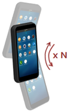
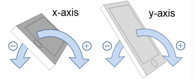
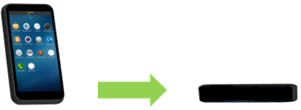

# Gesture Recognition

With gesture recognition, you can monitor user gestures.

The main Gesture Recognition API features are:

- Movement notifications

  You can [receive notifications about different device movement patterns](#gesture).

- Device state recognition

  You can identify the current device states and take applicable actions.

- Event triggers

  You can trigger events when the sensor data meets predefined conditions. In some cases, you can also listen for different movement states (started, in-progress, and ended).

The following gesture events are supported on Tizen devices:

- Double-tap

  The device is tapped twice.

- Move to ear

  The device is moved near to an ear. The event is detected using the acceleration and proximity sensors.

  **Figure: Move-to-ear event**

  

- No move

  The device is not moved for a while.

- Pick-up

  The device is picked up.

- Shake

  The device is quickly moved back and forth.

  **Figure: Shake event**

  

- Snap

  The device is moved along a particular axis.

  **Figure: Axes of the device**

  

  The movement is measured with 6 discrete events: +X, -X, +Y, -Y, +Z, and -Z:

  - With the display in the portrait mode, the +X, -X, +Z, and -Z snaps are active.
  - With the display in the landscape mode, the +Y, -Y, +Z, and -Z snaps are active.

  **Figure: Snap events +X, +Y, and +Z**

  

  > **Note**  
  > The snap motion does not operate correctly if the device is tilted improperly. For example, the device must be held straight in a portrait mode for best accuracy. Similarly, when the device is tilted 90 degrees along the Z axis from the above position (+X or -X points to the earth), the snap motion in a landscape mode works best. This means that when a user lies down holding the device, the snap motion may not work accurately.

- Tilt

  The device is tilted. The event provides changes of the slopes on the X and Y axes, not the current angle of each axis.

  **Figure: Tilt event**

  

- Turn face down

  The device is turned over and the screen is facing downwards.

  **Figure: Face-down event**

  

- Wrist up

  The event occurs when wrist-up gesture is performed (for a watch device).

  **Figure: Wrist-up event**

  

> **Note**  
> You can test the gesture recognition functionality only on a target device. The emulator does not support this feature.

## Prerequisites

To use the functions and data types of the Gesture Recognition API (in [mobile](../../api/mobile/latest/group__CAPI__CONTEXT__GESTURE__MODULE.html) and [wearable](../../api/wearable/latest/group__CAPI__CONTEXT__GESTURE__MODULE.html) applications), include the `<gesture_recognition.h>` header file in your application:

```
#include <gesture_recognition.h>
```

<a name="gesture"></a>
## Detecting Gestures

To set and unset callback functions for user gestures:

1. Create a handle for gesture detection using the `gesture_create()` function:

    ```
    gesture_h handle;
    gesture_create(&handle);
    ```

2. To subscribe to notifications about specific gesture events, invoke the `gesture_start_recognition()` function to register a callback function and start gesture detection.

   When the registered gesture is detected, the registered callback is invoked.

   ```
   gesture_start_recognition(handle, GESTURE_PICK_UP, GESTURE_OPTION_DEFAULT, gesture_cb, NULL);
   ```

   The above example starts gesture detection to receive notifications when the `GESTURE_PICK_UP` gesture is detected. The application can use any of the `gesture_type_e` enumerators (in [mobile](../../api/mobile/latest/group__CAPI__CONTEXT__GESTURE__MODULE.html#ga260f6752298cdd6c8235fd2922c147bf) and [wearable](../../api/wearable/latest/group__CAPI__CONTEXT__GESTURE__MODULE.html#ga260f6752298cdd6c8235fd2922c147bf) applications) in place of the `GESTURE_PICK_UP` value. Note that not all gestures are supported by all devices. In such cases, the function returns the `GESTURE_ERROR_NOT_SUPPORTED` value.

   If the default gesture option is designated, the system tries to reduce power consumption to detect the gesture. For example, the gesture is not necessarily detected while the display is switched off. Using the `GESTURE_OPTION_ALWAYS_ON` option prevents such power-saving behaviors. For more information on the gesture options, see the `gesture_option_e` enumeration (in [mobile](../../api/mobile/latest/group__CAPI__CONTEXT__GESTURE__MODULE.html#gaf3733ffc829005b3162df4aceecca228) and [wearable](../../api/wearable/latest/group__CAPI__CONTEXT__GESTURE__MODULE.html#gaf3733ffc829005b3162df4aceecca228) applications).

3. When the registered callback function is invoked, you can retrieve the event data using the `gesture_get_event()` function:

   ```
   void
   gesture_cb(gesture_type_e gesture, const gesture_data_h data,
              double timestamp, gesture_error_e error, void *user_data)
   {
       gesture_event_e event;
       if (gesture == GESTURE_PICK_UP) {
           gesture_get_event(data, &event);

           if (event == GESTURE_EVENT_DETECTED)
               /* Handle the event */
       }
   }
   ```

   If the application registered multiple gestures to a single callback function, the input parameter gesture can be used to distinguish the gesture received.

   Some gestures can return different types of events. For example, `GESTURE_SHAKE` can return `GESTURE_SHAKE_DETECTED` or `GESTURE_SHAKE_FINISHED`.

   For `GESTURE_TILT`, the `gesture_get_tilt()` function can be used to extract the tilting angles:

   ```
   int x;
   int y;
   if (gesture == GESTURE_TILT)
       gesture_get_tilt(data, &x, &y);
   ```

4. When gesture detection is no longer needed, unset the callback functions with the `gesture_stop_recognition()` function and destroy the handle with the `gesture_release()` function:

   ```
   gesture_stop_recognition(handle);
   gesture_release(handle);
   ```

## Related Information
* Dependencies
  - Tizen 2.4 and Higher for Mobile
  - Tizen 2.3.1 and Higher for Wearable
