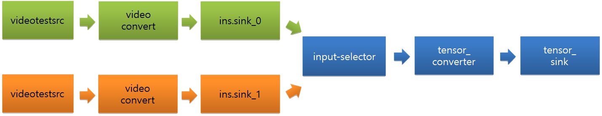
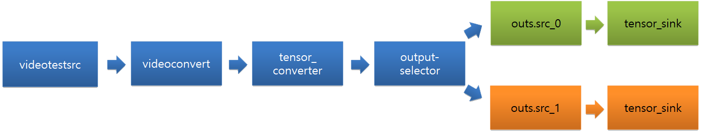

# Machine Learning Inference C-API

Developers can easily construct and efficiently execute data stream pipelines consisting of neural networks as filters in pipelines.

The main features of Machine Learning Inference C-API include:

- **Construction of data pipeline based on [gstreamer](https://gstreamer.freedesktop.org/)**

  You can compose the data stream pipeline through Machine Learning Inference C-API with various elements of gstreamer and nnstreamer.

- **[Single](#singleapi) & [Pipeline](#pipelineapi) API**
  
  There are 2 types of Machine Learning Inference C-API. Single API is useful for simple usage scenario of neural network models. It allows to invoke a neural network model with a single instance of input data for the model directly. It is useful if you have the input data pre-processed with the application itself and there is no complex interactions between neural network models, data processors, or data stream paths.
  
  On the other hand, Pipeline API allows developers to construct and execute pipelines with multiple neural network models, multiple input and output nodes, multiple data processors, pre-and-post processors, and various data path manipulators. Besides, if the input is online data (or streamed data), Pipeline APIs simplify your application and improve its performance.
  
- **Support various neural net frameworks (NNFW)**
  
TensorFlow, TensorFlow-Lite, Caffe2, and PyTorch are support. Thus, neural network model files trained by such frameworks can be imported as filters of pipelines directly.
Custom filters, which are neural network models implemented directly with programming languages including C/C++ and Python, may be imported as filters of pipelines directly as well.

Note that, in Tizen release, this is limited to TensorFlow-Lite only; we do not ship other frameworks for official embedded device OS images.

## Prerequisite <a name="prerequisite"></a>

To use the APIs, below headers and features are required.

- **Header**
  ```bash
  <nnstreamer.h>
  ```

- **Feature**
  ```bash
  <feature name="http://tizen.org/feature/machine_learning">true</feature>
  <feature name="http://tizen.org/feature/machine_learning.inference">true</feature>
  ```


## Single API <a name="singleapi"></a>

1. Open a model file with Single API

```bash
  <nnstreamer-single.h>
  
  ml_single_h single;
  ml_tensors_info_h in_info, out_info;
...

ml_single_open (&single, "model_file_path", in_info, out_info, ML_NNFW_TYPE_TENSORFLOW_LITE, ML_NNFW_HW_ANY);
```
   
   To load a model file, 2 `ml_tensors_info_h` are required. `in_info` contains the information of input tensor, and `out_info` is for output tensor. For the detail, you can check [Tensors Info section](#tensorsinfo).

2. APIs about [Tensor info](#tensorsinfo).

After model load, below APIs bring the info of input & output tensors.
```bash  
  ml_single_get_input_info (ml_single_h single, ml_tensors_info_h * info)
  ml_single_get_output_info (ml_single_h single, ml_tensors_info_h * info)
```

3. Invoke the model with input & output [Tensor data](#tensorsdata)

The model can be invoked with input & output tensor data. The result is included at the output tensor data.

```bash
  ml_tensors_data_create (in_info, &input);
  ml_single_invoke (single, input, &output);
```

4. close the opened handle
```bash
ml_single_close (single);
```

## Pipeline API <a name="pipelineapi"></a>

### Basic Usage <a name="basicusage"></a>

1. Construct a pipeline with gstreamer elements

With lots of elements of gstreamer, pipeline can be constructed in various way.
```bash
  const char *pipeline = "videotestsrc num_buffers=2 ! videoconvert ! videoscale ! video/x-raw,format=RGBx,width=224,height=224 ! tensor_converter ! fakesink";
  ml_pipeline_h handle;
  int status = ml_pipeline_construct (pipeline, NULL, NULL, &handle);
```

2. Start the pipeline and get state.
```bash
  /* a pipeline could be started when the state is paused */
  status = ml_pipeline_start (handle);

  status = ml_pipeline_get_state (handle, &state);
```

3. Stop the pipeline
```bash
  status = ml_pipeline_stop (handle);
  g_usleep (50000); /* 50ms. Let a few frames flow. */

  status = ml_pipeline_get_state (handle, &state);
```

4. Pipeline destroy
   
   After using it, the constructed pipeline have to be destroyed.
```bash
  status = ml_pipeline_destroy (handle);
```

### Element API <a name="elementapi"></a>
To run deep learning models with Machine Learning Inference C-API, manipulating the input/output data is required. Furthermore, the constructed pipeline should be controllable.

Below element APIs make it available.

* #### Source <a name="sourceelement"></a>

In case of setting the input tensor data, the configuration of data source element is required.
```bash
  gchar * pipeline = g_strdup ("appsrc name=srcx ! other/tensor,dimension=(string)4:1:1:1,type=(string)uint8,framerate=(fraction)0/1 ! tensor_sink");
```
Through `ml_pipeline_src_get_handle ()`, `appsrc` element with the name `srcx` become controllable.

```bash
  ml_pipeline_h handle;
  ml_pipeline_src_h srchandle;

  status = ml_pipeline_construct (pipeline, NULL, NULL, &handle);
  status = ml_pipeline_start (handle);
  status = ml_pipeline_src_get_handle (handle, "srcx", &srchandle);
```

With `srchandle`, we can check the information of input tensors.

```bash
  ml_tensors_info_h info;

  status = ml_pipeline_src_get_tensors_info (srchandle, &info);
```

According to the `info`, the input tensor data can be filled.
```bash
  ml_tensors_data_h data;
  
  status = ml_tensors_data_create (info, &data);

  for (i = 0; i < 10; i++) {
    uintarray1[i] = (uint8_t *) g_malloc (4);
    uintarray1[i][0] = i + 4;
    uintarray1[i][1] = i + 1;
    uintarray1[i][2] = i + 3;
    uintarray1[i][3] = i + 2;
  }

  status = ml_tensors_data_set_tensor_data (data, 0, uintarray1[0], 4);

  /* setiing the policy of raw data pointer */
  status = ml_pipeline_src_input_data (srchandle, data, ML_PIPELINE_BUF_POLICY_DO_NOT_FREE);
```

After configure it, release the handle is required.

```bash
  status = ml_pipeline_src_release_handle (srchandle);
```

* #### Sink <a name="sinkelement"></a>
In case of getting the output tensor raw data, the configuration of data sink element is required.
```bash
  gchar * pipeline = g_strdup ("videotestsrc num-buffers=3 ! videoconvert ! tensor_converter ! appsink name=sinkx");
```

Through `ml_pipeline_sink_register ()`, `appsink` element with the name `sinkx` become reachable.
```bash
  int status;
  ml_pipeline_h handle;
  ml_pipeline_sink_h sinkhandle;

  status = ml_pipeline_sink_register (handle, "sinkx", sink_callback, user_data, &sinkhandle);
```

`sink_callback ()` is called whenever appsink, `sinkx`, receives data. with [`data`](#tensorsdata), [`info`](#tensorsinfo), we can get the output data easily, and `user_data` can be used in the callback.

```bash
  typedef void (*ml_pipeline_sink_cb) (const ml_tensors_data_h data, const ml_tensors_info_h info, void *user_data);
```

After using it, the `sinkhandler` has to be released through `ml_pipeline_sink_unregister ()`
```bash
  status = ml_pipeline_sink_unregister (sinkhandle);
```


* #### Valve <a name="valveelement"></a>
When the stream of a pipeline needs to be controlled, this element is useful.

```bash
  gchar * pipeline = g_strdup ("videotestsrc is-live=true ! videoconvert ! videoscale ! video/x-raw,format=RGBx,width=16,height=16,framerate=10/1 ! tensor_converter ! queue ! valve name=valve1");
  int status = ml_pipeline_construct (pipeline, NULL, NULL, &handle);
```

`valve1` is the name of the valve of the pipeline, and it is opened as a default. This valve can be controlled with getting `ml_pipeline_valve_h`.

```bash
  ml_pipeline_h handle;
  ml_pipeline_valve_h valve1;

  status = ml_pipeline_valve_get_handle (handle, "valve1", &valve1);
```

After start pipeline, the stream of a pipeline can be controlled with valve.
```bash
  status = ml_pipeline_start (handle);

  status = ml_pipeline_valve_set_open (valve1, true); /* close */
```

It can be opened with the same way.

```bash
  status = ml_pipeline_valve_set_open (valve1, true); /* open */
```

Before destroy the pipeline, `ml_pipeline_valve_h` has to be released.

```bash
  status = ml_pipeline_valve_release_handle (valve1); /* release valve handle */
```

* #### Switch <a name="switchelement"></a>
When a pipeline consists of multiple branch, and only one of the branches has to be working, this element is useful.



```bash
  gchar * pipeline = g_strdup ("input-selector name=ins ! tensor_converter ! tensor_sink name=sinkx "
      "videotestsrc is-live=true ! videoconvert ! ins.sink_0 "
      "videotestsrc num-buffers=3 is-live=true ! videoconvert ! ins.sink_1");

```

First, getting `ml_pipeline_switch_h` is required. The name of switch in this pipeline is `ins`

```bash
  ml_pipeline_h handle;
  ml_pipeline_switch_h switchhandle;

  status = ml_pipeline_switch_get_handle (handle, "ins", &type, &switchhandle);
```

Now, the switch is controllable with getting handle `ml_pipeline_switch_h`.

```bash
  ml_pipeline_h handle;
  ml_pipeline_switch_h switchhandle;
  ml_pipeline_switch_e type;

  status = ml_pipeline_construct (pipeline, NULL, NULL, &handle);
  status = ml_pipeline_switch_get_handle (handle, "ins", &type, &switchhandle);
```

Before destroy the pipeline, `ml_pipeline_switch_h` has to be released.

```bash
  status = ml_pipeline_switch_release_handle (switchhandle);
```

Switch can be located at the end of the pipeline like below image.



```bash
  gchar * pipeline = g_strdup ("videotestsrc is-live=true ! videoconvert ! tensor_converter ! output-selector name=outs "
      "outs.src_0 ! tensor_sink name=sink0 async=false "
      "outs.src_1 ! tensor_sink name=sink1 async=false");
```

### Pipeline States <a name="pipelinestate"></a>
You can get the information about the states at [Gstreamer guide](https://gstreamer.freedesktop.org/documentation/plugin-development/basics/states.html).

## Tensors Info <a name="tensorsinfo"></a>

This is a structure which contains the information of the Tensors.
`ml_tensors_info_s` is the set of tensors and `ml_tensor_info_s` is for a tensor in `ml_tensors_info_s`.
```bash
  typedef struct {
    unsigned int num_tensors; /**< The number of tensors. */
    ml_tensor_info_s info[ML_TENSOR_SIZE_LIMIT];  /**< The list of tensor info. MAX size is 16 */
  } ml_tensors_info_s;

  typedef struct {
    char *name;              /**< Name of each element in the tensor. */
    ml_tensor_type_e type;   /**< Type of each element in the tensor. */
    ml_tensor_dimension dimension;     /**< Dimension information. MAX rank is 4 */
  } ml_tensor_info_s;
```

## Tensors Data <a name="tensorsdata"></a>

This is a structure which contains the raw data of tensors.
```bash
  typedef struct {
    void *tensor; /**< The instance of tensor data. */
    size_t size; /**< The size of tensor. */
  } ml_tensor_data_s;

  typedef struct {
    unsigned int num_tensors; /**< The number of tensors. */
    ml_tensor_data_s tensors[ML_TENSOR_SIZE_LIMIT]; /**< The list of tensor data. NULL for unused tensors. */
  } ml_tensors_data_s;
```

## Related Information
- Dependencies
  - Tizen 5.5 and Higher
