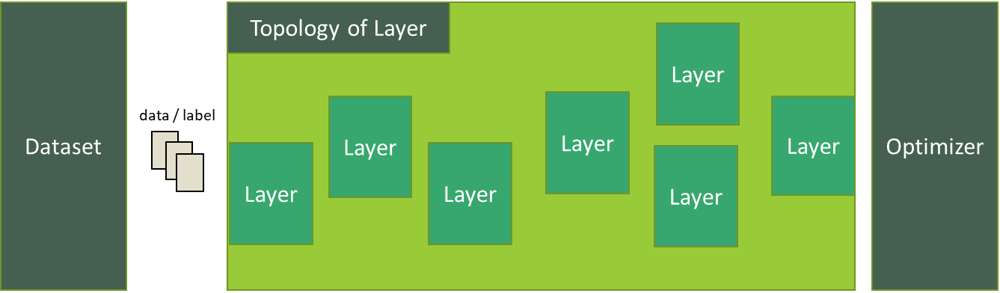

# Machine Learning Training

Machine Learning Training API allows you to construct, control, and train a machine learning model in Tizen devices.

The main features of the Machine Learning Training API include:

1. Construction of deep neural network(DNN)
   - You can construct a DNN model using a model description file or by writing code through Machine Learning Training API.
2. Train with your own data
   - Machine Learning Training API also allows you to train the model with your own data as a File I/O or by defining a data generator.
3. Evaluate the model during train
   - You can validate and test your model during the training process easily by defining the dataset.

> [!NOTE]
> Every example code does not handle all error use cases.
> Error must be handled more extensively compared to the example code written in this page.

## Prerequisites

To enable your application to use Machine Learning Training API:

1. Include the `<nntrainer.h>` header file in your application:

   ```c
   #include <nntrainer.h>
   ```

2. Include the following features in your `tizen-manifest.xml` file:

   ```xml
   <feature name="http://tizen.org/feature/machine_learning">true</feature>
   <feature name="http://tizen.org/feature/machine_learning.training">true</feature>
   ```

In case of saving or loading model files from the outside of the application's own resources, the application has to request permission by adding the following privileges to the `tizen-manifest.xml` file:

    ```xml
    <privileges>
      <!-- For accessing media storage -->
      <privilege>http://tizen.org/privilege/mediastorage</privilege>
      <!-- For accessing external storage -->
      <privilege>http://tizen.org/privilege/externalstorage</privilege>
    </privileges>
    ```

## Building blocks

Following are the four major components of Machine Learning Training API:

 * [Model](#model)
 * [Layer](#layer)
 * [Optimizer](#optimizer)
 * [Dataset](#dataset)

### Model



Model is a wrapper component that has the topology of layers, optimizers and datasets.
The model performs training and saves the updated parameters that can later be used for inference.
Currently, only a sequential neural network is supported:

```c
// Create model
ml_train_model_h model;
ml_train_model_construct(&model);

/* Configure model(omitted for brevity) */

// Compile model, this freezes model and cannot modify model afterwards.
ml_train_model_compile(model, "loss=cross", "batch_size=16", NULL);
// run model
ml_train_model_run(model, "epochs=2", "save_path=model.bin", NULL);

// destroy after use
ml_train_model_destroy(model);
```

A number of properties can be set at `ml_train_model_compile` and `ml_train_model_run` phase:

Function | Key | Value | Description
-------- | --- | ----- | -----------
`ml_train_model_compile` | loss      | (categorical)| Loss function to be set
&#xfeff;                 |           | cross        | cross-entropy loss
&#xfeff;                 |           | mse          | mean squared error
`ml_train_model_run`     | epochs    | (integer)    | Determines epochs for the model
&#xfeff;                 | save_path | (file_path)  | Model path to save and read parameters

### Layer

Layer is a component that does actual computation while managing internal trainable parameters.
Currently, input layer and fully connected layer type are supported:

```c
// Create layer
ml_train_layer_h layer;
ml_train_layer_create(&layer, ML_TRAIN_LAYER_TYPE_FC);

// configure layer
ml_train_set_property(layer, "unit=10", "activation=softmax", "bias_initializer=zeros", NULL);

// after add layer to model,
// you do not need to destroy layer since ownership is transferred to the model.
ml_train_model_add_layer(model, layer);
```

Following are the available properties for each layer type:

Type | Key | value | Description
---------- | --- | ----- | -----------
(Universal props)           |                    |               | Universal props that applies to every layer
&#xfeff;                    | name               | (string)      | An identifier for each layer
&#xfeff;                    | input_shape        | (string)      | Formatted string as "c:h:w". (if there is no channel it should be 1). First layer of the model must have input_shape. Other can be omitted as it is calculated at compile phase.
&#xfeff;                    | activation         | (categorical) | An identifier for each layer
&#xfeff;                    |                    | tanh          | hyperbolic tangent
&#xfeff;                    |                    | sigmoid       | sigmoid function
&#xfeff;                    |                    | relu          | relu function
&#xfeff;                    |                    | softmax       | softmax function
&#xfeff;                    | weight_initializer | (categorical) | Weight initializer
&#xfeff;                    |                    | zeros         | Zero initialization
&#xfeff;                    |                    | lecun_normal  | LeCun Normal Initialization
&#xfeff;                    |                    | lecun_uniform | LeCun Uniform Initialization
&#xfeff;                    |                    | xavier_normal | Xavier Normal Initialization
&#xfeff;                    |                    | xavier_uniform| Xavier Uniform Initialization
&#xfeff;                    |                    | he_normal     | He Normal Initialization
&#xfeff;                    |                    | he_uniform    | He Uniform Initialization
&#xfeff;                    | bias_initializer   | (categorical) | Bias initializer, same category as `weight_initializer`
&#xfeff;                    | weight_regularizer | (categorical) | Weight regularizer. Currently, only l2norm is supported
&#xfeff;                    |                    | l2norm        | l2norm weight regularizer
&#xfeff;                    | weight_regularizer_constant | (float)| weight regularizer constant
&#xfeff;                    | flatten            | (boolean)     | flatten shape to c:h:w -> 1:1:c*h*w
`ML_TRAIN_LAYER_TYPE_INPUT` |                    |               | Input layer
&#xfeff;                    | normalization      | (boolean)     | normalize input if true
&#xfeff;                    | standardization    | (boolean)     | standardize input if true
`ML_TRAIN_LAYER_TYPE_FC`    |                    |               | Fully connected layer
&#xfeff;                    | unit               | (integer)     | number of outputs

### Optimizer

Optimizer determines how to update model parameters according to loss from prediction.
Currently, Stochastic Gradient Descent optimizer and Adam optimizer are supported:

```c
// Create optimizer
ml_train_optimizer_h optimizer;
ml_train_optimizer_create(&optimizer, ML_TRAIN_OPTIMIZER_TYPE_SGD);

// configure optimizer
ml_train_optimizer_set_property(optimizer, "learning_rate=0.001", NULL);

// after configuring optimizer to model
// you do not need to destroy optimizer since ownership is transferred to the model.
ml_train_model_set_optimizer(model, optimizer);
```

Following are the available properties for each optimizer type:

Type | Key | value | Description
---------- | --- | ----- | -----------
(Universal props)                   |                    |               | Universal props that applies to every layer
&#xfeff;                            | learning_rate      | (float)       | Initial learning rate for the optimizer
`ML_TRAIN_OPTIMIZER_TYPE_SGD`       |                    |               | Stochastic Gradient Descent optimizer
`ML_TRAIN_OPTIMIZER_TYPE_ADAM`      |                    |               | Adam optimizer
&#xfeff;                            | decay_steps        | (float)       | Decay steps
&#xfeff;                            | decay_rate         | (float)       | Decay rate
&#xfeff;                            | beta1              | (float)       | beta1 coefficient for adam
&#xfeff;                            | beta2              | (float)       | beta2 coefficient for adam
&#xfeff;                            | epsilon            | (float)       | epsilon coefficient for adam

### Dataset

Dataset is in charge of feeding data into the model.
The dataset can either be created from a callback function or created from a file.
For more information, see [configure the model](#configure-the-model) section.

Following code is example of handling dataset:

```c
// Create dataset
ml_train_dataset_h dataset;
ml_train_dataset_create_with_generator(&dataset, generator_train_cb, generator_valid_cb, generator_test_cb);

// configure dataset
ml_train_dataset_set_property(dataset, "buffer_size=100", NULL);

// after setting a dataset to model,
// you do not need to destroy dataset since ownership is transferred to the model.
ml_train_model_set_dataset(model, dataset);
```

## Construct a model

A model can be constructed with `ml_train_model_construct`.
If you have a file that describes the model, the file can be used to construct initially with `ml_train_model_construct_with_file`.
Even if the model is constructed from a file, switching, modifying or setting a component is possible only until you compile with `ml_train_model_compile`.

### Construct a model from a description file

As of now, only INI formatted files `*.ini` is supported to construct a model from a file.

#### Create a model from INI formatted file

Special sections `[Model]` and `[Dataset]` are respectively referring to `model` and `dataset` object.
Rest of INI sections map to a `layer`. Keys and values from each section set properties of the layer.
All keys and values are treated as case-insensitive.

For example:

```ini
[Model] # Special section that describes model itself
Type = NeuralNetwork  # Model Type : only NeuralNetwork is supported as of now
Optimizer = adam  # Optimizer : sgd (stochastic gradient decent),
          #             adam (Adaptive Moment Estimation)
#### optimizer related properties
Learning_rate = 0.0001  # Learning Rate for the optimizer
Decay_rate = 0.96 # for the decay_rate for the decayed learning rate
Decay_steps = 1000       # decay step for the exponential decayed learning rate
beta1 = 0.9     # beta 1 for adam
beta2 = 0.9999  # beta 2 for adam
epsilon = 1e-7  # epsilon for adam

#### Model compile related properties
batch_size = 9
loss = cross      # Cost(loss) function : mse (mean squared error)
                        #                       cross (cross entropy)

####  Model run related properties
Epochs = 20     # Epochs
save_path = "model.bin"   # model path to save / read parameters

[DataSet] # Special section that describes dataset.
BufferSize=9
TrainData="trainingSet.dat"
ValidData="validationSet.dat"
LabelData="label.dat"

# Layer Sections, each section name refers to name of the layer
[inputlayer]
Type = input
Input_Shape = 1:1:62720 # Input Layer Dimension channel:height:width
Normalization = true

[outputlayer]
Type = fully_connected
Unit = 2    # Output Layer Dimension ( = Weight Width )
bias_initializer = zeros
weight_initializer = xavier_uniform
Activation = sigmoid  # activation : sigmoid, softmax
weight_regularizer = l2norm
weight_regularizer_constant = 0.005
```

The following restrictions must be adhered to:

 * Model file must have a `[Model]` section.
 * Model file must have at least one layer.
 * Valid keys must have valid properties (while invalid keys in each section will be ignored.)

> [!NOTE]
> All paths are relative to the current working directory unless stating an absolute path.
> It is recommended to set `save_path` and `Dataset` from the code over describing inside the model file.

Following example constructs model from INI file:

```c
char *res_path = app_get_resource_path();
char model_path[1024];
ml_train_model_h model;

snprintf(model_path, sizeof(model_path), "%s/model.ini", res_path);
free(res_path);

status = ml_train_model_construct_with_conf(model_path, &model);
if(status != ML_ERROR_NONE) {
  // handle error
}
```

### Construct a model on code

An empty model can be constructed with `ml_train_model_construct`.

## Configure the model

After constructing a model, the model can be configured.

> [!NOTE]
> Example code written here reproduces the model description from [Create Model from INI Formatted File](#create-model-from-ini-formatted-file) except that followings are different:
> * Relative path is changed to dynamic app resource and data path.
> * Model related properties (which can only be set at compile / run phase)
> * Demonstration about `ml_train_dataset_create_with_generator` which cannot be covered in the description file.

First, an empty model needs to be created:

```c
ml_train_model_h model;
ml_train_model_construct(&model);
```

### Add a layer

`ml_train_model_add_layer` appends a layer to the end of the graph in the model:

```c
int status = ML_ERROR_NONE;
ml_train_layer_h layers[2];

// create and add input layer
status = ml_train_layer_create(&layers[0], ML_TRAIN_LAYER_TYPE_INPUT);
if(status != ML_ERROR_NONE) {
  // handle error
}

status = ml_train_layer_set_property(layers[0], "name=inputlayer",
                                                "input_shape=1:1:62720",
                                                "normalization=true", NULL);
if(status != ML_ERROR_NONE) {
  //handle error
}
status = ml_train_model_add_layer(model, layers[0]);

// create and add fully connected layer
status = ml_train_layer_create(&layers[1], ML_TRAIN_LAYER_TYPE_FC);
status = ml_train_layer_set_property(layers[1], "name=outputlayer",
                                                "unit=2",
                                                "bias_initializer=zeros",
                                                "weight_initializer=xavier_uniform",
                                                "activation=sigmoid", NULL);
status = ml_train_model_add_layer(model, layers[1]);
```

### Set an optimizer

Creating and setting `optimizer` to a model can be done in the same manner as `layer`:

```c
status = ml_train_optimizer_create(&optimizer, ML_TRAIN_OPTIMIZER_TYPE_ADAM);
status = ml_train_optimizer_set_property(optimizer, "learning_rate=0.0001",
                                                    "decay_rate=0.96",
                                                    "decay_steps=1000",
                                                    "beta1=0.002",
                                                    "beta2=0.001",
                                                    "epsilon=1e-7", NULL);
status = ml_train_model_set_optimizer(model, optimizer);
```

### Set a dataset

There are two ways to create a dataset. One is from a file, and another one is from a callback.
In either fashion, you need to provide streams of tensor data and one-hot-encoded labels.

#### Set a dataset from a file

To create a `dataset` from a file, a training set and a label set must be provided. A validation set and a test set can be provided if needed.

A label set is a file that has actual labels each in a line. For example:

```
airplane
automobile
bird
cat
deer
dog
frog
horse
ship
truck
```

Each dataset except for the label set must contain raw float array data and one-hot-encoded labels:

```
[float array for data1][label(on-hot encoded) for data1][float array][label]...
```

After preparing the label set and dataset, create `dataset` as follows:

```c
int status = ML_ERROR_NONE;
ml_train_dataset_h dataset;

char *res_path = app_get_resource_path();
char train_path[1024];
char label_prop[1024];

snprintf(train_path, sizeof(train_path), "%s/training.dat", res_path);
snprintf(label_prop, sizeof(label_prop), "label_data=%s/label.dat", res_path);
free(res_path);

status = ml_train_dataset_create_with_file(&dataset, train_path);
if(status != ML_ERROR_NONE) {
  // handle error
}

status = ml_train_dataset_set_property(dataset, label_prop,
                                   "buffer_size=9", NULL);
status = ml_train_model_set_dataset(model, dataset);
```

`buffer_size` can be set for dataset.

#### Set a dataset from a generator

Creating a dataset from a generator function is also possible.

1. Prepare a callback function:

    ```c
    /**
    * @brief      get data which size is batch for train
    * @param[out] data
    * @param[out] label
    * @param[out] last if the data is finished
    * @param[in] user_data private data for the callback
    * @retval status for handling error
    */
    int get_train_data(float **data, float **label, bool *last, void *user_data) {
      /* code that fills data, label and last */
      return ML_ERROR_NONE;
    }
    ```

2. Create a dataset from the callback function:

    ```c
    int status = ML_ERROR_NONE;
    ml_train_dataset_h dataset;

    // validation and test callback can be omitted.
    status = ml_train_dataset_create_with_generator(&dataset, get_train_data,
                                                    NULL, NULL);
    ```

## Compile the model

Compiling a model finalizes the model with loss.
Once compiled, any modification to the properties of the model.
Adding layers or changing the optimizer/dataset of the model will not be permitted as well:

```c
int status = ML_ERROR_NONE;

status = ml_train_model_compile(model, "loss=cross", "batch_size=9", NULL);)
```

## Train the model

Now, the model is ready to train. Train model as below:

```c
int status = ML_ERROR_NONE;

status = ml_train_model_run(model, "epochs=20", "save_path=model.bin", NULL);)
```

## Destroy the model

After training, the model must be destroyed with `ml_train_model_destroy`.

> [!NOTE]
> `ml_train_model_add_layer`, `ml_train_set_optimizer`, `ml_train_set_dataset` transferrers ownership to `model`.
> `layers`/`optimizers`/`dataset` which belongs to a `model` will also be deleted.

## Related information

- Dependencies
  - Tizen 6.0 and Higher for Mobile
  - Tizen 6.0 and Higher for Wearable
