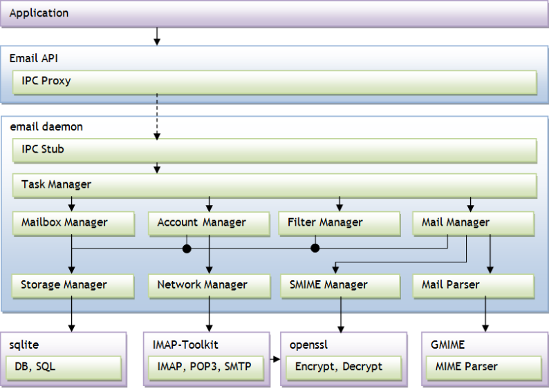

# Email


Email is a method of exchanging digital messages. Email systems are based on a store-and-forward model, in which email server computer systems accept, forward, deliver, and store messages on behalf of users, who only need to connect to the email infrastructure, typically an email server, with a network-enabled device for the duration of a message submission or retrieval.

The main features of the Email API include:

- Preparing email messages

  Set the subject, body, and recipients of the message, and the file path for any attachments.

- Sending email messages

  Once the `email_send_message()` function is called, the message content is out of the application's control. Even if the message appears not to have finished sending, it can no longer be modified.

- Registering a callback to be notified of the message status

  Email sending is asynchronous and the application must not wait for the result. The process can be slow (connections must be established), and even if the mail server is not available, message sending is not a failure if a spooling mechanism exists. To receive a notification when the message has been successfully sent, register a callback function.

You can [compose, save, and send email messages](#creatingmail) using SMTP (SMTP used for sending emails through the Internet is described in the RFC5321/5322 standards). The Email API provides services to applications that want to connect to an email server and manage messages.

The Email API can be utilized by any component in the application layer which helps the end user to manage email messaging. For example, the Email functions can be invoked by a multimedia module when the user wants to send a media file through email, or by an email application when the user tries to send an email message.

**Figure: Email service architecture**



## Prerequisites

To enable your application to use the email functionality:

1. To use the Email API (in [mobile](../../api/mobile/latest/group__CAPI__MESSAGING__EMAIL__MODULE.html) and [wearable](../../api/wearable/latest/group__CAPI__MESSAGING__EMAIL__MODULE.html) applications), the application has to request permission by adding the following privilege to the `tizen-manifest.xml` file:

   ```
   <privileges>
      <privilege>http://tizen.org/privilege/email</privilege>
   </privileges>
   ```

2. Set up at least 1 email account on your device before sending an email.

3. To use the functions and data types of the Email API, include the `<email.h>` header file in your application:

   ```
   #include <email.h>
   ```

   To ensure that an Email function has been executed properly, make sure that the return value is equal to `EMAILS_ERROR_NONE`.

The email service does not need any initialization or connection opening before the API usage.

<a name="creatingmail"></a>
## Creating and Sending Email Messages

To create and send email messages:

1. Create an email message.

   To create an email message and receive its handle, use the `email_create_message()` function.

   ```
   email_h msg;
   int error_code = EMAILS_ERROR_NONE;
   error_code = email_create_message(&msg);
   if (error_code != EMAILS_ERROR_NONE)
       dlog_print(DLOG_INFO, LOG_TAG, "Failed to create email message\n");
   ```

   The function return code defines whether the message creation succeeded. The `EMAIL_ERROR_ACCOUNT_NOT_FOUND` error is not related to the email service as such; it occurs if no email account has been configured on the device.

2. Manage recipients and attachments:

   - Add recipients to the email message one by one. You cannot add lists of recipients in one function call. Each address must be given as a character string with the address type (TO, CC, BCC) declared.

     ```
     error_code = email_add_recipient(msg, EMAIL_RECIPIENT_TYPE_TO, "example@mail.com");
     if (error_code != EMAILS_ERROR_NONE)
         dlog_print(DLOG_INFO, LOG_TAG, "Failed to add recipient\n");
     ```

   - Add an attachment to the email message with a full path to the attachment file. Currently, files with size up to 10 MB are supported.

     ```
     error_code = email_add_attach(msg, "/full/path/to/attachment");
     if (error_code != EMAILS_ERROR_NONE)
         dlog_print(DLOG_INFO, LOG_TAG, "Failed to add attachment\n");
     ```

   - Remove recipients or attachments.

     In both cases, all recipients or attachments are removed at once. It is not possible to remove one selected item.

     ```
     error_code = email_remove_all_recipients(msg);
     if (error_code != EMAILS_ERROR_NONE)
         dlog_print(DLOG_INFO, LOG_TAG, "Failed to add remove recipients\n");
     error_code = email_remove_all_attachments(msg);
     if (error_code != EMAILS_ERROR_NONE)
         dlog_print(DLOG_INFO, LOG_TAG, "Failed to remove attachments\n");
     ```

3. Save the email before sending it:

   ```
   error_code = email_save_message(msg);
   if (error_code != EMAILS_ERROR_NONE)
       dlog_print(DLOG_INFO, LOG_TAG, "Failed to save email\n");
   ```

4. Define and register the email sending status callback.

   Email sending is an asynchronous operation, and thus the sending status cannot be checked directly in the return code from the `email_send_message()` function. To receive notifications about sending success or failure, use a callback function.

   ```
   static void
   email_send_status(email_h email, email_sending_e result, void *user_data)
   {
       if (result == EMAIL_SENDING_FAILED) {
           /* Error handling */
           dlog_print(DLOG_INFO, LOG_TAG, "Failed to send email\n");
       } else if (result == EMAIL_SENDING_SUCCEEDED) {
           /* Sending was successful */
           dlog_print(DLOG_INFO, LOG_TAG, "Email sending finished with success\n");
       }
   }

   error_code = email_set_message_sent_cb(msg, email_send_status, NULL);
   if (error_code != EMAILS_ERROR_NONE)
       dlog_print(DLOG_INFO, LOG_TAG, "Failed to set sending status callback\n");
   ```

5. Send the email:

   ```
   error_code = email_send_message(msg, false);
   if (error_code != EMAILS_ERROR_NONE)
       dlog_print(DLOG_INFO, LOG_TAG, "");
   ```

6. When the message is sent or if sending is canceled and the message no longer needed, delete it using the `email_destroy_message()` function. The registered email sending status callback must also be unset using the `email_unset_message_sent_cb()`function.

   ```
   error_code = email_unset_message_sent_cb(msg);
   if (error_code != EMAILS_ERROR_NONE)
       dlog_print(DLOG_INFO, LOG_TAG, "Failed to unset status callback\n");

   error_code = email_destroy_message(msg);
   if (error_code != EMAILS_ERROR_NONE)
       dlog_print(DLOG_INFO, LOG_TAG, "Failed to delete email message\n");
   ```

## Related Information
-  Dependencies
  - Tizen 2.4 and Higher for Mobile
  - Tizen 3.0 and Higher for Wearable
