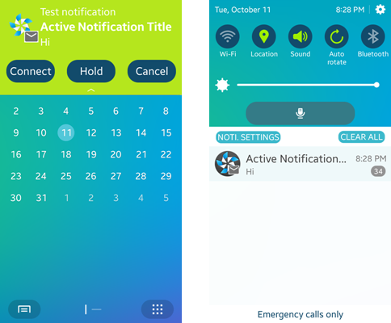

# Push Server

You can push events from an application server to your application on a Tizen device. If the message sending fails for any reason, an error code identifying the failure reason is returned. You can use the [error code](#error_codes) to determine how to handle the failure.

The Push API is optional for the Tizen wearable profile, which means that it may not be supported on all wearable devices.

The main features of the Push API for the server developers include:

- Sending push notifications

  You can [send push notifications](#send_server) from the application server to an application.

- Decorating push notifications

  You can [add decorations to the push notifications](#decorate_noti) in the quick panel.

<a name="send_server"></a>
## Sending Push Notifications

You can send notifications to your applications installed on Tizen devices. The basics of sending push notifications are covered in the [Push](push.md#send) guide. This use case covers more advanced information, such as sending multiple notifications in one request and sending multicast notifications.

To send push notifications:

1. Determine the RQM server.

   The request manager (RQM) servers collect your push notifications before sending them to the applications. The RQM server must be chosen based on the first 2 digits of the registration ID.

   **Table: Push RQM server URLs**

   | Prefix of the `regId` | Region                 | URL                                      |
   |-----------------------|------------------------|------------------------------------------|
   | 00                    | US East                | `https://useast.push.samsungosp.com:8090/spp/pns/api/push` |
   | 02                    | Asia Pacific Southeast | `https://apsoutheast.push.samsungosp.com:8090/spp/pns/api/push` |
   | 03                    | EU West                | `https://euwest.push.samsungosp.com:8090/spp/pns/api/push` |
   | 04                    | Asia Pacific Northeast | `https://apnortheast.push.samsungosp.com:8090/spp/pns/api/push` |
   | 05                    | Korea                  | `https://apkorea.push.samsungosp.com:8090/spp/pns/api/push` |
   | 06                    | China                  | `https://apchina.push.samsungosp.com.cn:8090/spp/pns/api/push` |
   | 50                    | US East                | `https://useast.gateway.push.samsungosp.com:8090/spp/pns/api/push` |
   | 52                    | Asia Pacific Southeast | `https://apsoutheast.gateway.push.samsungosp.com:8090/spp/pns/api/push` |
   | 53                    | EU West                | `https://euwest.gateway.push.samsungosp.com:8090/spp/pns/api/push` |
   | 54                    | Asia Pacific Northeast | `https://apnortheast.gateway.push.samsungosp.com:8090/spp/pns/api/push` |
   | 55                    | Korea                  | `https://apkorea.gateway.push.samsungosp.com:8090/spp/pns/api/push` |
   | 56                    | China                  | `https://apchina.gateway.push.samsungosp.com.cn:8090/spp/pns/api/push` |

   For example, if the registration ID of the application that you want to send a notification to begins with 04, the URL of the RQM server must be `https://apnortheast.push.samsungosp.com:8090/spp/pns/api/push`.

2. Determine the type of push notification.

   Since Tizen 3.0, you can determine the notification type. You can send a notification either to notify a user about urgent information or to deliver data to the application for update:

   - If you have an urgent message or data for the user, fill the message field with a proper action value:

     ```
     {
         "messages":
         [{
             /* Other content */
             "message": "action=ALERT&badgeOption=INCREASE&badgeNumber=1&alertMessage=Hi",
             "appData": "{id:asdf&passwd:1234}",
             /* Other content */
         ]}
     }
     ```

   - If you have data to send to the application but no need to notify the user, use the action field on the same level as the messages field, instead of within the messages field, and do not include the message field itself. In this case, the notification is delivered with the best effort.

     ```
     {
         "action": "backgroundLaunch",
         "messages":
         [{
             /* Other content */
             "appData": "{id:asdf&passwd:1234}",
             /* Other content */
         ]}
     }
     ```

3. Create the notification message.

   A message is one of the fields that constitute a notification. The message field contains not only the message to show in the quick panel on the device, but also the behaviors that the device must take when receiving the notification. The message field is a string that consists of key-value pairs. The available pair options are given in the following table.

   **Table: Message field key-value pairs**

   | Key            | Value                                    | Description                              |
   |----------------|------------------------------------------|------------------------------------------|
   | `action`       | `ALERT`: Store the message and alert the user.<br> `SILENT`: Store the message without alerting the user.<br> `DISCARD`: Discard the message, if the application is not up and running.<br> `LAUNCH`: Forcibly launch the application and deliver the notification.<br> `BACKGROUNDLAUNCH`: Launch the application in the background and deliver the notification (supported since Tizen 3.0). | Action to be performed if the application is not running. If no action is defined, the default behavior is `SILENT`. |
   | `alertMessage` | Up to 127 bytes                          | Alert message shown to the user in the quick panel. If the action is not set as `ALERT`, this value is meaningless. |
   | `badgeOption`  | `INCREASE`: Increase the badge number by the given value.<br> `DECREASE`: Decrease the badge number by the given value.<br> `SET`: Set badge number to the given value. | Option for updating the icon badge number. If the action is set as `DISCARD`, the `badgeOption` is ignored. If the badge option is not included, the icon badge number remains unchanged. |
   | `badgeNumber`  | 0-999                                    | -                                        |

   For example, to show a "Hi" message in the quick panel and increase the badge count by 1 when the notification arrives at the device, the message field of the notification must be the following:

   ```
   "badgeOption=INCREASE&badgeNumber=1&action=ALERT&alertMessage=Hi"
   ```

   The message field takes effect only when the application is not running (more precisely, when the application is not connected to the push service). If a notification with the above message field arrives at the device where the application is running, the push service delivers the notification directly to the application. It does not show the "Hi" message in the quick panel or increase the badge count.

   Since Tizen 3.0, the `BACKGROUNDLAUNCH` option is supported. When you send a notification to the device with the `BACKGROUNDLAUNCH` action value, the push service launches the application in the background (if it is not already running), and delivers the appData field to the application. The user cannot see that a notification is received, but they find out when they use the application the next time.

   > **Note**
   >
   > For the `BACKGROUNDLAUNCH` notification, the `app_create()` and `app_control()` life-cycle callbacks are called, but the `app_resume()` callback is not called. However, the next time the user runs the application, the `app_resume()` callback is invoked normally. For more information on the life-cycle, see the [Applications](../app-management/applications.md) guide.

4. Use the Rest APIs for sending push notifications.

   - <a name="single_req"></a>Single request

     With the created message field, you can construct a notification using a JSON query and send it to the RQM server using the POST method. The following list contains the details:

     - URI: URI of the RQM server chosen based on the first 2 digits of the registration ID

     - Method: POST

     - Data: JSON

     - Description: Request a notification push from the push server to the push service

     - Note: The total request message body must be less than the system default value, 200 kb. If not, "3035 – error of too long chuned message data" is returned. The system default value can be changed as needed.

     - Header

       There are 2 required fields: `appID` and `appSecret`.

       The fields are given when you register the application, and they are used for application authentication. If either is missing, the push server rejects the request and returns "3045 – error of application authentication" error. Put these 2 parameters on the request header.

     - Arguments

       **Table: Arguments**

		<table>
				<thead>
					<tr>
						<th>Key</th>
						<th>Description</th>
						<th>Additional information</th>
					</tr>
				</thead>
				<tbody>
					<tr>
						<td><code>encoding</code></td>
						<td>Encoding defines how the <code>regId</code> is encoded.
						<p>For most cases, the push server issues the <code>regId</code> as a hex string by default, but if third-party providers state that they use the base64 encoding for the <code>regId</code> at the application registration time, the <code>regId</code> is base64-encoded.</p>
						<p>If the <code>regId</code> is base64-encoded, use the <code>"base64"</code> value for this field. Otherwise, leave this field blank to allow the push server to handle the <code>regId</code> as a hex string.</p>
						</td>
						<td>
						<ul>
							<li>Optional</li>
							<li>Type: string</li>
							<li>Default: <code>NULL</code></li>
						</ul>
						</td>
					</tr>
					<tr>
						<td><code>regID</code></td>
						<td>Distinguish a recipient from other recipients by assigning a unique registration ID to each recipient.
						<p>The registration ID is assigned when the application is installed on a device and marked to use an application service.</p>
						<p>The current registration ID passing policy is as follows (it can change in the future):</p>
						<ol type="a">
							<li>The preloaded push service connects to the push server and registers the application.</li>
							<li>The push server returns the registration ID to the push service.</li>
							<li>The push service passes the ID to the application.</li>
							<li>The push server passes the registration ID to an application server.
							<p>In other applications, the application passes the registration ID to the application server.</p>
							</li>
						</ol>
						</td>
						<td>
						<ul>
							<li>Required</li>
							<li>Type: string</li>
						</ul>
						</td>
					</tr>
					<tr>
						<td><code>requestID</code></td>
						<td>An application server needs to assign a request ID to each request. It enables you to distinguish one request from the others.</td>
						<td>
						<ul>
							<li>Required</li>
							<li>Type: string</li>
						</ul>
						</td>
					</tr>
					<tr>
						<td><code>sender</code></td>
						<td>Information on the user who sends the notification.</td>
						<td>
						<ul>
							<li>Optional</li>
							<li>Type: string</li>
							<li>Default: <code>NULL</code></li>
						</ul>
						</td>
					</tr>
					<tr>
						<td><code>action</code>
						<p>(since Tizen 3.0)</p>
						</td>
						<td>This message is delivered along with another urgent message, when the action value is <code>"backgroundLaunch"</code> and message field is <code>NULL</code>.</td>
						<td>
						<ul>
							<li>Optional</li>
							<li>Type: string</li>
							<li>Default: <code>NULL</code></li>
						</ul>
						</td>
					</tr>
					<tr>
						<td><code>message</code></td>
						<td>The message the sender wants to deliver. It can be a multibyte character.
						<p>The message goes from an application server through the push server and push service to the application, which can handle the message.</p>
						<p>Maximum message length must be less than 2 kb. Make sure that if there is no message and <code>appData</code>, the push server rejects the message and returns an error.</p>
						</td>
						<td>
						<ul>
							<li>Conditionally mandatory (if <code>appData</code> is <code>NULL</code>, this field is required)</li>
							<li>Type: string</li>
							<li>Default: <code>NULL</code></li>
						</ul>
						</td>
					</tr>
					<tr>
						<td><code>appData</code></td>
						<td>Applications can use this field to carry their own data. The handling of this data depends on the type defined with the <code>type</code> key.
						<p>Make sure that if there is no message and no <code>appData</code>, the push server rejects the message and returns an error.</p>
						</td>
						<td>
						<ul>
							<li>Conditionally mandatory (if message is <code>NULL</code>, this field is required)</li>
							<li>Type: string</li>
							<li>Default: <code>NULL</code></li>
						</ul>
						</td>
					</tr>
					<tr>
						<td><code>reliableOption</code></td>
						<td>The push server guarantees reliable message delivery if the <code>reliableOption</code> is set. The possible options are:
						<ul>
							<li><code>NoReliable</code>: Do not send any acknowledgment back to an application server and do not store the notification in the push server if the push service did not receive the notification.</li>
							<li><code>Transport</code>: Send an acknowledgment back to the application server when the push service receives the notification.</li>
						</ul>
						<p>This is an optional field, and if it does not exist, the server applies its default value (<code>Transport</code>). An acknowledgment at this point does not mean a response to the notification request, but an acknowledgment that the push service has received the notification. When the push service receives the notification, the push server sends this acknowledgment to the application server in a JSON format through HTTP.</p>
						</td>
						<td>
						<ul>
							<li>Optional</li>
							<li>Type: string</li>
							<li>Default: transport</li>
						</ul>
						</td>
					</tr>
					<tr>
						<td><code>sessionInfo</code></td>
						<td>Connection information for an application. Third-party applications can define this field by themselves.</td>
						<td>
						<ul>
							<li>Optional</li>
							<li>Type: string</li>
							<li>Default: <code>NULL</code></li>
						</ul>
						</td>
					</tr>
					<tr>
						<td><code>timeStamp</code></td>
						<td>Server time in milliseconds when a notification request has been made.</td>
						<td>
						<ul>
							<li>Optional</li>
							<li>Type: long</li>
							<li>Default: <code>NULL</code></li>
						</ul>
						</td>
					</tr>
					<tr>
						<td><code>expiryDate</code></td>
						<td>Time period, in minutes, for storing the request in the push server if the delivery fails:
						<ul>
							<li>If the value set to 0, the push server stores the request for 1440 minutes (24 hours).</li>
							<li>If the value is 1 - 2800, the push server stores the request for that number of minutes.
							<p>If the push server default setting is less than the defined value, the push server stores the request according to its own setting.</p>
							</li>
							<li>If the value is greater than 2880, the push server stores the request for 2880 minutes (48 hours).</li>
						</ul>
						<p>This is an optional field, and if it does not exist, the server applies its default value (0). If <code>reliableOption</code> is set at <code>NoReliable</code>, this field is meaningless.</p>
						<p>&nbsp;</p>
						</td>
						<td>
						<ul>
							<li>Optional</li>
							<li>Type: int</li>
							<li>Default: 0</li>
						</ul>
						</td>
					</tr>
				</tbody>
			</table>

     The following examples illustrate the notification:

     - Example header:

       ```
       appID: 1234567890987654
       appSecret: dYo/o/m11gmWmjs7+5f+2zLNVOc=
       ```

     - Example request:

       ```
       {
           "encoding": "base64" /* Optional */
           "regID": "ab123456",
           "requestID": "0000001",
           "sender": "oscal", /* Optional */
           "type": 0 /* Optional */
           "message": "badgeOption=INCREASE&badgeNumber=1&action=ALERT&alertMessage=Hi", /* Optional */
           "appData": "{id:asdf&passwd:1234}", /* Optional, (Opaque) */
           "sessionInfo": "002002", /* Optional */
           "timeStamp": 1234567890, /* Optional */
       }
       ```

     - Example response:

       If the push server receives a notification request, the server returns a JSON string that contains the `regID`, `requestID`, status code, and status message. If the request contains a malformed JSON format, requests are not processed and are returned without the `regID` and `requestID` values. If the request is of the JSON format but has invalid data, no requests are processed and are considered as an error.

       The response message only shows whether receiving the notification request was successful. The response message does not deal with whether the push service receives the notification. The order of the response message is the same as the request message order.

       - The following example shows a response message when the request is successful:

         ```
         {
             "results":
             [{
                 "regID": "ab123456",
                 "requestID": "0000001",
                 "statusCode": 1000,
                 "statusMsg": "Success"
             }]
         }
         ```

       - The following example shows a response message when the request fails due to malformation:

         ```
         {
             "results":
             [{
                 "regID": "",
                 "requestID": "",
                 "statusCode": 3023,
                 "statusMsg": "error of json mapping exception"
             }]
         }
         ```

       - The following example shows a response message when the request fails due to abnormal data:

         ```
         {
             "results":
             [{
                 "regID": "ab123456",
                 "requestID": "0000001",
                 "statusCode": 3008,
                 "statusMsg": "error of not registered regID"
             }]
         }
         ```

         > **Note**
         >
         > In the above example, the 3008 error code means that the `regID` does not exist in the push server. It happens when your application of that particular `regID` was uninstalled or disabled by the user, and consequently the `regID` must be removed from your application server. When the application is reinstalled or enabled, it must repeat the [registration process](push.md#registration) and send a new `regID` to your application server.

   - Multiple request

     You can construct a multiple request in a Rest API call. Currently, this feature is not supported for the registration IDs starting with 5.

     The following list contains the details:

     - URI: URI of the RQM server chosen based on the first 2 digits of the registration ID

     - Method: POST

     - Data: JSON

     - Description: Request a notification push from the push server to the push service

     - Argument: See the [single request](#single_req)

     - Note: The total request message body must be less than the system default value, 200 kb. If not, "3035 – error of too long chuned message data" is returned. The system default value can be changed as needed.

     - Example header:

       ```
       appID: 1234567890987654
       appSecret: dYo/o/m11gmWmjs7+5f+2zLNVOc=
       ```

     - Example request:

       ```
       {
           "messages":
           [{
               "encoding": "base64" /* Optional */
               "regID": "ab123456",
               "requestID": "0000001",
               "sender": "oscal", /* Optional */
               "type": 0 /* Optional */
               "message": "example", /* Optional */
               "appData": "{id:asdf&passwd:1234}", /* Optional, (Opaque) */
               "reliableOption": "Transport", /* Optional */
               "sessionInfo": "192.168.0.1-8080-12345567", /* Optional */
               "timeStamp": 1234567890, /* Optional */
           }
           {
               "encoding": "base64" /* Optional */
               "regID": "ab234567",
               "requestID": "0000002",
               "sender": "oscal", /* Optional */
               "type": 0 /* Optional */
               "message": "example", /* Optional */
               "appData": "{id:asdf&passwd:1234}", /* Optional, (Opaque) */
               "reliableOption": "Transport", /* Optional */
               "sessionInfo": "192.168.0.1-8080-12345567", /* Optional */
               "timeStamp": 1234567890, /* Optional */
           ]}
       }
       ```

     - Example response:

       - The following example shows a response message when the request is successful:

         ```
         {
             "results":
             [{
                 "regID": "ab123456",
                 "requestID": "0000001",
                 "statusCode": 1000,
                 "statusMsg": "Success"
             }
             {
                 "regID": "ab234567",
                 "requestID": "0000002",
                 "statusCode": 1000,
                 "statusMsg": "Success"
             }]
         }
         ```

       - The following example shows a response message when the request fails due to malformation:

         ```
         {
             "results":
             [{
                 "regID": "",
                 "requestID": "",
                 "statusCode": 3023,
                 "statusMsg": "error of json mapping exception"
             }]
         }
         ```

       - The following example shows a response message when some parts of the multiple request have failed and the others have not:

         ```
         {
             "results":
             [{
                 "regID": "ab123456",
                 "requestID": "0000001",
                 "statusCode": 1000,
                 "statusMsg": "Success"
             }
             {
                 "regID": "ab234567",
                 "requestID": "0000002",
                 "statusCode": 3008,
                 "statusMsg": "error of not registered regID"
             }]
         }
         ```

   - Multicast

     You can construct a multicast to send a push notification to multiple applications. Currently, this feature is not supported for the registration IDs starting with 5.

     The following list contains the details:

     - URI: URI of the RQM server chosen based on the first 2 digits of the registration ID

     - Method: POST

     - Data: JSON

     - Description: Request a notification push from the push server to the push service

     - Argument: See the [single request](#single_req)

     - Note: The total request message body must be less than the system default value, 200 kb. If not, "3035 – error of too long chuned message data" is returned. The system default value can be changed as needed.

     - Example header:

       ```
       appID: 1234567890987654
       appSecret: dYo/o/m11gmWmjs7+5f+2zLNVOc=
       ```

     - Example request:

       ```
       {
           "messages":
           [{
               "encoding": "base64" /* Optional */
               "regID": ["ab123456", "ab234567", "ab345678"]
               "requestID": "0000001",
               "sender": "oscal", /* Optional */
               "type": 0 /* Optional */
               "message": "example", /* Optional */
               "appData": "{id:asdf&passwd:1234}", /* Optional */
               "sessionInfo": "192.168.0.1-8080-12345567", /* Optional */
               "timeStamp": 1234567890, /* Optional */
           ]}
       }
       ```

     - Example response:

       - The following example shows a response message when the request is successful:

         ```
         {
             "results":
             [{
                 "regID": "ab123456",
                 "requestID": "0000001",
                 "statusCode": 1000,
                 "statusMsg": "Success"
             }
             {
                 "regID": "ab234567",
                 "requestID": "0000002",
                 "statusCode": 1000,
                 "statusMsg": "Success"
             }
             {
                 "regID": "ab345678",
                 "requestID": "0000002",
                 "statusCode": 1000,
                 "statusMsg": "Success"
             }]
         }
         ```

       - The following example shows a response message when the request fails due to malformation:

         ```
         {
             "results":
             [{
                 "regID": "",
                 "requestID": "",
                 "statusCode": 3023,
                 "statusMsg": "error of json mapping exception"
             }]
         }
         ```

       - The following example shows a response message when some parts of the multicast request have failed and the others have not:

         ```
         {
             "results":
             [{
                 "regID": "ab123456",
                 "requestID": "0000001",
                 "statusCode": 1000,
                 "statusMsg": "Success"
             }
             {
                 "regID": "ab234567",
                 "requestID": "0000001",
                 "statusCode": 3008,
                 "statusMsg": "error of not registered regID"
             }
             {
                 "regID": "ab345678",
                 "requestID": "0000001",
                 "statusCode": 3013,
                 "statusMsg": "error of impossible to enqueue"
             }]
         }
         ```

<a name="decorate_noti"></a>
## Decorating Push Notifications

Since Tizen 3.0, you can decorate push notifications you send from the application server to Tizen devices. For example, you can add images and sounds to the notifications. The push service creates a notification using the resources from the application and notifies the user. You can compose the push message using a set of REST APIs.

To decorate push notifications, you have to understand the notification functions. In addition to the existing `message` field, more fields are provided. For more information on the functions to use to create a notification, see the Notification API (in [mobile](../../api/mobile/latest/group__NOTIFICATION__MODULE.html) and [wearable](../../api/wearable/latest/group__NOTIFICATION__MODULE.html) applications). When you include a key and value in the message field, the push service creates a notification as the application creates a notification using the Notification API.

Prepare all the resource files under the `/shared/res` folder in your application, and you can directly address the resource files. For example, `imageTypeIcon=image.png` means that the `/share/res/image.png` image is displayed as an icon in the notification panel. You can perform the same action by calling the `notification_set_image(noti, NOTIFICATION_IMAGE_TYPE_ICON, "image.png")` function.

The following table lists the additional key and value pairs for the message field in notifications.

**Table: Additional message field key and value pairs for notification**

| Key                                      | Value                                    | Corresponding notification function and parameter |
|------------------------------------------|------------------------------------------|------------------------------------------|
| `imageTypeIcon`                          | Image file path                          | `notification_set_image()`, `NOTIFICATION_IMAGE_TYPE_ICON` |
| `imageTypeIconForIndicator`              | Image file path                          | `notification_set_image()`, `NOTIFICATION_IMAGE_TYPE_ICON_FOR_INDICATOR` |
| `imageTypeIconForLock`                   | Image file path                          | `notification_set_image()`, `NOTIFICATION_IMAGE_TYPE_ICON_FOR_LOCK ` |
| `imageTypeThumbnail`                     | Image file path                          | `notification_set_image()`, `NOTIFICATION_IMAGE_TYPE_THUMBNAIL` |
| `imageTypeThumbnailForLock`              | Image file path                          | `notification_set_image()`, `NOTIFICATION_IMAGE_TYPE_THUMBNAIL_FOR_LOCK` |
| `imageTypeIconSub`                       | Image file path                          | `notification_set_image()`, `NOTIFICATION_IMAGE_TYPE_ICON_SUB` |
| `imageTypeBackground`                    | Image file path                          | `notification_set_image()`, `NOTIFICATION_IMAGE_TYPE_BACKGROUND` |
| `imageTypeList1`                         | Image file path                          | `notification_set_image()`, `NOTIFICATION_IMAGE_TYPE_LIST_1` |
| `imageTypeList2`                         | Image file path                          | `notification_set_image()`, `NOTIFICATION_IMAGE_TYPE_LIST_2` |
| `imageTypeList3`                         | Image file path                          | `notification_set_image()`, `NOTIFICATION_IMAGE_TYPE_LIST_3` |
| `imageTypeList4`                         | Image file path                          | `notification_set_image()`, `NOTIFICATION_IMAGE_TYPE_LIST_4` |
| `imageTypeList5`                         | Image file path                          | `notification_set_image()`, `NOTIFICATION_IMAGE_TYPE_LIST_5` |
| `imageTypeButton1`                       | Image file path                          | `notification_set_image()`, `NOTIFICATION_IMAGE_TYPE_BUTTON_1` |
| `imageTypeButton2`                       | Image file path                          | `notification_set_image()`, `NOTIFICATION_IMAGE_TYPE_BUTTON_2` |
| `imageTypeButton3`                       | Image file path                          | `notification_set_image()`, `NOTIFICATION_IMAGE_TYPE_BUTTON_3` |
| `imageTypeButton4`                       | Image file path                          | `notification_set_image()`, `NOTIFICATION_IMAGE_TYPE_BUTTON_4` |
| `imageTypeButton5`                       | Image file path                          | `notification_set_image()`, `NOTIFICATION_IMAGE_TYPE_BUTTON_5` |
| `imageTypeButton6`                       | Image file path                          | `notification_set_image()`, `NOTIFICATION_IMAGE_TYPE_BUTTON_6` |
| `textTypeTitle`                          | Text message                             | `notification_set_text()`, `NOTIFICATION_TEXT_TYPE_TITLE` |
| `textTypeContent`                        | Text message                             | `notification_set_text()`, `NOTIFICATION_TEXT_TYPE_CONTENT` |
| `textTypeContentForDisplayOptionIsOff`   | Text message                             | `notification_set_text()`, `NOTIFICATION_TEXT_TYPE_CONTENT_FOR_DISPLAY_OPTION_IS_OFF` |
| `textTypeEventCount`                     | Text message                             | `notification_set_text()`, `NOTIFICATION_TEXT_TYPE_EVENT_COUNT` |
| `textTypeInfo1`                          | Text message                             | `notification_set_text()`, `NOTIFICATION_TEXT_TYPE_INFO_1` |
| `textTypeInfoSub1`                       | Text message                             | `notification_set_text()`, `NOTIFICATION_TEXT_TYPE_INFO_SUB_1` |
| `textTypeInfo2`                          | Text message                             | `notification_set_text()`, `NOTIFICATION_TEXT_TYPE_INFO_2` |
| `textTypeInfoSub2`                       | Text message                             | `notification_set_text()`, `NOTIFICATION_TEXT_TYPE_INFO_SUB_2` |
| `textTypeInfo3`                          | Text message                             | `notification_set_text()`, `NOTIFICATION_TEXT_TYPE_INFO_3` |
| `textTypeInfoSub3`                       | Text message                             | `notification_set_text()`, `NOTIFICATION_TEXT_TYPE_INFO_SUB_3` |
| `textTypeGroupTitle`                     | Text message                             | `notification_set_text()`, `NOTIFICATION_TEXT_TYPE_GROUP_TITLE` |
| `textTypeGroupContent`                   | Text message                             | `notification_set_text()`, `NOTIFICATION_TEXT_TYPE_GROUP_CONTENT` |
| `textTypeGroupContentForDisplayOptionIsOff` | Text message                             | `notification_set_text()`, `NOTIFICATION_TEXT_TYPE_GROUP_CONTENT_FOR_DISPLAY_OPTION_IS_OFF` |
| `textTypeButton1`                        | Text message                             | `notification_set_text()`, `NOTIFICATION_TEXT_TYPE_BUTTON_1` |
| `textTypeButton2`                        | Text message                             | `notification_set_text()`, `NOTIFICATION_TEXT_TYPE_BUTTON_2` |
| `textTypeButton3`                        | Text message                             | `notification_set_text()`, `NOTIFICATION_TEXT_TYPE_BUTTON_3` |
| `textTypeButton4`                        | Text message                             | `notification_set_text()`, `NOTIFICATION_TEXT_TYPE_BUTTON_4` |
| `textTypeButton5`                        | Text message                             | `notification_set_text()`, `NOTIFICATION_TEXT_TYPE_BUTTON_5` |
| `textTypeButton6`                        | Text message                             | `notification_set_text()`, `NOTIFICATION_TEXT_TYPE_BUTTON_6` |
| `soundTypeNone`                          | `TRUE`                                   | `notification_set_sound()`, `NOTIFICATION_SOUND_TYPE_NONE` |
| `soundTypeUserData`                      | Sound file path                          | `notification_set_sound()`, `NOTIFICATION_SOUND_TYPE_USER_DATA` |
| `vibrationTypeNone`                      | `TRUE`                                   | `notification_set_vibration()`, `NOTIFICATION_VIBRATION_TYPE_NONE` |
| `vibrationTypeUserData`                  | Vibration file path                      | `notification_set_vibration()`, `NOTIFICATION_VIBRATION_TYPE_USER_DATA` |
| `ledOpOn`                                | `TRUE`                                   | `notification_set_led()`, `NOTIFICATION_LED_OP_ON` |
| `ledOpOnCustomColor`                     | Led argument                             | `notification_set_led()`, `NOTIFICATION_LED_OP_ON_CUSTOM_COLOR` |
| `eventTypeClickOnButton1`                | [key,value]                              | `notification_set_eventhandler()`, `NOTIFICATION_EVENT_TYPE_CLICK_ON_BUTTON_1` |
| `eventTypeClickOnButton2`                | [key,value]                              | `notification_set_eventhandler()`, `NOTIFICATION_EVENT_TYPE_CLICK_ON_BUTTON_2` |
| `eventTypeClickOnButton3`                | [key,value]                              | `notification_set_eventhandler()`, `NOTIFICATION_EVENT_TYPE_CLICK_ON_BUTTON_3` |
| `eventTypeClickOnButton4`                | [key,value]                              | `notification_set_eventhandler()`, `NOTIFICATION_EVENT_TYPE_CLICK_ON_BUTTON_4` |
| `eventTypeClickOnButton5`                | [key,value]                              | `notification_set_eventhandler()`, `NOTIFICATION_EVENT_TYPE_CLICK_ON_BUTTON_5` |
| `eventTypeClickOnButton6`                | [key,value]                              | `notification_set_eventhandler()`, `NOTIFICATION_EVENT_TYPE_CLICK_ON_BUTTON_6` |
| `eventTypeClickOnIcon`                   | [key,value]                              | `notification_set_eventhandler()`, `NOTIFICATION_EVENT_TYPE_CLICK_ON_ICON` |
| `eventTypeClickOnThumbnail`              | [key,value]                              | `notification_set_eventhandler()`, `NOTIFICATION_EVENT_TYPE_CLICK_ON_THUMBNAIL` |
| `setProperty`                            | `displayOnlySimmode|`<br> `disableAppLaunch|`<br> `disableAutoDelete|`<br> `disableUpdateOnInsert|`<br> `disableUpdateOnDelete|`<br> `volatileDisplay` | `notification_set_property()`, `NOTIFICATION_PROP_DISPLAY_ONLY_SIMMODE|`<br> `NOTIFICATION_PROP_DISABLE_APP_LAUNCH|`<br> `NOTIFICATION_PROP_DISABLE_AUTO_DELETE|`<br> `NOTIFICATION_PROP_DISABLE_UPDATE_ON_INSERT|`<br> `NOTIFICATION_PROP_DISABLE_UPDATE_ON_DELETE|`<br> `NOTIFICATION_PROP_VOLATILE_DISPLAY` |
| `lyNotiEventSingle`                      | `TRUE`                                   | `notification_set_layout()`, `NOTIFICATION_LY_NOTI_EVENT_SINGLE` |
| `lyNotiEventMultiple`                    | `TRUE`                                   | `notification_set_layout()`, `NOTIFICATION_LY_NOTI_EVENT_MULTIPLE` |
| `lyNotiThumbnail`                        | `TRUE`                                   | `notification_set_layout()`, `NOTIFICATION_LY_NOTI_THUMBNAIL` |
| `setDisplayApplist`                      | `notificationTray|`<br> `ticker|`<br> `lock|`<br> `indicator|`<br> `active|`<br> `all` | `notification_set_display_applist()`, `NOTIFICATION_DISPLAY_APP_NOTIFICATION_TRAY|`<br> `NOTIFICATION_DISPLAY_APP_TICKER|`<br> `NOTIFICATION_DISPLAY_APP_LOCK|`<br> `NOTIFICATION_DISPLAY_APP_INDICATOR|`<br> `NOTIFICATION_DISPLAY_APP_ACTIVE|`<br> `NOTIFICATION_DISPLAY_APP_ALL` |
| `setAutoRemove`                          | `TRUE`                                   | `notification_set_auto_remove()`, `TRUE` |

The following example shows the message field for an active notification with 3 buttons:

```
"message":"setAutoRemove=true&
textTypeButton1=Connect&textTypeButton2=Hold&textTypeButton3=Cancel&
eventTypeClickOnButton1=test,connect& eventTypeClickOnButton2=test,hold&
eventTypeClickOnButton3=test,cancel& eventTypeClickOnIcon=test,icon&
eventTypeClickOnThumbnail=test,thumbnail&badgeOption=INCREASE&badgeNumber=1&action=ALERT&
alertMessage=Hi& textTypeTitle=Active Notification Title&textTypeContent=Hi&
imageTypeIcon=icon.png&imageTypeIconForIndicator=indicator.png&imageTypeThumbnail=thumbnail.png&
imageTypeIconSub=sub.png &imageTypeBackground=background.png& soundTypeUserData=test.wav&
setDisplayApplist=notificationTray|ticker|lock|indicator|active|all&lyNotiEventSingle=true&
textTypeContentForDisplayOptionIsOff=contentoptionoff& textTypeEventCount=34&textTypeInfo1=Test
notification&setTime=true&setTimeToText=true"
```

The following figure shows a decorated push notification.

**Figure: Decorated notification**



If the user presses any of the 3 buttons, the `app_control()` callback of your application is called. Use the following code for further actions:

```
#define KEY_FROM_ACTIVE_NOTICATION "test"

static void
app_control(app_control_h app_control, void *data)
{
    char *value = NULL;
    app_control_get_extra_data(app_control, KEY_FROM_ACTIVE_NOTICATION, &value);
    if (value) {
        if (!strcmp(value, "connect"))
            /* Add code here to react to Connect button press */
        else if (!strcmp(value, "hold"))
            /* Add code here to react to Hold button press */
        else if (!strcmp(value, "cancel"))
            /* Add code here to react to Cancel button press */
    }
    app_control_get_extra_data(app_control, APP_CONTROL_DATA_PUSH_LAUNCH_TYPE, &value);
    if (value) {
        if (!strcmp(value, EXTRA_DATA_FROM_NOTIFICATION))
            /* Add code here to react to arriving push messages */
        else if (!strcmp(value, EXTRA_DATA_FROM_REGISTRATION_CHANGE))
            /* Add code here to react to registration state changes */
    }
    /* Add code here to react to registration state changes */
}
```

Since Tizen 3.0, you can use a notification template to reuse well-decorated notification content without having to define it from scratch each time. When you want to use the same notification multiple times, you can make and save a template for it. Use the `notification_save_as_template()` function to save the notification handle. For more information on the function, see the Notification API (in [mobile](../../api/mobile/latest/group__NOTIFICATION__MODULE.html) and [wearable](../../api/wearable/latest/group__NOTIFICATION__MODULE.html) applications).

Once you save a notification template with a specific name, you can use the `template` key in the message field to load the template when you send a notification.

**Table: Notification template key-value pair**

| Key        | Value  | Description                              |
|------------|--------|------------------------------------------|
| `template` | string | Create a notification handle from the received template name, if a saved notification template exists. |

The following example shows how to use the `template` key in the message field:

```
"message":"template=noti_template"
```

<a name="error_codes"></a>
## Handling Error Codes

If sending a push notification request fails for some reason, the response message contains an error code. Use the following table to identify the reason for the failure and take appropriate action.

**Table: Push notification error codes**

| Status code | Basic status message                     |
|-------------|------------------------------------------|
| 1000        | Success                                  |
| 1001        | Failed                                   |
| 1002        | Expired                                  |
| 3001        | Error of unknown reason                  |
| 3002        | Internal server error                    |
| 3003        | Error of no appId field                  |
| 3004        | Error of no deviceToken field            |
| 3005        | Error of no regID field                  |
| 3006        | Error of no requestID field              |
| 3007        | Error of at least either message or appData is needed |
| 3008        | Error of not registered regID            |
| 3009        | Error of not registered appID            |
| 3010        | Error of malformed notification request data |
| 3011        | Error of fatal problems with mapping of content |
| 3012        | Error of insufficient field              |
| 3013        | Error of impossible enqueue              |
| 3014        | Error of notification to cancel is not in queue or already sent |
| 3015        | Error of I/O produced by failed, interrupted I/O operation or unknown reason |
| 3016        | Error of not supporting requested URI    |
| 3017        | Error of not supporting requested method |
| 3018        | Error of notification data contains unreadable data or `NULL` |
| 3019        | Error of containing abnormal data        |
| 3020        | Error of not supported reliability option |
| 3021        | Error of bad padding exception           |
| 3022        | Error of json parse exception            |
| 3023        | Error of json mapping                    |
| 3024        | Error of illegal blocksize               |
| 3025        | Error occurred while decoding regID      |
| 3026        | Error of no secret key field             |
| 3027        | Error of not authenticated application   |
| 3028        | Error of unsupported encoding type       |
| 3029        | Error of unparseable request type        |
| 3030        | Error of message length excess. message length is allowed up to 2kb |
| 3031        | Error of unsupported connectionTerm      |
| 3032        | Error of not supporting chunked request body |
| 3033        | Error of illegal expiry date             |
| 3034        | Error of illegal delay date              |
| 3035        | Error of too long chuned message data    |
| 3036        | Error of empty multiple request          |
| 3037        | Error of notification key generation     |
| 3038        | Error of create application              |
| 3039        | Error of delete application              |
| 3040        | Error of read application                |
| 3041        | Error of update application              |
| 3042        | Error of invalid timeStamp               |
| 3043        | Error of invalid type                    |
| 3044        | Error of not registered application      |
| 3045        | Error of application authentication failed |
| 3046        | Error of not allowed to use Push Server  |

## Related Information
- Dependencies
  - Tizen 2.3 and Higher for Mobile
  - Tizen 2.3.1 and Higher for Wearable
