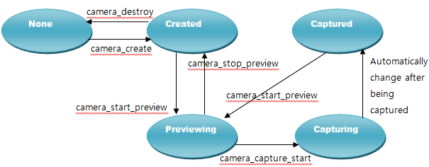

# Camera


Tizen offers basic camera features, including preview and capture. It allows you to capture still images with the device's internal camera and keep images on your target device.

**Figure: Camera image examples**


The main features of the Camera API include:

- Configuring the camera and its callbacks

  You can [configure the camera](#configuring_callback) and set the camera and auto-focus callbacks.

- Setting the display for the camera preview

  You can preview images in real time with the `StartPreview()` function. The feature provides:

  - Support for several pixel formats, such as NV12, NV12T, NV16, NV21, YUYV, UYVY, and YUV420P
  - Preview at the frame rate
  - Rotation and flip of the preview

  You can also [customize the display settings for the camera preview](#display).

- Capturing and saving images

  You can start the camera preview and [capture an image](#photo).

- Setting camera attributes

  You can [control the camera settings](#attributes):

  - Contrast
  - Exposure
  - Brightness
  - Effects
  - ISO
  - White balance
  - Zoom
  - Flash
  - Focus
  - Metering
  - EXIF tag (geo, orientation, software info and description)
  - Scene mode, HDR, theater
  - Image quality

  Depending on the camera device type, the device can support different orientations, resolutions, or preview and capture formats. You can obtain this information from the device using the `camera_foreach_supported_preview_resolution()`, `camera_foreach_supported_preview_format()`, or other `camera_foreach_supported_xxx()` functions.

  Since devices can have multiple camera sensors with different capabilities, create a `Camera` with a proper `camera_device_e` value, determining which camera sensor is used. Usually the primary sensor is located on the back side and the secondary sensor on the front side of the device. Once the camera sensor is selected, the selected sensor starts working.

  > **Note**
  >
  > Simultaneous use of multiple camera sensors is not allowed.
  >
  > The target device often supports more functionalities than the emulator.
  >
  > The behavior of the shutter sound can vary depending on the legislation of each country.

- Releasing resources

  When you have finished working with the camera, you can [release the resources](#release).

The following figure illustrates the camera state changes in the normal mode:

**Figure: Camera states in the normal mode**



## Prerequisites

To enable your application to use the camera functionality:

1. To use the functions and data types of the Camera API (in [mobile](../../api/mobile/latest/group__CAPI__MEDIA__CAMERA__MODULE.html) and [wearable](../../api/wearable/latest/group__CAPI__MEDIA__CAMERA__MODULE.html) applications), include the `<camera.h>` header file in your application:

   ```
   #include <camera.h>
   ```

2. Create a structure for storing the global data related to the camera handle. In this example, the `camdata` structure is used to store the `g_camera` variable, which is the camera handle.

   ```
   struct _camdata {
       Evas_Object *win;
       Evas_Object *rect;
       Evas *evas;
       camera_h g_camera; /* Camera handle */
   };
   typedef struct _camdata camdata;

   static camdata cam_data;
   ```

3. Create 2 auxiliary variables for controlling whether taking photos (`g_enable_shot`) and auto-focusing (`g_enable_focus`) are allowed. These variables are used in the `_camera_preview_cb()` and `_camera_focus_cb()` callbacks.

   ```
   static bool g_enable_shot = false;
   static bool g_enable_focus = true;
   ```

4. Create the camera handle using the `camera_create()` function:

   ```
   int error_code = 0;

   /* Create the camera handle */
   error_code = camera_create(CAMERA_DEVICE_CAMERA0, &cam_data.g_camera);
   if (error_code == CAMERA_ERROR_NONE)
       dlog_print(DLOG_INFO, LOG_TAG, "error code = %d", error_code);
   else
       dlog_print(DLOG_ERROR, LOG_TAG, "error code = %d", error_code);
   ```

   The `CAMERA_DEVICE_CAMERA0` parameter means that the currently activated device camera is 0, which is the primary camera. You can select between the primary (0) and secondary (1) camera. These values are defined in the `camera_device_e` enumeration (in [mobile](../../api/mobile/latest/group__CAPI__MEDIA__CAMERA__MODULE.html#gab030be4ec6b05144c3f2a732541e4104) and [wearable](../../api/wearable/latest/group__CAPI__MEDIA__CAMERA__MODULE.html#gab030be4ec6b05144c3f2a732541e4104) applications).

5. Check the current state of the camera using the `camera_get_state()` function:

   ```
   camera_state_e state;

   /* Check the camera state after creating the camera */
   error_code = camera_get_state(cam_data.g_camera, &state);
   ```

   The returned state is one of the values defined in the `camera_state_e` enumeration (in [mobile](../../api/mobile/latest/group__CAPI__MEDIA__CAMERA__MODULE.html#ga28cde1b92417f9ce43dde605ed822cde) and [wearable](../../api/wearable/latest/group__CAPI__MEDIA__CAMERA__MODULE.html#ga28cde1b92417f9ce43dde605ed822cde) applications). If the state is not `CAMERA_STATE_CREATED`, re-initialize the camera by recreating the handle.

<a name="configuring_callback"></a>
## Configuring the Camera and its Callbacks

After setting up the necessary prerequisites, configure the camera and set the camera preview and auto-focus callbacks.

To configure the camera:

1. Set the image quality using the `camera_attr_set_image_quality()` function:

   ```
   error_code = camera_attr_set_image_quality(cam_data.g_camera, 100);
   ```

   The image quality value can range from 1 (lowest quality) to 100 (highest quality).

2. Set the display for showing preview images by using the `camera_set_display()` function with 1 of the camera display types (`CAMERA_DISPLAY_TYPE_EVAS` or `CAMERA_DISPLAY_TYPE_OVERLAY`). These values are defined in the `camera_display_type_e` enumeration (in [mobile](../../api/mobile/latest/group__CAPI__MEDIA__CAMERA__MODULE.html#ga3ddd0982778fdfacd3694d643d1610ac) and [wearable](../../api/wearable/latest/group__CAPI__MEDIA__CAMERA__MODULE.html#ga3ddd0982778fdfacd3694d643d1610ac) applications).

   > **Note**
   >
   > Depending on the device, the application must set the display preferences using the `elm_config_accel_preference_set()` function.

   The following example code sets the display according to the `display_type` parameter, whose type is `camera_display_type_e`. The `create_base_gui()` function must be called before previewing and thus the camera state must be `CAMERA_STATE_CREATED`.

   ```
   int error_code = CAMERA_ERROR_NONE;
   Evas_Object *g_eo = NULL;

   static void
   create_base_gui(camdata *cam_data, camera_display_type_e display_type)
   {
       /* Window */
       elm_config_accel_preference_set("opengl");
       /* PACKAGE contains the package name's character info */
       cam_data->win = elm_win_add(NULL, PACKAGE, ELM_WIN_BASIC);

       evas_object_resize(cam_data->win, 240, 320);

       evas_object_move(cam_data->win, 0, 0);
       elm_win_autodel_set(cam_data->win, EINA_TRUE);

       cam_data->evas = evas_object_evas_get(cam_data->win);

       switch (display_type) {
       case CAMERA_DISPLAY_TYPE_EVAS:
           /* Set the Evas image object for drawing */
           g_eo = evas_object_image_add(cam_data->evas);
           evas_object_image_size_set(g_eo, 240, 320);
           evas_object_image_fill_set(g_eo, 0, 0, 240, 320);
           evas_object_resize(g_eo, 240, 320);
           evas_object_show(g_eo);
           evas_object_show(cam_data.win);
           break;
       case CAMERA_DISPLAY_TYPE_OVERLAY:
           cam_data->rect = evas_object_rectangle_add(cam_data->evas);
           evas_object_resize(cam_data->rect, 240, 320);
           evas_object_move(cam_data->rect, 0, 0);
           evas_object_color_set(cam_data->rect, 0, 0, 0, 0);
           evas_object_render_op_set(cam_data->rect, EVAS_RENDER_COPY);
           evas_object_size_hint_weight_set(cam_data->rect, EVAS_HINT_EXPAND, EVAS_HINT_EXPAND);
           /* Show the window after the base GUI is set up */
           evas_object_show(cam_data->win);
           break;
       case default:
           break;
       }
   }

   error_code = camera_set_display(cam_data.g_camera, CAMERA_DISPLAY_TYPE_OVERLAY, GET_DISPLAY(cam_data.win));
   if (error_code != CAMERA_ERROR_NONE) {
       dlog_print(DLOG_DEBUG, "camera_set_display failed [0x%x]", ret);
       camera_destroy(cam_data.g_camera);
       cam_data.g_camera = 0;

       return;
   }
   ```

3. Set the camera preview resolution using the `camera_set_preview_resolution()` function. You must call this function before previewing.

   To find out which resolutions can be set for the camera preview on a specific device, use the `camera_foreach_supported_preview_resolution()` function. The foreach function invokes a callback for each supported preview resolution, and, as all foreach functions, stops when the callback returns `false`.

   The following example code sets the camera preview resolution to the first found supported resolution:

   ```
   int resolution[2];

   static bool
   _preview_resolution_cb(int width, int height, void *user_data)
   {
       int *resolution = (int*)user_data;
       resolution[0] = width;
       resolution[1] = height;

       return false;
   }

   /* Find a resolution that is supported by the device */
   error_code = camera_foreach_supported_preview_resolution(cam_data.g_camera, _preview_resolution_cb, resolution);

   /* Set the supported resolution for camera preview */
   error_code = camera_set_preview_resolution(cam_data.g_camera, resolution[0], resolution[1]);
   ```

4. Set the capture format using the `camera_set_capture_format()` function:

   ```
   error_code = camera_set_capture_format(cam_data.g_camera, CAMERA_PIXEL_FORMAT_JPEG);
   ```

   The `camera_pixel_format_e` enumeration (in [mobile](../../api/mobile/latest/group__CAPI__MEDIA__CAMERA__MODULE.html#ga18b291f5f688ef92692b0cc273fd6ece) and [wearable](../../api/wearable/latest/group__CAPI__MEDIA__CAMERA__MODULE.html#ga18b291f5f688ef92692b0cc273fd6ece) applications) defines the available capture formats.

5. To register callbacks for handling the camera preview and auto-focus:
<a name="callbacks_preview"></a>
   - To receive notifications about newly previewed frames, register a callback using the `camera_set_preview_cb()` function. The callback is invoked once per frame during a preview.

     ```
     error_code = camera_set_preview_cb(cam_data.g_camera, _camera_preview_cb, NULL);
     ```

     The following example code implements the `_camera_preview_cb()` callback, which starts auto-focusing using the `camera_start_focusing()` function:

     ```
     static void
     _camera_preview_cb(camera_preview_data_s *frame, void *user_data)
     {
         int error_code = 0;

         if (g_enable_focus == true) {
             error_code = camera_start_focusing(cam_data.g_camera, true);

             if (error_code == CAMERA_ERROR_NOT_SUPPORTED)
                 error_code = camera_start_focusing(cam_data.g_camera, false);

             g_enable_focus = false;
         }
     }
     ```

     The `camera_start_focusing()` function takes as parameters the camera handle and a Boolean flag defining whether the camera must continuously maintain focus. The function is initially called with the continuous mode set to `true`. If the function call returns `CAMERA_ERROR_NOT_SUPPORTED`, the function is relaunched with the continuous mode set to `false`.

     The `g_enable_focus` flag is set to `true` at the application startup. When the `_camera_preview_cb()` callback is invoked for the first time, that is, for the first frame of the preview, the camera starts auto-focusing and the flag is set to `false`. Subsequent calls to the callback (for the remaining frames of the preview) do not provoke any action, since the `if` block that checks the `g_enable_focus` flag and runs the auto-focusing is skipped. This prevents the auto-focusing process from restarting after the first previewed frame.
<a name="callbacks_focus"></a>
   - To receive notifications about auto-focus state changes, register a callback using the `camera_set_focus_changed_cb()` function. The callback is invoked every time the auto-focus state changes.

     ```
     error_code = camera_set_focus_changed_cb(cam_data.g_camera, _camera_focus_cb, NULL);
     ```

     Before auto-focusing starts, the auto-focus state is `CAMERA_FOCUS_STATE_RELEASED`. After the `camera_start_focusing()` function is called, the camera starts auto-focusing and the state changes to `CAMERA_FOCUS_STATE_ONGOING`. If the auto-focusing finishes successfully, the state changes to `CAMERA_FOCUS_STATE_FOCUSED`. If the auto-focusing fails, the state changes to `CAMERA_FOCUS_STATE_FAILED`.

     The following example code implements the `_camera_focus_cb()` callback, which starts capturing focused frames using the `camera_start_capture()` function:

     ```
     static void
     _camera_focus_cb(camera_focus_state_e state, void *user_data)
     {
         int error_code;

         if (state == CAMERA_FOCUS_STATE_FOCUSED && g_enable_shot == true) {
             /* Start capturing */
             error_code = camera_start_capture(cam_data.g_camera, _camera_capturing_cb, _camera_completed_cb, NULL);

             g_enable_shot = false;
         }
     }
     ```

     If the camera is in the `CAMERA_FOCUS_STATE_FOCUSED` state and the `g_enable_shot` flag is set to `true`, the callback starts the capturing process. The `g_enable_shot` flag is set to `false` to prevent the capturing process from restarting after the first captured frame.

<a name="display"></a>
## Setting the Display for the Camera Preview

Before displaying the camera preview on the screen, check the camera display settings. You can use the default display settings provided by the Camera framework, or you can customize the display settings to meet your needs.

To customize the display settings:

- Camera selection and orientation

  Before you can correctly customize the display settings, you need to know which camera is active (front or back) and at what angle the physical camera is being held (orientation).

  - To determine the active camera, check the `camera_device_e` enumerator:

    ```
    typedef
    enum {
        CAMERA_DEVICE_CAMERA0 = 0, /* Primary camera */
        CAMERA_DEVICE_CAMERA1 /* Secondary camera */
    } camera_device_e;
    ```

    The back camera is usually the primary camera, and the front camera is usually the secondary camera. If, for example, you created the camera handle for the primary camera, the camera preview shows the back camera view.

  - To determine the current camera angle, use the `camera_attr_get_lens_orientation()` function:

    ```
    int angle = 0;
    int error_code = 0;

    error_code = camera_attr_get_lens_orientation(cam_data.g_camera, &angle);
    ```

    The returned value of the `angle` variable is in degrees.

  Once you know the active camera and its current orientation angle, or tilt, you can calculate how to rotate the display to match the camera orientation, and whether and how to flip the display to create the mirror effect if the front camera is active.

  To correctly rotate the display as the camera orientation changes, think about the orientation and direction of the physical camera lens relative to the display. If the camera faces away from the display, the camera orientation is calculated clockwise across the display. If the camera faces the same way as the display, the camera orientation is calculated counter-clockwise across the display. For example, if the camera and display face in opposite directions, the right side of the image is at 90 degrees, and if the camera and display face in the same direction, the right side is at 270 degrees (360 - 90).

- Display rotation

  The display rotation setting is preset to a default value for each camera.

  Before changing the display rotation value, retrieve the default value using the `camera_get_display_rotation()` function:

  ```
  camera_rotation_e rotation = 0;
  int error_code = 0;

  /* Get the default display rotation value */
  error_code = camera_get_display_rotation(cam_data.g_camera, &rotation);
  ```

  Calculate and set a new display rotation value based on the current camera orientation:

  ```
  int lens_orientation = 0;
  int error_code = 0;
  camera_rotation_e display_rotation = CAMERA_ROTATION_NONE;
  int display_rotation_angle = 0;

  /* Get the recommended display rotation value */
  error_code = camera_attr_get_lens_orientation(cam_data.g_camera, &lens_orientation);
  display_rotation_angle = (360 - lens_orientation) % 360;

  /* Convert the display rotation value to an enum type */
  switch (display_rotation_angle) {
  case 0:
      display_rotation = CAMERA_ROTATION_NONE;
      break;
  case 90:
      display_rotation = CAMERA_ROTATION_90;
      break;
  case 180:
      display_rotation = CAMERA_ROTATION_180;
      break;
  case 270:
      display_rotation = CAMERA_ROTATION_270;
      break;
  default:
      display_rotation = CAMERA_ROTATION_NONE;
      break;
  }

  /* Set the display rotation */
  error_code = camera_set_display_rotation(cam_data.g_camera, display_rotation);
  ```

- Display flip

  The display flip setting is preset to a default value for each camera. For example, to support the mirror mode, the secondary (front) camera is set as flipped by default.

  Before changing the display flip value, retrieve the default value using the `camera_get_display_flip()` function:

  ```
  camera_flip_e flip = 0;
  int error_code = 0;

  /* Get the default display flip value */
  error_code = camera_get_display_flip(cam_data.g_camera, &flip);
  ```

  Calculate and set a new display flip value based on the direction the camera is facing and the current camera orientation:

  ```
  /*
     If the camera is facing in the same direction as the display,
     apply flip to the front camera because of the mirror effect
  */

  int lens_orientation = 0;
  int error_code = 0;
  camera_flip_e camera_default_flip = MM_FLIP_NONE;

  /* Get the recommended display rotation value */
  error_code = camera_attr_get_lens_orientation(cam_data.g_camera, &lens_orientation);
  display_rotation_angle = (360 - lens_orientation) % 360;

  /* Set the mirror display */
  if (display_rotation_angle == 90 || display_rotation_angle == 270)
      camera_default_flip = MM_FLIP_VERTICAL;
  else
      camera_default_flip = MM_FLIP_HORIZONTAL;

  /* Set the display flip */
  error_code = camera_set_display_flip(cam_data.g_camera, camera_default_flip);
  ```

  The system applies display flip after display rotation, so you must always calculate the correct display flip value after determining the display rotation.

  > **Note**
  >
  > For an overlay surface, when the device orientation changes, the displayed camera preview does not rotate automatically. If you want to rotate the display according to the device orientation, use the `camera_set_display_rotation()` function within the `app_device_orientation_cb()` callback used by the application.
  >
  > For an Evas surface, the Evas object for the camera display is rotated by the window manager used by the application, not by the `camera_set_display_rotation()` function.

<a name="photo"></a>
## Taking a Photo

To take a photo:

1. [After configuring the camera](#configuring_callback), start the camera preview using the `camera_start_preview()` function:

   ```
   error_code = camera_start_preview(cam_data.g_camera);
   ```

   The camera preview draws preview frames on the screen and allows you to capture frames as still images.

   After starting the camera preview, the application flows as follows:

   1. To handle the camera preview, the application calls the [camera preview callback](#callbacks_preview).
   2. The camera preview callback calls the `camera_start_focusing()` function, which starts the auto-focusing process.
   3. To handle the auto-focusing process, the application calls the [camera auto-focus callback](#callbacks_focus).
   4. The camera auto-focus callback calls the `camera_start_capture()` function, which starts the capturing process.
   5. To handle the capturing process, the application calls the `camera_capturing_cb()` callback.

2. To capture an image:

   1. Implement the `camera_capturing_cb()` callback.

      This callback is invoked once for each captured frame, and is used to get information about the captured image. The image is [saved in the format](#configuring_callback) set by the `camera_set_capture_format()` function.

      The following example code implements the `_camera_capturing_cb()` callback, which saves the captured frame as a JPEG image:

      ```
      static void
      _camera_capturing_cb(camera_image_data_s* image, camera_image_data_s* postview, camera_image_data_s* thumbnail, void *user_data)
      {
          dlog_print(DLOG_DEBUG, LOG_TAG, "Writing image to file");
          FILE *file = fopen(g_fname, "w+");

          if (image->data != NULL)
              fwrite(image->data, 1, image->size, file);
          fclose(file);
      }
      ```

   2. To receive a notification when the image has been captured, implement the `camera_capture_completed_cb()` callback.

      This callback is invoked after the `camera_capturing_cb()` callback completes, and is used for notification and for restarting the camera preview.

      The following example code implements the `_camera_completed_cb()` callback, which waits 0.025 seconds before restarting the camera preview with auto-focusing:

      ```
      static void
      _camera_completed_cb(void *user_data)
      {
          int error_code = 0;

          usleep(25000); /* Display the captured image for 0.025 seconds */

          /* Restart the camera preview */
          error_code = camera_start_preview(cam_data.g_camera);

          g_enable_focus = true;
      }
      ```

      By waiting 0.025 seconds before restarting the camera preview, the callback keeps the captured image on the screen for 0.025 seconds.

<a name="attributes"></a>
## Setting Camera Attributes

You can set various camera attributes with the Attributes API (in [mobile](../../api/mobile/latest/group__CAPI__MEDIA__CAMERA__ATTRIBUTES__MODULE.html) and [wearable](../../api/wearable/latest/group__CAPI__MEDIA__CAMERA__ATTRIBUTES__MODULE.html) applications).

To set some attributes:

- Camera preview attributes:

  The camera preview attributes are a group of attributes that you can set before starting the preview. The following example code sets the FPS and image quality attributes:

  ```
  error_code = camera_attr_set_preview_fps(cam_data.g_camera, CAMERA_ATTR_FPS_AUTO);

  error_code = camera_attr_set_image_quality(cam_data.g_camera, 100);
  ```

- Camera zoom attribute:

  Set the zoom level using the `camera_attr_set_zoom()` function. Retrieve the range of available zoom level values using the `camera_attr_get_zoom_range()` function. The following example code retrieves the available zoom level range and sets the zoom level to minimum:

  ```
  int min;
  int max;

  error_code = camera_attr_get_zoom_range(cam_data.g_camera, &min, &max);

  error_code = camera_attr_set_zoom(cam_data.g_camera, min);
  ```

- Camera brightness attribute:

  Retrieve the range of available brightness level values using the `camera_attr_get_brightness_range()` function, and the current brightness level using the `camera_attr_get_brightness()` function:

  ```
  int min;
  int max;
  static int g_bright_level;

  error_code = camera_attr_get_brightness_range(cam_data.g_camera, &min, &max);

  error_code = camera_attr_get_brightness(cam_data.g_camera, &g_bright_level);
  ```

  Set a new brightness level using the `camera_attr_set_brightness()` function:

  ```
  if (g_bright_level >= LEVEL_UPPER_BOUND) {
      dlog_print(DLOG_DEBUG, LOG_TAG, "Brightness is set to maximum level");
      g_bright_level = LEVEL_UPPER_BOUND - 1;
  } else if (g_bright_level <= LEVEL_LOWER_BOUND) {
      dlog_print(DLOG_DEBUG, LOG_TAG, "Brightness is set to minimum level");
      g_bright_level = LEVEL_LOWER_BOUND + 1;
  } else {
      g_bright_level++;
  }

  /* Set the brightness level */
  error_code = camera_attr_set_brightness(cam_data.g_camera, g_bright_level);
  ```

<a name="release"></a>
## Releasing Resources

After you have finished working with the camera, stop the camera and clean up the application environment:

1. If auto-focus is switched on, switch if off using the `camera_cancel_focusing()` function:

   ```
   error_code = camera_cancel_focusing(cam_data.g_camera);
   ```

2. Stop the camera preview using the `camera_stop_preview()` function:

   ```
   error_code = camera_stop_preview(cam_data.g_camera);
   ```

3. Deregister the camera preview and auto-focus callbacks using the `camera_unset_preview_cb()` and `camera_unset_focus_changed_cb()` functions:

   ```
   /* Deregister the camera preview callback */
   error_code = camera_unset_preview_cb(cam_data.g_camera);

   /* Deregister the auto-focus callback */
   error_code = camera_unset_focus_changed_cb(cam_data.g_camera);
   ```

4. Destroy the camera handle and release all its resources using the `camera_destroy()` function:

   ```
   error_code = camera_destroy(cam_data.g_camera);
   ```

## Related Information
- Dependencies
  - Tizen 2.4 and Higher for Mobile
  - Tizen 2.3.1 and Higher for Wearable
