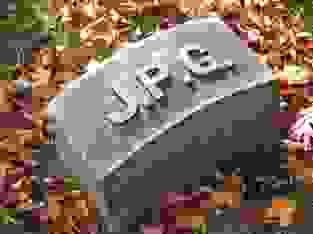

# Image Editing


Tizen offers various image processing features.

The main features of the Image Util API include:

- Conversion

  You can [change the color space format](#colorspace) among the [supported formats](#color_format).

- Resizing

  You can [change the image resolution](#resize).

- Rotation

  You can [change the image angle](#rotate) around the X or Y axis.

- Crop

  You can [remove the outer parts of an image](#crop) or change the aspect ratio.

- Decoding from a file or memory and encoding to a file or memory

  You can [decode images](#decode) and [encode them](#encode) with the following formats:

  - Bitmap formats:

    - YUV420, YUV422, RGB888, RGBA8888, BGRA8888, ARGB8888

  - Input image formats for decoding:

    - JPEG, PNG, GIF, BMP

    > **Note**
    >
    > Animated GIF format is not supported for decoding.

  - Output image formats for encoding:

    - JPEG, PNG, GIF, BMP, [animated GIF](#animation)

    Pay attention to how the [image quality depends on the size](#quality) and compression ratio.

## Prerequisites

To enable your application to use the image util functionality:

1. To use the functions and data types of the Image Util API (in [mobile](../../api/mobile/latest/group__CAPI__MEDIA__IMAGE__UTIL__MODULE.html) and [wearable](../../api/wearable/latest/group__CAPI__MEDIA__IMAGE__UTIL__MODULE.html) applications), include the `<image_util.h>` header file in your application:

   ```
   #include <image_util.h>
   ```

   To ensure that an Image Util function has been executed properly, make sure that the return value is equal to `IMAGE_UTIL_ERROR_NONE`.

2. Declare the required variables:

   ```
   #define SAMPLE_FILENAME "sample_image.jpg"
   #define OUTPUT_ROTATED_JPEG "rotated_image.jpg"

   const image_util_colorspace_e colorspace = IMAGE_UTIL_COLORSPACE_RGB888;
   unsigned char *img_rotate_target = NULL;
   unsigned char *img_source = NULL;
   int ret = 0;
   int width = 0;
   int height = 0;
   unsigned int size_decode = 0;
   image_util_decode_h decode_h = NULL;
   ```

3. To find out which color spaces are supported on the device, use the `image_util_foreach_supported_colorspace()` function:

   ```
   int image_util_foreach_supported_colorspace(image_util_type_e image_type,
                                               image_util_supported_colorspace_cb callback, void *user_data);
   ```

   The possible color spaces are defined in the `image_util_colorspace_e` enumeration (in [mobile](../../api/mobile/latest/group__CAPI__MEDIA__IMAGE__UTIL__MODULE.html#gad3ea89a72a617912df9ddbd50be1b991) and [wearable](../../api/wearable/latest/group__CAPI__MEDIA__IMAGE__UTIL__MODULE.html#gad3ea89a72a617912df9ddbd50be1b991) applications).

   For more information on the YUV color space, see [http://www.fourcc.org/yuv.php](http://www.fourcc.org/yuv.php).

4. To support the `image_util_transform_run()` function, which is used for all image transformations, set the source image and create a handle for it (to be used as the second parameter):

   ```
   ret = image_util_decode_create(&decode_h);
   ret = image_util_decode_set_input_path(decode_h, SAMPLE_FILENAME);
   ret = image_util_decode_set_colorspace(decode_h, colorspace);
   ret = image_util_decode_set_output_buffer(decode_h, &img_source);

   ret = image_util_decode_run(decode_h, &width, &height, &size_decode);
   ret = image_util_decode_destroy(decode_h);

   ret = media_format_create(&fmt);
   ret = media_format_set_video_mime(fmt, colorspace);
   ret = media_format_set_video_width(fmt, width);
   ret = media_format_set_video_height(fmt, height);

   ret = media_packet_create_alloc(fmt, NULL, NULL, &src);
   ret = media_packet_get_buffer_size(src, &size);

   src = malloc(size);
   ret = media_packet_get_buffer_data_ptr(src, &src_ptr);
   ret = memcpy(src_ptr, img_source, size);
   ```

<a name="colorspace"></a>
## Converting the Color Space

To convert an image from one color space to another:

1. Create a transformation handle using the `image_util_transform_create()` function:

   ```
   transformation_h handle;
   ret = image_util_transform_create(&handle);
   ```

2. Optionally, enable hardware acceleration using the `image_util_transform_set_hardware_acceleration()` function:

   ```
   ret = image_util_transform_set_hardware_acceleration(handle, true);
   ```

3. Set the target color space using the `image_util_transform_set_colorspace()` function:

   ```
   ret = image_util_transform_set_colorspace(handle, colorspace);
   ```

4. Execute the transformation using the `image_util_transform_run()` function:

   ```
   ret = image_util_transform_run(handle, src,
                                  (image_util_transform_completed_cb)completed_callback,
                                  user_data);
   ```

   > **Note**
   >
   > - Here, the `image_util_transform_run()` function only converts the color space. The function does not change the image width or height, or any other image property.
   > - Because of the restrictions of the image processing library, not all color space combinations are supported for conversion. For example, the NV12 format is commonly used in hardware chips, but it is not supported by the library.
   > - If hardware acceleration is enabled, you can execute 2 more image transformations using the same transformation handle.

5. Handle the transformation results in the `image_util_transform_completed_cb()` callback, which is invoked after the transformation is complete.

6. After the transformation is complete, destroy the transformation handle using the `image_util_transform_destroy()` function:

   ```
   ret = image_util_transform_destroy(handle);
   ```

<a name="resize"></a>
## Resizing an Image

To resize an image:

1. Create a transformation handle using the `image_util_transform_create()` function:

   ```
   transformation_h handle;
   ret = image_util_transform_create(&handle);
   ```

2. Optionally, enable hardware acceleration using the `image_util_transform_set_hardware_acceleration()` function:

   ```
   ret = image_util_transform_set_hardware_acceleration(handle, true);
   ```

3. Set the target resolution using the `image_util_transform_set_resolution()` function:

   ```
   ret = image_util_transform_set_resolution(handle, width, height);
   ```

4. Execute the transformation using the `image_util_transform_run()` function:

   ```
   ret = image_util_transform_run(handle, src,
                                  (image_util_transform_completed_cb)completed_callback,
                                  user_data);
   ```

   > **Note**
   >
   > - The image format has no effect on the transformation.
   > - If the color space is YUV, the target image width and height must be multiples of 8. This restriction does not apply to RGB images.
   > - If hardware acceleration is enabled, you can execute 2 more image transformations using the same transformation handle.

5. Handle the transformation results in the `image_util_transform_completed_cb()` callback, which is invoked after the transformation is complete.

6. After the transformation is complete, destroy the transformation handle using the `image_util_transform_destroy()` function:

   ```
   ret = image_util_transform_destroy(handle);
   ```

<a name="rotate"></a>
## Rotating an Image

To rotate an image:

1. Create a transformation handle using the `image_util_transform_create()` function:

   ```
   transformation_h handle;
   ret = image_util_transform_create(&handle);
   ```

2. Optionally, enable hardware acceleration using the `image_util_transform_set_hardware_acceleration()` function:

   ```
   ret = image_util_transform_set_hardware_acceleration(handle, true);
   ```

3. Set the amount of rotation using the `image_util_transform_set_rotation()` function:

   ```
   ret = image_util_transform_set_rotation(handle, rotation);
   ```

   The possible values for the `rotation` parameter are defined in the `image_util_rotation_e` enumeration (in [mobile](../../api/mobile/latest/group__CAPI__MEDIA__IMAGE__UTIL__TRANSFORM__MODULE.html#gad0682da8519f229944c9c5617b7a1107) and [wearable](../../api/wearable/latest/group__CAPI__MEDIA__IMAGE__UTIL__TRANSFORM__MODULE.html#gad0682da8519f229944c9c5617b7a1107) applications).

4. Execute the transformation using the `image_util_transform_run()` function:

   ```
   ret = image_util_transform_run(handle, src,
                                  (image_util_transform_completed_cb)completed_callback,
                                  user_data);
   ```

   > **Note**
   >
   > - The image format has no effect on the transformation.
   > - If the color space is YUV, the target image width and height must be multiples of 8. This restriction does not apply to RGB images.If hardware acceleration is enabled, you can execute 2 more image transformations using the same transformation handle.

5. Handle the transformation results in the `image_util_transform_completed_cb()` callback, which is invoked after the transformation is complete.

6. After the transformation is complete, destroy the transformation handle using the `image_util_transform_destroy()` function:

   ```
   ret = image_util_transform_destroy(handle);
   ```
<a name="crop"></a>
## Cropping an Image

To crop an image:

1. Create a transformation handle using the `image_util_transform_create()` function:

   ```
   transformation_h handle;
   ret = image_util_transform_create(&handle);
   ```

2. Optionally, enable hardware acceleration using the `image_util_transform_set_hardware_acceleration()` function:

   ```
   ret = image_util_transform_set_hardware_acceleration(handle, true);
   ```

3. Set the crop area using the `image_util_transform_set_crop_area()` function:

   ```
   ret = image_util_transform_set_crop_area(handle, start_x, start_y, end_x, end_y);
   ```

4. Execute the transformation using the `image_util_transform_run()` function:

   ```
   ret = image_util_transform_run(handle, src,
                                  (image_util_transform_completed_cb)completed_callback,
                                  user_data);
   ```

   > **Note**
   >
   > - Because of a YUV restriction, and because the crop start position can be set arbitrarily, the cropped image width and height must be even.
   > - If hardware acceleration is enabled, you can execute 2 more image transformations using the same transformation handle.

5. Handle the transformation results in the `image_util_transform_completed_cb()` callback, which is invoked after the transformation is complete.

6. After the transformation is complete, destroy the transformation handle using the `image_util_transform_destroy()` function:

   ```
   ret = image_util_transform_destroy(handle);
   ```
<a name="decode"></a>
## Decoding from a File or Memory

To decode a JPEG, PNG, GIF, or BMP image:

1. Create a decoding handle using the `image_util_decode_create()` function:

   ```
   image_util_decode_h decode_h = NULL;
   ret = image_util_decode_create(&decode_h);
   ```

2. Set the image to the input path or buffer using the `image_util_decode_set_input_path()` or `image_util_decode_set_input_buffer()` function:

   ```
   ret = image_util_decode_set_input_path(decode_h, path);
   ```

3. To save the decoded image, set the output buffer using the `image_util_decode_set_output_buffer()` function:

   ```
   unsigned char *result = NULL;
   ret = image_util_decode_set_output_buffer(decode_h, &result);
   ```

4. Optionally, set the color space and JPEG downscale using the `image_util_decode_set_colorspace()` and `image_util_decode_set_jpeg_downscale()` functions:

   ```
   unsigned char *result = NULL;
   ret = image_util_decode_set_colorspace(decode_h, IMAGE_UTIL_COLORSPACE_RGBA8888);
   ret = image_util_decode_set_jpeg_downscale(decode_h, IMAGE_UTIL_DOWNSCALE_1_1);
   ```

   > **Note**
   >
   > - Because of decoder limitations, color space setting and JPEG downscaling are only supported for JPEG images.
   > - The default color space is `IMAGE_UTIL_COLORSPACE_RGBA8888`. PNG, GIF and BMP images are decoded to `IMAGE_UTIL_COLORSPACE_RGBA8888`.

5. Execute the decoding using the `image_util_decode_run()` function:

   ```
   unsigned long width = 0; /* Decoded image width */
   unsigned long height = 0; /* Decoded image height */
   unsigned long long size = 0; /* Decoded image size */
   ret = image_util_decode_run(decode_h, &width, &height, &size);
   ```

6. After the decoding is complete, destroy the decoding handle using the `image_util_decode_destroy()` function:

   ```
   ret = image_util_decode_destroy(decode_h);
   ```
<a name="encode"></a>
## Encoding to a File or Memory

To encode a raw image:

1. Create an encoding handle using the `image_util_encode_create()` function:

   ```
   image_util_type_e encoder_type = IMAGE_UTIL_JPEG;
   image_util_encode_h encode_h = NULL;
   ret = image_util_encode_create(encoder_type, &encode_h);
   ```

2. Set the image to the input buffer using the `image_util_encode_set_input_buffer()` function:

   ```
   ret = image_util_encode_set_input_buffer(encode_h, buffer);
   ```

3. Set the width, height, and color space of the input buffer using the `image_util_encode_set_resolution()` and `image_util_encode_set_colorspace()` functions:

   ```
   ret = image_util_encode_set_resolution(encode_h, width, height);
   ret = image_util_encode_set_colorspace(encode_h, IMAGE_UTIL_COLORSPACE_RGBA8888);
   ```

   > **Note**
   >
   > - Because of encoder limitations, color space setting is only supported for encoding JPEG images.
   > - The default color space is `IMAGE_UTIL_COLORSPACE_RGBA8888`. PNG, GIF and BMP images are encoded with `IMAGE_UTIL_COLORSPACE_RGBA8888`.

4. To save the encoded image, set the output path or buffer using the `image_util_encode_set_output_path()` or `image_util_encode_set_output_buffer()` function:

   ```
   ret = image_util_encode_set_output_path(encode_h, path);
   ```

5. Optionally, set the JPEG quality or PNG compression using the `image_util_encode_set_quality()` or `image_util_encode_set_png_compression()` function:

   ```
   ret = image_util_encode_set_jpeg_downscale(decode_h, IMAGE_UTIL_DOWNSCALE_1_1);
   ```

   > **Note**
   >
   > - Because of encoder limitations, quality setting is only supported for JPEG images, and compression is only supported for PNG images.
   > - The default JPEG quality is 75. The default PNG compression is `IMAGE_UTIL_PNG_COMPRESSION_6`.

6. Execute the encoding using the `image_util_encode_run()` function:

   ```
   unsigned long long size = 0; /* Encoded image size */
   ret = image_util_encode_run(encode_h, &size);
   ```

7. After the encoding is complete, destroy the encoding handle using the `image_util_encode_destroy()` function:

   ```
   ret = image_util_encode_destroy(encode_h);
   ```
<a name="animation"></a>
## Encoding an Animated GIF

To encode an animated GIF image:

1. Create an encoding handle using the `image_util_encode_create()` function:

   ```
   image_util_type_e encoder_type = IMAGE_UTIL_GIF;
   image_util_encode_h encode_h = NULL;
   ret = image_util_encode_create(encoder_type, encode_h);
   ```

2. For each frame:

   1. Set the image to the input buffer using the `image_util_encode_set_input_buffer()` function:

      ```
      ret = image_util_encode_set_input_buffer(encode_h, buffer);
      ```

   2. Set the width and height of the input buffer using the `image_util_encode_set_resolution()` function:

      ```
      ret = image_util_encode_set_resolution(encode_h, width, height);
      ```

   3. Set the delay time between GIF frames using the `image_util_encode_set_gif_frame_delay_time()` function:

      ```
      ret = image_util_encode_set_gif_frame_delay_time(encode_h, buffer);
      ```

3. To save the encoded image, set the output path or buffer using the `image_util_encode_set_output_path()` or `image_util_encode_set_output_buffer()` function:

   ```
   ret = image_util_encode_set_output_path(encode_h, path);
   ```

4. Execute the encoding using the `image_util_encode_run()` function:

   ```
   unsigned long long size = 0; /* Animated GIF image size */
   ret = image_util_encode_run(encode_h, &size);
   ```

5. After the encoding is complete, destroy the encoding handle using the `image_util_encode_destroy()` function:

   ```
   ret = image_util_encode_destroy(encode_h);
   ```

<a name="color_format"></a>
## Supported Color Space Formats

The following tables define the supported color space formats.

**Table: RGB pixel formats**

| Label                                    | FOURCC in hex | Bits per pixel      | Description                              |
|------------------------------------------|---------------|---------------------|------------------------------------------|
| [RGB](http://www.fourcc.org/rgb.php#BI_RGB) | 0x32424752    | 1, 4, 8, 16, 24, 32 | Alias for BI_RGB                         |
| [RGBA](http://www.fourcc.org/rgb.php#RGBA) | 0x41424752    | 16, 32              | Raw RGB with alpha. Sample precision and packing is arbitrary and determined using bit masks for each component, as for BI_BITFIELDS. |

**Table: Packed YUV formats**

| Label                                    | FOURCC in hex | Bits per pixel | Description                              |
|------------------------------------------|---------------|----------------|------------------------------------------|
| [UYVY](http://www.fourcc.org/yuv.php#UYVY) | 0x59565955    | 16             | YUV 4:2:2 (Y sample at every pixel, U and V sampled at every second pixel horizontally on each line). A macropixel contains 2 pixels in 1 u_int32. |
| [YUYV](http://www.fourcc.org/yuv.php#YUYV) | 0x56595559    | 16             | Duplicate of YUY2.                       |

**Table: Planar YUV formats**

| Label                                    | FOURCC in hex | Bits per pixel | Description                              |
|------------------------------------------|---------------|----------------|------------------------------------------|
| [YV16](http://www.fourcc.org/rgb.php#BI_RGB) | 0x36315659    | 16             | 8-bit Y plane followed by 8-bit 2x1 subsampled V and U planes. |
| [YV12](http://www.fourcc.org/rgb.php#RGBA) | 0x32315659    | 12             | 8-bit Y plane followed by 8-bit 2x2 subsampled V and U planes. |
| [I420](http://www.fourcc.org/rgb.php#RGBA) | 0x30323449    | 12             | 8-bit Y plane followed by 8-bit 2x2 subsampled U and V planes. |
| [NV12](http://www.fourcc.org/rgb.php#RGBA) | 0x3231564E    | 12             | 8-bit Y plane followed by an interleaved U/V plane with 2x2 subsampling. |
| [NV21](http://www.fourcc.org/rgb.php#RGBA) | 0x3132564E    | 12             | As NV12 with U and V reversed in the interleaved plane. |

<a name="quality"></a>
## Quality and Size Comparison

The following table shows the effect on the image quality and file sizes when using different compression ratios.

**Table: Quality and size comparison**

| Image                                    | Quality                   | Size (bytes) | Compression ratio | Description                              |
|------------------------------------------|---------------------------|--------------|-------------------|------------------------------------------|
|  | Highest quality (Q = 100) | 83,261       | 2.6:1             | Extremely minor artifacts                |
|  | High quality (Q = 50)     | 15,138       | 15:1              | Initial signs of subimage artifacts      |
|  | Medium quality (Q = 25)   | 9,553        | 23:1              | Stronger artifacts; loss of high-frequency information |
|  | Low quality (Q = 10)      | 4,787        | 46:1              | Severe high frequency loss; artifacts on subimage boundaries ("macroblocking") are obvious |
|  | Lowest quality            | -             | -                  |  -                                        |

## Related Information
- Dependencies
  - Tizen 2.4 and Higher for Mobile
  - Tizen 2.3.1 and Higher for Wearable
