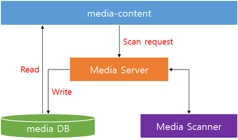

# Media Content


You can get information about media content from the metadata in the content, such as an ID3 or MP4 tag. You can obtain or update data from the media database, which stores metadata for the media files (such as images, videos, and audio) on the device.

**Figure: Media content of the device**



The media files are updated using an application (by calling the Content API) or a media scanner. When updating the files in the media scanner, the following limitations apply:

- SD card insertion and removal: Media files are updated only in the SD card.
- Rebooting the device: Media files are updated in the internal memory and SD card on the device.

You can only use the Media Content API to manage files located in specific paths. You can get the paths by using the `storage_get_directory()` function. For more information, see the Storage API (in [mobile](../../api/mobile/latest/group__CAPI__SYSTEM__STORAGE__MODULE.html) and [wearable](../../api/wearable/latest/group__CAPI__SYSTEM__STORAGE__MODULE.html) applications).

> **Note**
>
> To obtain information from the media database, you must first [connect to it](#prerequisites). When the connection is no longer needed, remember to disconnect from the media database.

The main media content features include:

- Media content

  You can update database details due to file (or folder) creation or deletion. If a received file (or folder) does not exist in the file system, it is removed from the database.

  You can also [retrieve a list of media folders](#folder_list), [retrieve a list of media items](#item_list), and [monitor changes](#update) in the media database. You can [search for specific media folders](#find) and [read their information](#read_folder), and [retrieve media folder content](#folder_content).

- Media information

  You can update the media database due to file creation, deletion, or update on the device. You can [retrieve media information](#info), and add [media files](#insert) and [media folders](#scan) to the database.

  You can also retrieve [general information about the media and more specific information about the media type](#media_info).

- Media bookmarks

  You can [insert](#inserting), [search for](#finding), [read](#reading), and [remove](#removing) bookmarks for video and audio files.

- Filter

  You can [create a filter](#filter) to find specific media items.

- Media playlists

  You can [add](#create_playlist) or [delete](#delete_playlist) a playlist of video and audio files, and add media files to a created playlist. In addition, you can also [search for playlists](#find_playlist) and [read playlist information](#read_playlist).

- Media tags

  You can access the tag information for the media files in the database. You can, for example, [add media tags](#tag_add), [retrieve tag information](#tag_list), and [delete tags](#tag_delete).

- Media albums

  You can manage an album of audio files. You can, for example, [search for albums](#findingall), [retrieve album content](#findinginfo), and [read album information](#read_album).

- Media item groups

  You can manage a collection of media items as a group, when the items have the same value of a given property. You can, for example, [search for groups](#find_groups) and [read group information](#read_group).

- Media storages

  You can [retrieve information about the media storages](#storage_list).

<a name="prerequisites"></a>
## Prerequisites

To enable your application to use the media content functionality:

1. To use the Media Content API (in [mobile](../../api/mobile/latest/group__CAPI__MEDIA__CONTENT__MODULE.html) and [wearable](../../api/wearable/latest/group__CAPI__MEDIA__CONTENT__MODULE.html) applications), the application has to request permission by adding the following privileges to the `tizen-manifest.xml` file:

   ```
   <privileges>
      <!--To insert content-->
      <privilege>http://tizen.org/privilege/content.write</privilege>
      <!--To access a storage to insert content-->
      <privilege>http://tizen.org/privilege/mediastorage</privilege>
   </privileges>
   ```

2. Media Content functions use a SQLite database to save the metadata of the media files on the user device, along with the tags and bookmarks that the user sets. To use the functions and data types of the Media Content API, include the `<media_content.h>` header file in your application:

   ```
   #include <media_content.h>
   #include <glib.h>
   ```

   The example application used in the use cases also requires the `<glib.h>` header file.

3. Connect to the database:

   ```
   int ret = MEDIA_CONTENT_ERROR_NONE;

   ret = media_content_connect();
   if (ret == MEDIA_CONTENT_ERROR_NONE)
       dlog_print(DLOG_DEBUG, LOG_TAG, "connection is success");
   else
       dlog_print(DLOG_ERROR, LOG_TAG, "connection failed");

   return ret;
   ```

4. When you no longer use the database, disconnect from it:

   ```
   media_content_disconnect();
   ```

<a name="folder_list"></a>
## Getting the Folder List

To retrieve a list of folders where the media files are stored:

1. Define a callback function for the `media_folder_foreach_folder_from_db()` function, called for each available media folder. Use the callback to create a list of folders.

    ```
    bool
    gallery_folder_list_cb(media_folder_h folder, void *user_data)
    {
        media_folder_h new_folder = NULL;
        media_folder_clone(&new_folder, folder);

        GList **list = (GList**)user_data; /* Include glib.h for this value */

        *list = g_list_append(*list, new_folder);

        return true;
    }
    ```

2. To find the folders, call the `media_folder_foreach_folder_from_db()` function with the defined callback. After the callback has created the folder list, you can access the folder details with various `media_folder_get_XXX()` functions.

    ```
    int i;
    int count;
    filter_h filter = NULL;
    GList *folder_list = NULL; /* Include glib.h for this value */
    media_folder_h folder_handle = NULL;

    ret = media_folder_foreach_folder_from_db(filter, gallery_folder_list_cb, &folder_list);
    if (ret != MEDIA_CONTENT_ERROR_NONE) {
        dlog_print(DLOG_ERROR, LOG_TAG, "media_folder_foreach_folder_from_db failed: %d", ret);

        return ret;
    } else {
        dlog_print(DLOG_DEBUG, LOG_TAG, "media_folder_foreach_folder_from_db success!!");

        char *folder_id = NULL;
        char *folder_name = NULL;
        char *folder_path = NULL;

        for (i = 0; i < g_list_length(folder_list); i++) {
            folder_handle = (media_folder_h)g_list_nth_data(folder_list, i);

            ret = media_folder_get_folder_id(folder_handle, &folder_id);
            ret = media_folder_get_name(folder_handle, &folder_name);
            ret = media_folder_get_path(folder_handle, &folder_path);

            ret = media_folder_get_media_count_from_db(folder_id, filter, &count);

            /* Release allocated strings */
            free(folder_id);
            free(folder_name);
            free(folder_path);
            if (ret != MEDIA_CONTENT_ERROR_NONE) {
                dlog_print(DLOG_ERROR, LOG_TAG, "media_folder_get_media_count_from_db failed: %d", ret);

                return ret;
            } else {
                dlog_print(DLOG_DEBUG, LOG_TAG, "media count [%d]: %d", i, count);
            }
        }
    }
    ```

3. When no longer needed, destroy the folder list handle:

   ```
   /* Remove the folder list */
   if (folder_list) {
       for (i = 0; i < g_list_length(folder_list); i++) {
           folder_handle = (media_folder_h)g_list_nth_data(folder_list, i);
           media_folder_destroy(folder_handle);
       }

       g_list_free(folder_list);
   }
   ```

<a name="item_list"></a>
## Getting the Item List

To retrieve a list of media items:

1. Define a callback function for the `media_info_foreach_media_from_db()` function, called for each available media item. Use the callback to create a list of media items.

    ```
    bool
    gallery_media_item_cb(media_info_h media, void *user_data)
    {
        media_info_h new_media = NULL;
        media_info_clone(&new_media, media);

        GList **list = (GList**)user_data; /* Include glib.h for this value */
        *list = g_list_append(*list, new_media);

        return true;
    }
    ```

2. To find the items satisfying certain criteria, or modify the results in a specific way, create a filter and set its properties. For a detailed list of condition fields (such as `MEDIA_TYPE`) and their values (such as `MEDIA_CONTENT_TYPE_IMAGE` and `MEDIA_CONTENT_TYPE_VIDEO`), see the `media_content_type.h` header file.

   The following example filters media items so that only image and video files are included in the result. The filter is case-insensitive, and the results are sorted in descending order by item display name. For more information on the filter properties, see [Setting up a Filter](#filter).

    ```
    #define BUFLEN 200

    /* Get the item list */
    media_info_h media_handle = NULL;
    GList *all_item_list = NULL;

    media_content_collation_e collate_type = MEDIA_CONTENT_COLLATE_NOCASE;
    media_content_order_e order_type = MEDIA_CONTENT_ORDER_DESC;
    ret = media_filter_create(&filter);

    snprintf(buf, BUFLEN, "%s = %d OR %s = %d", MEDIA_TYPE, MEDIA_CONTENT_TYPE_IMAGE,
             MEDIA_TYPE, MEDIA_CONTENT_TYPE_VIDEO);
    ret = media_filter_set_condition(filter, buf, collate_type);
    if (ret != MEDIA_CONTENT_ERROR_NONE) {
        media_filter_destroy(filter);
        dlog_print(DLOG_ERROR, LOG_TAG, "Failed to set condition");

        return ret;
    }

    ret = media_filter_set_order(filter, order_type, MEDIA_DISPLAY_NAME, collate_type);
    if (ret != MEDIA_CONTENT_ERROR_NONE) {
        media_filter_destroy(filter);
        dlog_print(DLOG_ERROR, LOG_TAG, "Failed to set order");

        return ret;
    }
    ```

3. To find the media items, use the `media_info_foreach_media_from_db()` function with the defined callback. The function is synchronous, and it blocks until the callback has been called for all items or the callback returns `false`.

   To find only a subset of the items, use a filter. If you want to find all items, set the filter parameter to `NULL`.

    ```
    ret = media_info_foreach_media_from_db(filter, gallery_media_item_cb, &all_item_list);
    ```
4. When no longer needed, destroy the item list and the filter handle:

   ```
   /* Remove all items list */
   if (all_item_list) {
       for (i = 0; i < g_list_length(all_item_list); i++) {
           media_handle = (media_info_h)g_list_nth_data(all_item_list, i);
           ret = media_info_destroy(media_handle);
       }

       g_list_free(all_item_list);
   }

   /* Destroy the filter handle */
   media_filter_destroy(filter);
   ```
<a name="update"></a>
## Receiving Update Notifications

To get notifications of database changes, register a callback. You can only set 1 notification callback at this stage of the process:

1. Define the database update callback function:

   ```
   void
   _noti_cb(media_content_error_e error, int pid,
            media_content_db_update_item_type_e update_item,
            media_content_db_update_type_e update_type,
            media_content_type_e media_type,
            char *uuid, char *path, char *mime_type, void *user_data)
   {
       if (error == MEDIA_CONTENT_ERROR_NONE)
           dlog_print(DLOG_DEBUG, LOG_TAG, "noti success! %d\n", error);
       else
           dlog_print(DLOG_DEBUG, LOG_TAG, "error occurred! %d\n", error);

       dlog_print(DLOG_DEBUG, LOG_TAG, "Noti from PID(%d)\n", pid);

       if (update_item == MEDIA_ITEM_FILE)
           dlog_print(DLOG_DEBUG, LOG_TAG, "Noti item: MEDIA_ITEM_FILE\n");
       else if (update_item == MEDIA_ITEM_DIRECTORY)
           dlog_print(DLOG_DEBUG, LOG_TAG, "Noti item: MEDIA_ITEM_DIRECTORY\n");

       if (update_type == MEDIA_CONTENT_INSERT)
           dlog_print(DLOG_DEBUG, LOG_TAG, "Noti type: MEDIA_CONTENT_INSERT\n");
       else if (update_type == MEDIA_CONTENT_DELETE)
           dlog_print(DLOG_DEBUG, LOG_TAG, "Noti type: MEDIA_CONTENT_DELETE\n");
       else if (update_type == MEDIA_CONTENT_UPDATE)
           dlog_print(DLOG_DEBUG, LOG_TAG, "Noti type: MEDIA_CONTENT_UPDATE\n");

       dlog_print(DLOG_DEBUG, LOG_TAG, "content type: %d\n", media_type);

       if (path)
           dlog_print(DLOG_DEBUG, LOG_TAG, "path: %s\n", path);
       if (uuid)
           dlog_print(DLOG_DEBUG, LOG_TAG, "uuid: %s\n", uuid);
       if (mime_type)
           dlog_print(DLOG_DEBUG, LOG_TAG, "mime_type: %s\n", mime_type);
       if (user_data)
           dlog_print(DLOG_DEBUG, LOG_TAG, "String: %s\n", (char *)user_data);

       return;
   }
   ```

2. Register the defined callback:

   ```
   int ret = MEDIA_CONTENT_ERROR_NONE;

   /* Subscribe notifications */
   char *user_str = strdup("hi");
   media_content_set_db_updated_cb(_noti_cb, (void*)user_str);
   ```

3. When you no longer want to receive notifications, deregister the callback:

   ```
   media_content_unset_db_updated_cb();
   ```

<a name="findingall"></a>
## Finding Albums

To find albums in the system and filter the results:

1. To find the albums satisfying certain criteria, or modify the results in a specific way, create a filter and set its properties.

   The following example filters media albums so that only albums with the artist named "Tizen" are included in the result. The filter is case-insensitive, and the results are sorted in descending order by album display name. For more information on the filter properties, see [Setting up a Filter](#filter).

   ```
   #define BUFLEN 200

   filter_h filter = NULL;
   char buf[BUFLEN] = {'\0'};

   media_filter_create(&filter);

   snprintf(buf, BUFLEN, "%s = 'Tizen'", MEDIA_ARTIST);
   media_filter_set_condition(filter, buf, MEDIA_CONTENT_COLLATE_NOCASE);

   media_filter_set_order(filter, MEDIA_CONTENT_ORDER_DESC, MEDIA_DISPLAY_NAME, MEDIA_CONTENT_COLLATE_NOCASE);

   media_album_foreach_album_from_db(filter, media_album_list_cb, NULL);

   media_filter_destroy(filter);
   ```

2. To find the albums, use the `media_album_foreach_album_from_db()` function.

   To find only a subset of the albums, use a filter. If you want to find all albums, set the filter parameter to `NULL`.

    ```
    /* Find all albums */
    media_album_foreach_album_from_db(NULL, media_album_list_cb, NULL);

    /* Find filtered albums */
    media_album_foreach_album_from_db(filter, media_album_list_cb, NULL);
    ```

	You can also use the `media_album_get_album_count_from_db()` function to get the number of albums available.

    The `media_album_foreach_album_from_db()` function requires a callback, which is called for every found album. The function is synchronous, and it blocks until the callback has been called for all albums or the callback returns `false`. For information on how to implement the callback, see [Reading Album Information](#read_album).

3. Destroy the filter:

   ```
   media_filter_destroy(filter);
   ```

<a name="read_album"></a>
## Reading Album Information

To read album information, define a callback for the `media_album_foreach_album_from_db()` function and retrieve the basic album information (album ID, name, artist name, and number of media items in the album) in the callback:

1. Read the album details within the callback:

   ```
   bool
   media_album_list_cb(media_album_h album, void *user_data)
   {
   ```

   A handle to the record is passed as a parameter. The return value determines whether the iterative calls of the callback continue (`true`) or are stopped (`false`).

2. Once you have the album handle (`media_album_h`), you can read the album information:

   - Use the `media_album_get_album_id()`, `media_album_get_name()`, and `media_album_get_artist()` functions to read the album ID, name, and artist:

     ```
        media_content_error_e ret = MEDIA_CONTENT_ERROR_NONE;

        int id = -1;
        char *name = NULL;
        char *artist = NULL;
        int count = -1;

        /* Get the ID of the album */
        ret = media_album_get_album_id(album, &id);
        if (ret != MEDIA_CONTENT_ERROR_NONE)
            /* Error handling */
        else
            dlog_print(DLOG_DEBUG, LOG_TAG, "Album id: %d\n", id);

        /* Get name of the album */
        ret = media_album_get_name(album, &name);
        if (ret != MEDIA_CONTENT_ERROR_NONE) {
            /* Error handling */
        } else {
            dlog_print(DLOG_DEBUG, LOG_TAG, "Album name: %s\n", name);
            free(name);
        }

        /* Get the artist name */
        ret = media_album_get_artist(album, &artist);
        if (ret != MEDIA_CONTENT_ERROR_NONE) {
            /* Error handling */
        } else {
            dlog_print(DLOG_DEBUG, LOG_TAG, "Artist: %s\n", artist);
            free(artist);
        }
      ```

      > **Note**
      >
      > Free the `name` and `artist` variables after use.

    - Get the media item count in the album with the `media_album_get_media_count_from_db()` function.

      The second parameter is the filter. If it is set to `NULL`, all media is counted.

      ```
        /* Get media count in the album */
        /* Filter is NULL - all media items are counted */
        ret = media_album_get_media_count_from_db(id, NULL, &count);
        if (ret != MEDIA_CONTENT_ERROR_NONE)
            /* Error handling */
        else
            dlog_print(DLOG_DEBUG, LOG_TAG, "Media count in this album: %d\n", count);

        return true;
      }
      ```

<a name="findinginfo"></a>
## Retrieving Album Content

To access information about the media items in a given album:

1. Request album content.

   1. Before you can read the album content information, acquire the album ID. If you have the album handle (`media_album_h`), you can call the `media_album_get_album_id()` function:

      ```
      int id = -1;

      media_album_get_album_id(album, &id);
      ```

      To obtain the handle, call the `media_album_foreach_album_from_db()` function. The handle is provided in the callback.

   2. Request the album content and media item count with the `media_album_foreach_media_from_db()` and `media_album_get_media_count_from_db()` functions using the album ID as the first parameter.

      The following call finds all the media items in the album (`NULL` filter). The `album_contents_info_cb()` callback is called for each item.

      ```
      media_album_foreach_media_from_db(id, NULL, album_contents_info_cb, NULL);
      ```

      This function is synchronous. The call blocks until the callback has been called for all the albums or the callback returns `false`.

2. Receive and handle the album content.

   Define the callback which you set in the `media_album_foreach_media_from_db()` function.

   The following example prints the title, MIME type, and size of the media item for which it was called.

   ```
   bool
   album_contents_info_cb(media_info_h media, void *user_data)
   {
       media_content_error_e ret = MEDIA_CONTENT_ERROR_NONE;

       char *title = NULL;
       char *mime_type = NULL;
       unsigned long long size = -1;

       /* Read the item title */
       ret = media_info_get_title(media, &title);
       if (ret != MEDIA_CONTENT_ERROR_NONE) {
           /* Error handling */
       } else {
           dlog_print(DLOG_DEBUG, LOG_TAG, "Title: %s\n", title);
           free(title);
       }

       /* Read the item MIME type */
       ret = media_info_get_mime_type(media, &mime_type);
       if (ret != MEDIA_CONTENT_ERROR_NONE) {
           /* Error handling */
       } else {
           dlog_print(DLOG_DEBUG, LOG_TAG, "MIME type: %s\n", mime_type);
           free(mime_type);
       }

       /* Read the item size */
       ret = media_info_get_size(media, &size);
       if (ret != MEDIA_CONTENT_ERROR_NONE)
           /* Error handling */
       else
           dlog_print(DLOG_DEBUG, LOG_TAG, "Size: %llu\n", size);

       return true;
   }
   ```

   > **Note**
   >
   > Free the `title` and `mime_type` variables after use.

<a name="inserting"></a>
## Inserting Bookmarks

To set a bookmark for a video file at a given timestamp, use the `media_bookmark_insert_to_db()` function:

```
char* thumbnail_path = "path/to/image/file";

media_bookmark_insert_to_db(media_id, 220, thumbnail_path);
media_bookmark_insert_to_db(media_id, 210, thumbnail_path);
```

The parameters are the media ID of the video file, the moment (time in seconds from the beginning) in the video to bookmark, and the image used as a thumbnail for the bookmark. You can use the same thumbnail for more than 1 bookmark.

<a name="finding"></a>
## Finding Bookmarks

To find a media item's bookmarks and filter the results:

1. To find the bookmarks satisfying certain criteria, or modify the results in a specific way, create a filter and set its properties.

   The following example filters bookmarks so that only the bookmarks set at the 220th second of the file or later are included in the result. The filter is case-insensitive, and the results are sorted in ascending order by the time point they mark in the file. The file also defines an offset where only the first 3 results are returned. For more information on the filter properties, see [Setting up a Filter](#filter).

   ```
   filter_h filter = NULL;

   media_filter_create(&filter);

   #define BUFLEN 200
   char buf[BUFLEN] = {'\0'};

   snprintf(buf, BUFLEN, "%s >= 220", BOOKMARK_MARKED_TIME);
   media_filter_set_condition(filter, buf, MEDIA_CONTENT_COLLATE_DEFAULT);

   media_filter_set_offset(filter,
                           /* Offset */
                           0,
                           /* Count */
                           3);

   media_filter_set_order(filter, MEDIA_CONTENT_ORDER_ASC, BOOKMARK_MARKED_TIME, MEDIA_CONTENT_COLLATE_NOCASE);
   ```

2. To find the bookmarks set for a media item, use the `media_info_foreach_bookmark_from_db()` function.

   To find only a subset of the bookmarks, use a filter. If you want to find all bookmarks set for a media item, set the filter parameter to `NULL`.

   ```
   /* Find all items */
   media_info_foreach_bookmark_from_db(media_id, NULL, get_bookmarks_cb, NULL);

   /* Find filtered items */
   media_info_foreach_bookmark_from_db(media_id, filter, get_bookmarks_cb, NULL);
   ```

   Obtain the media ID (first parameter) by calling the `*_get_media_id()` functions. The handles that these functions require can be obtained from various sources. For example, `media_info_h` (needed for `media_info_get_media_id()`) is provided after calling the `media_info_foreach_media_from_db()` or `media_info_insert_to_db()` function.

   The `media_info_foreach_bookmark_from_db()` function requires a callback, which is called for every found bookmark. The function is synchronous, and it blocks until the callback has been called for all bookmarks in the media item or the callback returns `false`. For information on how to implement the callback, see [Reading Bookmark Information](#reading).

3. Destroy the filter:

   ```
   media_filter_destroy(filter);
   ```

<a name="reading"></a>
## Reading Bookmark Information

To read bookmark information, define a callback for the `media_info_foreach_bookmark_from_db()` function and retrieve the basic bookmark information (thumbnail path and marked time) in the callback:

1. Read the bookmark details within the callback:

   ```
   bool
   get_bookmarks_cb(media_bookmark_h bookmark, void* user_data)
   {
   ```

   A handle to the record is passed as a parameter. The return value determines whether the iterative calls of the callback continue (`true`) or are stopped (`false`).

2. Once you have the bookmark handle (`media_bookmark_h`), you can read the bookmark information:
	- Use the `media_bookmark_get_thumbnail_path()` function to get the thumbnail path of the bookmark:

      ```
          char *thumb = NULL;

          if (bookmark != NULL) {
              media_bookmark_get_thumbnail_path(bookmark, &thumb);
              dlog_print(DLOG_DEBUG, LOG_TAG, "Thumbnail path: %s\n", thumb);
              free(thumb);
      ```
      > **Note**
      >
      > Free the thumbnail path after use.

	- Use the `media_bookmark_get_marked_time()` function to get the marked time of the bookmark:

      ```
              time_t time;

              media_bookmark_get_marked_time(bookmark, &time);
              dlog_print(DLOG_DEBUG, LOG_TAG, "Marked time [s]: %d\n", (int) time);
          }

          return true;
      }
      ```

<a name="removing"></a>
## Removing Bookmarks

To remove a bookmark:

1. Acquire the bookmark ID:

   ```
   media_bookmark_h bookmark = NULL;

   /* Assuming you have the bookmark handle (media_bookmark_h) */
   int bookmark_id = -1;
   media_bookmark_get_bookmark_id(bookmark, &bookmark_id);
   ```

2. Delete the bookmark:

   ```
   media_bookmark_delete_from_db(bookmark_id);
   ```
<a name="filter"></a>
## Setting up a Filter

To use a filter to find media items that satisfy certain criteria or to modify the search results in a specific way:

1. Create a filter using the `media_filter_create()` function:

   ```
   filter_h filter = NULL;

   media_filter_create(&filter);
   ```

2. Set a condition using the `media_filter_set_condition()` function.

   The following example sets a condition which finds albums with the artist named "Tizen" with a case-insensitive search:

   ```
   #define BUFLEN 200
   char buf[BUFLEN] = {'\0'};

   snprintf(buf, BUFLEN, "%s = 'Tizen'", MEDIA_ARTIST);
   ret = media_filter_set_condition(filter, buf, MEDIA_CONTENT_COLLATE_NOCASE);
   ```

   The function parameters are:

   - Filter handle

   - Condition string used for filtering the search results

     Queries made with the Content API (in [mobile](../../api/mobile/latest/group__CAPI__CONTENT__FRAMEWORK.html) and [wearable](../../api/wearable/latest/group__CAPI__CONTENT__FRAMEWORK.html) applications) are passed to a SQL database. A part of each query is a `WHERE` clause that determines which properties correspond to certain conditions. The condition string defines the `WHERE` clause and must match the following pattern:

     ```
     /* Basic pattern */
     <property> <relation> <value>

     /* If the relation is =, >, >=, <, or <=, the following is also valid */
     <value> <relation> <property>
     ```

     The valid relations are:

     ```
     =, >, >=, <, <=, IN, NOT IN, LIKE
     ```

     Conditions can be joined by `OR` and `AND` to form more complex conditions.

     Condition properties are defined by a series of `#define` directives. Each Content API submodule contains definitions for properties used in the submodule API.

   - Collation type determining how the strings are compared

     The `media_content_collation_e` enumerator (in [mobile](../../api/mobile/latest/group__CAPI__MEDIA__CONTENT__MODULE.html#ga31a20f732fe262e81f112416bfefe13c) and [wearable](../../api/wearable/latest/group__CAPI__MEDIA__CONTENT__MODULE.html#ga31a20f732fe262e81f112416bfefe13c) applications) defines the available collation types.

   To read the condition of an existing filter, use the `media_filter_get_condition()` function:

   ```
   char *check_condition = NULL;
   media_content_collation_e check_collate_type = MEDIA_CONTENT_COLLATE_DEFAULT;

   media_filter_get_condition(filter, &check_condition, &check_collate_type);
   ```

3. Set a sorting order using the `media_filter_set_order()` function.

   The following example sorts the results in ascending order by artist name. The sorting is case-sensitive.

   ```
   media_filter_set_order(filter, MEDIA_CONTENT_ORDER_ASC, MEDIA_ARTIST,
                          MEDIA_CONTENT_COLLATE_DEFAULT);
   ```

   The second and fourth parameters determine the order and collation types, and the available types are defined in the enumerators `media_content_order_e` (in [mobile](../../api/mobile/latest/group__CAPI__MEDIA__CONTENT__MODULE.html#gaa4e5eece5a509c7414afb96e7a2c3fa2) and [wearable](../../api/wearable/latest/group__CAPI__MEDIA__CONTENT__MODULE.html#gaa4e5eece5a509c7414afb96e7a2c3fa2) applications) and `media_content_collation_e` (in [mobile](../../api/mobile/latest/group__CAPI__MEDIA__CONTENT__MODULE.html#ga31a20f732fe262e81f112416bfefe13c) and [wearable](../../api/wearable/latest/group__CAPI__MEDIA__CONTENT__MODULE.html#ga31a20f732fe262e81f112416bfefe13c) applications).

   To read the order settings of an existing filter, use the `media_filter_get_order()` function:

   ```
   media_content_order_e check_order_type = MEDIA_CONTENT_ORDER_ASC;
   char *check_order_keyword = NULL;
   media_content_collation_e check_order_collate_type = MEDIA_CONTENT_COLLATE_DEFAULT;

   media_filter_get_order(filter, &check_order_type, &check_order_keyword,
                          &check_order_collate_type);
   ```

4. Set an offset using the `media_filter_set_offset()` function.

   The offset allows you to limit the results to a specific subset. For example, if you sort the items by size in an ascending order and set the offset to 10, the 10 smallest items are not included in the results.

   The following example sets an offset that returns results starting from the beginning (offset 0), and returns a maximum of 5 results:

   ```
   media_filter_set_offset(filter, 0, 5);
   ```

   To read the offset settings of an existing filter, use the `media_filter_get_offset()` function:

   ```
   int check_offset = 0;
   int check_count = 0;

   media_filter_get_offset(filter, &check_offset, &check_count);
   ```

5. When the filter is ready and its properties defined, you can use it in various media foreach functions to find different media items.

   For example, to iterate through all media info in the media database, use the `media_info_foreach_media_from_db()` function:

   ```
   media_info_foreach_media_from_db(filter, media_cb, NULL);
   ```

6. When the filter is no longer needed, destroy it:

   ```
   media_filter_destroy(filter);
   ```

<a name="find"></a>
## Finding Folders

To find media folders and filter the results:

1. To find only folders satisfying certain criteria, or modify the results in a specific way, create a filter and set its properties.

   The following example filters media folders so that only folders named "Downloads" found in the internal storage are included in the result. The filter is case-insensitive, and the results are sorted in ascending order by modified time. For more information on the filter properties, see [Setting up a Filter](#filter).

   ```
   filter_h filter = NULL;

   media_filter_create(&filter);

   #define BUFLEN 200
   char buf[BUFLEN] = {'\0'};
   snprintf(buf, BUFLEN, "%s = 'Downloads'", FOLDER_NAME);
   snprintf(buf, BUFLEN, "%s = %d", FOLDER_STORAGE_TYPE, MEDIA_CONTENT_STORAGE_INTERNAL);

   media_filter_set_condition(filter, buf, MEDIA_CONTENT_COLLATE_NOCASE);
   media_filter_set_order(filter, MEDIA_CONTENT_ORDER_ASC, FOLDER_MODIFIED_TIME,
                          MEDIA_CONTENT_COLLATE_DEFAULT);
   media_folder_foreach_folder_from_db(filter, folder_cb, NULL);
   ```

2. To find the folders, use the `media_folder_foreach_folder_from_db()` function.

   To find only a subset of the folders, use a filter. If you want to find all folders, set the filter parameter to `NULL`.

   ```
   /* Find all items */
   media_folder_foreach_folder_from_db(NULL, folder_cb, NULL);

   /* Find filtered items */
   media_folder_foreach_folder_from_db(filter, folder_cb, NULL);
   ```

   The `media_folder_foreach_folder_from_db()` function requires a callback, which is called for every found folder. The function is synchronous, and it blocks until the callback is called for all available folders or the callback returns `false`. For more information on how to implement the callback, see [Reading Folder Information](#read_folder).

3. Destroy the filter:

   ```
   media_filter_destroy(filter);
   ```
<a name="read_folder"></a>
## Reading Folder Information

To read media folder information, define a callback for the `media_folder_foreach_folder_from_db()` function and retrieve the basic folder information (folder ID, name, path, storage type, last modified time, and number of media items in the folder) in the callback:

1. Read the folder details within the callback:

   ```
   bool
   folder_cb(media_folder_h folder, void *user_data)
   {
   ```

   A handle to the record is passed as a parameter. The return value determines whether the iterative calls of the callback continue (`true`) or are stopped (`false`).

2. Once you have the folder handle (`media_folder_h`), you can read the folder information:

   - Use the `media_folder_get_folder_id()`, `media_folder_get_name()`, and `media_folder_get_path()` functions to read the folder ID, name, and path:

     ```
         char *folder_id = NULL;
         char *name = NULL;
         char *path = NULL;

         ret = media_folder_get_folder_id(folder, &folder_id);
         if (ret != MEDIA_CONTENT_ERROR_NONE)
             /* Error handling */
         else
             dlog_print(DLOG_DEBUG, LOG_TAG, "Folder id: %s\n", folder_id);

         ret = media_folder_get_name(folder, &name);
         if (ret != MEDIA_CONTENT_ERROR_NONE) {
             /* Error handling */
         } else {
             dlog_print(DLOG_DEBUG, LOG_TAG, "Folder name: %s\n", name);
             free(name);
         }

         ret = media_folder_get_path(folder, &path);
         if (ret != MEDIA_CONTENT_ERROR_NONE) {
             /* Error handling */
         } else {
             dlog_print(DLOG_DEBUG, LOG_TAG, "Folder path: %s\n", path);
             free(path);
         }
     ```

     > **Note**
     >
     > Free the `name` and `path` variables at the end. The `folder_id` variable is freed later, since it is still needed.

   - Read the folder storage type using the `media_folder_get_storage_type()` function:

     ```
         media_content_storage_e storage_type = MEDIA_CONTENT_STORAGE_INTERNAL;

         ret = media_folder_get_storage_type(folder, &storage_type);
         if (ret != MEDIA_CONTENT_ERROR_NONE) {
             /* Error handling */
         } else {
             switch (storage_type) {
             case MEDIA_CONTENT_STORAGE_INTERNAL:
                 dlog_print(DLOG_DEBUG, LOG_TAG, "Folder storage type: Internal\n");
                 break;
             case MEDIA_CONTENT_STORAGE_EXTERNAL:
                 dlog_print(DLOG_DEBUG, LOG_TAG, "Folder storage type: External\n");
                 break;
             default:
                 dlog_print(DLOG_DEBUG, LOG_TAG, "Folder storage type: Unknown\n");
                 break;
             }
         }
     ```

   - Get the media item count in the folder with the `media_folder_get_media_count_from_db()` function.

     The second parameter is the filter. If it is set to `NULL`, all media is counted.

     ```
         int item_count = -1;
         ret = media_folder_get_media_count_from_db(folder_id, NULL, &item_count);
         if (MEDIA_CONTENT_ERROR_NONE != ret)
             /* Error handling */
         else
             dlog_print(DLOG_DEBUG, LOG_TAG,
                        "Number of media contents: %d\n", item_count);
         free(folder_id);
         return true;
      }
      ```

 	 > **Note**
      >
     > Free the `folder_id` value after it is used for the `media_folder_get_media_count_from_db()` function.

<a name="folder_content"></a>
## Retrieving Folder Content

To access information about the media items in a given folder:

1. Request folder content.

   To find all media items from the folder with the given ID, use the `media_folder_foreach_media_from_db()` function.

   ```
   media_folder_foreach_media_from_db(folder_id, NULL, media_cb, NULL);
   ```

   This function is synchronous. The call blocks until the callback has been called for all the items or the callback returns `false`.

2. Receive and handle folder content.

   Define the callback which you set in the `media_folder_foreach_media_from_db()` function.

   The following example prints the title of the media item for which it was called.

   ```
   bool
   media_cb(media_info_h media, void *user_data)
   {
       char *title = NULL;

       ret = media_info_get_title(media, &title);
       if (ret != MEDIA_CONTENT_ERROR_NONE) {
           /* Error handling */
       } else {
           dlog_print(DLOG_DEBUG, LOG_TAG, "Title: %s\n", title);
           free(title);
       }

       return true;
   }
   ```

<a name="info"></a>
## Retrieving Media Information

To access media item information:

1. Define a callback function for the `media_info_foreach_media_from_db()` function, called for each available media item. Use the callback to create a list of items.

    ```
    bool
    gallery_media_item_cb(media_info_h media, void *user_data)
    {
        media_info_h new_media = NULL;
        media_info_clone(&new_media, media);

        GList **list = (GList**)user_data;
        *list = g_list_append(*list, new_media);

        return true;
    }
    ```

2. To find the items satisfying certain criteria, or modify the results in a specific way, create a filter and set its properties.

   The following example filters media items so that only image and video items are included in the result. The filter is case-insensitive, and the results are sorted in descending order by item display name. For more information on the filter properties, see [Setting up a Filter](#filter).

   ```
   #define BUFLEN 200
   GList *all_item_list = NULL; /* Include glib.h */
   media_content_type_e media_type;
   media_info_h media_handle = NULL;
   char *media_id = NULL;
   char *media_name = NULL;
   char *media_path = NULL;
   char buf[BUFLEN] = {'\0'};
   int ret = MEDIA_CONTENT_ERROR_NONE;
   filter_h filter = NULL;
   media_content_collation_e collate_type = MEDIA_CONTENT_COLLATE_NOCASE;
   media_content_order_e order_type = MEDIA_CONTENT_ORDER_DESC;

   media_filter_create(&filter);

   /* Set the condition */
   snprintf(buf, BUFLEN, "%s = %d OR %s = %d", MEDIA_TYPE,
            MEDIA_CONTENT_TYPE_IMAGE, MEDIA_TYPE, MEDIA_CONTENT_TYPE_VIDEO);

   ret = media_filter_set_condition(filter, buf, collate_type);
   if (ret != MEDIA_CONTENT_ERROR_NONE) {
       media_filter_destroy(filter);
       dlog_print(DLOG_ERROR, LOG_TAG, "Failed to set condition");

       return ret;
   }
   ret = media_filter_set_order(filter, order_type, MEDIA_DISPLAY_NAME, collate_type);
   if (ret != MEDIA_CONTENT_ERROR_NONE) {
       media_filter_destroy(filter);
       dlog_print(DLOG_ERROR, LOG_TAG, "Failed to set order");

       return ret;
   }
   ```

3. To find the media items, use the `media_info_foreach_media_from_db()` function with the defined callback. The function is synchronous, and it blocks until the callback has been called for all items or the callback returns false.

   To find only a subset of the items, use a filter. If you want to find all items, set the filter parameter to `NULL`.

   After the callback has created the item list, you can access the item details with various `media_info_get_XXX()` functions. Note that media information is based on the media information handle, and to obtain the information (metadata), you must first retrieve the handle. The available metadata varies depending on the media type, such as image, video, or audio.

   ```
   ret = media_info_foreach_media_from_db(filter, gallery_media_item_cb, &all_item_list);
   if (ret != MEDIA_CONTENT_ERROR_NONE) {
       dlog_print(DLOG_ERROR, LOG_TAG,
                  "media_info_foreach_media_from_db failed: %d", ret);
       media_filter_destroy(filter);

       return ret;
   } else {
       int i;

       for (i = 0; i < g_list_length(all_item_list); i++) {
           media_handle = (media_info_h)g_list_nth_data(all_item_list, i);

           media_info_get_media_id(media_handle, &media_id);
           media_info_get_media_type(media_handle, &media_type);
           media_info_get_display_name(media_handle, &media_name);
           media_info_get_file_path(media_handle, &media_path);

           if (media_type == MEDIA_CONTENT_TYPE_IMAGE) {
               image_meta_h image_handle;
               media_content_orientation_e orientation = 0;
               int width = 0;
               int height = 0;
               char *datetaken = NULL;

               ret = media_info_get_image(media_handle, &image_handle);
               if (ret != MEDIA_CONTENT_ERROR_NONE) {
                   /* Error handling */
               } else {
                   image_meta_get_width(image_handle, &width);
                   image_meta_get_height(image_handle, &height);
                   image_meta_get_orientation(image_handle, &orientation);
                   image_meta_get_date_taken(image_handle, &datetaken);

                   dlog_print(DLOG_DEBUG, LOG_TAG, "This is an image");
                   dlog_print(DLOG_DEBUG, LOG_TAG,
                              "Width: %d, Height: %d, Orientation: %d, Date taken: %s",
                              width, height, orientation, datetaken);
               }

               if (datetaken)
                   free(datetaken);

               image_meta_destroy(image_handle);
           } else if (media_type == MEDIA_CONTENT_TYPE_VIDEO) {
               video_meta_h video_handle;
               char *title = NULL;
               char *artist = NULL;
               char *album = NULL;
               char *album_artist = NULL;
               int duration = 0;
               time_t time_played = 0;

               ret = media_info_get_video(media_handle, &video_handle);
               if (ret != MEDIA_CONTENT_ERROR_NONE) {
                   /* Error handling */
               } else {
                   video_meta_get_artist(video_handle, &artist);
                   video_meta_get_album(video_handle, &album);
                   video_meta_get_album_artist(video_handle, &album_artist);
                   video_meta_get_duration(video_handle, &duration);

                   media_info_get_played_time(media_handle, &time_played);

                   dlog_print(DLOG_DEBUG, LOG_TAG, "This is a video");
                   dlog_print(DLOG_DEBUG, LOG_TAG,
                              "Title: %s, Album: %s, Artist: %s, Album_artist: %s \n
                               Duration: %d, Played time: %d",
                              title, album, artist, album_artist, duration, time_played);
               }

               free(artist);
               free(album);
               free(album_artist);

               video_meta_destroy(video_handle);
           }
           dlog_print(DLOG_DEBUG, LOG_TAG, "media_id [%d]: %s", i, media_id);
           dlog_print(DLOG_DEBUG, LOG_TAG, "media_name [%d]: %s", i, media_name);
           dlog_print(DLOG_DEBUG, LOG_TAG, "media_path [%d]: %s", i, media_path);

           free(media_id);
           free(media_name);
           free(media_path);
           free(title);
       }
   }
   ```

4. When no longer needed, destroy the list, filter, and query:

   ```
   media_filter_destroy(filter);
   filter = NULL;
   ```

<a name="insert"></a>
## Inserting Media in the Database

To use newly created media files, insert them into the database:

1. To add information in the database, use one of the following options:

   - `media_info_insert_to_db()` function:

     ```
     int ret = MEDIA_CONTENT_ERROR_NONE;
     char *image_file = "Default.jpg";
     char *directory = NULL;
     char *path = NULL;

     storage_get_directory(0, STORAGE_DIRECTORY_IMAGES, &directory);
     path = (char*)malloc(strlen(directory) + strlen(image_file) + 1);
     memset(path, 0x00, strlen(directory) + strlen(image_file) + 1);
     sprintf(path, "%s/%s", directory, image_file);

     media_info_h media_item = NULL;

     ret = media_info_insert_to_db(path, &media_item);

     if ((ret == MEDIA_CONTENT_ERROR_NONE) && (media_item != NULL)) {
         dlog_print(DLOG_DEBUG, LOG_TAG, "Insertion successful");
     } else {
         dlog_print(DLOG_ERROR, LOG_TAG, "Insertion failed");
         if (media_item != NULL)
             media_info_destroy(media_item);

         return ret;
     }

     /* After using the media handle, destroy it */
     ret = media_info_destroy(media_item);
     if (ret != MEDIA_CONTENT_ERROR_NONE) {
         /* Error handling */

         return ret;
     }
     ```

     After using the `media_info_insert_to_db()` function, destroy the received `media_info_h` using the `media_info_destroy()` function.

   - `media_content_scan_file()` function:

     ```
     int ret = MEDIA_CONTENT_ERROR_NONE;
     char *image_file = "Default.jpg";
     char *directory = NULL;
     char *file_path = NULL;

     storage_get_directory(0, STORAGE_DIRECTORY_IMAGES, &directory);
     file_path = (char*)malloc(strlen(directory) + strlen(image_file) + 1);
     memset(file_path, 0x00, strlen(directory) + strlen(image_file) + 1);
     sprintf(file_path, "%s/%s", directory, image_file);

     ret = media_content_scan_file(file_path);
     if (ret != MEDIA_CONTENT_ERROR_NONE)
         /* Error handling */
     ```

   The difference between the 2 options is that the `media_info_insert_to_db()` function automatically gets the `media_info_h` handle of the media file after inserting the file in the database, whereas the `media_content_scan_file()` function only inserts the file.

   Basically, the media database does not allow duplicate paths. If you try to insert the same data, the `media_content_scan_file()` function returns an error. However, the `media_info_insert_to_db()` function returns no error, and allows you to get the `media_info_h` handle.

<a name="scan"></a>
## Inserting a Media Folder in the Database

To insert a media folder, and optionally any subfolders, in the database:

1. Define a callback function that is called after the asynchronous insertion (scanning) process is completed:

   ```
   void
   _scan_cb(media_content_error_e err, void *user_data)
   {
       dlog_print(DLOG_DEBUG, LOG_TAG, "Folder scanned\n");

       return;
   }
   ```

2. Insert (scan) a folder to the database using the `media_content_scan_folder()` function.

   Since the second parameter is set to `TRUE`, the subfolders are scanned and inserted too.

    ```
    int ret = MEDIA_CONTENT_ERROR_NONE;
    char *dir_path = NULL;

    storage_get_directory(0, STORAGE_DIRECTORY_IMAGES, &dir_path);

    ret = media_content_scan_folder(dir_path, TRUE, _scan_cb, NULL);
    if (ret != MEDIA_CONTENT_ERROR_NONE) {
        /* Error handling */

        return ret;
    }
    ```

<a name="create_playlist"></a>
## Creating Playlists

To create and insert a playlist to the database:

1. Insert a playlist record to the database.

   To operate on the database, it has to contain records. Add a new playlist to the database using the `media_playlist_insert_to_db()` function. It returns a handle to the newly created record.

   ```
   media_playlist_h playlist = NULL;
   GList *media_id_list = NULL; /* This requires glib.h inclusion */
   int media_count;
   int start_position = -1;
   int count = -1;
   int x;
   int id;
   int ret;

   /* Create the playlist */
   media_playlist_insert_to_db("playlist_for_tutorial", &playlist);
   ```

   You can modify the playlist name later using the `media_playlist_set_name()` function.

2. Define a callback function for the `media_info_foreach_media_from_db()` function, called for each available media item. Use the callback to cast the user data to a proper type and copy the media ID to a list:

   ```
   bool
   _media_info_cb(media_info_h media, void *user_data)
   {
       char *data = NULL;
       char *id = NULL;

       if (media != NULL) {
           GList **list = (GList**)user_data;

           media_info_get_media_id(media, &id);
           dlog_print(DLOG_DEBUG, LOG_TAG, "Media found: %s\n", id);

           data = strdup(id);
           *list = g_list_append(*list, data);

           free(id);
       }

       return true;
   }
   ```

3. To be able to fill a playlist with data, [insert existing media in the database](#insert) using the `media_content_scan_file()` function. You can also check the media database size using the `media_info_get_media_count_from_db()` function and allocate the required amount of space.

   ```
   /* path must be set to an audio file */
   media_content_scan_file(path);

   media_info_get_media_count_from_db(NULL, &media_count);
   ```

4. To find the media items to be added to the playlist, call the `media_info_foreach_media_from_db()` function with the defined callback. After the callback has created the media ID list, you can add the media items to the playlist with the `media_playlist_add_media()` function.

   ```
   media_info_foreach_media_from_db(NULL, _media_info_cb, &media_id_list);

   if (media_count > 0) {
       for (x = 0; x < media_count; x++) {
           char *media_id = (char*)g_list_nth_data(media_id_list, x);

           ret = media_playlist_add_media(playlist, media_id);

           free(media_id);
       }
   }

   media_playlist_update_to_db(playlist);
   ```

5. When no longer needed, destroy the playlist:

   ```
   media_playlist_destroy(playlist);
   ```
<a name="find_playlist"></a>
## Finding Playlists

To find playlists and filter the results:

1. To find only playlists satisfying certain criteria, or modify the results in a specific way, create a filter and set its properties.

   For information on creating a filter, see [Setting up the Filter](#filter).

2. To find the playlists, use the `media_playlist_foreach_playlist_from_db()` function.

   To find only a subset of the playlists, use a filter. If you want to find all playlists, set the filter parameter to `NULL`.

   ```
   /* Find all playlists */
   media_playlist_foreach_playlist_from_db(NULL, playlist_list_cb, NULL);

   /* Find filtered playlists */
   media_playlist_foreach_playlist_from_db(filter, playlist_list_cb, NULL);
   ```

   The `media_playlist_foreach_playlist_from_db()` function requires a callback, which is called for every found playlist. The function is synchronous, and it blocks until the callback has been called for all playlists or the callback returns `false`. For information on how to implement the callback, see [Reading Playlist Information](#read_playlist).

3. Destroy the filter:

   ```
   media_filter_destroy(filter);
   ```

<a name="read_playlist"></a>
## Reading Playlist Information

To read playlist information, define a callback for the `media_playlist_foreach_playlist_from_db()` function and retrieve the basic playlist information (name, ID, and records included in the playlist) in the callback:

1. Read the playlist details within the callback:

   ```
   static bool
   playlist_list_cb(media_playlist_h playlist, void* user_data)
   {
       char *name = NULL;
       int playlist_id = 0;
       int count = 0;
   ```

   A handle to the record is passed as a parameter. The return value determines whether the iterative calls of the callback continue (`true`) or are stopped (`false`).

2. Once you have the playlist handle (`media_playlist_h`), you can read the playlist information:
	- Use the `media_playlist_get_name()` and `media_playlist_get_playlist_id()` functions to read the playlist name and ID:
      ```
          media_playlist_get_name(playlist, &name);
          media_playlist_get_playlist_id(playlist, &playlist_id);
      ```

	- Access the records within the playlist using the playlist ID.

      In the following example, 2 searches are executed for the records. The first search operates on all records on the playlist and retrieves the record count. The second search retrieves the first 10 records. Destroy the filters after all operations.
      ```
          filter_h temp_filter = NULL;
          media_filter_create(&temp_filter);

          media_filter_set_offset(temp_filter, -1, -1);

          media_playlist_get_media_count_from_db(playlist_id, temp_filter, &count);
          filter_h audio_fltr;

          media_filter_create(&audio_fltr);

          media_filter_set_offset(audio_fltr, 0, 10);

          media_playlist_foreach_media_from_db(playlist_id, audio_fltr,
                                               audio_list_cb, NULL);

          media_filter_destroy(audio_fltr);
          media_filter_destroy(temp_filter);

          return true;
      }
      ```
	- The search results are returned in a callback that is triggered for each record matching the filter. To get the media info, use the following functions in the callback:
		- `media_info_get_audio()`
		- `media_info_get_media_id()`
		- `media_info_get_size()`

      ```
      static bool
      audio_list_cb(int playlist_member_id, media_info_h media_hndl, void *user_data)
      {
          char * id;
          media_info_get_media_id(media_hndl, &id);
          dlog_print(DLOG_DEBUG, LOG_TAG, "Media on the playlist: %s\n", id);
          free(id);

          return true;
      }
      ```

3. When no longer needed, destroy the playlist:

   ```
   media_playlist_destroy(playlist);
   ```

<a name="delete_playlist"></a>
## Deleting Playlists

After all operations, delete the playlist from the database to avoid creating useless records.

In addition, destroy all filters and handles to the records.

```
media_playlist_get_playlist_id(playlist, &id);
media_playlist_delete_from_db(id);
```

<a name="tag_add"></a>
## Adding Tags

To add a tag to the database, and a file to the tag:

1. Add the tag.

   Use the `media_tag_insert_to_db()` function to add the tag. The result is a handle to the new tag.

   ```
   media_tag_h tag = NULL;
   const char *tag_name = "Tag name";

   media_tag_insert_to_db(tag_name, &tag);
   ```

2. Insert a media item into the tag.

   To insert an item into the tag, you need to know the ID of the item. One way of obtaining the ID is to insert a media item into the database. In the following example, a media file is inserted and added to the tag.

   ```
   media_info_h image_info = NULL;
   char *image_id = NULL;

   media_info_insert_to_db("path/to/image_file", &image_info);

   media_info_get_media_id(image_info, &image_id);

   media_tag_add_media(tag, image_id);
   ```

3. Update the tag.

   After you make any changes to the tag, such as changing its name or adding items, you need to update it.

   ```
   media_tag_update_to_db(tag);
   ```

4. Destroy the tag handle.

   After the tag has been inserted into the database and all updates to it have been made, destroy the handle. Destroying the handle does not [delete the tag](#tag_delete) from the database.

   ```
   media_tag_destroy(tag);
   ```

<a name="tag_list"></a>
## Retrieving Tag Information

To access information first about the tags and then about the media items related to specific tags:

1. Define callback functions for the `media_tag_foreach_tag_from_db()` and `media_tag_foreach_media_from_db()` functions, called for each available tag and each available media item for a specific tag. Use the callbacks to create a list of tags and media items.

    ```
    /* glib library is used, so include glib.h */

    bool
    gallery_tag_item_cb(media_tag_h tag, void *user_data)
    {
        media_tag_h new_tag = NULL;
        media_tag_clone(&new_tag, tag);

        GList **list = (GList**)user_data;
        *list = g_list_append(*list, new_tag);

        return true;
    }

    bool
    gallery_media_item_cb(media_info_h media, void *user_data)
    {
        media_info_h new_media = NULL;
        media_info_clone(&new_media, media);

        GList **list = (GList**)user_data;
        *list = g_list_append(*list, new_media);

        return true;
    }
    ```

2. To find the tags and related media items, use the `media_tag_foreach_tag_from_db()` and `media_tag_foreach_media_from_db()` functions with the defined callbacks. The functions are synchronous, and they block until the callbacks have been called for all items or the callbacks return `false`.

    To find only a subset of the items, use a filter. If you want to find all items, set the filter parameter to `NULL`.

    After the callbacks have created the lists, you can access the tag details with various `media_tag_get_XXX()` functions, and the media item details with various `media_info_get_XXX()` functions.

    ```
    media_tag_h tag_handle = NULL;
    GList *tag_list = NULL;
    GList *media_list_in_tag = NULL;

    ret = media_tag_foreach_tag_from_db(NULL, gallery_tag_item_cb, &tag_list);

    if (ret != MEDIA_CONTENT_ERROR_NONE) {
        dlog_print(DLOG_ERROR, LOG_TAG, "media_tag_foreach_tag_from_db() failed: %d", ret);

        return ret;
    } else {
        dlog_print(DLOG_DEBUG, LOG_TAG, "media_tag_foreach_tag_from_db() successful");
        char *tag_name = NULL;
        int tag_id;

        for (i = 0; i < g_list_length(tag_list); i++) {
            tag_handle = (media_tag_h)g_list_nth_data(tag_list, i);
            media_tag_get_tag_id(tag_handle, &tag_id);
            media_tag_get_name(tag_handle, &tag_name);

            ret = media_tag_foreach_media_from_db(tag_id, NULL, gallery_media_item_cb,
                                                  &media_list_in_tag);
            if (ret != MEDIA_CONTENT_ERROR_NONE) {
                dlog_print(DLOG_ERROR, LOG_TAG,
                           "media_tag_foreach_media_from_db() failed: %d", ret);

                return ret;
            } else {
                dlog_print(DLOG_DEBUG, LOG_TAG,
                           "media_tag_foreach_media_from_db() successful");
                int j = 0;
                media_info_h tag_media_handle;
                char *media_id = NULL;
                char *media_name = NULL;
                char *media_path = NULL;
                media_content_type_e media_type = MEDIA_CONTENT_TYPE_IMAGE;

                for (j = 0; j < g_list_length(media_list_in_tag); j++) {
                    tag_media_handle = (media_info_h)g_list_nth_data(media_list_in_tag, j);
                    ret = media_info_get_media_id(tag_media_handle, &media_id);

                    ret = media_info_get_display_name(tag_media_handle, &media_name);

                    ret = media_info_get_file_path(tag_media_handle, &media_path);

                    ret = media_info_get_media_type(tag_media_handle, &media_type);

                    dlog_print(DLOG_DEBUG, LOG_TAG,
                               "[%s] media_id [%d]: %s", tag_name, j, media_id);
                    dlog_print(DLOG_DEBUG, LOG_TAG,
                               "[%s] media_type [%d]: %d", tag_name, j, media_type);
                    dlog_print(DLOG_DEBUG, LOG_TAG,
                               "[%s] media_name [%d]: %s", tag_name, j, media_name);
                    dlog_print(DLOG_DEBUG, LOG_TAG,
                               "[%s] media_path [%d]: %s", tag_name, j, media_path);

                    free(media_name);
                    free(media_path);
                    media_info_destroy(tag_media_handle);
                }
            }
            free(tag_name);
            media_tag_destroy(tag_handle);
            g_list_free(media_list_in_tag);
            media_list_in_tag = NULL;
        }
        g_list_free(tag_list);
    }
    ```

<a name="tag_delete"></a>
## Deleting Tags

To delete a tag:

1. Retrieve the tag ID to delete the tag.

   In this use case, the ID is obtained by calling the `media_tag_foreach_tag_from_db()` function, gathering a tag list in the function callback, iterating through the tag list to find the needed tag handle, and getting the tag ID with the handle using the `media_tag_get_tag_id()` function.

   The callback is identical to the one used in the [Retrieving Tag Information](#tag_list) use case.

   ```
   GList *tag_list = NULL;
   media_tag_h tag_handle = NULL;
   int tag_id;
   char *tag_name = NULL;

   media_tag_foreach_tag_from_db(NULL, gallery_tag_item_cb, &tag_list);

   int len = g_list_length(tag_list);

   int i;
   for (i = 0; i < len; i++) {
       tag_handle = (media_tag_h) g_list_nth_data(tag_list, i);
       ret = media_tag_get_tag_id(tag_handle, &tag_id);
   ```

2. Delete the tag with the `media_tag_delete_from_db()` function.

    ```
        ret = media_tag_delete_from_db(tag_id);
    ```

3. When no longer needed, destroy the handle:

   ```
       ret = media_tag_destroy(tag_handle);
   }
   ```

4. Free the tag list.

   After all elements have been accessed, free the tag handle list:

   ```
   g_list_free(tag_list);
   tag_list = NULL;
   ```
<a name="storage_list"></a>
## Retrieving Storage Information

To access information about the storages:

1. Define a callback function for the `media_storage_foreach_storage_from_db()` function, called for each available storage. Use the callback to create a list of storages.

    ```
    void
    storage_cb(media_storage_h storage, void *user_data)
    {
        media_storage_h new_storage = NULL;
        media_storage_clone(&new_storage, storage);

        GList **list = (GList**)user_data;
        *list = g_list_append(*list, new_media);
    }
    ```

2. To find the storages, call the `media_storage_foreach_storage_from_db()` function with the defined callback. After the callback has created the storage list, you can access the storage details with various `media_storage_get_XXX()` functions.

    ```
    char *id = NULL;
    char *name = NULL;
    char *path = NULL;
    GList *storage_list = NULL; /* Include glib.h */
    media_storage_h storage = NULL;

    ret = media_storage_foreach_storage_from_db(NULL, storage_cb, &storage_list);
    if (ret != MEDIA_CONTENT_ERROR_NONE) {
        dlog_print(DLOG_ERROR, LOG_TAG,
                   "media_storage_foreach_storage_from_db failed: %d", ret);

        return ret;
    } else {
        int i;

        for (i = 0; i < g_list_length(storage_list); i++) {
            storage = (media_storage_h)g_list_nth_data(storage_list, i);
            media_storage_get_id(new_storage, &id);
            media_storage_get_name(new_storage, &name);
            media_storage_get_path(new_storage, &path);

            dlog_print(DLOG_DEBUG, LOG_TAG, "id:[%s] name:[%s] path:[%s]", id, name, path);

            free(id);
            free(name);
            free(storage);
        }
    }
    ```

<a name="find_groups"></a>
## Finding Media Item Groups

A group is a collection of media items which have the same value of a given property. For example, if the property is the artist, there are as many groups as there are artists, and each group consists of items by the same artist. The possible groups are determined by the `media_group_e` enumerator values (in [mobile](../../api/mobile/latest/group__CAPI__MEDIA__CONTENT__MODULE.html#gae17fa4b89b29bafd9b8a123138039655) and [wearable](../../api/wearable/latest/group__CAPI__MEDIA__CONTENT__MODULE.html#gae17fa4b89b29bafd9b8a123138039655) applications), such as `MEDIA_CONTENT_GROUP_ARTIST` and `MEDIA_CONTENT_GROUP_MIME_TYPE`.

To find media item groups and filter the results:

1. To find the media items satisfying certain criteria, or modify the results in a specific way, create a filter and set its properties.

   The following example filters media items so that only items whose display name ends with ".jpg" are included in the result (the '%' characters act as wildcards in the filter query, and they must be escaped using another '%' character to avoid compiler warnings). For more information on the filter properties, see [Setting up a Filter](#filter).

   ```
   filter_h filter;

   media_filter_create(&filter);

   #define BUFLEN 200 /* This is only an example */
   char buf[BUFLEN] = {'\0'};

   snprintf(buf, BUFLEN, "%s LIKE '%%.jpg'", MEDIA_DISPLAY_NAME);
   media_filter_set_condition(filter, buf, MEDIA_CONTENT_COLLATE_DEFAULT);
   ```

2. To group media files by MIME type:

   1. To find the number of MIME type-related groups, use the `media_group_get_group_count_from_db()` function:

      ```
      media_group_e group = MEDIA_CONTENT_GROUP_MIME_TYPE;
      int count = -1;

      media_group_get_group_count_from_db(NULL, group, &count);
      dlog_print(DLOG_DEBUG, LOG_TAG, "Group count: %d\n", count);
      ```

      Since the filter (first parameter) is set to `NULL`, no filtering is performed and all groups are counted.

   2. To find the media item groups, use the `media_group_foreach_group_from_db()` function.

      To find only a subset of the groups, use a filter. If you want to find all groups, set the filter parameter to `NULL`.

      ```
      /* Find all media group items */
      media_group_foreach_group_from_db(NULL, group, group_cb, (void *)group);

      /* Find filtered media group items */
      media_group_foreach_group_from_db(filter, group, group_cb, (void *)group);
      ```

      The `media_group_foreach_group_from_db()` function requires a callback, which is called for every found media item group. The function is synchronous, and it blocks until the callback is called for all media item groups or the callback returns `false`. For information on how to implement the callback, see [Reading Media Item Group Information](#read_group).

3. Destroy the filter:

   ```
   media_filter_destroy(filter);
   ```
<a name="read_group"></a>
## Reading Media Item Group Information

To read media item group information, define a callback for the `media_group_foreach_group_from_db()` function and retrieve the basic group information (group items and number of items in the group) in the callback:

1. Read the media item group details within the callback:

   ```
   bool
   group_cb(const char *name, void *user_data)
   {
   ```

   The group name is passed as the `name` parameter. In this case, names are set to various found MIME types, such as `image/png` and `audio/mpeg`.

   The callback return value determines whether the iterative calls of the callback continue (`true`) or are stopped (`false`).

2. Once you have the group name and identifier (passed in `user_data`), you can read the group information:
   - Get the number of items in the group using the `media_group_get_media_count_from_db()` function.

     The third parameter is the filter. If it is set to `NULL`, all items in the group are counted.

     ```
         media_content_error_e ret = MEDIA_CONTENT_ERROR_NONE;
         media_group_e group = (media_group_e) user_data;

         dlog_print(DLOG_DEBUG, LOG_TAG, "\n");
         dlog_print(DLOG_DEBUG, LOG_TAG, "Group name: %s\n", name);

         int count = -1;
         media_group_get_media_count_from_db(name, group, NULL, &count);
         dlog_print(DLOG_DEBUG, LOG_TAG, "Media count in group: %d\n", count);
     ```

	- Get all items in the group using the `media_group_foreach_media_from_db()` function. Define a callback (`media_cb()`) for the function to be triggered for each found item.

      ```
          media_group_foreach_media_from_db(name, group, NULL, media_cb, NULL);

          return true;
      }

      bool
      media_cb(media_info_h media, void *user_data)
      {
          media_content_error_e ret = MEDIA_CONTENT_ERROR_NONE;
          char *name = NULL;

          media_info_get_display_name(media, &name);
          if (name != NULL) {
              dlog_print(DLOG_DEBUG, LOG_TAG, "Name: %s\n", name);
              free(name);
          }

          return true;
      }
      ```

<a name="media_info"></a>
## Media Information

You can get the media data from the media database using the `media_info_foreach_media_from_db()` function. After that, you can retrieve general information about the media and specific information for each media type.

The following tables list the information available about the media files.

**Table: General information**

| Metadata name     | Description                              |
|-------------------|------------------------------------------|
| `Media ID`        | ID of the media content                  |
| `File path`       | Path of the media content                |
| `Display name`    | Display name of the media content        |
| `Media type`      | Media type of the media content          |
| `Mime type`       | Mime type of the media content           |
| `Size`            | File size of the media content           |
| `Added time`      | Time the media content was added to the database |
| `Modified time`   | Last modification time of the media content |
| `Timeline`        | Time the media content was created<br> You can use this value to sort the content. |
| `Thumbnail path`  | Path of the stored thumbnail image of the media content |
| `Description`     | Description of the media content         |
| `Longitude`       | Longitude of the media content           |
| `Latitude`        | Latitude of the media content            |
| `Altitude`        | Altitude of the media content            |
| `Weather`         | Weather information for the media content |
| `Rating`          | Rating of the media content              |
| `Favorite`        | Favorite status of the media content     |
| `Author`          | Author of the media content              |
| `Provider`        | Provider of the media content            |
| `Content name`    | Content name of the media content        |
| `Title`           | Title of the media content               |
| `Category`        | Category of the media content            |
| `Location tag`    | Location tag of the media content        |
| `Age rating`      | Age rating of the media content          |
| `Keyword`         | Keyword of the media content             |
| `Is DRM`          | Check flag for DRM content               |
| `Storage type`    | Storage type of the media content        |
| `Played count`    | Played count of the media content        |
| `Played time`     | Last played time of the media content    |
| `Played position` | Last played position of the media content |

For metadata of an audio file, call the `media_info_get_audio()` function with the media handle.

**Table: Audio metadata (only for audio files)**

| Metadata name    | Description                              |
|------------------|------------------------------------------|
| `Media ID`       | Media ID of the audio content<br> This value is same as the media ID in general information. |
| `Album`          | Album information for the audio content  |
| `Artist`         | Artist of the audio content              |
| `Album Artist`   | Album artist of the audio content<br> The artist and album artist can be the same. |
| `Genre`          | Genre of the audio content               |
| `Composer`       | Composer of the audio content            |
| `Year`           | Year the audio content was created       |
| `Recorded date`  | Date the audio content was recorded      |
| `Copyright`      | Copyright information for the audio content |
| `Track number`   | Track number of the audio content        |
| `Bit rate`       | Bit rate of the audio content            |
| `Bit per sample` | Bit per sample of the audio content<br> The bit per sample is the same as the sample format. The sample format is the number of digits in the digital representation of each sample. |
| `Sample rate`    | Sample rate of the audio content         |
| `Channel`        | Channel information for the audio content |
| `Duration`       | Duration of the audio content            |

For metadata of an image file, call the `media_info_get_image()` function with the media handle.

**Table: Image metadata (only for image files)**

| Metadata name   | Description                              |
|-----------------|------------------------------------------|
| `Media ID`      | Media ID of the image<br> This value is the same as the media ID in the general information. |
| `Width`         | Width of the image                       |
| `Height`        | Height of the image                      |
| `Exposure time` | Exposure time of the image               |
| `F-number`      | F-number of the image                    |
| `ISO`           | ISO of the image                         |
| `Model`         | Model name of the camera that created the image |
| `Orientation`   | Orientation of the image                 |
| `Date taken`    | Time the image was created<br> You can get this information from the EXIF tag. If there is no EXIF tag for the image, set the created time in the file system. |

For metadata of a video file, call `withmedia_info_get_video()` function with the media handle.

**Table: Video metadata (only for video files)**

| Metadata name   | Description                              |
|-----------------|------------------------------------------|
| `Media ID`      | Media ID of the video content<br> This value is same as the media ID in the general information. |
| `Album`         | Album information for the video content  |
| `Artist`        | Artist of the video content              |
| `Album artist`  | Album artist of the video content        |
| `Genre`         | Genre of the video content               |
| `Composer`      | Media composer of the video content      |
| `Year`          | Year the video content was created       |
| `Recorded date` | Date the video content was recorded      |
| `Copyright`     | Copyright of the video content           |
| `Track number`  | Track number of the video content        |
| `Bit rate`      | Bit rate of the video content            |
| `Duration`      | Duration of the video content            |
| `Width`         | Width of the video content               |
| `Height`        | Height of the video content              |

## Related Information
- Dependencies
  - Tizen 2.4 and Higher for Mobile
  - Tizen 2.3.1 and Higher for Wearable
