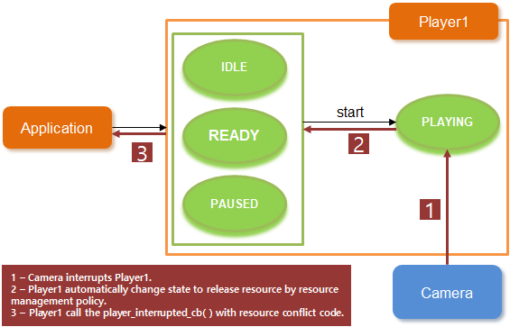
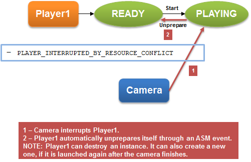

# Media Playback


You can play different audio formats and video in your application.

The main media playback features are:

- Handling audio

  Enables you to play [audio](#audio) and control the playback.

- Handling video

  Enables you to play [video](#video).

- Using the player [features](#features)

  Enables you manage the player and control the volume, sound mode, display, stream info, and audio effects.

- Streaming playback

  Enables you to set specific URLs for [streaming media playback](#stream).

- Using the WAV player

  Enables you to play audio in the [WAVE format](#wav).

- Using the tone player

  Enables you to play [tones](#tone).

Before you start, [set up the player](#prepare).

<a name="audio"></a>
## Audio Player

You can [play audio](#play_audio) and control functions for using audio resources. The resources can be media files stored on the device in a file or memory, or they can be streamed from a streaming server (defined with a URI) through the network.

The supported audio formats include MP3, AAC, WMA, M4A, 3GA, WAV, and AMR. The available formats depend on the target device.

You can use multiple instances of the player to play several audio data streams concurrently. This means that your application can [play multiple uncompressed audio files](#play) at the same time.

The following figure illustrates the general player state changes.

**Figure: Player state changes**


The `player_interrupted_cb()` callback is called when an application is interrupted by another application. The player is paused or moved to the IDLE state according to the audio session manager (ASM) policy. You must check the state of the current instance and take appropriate action. If the player is changed to the PAUSED state due to an interruption, the callback can be called at the end of the interruption with the `PLAYER_INTERRUPTED_COMPLETED` error code. For example, if the application is interrupted by a call, alarm, or notification, the completed message is posted. However, no messages are posted if the interruption has other causes. Make sure you handle the application accordingly when audio switching occurs between various applications.

The following figure illustrates what happens when the player gets interrupted by the system.

**Figure: Player states when interrupted by system**



<a name="video"></a>
## Video Player

Tizen enables your application to [play video](#play_video), and it uses its own user surface. The surface requires a drawing area, so you have to get an overlay region and set it to the player instance to display the drawing area:

1. Get the overlay region or Evas object from the Graphics module.

   You can display video on a UI layer with the Evas object as well as on an overlay layer.

2. Create the player instance.

3. Set the surface type and display handle to the player using the `player_set_display()` function.

The supported video formats include WMV, ASF, MP4, 3GP, AVI, MKV, and OGG. The available formats depend on the target device.

In the case of a video interruption, the state can be READY due to the resource restriction in the system.

The following figure illustrates what happens when the player gets interrupted by the system.

**Figure: Player states when interrupted by system**



<a name="features"></a>
## Player Features

The Player API (in [mobile](../../api/mobile/latest/group__CAPI__MEDIA__PLAYER__MODULE.html) and [wearable](../../api/wearable/latest/group__CAPI__MEDIA__PLAYER__MODULE.html) applications) provides the following features:

- Operating general controls for the [audio](#audio) and [video](#video) content, such as play, pause, resume, and stop

  The callback interface specifies the functions used to notify the player status during playback events. Since the player engine works asynchronously, you must implement a listener to ensure that the player flows correctly. When each player operation is completed, an event is generated, and the `player_completed_cb()` function is called. If an error occurs in the player engine, you are notified if you have registered the `player_error_cb()` callback.

- Modifying playback properties

  When the player state is changed to READY, you can modify various playback properties, such as volume, sound type, latency mode, mute mode, and looping mode.

- Moving the audio and video content based on time

- Controlling the volume of the audio and video content based on each instance

  The player works based on the audio session manager policy. This means that an application can be interrupted by another application if a resource is in conflict or it has an audio policy rule to follow. You can change the session policy directly by using the Sound Manager API (in [mobile](../../api/mobile/latest/group__CAPI__MEDIA__SOUND__MANAGER__MODULE.html) and [wearable](../../api/wearable/latest/group__CAPI__MEDIA__SOUND__MANAGER__MODULE.html) applications).

- Getting information about the audio and video content

  When the player state is changed to READY, the multimedia resource is available and you can get content information from the media. You can also get content information in the PLAYING state, in some cases of playback streaming.

- Playing multiple audio streams

  The maximum number of player instances is limited by the system and multimedia resources. The maximum number is a system-wide count and it can be applied depending on the CPU model, CPU speed, CPU core number, CPU load from other applications, and the available memory. Thus, the exact number can be smaller than the maximum number, in which case the prepare functions fail. A reasonable working player number is under 10. To free up system resources, [stop unneeded players](#release).

The Player sub-APIs offer the following features:

- Display

  Use the Display API (in [mobile](../../api/mobile/latest/group__CAPI__MEDIA__PLAYER__DISPLAY__MODULE.html) and [wearable](../../api/wearable/latest/group__CAPI__MEDIA__PLAYER__DISPLAY__MODULE.html) applications) to play a video stream.

  After changing to the IDLE state, create the display handle and [set the display type](#set_parameters).

- Stream information

  Use the Stream Information API (in [mobile](../../api/mobile/latest/group__CAPI__MEDIA__PLAYER__STREAM__INFO__MODULE.html) and [wearable](../../api/wearable/latest/group__CAPI__MEDIA__PLAYER__STREAM__INFO__MODULE.html) applications) to play a video stream.

  After changing to the READY state, you can [retrieve stream information](#get_stream).

- Audio effect

  Use the Audio Effect API (in [mobile](../../api/mobile/latest/group__CAPI__MEDIA__PLAYER__AUDIO__EFFECT__MODULE.html) and [wearable](../../api/wearable/latest/group__CAPI__MEDIA__PLAYER__AUDIO__EFFECT__MODULE.html) applications) to set and get the audio effect.

  After changing to the IDLE state, you can adjust the audio effect.

- Subtitles

  Use the Subtitle API (in [mobile](../../api/mobile/latest/group__CAPI__MEDIA__PLAYER__SUBTITLE__MODULE.html) and [wearable](../../api/wearable/latest/group__CAPI__MEDIA__PLAYER__SUBTITLE__MODULE.html) applications) to [read the subtitle track](#insert).

  After changing to the READY state, the subtitles can be read.

<a name="stream"></a>
## Playback Streams

You can set specific URLs for streaming media playback by using the `player_set_uri()` function.

Both Hypertext Transfer Protocol (HTTP) and Real Time Streaming Protocol (RTSP) protocols support streaming media playback. The HTTP request header supports the playback of both complete and download-in-progress media files. The index table (atoms) must be moved in front of the file for progressive download.

For HTTP streaming, buffering can happen when the player is prepared. You can get the status using the `player_set_buffering_cb()` function.

The player supports the streaming protocol features:

 -  Hypertext Transfer Protocol (HTTP)
    - HTTP Streaming
    - HTTP Live Streaming
    - HTTP Progressive Download Play

 -  Real Time Streaming Protocol (RTSP)
    - RTSP Streaming


<a name="wav"></a>
## WAV Player

The WAV Player API (in [mobile](../../api/mobile/latest/group__CAPI__MEDIA__WAV__PLAYER__MODULE.html) and [wearable](../../api/wearable/latest/group__CAPI__MEDIA__WAV__PLAYER__MODULE.html) applications) provides controlling functions for using audio resources (media files stored on the device). Use the WAV Player API to enable your application to play audio and control playback. You can use the WAV and OGG audio formats.

Tizen enables your application to play WAVE format audio in 1 of 2 ways:

- Through the multimedia application control **in mobile applications only**

  When using the [multimedia application control](../app-management/common-appcontrol.md#multimedia), the device standard media player application is launched to play audio.

- With the WAV player functions

  When [using the WAV player functions](#start_wav), your application plays audio using its own user interface.

Most operations of the WAV Player API work in a synchronous mode. The WAV Player API requires a callback to notify the application of the operational status of the player. The callback must be implemented and passed to stop the WAV playback.

Multiple instances of the WAV player can be used to play several audio data streams concurrently. This means that your application can play multiple uncompressed audio files, such as WAV, at the same time.

The following figure illustrates the general WAV player state changes.

**Figure: WAV player state changes**


<a name="tone"></a>
## Tone Player

Tizen enables your application to play a tone or a list of tones using the Tone Player API (in [mobile](../../api/mobile/latest/group__CAPI__MEDIA__TONE__PLAYER__MODULE.html) and [wearable](../../api/wearable/latest/group__CAPI__MEDIA__TONE__PLAYER__MODULE.html) applications).

You can generate tones in 2 ways:

- Specify the frequency values. You can specify either 1 or 2 frequencies.
- Use a DTMF (Dual Tone Multi Frequency) preset frequency value of the `tone_type_e` enumerator (in [mobile](../../api/mobile/latest/group__CAPI__MEDIA__TONE__PLAYER__MODULE.html#gaf12912b2c8f9ffe720518ce797506574) and [wearable](../../api/wearable/latest/group__CAPI__MEDIA__TONE__PLAYER__MODULE.html#gaf12912b2c8f9ffe720518ce797506574) applications).

You can [start and stop playing a tone](#play_tone), and [play a tone for a specified duration](#duration).

The following figures illustrate the general tone player state changes.

**Figure: Tone player states**


## Prerequisites

To enable your application to use the playback functionality:

1. To use the functions and data types of the Player API (in [mobile](../../api/mobile/latest/group__CAPI__MEDIA__PLAYER__MODULE.html) and [wearable](../../api/wearable/latest/group__CAPI__MEDIA__PLAYER__MODULE.html) applications), include the `<player.h>` header file in your application:

   ```
   #include <player.h>
   #include <Elementary.h>
   #include <glib.h>
   ```

   In this guide, you also need the `<Elementary.h>` and `<glib.h>` header files to set the display and use the Glib library functions.

2. Retrieve the default internal storage paths for audio and video files, and define the specific paths for the audio and video files to play. To access and use internal storage, include the `storage.h` header file in your application.

   ```
   #define MP3_SAMPLE "SampleAudio.mp3";
   #define MP4_SAMPLE "SampleVideo.mp4";

   int internal_storage_id;
   char *audio_storage_path = NULL;
   char *video_storage_path = NULL;
   char *audio_path = NULL;
   char *video_path = NULL;

   static bool
   storage_cb(int storage_id, storage_type_e type, storage_state_e state,
              const char *path, void *user_data)
   {
       if (type == STORAGE_TYPE_INTERNAL) {
           internal_storage_id = storage_id;

           return false;
       }

       return true;
   }

   void
   _get_storage_path()
   {
       int error_code = 0;
       char *path = NULL;

       error_code = storage_foreach_device_supported(storage_cb, NULL);
       error_code = storage_get_directory(internal_storage_id, STORAGE_DIRECTORY_MUSIC, &path);
       if (error_code != STORAGE_ERROR_NONE) {
           audio_storage_path = strdup(path);
           free(path);
       }

       error_code = storage_get_directory(internal_storage_id, STORAGE_DIRECTORY_VIDEOS, &path);
       if (error_code != STORAGE_ERROR_NONE) {
           video_storage_path = strdup(path);
           free(path);
       }
   }

   void
   _set_test_path()
   {
       int path_len = 0;

       path_len = strlen(audio_storage_path) + strlen(MP3_SAMPLE) + 1;
       audio_path = malloc(path_len);
       memset(audio_path, 0x0, path_len);

       strncat(audio_path, audio_storage_path, strlen(audio_storage_path));
       strncat(audio_path, MP3_SAMPLE, strlen(MP3_SAMPLE));

       path_len = strlen(video_storage_path) + strlen(MP4_SAMPLE) + 1;
       video_path = malloc(path_len);
       memset(video_path, 0x0, path_len);

       strncat(video_path, video_storage_path, strlen(video_storage_path));
       strncat(video_path, MP4_SAMPLE, strlen(MP4_SAMPLE));
   }
   ```

3. To start using the tone player, declare a player ID variable for identifying the tone player:

   ```
   int tone_player_id;
   ```

4. To use the functions and data types of the WAV Player API (in [mobile](../../api/mobile/latest/group__CAPI__MEDIA__WAV__PLAYER__MODULE.html) and [wearable](../../api/wearable/latest/group__CAPI__MEDIA__WAV__PLAYER__MODULE.html) applications), include the `<wav_player.h>` header file in your application:

   ```
   #include <wav_player.h>
   #include <stdio.h>
   #include <sound_manager.h>
   ```

   In this guide, you also need the `<stdio.h>` and `<sound_manager.h>` header files to use standard file input and output functions and the Sound Manager API functions (in [mobile](../../api/mobile/latest/group__CAPI__MEDIA__SOUND__MANAGER__MODULE.html) and [wearable](../../api/wearable/latest/group__CAPI__MEDIA__SOUND__MANAGER__MODULE.html) applications).

<a name="prepare"></a>
## Preparing the Player

To initialize the player for use:

<a name="init_handle"></a>
1. Define a variable for the player handle, and create the handle by passing the variable to the `player_create()` function. You need the handle for defining which file to play and with what playback settings. The following example code also creates buttons for the UI to control the playback.

   ```
   struct appdata {
       player_h player;
   };

   static void
   init_base_player(appdata_s *ad)
   {
       int error_code = 0;
       error_code = player_create(&ad->player);
       if (error_code != PLAYER_ERROR_NONE)
           dlog_print(DLOG_ERROR, LOG_TAG, "failed to create");
       /*
          Perform more playback configuration, such as setting callbacks,
          setting the source file URI, and preparing the player
       */
   }

   static void
   create_base_gui(appdata_s *ad)
   {
       /* Create a window */
       /* Create a button */
       /* Add a callback to the button */
       evas_object_smart_callback_add(button_init, "clicked", init_base_player, ad);
       evas_object_smart_callback_add(button_end, "clicked", release_base_player, ad);
       /* Create an Evas image object for the video surface */
   }

   static void
   app_create(void *data)
   {
       appdata_s *ad = data;
       create_base_gui(ad);

       return true;
   }
   ```

2. To receive notifications, register the appropriate callbacks:

   - To receive notifications about playback interruptions, register a callback function using the `player_set_interrupted_cb()` function:

     ```
     static void
     _player_interrupted_cb(player_interrupted_coded_e code, void *data)
     {
         appdata_s *ad = data;
         player_state_e state;

         player_get_state(ad->player, &state);
         log_print(DLOG_INFO, LOG_TAG, "current player state = %d", state);
         /* If the state is PLAYER_STATE_PAUSED, update UI (for example, button) */
     }

     static void
     init_base_player(appdata_s *ad)
     {
         /* Set an interruption callback if the application wants to know the reason */
         error_code = player_set_interrupted_cb(g_player, _player_interrupted_cb, ad);
         if (error_code != PLAYER_ERROR_NONE)
             dlog_print(DLOG_ERROR, LOG_TAG, "failed to create");
     }
     ```

     The playback is interrupted and the callback triggered when, for example, another multimedia application is run. The player state automatically changes to `PLAYER_STATE_PAUSED` or `PLAYER_STATE_IDLE` according to the session policy. To get the current state, use the `player_get_state()` function.

   - To receive a notification when the playback ends, register a callback function using the `player_set_completed_cb()` function:

     ```
     static void
     _player_completed_cb(void *data)
     {
        dlog_print(DLOG_INFO, "Player", "Playback End");
     }

     static void
     init_base_player(appdata_s *ad)
     {
         /* Set a completed callback for when the playback ends */
         error_code = player_set_completed_cb(g_player, _player_completed_cb, ad);

         if (error_code != PLAYER_ERROR_NONE)
             dlog_print(DLOG_ERROR, LOG_TAG, "failed to set completed cb");
     }
     ```

   - To receive notifications about player errors during playback, register a callback function using the `player_set_error_cb()` function:

     ```
     static void
     _player_error_cb(int error_code, void *user_data)
     {
         dlog_print(DLOG_ERROR, LOG_TAG, "playback failed, error = %x", error_code);
     }

     static void
     init_base_player(appdata_s *ad)
     {
         error_code = player_set_error_cb(g_player, _player_error_cb, NULL);
         if (error_code != PLAYER_ERROR_NONE)
             dlog_print(DLOG_ERROR, LOG_TAG, "failed to set error cb");
     }
     ```

     The player error callback is triggered when the player stops working due to an error. You can use the callback to try to recover from the error. For example, try to change the player state to `PLAYER_STATE_READY` by calling the `player_stop()` function. Then remove all other callbacks and reset the player by calling the `player_unprepare()` function. At the end, the player is in the `PLAYER_STATE_IDLE` state, so you can release the resources allocated to the player.

     > **Note**
     >
     > Do not call the `player_destroy()` function from the called context, as this can cause the `PLAYER_ERROR_INVALID_OPERATION` error.

<a name="play_audio"></a>
## Playing an Audio File

To play an audio file:

1. After creating the player handle, specify the audio file to play using the `player_set_uri()` function:

   ```
   error_code = player_set_uri(ad->player, audio_path);
   ```

2. Prepare the player for playback using the `player_prepare()` function:

   ```
   error_code = player_prepare(ad->player);
   ```

   The function changes the player state from `PLAYER_STATE_IDLE` to `PLAYER_STATE_READY`, which is required to start playback.

3. Start playing the audio file using the `player_start()` function:

   ```
   error_code = player_start(ad->player);
   ```

   The function changes the player state from `PLAYER_STATE_READY` to `PLAYER_STATE_PLAYING`. The audio file plays until you call the `player_stop()` or `player_pause()` function.

<a name="play_video"></a>
## Playing a Video File

To play a video file:

1. After creating the player handle, specify the video file to play using the `player_set_uri()` function:

   ```
   error_code = player_set_uri(ad->player, video_path);
   ```
   <a name="play_video_display"></a>
2. Set the display on which the video is played.

   To retrieve the correct display handle, use the `GET_DISPLAY()` function. To set the display, use the `player_set_display()` function with the player handle, display type (a `player_display_type_e` enumerator in [mobile](../../api/mobile/latest/group__CAPI__MEDIA__PLAYER__MODULE.html#ga6b83386e10a8febc7e5dfbff85b342ab) and [wearable](../../api/wearable/latest/group__CAPI__MEDIA__PLAYER__MODULE.html#ga6b83386e10a8febc7e5dfbff85b342ab) applications), and display handle:

   ```
   error_code = player_set_display(g_player, PLAYER_DISPLAY_TYPE_OVERLAY, GET_DISPLAY(evas_obj));
   ```

   After the `player_set_display()` function has been successfully executed, the player is connected to the display.

   > **Note**
   >
   > For an overlay surface, when the device orientation changes, the displayed video does not rotate automatically. If you want to change the video orientation according to the device orientation, use the `player_set_display_rotation()` function within the `app_device_orientation_cb()` callback function used by the application. For an Evas surface, the Evas object for the video is rotated by the window manager used by the application, not by the `player_set_display_rotation()` function.

<a name="play_video_prepare"></a>
3. Prepare the player for playback using the `player_prepare()` function:

   ```
   error_code = player_prepare(ad->player);
   ```

   The `player_prepare()` function works synchronously, so it can block the application execution. To prepare the player asynchronously instead, use the `player_prepare_async()` function:

   ```
   error_code = player_prepare_async(ad->player, _prepared_cb, ad);
   ```

   Both functions change the player state from `PLAYER_STATE_IDLE` to `PLAYER_STATE_READY`, which is required to start playback.

<a name="play_video_play"></a>
4. Play the video file:

   1. Ensure that the player state has changed to `PLAYER_STATE_READY`. To check the state, use the `player_get_state()` function in a waiting loop:

      ```
      player_state_e state;
      do {
          error_code = player_get_state(ad->player, &state);
          if (error_code != PLAYER_ERROR_NONE)
              break;
          usleep(1000);
      } while (state != PLAYER_STATE_READY);
      ```

   2. Start playing the video file using the `player_start()` function:

      ```
      if (error_code == PLAYER_ERROR_NONE)
          error_code = player_start(g_player);
      ```

      If you used the `player_prepare_async()` function to prepare the player, use the following callback function to handle the playback:

      ```
      static void
      _prepared_cb(void *data)
      {
          appdata_s *ad = data;
          int error_code = 0;
          error_code = player_start(ad->player);
      }
      ```

      The `player_start()` function changes the player state from `PLAYER_STATE_READY` to `PLAYER_STATE_PLAYING`. The video file plays until you call the `player_stop()` or `player_pause()` function.

<a name="release"></a>
## Stopping the Player and Releasing Resources

To stop the player and release the resources allocated to the player:

1. Stop the player using the `player_stop()` function:

   ```
   error_code = player_stop(player);
   dlog_print(DLOG_ERROR, LOG_TAG, "player_stop() = %d", error_code);
   ```

2. Reset the player using the `player_unprepare()` function:

   ```
   error_code = player_unprepare(player);
   dlog_print(DLOG_ERROR, LOG_TAG, "player_unprepare() = %d", error_code);
   ```

   After the player is reset, it is in the `PLAYER_STATE_IDLE` state.

3. Destroy the player handle using the `player_destroy()` function:

   ```
   error_code = player_destroy(player);
   dlog_print(DLOG_ERROR, LOG_TAG, "player_destroy = %d", error_code);
   ```

<a name="play"></a>
## Playing Multiple Files Simultaneously

To play multiple files simultaneously:

1. Define the variables for player handlers, player states, file paths, playback time, and return value.

   In this guide, you also need the `<stdio.h>` and `<unistd.h>` header files to use standard file input and output functions and system calls.

   ```
   #include <stdio.h>
   #include <unistd.h>

   static player_h player_1;
   static player_h player_2;
   static player_h player_3;
   static player_state_e state_1;
   static player_state_e state_2;
   static player_state_e state_3;
   static int ret =0;
   static char *path_1 = NULL;
   static char *path_2 = NULL;
   static char *path_3 = NULL;
   char *resource_path = NULL;

   resource_path = app_get_resource_path();
   snprintf(path_1, sizeof(path_1)-1, "%s/sample.3gp", resource_path);
   snprintf(path_2, sizeof(path_2)-1, "%s/test.wav", resource_path);
   snprintf(path_3, sizeof(path_3)-1, "%s/test2.wav", resource_path);
   free(resource_path);

   static const int PLAYBACK_TIME = 6;
   ```

2. Create a player handle for each file using the `player_create()` function:

   ```
   ret = player_create(&player_1);

   ret = player_create(&player_2);

   ret = player_create(&player_3);
   ```

3. Specify the files to play using the `player_set_uri()` function:

   ```
   ret = player_set_uri(player_1, path_1);

   ret = player_set_uri(player_2, path_2);

   ret = player_set_uri(player_3, path_3);
   ```

4. Prepare the players for playback using the `player_prepare()` function:

   ```
   ret = player_prepare(player_1);

   ret = player_prepare(player_2);

   ret = player_prepare(player_3);
   ```

   The function changes the player states from `PLAYER_STATE_IDLE` to `PLAYER_STATE_READY`, which is required to start playback.

5. Play the files:

   1. Ensure that the player states have changed to `PLAYER_STATE_READY`. To check the states, use the `player_get_state()` function in a waiting loop:

      ```
      /* Wait to prepare player_1 */
      ret = player_get_state(player_1, &state_1);

      while (state_1 != PLAYER_STATE_READY) {
          ret = player_get_state(player_1, &state_1);

          usleep(1000);
      }

      /* Wait to prepare player_2 */
      ret = player_get_state(player_2, &state_2);

      while (state_2 != PLAYER_STATE_READY) {
          ret = player_get_state(player_2, &state_2);

          usleep(1000);
      }

      /* Wait to prepare player_3 */
      ret = player_get_state(player_3, &state_3);

      while (state_3 != PLAYER_STATE_READY) {
          ret = player_get_state(player_3, &state_3);

          usleep(1000);
      }
      ```

   2. Start playing the files using the `player_start()` function:

      ```
      ret = player_start(player_1);

      ret = player_start(player_2);

      ret = player_start(player_3);
      ```

6. After the playback has ended or been stopped, reset the players and destroy the player handles using the `player_unprepare()` and `player_destroy()` functions:

   ```
   ret = player_unprepare(player_1);
   ret = player_destroy(player_1);

   ret = player_unprepare(player_2);
   ret = player_destroy(player_2);

   ret = player_unprepare(player_3);
   ret = player_destroy(player_3);
   ```

<a name="set_parameters"></a>
## Configuring the Video Playback Display

To set the display parameters for playing a video file:

1. Make sure that the [player handle has been created](#init_handle), the [display set](#play_video_display), and the [player prepared](#play_video_prepare) and [started](#play_video_play).

2. During playback, you can manage the display settings as needed:

   - Make the display visible:

     1. Check whether the display is already visible using the `player_is_display_visible()` function:

        ```
        bool is_visible;

        error_code = player_is_display_visible(player, &is_visible);
        dlog_print(DLOG_ERROR, LOG_TAG, "player_is_display_visible = %d", error_code);
        ```

     2. If the display is not visible, make it visible using the `player_set_display_visible()` function with the second parameter set to `true`:

        ```
        if (!is_visible) {
            error_code = player_set_display_visible(player, true);
            dlog_print(DLOG_ERROR, LOG_TAG, "player_set_display_visible = %d", error_code);
        }
        ```

   - Set the display mode using the `player_set_display_mode()` function:

     ```
     error_code = player_set_display_mode(player, PLAYER_DISPLAY_MODE_FULL_SCREEN);
     dlog_print(DLOG_ERROR, LOG_TAG, "player_set_display_mode = %d", error_code);
     ```

     The available display modes are defined in the `player_display_mode_e` enumeration (in [mobile](../../api/mobile/latest/group__CAPI__MEDIA__PLAYER__DISPLAY__MODULE.html#gaafcf6f7487d8cb376e1851a6e1253f3a) and [wearable](../../api/wearable/latest/group__CAPI__MEDIA__PLAYER__DISPLAY__MODULE.html#gaafcf6f7487d8cb376e1851a6e1253f3a) applications).

   - Set the display rotation using the `player_set_display_rotation()` function:

     ```
     error_code = player_set_display_rotation(player, PLAYER_DISPLAY_ROTATION_90);
     dlog_print(DLOG_ERROR, LOG_TAG, "player_set_display_mode = %d", error_code);
     ```

     The available display rotations are defined in the `player_display_rotation_e` enumeration (in [mobile](../../api/mobile/latest/group__CAPI__MEDIA__PLAYER__DISPLAY__MODULE.html#gab8c4c170d4b2628a09831edc8d652302) and [wearable](../../api/wearable/latest/group__CAPI__MEDIA__PLAYER__DISPLAY__MODULE.html#gab8c4c170d4b2628a09831edc8d652302) applications).

<a name="get_stream"></a>
## Retrieving Stream Information

To retrieve information about the audio and video streams:

1. [Create the player handle](#init_handle), [prepare and start the player](#play_video), and [set the display parameters](#set_parameters).

   > **Note**
   >
   > To retrieve the stream information, the player state must be either `PLAYER_STATE_PLAYING` or `PLAYER_STATE_PAUSED`.

2. Retrieve the stream information:

   - Video display size

     Retrieve the width and height of the video display using the `player_get_video_size()` function:

     ```
     int width;
     int height;

     error_code = player_get_video_size(player, &width, &height);
     dlog_print(DLOG_ERROR, LOG_TAG, "player_is_display_visible = %d", error_code);
     ```

   - Duration

     Retrieve the total media running time (in milliseconds) using the `player_get_duration()` function:

     ```
     int duration;

     error_code = player_get_duration(player, &duration);
     dlog_print(DLOG_INFO, LOG_TAG, "player_get_duration = %d", error_code);
     ```

   - Audio stream details

     Retrieve the audio stream details using the `player_get_audio_stream_info()` function. The function returns the audio sample rate (in Hz), number of audio channels (1 for mono or 2 for stereo), and audio bit rate (in Hz).

     ```
     int sample_rate;
     int channels;
     int bit_rate;

     error_code = player_get_audio_stream_info(player, &sample_rate, &channels, &bit_rate);
     dlog_print(DLOG_INFO, LOG_TAG, "player_get_audio_stream_info = %d", error_code);
     ```

   - Video stream details

     Retrieve the video stream details using the `player_get_video_stream_info()` function. The function returns the number of frames per second and the video bit rate (in Hz).

     ```
     int fps;
     int bit_rate;

     error_code = player_get_video_stream_info(player, &fps, &bit_rate);
     dlog_print(DLOG_INFO, LOG_TAG, "player_get_video_stream_info = %d", error_code);
     ```

   - Audio and video codec names

     Retrieve the audio and video codec names using the `player_get_codec_info()` function:

     ```
     char *audio_codec;
     char *video_codec;

     error_code = player_get_codec_info(player, &audio_codec, &video_codec);
     dlog_print(DLOG_INFO, LOG_TAG, "player_get_codec_info = %d", error_code);
     ```

   - Content metadata

     Retrieve information about the album, artist, author, genre, title, and year using the `player_get_content_info()` function. The available metadata attributes are defined in the `player_content_info_e` enumeration (in [mobile](../../api/mobile/latest/group__CAPI__MEDIA__PLAYER__STREAM__INFO__MODULE.html#ga2d25f300270965c3ea302b7a7e845f12) and [wearable](../../api/wearable/latest/group__CAPI__MEDIA__PLAYER__STREAM__INFO__MODULE.html#ga2d25f300270965c3ea302b7a7e845f12) applications).

     ```
     char *album;
     char *artist;
     char *author;
     char *genre;
     char *title;
     char *year;

     error_code = player_get_content_info(player, PLAYER_CONTENT_INFO_ALBUM, &album);
     dlog_print(DLOG_INFO, LOG_TAG, "player_get_content_info album = %d", album);
     error_code = player_get_content_info(player, PLAYER_CONTENT_INFO_ARTIST, &artist);
     dlog_print(DLOG_INFO, LOG_TAG, "player_get_content_info artist = %d", artist);
     error_code = player_get_content_info(player, PLAYER_CONTENT_INFO_AUTHOR, &author);
     dlog_print(DLOG_INFO, LOG_TAG, "player_get_content_info author = %d", author);
     error_code = player_get_content_info(player, PLAYER_CONTENT_INFO_GENRE, &genre);
     dlog_print(DLOG_INFO, LOG_TAG, "player_get_content_info genre = %d", genre);
     error_code = player_get_content_info(player, PLAYER_CONTENT_INFO_TITLE, &title);
     dlog_print(DLOG_INFO, LOG_TAG, "player_get_content_info title = %d", title);
     error_code = player_get_content_info(player, PLAYER_CONTENT_INFO_YEAR, &year);
     dlog_print(DLOG_INFO, LOG_TAG, "player_get_content_info year = %d", year);
     ```

     > **Note**
     >
	 > The values must be released using the `free()` function.

   - Album artwork

     Retrieve the album artwork using the `player_get_album_art()` function. The function returns the encoded artwork image and size.

     ```
     void *album_art;
     int size;

     error_code = player_get_album_art(player, &album_art, &size);
     dlog_print(DLOG_INFO, LOG_TAG, "player_set_display_mode = %d", error_code);
     ```

<a name="insert"></a>
## Inserting Subtitles

To insert subtitles to a video file:

1. [Create the player handle.](#init_handle)

2. Set the subtitle path using the `player_set_subtitle_path()` function:

   ```
   #define SUBTITLE "subtitles_test_file.srt"

   char *data_path = app_get_data_path();
   int path_len = strlen(data_path) + 10;
   char *path = malloc(path_len);
   strncat(path, data_path, path_len);
   strncat(path, SUBTITLE, path_len);

   error_code = player_set_subtitle_path(player, path);
   dlog_print(DLOG_ERROR, LOG_TAG, "player_set_subtitle_path() = %d", error_code);
   free(path);
   ```

   > **Note**
   >
   > You can set the subtitle path when the player state is `PLAYER_STATE_IDLE`, `PLAYER_STATE_READY`, `PLAYER_STATE_PLAYING`, or `PLAYER_STATE_PAUSED`.

<a name="start_wav"></a>
## Starting and Stopping the WAV Player

To start and stop the WAV player:

1. To start the WAV player, use the `wav_player_start()` function.

   The third parameter defines a callback that is invoked when the player finishes playback. Implement the callback and handle any post-playback actions in it.

   The final parameter returns the WAV player ID, which you need to stop the player.

   ```
   static void
   _playback_completed_cb(int id, void *user_data)
   {
       const char* path = (const char*)user_data;
       dlog_print(DLOG_INFO, "WAV Player", "Completed! [id:%d, path:%s]", id, path);
   }

   void
   main()
   {
       int wav_player_id;
       wav_player_error_e ret;
       const char* wav_path = "PATH OF YOUR WAV FILE";

       ret = wav_player_start(wav_path, SOUND_TYPE_MEDIA, _playback_completed_cb, (void*)wav_path, &wav_player_id);
   }
   ```

   To set the path of your WAV file, you may need to retrieve the default path for audio files. For more information, see the [Data Storages](../data/data-storages.md) guide.

2. To stop the WAV player, use the `wav_player_stop()` function with the ID of the WAV player:

   ```
   void
   my_stop()
   {
       wav_player_error_e ret;
       ret = wav_player_stop(wav_player_id);
   }
   ```

<a name="play_tone"></a>
## Playing a Tone

To start and stop playing a tone:

1. To start playback, use the `tone_player_start()` function.

   The `tone_type_e` (in [mobile](../../api/mobile/latest/group__CAPI__MEDIA__TONE__PLAYER__MODULE.html#gaf12912b2c8f9ffe720518ce797506574) and [wearable](../../api/wearable/latest/group__CAPI__MEDIA__TONE__PLAYER__MODULE.html#gaf12912b2c8f9ffe720518ce797506574) applications) and `sound_type_e` (in [mobile](../../api/mobile/latest/group__CAPI__MEDIA__SOUND__MANAGER__VOLUME__MODULE.html#gab0b52eeab59765b94c7a751097738a0b) and [wearable](../../api/wearable/latest/group__CAPI__MEDIA__SOUND__MANAGER__VOLUME__MODULE.html#gab0b52eeab59765b94c7a751097738a0b) applications) enumerators define the available values for the tone type (first parameter) and sound type (second parameter).

   ```
   tone_player_start(TONE_TYPE_DEFAULT, SOUND_TYPE_MEDIA, -1, &tone_player_id);
   ```

   The player ID is assigned and returned if the function succeeds. The ID of the tone player that starts first is 0, the ID of the second one is 1, and so on. If you set the player ID parameter to `NULL`, the ID is not returned.

2. To stop playback, use the `tone_player_stop()` function with the ID of the player you want to stop:

   ```
   tone_player_stop(tone_player_id);
   ```

<a name="duration"></a>
## Playing a Tone for a Specified Duration

To play a tone for a specified duration, use the `tone_player_start()` function with the duration (third parameter) set to the number of milliseconds you want playback to last:

```
tone_player_start(TONE_TYPE_SUP_CONGESTION, SOUND_TYPE_CALL, 1000, &tone_player_id);
```

When you set the duration to a specified time, playback stops automatically after that time. You can also stop playback manually using the `tone_player_stop()` function.

## Related Information
- Dependencies
  - Tizen 2.4 and Higher for Mobile
  - Tizen 2.3.1 and Higher for Wearable
