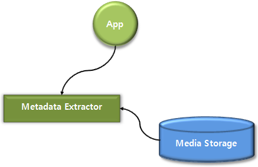

# Metadata


To handle content metadata, you can use the following features:

- Metadata editing

  You can [edit the metadata](#edit_metadata) of several popular audio formats using the metadata editor. You can add and remove album art, or update the information for the audio file.

  The metadata editor supports editing the [metadata](#attribute) of the mp3 and mp4 (audio only) file formats. Image and video file editing is not supported.

- Metadata extraction

  Media files, such as mp3 and mp4 files, contain [extractable metadata](#attribute2). You can [extract metadata](#get_metadata) from such media files with the metadata extractor.

  **Figure: Getting metadata**

  

  The metadata extractor can be used with video and audio files only. It is not supported for image files.

- MIME type information

  You can [get the MIME type](#get_file_ext) for a file extension and [get a list of extensions](#get_mime) associated, for example, with an image or the JPEG MIME type.

## Prerequisites

To enable your application to use the metadata functionality:

1. To use the functions and data types of the Metadata Editor API (in [mobile](../../api/mobile/latest/group__CAPI__MEDIA__METADATA__EDITOR__MODULE.html) and [wearable](../../api/wearable/latest/group__CAPI__MEDIA__METADATA__EDITOR__MODULE.html) applications), include the `<metadata_editor.h>` header file in your application:

   ```
   #include <metadata_editor.h>
   ```

2. To work with the Metadata Editor API, define a handle variable for the metadata editor:

   ```
   static metadata_editor_h g_metadata_h = NULL;
   ```

   This guide uses a global variable for the handle.

3. Make sure you have access to the file whose metadata and artwork you want to edit.

   > **Note**
   >
   > The metadata editor APIs can use both common content in the device storage (internal or external) and private content in your application data.

   This guide uses an MP3 audio file, which is accessed through its file path. The following example code uses an internal storage, so you must include the `storage.h` header file for the code to work.

   ```
   int internal_storage_id;
   char *internal_music_storage_path;
   char *music_file_name = "test_music.mp3";
   char *music_test_path;

   static bool
   storage_cb(int storage_id, storage_type_e type, storage_state_e state,
              const char *path, void *user_data)
   {
       if (type == STORAGE_TYPE_INTERNAL) {
           internal_storage_id = storage_id;

           return false;
       }

       return true;
   }

   void
   _get_internal_storage_path()
   {
       int error;
       char *path = NULL;

       error = storage_foreach_device_supported(storage_cb, NULL);
       error = storage_get_directory(internal_storage_id, STORAGE_DIRECTORY_MUSIC, &path);
       if (error == STORAGE_ERROR_NONE) {
           internal_music_storage_path = strdup(path);
           free(path);
       }
   }

   void
   _make_test_path()
   {
       int path_len = 0;

       path_len = strlen(internal_music_storage_path) + strlen(music_file_name) + 2;
       music_test_path = malloc(path_len);
       memset(music_test_path, 0x0, path_len);

       snprintf(music_test_path, path_len, "%s/%s", internal_music_storage_path, music_file_name);
   }
   ```

4. To use the functions and data types of the Metadata Extractor API (in [mobile](../../api/mobile/latest/group__CAPI__METADATA__EXTRACTOR__MODULE.html) and [wearable](../../api/wearable/latest/group__CAPI__METADATA__EXTRACTOR__MODULE.html) applications), include the `<metadata_extractor.h>` header file in your application:

   ```
   #include <metadata_extractor.h>
   ```

   To ensure that a Metadata Extractor function has been executed properly, make sure that the return value is equal to `METADATA_EXTRACTOR_ERROR_NONE`.

5. To work with the Metadata Extractor API, define a handle variable for the metadata extractor:

   ```
   static metadata_extractor_h g_metadata_h = NULL;
   ```

   This guide uses a global variable for the handle.

6. Make sure you have access to the files whose metadata you want to extract, and make sure the files contain metadata, since the Metadata Extractor API only works on files with metadata.

   > **Note**
   >
   > The Metadata Extractor functions can use both common content in the device storage (internal or external) and private content in your application data.

   This guide uses 2 files: an MP3 audio file and an MP4 video file, which are accessed through their file paths. The following example code uses an internal storage, so you must include the `storage.h` header file for the code to work.

   ```
   int internal_storage_id;
   char *internal_music_storage_path;
   char *internal_video_storage_path;
   char *music_file_name = "test_music.mp3";
   char *video_file_name = "test_video.mp4";
   char *music_test_path;
   char *video_test_path;

   static bool
   storage_cb(int storage_id, storage_type_e type, storage_state_e state,
              const char *path, void *user_data)
   {
       if (type == STORAGE_TYPE_INTERNAL) {
           internal_storage_id = storage_id;

           return false;
       }

       return true;
   }

   void
   _get_internal_storage_path()
   {
       int error;
       char *path = NULL;

       error = storage_foreach_device_supported(storage_cb, NULL);
       error = storage_get_directory(internal_storage_id, STORAGE_DIRECTORY_MUSIC, &path);
       if (error != STORAGE_ERROR_NONE) {
           internal_music_storage_path = strdup(path);
           free(path);
       }

       error = storage_get_directory(internal_storage_id, STORAGE_DIRECTORY_VIDEOS, &path);
       if (error != STORAGE_ERROR_NONE) {
           internal_video_storage_path = strdup(path);
           free(path);
       }
   }

   void
   _make_test_path()
   {
       int path_len = 0;

       path_len = strlen(internal_music_storage_path) + strlen(music_file_name) + 1;
       music_test_path = malloc(path_len);
       memset(music_test_path, 0x0, path_len);

       strncat(music_test_path, internal_music_storage_path, strlen(internal_music_storage_path));
       strncat(music_test_path, music_file_name, strlen(music_file_name));

       path_len = strlen(internal_video_storage_path) + strlen(video_file_name) + 1;
       video_test_path = malloc(path_len);
       memset(video_test_path, 0x0, path_len);

       strncat(video_test_path, internal_video_storage_path, strlen(internal_video_storage_path));
       strncat(video_test_path, video_file_name, strlen(video_file_name));
   }
   ```

7. To use the functions and data types of the MIME Type API (in [mobile](../../api/mobile/latest/group__CAPI__CONTENT__MIME__TYPE__MODULE.html) and [wearable](../../api/wearable/latest/group__CAPI__CONTENT__MIME__TYPE__MODULE.html) applications), include the `<mime_type.h>` header file in your application:

   ```
   #include <mime_type.h>
   ```

<a name="edit_metadata"></a>
## Editing Metadata and Artwork

To edit the metadata and artwork in the file:

1. Create the metadata editor handle using the `metadata_editor_create()` function:

   ```
   ret = metadata_editor_create(&g_metadata_h);
   ```

2. Set the path to the file you want to edit using the `metadata_editor_set_path()` function:

   ```
   ret = metadata_editor_set_path(g_metadata_h, music_test_path);
   ```

   The function binds the metadata editor handle (first parameter) with the file specified in the `music_test_path` variable (second parameter).

3. Edit the metadata in the file using the `metadata_editor_set_metadata()` function. Edit each piece of metadata (each metadata attribute) individually.

   As parameters, define the metadata editor handle, the attribute you want to edit, and the new value you want to set to the attribute. The possible attributes are defined in the `metadata_editor_attr_e` enumeration (in [mobile](../../api/mobile/latest/group__CAPI__MEDIA__METADATA__EDITOR__MODULE.html#ga1c6a8dcf861f527302e9c55152692df3) and [wearable](../../api/wearable/latest/group__CAPI__MEDIA__METADATA__EDITOR__MODULE.html#ga1c6a8dcf861f527302e9c55152692df3) applications).

   The following example code edits the title of the audio content. You can edit other attributes by defining a different attribute enumerator (and a corresponding new value).

   ```
   char *value = "My Song";

   ret = metadata_editor_set_metadata(g_metadata_h, METADATA_EDITOR_ATTR_TITLE, value);
   ```

   After calling the function, check whether the return value is `METADATA_EDITOR_ERROR_NONE`. If it is, you can check the updated metadata using the `metadata_editor_get_metadata()` function. Otherwise, the function failed because of an error, which you need to handle.

   > **Note**
   >
   > The updated metadata is applied to the file only after you [call the `metadata_editor_update_metadata()` function](#apply).

4. Add artwork to the file using the `metadata_editor_append_picture()` function.

   As parameters, define the metadata editor handle and the path of the image file that contains the artwork. The image file must be in JPEG or PNG format. The image is added to the last image file position. You can add multiple image files to the same audio file.

   ```
   char *artwork = "append_image.jpg";

   ret = metadata_editor_append_picture(g_metadata_h, artwork);
   ```

   To remove artwork from the file, use the `metadata_editor_remove_picture()` function. As parameters, define the metadata editor handle and the index number of the image file you want to remove.

   To retrieve the number of images in the file, use the `metadata_editor_get_metadata()` function. To retrieve a specific image, use the `metadata_editor_get_picture()` function.

   ```
   int index = 0;

   ret = metadata_editor_remove_picture(g_metadata_h, index);
   ```

   > **Note**
   >
   > The artwork is added to the file or removed from the file only after you [call the `metadata_editor_update_metadata()` function](#apply).

   <a name="apply"></a>
5. Apply the metadata and artwork edits to the file using the `metadata_editor_update_metadata()` function:

   ```
   ret = metadata_editor_update_metadata(g_metadata_h);
   ```

6. When no longer needed, destroy the metadata editor handle using the `metadata_editor_destroy()` function:

   ```
   metadata_editor_destroy(g_metadata_h);
   ```

<a name="get_metadata"></a>
## Retrieving Metadata

To retrieve metadata from the file:

1. Create the metadata extractor handle using the `metadata_extractor_create()` function:

   ```
   ret = metadata_extractor_create(&g_metadata_h);
   ```

2. Set the path to the file whose metadata you want to retrieve using the `metadata_extractor_set_path()` function:

   ```
   ret = metadata_extractor_set_path(g_metadata_h, video_test_path);

   /* Or */

   ret = metadata_extractor_set_path(g_metadata_h, music_test_path);
   ```

   The function binds the metadata extractor handle (first parameter) with the file specified in the path variable (second parameter).

3. Retrieve the metadata from the file using the `metadata_extractor_get_metadata()` function. Retrieve each piece of metadata (each metadata attribute) individually.

   As parameters, define the metadata extractor handle, the attribute you want to retrieve, and a pointer to the `char` variable in which you want to store the attribute value. The possible attributes are defined in the `metadata_extractor_attr_e` enumeration (in [mobile](../../api/mobile/latest/group__CAPI__METADATA__EXTRACTOR__MODULE.html#ga5b27fedbf5aaa22106f88b831c596872)and [wearable](../../api/wearable/latest/group__CAPI__METADATA__EXTRACTOR__MODULE.html#ga5b27fedbf5aaa22106f88b831c596872) applications).

   The following example code retrieves the duration and prints it on the screen. You can retrieve other attributes by defining a different attribute enumerator as the second parameter.

   ```
   char *value = NULL;

   ret = metadata_extractor_get_metadata(g_metadata_h, METADATA_DURATION, &value);
   dlog_print(DLOG_DEBUG, LOG_TAG, "METADATA_DURATION: %s\n", value);
   if (value != NULL) {
       free(value);
       value = NULL;
   }
   ```

   To avoid memory leaks, release the `value` variable using the `free()` function when you no longer need the variable.

4. For an audio file, retrieve the artwork from the file using the `metadata_extractor_get_artwork()` function.

   The retrieved artwork information is available in the 3 out parameters, which define the artwork image, image size, and MIME type.

   The following example code retrieves the artwork and prints the image size and MIME type on the screen:

   ```
   int artwork_size = 0;
   void *artwork = NULL;
   char *artwork_mime = NULL;

   ret = metadata_extractor_get_artwork(g_metadata_h, &artwork, &artwork_size, &artwork_mime);
   dlog_print(DLOG_DEBUG, LOG_TAG, "Artwork: size: %d, mime type: %s\n", artwork_size, artwork_mime);
   if (artwork != NULL) {
       free(artwork);
       artwork = NULL;
   }

   if (artwork_mime != NULL) {
       free(artwork_mime);
       artwork_mime = NULL;
   }
   ```

   To avoid memory leaks, release the `artwork` and `artwork_mime` variables using the `free()` function when you no longer need the variables.

5. For an audio file, retrieve the synchronized lyrics from the file using the `metadata_extractor_get_synclyrics()` function.

   The following example code retrieves the synchronized lyrics from index number 1 and prints the time information and lyrics on the screen:

   ```
   unsigned long time_info = 0;
   char *lyrics = NULL;

   ret = metadata_extractor_get_synclyrics(g_metadata_h, 1, &time_info, &lyrics);
   if (lyrics != NULL) {
       dlog_print(DLOG_DEBUG, LOG_TAG, "Synclyrics: time_info: %d, lyrics: %s\n", time_info, lyrics);
       free(lyrics);
       lyrics = NULL;
   }
   ```

   To retrieve the synchronized lyrics index number, use the `metadata_extractor_get_metadata()` function with the `METADATA_SYNCLYRICS_NUM` attribute.

   To avoid memory leaks, release the `lyrics` variable using the `free()` function when you no longer need the variable.

6. For a video file, retrieve frames from the file in one of the following ways:

   - To retrieve a frame without specifying the time when the frame appears, use the `metadata_extractor_get_frame()` function.
   - To retrieve a frame at a specified time, use the `metadata_extractor_get_frame_at_time()` function.

   The following example code first retrieves a frame at an unspecified time and prints the frame size, and then retrieves another frame at a specified time and prints its size:

   ```
   /* Use metadata_extractor_get_frame() */
   int frame_size = 0;
   void *frame = NULL;

   ret = metadata_extractor_get_frame(g_metadata_h, &frame, &frame_size);
   dlog_print(DLOG_DEBUG, LOG_TAG, "Frame: size: %d\n", frame_size);
   if (frame != NULL) {
       free(frame);
       frame = NULL;
   }

   /* Use metadata_extractor_get_frame_at_time() */
   unsigned long timestamp = 500;

   ret = metadata_extractor_get_frame_at_time(g_metadata_h, timestamp, true, &frame, &frame_size);
   dlog_print(DLOG_DEBUG, LOG_TAG, "Frame at %d: size: %d\n", timestamp, frame_size);
   if (frame != NULL) {
       free(frame);
       frame = NULL;
   }
   ```

   To avoid memory leaks, release the `frame` variable using the `free()` function when you no longer need the variable.

7. When no longer needed, destroy the metadata extractor handle using the `metadata_extractor_destroy()` function:

   ```
   metadata_extractor_destroy(g_metadata_h);
   ```

<a name="get_file_ext"></a>
## Getting the MIME Type for a File Extension

To get the MIME types of all files in a directory when the extensions are known:

- For an individual file extension:

  Use the `mime_type_get_mime_type()` function. The first parameter is the file extension without the leading dot and the second parameter is the MIME type for the given file extension.

  The MIME type is `'application/octet-stream'` if the given file extension is not associated with any specific file format.

  ```
  #include <dirent.h>
  #include <string.h>

  char *mime_type;
  int error = mime_type_get_mime_type("jpg", &mime_type);
  ```

- For the extensions of all files in the resource directory:

  1. To get the directory content, use the `dirent` structure available in the `<dirent.h>` header:

    ```
    struct dirent *pDirent = NULL;
    DIR *dir;
    char *res_path = app_get_resource_path();
    if (!res_path)
        /* Error handling */
    dir = opendir(res_path);
    if (dir) {
        while ((pDirent = readdir(dir)) != NULL) {
            if (pDirent->d_type != DT_REG) /* Only regular files */
                continue;
    ```

  2. Get the extension from a file name using the `strrchr()` function available in the `<string.h>` header. Incrementing the pointer address is necessary, so use the extension without a dot:

     ```
             char *extension = strrchr(pDirent->d_name, '.');
             if (!extension)
                 continue;
             extension++;
     ```

  3. Use the `mime_type_get_mime_type()` function to get the MIME type of each file using the extension pointer as an extension:

     ```
             mime_type_get_mime_type(extension, &mime_type);
             /* Here you have a MIME type in its variable */
             free(mime_type);
         }
         closedir(dir);
     }
     ```

<a name="get_mime"></a>
## Getting Extensions for a MIME Type

To get a list of extensions associated, for example, with an image or JPEG MIME type, use the `mime_type_get_file_extension()` function.

The function takes the MIME type as an input parameter, and fills the array of file extensions and the array length (marked as zero if empty) as the output parameters.

```
char **extension;
int length;
int error = mime_type_get_file_extension("image/jpeg", &extension, &length);

int i;
for (i = 0; i < length; i++)
    /* Use extension[i] */

for (i = 0; i < length; i++)
    free(extension[i]);
free(extension);
```

<a name="attribute"></a>
## Editable Metadata Attributes

The following table lists the metadata you can edit.

**Table: Editable metadata attributes**

| Attribute                           | Description                         |
|-------------------------------------|-------------------------------------|
| `METADATA_EDITOR_ATTR_ARTIST`       | Artist of the audio content         |
| `METADATA_EDITOR_ATTR_TITLE`        | Title of the audio content          |
| `METADATA_EDITOR_ATTR_ALBUM`        | Album of the audio content          |
| `METADATA_EDITOR_ATTR_GENRE`        | Genre of the audio content          |
| `METADATA_EDITOR_ATTR_AUTHOR`       | Author of the audio content         |
| `METADATA_EDITOR_ATTR_COPYRIGHT`    | Copyright of the audio content      |
| `METADATA_EDITOR_ATTR_DATE`         | Date of the audio content           |
| `METADATA_EDITOR_ATTR_DESCRIPTION`  | Description of the audio content    |
| `METADATA_EDITOR_ATTR_COMMENT`      | Comment of the audio content        |
| `METADATA_EDITOR_ATTR_TRACK_NUM`    | Track number of the audio content   |
| `METADATA_EDITOR_ATTR_PICTURE_NUM`  | Picture number of the audio content |
| `METADATA_EDITOR_ATTR_CONDUCTOR`    | Conductor of the audio content      |
| `METADATA_EDITOR_ATTR_UNSYNCLYRICS` | Unsync lyrics of the audio content  |

<a name="attribute2"></a>
## Extractable Metadata Attributes

The following table lists the extractable metadata.

**Table: Metadata extractor attributes**

| Attribute                     | Description                          |
|-------------------------------|--------------------------------------|
| `METADATA_DURATION`           | Duration of the content              |
| `METADATA_VIDEO_BITRATE`      | Bitrate of the video content         |
| `METADATA_VIDEO_FPS`          | FPS of the video content             |
| `METADATA_VIDEO_WIDTH`        | Width of the video content           |
| `METADATA_VIDEO_HEIGHT`       | Height of the video content          |
| `METADATA_HAS_VIDEO`          | Whether the content has video stream |
| `METADATA_AUDIO_BITRATE`      | Bitrate of the audio content         |
| `METADATA_AUDIO_CHANNELS`     | Channel of the audio content         |
| `METADATA_AUDIO_SAMPLERATE`   | Sample rate of the audio content     |
| `METADATA_AUDIO_BITPERSAMPLE` | Bit per sample of the audio content  |
| `METADATA_HAS_AUDIO`          | Whether the content has audio stream |
| `METADATA_ARTIST`             | Artist of the content                |
| `METADATA_TITLE`              | Title of the content                 |
| `METADATA_ALBUM`              | Album of the content                 |
| `METADATA_ALBUM_ARTIST`       | Album artist of the content          |
| `METADATA_GENRE`              | Genre of the content                 |
| `METADATA_COMPOSER`           | Composer of the content                |
| `METADATA_COPYRIGHT`          | Copyright of the content             |
| `METADATA_DATE`               | Date of the content                  |
| `METADATA_DESCRIPTION`        | Description of the content           |
| `METADATA_COMMENT`            | Comment about the content            |
| `METADATA_TRACK_NUM`          | Track number of the content          |
| `METADATA_CLASSIFICATION`     | Classification of the content        |
| `METADATA_RATING`             | Rating of the content                |
| `METADATA_LONGITUDE`          | Longitude of the content             |
| `METADATA_LATITUDE`           | Latitude of the content              |
| `METADATA_ALTITUDE`           | Altitude of the content              |
| `METADATA_CONDUCTOR`          | Conductor of the content             |
| `METADATA_UNSYNCLYRICS`       | Asynchronous lyrics of the content   |
| `METADATA_SYNCLYRICS_NUM`     | Synchronous lyrics of the content    |
| `METADATA_RECDATE`            | Recorded date of the content         |
| `METADATA_ROTATE`             | Orientation of the content           |

## Related Information
- Dependencies
  - Tizen 2.4 and Higher for Mobile
  - Tizen 2.3.1 and Higher for Wearable
