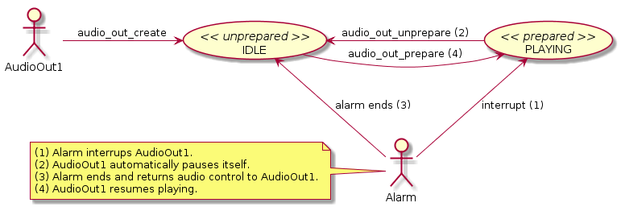
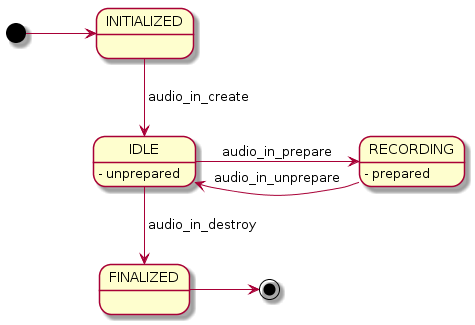
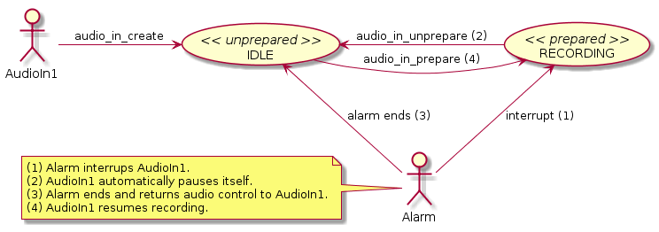

# Raw Audio Playback and Recording


The Pulse Code Modulated (PCM) data contains non-compressed audio. You can play and record uncompressed audio data both synchronously and asynchronously.

The main uncompressed audio management features are:

- Playing uncompressed audio

  Enables you to play [uncompressed audio](#play_pcm) in your application.

- Recording uncompressed audio

  You can [record uncompressed audio](#record_pcm) synchronously or asynchronously.

<a name="play_pcm"></a>
## Audio Output

The Audio Output API (in [mobile](../../api/mobile/latest/group__CAPI__MEDIA__AUDIO__OUT__MODULE.html) and [wearable](../../api/wearable/latest/group__CAPI__MEDIA__AUDIO__OUT__MODULE.html) applications) enables your application to play such data using output devices. You can [play audio synchronously](#simple_playback), or [do it asynchronously](#async_playback).

To play the audio PCM data, the application must call the `audio_out_create()` function to initialize the audio output handle.

Your application must define the following PCM data settings:

- Audio channels:
  - Mono (1 channel)
  - Stereo (2 channels)
- Audio sample type:
  - Unsigned 8-bit PCM
  - Signed 16-bit little endian PCM
- Audio sample rate:
  - 8000 ~ 48000 Hz

The following figures illustrate the general audio output states, and how the state changes when the audio output is interrupted by the system.

**Figure: Audio output states**


**Figure: Audio output states when interrupted by system**



### Using Audio Output

For supporting various low-end Tizen devices, the application must follow certain guidelines:

- Do not use multiple instances of the Audio Output excessively.
  - Using excessive multiple instances of the Audio Output has a negative effect on the application, because the audio data processing for re-sampling and mixing imposes a heavy burden on the system.
- Use device-preferred PCM format.
  - To reduce the processing overhead inside, use the target device-preferred PCM format (for example, signed 16-bit little endian, stereo, 44100 Hz).
  - Using the preferred format reduces internal operations, such as converting audio samples from mono to stereo or re-sampling audio frequency to fit the target device's input sample rate.
- Do not call the Audio Output functions too frequently.
  - The Audio Output functions require more time while repeated in the order of `audio_out_create()` > `audio_out_prepare()` > `audio_out_unprepare()` > `audio_out_destroy()`. Therefore, keep the frequency of calling these functions to a minimum. Note that the `audio_out_prepare()` and `audio_out_unprepare()` functions are much faster than `audio_out_create()` and `audio_out_destroy()`.
- Reduce event delay and remove glitches.
  - The Audio Output API works recursively with events. The smaller the buffer size, the more often are events generated. If you use the Audio Output API with the smallest buffer and other resources (for example, a timer or sensor), the application is negatively influenced by the delay of the event. To prevent problems, set the write buffer size properly based on the other resources you need.
  - To guarantee the working events of the Audio Output API independently, an instance of the Audio Output API needs to be created and worked on the event thread.
- Use double-buffering.
  - Use the double buffering mechanism to reduce latency. The mechanism works by first writing data twice before starting. After starting, whenever the listener (event) is called, you can write additional data.
- Save power.
  - If the Audio Output does not play for a long time for some reason, such as the screen turning off or idle playback, call the `audio_out_unprepare()` function to pause the stream and save power. The device cannot go to sleep while in the PLAYING state.

<a name="record_pcm"></a>
## Audio Input

The Audio Input API (in [mobile](../../api/mobile/latest/group__CAPI__MEDIA__AUDIO__IN__MODULE.html) and [wearable](../../api/wearable/latest/group__CAPI__MEDIA__AUDIO__IN__MODULE.html) applications) enables your application to record such data from a microphone type input device. You can [record audio synchronously](#simple_recording), or [do it asynchronously](#async_recording).

Audio data is captured periodically, so to receive the audio PCM data from the input device, you must implement the audio input interface to notify the application of audio data events, such as the end of filling audio data.

Before recording audio, you must define the following PCM data settings:

- Input device type:
  - Microphone
- Audio channels:
  - Mono (1 channel)
  - Stereo (2 channels)
- Audio sample type:
  - Unsigned 8-bit PCM
  - Signed 16-bit little endian PCM
- Audio sample rate:
  - 8000 ~ 48000 Hz

To minimize the overhead of the audio input API, use the optimal channel type, sample type and sampling rate, which can be retrieved using the `audio_in_get_channel()`, `audio_in_get_sample_type()` and `audio_in_get_sample_rate()` functions, respectively.

The following figures illustrate the general audio input states, and how the state changes when the audio input is interrupted by the system.

**Figure: Audio input states**



**Figure: Audio input states when interrupted by system**



## Prerequisites

To enable your application to use the uncompressed audio functionality:

1. To use the functions and data types of the Audio I/O (in [mobile](../../api/mobile/latest/group__CAPI__MEDIA__AUDIO__IO__MODULE.html) and [wearable](../../api/wearable/latest/group__CAPI__MEDIA__AUDIO__IO__MODULE.html) applications) and Sound Manager (in [mobile](../../api/mobile/latest/group__CAPI__MEDIA__SOUND__MANAGER__MODULE.html) and [wearable](../../api/wearable/latest/group__CAPI__MEDIA__SOUND__MANAGER__MODULE.html) applications) APIs, include the `<audio_io.h>` and `<sound_manager.h>` header files in your application:

   ```
   #include <audio_io.h>
   #include <sound_manager.h>
   ```

2. To initialize the audio input and output devices, use the `audio_in_create()` and `audio_out_create()` functions:

   ```
   /* Define the sample rate for recording audio */
   #define SAMPLE_RATE 44100

   /* Declare the variable used for checking function results */
   audio_io_error_e error_code;

   /* Initialize the audio input device */
   audio_in_h input;

   error_code = audio_in_create(SAMPLE_RATE, AUDIO_CHANNEL_MONO, AUDIO_SAMPLE_TYPE_S16_LE, &input);

   /* Initialize the audio output device */
   audio_out_h output;

   error_code = audio_out_create(SAMPLE_RATE, AUDIO_CHANNEL_MONO, AUDIO_SAMPLE_TYPE_S16_LE, SOUND_TYPE_SYSTEM, &output);
   ```

   The audio input and output devices support the channel types defined in the `audio_channel_e` enumeration (in [mobile](../../api/mobile/latest/group__CAPI__MEDIA__AUDIO__IO__MODULE.html#ga4e07ead99d581a0a049e8ee632b858b4) and [wearable](../../api/wearable/latest/group__CAPI__MEDIA__AUDIO__IO__MODULE.html#ga4e07ead99d581a0a049e8ee632b858b4) applications), and the sample types defined in the `audio_sample_type_e` enumeration (in [mobile](../../api/mobile/latest/group__CAPI__MEDIA__AUDIO__IO__MODULE.html#ga1e66f976b2890f5fc2e9e6ec71af7536) and [wearable](../../api/wearable/latest/group__CAPI__MEDIA__AUDIO__IO__MODULE.html#ga1e66f976b2890f5fc2e9e6ec71af7536) applications). For playing the recorded audio, use the same channel and sample type on both audio devices.

   The sound types are defined in the `sound_type_e` enumeration (in [mobile](../../api/mobile/latest/group__CAPI__MEDIA__SOUND__MANAGER__VOLUME__MODULE.html#gab0b52eeab59765b94c7a751097738a0b) and [wearable](../../api/wearable/latest/group__CAPI__MEDIA__SOUND__MANAGER__VOLUME__MODULE.html#gab0b52eeab59765b94c7a751097738a0b) applications). You can select the sound type according to the audio sample type.

<a name="simple_playback"></a>
## Managing Synchronous Playback

You can [play an audio sample](#playing) and [modify the volume of the playback](#modify).

<a name="playing"></a>
### Playing an Audio Sample

The synchronous playback process blocks other processes running in the same thread. Launching a playback process from the main thread of the application can make the application unresponsive. To prevent this, launch the playback process from its own thread. For example, in this use case, the playback process is run inside the `synchronous_playback()` function, which is executed in a separate thread using the `ecore_thread_run()` function:

```
ecore_thread_run(synchronous_playback, NULL, NULL, NULL);
```

To play audio:

1. Prepare the audio output device and start the playback process using the `audio_out_prepare()` function:

   ```
   /* Prepare the audio output device (starts the hardware playback process) */
   error_code = audio_out_prepare(output);
   ```

   The hardware device prepares its internal output buffer for playback. Playback begins when the internal output buffer starts receiving audio data.

2. To start playing the recorded audio, copy the audio data from the local buffer to the internal output buffer using the `audio_out_write()` function:

   ```
   /* Copy the audio data from the local buffer to the internal output buffer */
   int bytes_number = audio_out_write(output, buffer, buffer_size);
   ```

   The returned value represents the number of bytes written to the internal output buffer. A negative value represents an error code.

   The `audio_out_write()` function behaves in a similar manner to the `audio_in_read()` function.

3. After all data has been copied to the internal output buffer, release the memory allocated to the local buffer using the `free()` function:

   ```
   /* Release the memory allocated to the local buffer */
   free(buffer);
   ```

4. Stop the playback process using the `audio_out_unprepare()` function:

   ```
   /* Stop the hardware playback process */
   error_code = audio_out_unprepare(output);
   ```

5. After you have finished working with the audio output device, deinitialize it using the `audio_out_destroy()` function:

   ```
   /* Deinitialize the audio output device */
   error_code = audio_out_destroy(output);
   ```

<a name="modify"></a>
### Modifying the Audio Sample Volume

> **Note**
>
> Modifying the volume only works if you have not emptied the local buffer or deinitialized the input audio device.

To modify the volume of the audio sample stored in the local buffer:

```
#define MIN_2BYTES_SIGNED (−32768)
#define MAX_2BYTES_SIGNED 32767

void
modify_sound()
{
    /* Retrieve the sample type of the input */
    audio_sample_type_e sample_type;

    int error_code = audio_in_get_sample_type(input, &sample_type);
    if (error_code != AUDIO_IO_ERROR_NONE) {
        dlog_print(DLOG_ERROR, LOG_TAG, "audio_in_get_sample_type() failed! Error code = %d", error_code);

        return;
    }

    uint8_t *index = (uint8_t*)buffer;
    while (index < (((uint8_t*)buffer) + buffer_size)) {
        if (AUDIO_SAMPLE_TYPE_S16_LE == sample_type) {
            /* Use the int16_t type, because it is 2 bytes long */
            int16_t *value = (int16_t*)index;

            /* Make the sample louder */
            int32_t tmp = (*value) * 8; /* 8 times louder... (on dB scale much louder) */
            if (tmp > MAX_2BYTES_SIGNED)
                tmp = MAX_2BYTES_SIGNED;
            if (tmp < MIN_2BYTES_SIGNED)
                tmp = MIN_2BYTES_SIGNED;
            (*value) = tmp;
        } else {
            /* Use the uint8_t type, because it is 1 byte long */
            uint8_t *value = (uint8_t*)index;

            /* Make the sample louder */
            uint16_t tmp = (*value) * 8; /* 8 times louder... (on dB scale much louder) */
            if (tmp > 255)
                tmp = 255;
            (*value) = tmp;
        }

        /* Go to the next sample */
        index += sample_type == AUDIO_SAMPLE_TYPE_S16_LE ? 2 : 1;
    }

    dlog_print(DLOG_DEBUG, LOG_TAG, "Volume of the synchronous recording increased.");
}
```

In this example, the volume is significantly increased. You can also make other modifications to the audio sample playback.

<a name="async_playback"></a>
## Managing Asynchronous Playback

Playing audio asynchronously involves:

1. [Starting asynchronous playback](#start)
2. [Stopping asynchronous playback](#stop_async)

<a name="start"></a>
### Starting Asynchronous Playback

The asynchronous playback process uses a callback function for playing the recorded audio. The callback function is invoked asynchronously for each chunk of recorded audio. In this use case, the audio data is read from a file rather than a local buffer.

To start playing the recorded audio:

1. Set the callback function using the `audio_out_set_stream_cb()` function:

   ```
   /* Set a callback invoked asynchronously for each chunk of stored (recorded) audio */
   error_code = audio_out_set_stream_cb(output, _audio_io_stream_write_cb, NULL);
   ```

2. Open the file where the audio data is stored:

   ```
   #include <storage.h>

   /* Prepare the file where the recorded audio data is stored */
   char io_stream_r_path[200];
   char *storage_path;
   /* You can find the storage ID using the storage_foreach_device_supported() function */
   int error = storage_get_directory(storage_id, STORAGE_DIRECTORY_SOUNDS, &storage_path);
   snprintf(io_stream_r_path, 200, "%s/%s", storage_path, "pcm_w.raw");
   free(storage_path);

   FILE* fp_r = fopen(io_stream_r_path, "r");
   ```

   The `storage_get_directory()` function of the Storage API retrieves the storage path based on the storage ID. To retrieve the storage ID, use the `storage_foreach_device_supported()` function of the Storage API.

3. Prepare the audio output device and start the playback process using the `audio_out_prepare()` function:

   ```
   /* Prepare the audio output device (starts the hardware playback process) */
   error_code = audio_out_prepare(output);
   ```

   The hardware device prepares its internal output buffer for playback.

4. To play the audio from the file (inside the callback function):

   1. Allocate a local buffer for the audio data using the `malloc()` function. The function returns a pointer to the buffer. Reset the buffer by filling it with zeros using the `memset()` function.
   2. Read audio data from the file and store the data in the local buffer using the `fread()` function.
   3. Copy the audio data from the local buffer to the internal output buffer using the `audio_out_write()` function. Playback begins when the internal output buffer starts receiving the audio data.
   4. Release the memory allocated to the local buffer using the `free()` function.

   ```
   /* Callback invoked for each chunk of stored (recorded) audio */
   void
   _audio_io_stream_write_cb(audio_out_h handle, size_t nbytes, void *userdata)
   {
       char * buffer = NULL;

       if (nbytes > 0) {
           /* Allocate and reset a local buffer for reading the audio data from the file */
           buffer = malloc(nbytes);
           memset(buffer, 0, nbytes);

           /* Read audio data from the file and store it in the local buffer */
           fread(buffer, sizeof(char), nbytes, fp_r);

           /*
              Copy the audio data from the local buffer
              to the internal output buffer (starts playback)
           */
           int data_size = audio_out_write(handle, buffer, nbytes);

           if (data_size < 0)
               dlog_print(DLOG_ERROR, LOG_TAG, "audio_out_write() failed! Error code = %d", data_size);

           /* Release the memory allocated to the local buffer */
           free(buffer);
       }
   }
   ```

<a name="stop_async"></a>
### Stopping Asynchronous Playback

To stop playing the recorded audio:

1. Stop the playback process using the `audio_out_unprepare()` function:

   ```
   /* Stop the hardware playback process */
   error_code = audio_out_unprepare(output);
   ```

   The device no longer invokes the callback function.

2. If you no longer need asynchronous playback, or if you want to set the callback function separately for each asynchronous playback session, unset the callback function using the `audio_out_unset_stream_cb()` function:

   ```
   /* Unset the callback function used for asynchronous playback */
   error_code = audio_out_unset_stream_cb(output);
   ```

3. After you have finished working with the audio output device, deinitialize it using the `audio_out_destroy()` function:

   ```
   /* Deinitialize the audio output device */
   error_code = audio_out_destroy(output);
   ```

4. Close the file where the recorded audio is stored using the `fclose()` function:

   ```
   /* Close the file used for asynchronous playback */
   error_code = fclose(fp_r);
   fp_r = NULL;
   ```

<a name="simple_recording"></a>
## Managing Synchronous Recording

Recording audio synchronously involves:

1. [Creating a local buffer for storing the audio data](#set)
2. [Recording an audio sample](#record)

<a name="set"></a>
### Creating a Buffer for Audio Data

Before starting the synchronous recording process, you need to create a local buffer for storing the audio data. To create the buffer, you need to know its required size based on the expected duration of the recording, since the recording process ends when the buffer is full.

To determine the required buffer size, use one of the following options:

- To determine the required buffer size based on what is recommended by the Audio I/O API:

  1. Retrieve the recommended buffer size using the `audio_in_get_buffer_size()` function. The function retrieves the buffer size recommended by the sound server (such as PulseAudio).

     ```
     int buffer_size;

     error_code = audio_in_get_buffer_size(input, &buffer_size);
     ```

     If no error occurs, the `buffer_size` parameter returns the preferred size of the buffer that must be allocated (in bytes), based on the specified audio parameters.

     The recommended buffer size depends on the device. The size can be different for TV, mobile, and wearable devices.

  2. Set the buffer size to correspond to the desired duration of the recording.

     For example, for the device used in creating this example code, the `audio_in_get_buffer_size()` function returns the recommended buffer size for 100 milliseconds of recording time. To determine the actual, required buffer size in seconds, multiply the recommended buffer size by 10 (to increase the duration from 100 milliseconds to 1 second) and by the number of seconds the recording lasts (here, 5 seconds):

     ```
     #define RECORDING_SEC 5

     buffer_size *= 10 * RECORDING_SEC;
     ```

- To explicitly calculate the required buffer size:

  1. Retrieve the audio channel type using the `audio_in_get_channel()` function:

     ```
     audio_channel_e channel;

     error_code = audio_in_get_channel(input, &channel);
     ```

  2. Retrieve the audio sample type using the `audio_in_get_sample_type()` function:

     ```
     audio_sample_type_e sample_type;

     error_code = audio_in_get_sample_type(input, &sample_type);
     ```

  3. Calculate the buffer size based on the retrieved information:

     ```
     int buffer_size = SAMPLE_RATE * (channel == AUDIO_CHANNEL_STEREO ? 2 : 1) * (sample_type == AUDIO_SAMPLE_TYPE_S16_LE ? 2 : 1);
     ```

  4. Multiply the buffer size by the number of seconds the recording lasts:

     ```
     buffer_size *= RECORDING_SEC;
     ```

After determining the required buffer size, allocate the memory to the buffer using the `malloc()` function:

```
void *buffer = malloc(buffer_size);
```

You have created the local buffer for storing the audio data. You can now start the synchronous recording process.

<a name="record"></a>
### Recording an Audio Sample

The synchronous recording process blocks other processes running in the same thread. Launching a recording process from the main thread of the application can make the application unresponsive. To prevent this, launch the recording process from its own thread. For example, in this use case, the recording process is run inside the `synchronous_playback()` function, which is executed in a separate thread using the `ecore_thread_run()` function:

```
ecore_thread_run(synchronous_playback, NULL, NULL, NULL);
```

To record audio:

1. Prepare the audio input device and start the recording process using the `audio_in_prepare()` function:

   ```
   /* Prepare the audio input device (starts the hardware recording process) */
   error_code = audio_in_prepare(input);
   ```

   The hardware device starts buffering the audio recorded by the audio input device. The audio data is buffered to the internal input buffer.

2. Copy the audio data from the internal input buffer to the local buffer using the `audio_in_read()` function:

   ```
   /* Copy the audio data from the internal input buffer to the local buffer */
   int bytes_number = audio_in_read(input, buffer, buffer_size);
   ```

   The returned value represents the number of bytes read from the internal input buffer. A negative value represents an error code.

   The `audio_in_read()` function can behave in the following ways:

   - If the function is called immediately after preparing the audio input device, the function blocks the thread it is launched from until the local buffer is full.
   - If the function is called with a delay long enough to allow the internal input buffer to store more audio data than the local buffer can hold, the function executes immediately without blocking its thread.

   The `audio_in_read()` function fills the local buffer by copying audio data from the internal input buffer. If the internal input buffer does not contain enough data to fill up the local buffer, the function waits until enough data is recorded. If you want to start recording audio immediately after clicking a button, call the `audio_in_prepare()` function just before the `audio_in_read()` function inside the same button callback function. If you prepare the audio input device earlier in a separate function and only run the `audio_in_read()` function inside the button callback function, the local buffer is filled with audio data recorded before the button is clicked.

3. Stop the recording process using the `audio_in_unprepare()` function:

   ```
   /* Stop the hardware recording process */
   error_code = audio_in_unprepare(input);
   ```

4. After you have finished working with the audio input device, deinitialize it using the `audio_in_destroy()` function:

   ```
   /* Deinitialize the audio input device */
   error_code = audio_in_destroy(input);
   ```

<a name="async_recording"></a>
## Managing Asynchronous Recording

Recording audio asynchronously involves:

1. [Starting asynchronous recording](#async_rec)
2. [Stopping asynchronous recording](#stop)

<a name="async_rec"></a>
### Starting Asynchronous Recording

The asynchronous recording process uses a callback function for storing the audio recorded by the audio input device. The callback function is invoked asynchronously for each chunk of recorded audio. In this use case, the audio data is stored in a file rather than a local buffer.

To start recording audio:

1. Set the callback function using the `audio_in_set_stream_cb()` function. Use this function before calling the `audio_in_prepare()` function, because otherwise the callback function is never invoked.

   ```
   /* Set a callback invoked asynchronously for each chunk of recorded audio */
   error_code = audio_in_set_stream_cb(input, _audio_io_stream_read_cb, NULL);
   ```

2. Create and open the file for storing the audio data:

   ```
   #include <storage.h>

   /* Prepare the file where the recorded audio data is stored */
   char io_stream_w_path[200];
   char *storage_path;
   /* You can find the storage ID using the storage_foreach_device_supported() function */
   int error = storage_get_directory(storage_id, STORAGE_DIRECTORY_SOUNDS, &storage_path);
   snprintf(io_stream_w_path, 200, "%s/%s", storage_path, "pcm_w.raw");
   free(storage_path);

   FILE* fp_w = fopen(io_stream_w_path, "w");
   if (!fp_w)
       dlog_print(DLOG_ERROR, LOG_TAG, "fopen() function failed while opening %s file!", io_stream_w_path);
   ```

   The `storage_get_directory()` function of the Storage API (in [mobile](../../api/mobile/latest/group__CAPI__SYSTEM__STORAGE__MODULE.html) and [wearable](../../api/wearable/latest/group__CAPI__SYSTEM__STORAGE__MODULE.html) applications) retrieves the storage path based on the storage ID. To retrieve the storage ID, use the `storage_foreach_device_supported()` function of the Storage API.

3. Prepare the audio input device and start the recording process using the `audio_in_prepare()` function:

   ```
   /* Prepare the audio input device (starts the hardware recording process) */
   error_code = audio_in_prepare(input);
   ```

   The hardware device starts buffering the audio recorded by the audio input device. The audio data is buffered to the internal input buffer. The callback function is invoked separately for each chunk of audio data.

4. To store the recorded audio data in the file (inside the callback function):

   1. Retrieve a pointer to the internal input buffer and the number of recorded audio data bytes using the `audio_in_peek()` function.
   2. Retrieve the recorded audio data from the internal input buffer and store it in the file using the `fwrite()` function.
   3. Remove the recorded audio data, since it is no longer needed, from the internal input buffer using the `audio_in_drop()` function.

   ```
   /* Callback invoked for each chunk of recorded audio */
   void
   _audio_io_stream_read_cb(audio_in_h handle, size_t nbytes, void *userdata)
   {
       const void * buffer = NULL;

       if (nbytes > 0) {
           /*
              Retrieve a pointer to the internal input buffer
              and the number of recorded audio data bytes
           */
           int error_code = audio_in_peek(handle, &buffer, &nbytes);
           if (error_code != AUDIO_IO_ERROR_NONE) {
               dlog_print(DLOG_ERROR, LOG_TAG, "audio_in_peek() failed! Error code = %d", error_code);

               return;
           }

           /* Store the recorded audio data in the file */
           fwrite(buffer, sizeof(char), nbytes, fp_w);

           /* Remove the recorded audio data from the internal input buffer */
           error_code = audio_in_drop(handle);
           if (error_code != AUDIO_IO_ERROR_NONE)
               dlog_print(DLOG_ERROR, LOG_TAG, "audio_in_drop() failed! Error code = %d", error_code);
       }
   }
   ```

<a name="stop"></a>
### Stopping Asynchronous Recording

To stop recording audio:

1. Stop the recording process using the `audio_in_unprepare()` function:

   ```
   /* Stop the hardware recording process */
   error_code = audio_in_unprepare(input);
   ```

   The device no longer invokes the callback function.

2. If you no longer need asynchronous recording, or if you want to set the callback function separately for each asynchronous recording session, unset the callback function using the `audio_in_unset_stream_cb()` function:

   ```
   /* Unset the callback function used for asynchronous recording */
   error_code = audio_in_unset_stream_cb(input);
   ```

3. After you have finished working with the audio input device, deinitialize it using the `audio_in_destroy()` function:

   ```
   /* Deinitialize the audio input device */
   error_code = audio_in_destroy(input);
   ```

4. Close the file where the recorded audio is stored using the `fclose()` function:

   ```
   /* Close the file used for asynchronous recording */
   error_code = fclose(fp_w);
   fp_w = NULL;
   ```

## Related Information
- Dependencies
  - Tizen 2.4 and Higher for Mobile
  - Tizen 2.3.1 and Higher for Wearable
