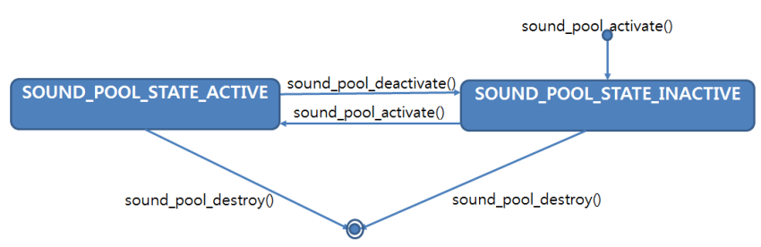
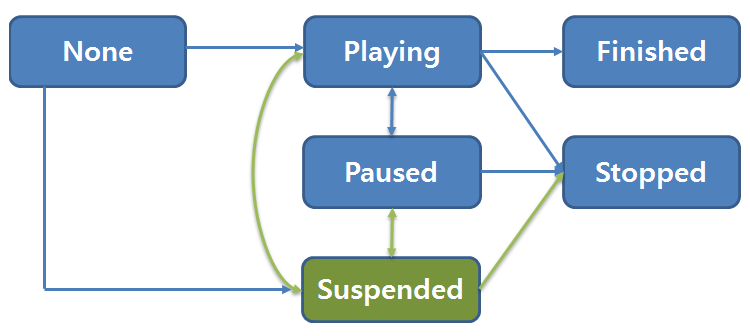

# Sound Pools

You can use sound pools, which are basically collections of sounds. You can load multiple sound sources to a sound pool and manage their playback as a group.

The main features of the Sound Pool API include:
-   Sound pools

    Sound pools are isolated environments in which sound streams can be managed. You can use sound pools to manage sounds as groups instead of as individual sound instances. You can consider each sound pool as a sound resources dictionary.

    You can manage the playback for all sound streams inside a sound pool simultaneously. For example, you can control the volume level using the `sound_pool_set_volume()` function. Sound stream playback is only allowed when the [sound pool is active](#sound-pool-and-sound-stream-states).

-   Sound sources

    Sound sources consist of audio resources. Before playback, you must [load the audio resources](#using-sound-pools) from files to the sound pool using the `sound_pool_load_source_from_file()` function. When a sound source is added to a sound pool, the audio data is loaded and cached in memory for playback.

    Each sound source is identified by a C-string tag, which must be defined when loading it and which can be used to access the sound source within the pool. Sound source tags must be unique within the sound pool.

    The supported audio formats are WAV and OGG. If the file format is unsupported or the file is corrupted, the `sound_pool_load_source_from_file()` function returns the `SOUND_POOL_ERROR_INVALID_OPERATION` exception.

-   Sound streams

    Sound streams are instances of sound sources. After sound sources are loaded into a sound pool, you can create sound stream objects from them and start sound stream playback, using the `sound_pool_stream_play()` function. You can play a sound stream, mute or suspend playback, and manage the playback parameters, such as volume level, looping, and playback priority. When sound stream playback is finished, the resources allocated to it are automatically released.

    Each sound stream is assigned an integer identifier unique within the sound pool. While the sound stream exists, you can access it with the identifier.

The basic sound pool operation consists of creating and activating a sound pool, loading sound sources from the file system to the sound pool, and controlling the playback of the sound source instances (sound streams).

## Sound Pool and Sound Stream States

The main property of a sound pool is its activation state, which can be either `SOUND_POOL_STATE_ACTIVE` or `SOUND_POOL_STATE_INACTIVE`. You can transition between states using the `sound_pool_activate()` and `sound_pool_deactivate()` functions.

**Figure: Sound pool state changes**



The following figure illustrates the available sound stream states and state changes. The sound stream states are related to the sound pool states so that when the sound pool is inactive, the sound stream state is always `SOUND_POOL_STREAM_STATE_SUSPENDED`. When the sound pool is active, the sound stream transitions between its other states.

**Figure: Sound stream state changes**



When a sound stream is created with the `sound_pool_stream_play()` function, its state is `SOUND_POOL_STREAM_STATE_SUSPENDED` in an inactive sound pool, or `SOUND_POOL_STREAM_STATE_PLAYING` in an active sound pool. Using the sound pool handle and the unique sound stream identifier, you can control sound stream playback with the `sound_pool_stream_pause()`, `sound_pool_stream_resume()`, and `sound_pool_stream_stop()` functions.

When a sound pool becomes inactive, all currently-playing sound streams in the sound pool change to the `SOUND_POOL_STREAM_STATE_SUSPENDED` state. When a sound pool is activated, the highest-priority sound stream group inside the pool changes from the `SOUND_POOL_STREAM_STATE_SUSPENDED` to the `SOUND_POOL_STREAM_STATE_PLAYING` state.

When a sound stream reaches the `SOUND_POOL_STREAM_STATE_STOPPED` or the `SOUND_POOL_STREAM_STATE_FINISHED` state, all resources that were allocated for its playback are freed, and the unique identifier becomes invalid. To be notified of state changes, you can register a callback with the `sound_pool_stream_set_state_change_callback()` function or with a parameter of the `sound_pool_stream_play()` function.

## Prerequisites

To use the functions and data types of the Sound Pool API (in [mobile](../../api/mobile/latest/group__CAPI__SOUND__POOL__MODULE.html) and [wearable](../../api/wearable/latest/group__CAPI__SOUND__POOL__MODULE.html) applications), include the `<sound_pool.h>` and `<sound_pool_type.h>` header files in your application:

```
#include <sound_pool.h>
#include <sound_pool_type.h>
```

## Using Sound Pools

To manage playback with sound pools:
1.  Create a sound pool:

    ```
    sound_pool_h sound_pool = NULL;
    if (SOUND_POOL_ERROR_NONE != sound_pool_create(&sound_pool))
        goto error;
    ```

2.  Load a sound source to the sound pool.

    In this example, a WAV file is loaded with the "src1" tag:

    ```
    if (SOUND_POOL_ERROR_NONE != sound_pool_load_source_from_file(sound_pool, "/opt/usr/sample.wav", "src1"))
        goto error;
    ```

3.  Activate the sound pool:

    ```
    if (SOUND_POOL_ERROR_NONE != sound_pool_activate(sound_pool))
        goto error;
    ```

4.  Start stream playback from the sound source with the desired parameters:

    ```
    unsigned sid1;
    if (SOUND_POOL_ERROR_NONE != sound_pool_stream_play(sound_pool, "src1", 1, 1.0, 255,
                                                        SOUND_POOL_STREAM_PRIORITY_POLICY_MUTE,
                                                        NULL, NULL, &sid1))
        goto error;

    sleep(N); /* Wait until the stream playback finishes */
    ```

    The streams have a set of parameters that define their playback properties. The `sound_pool_stream_play()` function call has 5 properties that you can configure: loop, volume, priority, stream state change callback, and priority policy.

    -   The loop property defines the number of times the stream repeats playback before finishing and releasing its resources. If this property is set to 0, the stream repeats indefinitely until the `loop` property is changed, the `sound_pool_stream_stop()` function is called, or the sound pool is destroyed.
    -   The volume property is a relative volume level between 0.0 and 1.0, where 0.0 is fully muted (no sound) and 1.0 is maximum volume. The actual playback volume is also affected by the sound pool volume. For example, if the sound pool volume is 0.8 and the sound stream volume is 0.5, the resulting volume level is `0.8 * 0.5 = 0.4` of the maximum possible volume. The volume can also be set using the `sound_pool_stream_set_volume()` function, and the current volume can be retrieved with the `sound_pool_stream_get_volume()` function.
    -   The priority property determines which sound streams are to be played in the active sound pool. The stream priority can also be set using the `sound_pool_stream_set_priority()` function, and the current priority can be retrieved with the `sound_pool_stream_get_priority()` function.
    -   The priority policy property determines whether the stream follows the priority rules or simply mutes its playback. If the priority policy is `SOUND_POOL_STREAM_PRIORITY_POLICY_SUSPENDED`, only the streams with the highest priority, that are not in the `SOUND_POOL_STREAM_STATE_PAUSED` state, can be in the `SOUND_POOL_STREAM_STATE_PLAYING` state. Sound streams with lower priority values are put in the `SOUND_POOL_STREAM_STATE_SUSPENDED` state.

        If the priority policy is set to `SOUND_POOL_STREAM_PRIORITY_POLICY_MUTE`, the stream continues playing, muted, instead of being suspended in the presence of higher-priority streams.

5.  When no longer needed, unload the sound source:

    ```
    if (SOUND_POOL_ERROR_NONE != sound_pool_unload_source(sound_pool, "src1"))
        goto error;
    ```

6.  When no longer needed, deactivate the sound pool and free the resources. Any still loaded sound sources are automatically unloaded from memory.

    ```
    if (SOUND_POOL_ERROR_NONE != sound_pool_deactivate(sound_pool))
        goto error;

    if (SOUND_POOL_ERROR_NONE != sound_pool_destroy(sound_pool))
        goto error:

    error: /* Error handling */
    ```

## Related Information
- Dependencies
    - Tizen 4.0 and Higher for Mobile
    - Tizen 4.0 and Higher for Wearable
