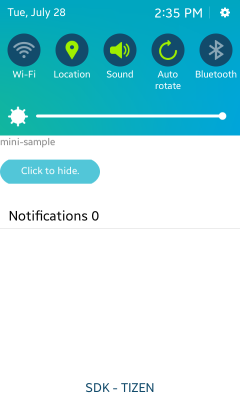

# Minicontrol Window


Minicontrol is a small application view that can be shown on the quick panel or lock screen.

This feature is supported in mobile applications only.

The main features of the Minicontrol API include:

- Creating a minicontrol

  You can [create minicontrols](#create) using the Minicontrol provider API:

  - To create a minicontrol, use the `minicontrol_create_window()` function, which returns an `Evas_Object` of the minicontrol window.
  - To send a request, use the `minicontrol_send_event()` function to get a minicontrol handle and set the details. You can use the same function to [hide the quick panel](#hide), when needed.

- Hosting minicontrols

  You can host minicontrols, such as lock screens, on your application using the Minicontrol viewer API:

  - To host minicontrols, use the `minicontrol_viewer_set_event_cb()` function to listen for the request from minicontrol providers.
  - When you get the creation request from a minicontrol provider, use the `minicontrol_viewer_add()` function to add the minicontrol on your application.

**Figure: Minicontrol on a quick panel (left) and lock screen (right)**

 

## Prerequisites

To enable your application to use the minicontrol functionality:

1. To use the [Minicontrol](../../api/mobile/latest/group__MINICONTROL__LIBRARY.html) API, the application has to request permission by adding the following privilege to the `tizen-manifest.xml` file:

    ```
    <privileges>
       <privilege>http://tizen.org/privilege/minicontrol.provider</privilege>
    </privileges>
    ```

2. To use the functions and data types of the Minicontrol API, include the `<minicontrol_provider.h>` header file in your application:

   ```
   #include <minicontrol_provider.h>
   ```
<a name="create"></a>
## Creating a Minicontrol on the Quick Panel

To create a minicontrol of your application:

1. To create a minicontrol, use the `minicontrol_create_window()` function.

   To create a minicontrol on the quick panel, the second parameter must be set to `MINICONTROL_TARGET_VIEWER_QUICK_PANEL`.

   ```
   Evas_Object *win;

   win = minicontrol_create_window("mini-sample", MINICONTROL_TARGET_VIEWER_QUICK_PANEL, NULL);
   evas_object_resize(win, 480, 140);
   evas_object_show(win);
   ```

2. Add a text label on the minicontrol using the `elm_label_add()` function:

    ```
    label = elm_label_add(win);
    elm_object_text_set(label, "mini-sample");
    evas_object_resize(label, 480, 140);
    evas_object_show(label);
    ```

<a name="hide"></a>
## Hiding the Quick Panel

To hide the quick panel:

1. Add a button on the minicontrol:

   ```
   button = elm_button_add(win);
   elm_object_text_set(button, "Click to hide.");
   evas_object_move(button, 0, 50);
   evas_object_resize(button, 200, 50);
   evas_object_show(button);
   ```

2. Add an event handler callback function:

   ```
   evas_object_smart_callback_add(button, "clicked", _button_clicked_cb, win);
   ```

3. Define the callback function for hiding the quick panel:

   ```
   static void
   _button_clicked_cb(void *data, Evas_Object *obj, void *event_info)
   {
       Evas_Object *win = data;
       minicontrol_send_event(win, MINICONTROL_PROVIDER_EVENT_REQUEST_HIDE, NULL);
   }
   ```

**Figure: Minicontrol button for hiding the quick panel**



## Related Information
- Dependencies
  - Tizen 2.4 and Higher for Mobile
