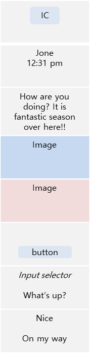

# Expandable Notifications


An application can use expandable notifications to inform users about important information. The expandable notifications are large and combined notifications containing text, image, and chat messages, which can be created by Notification EX API.

The main features of the Notification EX API include:

- [Creating a notification item](#create) with several items to several receiver groups.

- [Creating multiple items in a group](#group) in a specific order.

- [Setting notification attributes](#set) such as action, style, receiver group, main type, and so on.

- [Creating an expanded notification](#expanded).

- [Creating a messaging style notification](#messaging).

- [Posting single notification and multiple notifications](#post).

- [Updating the content of a notification](#update).

- [Deleting notifications](#delete) when no longer needed.

## Prerequisites

To enable your application to use the Notification EX API functionality:

1. To use the Notification EX API (in [mobile](../../api/mobile/latest/group__NOTIFICATION__EX__MODULE.html) and [wearable](../../api/wearable/latest/group__NOTIFICATION__EX__MODULE.html) applications), the application has to request permission by adding the following privilege to the `tizen-manifest.xml` file:
    ```
    <privileges>
        <privilege>http://tizen.org/privilege/notification</privilege>
        <!--To launch an application by app_control handler-->
        <privilege>http://tizen.org/privilege/appmanager.launch</privilege>
    </privileges>
    ```

2. To use the functions and data types of the Notification EX API, include the `<notification_ex.h>` header file in your application:
    ```
    #include <notification_ex.h>
    ```

   To ensure that a notification function has been executed properly, make sure that the return is equal to `NOTI_EX_ERROR_NONE`.

3. To follow the example mentioned in this guide, place an image file in the shared resource directory of your application. In addition, use the following variables in your code:
    ```
    char *image_path[BUFLEN];
    char *shared_path = app_get_shared_resource_path();
    snprintf(image_path, BUFLEN, "%stutorial_native_api_application.png", shared_path);
    free(shared_path);
    ```

<a name="create"></a>
## Create Expandable Notification Items

Each element in a notification is an item such as text, image, time and so on.
An item can be a notification by itself, and each item can be combined to create a group notification.

- Text Item:

  This item can set text and hyperlinks. Text items can also be used for titles and contents.
    ```
    ret = noti_ex_item_text_create(&text_item, "text_id", "text", "hyperlink");
    if (ret != NOTI_EX_ERROR_NONE)
        /* Error handling */
    ```

- Image Item:

  This item can set an image or an icon. Image item also contains the path information of an image.
    ```
    ret = noti_ex_item_image_create(&image_item, "image_id", image_path);
    if (ret != NOTI_EX_ERROR_NONE)
        /* Error handling */
    ```

- Button Item:

  This item can add a button.
    ```
    ret = noti_ex_item_button_create(&button_item, "button_id", "button_title");
    if (ret != NOTI_EX_ERROR_NONE)
        /* Error handling */
    ```

- Chat Message Item:

  This item can create a messaging style notification. It is a combination of a text item, an image item, and a time item.
  An application can construct multiple chat message items and display them in bubble format:
    ```
    ret = noti_ex_item_chat_message_create(&chatmessage_item, "message_id", name_handle,
        text_handle, image_handle, time_handle, NOTI_EX_ITEM_CHAT_MESSAGE_TYPE_USER);
    if (ret != NOTI_EX_ERROR_NONE)
        /* Error handling */
    ```

- CheckBox Item:

  This item can provide a user-selectable checkbox that can be toggled. In addition, the select state and clear state can be determined in advance.
    ```
    ret = noti_ex_item_checkbox_create(&checkbox_item, "checkbox_id", "checkbox_title", false);
    if (ret != NOTI_EX_ERROR_NONE)
        /* Error handling */
    ```

- Input Selector Item:

  This item predefines an answer that you can choose from the notification for which a reply is requested.
    ```
    noti_ex_item_h selector_item = NULL;
    ret = noti_ex_item_input_selector_create(&selector_item, "selector_id");
    if (ret != NOTI_EX_ERROR_NONE)
        /* Error handling */

    const char *contents[] = {"What's up?", "On my way", "Nice"};
    ret = noti_ex_item_input_selector_set_contents(selector_item, contents, 3);
    if (ret != NOTI_EX_ERROR_NONE)
        /* Error handling */
    ```

<a name="group"></a>
- Group Item:

  This item can create a group using multiple items. A group item is a series of items. You can add items as the child of the group using `noti_ex_item_group_add_child()`.
  If you add multiple items to the child, the items are displayed in the order that they are added. There can be multiple groups in a notification:
    ```
    noti_ex_item_h group_item = NULL;
    noti_ex_item_h child_item = NULL;

    ret = noti_ex_item_group_create(&group_item, "group_id");
    if (ret != NOTI_EX_ERROR_NONE)
         /* Error handling */

    ret = noti_ex_item_button_create(&child_item, "button_id", "button_title");
    ret = noti_ex_item_group_add_child(group_item, child_item);
    if (ret != NOTI_EX_ERROR_NONE)
        /* Error handling */
    ```

  You can use `noti_ex_item_set_direction()` to decide whether to display the child vertically or horizontally:
    ```
    ret = noti_ex_item_group_set_direction(group_item, true);
    if (ret != NOTI_EX_ERROR_NONE)
        /* Error handling */
    ```

- Entry Item:

  This item can be an input directly from the notification. This is necessary, to make a notification that you can reply to.
    ```
    noti_ex_item_h entry_item = NULL;

    ret = noti_ex_item_entry_create(&entry_item, "entry_id");
    if (ret != NOTI_EX_ERROR_NONE)
        /* Error handling */

    ret = noti_ex_item_entry_set_text(entry_item, "entry_text");
    if (ret != NOTI_EX_ERROR_NONE)
        /* Error handling */
    ```

- Progress Item:

  This item allows you to create a progress bar and update the progress data such as percentage or time.
    ```
    noti_ex_item_h progress_item = NULL;

    ret = noti_ex_item_progress_create(&progress_item, "progress_id", 0, 50, 100);
    if (ret != NOTI_EX_ERROR_NONE)
        /* Error handling */

    ret = noti_ex_item_progress_set_current(progress_item, 70);
    if (ret != NOTI_EX_ERROR_NONE)
        /* Error handling */
    ```

- Time Item:

  This item contains time information.
    ```
    ret = noti_ex_item_time_create(&time_item, "time_id", time_info);
    if (ret != NOTI_EX_ERROR_NONE)
        /* Error handling */
    ```

<a name="set"></a>
## Set Notification EX Attributes

You can set the following attributes for a notification:

- ID:

  All items are identified by an ID attribute. By default, ID is specified while creating an item but it can also be set separately.
    ```
    ret = noti_ex_item_set_id(item_handle, "new_id");
    if (ret != NOTI_EX_ERROR_NONE)
        /* Error handling */
    ```

- Style:

  The style attribute sets the color, padding, and geometry for an item. You can also specify the background image and color.

  - Color

    Color information can be defined as a `notification_ex color` handle with alpha, red, green, and blue value.
    ```
    noti_ex_color_create(noti_ex_color_h *handle, unsigned char a, unsigned char r, unsigned char g, unsigned char b);
    ```

  - Padding

    Padding information can be defined as a `notification_ex padding` handle with left, top, right, and bottom values.
    ```
    noti_ex_padding_create(noti_ex_padding_h *handle, int left, int top, int right, int bottom);
    ```

  - Geometry

    Geometry information can be defined as a `notification_ex geometry` handle with x, y, width, and height values.
    ```
    noti_ex_geometry_create(noti_ex_geometry_h *handle, int x, int y, int w, int h);
    ```

  To set the style attribute, use `noti_ex_item_set_style()`:
    ```
    noti_ex_style_create(noti_ex_style_h *handle, noti_ex_color_h color, noti_ex_padding_h padding, noti_ex_geometry_h geometry);

    ret = noti_ex_item_set_style(item_handle, style);
    if (ret != NOTI_EX_ERROR_NONE)
        /* Error handling */
    ```

- Sound, Vibration and LED:

  To set the sound and vibration attribute for a notification, use `noti_ex_item_set_sound_path()` and `noti_ex_item_set_vibration_path()`:
    ```
    ret = noti_ex_item_set_sound_path(item_handle, "sound_path");
    if (ret != NOTI_EX_ERROR_NONE)
        /* Error handling */

    ret = noti_ex_item_set_vibration_path(item_handle, "vibration_path");
    if (ret != NOTI_EX_ERROR_NONE)
        /* Error handling */
    ```

  To set the LED attribute for a notification, use `noti_ex_led_info_create()` and `noti_ex_led_info_set_on_period()`:

  `noti_ex_led_info_create()` sets the LED operation and the second parameter defines the LED color.
  `noti_ex_led_info_set_on_period()` and `noti_ex_led_info_set_off_period()` sets the time period when the LED is switched on and off.

    ```
    noti_ex_color_create(&color, 0, 0, 0, 0);

    noti_ex_led_info_create(&led_info, color);
    noti_ex_led_info_set_on_period(led_info, 5);
    noti_ex_led_info_set_off_period(led_info, 5);
    ```

- Channel:

  Each notification is displayed by a channel.
    ```
    ret = noti_ex_item_set_channel(item_handle, "channel");
    if (ret != NOTI_EX_ERROR_NONE)
        /* Error handling */
    ```

- Receiver Group:

  If you specify a receiver group that you want to receive, all the viewers in that group receive a notification.
    ```
    ret = noti_ex_item_add_receiver(item_handle, NOTI_EX_RECEIVER_GROUP_INDICATOR);
    if (ret != NOTI_EX_ERROR_NONE)
        /* Error handling */
    ```

  Following are the five viewer types:
  - NOTI_EX_RECEIVER_GROUP_PANEL
  - NOTI_EX_RECEIVER_GROUP_TICKER
  - NOTI_EX_RECEIVER_GROUP_LOCKSCREEN
  - NOTI_EX_RECEIVER_GROUP_INDICATOR
  - NOTI_EX_RECEIVER_GROUP_POPUP

- Visible:

  Determines whether to display the item.
    ```
    ret = noti_ex_item_set_visible(item_handle, true);
    if (ret != NOTI_EX_ERROR_NONE)
        /* Error handling */
    ```

- Action:

  Item can add an action to be performed when the user selects it.
  app control action and visibility action can be set. Can be set for each item.

    ```
    noti_ex_item_h item_handle = NULL;
    noti_ex_action_h action = NULL;

    noti_ex_item_button_create(&item_handle, "button_id", "button_title");

    app_control_create(&app_control);
    app_control_set_app_id(app_control, "appid");
    noti_ex_action_app_control_create(&action, app_control, NULL);

    ret = noti_ex_item_set_action(item_handle, action);
    if (ret != NOTI_EX_ERROR_NONE)
        /* Error handling */

    app_control_destroy(app_control);
    ```

- Main type:

  You can specify a main item among several items. If there are multiple text items and a main item is specified, then you can display the items in particular.
  The main type contains only title, contents, icon, and button.
    ```
    noti_ex_item_h text_item = NULL;
    noti_ex_item_h text_item2 = NULL;
    noti_ex_item_h group_item = NULL;

    noti_ex_item_group_create(&group_item, "group_id");
    noti_ex_item_text_create(&text_item, "text_id", "title", "hyperlink");
    noti_ex_item_text_create(&text_item2, "text_id2", "contents", "hyperlink");
    noti_ex_item_group_add_child(group_item, text_item);
    noti_ex_item_group_add_child(group_item, text_item2);

    ret = noti_ex_item_set_main_type(group_item, "text_id", type);
    if (ret != NOTI_EX_ERROR_NONE)
        /* Error handling */
    ```

<a name="expanded"></a>
## Create Expanded Notification

You can provide a more complex form of notifications and also specify the display order of each item.
The display order of each item depends on the order by which the child is added to the group:

**Figure: Expanded Notification**



  ```
  noti_ex_item_h group_item = NULL;
  noti_ex_item_h image_item_icon = NULL;
  noti_ex_item_h image_item1 = NULL;
  noti_ex_item_h image_item2 = NULL;
  noti_ex_item_h title_item = NULL;
  noti_ex_item_h contents_item = NULL;
  noti_ex_item_h button_item = NULL;
  noti_ex_item_h selector_item = NULL;

  ret = noti_ex_item_image_create(&image_item_icon, "icon_id", icon_path);
  ret = noti_ex_item_image_create(&image_item1, "image_id1", image1_path);
  ret = noti_ex_item_image_create(&image_item2, "image_id2", image2_path);
  ret = noti_ex_item_text_create(&title_item, "title_id", "Jone", NULL);
  ret = noti_ex_item_text_create(&contents_item, "contents_id", "How are you ...", NULL);
  ret = noti_ex_item_button_create(&button_item, "button_id", "button_title");
  ret = noti_ex_item_input_selector_create(&selector_item, "selector_id");
  const char *contents[] = {"What's up?", "Nice",. "On my way"};
  ret = noti_ex_item_input_selector_set_contents(selector_item, contents, 3);

  ret = noti_ex_item_group_create(&group_item, "group_id");
  ret = noti_ex_item_group_add_child(group_item, image_item_icon);
  ret = noti_ex_item_group_add_child(group_item, title_item);
  ret = noti_ex_item_group_add_child(group_item, contents_item);
  ret = noti_ex_item_group_add_child(group_item, image_item1);
  ret = noti_ex_item_group_add_child(group_item, image_item2);
  ret = noti_ex_item_group_add_child(group_item, button_item);
  ret = noti_ex_item_group_add_child(group_item, selector);
  if (ret != NOTI_EX_ERROR_NONE)
      /* Error handling */
  ```

<a name="messaging"></a>
## Create Messaging Style Notification

Since messages with different values can be added to a single notification, you can either show various messages in a single notification or configure it like a chat-room.
You can also compose notifications using text items, image items, and time items:

**Figure: Messaging Style Notification**


  ```
  noti_ex_item_h group_item = NULL;
  noti_ex_item_h chatmessage_item = NULL;
  noti_ex_item_h name_handle = NULL;
  noti_ex_item_h text_handle = NULL;
  noti_ex_item_h image_handle = NULL;
  noti_ex_item_h time_handle = NULL;
  time_t current_time;

  ret = noti_ex_item_group_create(&group_item, "group_id");

  noti_ex_item_text_create(&name_handle, "name_id", "Jone", NULL);
  noti_ex_item_text_create(&text_handle, "text_id", "Hey, how are u...", NULL);
  noti_ex_item_image_create(&image_handle, "image_id", APP_IMAGE_FULL_PATH);

  time(&current_time);
  noti_ex_item_time_create(&time_handle, "time_id", current_time);

  ret = noti_ex_item_chat_message_create(&chatmessage_item, "message_id", name_handle,
      text_handle, image_handle, time_handle, NOTI_EX_ITEM_CHAT_MESSAGE_TYPE_USER);
  if (ret != NOTI_EX_ERROR_NONE)
      /* Error handling */

  ret = noti_ex_item_group_add_child(group_item, chatmessage_item);
  if (ret != NOTI_EX_ERROR_NONE)
      /* Error handling */
  ```

<a name="reporter"></a>
## Creating Reporter Handle of Expanable Notification

To send a notification, you need to create a handle for the reporter. While creating a handle, you can register an error callback and an event callback:
  ```
  noti_ex_reporter_h handle;
  noti_ex_reporter_events_s ev;

  ev.event = _reporter_events_event_cb;
  ev.error = _reporter_events_error_cb;

  ret = noti_ex_reporter_create(&handle, ev, NULL);
  if (ret != NOTI_EX_ERROR_NONE)
      /* Error handling */
  ```

<a name="post"></a>
## Post Notification

You can post a notification or a notification list.

To post a notification, use `noti_ex_reporter_post()`:

  ```
  ret = noti_ex_reporter_post(handle, group_item, &request_id);
  if (ret != NOTI_EX_ERROR_NONE)
      /* Error handling */
  ```

To post a notification list, use `noti_ex_reporter_post_list()`:

  ```
  ret = noti_ex_reporter_post_list(handle, noti_list, 2, &request_id);
  if (ret != NOTI_EX_ERROR_NONE)
      /* Error handling */
  ```

<a name="update"></a>
## Update Notification

To update the content of a notification, use `noti_ex_reporter_update()`:

  ```
  ret = noti_ex_reporter_update(handle, group_item, &request_id);
  if (ret != NOTI_EX_ERROR_NONE)
      /* Error handling */
  ```

<a name="delete"></a>
## Delete Notification

To delete a notification from the database, use `noti_ex_reporter_delete()`:

  ```
  ret = noti_ex_reporter_delete(handle, group_item, &request_id);
  if (ret != NOTI_EX_ERROR_NONE)
      /* Error handling */
  ```

After deleting the notification, free the internal structure data of the notification handle by calling `noti_ex_item_destroy()`:

  ```
  ret = noti_ex_item_destroy(group_item);
  if (ret != NOTI_EX_ERROR_NONE)
      /* Error handling */
  ```

To delete all notifications from the database, use `noti_ex_reporter_delete_all()`:

  ```
  ret = noti_ex_reporter_delete_all(handle, &request_id);
  if (ret != NOTI_EX_ERROR_NONE)
      /* Error handling */
  ```

## Related Information
- Dependencies
    - Tizen 5.5 and Higher for Mobile
    - Tizen 5.5 and Higher for Wearable
