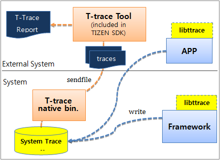

# Tracepoints


You can perform trace operations in Tizen native applications with the [T-trace tool](../../../tizen-studio/native-tools/t_trace.md). The tool allows you to generate traces and visualize them.

With the T-trace API, you can [create custom tracepoints in your application](#insert). The tracepoints allow the framework to write application traces to the system trace buffer to align them with the T-trace traces from the Tizen platform.

**Figure: T-trace architecture**



The following T-trace function types are provided for application-level tracepoints:

- Synchronous tracing functions: `trace_begin()` and `trace_end()`
- Asynchronous tracing functions: `trace_async_begin()` and `trace_async_end()`
- Counter tracking function: `trace_update_counter()`

## Prerequisites

To enable your application to use the T-trace functionality:

1. To use the functions and data types of the T-trace API (in [mobile](../../api/mobile/latest/group__CAPI__SYSTEM__TRACE__MODULE.html) and [wearable](../../api/wearable/latest/group__CAPI__SYSTEM__TRACE__MODULE.html) applications), include the `<trace.h>` header file in your application:

    ```
    #include <trace.h>
    ```

2. Make sure you have the `libttrace.so` T-trace library. The T-trace library provides a tracing function to write traces to the system trace buffer.
3. Check that the following prerequisites are fulfilled:
   - linux-2.6.27 kernel
   - `debugfs` mounted on `/sys/kernel/debug`

<a name="insert"></a>
## Inserting Tracepoints

To insert tracepoints:

- Use synchronous tracing.

  If the trace event starts and ends in a same context within the same process, thread, and function, use the `trace_begin()` and `trace_end()` functions to track the event. Note that every `trace_begin()` function matches up with a `trace_end()` function that occurs after it.

  ```
  int
  main(void)
  {
      int integer = 12;
      trace_begin("event name: %d", integer);

      trace_end();

      return 0;
  }
  ```

- Use asynchronous tracing.

  If the trace event starts and ends in a different context, use the `trace_async_begin()` and `trace_async_end()` functions to track the event. Note that every `trace_async_begin()` function matches with a `trace_async_end()` function that has the same name and cookie. As the cookie provides an identifier among several events, it must have a unique integer value.

  ```
  void
  function1()
  {
      int cookies_f1 = 123;

      trace_async_begin(cookies_f1, "event name");
  }

  void
  function2()
  {
      int cookies_f2 = 123;

      trace_async_end(cookies_f2, "event name");

  }
  ```

- Track the trace counter.

  To track the change of an integer counter on your application, use the `trace_update_counter()` function:

  ```
  void
  function2(int count)
  {
      trace_update_counter(count, "event_name");
  }
  ```

## Related Information
* Dependencies
  - Tizen 2.4 and Higher for Mobile
  - Tizen 3.0 and Higher for Wearable
