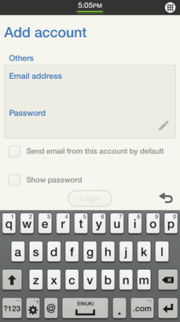

# Account Management


An account is a collection of information representing the user of a specific provider. You can manage accounts and their details in your application.

The main features of the Account Manager API include:

- Creating and managing accounts

  You can [create an account](#add), set its properties, and insert it to the database.

  You can also [manage the account secrecy level](#secret) and [remove accounts](#remove).

- Retrieving account information

  You can [retrieve information for each existing account](#get) and implement a callback function.

  You can also get accounts based on a [specific account provider package name](#retrieve), or account providers based on a [specific capability](#capability).

- Receiving account change notifications

- Modifying account properties

  The `account.h` header file handles account-related information. You can [query the account details](#queries) with database queries, [retrieve the account type](#type), and [update the account information](#update). For a list of modifiable account properties, see [Account and Account Provider Properties](#acc_property).

> **Note**
>
> Account providers, such as Google and Facebook, represent specific service provider-related information or protocol that provides the user accounts. To add, update, or remove an accounts, you must register a specific account provider for all your applications belonging to the same package.
>
> To register an account provider, define the [account provider information](#accprovider_property) in the `Account` tab of the manifest editor, and implement the [account application control](#appcontrol).
>
> If the application has defined the account provider information and implements the appcontrol for the account provider, the account provider is automatically registered when the application is installed.

<a name="appcontrol"></a>
## Account Application Control

The account application control, which allows the user to add and configure accounts, must be implemented in all applications that define an account provider. You are not required to define the application control information in the **Application Control** tab of the manifest editor to [add the application on the **Account** screen](#screen).

This application control supports the `http://tizen.org/appcontrol/operation/account/add` and `http://tizen.org/appcontrol/operation/account/configure` operations.

### ACCOUNT_OPERATION_SIGNIN Operation

The `http://tizen.org/appcontrol/operation/account/add` operation enables the user to add a new account for a specific account provider. With the operation, the login page for the specific account provider can be displayed. In **Settings > Accounts**, if the account provider is clicked for adding a new account, this operation is launched.

You have to define the `app_control_cb()` callback and register it to `ui_app_lifecycle_callback::app_control`.

The results of the operation are returned in the `app_control_get_operation()` event handler.

The following table shows the `ACCOUNT_OPERATION_SIGNIN` (`http://tizen.org/appcontrol/operation/account/add`) operation.

**Table: ACCOUNT_OPERATION_SIGNIN operation**

| Operation                  | Description                      |
|----------------------------|----------------------------------|
| `ACCOUNT_OPERATION_SIGNIN` | Account ID of the added account. |

### ACCOUNT_OPERATION_VIEW Operation

The `http://tizen.org/appcontrol/operation/account/configure` operation enables the user to set account information, such as synchronization settings. The delete button must be included for removing accounts.

In **Settings > Accounts**, if the specific account is clicked for setting the account information, this operation is launched.

You have to define the `app_control_cb()` callback and register it to `ui_app_lifecycle_callback::app_control`.

The results of the operation are returned in the `app_control_get_operation()` event handler.

The following table shows the `ACCOUNT_OPERATION_VIEW` (`http://tizen.org/appcontrol/operation/account/configure`) operation.

**Table: ACCOUNT_OPERATION_VIEW operation**

| Operation                | Description                              |
|--------------------------|------------------------------------------|
| `ACCOUNT_OPERATION_VIEW` | Account ID for setting account information. |

## Prerequisites

To enable your application to use the account management functionality:

1. To use the Account Manager API (in [mobile](../../api/mobile/latest/group__CAPI__ACCOUNT__MANAGER__MODULE.html) and [wearable](../../api/wearable/latest/group__CAPI__ACCOUNT__MANAGER__MODULE.html) applications), the application has to request permission by adding the following privileges to the `tizen-manifest.xml` file:

   ```
   <privileges>
      <privilege>http://tizen.org/privilege/account.read</privilege>
      <privilege>http://tizen.org/privilege/account.write</privilege>
   </privileges>
   ```

2. To use the functions and data types of the Account Manager API, include the `<account.h>` header file in your application:

   ```
   #include <account.h>
   ```

   To ensure that an Account Manager function has been executed properly, make sure that the return is equal to `ACCOUNT_ERROR_NONE`.

3. Declare the necessary global variables, including the account handle:

   ```
   #include <stdio.h>
   #include <time.h>
   #include <dlog.h>

   /* Account handle */
   static account_h account = NULL;
   static int account_id = 0;
   int ret = 0;
   ```

   When you no longer need it, destroy the account handle with the `account_destroy()` function:

   ```
   ret = account_destroy(account);
   ```

<a name="add"></a>
## Creating and Managing an Account

To create an account, set its properties, and add it to the account database:

1. Create an account using the `account_create()` function and the previously defined account handle:

    ```
    ret = account_create(&account);
    ```

2. When the account is created, you can set account properties, such as name, display name, domain name, and email address:

   ```
   char* account_name = "Marcus";
   char* display_name = "Marcus_display";
   char* domain_name = "Marcus_domain";
   char* email_address = "marcus@example.com";
   char* image_path = "image_path";

   ret = account_set_user_name(account, account_name);

   ret = account_set_display_name(account, display_name);

   ret = account_set_domain_name(account, domain_name);

   ret = account_set_email_address(account, email_address);

   ret = account_set_icon_path(account, image_path);
   ```

3. When the account properties are set, use the `account_insert_to_db()` function to insert the account to the account database. Use the account ID as the second parameter (`account_id`):
    ```
    ret = account_insert_to_db(account, &account_id);
    ```

<a name="get"></a>
## Getting Account Information

To get account information, such as user name, display name, domain name, and email address:

1. Use the `account_get_total_count_from_db()` function to get the total number of inserted records.

    To get individual records, use the `account_foreach_account_from_db()` function, which iterates through all the records and invokes a callback function for each account.

    ```
    int total_count = -1;
    ret = account_get_total_count_from_db(&total_count);

    ret = account_foreach_account_from_db(on_account_read, NULL);
    ```

2. Define the callback function for the `account_foreach_account_from_db()` function to retrieve information for each account.

   To get more details, use the `account_get_account_id()`, `account_get_user_name()`, `account_get_display_name()`, and `account_get_icon_path()` functions:

    ```
    static bool
    on_account_read(account_h account, void *user_data)
    {
        char *name = NULL;
        char *display_name = NULL;
        char *icon_path = NULL;
        /* Get the account ID */
        ret = account_get_account_id(account, &account_id);
        if (ret != ACCOUNT_ERROR_NONE) {
            /* Error handling */

            return false;
        }
        /* Get the user name */
        ret = account_get_user_name(account, &name);
        if (ret != ACCOUNT_ERROR_NONE) {
            /* Error handling */

            return false;
        }
        dlog_print(DLOG_INFO, LOG_TAG, "name: %s", name);
        /* Get the display name */
        ret = account_get_display_name(account, &display_name);
        if (ret != ACCOUNT_ERROR_NONE) {
            /* Error handling */

            return false;
        }
        dlog_print(DLOG_INFO, LOG_TAG, "display_name: %s", display_name);
        /* Get the icon path */
        ret = account_get_icon_path(account, &icon_path);
        if (ret != ACCOUNT_ERROR_NONE) {
            /* Error handling */

            return false;
        }
        dlog_print(DLOG_INFO, LOG_TAG, "icon_path: %s", icon_path);

        free(name);
        free(display_name);
        free(icon_path);

        return true;
    }
    ```

<a name="retrieve"></a>
## Retrieving Accounts by Package Name

To retrieve accounts by a specific account provider:

1. Define the `account_cb()` callback for getting account data:

    ```
    static bool
    account_callback(account_h account, void* user_data) /* account_cb() callback */
    {
        /* Called once for each account in the database */
    }
    ```

2. Retrieve the accounts of a specific account provider using the `account_query_account_by_package_name()` function, and specifying the callback for getting account data and the package name of the account provider:

    ```
    int ret = -1;
    char* package_name = "package_name";
    ret = account_query_account_by_package_name(account_callback, package_name, NULL);
    ```

<a name="capability"></a>
## Retrieving Account Providers by Capability

To retrieve account providers by a specific capability:

1. Define the `account_type_cb()` callback for getting account providers:

    ```
    /* account_type_cb() callback */
    static bool
    account_type_callback(account_type_h account_type, void* user_data)
    {
        /* Called once for each account type in the database */
    }
    ```

2. Retrieve the account providers of a specific capability by using the `account_type_query_by_provider_feature()` function, and specifying the callback for getting account providers:

    ```
    int ret = -1;
    char* capability = "http://tizen.org/account/capability/contact";

    ret = account_type_create(&account_type);

    account_type_query_by_provider_feature(account_type_callback, capability, NULL);
    ```

<a name="remove"></a>
## Removing an Account

To remove an account, use the `account_delete_from_db_by_id()`, `account_delete_from_db_by_user_name()`, or `account_delete_from_db_by_package_name()` function. They all remove a given account record.

> **Note**
>
> To get the ID needed as a parameter of the `account_delete_from_db_by_id()` function, use the `account_get_account_id()` function.

```
ret = account_delete_from_db_by_id(account_id);
```

<a name="screen"></a>
## Adding an Application on the Account Screen

To add your application on the Add account screen of the device:

1. Add the required information in the manifest file:

   ```
   <account>
      <account-provider appid="app-id name" providerid="url style string" multiple-accounts-support="true or false">
         <icon section="account">application icon name</icon>
         <icon section="account-small">application small icon name</icon>
         <label>Application name</label>
         <label xml:lang="en-gb">Application name</label>
         <label xml:lang="ko-kr">앱 이름</label>
         <capability>http://tizen.org/account/capability/contact</capability>
         <capability>http://tizen.org/account/capability/calendar</capability>
      </account-provider>
   </account>
   ```

   The required information includes:

   - `appid="app-id name"`

     Application ID (for example, `appid="org.tizen.account"`).

   - `providerid="url style string"`

     Provider identification string (for example, `providerid="http://www.tizen.org"`).

   - `multiple-accounts-support="true or false"`

     Multiple account support (if your application can manage 2 or more accounts, set to `true`; otherwise set to `false`)

   - `<icon section="account">application icon name</icon>`

     Icon displayed on the Add account screen.

     The icon size must be 72 x 72 px and the icon file must be in the `{app-root}\shared\res\` directory.

   - `<icon section="account-small">application small icon name</icon>`

     Small icon displayed on the Other application screen to represent the account provider.

     The small icon file must be in the `{app-root}\shared\res\` directory.

   - `<label xml:lang="en-gb">Application name</label>`

     Application name displayed on the Add account screen, according to the selected language.

     An account provider must have at least one label tag.

   - `<capability>http://tizen.org/account/capability/contact</capability>`

     For more information, see the [Account provider properties table](#provider).

2. Create the sign-in screen UI.

   When the user selects your application on the Add account screen, the Account Service launches your application with a specific operation ID (`ACCOUNT_OPERATION_SIGNIN`) defined in the `account-types.h` header file, so the sign-in screen must be displayed.

   

<a name="queries"></a>
## Performing Database Queries

To perform database queries:

1. Prepare sample content.

   To perform queries, you need existing content in the database. To access an existing account, obtain it from the database. This can be done using a few functions, depending on the user requirements.

   To create new content to the database:

   1. The `Create_Account()` function creates a new account from a given `account_h` handle and account details (name, display name, domain, email). 3 capabilities are added to the account to demonstrate some of the query functions. The capabilities as well as user custom types can be predefined.

      After the account is created, it is added to the database. When no longer needed, destroy the account handle using the `account_destroy(account)` function.

      ```
      int id[3];
      static account_h account = NULL;

      Create_Account(&account, "Person", "DiplayPerson", "Person Domain", "someone1@somewho.com");

      account_set_capability(account, "Custom", ACCOUNT_CAPABILITY_ENABLED);

      account_set_capability(account, "Next", ACCOUNT_CAPABILITY_ENABLED);

      account_set_capability(account, "Another", ACCOUNT_CAPABILITY_DISABLED);

      account_insert_to_db(account, &id[0]);

      account_destroy(account);
      ```

   2. Add 3 more accounts to the database:

      ```
      Create_Account(&account, "PersonX", "DisplayX", "Other Domain", "someone2@somewho.com");
      account_insert_to_db(account, &id[1]);

      account_destroy(account);

      Create_Account(&account, "Human", "Humanity", "Everyone", "someone3@somewho.com");
      account_insert_to_db(account, &id[2]);

      account_destroy(account);

      Create_Account(&account, "LastOne", "LastDisplay", "Last Domain", "someone4@somewho.com");
      account_insert_to_db(account, &id[3]);

      account_destroy(account);
      ```

   3. [Create an account](#add).

      ```
      static int
      Create_Account(account_h* account, char* account_name, char* display_name, char* domain_name, char* email_address)
      {
          account_create(account);

          account_set_user_name(*account, account_name);

          account_set_display_name(*account, display_name);

          account_set_domain_name(*account, domain_name);

          account_set_email_address(*account, email_address);
      }
      ```

2. List the accounts:

   1. List all accounts to verify the database insertion:

      ```
      struct Account_Records {
          int count;
          int tab[100];
      };

      struct Account_Records rec;

      List_Accounts(&rec);
      ```

   2. If the account list is not empty (`NULL`), the `List_Accounts()` function counts all records in the database. Obtain the records using the `account_foreach_account_from_db()` function.

      ```
      static void
      List_Accounts(struct Account_Records* rec)
      {
          if (rec != NULL)
              rec->count = 0;
          account_foreach_account_from_db(on_account_read, rec);
      }
      ```

   3. Call the `on_account_read()` callback function for each found record. If the second parameter (`user_data`) is not `NULL`, the function is counting the existing accounts. String data returned by the `account_get_xxx()` functions must be released with the `free()` function. Data prepared with the `sprintf()` function can, for example, be sent to `stdout`.

      ```
      static bool
      on_account_read(account_h account, void *user_data)
      {
          int account_id = 0;
          char *name = NULL;
          char *display_name = NULL;
          struct Account_Records * rec = (struct Account_Records *)user_data;
          char buf[100];

          account_get_account_id(account, &account_id);

          sprintf(buf, "MyCallback ID: %d\n", account_id);

          if (user_data != NULL)
              rec->tab[rec->count++] = account_id;
          account_get_user_name(account, &name);
          sprintf(buf, "MyCallback Name: %s\n", name);

          free(name);

          account_get_display_name(account, &display_name);
          sprintf(buf, "MyCallback Disp.: %s\n", display_name);

          free(display_name);

          return 0;
      }
      ```

3. Query the account by its ID with the `account_query_account_by_account_id()` function. This function requires an existing handle to an account as an input parameter.

    ```
    for (i = 0; i < rec.count; i++) {
        account_create(&account);
        account_query_account_by_account_id(rec.tab[i], &account);

        Show_Account(account);

        account_destroy(account);
    }
    ```

4. Show the account:

   ```
   static int
   Show_Account(account_h acc)
   {
       int account_id = 0;
       char *name = NULL;
       char *display_name = NULL;
       char buf[100];

       account_get_account_id(acc, &account_id);

       sprintf(buf, "Show_Account ID: %d\n", account_id);

       account_get_user_name(acc, &name);

       sprintf(buf, "Show_Account Name: %s\n", name);

       free(name);

       account_get_display_name(acc, &display_name);

       sprintf(buf, "Show_Account Disp.: %s\n", display_name);

       free(display_name);

       return 0;
   }
   ```

5. Query the account by various attributes:

   - Query by user name.

     Querying data by user name requires a valid user name and callback function. In this example, the same callback is used as in the `account_foreach_account_from_db()` function, but it is cast without the third parameter (user data).

     ```
     account_query_account_by_user_name(on_account_read, "Human", NULL);
     ```

   - Query by package name.

     By default, the accounts created in the application context have a package name set to the application name. Change it using the `account_set_package_name()` function. To list accounts by package name, the user can provide a name by themselves or obtain it with the `account_get_package_name()` function.

     The `account_query_account_by_package_name()` function requires a callback function and a package name. In addition, the user data can be passed to the callback function as a third parameter.

     The package name has to be released when no longer needed.

     ```
     char* package_name;
     account_get_package_name(account, &package_name);
     account_query_account_by_package_name(on_account_read, package_name, NULL);
     free(package_name);
     ```

   - Query by capability.

     The following function allows the user to find all accounts with a specified capability on a specified state. Once again, the callback function is required.

     ```
     account_query_account_by_capability(on_account_read, "Custom", ACCOUNT_CAPABILITY_ENABLED, NULL);
     ```

   - Query by capability type.

     This function is similar to the `account_query_account_by_capability()` function, but returns all accounts with a specified capability, without checking their state.

     ```
     account_query_account_by_capability_type(on_account_read, "Next", NULL);
     ```

   - Query capability by account ID.

     The `account_query_capability_by_account_id()` function is different from the previous functions. It lists all capabilities from an account with a specified ID, and requires a different type of callback. The callback function prepares data to be sent to an output.

     ```
     account_query_capability_by_account_id(_capability_cb, id[0], NULL);

     static bool
     _capability_cb(const char *capability_type, account_capability_state_e capability_state, void *user_data)
     {
         char buf[200];
         sprintf(buf, "Found capability: %s on state %d\n", capability_type, capability_state);

         return true;
     }
     ```

6. Destroy all account handles when they are no longer needed:

   ```
   account_destroy(account);
   ```

<a name="secret"></a>
## Managing Account Secrecy

To manage account secrecy:

1. Select the secrecy level using the `account_secrecy_state_e` enumeration (in [mobile](../../api/mobile/latest/group__CAPI__ACCOUNT__MANAGER__MODULE.html#ga41a7e7e7cfb072d0b0ba37087a0535b6) and [wearable](../../api/wearable/latest/group__CAPI__ACCOUNT__MANAGER__MODULE.html#ga41a7e7e7cfb072d0b0ba37087a0535b6) applications):

    ```
    static
    account_h account = NULL;
    account_secrecy_state_e secret;

    char buf[200];
    int ret;
    int id;

    /* Account 1 */
    Create_Account(&account, "Security 1", "Invalid", "NOBODY", "anony@mous.not");

    account_set_secret(account, ACCOUNT_SECRECY_INVALID);

    account_get_secret(account, &secret);

    account_insert_to_db(account, &id);

    sprintf(buf, "Account 1 secret: %d\n", secret);

    account_destroy(account);

    /* Account 2 */

    Create_Account(&account, "Security 2", "Invisible", " NOBODY", "anony1@mous.not");

    account_set_secret(account, ACCOUNT_SECRECY_INVISIBLE);

    account_get_secret(account, &secret);

    account_insert_to_db(account, &id);

    sprintf(buf, "Account 2 secret: %d\n", secret);

    account_destroy(account);

    /* Account 3 */

    Create_Account(&account, "Secret 3", "Visible", " NOBODY", "anony2@mous.not");

    ret = account_set_secret(account, ACCOUNT_SECRECY_VISIBLE);

    ret = account_get_secret(account, &secret);

    ret = account_insert_to_db(account, &id);

    sprintf(buf, "Account 3 secret: %d\n", secret);

    account_destroy(account);

    List_Accounts(NULL);
    ```

	Secrecy is only linked with the visibility on the account settings screen. The account is still visible and can be accessed using a query or a `foreach` function. For more information on how to add your application to the account screen, see [Adding an Application on the Account Screen](#screen).

    ```
    /* List_Account() console output */
    MyCallback ID: 12
    MyCallback Name: Security 1
    MyCallback Disp.: Invalid
    -------------------
    MyCallback ID: 13
    MyCallback Name: Security 2
    MyCallback Disp.: Invisible
    -------------------
    MyCallback ID: 14
    MyCallback Name: Secret 3
    MyCallback Disp.: Visible
    ```

2. Destroy all account handles when they are no longer needed:

   ```
   account_destroy(account);
   ```

<a name="update"></a>
## Updating Accounts

To update and track account data:

1. Subscribe notifications to track account changes. Create an `account_subscribe_h` instance and register a notification.

    ```
    account_subscribe_h account_subscribe;

    account_subscribe_create(&account_subscribe);

    account_subscribe_notification(account_subscribe, _account_event_cb, NULL);
    ```

2. Create an account. Accounts are created and then their handles are destroyed. The package name is obtained from the second account.

   ```
   Create_Account(&account, "Updater", "Updated?", "ToUpdate", "not.up@to.date");
   account_insert_to_db(account, &id);

   Show_Account(account);
   account_destroy(account);

   Create_Account(&account, "Another", "Updated?", "ToUpdate", "not.up@to.date");
   account_insert_to_db(account, &id);

   account_get_package_name(account, &package_name);
   sprintf(buf, "Package_name: %s\n", package_name);

   Show_Account(account);
   account_destroy(account);
   ```

3. Update the account:

   - To update an account by its ID:

     1. Create a handle to the account.
     2. Get the account from the database (by ID).
     3. Make the necessary changes.
     4. Update the account using the account handle and a valid ID.
     5. Destroy the account handle.

     ```
     account_create(&account);
     account_query_account_by_account_id(id, &account);
     account_set_display_name(account, "Updated!");
     account_update_to_db_by_id(account, id);
     account_destroy(account);
     ```

   - To update an account by its user name:

     1. Create a handle to the account.
     2. Get the account from the database (by ID).
     3. Make the necessary changes.
     4. Update the account using the account handle, a valid user name, and a package name. There can be accounts with the same user names in different packages.
     5. Destroy the account handle.

     ```
     account_create(&account);
     account_query_account_by_account_id(id, &account);
     account_set_display_name(account, "Updated!");
     account_update_to_db_by_user_name(account, "Another", package_name);
     account_destroy(account);
     ```

4. Create the account event callback. When any action is taking place on any account when a notification is subscribed, a callback function is invoked. The callback function provides in its parameters the event type as a string, the ID of the account associated with the actual change, and, additionally, the user data registered while subscribing the notification.

   ```
   bool
   _account_event_cb(const char *event_type, int account_id, void *user_data)
   {
       char buf[200];

       sprintf(buf, "ACCOUNT EVENT: %s, %d\n", event_type, account_id);

       return true;
   }
   ```

5. Show the accounts to verify the updates:

   ```
   account_create(&account);
   account_query_account_by_account_id(id, &account);
   Show_Account(account);
   account_destroy(account);
   ```

6. Unsubscribe the notification when no longer needed:

   ```
   account_unsubscribe_notification(account_subscribe);
   ```

<a name="type"></a>
## Retrieving Account Types

To retrieve account types:

1. Create a handle to operate on the account type:

   ```
   account_type_h account_type;

   account_type_create(&account_type);
   ```

2. Get the type information.

   If the account type with a specified ID exists, you can get it from the database with the `account_query_by_app_id()` function.

   It is possible to set, for example:

   - ID
   - Labels
   - Features
   - Multiple account support (this is only a flag)

   To get the account types by the application ID, use the `account_type_query_by_app_id()` function:

   ```
   int multiple_account_support = -1;
   char *your_app_id = "com.tizen.example"; /* App ID for retrieving account types */
   char *app_id = NULL;
   char *provider_feature = NULL;
   char *icon_path = NULL;

   if (account_type_query_app_id_exist(your_app_id)) {
       account_type_query_by_app_id(your_app_id, &account_type);

       account_type_get_app_id(account_type, &app_id);

       account_type_get_multiple_account_support(account_type, &multiple_account_support);

       account_type_get_icon_path(account_type, &icon_path);

       account_type_get_provider_feature(account_type, &provider_feature);
   }
   ```

3. List the account types or all the labels from a specified type with a proper callback function:

   ```
   account_type_foreach_account_type_from_db(_account_type_cb, NULL);

   account_type_query_label_by_app_id(_account_label_cb, type_id, NULL);
   ```

   While listing the labels, the user has access to the ID of the account type, label and its local value, and the user data passed while casting the query function.

   ```
   bool
   _account_label_cb(char *app_id, char *label, char *locale, void *user_data)
   {
       char buf[200];

       sprintf(buf, "Get Label ID: %s LABEL: %s LOCALE %s\n", app_id, label, locale);

       return true;
   }
   ```

   The account type callback has access to the account type and user data.

   ```
   bool
   _account_type_cb(account_type_h account_type, void *user_data)
   {
       char * id;
       int support;
       char buf[200];

       account_type_get_app_id(account_type, &id);

       account_type_get_multiple_account_support(account_type, &support);
       sprintf(buf, "Account Type ID: %s Multiple support %d:\n", id, support);

       return true;
   }
   ```

4. Clean up and destroy the allocated handles:

   ```
   free(app_id);
   free(provider_feature);
   free(icon_path);

   account_type_destroy(account_type);
   ```

<a name="acc_property"></a>
## Account and Account Provider Properties

The following table lists the account properties that can be modified.

**Table: Account properties**

| Account  property | Data type                       | Mandatory | Description                              |
|-------------------|---------------------------------|-----------|------------------------------------------|
| User  name        | String                          | Yes       | Identity of an  account.<br>    If the display name and email address are not set for an account, the user  name is shown for the account on the Accounts screen in the Setting  application. |
| Display  name     | String                          | No        | Display name of  an account.<br>    Display name is shown for the account on the Accounts screen in the Setting  application. |
| Email  address    | String                          | No        | Email address  of an account.<br>    If the display name is not set for an account, the email address is shown  for the account on the Accounts screen in the Setting application. |
| Package  name     | String                          | No        | One of an  account package IDs, like the app ID.<br>    If the package name is not set for an account, the app ID is used as a  package name. |
| Icon  path        | String                          | No        | Icon path of an  account.    The icon is shown through the registered icon path as an account icon on  the Accounts screen in the Setting application. |
| Domain  name      | String                          | No        | Domain name of  an account.              |
| Access token      | String                          | No        | Access  token of an account.             |
| Auth type         | Integer                         | No        | Authentication  type, such as oauth or xauth. |
| Capability        | Key-value  string-integer pairs | No        | Capability  of an account.               |
| Secret            | Integer                         | No        | The  secret value is used to decide whether the account is shown on the Accounts  screen in the Setting application. |
| Sync support      | Integer                         | No        | Current  synchronization status.         |
| Source            | String                          | No        | Source  of an account.                   |
| User text         | String                          | No        | String  array, which you can use freely. |
| User int          | Integer                         | No        | Integer  array, which you can use freely. |
| Custom            | Key-value  string pairs         | No        | Key-value  pairs, which you can use freely. |

<a name="provider"></a>
The following table lists the properties that can be defined for each account provider.

<a name="accprovider_property"></a>
**Table: Account provider properties**
<table border="1" id="accprovider_property">
	<thead>
		<tr>
			<th>Account property</th>
			<th>Data type</th>
			<th>Mandatory</th>
			<th>Description</th>
		</tr>
	</thead>
	<tbody>
		<tr>
			<td>Multiple accounts support</td>
			<td>bool</td>
			<td>Yes</td>
			<td>Indicates whether multiple accounts are supported.</td>
		</tr>
		<tr>
			<td>Icon</td>
			<td>String</td>
			<td>Yes</td>
			<td>File path of the account provider icon.
			<p>The icon size is:</p>
			<ul>
				<li>72 x 72 for Xhigh (HD)</li>
				<li>48 x 48 for High (WVGA)</li>
			</ul>
			<p>Since the icon is used in <strong>Settings &gt; Accounts</strong>, place the icon in a shared directory.</p>
			</td>
		</tr>
		<tr>
			<td>Small icon</td>
			<td>String</td>
			<td>Yes</td>
			<td>File path of the account provider icon.
			<p>The icon size is:</p>
			<ul>
				<li>45 x 45 for Xhigh (HD)</li>
				<li>30 x 30 for High (WVGA)</li>
			</ul>
			<p>Since the small icon is used in other applications, place the icon in a shared directory.</p>
			</td>
		</tr>
		<tr>
			<td>Display name</td>
			<td>String</td>
			<td>Yes</td>
			<td>Display name of the account provider.</td>
		</tr>
		<tr>
			<td>Capabilities</td>
			<td>String</td>
			<td>No</td>
			<td>Capability of the account provider.
			<p>Capability can be a liaison between an account application and another application. If an account application registers a capability in the manifest file, other applications know that the account application has the capability. And if an account application gives an account a capability, other applications know that the account has the capability.</p>
			<p>Several service-specific capabilities are defined for the Account Manager in Tizen:</p>
			<ul>
				<li>Contact capability:
				<p><code>ACCOUNT_SUPPORTS_CAPABILITY_CONTACT</code> or <code>"http://tizen.org/account/capability/contact"</code></p>
				<p>If you register this capability in the manifest file, the user using the contact application can see a list of accounts with the account of your service in the contact application.</p>
				</li>
				<li>Calendar capability:
				<p><code>ACCOUNT_SUPPORTS_CAPABILITY_CALENDAR</code> or <code>"http://tizen.org/account/capability/calendar"</code></p>
				<p>If you register this capability in the manifest file, the user using the calendar application can see a list of accounts with the account of your service in the calendar application.</p>
				</li>
				<li>Email capability:
				<p><code>ACCOUNT_SUPPORTS_CAPABILITY_EMAIL</code> or <code>"http://tizen.org/account/capability/email"</code></p>
				</li>
				<li>Photo capability:
				<p><code>ACCOUNT_SUPPORTS_CAPABILITY_PHOTO</code> or <code>"http://tizen.org/account/capability/photo"</code></p>
				</li>
				<li>Video capability:
				<p><code>ACCOUNT_SUPPORTS_CAPABILITY_VIDEO</code> or <code>"http://tizen.org/account/capability/video"</code></p>
				</li>
				<li>Music capability:
				<p><code>ACCOUNT_SUPPORTS_CAPABILITY_MUSIC</code> or <code>"http://tizen.org/account/capability/music"</code></p>
				</li>
				<li>Document capability:
				<p><code>ACCOUNT_SUPPORTS_CAPABILITY_DOCUMENT</code> or <code>"http://tizen.org/account/capability/document"</code></p>
				</li>
				<li>Message capability:
				<p><code>ACCOUNT_SUPPORTS_CAPABILITY_MESSAGE</code> or <code>"http://tizen.org/account/capability/message"</code></p>
				</li>
				<li>Game capability:
				<p><code>ACCOUNT_SUPPORTS_CAPABILITY_GAME</code> or <code>"http://tizen.org/account/capability/game"</code></p>
				</li>
			</ul>
			</td>
		</tr>
	</tbody>
</table>

## Related Information
- Dependencies
  - Tizen 2.4 and Higher for Mobile
  - Tizen 3.0 and Higher for Wearable
