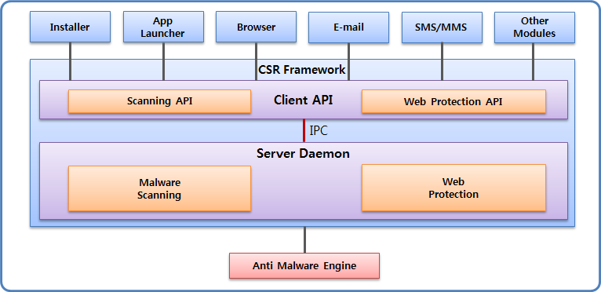

# Malware Scanning and Web Protection


The Content Screening and Reputation (CSR) framework allows you to screen the content of malicious Web sites and block access to those sites. The CSR framework protects the device and the user by passing the security API calls to an anti-malware engine, which is provided by a security vendor. The framework is also responsible for error handling when there is no anti-malware engine installed.

The main features of the CSR API include:

- Content Screening Service

  The service enables caller modules and applications to [scan the content for data, files, and directories](#scanning_malwares). The actual scanning is performed by underlying anti-malware engines, which are provided by a device manufacturer.


- Web Protection (Anti Phishing) Service

  The service enables caller modules and applications to [check whether a URL they want to access is risky](#checking_url). The actual operation is performed by an underlying anti-malware engine, which is provided by a device manufacturer.

You can [manage the anti-malware engines](#managing_engine) by enabling and disabling, as needed.

**Figure: CSR framework process**



## Prerequisites

To enable your application to use the CSR framework functionality:

1. To use the CSR API (in [mobile](../../api/mobile/latest/group__CAPI__CSR__FRAMEWORK__MODULE.html) and [wearable](../../api/wearable/latest/group__CAPI__CSR__FRAMEWORK__MODULE.html) applications), the application has to request permission by adding the following privileges to the `tizen-manifest.xml` file:

    ```
    <privileges>
       <!--Needed for malware scanning-->
       <privilege>http://tizen.org/privilege/antivirus.scan</privilege>
       <!--Needed for URL reputation checks-->
       <privilege>http://tizen.org/privilege/antivirus.webprotect</privilege>
       <!--Needed for engine management and judging any detected malware-->
       <!--Platform-level privilege-->
       <privilege>http://tizen.org/privilege/antivirus.admin</privilege>
    </privileges>
    ```

2. To use the functions and data types of the CSR API, include the `<csr-content-screening.h>`, `<csr-web-protection.h>`, and `<csr-engine-manager.h>` header files in your application:

   ```
   /* Needed for malware scanning */
   #include <csr-content-screening.h>

   /* Needed for URL reputation checks */
   #include <csr-web-protection.h>

   /* Needed for engine management */
   #include <csr-engine-manager.h>
   ```
<a name="scanning_malwares"></a>
## Scanning for Malware

To scan for malware:

1. Create a content screening (CS) context:

   ```
   csr_cs_context_h context;
   int ret;

   /* Create a context */
   ret = csr_cs_context_create(&context);
   ```

2. Scan for the content:

   - Scan in memory.

     Memory scanning is a synchronous operation. When a malware is detected and `CSR_CS_ASK_USER_YES` is set in the `csr_cs_set_ask_user()` function, a popup notice is displayed to the user and processed based on the user's decision.

     ```
     csr_cs_malware_h detected;

     /* To use the CSR framework popup (optional) */
     ret = csr_cs_set_ask_user(context, CSR_CS_ASK_USER_YES);

     /* Scan for data */
     unsigned char data[100] = {0,}; /* Set your own data for scanning */
     ret = csr_cs_scan_data(context, data, sizeof(data), &detected);
     if (ret != CSR_ERROR_NONE)
         /* Error handling */

     /* Extract result */
     csr_cs_severity_level_e severity;
     char *malware_name;
     char *detailed_url;
     char *file_name;

     if (detected != NULL) {
         ret = csr_cs_malware_get_severity(detected, &severity);
         ret = csr_cs_malware_get_name(detected, &malware_name);
         ret = csr_cs_malware_get_detailed_url(detected, &detailed_url);
         ret = csr_cs_malware_get_user_response(detected, &user_response);

         /* Release the returned C strings using free() */
     }
     ```

   - Scan in a file.

     Scanning content in a file is a synchronous operation. When a malware is detected and `CSR_CS_ASK_USER_YES` is set in the `csr_cs_set_ask_user()` function, a popup notice is displayed to the user and processed based on the user's decision.

     ```
     csr_cs_malware_h detected;

     /* To use the CSR framework popup (optional) */
     ret = csr_cs_set_ask_user(context, CSR_CS_ASK_USER_YES);

     /* Scan in a file */
     const char *file = "/tmp/testfile.txt"; /* Set the target file for scanning */
     ret = csr_cs_scan_file(context, file, &detected);
     if (ret != CSR_ERROR_NONE)
         /* Error handling */
     ```

   - Scan in a directory.

     Scanning content in a directory with a specified directory path is an asynchronous operation. Callbacks can be registered by callback setter functions, and a callback is only called if it is registered.

     ```
     /* Define callback functions */
     void on_detected(csr_cs_malware_h detected, void *userdata)
     {
         /* Extract detected malware information */
     }
     void on_scanned(const char *file, void *userdata) {}
     void on_error(int ec, void *userdata) {}
     void on_completed(void *userdata) {}
     void on_cancelled(void *userdata) {}

     {
         csr_cs_malware_h detected;
         /* User-specific data to be returned at callback method */
         char *user_data = NULL;
         int ret;

         /* Register callbacks */
         ret = csr_cs_set_detected_cb(context, on_detected);
         ret = csr_cs_set_completed_cb(context, on_completed);
         ret = csr_cs_set_cancelled_cb(context, on_cancelled);
         ret = csr_cs_set_error_cb(context, on_error);
         ret = csr_cs_set_file_scanned_cb(context, on_scanned);

         /* Scan asynchronously */
         const char *dirs[2] = {TEST_DIR1, TEST_DIR2};
         ret = csr_cs_scan_dirs_async(context, dirs, sizeof(dirs) / sizeof(const char *),
                                      user_data); /* user_data can be NULL */
     }
     ```

3. Get the detected malware information.

   You can retrieve information on detected malware files specified by a file path or directory path. The information for detected malware is stored internally.

   ```
   csr_cs_malware_list_h detected_list;
   size_t size;
   size_t list_size;
   int idx;

   const char *dirs[1] = {
       TEST_DIR
   };

   /* Get information on detected malware files specified by file path */
   csr_cs_get_detected_malware(context, "file_path_of_malware_file", &detected);

   /* Get information on detected malware files specified by directory path */
   csr_cs_get_detected_malwares(context, dirs, size, &detected_list, &list_size);

   for (idx = 0; idx < list_size; idx++) {
       ret = csr_cs_malware_list_get_malware(detected_list, idx, &detected);
       /* Get additional information here */
   }

   /* Get information on ignored malware files specified by file path */
   csr_cs_get_ignored_malware(context, "file_path_of_malware_file", &detected);

   /* Get information on ignored malware files specified by directory path */
   csr_cs_get_ignored_malwares(context, dirs, size, &detected_list, &list_size);

   for (idx = 0; idx < list_size; idx++) {
       ret = csr_cs_malware_list_get_malware(detected_list, idx, &detected);
       /* Get additional information here */
   }
   ```

4. Judge the detected malware.

   You can judge how a previously scanned and detected malware file is handled. You can either delete the file or ignore or unignore the file.

   ```
   if (detected != NULL) {
   	/* Tag as ignored malware file */
   	ret = csr_cs_judge_detected_malware(context, detected, CSR_CS_ACTION_IGNORE);
   	/* Tag as detected malware file */
   	ret = csr_cs_judge_detected_malware(context, detected, CSR_CS_ACTION_UNIGNORE);
   	/* Delete a malware file */
   	ret = csr_cs_judge_detected_malware(context, detected, CSR_CS_ACTION_REMOVE);
   }
   ```

5. When no longer needed, destroy the content screening (CS) context:

   ```
   ret = csr_cs_context_destroy(context);
   ```

<a name="checking_url"></a>
## Checking the URL Reputation

To check the URL reputation:

1. Create a Web protection context:

   ```
   csr_wp_context_h context;
   int ret;

   /* Create a context */
   ret = csr_wp_context_create(&context);
   ```

2. Check the URL reputation against the engine vendor database:

   ```
   csr_wp_check_result_h result;
   int ret;

   /* To use the CSR framework popup (optional) */
   ret = csr_wp_set_ask_user(context, CSR_WP_ASK_USER_YES);

   /* Check a URL */
   const char *url = "http://www.testurl.com"; /* Set the target URL to check */
   ret = csr_wp_check_url(context, url, &result);

   /* Extract result */
   csr_wp_risk_level_e risk;
   char *detailed_url;
   ret = csr_wp_result_get_risk_level(result, &risk);
   ret = csr_wp_result_get_detailed_url(result, &detailed_url);
   ret = csr_wp_result_get_user_response(result, &user_response);
   /* Release the returned C strings using free() */
   ```

3. When no longer needed, destroy the Web protection context:

   ```
   ret = csr_wp_context_destroy(context);
   ```

<a name="managing_engine"></a>
## Managing Engines

To get engine information and enable or disable the engine:

- Get the current engine handle and extract information from it:

  ```
  csr_engine_h engine;
  char *vendor;
  char *name;
  char *version;
  time_t time;
  csr_activated_e activated;
  int ret;

  /* Get the engine handle */
  ret = csr_get_current_engine(CSR_ENGINE_CS, &engine);
  /*
     Or
     ret = csr_get_current_engine(CSR_ENGINE_WP, &engine));
  */

  /* Get information */
  ret = csr_engine_get_vendor(engine, &vendor);
  ret = csr_engine_get_name(cs_engine, &name);
  ret = csr_engine_get_version(cs_engine, &version);
  ret = csr_engine_get_latest_update_time(cs_engine, &time);
  ret = csr_engine_get_activated(cs_engine, &activated);
  /* Release the returned C strings using free() */

  ret = csr_engine_destroy(engine);
  ```

- Enable or disable an engine:

  ```
  csr_engine_h cs_engine;
  csr_state_e state;
  int ret;

  ret = csr_get_current_engine(CSR_ENGINE_CS, &cs_engine);

  /* Disable engine */
  ret = csr_engine_set_state(cs_engine, CSR_STATE_DISABLE);
  ret = csr_engine_get_state(cs_engine, &state);

  /* Enable engine */
  ret = csr_engine_set_state(cs_engine, CSR_STATE_ENABLE);
  ret = csr_engine_get_state(cs_engine, &state);

  ret = csr_engine_destroy(cs_engine);
  ```

## Related Information
- Dependencies
  - Tizen 3.0 and Higher for Mobile
  - Tizen 3.0 and Higher for Wearable
