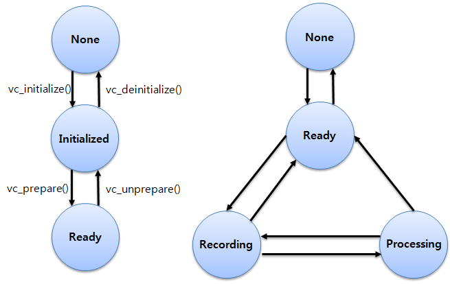
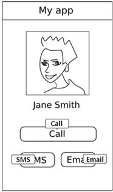
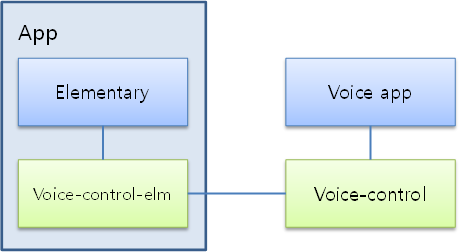

# Voice Control


Voice control features allow the user to control the device through their voice. You can register [general voice commands](#voice), which trigger a callback when the user speaks them. You can also register [voice commands for EFL-supported UI components](#elementary) to perform component-related actions, such as button clicks.

<a name="voice"></a>
## Voice Control Service

You can recognize the sound data recorded by the user and send the result as a predefined command using the Voice control service.

The main features of the Voice control API include:

- Managing commands

  You can use the Voice control service to register commands as foreground or background type. When the user speaks a registered command, the callback returns the recognition result.

- Retrieving information

  You can [get various information](#info) from the voice control:

  - Voice control state

    The state is changed by functions and applied as a precondition of each API.

  - Voice control service state

    The user controls the state by starting and stopping command recognition.

  - Current language

    A command is valid only when the command language is the same as the current language. The current language can be changed by changing the application or display language on the device.

    You can get a notification of the language change in a callback. If the display language is changed to a non-supported one, the voice control language changes to English.

  - Supported language

    You can retrieve a list of supported languages to check whether the language that you want is supported.

To use the voice control:

1. Set up the voice control and [register callbacks](#callback).

   The initialization allows the voice control to distinguish your application from any other applications also using voice control. The registered callbacks allow you to receive notifications about changes in the service state, language, and recognition result, and about any errors.

2. Prepare the voice control.

   The preparation connects the Voice control service for background work, such as recording and recognizing the user voice.

   When the application initializes and prepares the voice control, the Voice control daemon is invoked and connected for background work. The daemon and the application communicate as server and client.

3. Set commands.

   You can [create a command list](#commands), and add or remove individual commands in the list. When creating an individual command, set the command text and type for each command handle. When all commands are created and added to the command list, set the command list to the voice control for recognition.

4. Get the recognition result.

   The recognition result is sent through a registered callback.

   If the registered command is duplicated or the user speaks multiple commands, the recognition result can contain multiple results. If you set duplicated commands, the Voice control service can reject the command. The rejection is shown in the result event.

5. When no longer needed, unprepare and deinitialize the voice control.

   You must disconnect the voice control service and deinitialize the voice control using the `vc_unprepare()` and `vc_deinitialize()` functions.

The following figure illustrates the voice control life-cycle states.

**Figure: Voice control (left) and Voice control service (right) life-cycle states**



<a name="elementary"></a>
## Voice Control with Elementary Components

You can register voice commands for EFL-supported UI components to allow the user to interact with visible UI components inside the application using their voice. The Voice control elementary library recognizes spoken commands from registered UI components.

The following figure illustrates the application screen when the Voice control elementary features are enabled. When the screen is updated, any UI components that have a registered command and hint are shown with a tooltip (hint). When the user speaks the hint, the callback function of the action related to the UI component is executed.

**Figure: Voice command hints on the screen**



You have no need to consider how to recognize voice commands or start and stop the recognition process. A preloaded voice application handles the process automatically. You simply need to set the command and hint on every EFL Elementary component on which you want to enable voice commands.

When the user speaks a command corresponding to a visible EFL Elementary component on the screen, the recognized command is sent to the Voice control elementary library from the Voice control service, and the action mapped to the component is executed. For example, if the component is a button, the action can be a button click.

**Figure: Voice command process**



> **Note**  
> The detailed implementation of the preloaded voice application (how to trigger and recognize the user speaking) can vary depending on the device (mobile, wearable, or TV).

The main features of the Voice control elementary API include:

- Managing commands and hints

  You can [set commands and hints](#command_hint) for visible UI components on the application screen. The hint message shows the user which command must be spoken to interact with that UI component. When the user speaks a command, the command is executed.

- Retrieving information

  You can [get various information](#info_elementary) from the Voice control elementary API:

  - Default language

    You can start the recognition with any language you want. However, if you do not set a specific language, the Voice control elementary library start recognizing voice commands with the default language.

  - Supported language

    You can retrieve a list of supported languages to check whether the language that you want is supported.

  - Supported UI components, actions, and commands

    You can retrieve a list of supported UI components that can be interacted with using the voice commands. You can also retrieve a list of supported actions and their commands for each UI component type.

You can [set and unset a callback](#language) to get notifications when the system or application language changes.

The following table lists the EFL UI components that support voice commands, and the actions supported by each component and already defined in the configuration file. Note that the label component only supports the hint without any action command.

**Table: UI components and their actions**

| UI component | Action/command |           |           |             |      |
|--------------|----------------|-----------|-----------|-------------|------|
| |  click/()     | up/up          | down/down | left/left | right/right |
| Button       | Yes            | No        | No        | No          | No   |
| Check        | Yes            | No        | No        | No          | No   |
| Ctxpopup     | Yes            | No        | No        | No          | No   |
| Entry        | Yes            | No        | No        | No          | No   |
| Gengrid      | No             | Yes       | Yes       | Yes         | Yes  |
| Genlist      | No             | Yes       | Yes       | No          | No   |
| Label        | No             | No        | No        | No          | No   |
| Radio        | Yes            | No        | No        | No          | No   |
| Slider       | No             | Yes       | Yes       | Yes         | Yes  |
| Spinner      | No             | Yes       | Yes       | Yes         | Yes  |
| Toolbar      | No             | Yes       | Yes       | Yes         | Yes  |

To use the voice commands:

1. Initialize the Voice control elementary library and create a handle.

   The Voice control elementary handle is used to set user-defined commands and hints for the corresponding UI component in the application.

2. Set commands and hints.

   With a handle related to the individual UI component in the application screen, you can specify a command used to distinguish that component from others.

   Along with the command, you can set a hint message. The command and hint can be different, but consistency tends to create a better user experience. You can also set a hint without a command simply to provide information to the user.

3. When no longer needed, destroy the handle and deinitialize the Voice control elementary library.

> **Note**  
> Set the commands and hints on visible EFL Elementary UI components only. When the visible components on the screen change, the commands and hints must also change.

## Prerequisites

To enable your application to use the voice control functionality:

1. To use the functions and data types of the Voice control API (in [mobile](../../api/mobile/latest/group__CAPI__UIX__VOICE__CONTROL__MODULE.html) and [wearable](../../api/wearable/latest/group__CAPI__UIX__VOICE__CONTROL__MODULE.html) applications), include the `<voice_control.h>` header file in your application:

   ```
   #include <voice_control.h>
   ```

2. Initialize the voice control with the `vc_initialize()` function:

   ```
   void
   initialize_voice_control()
   {
       int ret;
       ret = vc_initialize();
       if (VC_ERROR_NONE != result)
           /* Error handling */
   }
   ```

   If the function call is successful, the voice control state changes to `VC_STATE_INITIALIZED`.

   > **Note**  
   > The voice control feature is not thread-safe and depends on the Ecore main loop. Implement voice control within the Ecore main loop and do not use it in a thread.

3. Prepare the Voice control service with the `vc_prepare()` function, which connects the background Voice control daemon. The daemon records and recognizes audio data and converts sound to text.

   ```
   void
   prepare_vc()
   {
       int ret;
       ret = vc_prepare();
       if (VC_ERROR_NONE != ret)
           /* Error handling */
   }
   ```

   The `vc_prepare()` function is asynchronous, and when the preparation succeeds, the voice control state changes from `VC_STATE_INITIALIZED` to `VC_STATE_READY`. If the `vc_prepare()` function fails, the error callback is triggered.

4. When the voice control is no longer needed, unprepare and deinitialize it:

   ```
   void
   unprepared_vc()
   {
       int ret;
       ret = vc_unprepare();
       if (VC_ERROR_NONE != ret)
           /* Error handling */
   }

   void
   deinitialize_voice_control()
   {
       int ret;
       ret = vc_deinitialize();
       if (VC_ERROR_NONE != result)
           /* Error handling */
   }
   ```

   When the `vc_unprepare()` function succeeds, the voice control state changes from `VC_STATE_READY` to `VC_STATE_INITIALIZED`.

   > **Note**  
   > Do not call the `vc_deinitialize()` function in a callback. Within a callback, the `vc_deinitialize()` function fails and returns `VC_ERROR_OPERATION_FAILED`.

5. To use the functions and data types of the Voice control elementary API (in [mobile](../../api/mobile/latest/group__VOICE__CONTROL__ELEMENTARY__MODULE.html) and [wearable](../../api/wearable/latest/group__VOICE__CONTROL__ELEMENTARY__MODULE.html) applications), include the `<voice_control_elm.h>` header file in your application:

   ```
   #include <voice_control_elm.h>
    ```

6. Initialize the Voice control elementary library with the `vc_elm_initialize()` function:

   ```
   void
   initialize_voice_control_elm()
   {
       int ret;
       ret = vc_elm_initialize();
       if (VC_ELM_ERROR_NONE != ret)
           /* Error handling */
   }
   ```

7. Create a handle for each UI component for which you want to set a command and hint.

   Use the `vc_elm_create_object()` function to create a handle for `Evas_Object` instances, and the `vc_elm_create_item()` function for `Elm_Object_Item` instances.

   ```
   void
   create_vc_elm_handler()
   {
       int ret;
       vc_elm_h handler_object;
       vc_elm_h handler_item;

       /* Creating Evas_Object button */
       Evas_Object *button = elm_button_add(win);
       ret = vc_elm_create_object(button, &handler_object);
       if (VC_ELM_ERROR_NONE != ret)
           /* Error handling */
       /* Creating Elm_Object_Item list */
       Elm_Object_Item *item = elm_list_item_append(...);
       ret = vc_elm_create_item(item, &handler_item);
       if (VC_ELM_ERROR_NONE != ret)
           /* Error handling */
   }
   ```

8. When voice control is no longer needed, destroy the handle and deinitialize the library:

   ```
   void
   destroy_vc_elm_handler(vc_elm_h &handler)
   {
       int ret;
       ret = vc_elm_destroy(handler);
       if (VC_ELM_ERROR_NONE != ret)
           /* Error handling */
   }

   void
   deinitialize_voice_control_elm()
   {
       int ret;
       ret = vc_elm_deinitialize();
       if (VC_ELM_ERROR_NONE != ret)
           /* Error handling */
   }
   ```

<a name="callback"></a>
## Managing Callbacks

For more information on the callback functions, see the `voice_control_common.h` header file, where they are defined.

To set and unset callbacks to get notifications about recognition results, state changes, and errors:

> **Note**  
> Set and unset all callbacks when the voice control state is `VC_STATE_INITIALIZED`.

- Set the state change callback to be invoked when the voice control state changes:

  ```
  /* Callback */
  void
  state_changed_cb(vc_state_e previous, vc_state_e current, void* user_data)
  {
      /* Your code */
  }

  /* Set */
  void
  set_state_changed_cb()
  {
      int ret;
      ret = vc_set_state_changed_cb(state_changed_cb, NULL);
      if (VC_ERROR_NONE != ret)
          /* Error handling */
  }

  /* Unset */
  void
  unset_state_changed_cb()
  {
      int ret;
      ret = vc_unset_state_changed_cb();
      if (VC_ERROR_NONE != ret)
          /* Error handling */
  }
  ```

- Set the service state change callback to be invoked when the Voice control service state changes:

  ```
  /* Callback */
  void
  __service_state_changed_cb(vc_service_state_e previous, vc_service_state_e current, void* user_data)
  {
      /* Your code */
  }

  /* Set */
  void
  set_service_state_changed_cb()
  {
      int ret;
      ret = vc_set_service_state_changed_cb(__service_state_changed_cb, NULL);
      if (VC_ERROR_NONE != ret)
          /* Error handling */
  }

  /* Unset */
  void
  unset_service_state_changed_cb()
  {
      int ret;
      ret = vc_unset_service_state_changed_cb();
      if (VC_ERROR_NONE != ret)
          /* Error handling */
  }
  ```

- Set the current language change callback to be invoked when the system or application language changes:

  ```
  /* Callback */
  void
  __current_language_changed_cb(const char* previous, const char* current, void* user_data)
  {
      /* Your code */
  }

  /* Set */
  void
  set_current_language_changed_cb()
  {
      int ret;
      ret = vc_set_current_language_changed_cb(__current_language_changed_cb, NULL);
      if (VC_ERROR_NONE != ret)
          /* Error handling */
  }

  /* Unset */
  void
  unset_current_language_changed_cb()
  {
      int ret;
      ret = vc_unset_current_language_changed_cb();
      if (VC_ERROR_NONE != ret)
          /* Error handling */
  }
  ```

- Set the recognition result callback to be invoked when a voice command is recognized.

  > **Note**  
  > If the recognition result produces a reject event, the Voice control service has rejected the recognized command. Make sure that the command does not conflict with other commands and there are no duplicated commands.

  To get the command, use the Voice control APIs with the `vc_cmd_list` parameter, which represents a list of recognized commands. The `result` parameter contains the recognized text.

  ```
  /* Callback */
  void
  __result_cb(vc_result_event_e event, vc_cmd_list_h vc_cmd_list, const char* result, void* user_data)
  {
      int ret = -1;
      int count = 0;
      ret = vc_cmd_list_get_count(vc_cmd_list, &count);
      if (VC_ERROR_NONE != ret) {
          /* No result */

          return;
      }

      vc_cmd_list_first(vc_cmd_list);

      int i = 0;
      int type = 0;
      char* cmd = NULL;
      vc_cmd_h result_command = NULL;
      for (i = 0; i < count; i++) {
          result_command = NULL;
          ret = vc_cmd_list_get_current(vc_cmd_list, &result_command);
          if (0 == ret && NULL != result_command) {
              cmd = NULL;
              type = 0;
              vc_cmd_get_command(result_command, &cmd);
              vc_cmd_get_type(result_command, &type);
              /* Check command and type */
          }
      }

      return;
  }

  /* Set */
  void
  set_result_cb()
  {
      int ret;
      ret = vc_set_result_cb(__result_cb, NULL);
      if (VC_ERROR_NONE != ret)
          /* Error handling */
  }

  /* Unset */
  void
  unset_result_cb()
  {
      int ret;
      ret = vc_unset_result_cb();
      if (VC_ERROR_NONE != ret)
          /* Error handling */
  }
  ```

- Set the error callback to be invoked when an error occurs in the voice control process:

  ```
  /* Callback */
  void
  __error_cb(vc_error_e reason, void* user_data)
  {
      /* Your code */
  }

  /* Set */
  void
  set_error_cb(vc_h vc)
  {
      int ret;
      ret = vc_set_error_cb(__error_cb, NULL);
      if (VC_ERROR_NONE != ret)
          /* Error handling */
  }

  /* Unset */
  void
  unset_error_cb(vc_h vc)
  {
      int ret;
      ret = vc_unset_error_cb();
      if (VC_ERROR_NONE != ret)
          /* Error handling */
  }
  ```

<a name="info"></a>
## Retrieving Voice Control Information

To get information about the current states, and current and supported languages:

- Get the current voice control state using the `vc_get_state()` function.

  The voice control state changes according to function calls when the voice control is, for example, initialized and prepared.

  ```
  void
  get_state()
  {
      vc_state_e current_state;
      int ret;
      ret = vc_get_state(&current_state);
      if (VC_ERROR_NONE != ret)
          /* Error handling */
  }
  ```

- Get the current voice control service state using the `vc_get_service_state()` function.

  The user controls the voice control service state. In a general scenario:

  1. The user starts recording for recognition by using a voice application, button, or voice trigger. If the start is successful, the voice control service state changes to `VC_SERVICE_STATE_RECORDING`.
  2. After recording, the service state changes to `VC_SERVICE_STATE_PROCESSING` for recognition processing.
  3. After recognition is completed, the service state returns to `VC_SERVICE_STATE_READY`.

  If the application uses continuous recognition, the voice control service state can be changed from `VC_SERVICE_STATE_PROCESSING` directly to `VC_SERVICE_STATE_RECORDING`.

  ```
  void
  get_state(vc_h vc)
  {
      vc_service_state_e service_state;
      int ret;
      ret = vc_get_service_state(&service_state);
      if (VC_ERROR_NONE != ret)
          /* Error handling */
  }
  ```

- Get the supported languages with a foreach function that triggers a separate callback for each language.

  As long as the callback returns `true`, the foreach function continues to loop over the supported languages.

  ```
  bool
  supported_language_cb(const char* language, void* user_data)
  {
      return true; /* To continue to get the next language */

      return false; /* To stop the loop */
  }

  void
  get_supported_language()
  {
      int ret;
      ret = vc_foreach_supported_languages(supported_language_cb, NULL);
      if (VC_ERROR_NONE != ret)
          /* Error handling */
  }
  ```

- Get the current language with the `vc_get_current_language()` function. The voice control recognition works for the current (default) language. Use the language change callback to be notified of language changes.

    ```
    void
    get_current_language()
    {
        int ret;
        char* current_lang = NULL;
        ret = vc_get_current_language(&current_lang);
        if (VC_ERROR_NONE != ret)
            /* Error handling */
    }
    ```

<a name="commands"></a>
## Managing Commands

To create a command list and commands:

1. Create a command list with a command list handle.

   The command list can include many commands, which each have a command text and type. The list can have both the `VC_COMMAND_TYPE_FOREGROUND` and `VC_COMMAND_TYPE_BACKGROUND` type commands. The foreground commands are valid when the application is in a visible state and the background commands are valid when the application is in a visible or invisible state.

   You can access the command list after you set it to the voice control and when you get the recognition result.

   ```
   void
   create_command_list()
   {
       int ret;
       vc_cmd_list_h vc_cmd_list;
       ret = vc_cmd_list_create(&vc_cmd_list);
       if (VC_ERROR_NONE != ret)
           /* Error handling */
   }
   ```

2. Create a command.

   First create a command handle, and then define the command and type.

   ```
   void
   create_command()
   {
       int ret;
       vc_cmd_h vc_cmd = NULL;
       ret = vc_cmd_create(&vc_cmd);
       if (VC_ERROR_NONE != ret)
           /* Error handling */

       ret = vc_cmd_set_command(vc_cmd, "open");
       if (VC_ERROR_NONE != ret)
           /* Error handling */
       ret = vc_cmd_set_type(vc_cmd, VC_COMMAND_TYPE_FOREGROUND);
       if (VC_ERROR_NONE != ret)
           /* Error handling */
   }
   ```

3. Add the command to the command list.

   If necessary, you can also remove commands from the command list. After you remove a command, if you no longer use it, destroy the command handle with the `vc_cmd_destroy()` function.

   ```
   void
   add_command(vc_cmd_list_h vc_cmd_list, vc_cmd_h vc_cmd)
   {
       int ret;
       ret = vc_cmd_list_add(vc_cmd_list, vc_cmd);
       if (VC_ERROR_NONE != ret)
           /* Error handling */
   }

   void
   remove_command(vc_cmd_list_h vc_cmd_list, vc_cmd_h vc_cmd)
   {
       int ret;
       ret = vc_cmd_list_remove(vc_cmd_list, vc_cmd);
       if (VC_ERROR_NONE != ret)
           /* Error handling */
       /* Destroy the command if no longer needed */
       ret = vc_cmd_destroy(vc_cmd);
       if (VC_ERROR_NONE != ret)
           /* Error handling */
   }
   ```

   To retrieve the commands you have added to the command list:

   - You can use the `vc_cmd_list_foreach_commands()` function to get each command within a callback function:

    ```
    bool
    __vc_get_command_cb(vc_cmd_h vc_command, void* user_data)
    {
        /* Your code */

        return true;
    }

    void
    foreach_command(vc_cmd_list_h vc_cmd_list)
    {
        int ret;
        vc_cmd_h vc_cmd;
        ret = vc_cmd_list_foreach_commands(vc_cmd_list, __vc_get_command_cb, NULL);
        if (VC_ERROR_NONE != ret)
            /* Error handling */
    }
    ```

   - You can use the `vc_cmd_list_get_current()` function to get the current command in an output parameter.

    > **Note**  
    > When you get the command handle with the `vc_cmd_list_get_current()` function, do not release it. To release the command handle, call the `vc_cmd_list_remove()` function before the `vc_cmd_destroy()` function.

    ```
    void
    get_commands(vc_cmd_list_h vc_cmd_list)
    {
        int i;
        int ret;
        int count;
        vc_cmd_h vc_cmd;
        char* command = NULL;
        int type = 0;

        ret = vc_cmd_list_get_count(vc_cmd_list, &count);
        if (VC_ERROR_NONE != ret)
            /* Error handling */

        if (0 >= count) {
            /* Error handling */

            return;
        }

        ret = vc_cmd_list_first(vc_cmd_list);
        if (VC_ERROR_NONE != ret)
            /* Error handling */

        do {
            ret = vc_cmd_list_get_current(vc_cmd_list, &vc_cmd);
            if (VC_ERROR_NONE == ret) {
                ret = vc_cmd_get_command(vc_cmd, &command);
                if (VC_ERROR_NONE != ret)
                    /* Error handling */
                if (NULL != command) {
                    /* Command must be released */
                    free(command);
                }

                ret = vc_cmd_get_type(vc_cmd, &type);
                if (VC_ERROR_NONE != ret)
                    /* Error handling */
                /* Do not release the command handle */
            }

            ret = vc_cmd_list_next(vc_cmd_list);
        } while (VC_ERROR_ITERATION_END != ret);
    }
    ```

4. Register the commands for recognition by setting the command list to the voice control.

   If you want to update registered commands, set the command list again with the updated commands.

   ```
   void
   set_command(vc_cmd_list_h vc_cmd_list, int type)
   {
       int ret;
       ret = vc_set_command_list(vc_cmd_list, type);
       if (VC_ERROR_NONE != ret)
           /* Error handling */
   }
   ```

5. When no longer needed, unset the command list, and destroy the command and command list handles.

   When you destroy the command list, all the commands in the command list are not automatically released. If you no longer need the commands, set the second parameter of the `vc_cmd_list_destroy()` function to `true`.

   ```
   /* Unset the command list */
   void
   unset_command(int type)
   {
       int ret;
       ret = vc_unset_command_list(type);
       if (VC_ERROR_NONE != ret)
           /* Error handling */
   }

   /* Destroy the command handle */
   void
   destroy_command(vc_cmd_h vc_cmd)
   {
       int ret;
       ret = vc_cmd_destroy(vc_cmd);
       if (VC_ERROR_NONE != ret)
           /* Error handling */
   }

   /* Destroy the command list handle */
   void
   destroy_command_list(vc_cmd_list_h vc_cmd_list)
   {
       int ret;
       ret = vc_cmd_list_destroy(vc_cmd_list, true); /* true destroys all commands */
       if (VC_ERROR_NONE != ret)
           /* Error handling */
   }
   ```

<a name="language"></a>
## Monitoring Language Changes

To monitor when the system or application language changes:

1. Set the language change callback to be invoked when the system or application language changes.

   It is important to track the current language, since you must set the commands and hints accordingly to ensure that the voice commands are recognized correctly.

   ```
   void
   set_language_changed_cb()
   {
       int ret;
       ret = vc_elm_set_current_language_changed_cb(language_changed_cb, NULL);
       if (VC_ELM_ERROR_NONE != ret)
           /* Error handling */
   }
   ```

2. Define the callback to set the commands and hints according to the current language:

   ```
   void
   language_changed_cb(const char *previous, const char *current, void* user_data)
   {
       if ("en_US" == current) {
           vc_elm_set_command(handler, "button");
           vc_elm_set_command_hint(handler, "button");
       } else if ("ko_KR" = current) {
           vc_elm_set_command(handler, "버튼");
           vc_elm_set_command_hint(handler, "버튼");
       }
   }
   ```

3. When no longer needed, unset the callback:

   ```
   void
   unset_state_changed_cb()
   {
       int ret;
       ret = vc_elm_unset_current_language_changed_cb();
       if (VC_ELM_ERROR_NONE != ret)
           /* Error handling */
   }
   ```

<a name="info_elementary"></a>
## Retrieving Voice Control Information

To get information about supported languages, widgets, and actions:

- Get the current Voice control elementary language using the `vc_elm_get_current_language()` function:

  ```
  void
  get_language()
  {
      char *current_language;
      int ret;
      ret = vc_elm_get_current_language(&current_language);
      if (VC_ELM_ERROR_NONE != ret)
          /* Error handling */
  }
  ```

- Get the languages supported by the Voice control elementary library with a foreach function that triggers a separate callback for each language.

  As long as the callback returns `true`, the foreach function continues to loop over the supported languages.

  ```
  bool
  supported_language_cb(const char *language, void* user_data)
  {
      return true; /* To continue to get the next language */

      return false; /* To stop the loop */
  }

  void
  set_default_language_changed_cb()
  {
      int ret;
      ret = vc_elm_foreach_supported_languages(supported_language_cb, NULL);
      if (VC_ELM_ERROR_NONE != ret)
          /* Error handling */
  }
  ```

- Get the UI components supported by the Voice control elementary library with a foreach function that triggers a separate callback for each UI component.

  As long as the callback returns `true`, the foreach function continues to loop over the supported UI components.

  ```
  void
  widget_cb(const char *widget, void *user_data)
  {
      return true; /* To continue to get the next UI component */

      return false; /* To stop the loop */
  }

  void
  set_supported_widget_cb()
  {
      int ret;
      ret = vc_elm_foreach_supported_widgets(widget_cb, NULL);
      if (VC_ELM_ERROR_NONE != ret)
          /* Error handling */
  }
  ```

- Get the actions supported by the Voice control elementary library for specific UI components with a foreach function that triggers a separate callback for each action.

  As long as the callback returns `true`, the foreach function continues to loop over the supported actions.

  To translate an action to corresponding command parameters, use the `vc_elm_get_action_command()` function.

  ```
  void
  action_cb(const char *action, void *user_data)
  {
      char *command_param;
      vc_elm_get_action_command(action, &command_param);

      return true; /* To continue to get the next action */

      return false; /* To stop the loop */
  }

  void
  set_supported_action_cb()
  {
      int ret;
      /*
         Elm_Button is an example, it can be obtained
         using vc_elm_foreach_supported_widgets callback
      */
      ret = vc_elm_foreach_supported_actions("Elm_Button", action_cb, NULL);
      if (VC_ELM_ERROR_NONE != ret)
          /* Error handling */
  }
  ```

<a name="command_hint"></a>
## Managing Commands and Hints

To set and unset commands and hints, and define the hint direction and offset:

1. Use the handle created for a specific UI component to set a command the user must speak in order to perform actions on the UI component:

   ```
   void
   set_command(vc_elm_h &handler)
   {
       int ret;
       ret = vc_elm_set_command(handler, "Command");
       if (VC_ELM_ERROR_NONE != ret)
           /* Error handling */
   }
   ```

2. To show the command on the screen as a tooltip, set a hint (tooltip) for the UI component:

   ```
   void
   set_command_hint(vc_elm_h &handler)
   {
       int ret;
       ret = vc_elm_set_command_hint(handler, "Hint");
       if (VC_ELM_ERROR_NONE != ret)
           /* Error handling */
   }
   ```

3. Set the hint direction and offset (X and Y coordinates).

   By default, the hint tooltip is shown so that it does not cover the underlying UI component and does not intersect with other hints.

   ```
   void
   set_hint_direction(vc_elm_h &handler)
   {
       int ret;
       ret = vc_elm_set_command_hint_direction(handler, VC_ELM_DIRECTION_RIGHT);
       if (VC_ELM_ERROR_NONE != ret)
           /* Error handling */
   }

   void
   set_hint_offset(vc_elm_h &handler)
   {
       int ret;
       ret = vc_elm_set_command_hint_offset(handler, 100, 100);
       if (VC_ELM_ERROR_NONE != ret)
           /* Error handling */
   }
   ```

   You can get the current hint location using the `vc_elm_get_command_hint_direction()` and `vc_elm_get_command_hint_offset()` functions:

   ```
   void
   get_hint_direction(vc_elm_h &handler)
   {
       int ret;
       vc_elm_direction_e direction;
       ret = vc_elm_get_command_hint_direction(handler, &direction);
       if (VC_ELM_ERROR_NONE != ret)
           /* Error handling */
   }

   void
   get_hint_offset(vc_elm_h &handler)
   {
       int ret;
       int x;
       int y;
       ret = vc_elm_get_command_hint_offset(handler, &x, &y);
       if (VC_ELM_ERROR_NONE != ret)
           /* Error handling */
   }
   ```

4. When no longer needed, unset the command and hint:

   ```
   void
   unset_command(vc_elm_h &handler)
   {
       int ret;
       ret = vc_elm_unset_command(handler);
       if (VC_ELM_ERROR_NONE != ret)
           /* Error handling */
   }

   void
   unset_command_hint(vc_elm_h &handler)
   {
       int ret;
       ret = vc_elm_unset_command_hint(handler);
       if (VC_ELM_ERROR_NONE != ret)
           /* Error handling */
   }
   ```

## Related Information
- Dependencies
  - Tizen 2.4 and Higher for Mobile
  - Tizen 3.0 and Higher for Wearable
