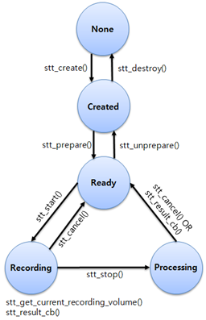

# Speech-to-text


The STT (speech-to-text) features enable recognizing sound data recorded by the user and sending the result as text.

When your application creates a handle and prepares the STT service by the API, the STT daemon is invoked and connected for background work. This daemon and your application communicate as the server and the client.

The main features of the STT API include:

- Preparing the STT service for use

  You can [connect the background STT daemon](#prepare) to be able to operate the STT.

- Using basic STT processes

  The [basic processes](#basic_stt) allow you to set and unset callbacks, control the recording, and set options. You can also [set STT parameters](#parameter_stt).

- Retrieving STT information

  You can [get information](#info_stt) that includes, for example, language and state.

<a name="basic_stt"></a>
## Basic STT Processes

Using STT, you can:

- Create a handle and register callback functions.
  - Create a STT handle, which is used for distinguishing your application from other applications also using the STT.
  - [Get notifications on state changes](#set), language changes, recognition results, and errors by registered callback functions.
- Start, stop, and cancel recognition.
  - [Start recording the user voice](#option) by microphone and analyze the recorded data as text.
  - If you stop the recording manually by the API, the STT stops the recording and recognizes the sound data. The recognized text is then sent by the registered callback function.
  - You also can set sounds which are played before the STT recording starts or after the recording stops.
- Get the recognition result.
  - The recognition result is sent by the registered callback function.
  - With a specific STT engine, you can obtain the time stamp information for the recognition result.
  - Some STT engines send the recognition result partially during the user recording. You can get the result information using the parameter of the recognition result callback function.

The STT life-cycle is described in the following figure.

**Figure: STT life-cycle**



<a name="parameter_stt"></a>
## STT Parameters

You can set the following parameters about the STT:

- Credential

  The credential is a key to verify the authorization about using the STT engine. The necessity of the credential depends on the STT engine. If the STT engine requests the credential, you can set it using the `stt_set_credential()` function.

- Private data

  The private data is a setting parameter for applying keys provided by the STT engine. Using the `stt_set_private_data()` function, you can set the private data as the corresponding key of the STT engine.

<a name="info_stt"></a>
## STT Information Retrieval

You can get the following information about the STT:

- [Get the current state](#get) of the STT. The state is also applied as a precondition for each function.
- Get the default language.
  - You can start recognition with the language that you want as a parameter of the start API. However, if you do not set a specific language, the STT starts recording and uses the default language for recognition.
  - The default language can be changed by the STT setting an application or by the display language changing. If the display language is changed to a non-supported one, the STT language is changed to UK English.
- Get a list of the supported languages to check whether the language you want is supported.
- Get a list of the supported engines and the selection of current engines. Additional features, such as silence detection and partial result, are provided by specific engines.
- Get the error message when the error callback is invoked.
- Get private data from the STT engine.

## Prerequisites

To enable your application to use the STT functionality:

1. To use the functions and data types of the STT (speech-to-text) API (in [mobile](../../api/mobile/latest/group__CAPI__UIX__STT__MODULE.html) and [wearable](../../api/wearable/latest/group__CAPI__UIX__STT__MODULE.html) applications), include the `<stt.h>` header file in your application:

    ```
    #include <stt.h>
    ```

2. To use the STT library, create an STT handle.

   The STT handle is used in other STT functions as a parameter. After the handle creation, the STT state changes to `STT_STATE_CREATED`.

   > **Note**
   >
   > STT is not thread-safe and depends on the Ecore main loop. Implement STT within the Ecore main loop and do not use it in a thread.

   ```
   void
   create_stt_handle()
   {
       stt_h stt;
       int ret;
       ret = stt_create(&stt);
       if (STT_ERROR_NONE != ret)
           /* Error handling */
   }
   ```

3. When you no longer need the STT library, destroy the STT handle using the `stt_destroy()` function:

   ```
   void
   destroy_stt_handle(stt_h stt)
   {
       int ret;
       ret = stt_destroy(stt); /* stt is the STT handle */
       if (STT_ERROR_NONE != ret)
           /* Error handling */
   }
   ```

   > **Note**
   >
   >  Do not use the `stt_destroy()` function in a callback. Within a callback, the `stt_destroy()` function fails and returns `STT_ERROR_OPERATION_FAILED`.

<a name="set"></a>
## Setting and Unsetting Callbacks

The enum values, as well as the parameter details, for the callback parameters are defined in the `stt.h` header file.

To set and unset callbacks:

1. The STT provides various callbacks to get the information, such as the recognition result, state changes, language changes, and errors.

   Set the callbacks in the `STT_STATE_CREATED` state.

   You can use the following callbacks:

   - State changed

     If you set the state changed callback, it is invoked when the STT state changes.

     ```
     /* Callback */
     void
     state_changed_cb(stt_h stt, stt_state_e previous, stt_state_e current, void* user_data)
     {
         /* Your code */
     }

     /* Set */
     void
     set_state_changed_cb(stt_h stt)
     {
         int ret;
         ret = stt_set_state_changed_cb(stt, state_changed_cb, NULL);
         if (STT_ERROR_NONE != ret)
             /* Error handling */
     }

     /* Unset */
     void
     unset_state_changed_cb(stt_h stt)
     {
         int ret;
         ret = stt_unset_state_changed_cb(stt);
         if (STT_ERROR_NONE != ret)
             /* Error handling */
     }
     ```

   - Default language changed

     The default language of the STT is changed either when the system language is changed, or through the STT settings. To get a notification of a language change, set the default language changed callback:

     ```
     /* Callback */
     void
     default_language_changed_cb(stt_h stt, const char* previous_language,
                                 const char* current_language, void* user_data)
     {
         /* Your code */
     }

     /* Set */
     void
     set_default_language_changed_cb(stt_h stt)
     {
         int ret;
         ret = stt_set_default_language_changed_cb(stt, default_language_changed_cb, NULL);
         if (STT_ERROR_NONE != ret)
             /* Error handling */
     }

     /* Unset */
     void
     unset_default_language_changed_cb(stt_h stt)
     {
         int ret;
         ret = stt_unset_default_language_changed_cb(stt);
         if (STT_ERROR_NONE != ret)
             /* Error handling */
     }
     ```

   - Recognition result

     To get the STT recognition result, set the recognition result callback.

     Within the callback, use the `stt_foreach_detailed_result()` function to trigger a result time callback that retrieves the time stamp of the current recognition result.

     ```
     /* Result time callback */
     bool
     result_time_cb(stt_h stt, int index, stt_result_time_event_e event, const char* text,
                    long start_time, long end_time, void* user_data)
     {
         /* Your code */
     }

     /* Recognition result callback */
     void
     recognition_result_cb(stt_h stt, stt_result_event_e event, const char** data,
                           int data_count, const char* msg, void* user_data)
     {
         /* If you want to get time info of result */
         int ret;
         ret = stt_foreach_detailed_result(stt, result_time_cb, NULL);
         if (STT_ERROR_NONE != ret)
             /* Error handling */
         /* Your code */
     }

     /* Set */
     void
     set_recognition_result_cb(stt_h stt)
     {
         int ret;
         ret = stt_set_recognition_result_cb(stt, recognition_result_cb, NULL);
         if (STT_ERROR_NONE != ret)
             /* Error handling */
     }

     /* Unset */
     void
     unset_recognition_result_cb(stt_h stt)
     {
         int ret;
         ret = stt_unset_recognition_result_cb(stt);
         if (STT_ERROR_NONE != ret)
             /* Error handling */
     }
     ```

   - Engine changed

     If you set the engine change callback for the STT, it is invoked when the engine is changed by the STT:

     ```
     /* Callback */
     void
     engine_changed_cb(stt_h stt, const char* engine_id, const char* language, bool support_silence,
                       bool need_credential, void* user_data)
     {
         /* Your code */
     }

     /* Set */
     void
     set_engine_changed_cb(stt_h stt)
     {
         int ret;
         ret = stt_set_engine_changed_cb(stt, engine_changed_cb, NULL);
         if (STT_ERROR_NONE != ret)
             /* Error handling */
     }

     /* Unset */
     void
     unset_engine_changed_cb(stt_h stt)
     {
         int ret;
         ret = stt_unset_engine_changed_cb(stt);
         if (STT_ERROR_NONE != ret)
             /* Error handling */
     }
     ```

   - Error

     When an error occurs, the STT library sends an error message using a callback:

     ```
     /* Callback */
     void
     error_cb(stt_h stt, stt_error_e reason, void* user_data)
     {
         /* Your code */
     }

     /* Set */
     void
     set_error_cb(stt_h stt)
     {
         int ret;
         ret = stt_set_error_cb(stt, error_cb, NULL);
         if (STT_ERROR_NONE != ret)
             /* Error handling */
     }

     /* Unset */
     void
     unset_error_cb(stt_h stt)
     {
         int ret;
         ret = stt_unset_error_cb(stt);
         if (STT_ERROR_NONE != ret)
             /* Error handling */
     }
     ```

<a name="get"></a>
## Getting Information

To obtain the current STT state, the list of supported languages, and the current language:

- Get the current state using the `stt_get_state()` function.

    The STT state is changed by various STT functions, and it is applied as a precondition for each function.

    ```
    void
    get_state(stt_h stt)
    {
        stt_state_e current_state;
        int ret;
        ret = stt_get_state(stt, &current_state);
        if (STT_ERROR_NONE != ret)
            /* Error handling */
    }
    ```

- Obtain a list of languages supported by the STT using the `stt_foreach_supported_languages()` function.

    The foreach function triggers a separate callback for each supported language. As long as the callback returns `true`, the foreach function continues to loop over the supported languages.

    ```
    bool
    supported_language_cb(stt_h stt, const char* language, void* user_data)
    {
        return true; /* To continue to get the next supported language */

        return false; /* To stop the loop */
    }

    void
    get_supported_language(stt_h stt)
    {
        int ret;
        ret = stt_foreach_supported_languages(stt, supported_language_cb, NULL);
        if (STT_ERROR_NONE != ret)
            /* Error handling */
    }
    ```

- Get the default language using the `stt_get_default_language()` function.

    The STT recognition process works for this default language, if you do not set the language as a parameter of the `stt_start()` function.

    ```
    void
    get_default_language(stt_h stt)
    {
        int ret;
        char* default_lang = NULL;
        ret = stt_get_default_language(stt, &default_lang);
        if (STT_ERROR_NONE != ret)
            /* Error handling */
    }
    ```

You can get a notification about the default language changes by setting a default language changed callback.

- Obtain a list of engines supported by the STT using the `stt_foreach_supported_engines()` function.

   The foreach function triggers a separate callback for each supported engine. As long as the callback returns `true`, the foreach function continues to loop over the supported engines.

    ```
    bool
    supported_engine_cb(stt_h stt, const char* engine_id, const char* engine_name,
                        void* user_data)
    {
        return true; /* To continue to get the next supported engine */

        return false; /* To stop the loop */
    }

    void
    get_supported_engine(stt_h stt)
    {
        int ret;
        ret = stt_foreach_supported_engines(stt, supported_engine_cb, NULL);
        if (STT_ERROR_NONE != ret)
            /* Error handling */
    }
    ```

- Get or set the current engine for the STT recognition using the `stt_set_engine()` and `stt_get_engine()` functions.

    The supported language, silence detection, and supported recognition types depend on the STT engine.

    ```
    /* Get the engine */
    void
    get_current_engine(stt_h stt)
    {
        int ret;
        char* current_engine_id = NULL;
        ret = stt_get_engine(stt, &current_engine_id);
        if (STT_ERROR_NONE != ret)
            /* Error handling */
    }

    /* Set the engine */
    void
    set_current_engine(stt_h stt, const char* engine_id)
    {
        int ret;
        ret = stt_set_engine(stt, engine_id);
        if (STT_ERROR_NONE != ret)
            /* Error handling */
    }
    ```

- Check whether a recognition type defined in the `<stt.h>` header file is supported by the current engine.

    The normal recognition type, `STT_RECOGNITION_TYPE_FREE`, means that the whole recognition result is sent at the end of the recognition process. The `STT_RECOGNITION_TYPE_FREE_PARTIAL` recognition type is used to get a partial recognition result.

    ```
    void
    check_supported_recognition_type(stt_h stt)
    {
        int ret;
        bool support;
        ret = stt_is_recognition_type_supported(stt,
                                                STT_RECOGNITION_TYPE_FREE_PARTIAL,
                                                &support);
        if (STT_ERROR_NONE != ret)
            /* Error handling */
    }
    ```

- Get the error message.

    Call this function during the STT error callback. If not, the error as an operation failure is returned. If the function succeeds, the error message must be released using the `free()` function, when it is no longer required.

    ```
    void
    error_cb(stt_h stt, stt_error_e reason, void *user_data)
    {
        int ret;
        char * err_msg = NULL;
        ret = stt_get_error_message(stt, &err_msg);
        if (STT_ERROR_NONE != ret)
            /* Error handling */
        if (NULL != err_msg) {
            /* Memory release */
            free(err_msg);
            err_msg = NULL;
        }
    }

    void
    get_error_message(stt_h stt)
    {
        int ret;
        ret = stt_set_error_cb(stt, error_cb, NULL);
        if (STT_ERROR_NONE != ret)
            /* Error handling */
    }
    ```

<a name="prepare"></a>
## Connecting and Disconnecting the STT

To operate the STT:

1. After you create the STT handle, connect the background STT daemon with the `stt_prepare()` function.

   The function is asynchronous and the STT state changes to `STT_STATE_READY`.

   ```
   void
   prepare_for_stt(stt_h stt)
   {
       int ret;
       ret = stt_prepare(stt);
       if (STT_ERROR_NONE != ret)
           /* Error handling */
   }
   ```

   > **Note**
   >
   > If you get the error callback after calling the `stt_prepare()` function, STT is not available.

2. When the connection is no longer needed, use the `stt_unprepare()` function to disconnect the STT, and change the state to `STT_STATE_CREATED`:

   ```
   void
   unprepared_for_stt(stt_h stt)
   {
       int ret;
       ret = stt_unprepare(stt);
       if (STT_ERROR_NONE != ret)
           /* Error handling */
   }
   ```

## Setting and Getting Options about the STT Engine

To set and get the options about the STT engine:

- Set the credential.

  The credential is a key to verify the authorization about using the STT engine. The necessity of the credential depends on the engine. If the engine requests the credential, you can set it using the `stt_set_credential()` function:

  ```
  void
  set_credential(stt_h stt, const char* credential)
  {
      int ret;
      ret = stt_set_credential(stt, credential);
      if (STT_ERROR_NONE != ret)
          /* Error handling */
  }
  ```

- Set and get the private data.

  The private data is a setting parameter for applying keys provided by the STT engine. Using the `stt_set_private_data()` function, you can set the private data and use the corresponding key of the engine. To get the private data which corresponds to a specific key from the engine, use the `stt_get_private_data()` function.

  > **Note**
  >
  >  The key and data are determined by the STT engine. To set and get the private data, see the engine instructions.

  ```
  void
  set_private_data(stt_h stt, const char* key, const char* data)
  {
      int ret;
      ret = stt_set_private_data(stt, key, data);
      if (STT_ERROR_NONE != ret)
          /* Error handling */
  }

  void
  get_private_data(stt_h stt, const char* key, char** data)
  {
      int ret;
      ret = stt_get_private_data(stt, key, data);
      if (STT_ERROR_NONE != ret)
          /* Error handling */
  }
  ```

<a name="option"></a>
## Setting Options and Controlling Recording

To set the STT options and control recording:

- Set the silence detection.

  After the STT starts recognizing sound, some STT engines can detect silence when the sound input from the user ends. If the silence detection is enabled, the STT library stops recognition automatically and sends the result. Otherwise, you can manually stop the recognition process using the `stt_stop()` function.

  If you set the silence detection as automatic, STT works according to the global STT setting. This option must be set in the `STT_STATE_READY` state.

  ```
  void
  set_silence_detection(stt_h stt, stt_option_silence_detection_e type)
  {
      int ret;
      /* Default type is STT_OPTION_SILENCE_DETECTION_AUTO */
      ret = stt_set_silence_detection(stt, type);
      if (STT_ERROR_NONE != ret)
          /* Error handling */
  }
  ```

- Set or unset the start sound.

  To play a sound before the STT recognition starts, call the `stt_set_start_sound()` function in the `STT_STATE_READY` state.

  > **Note**
  >
  > The sound file path must be a full path. Only WAV format sound files are supported.

  ```
  void
  set_start_sound(stt_h stt, const char* filename)
  {
      int ret;
      ret = stt_set_start_sound(stt, filename);
      if (STT_ERROR_NONE != ret)
          /* Error handling */
  }

  void
  unset_start_sound(stt_h stt)
  {
      int ret;
      ret = stt_unset_start_sound(stt);
      if (STT_ERROR_NONE != ret)
          /* Error handling */
  }
  ```

- Set or unset the stop sound.

  To play a sound when the STT recognition stops, use the `stt_set_stop_sound()` function in the `STT_STATE_READY` state:

  > **Note**
  >
  > The sound file path must be a full path. Only WAV format sound files are supported.

  ```
  void
  set_stop_sound(stt_h stt, const char* filename)
  {
      int ret;
      ret = stt_set_stop_sound(stt, filename);
      if (STT_ERROR_NONE != ret)
          /* Error handling */
  }

  void
  unset_stop_sound(stt_h stt)
  {
      int ret;
      ret = stt_unset_stop_sound(stt);
      if (STT_ERROR_NONE != ret)
          /* Error handling */
  }
  ```

- Start, stop, and cancel the recognition:

  - To start recording, use the `stt_start()` function.

    The connected STT daemon starts recording, and the state is changed to `STT_STATE_RECORDING`.

    > **Note**
    >
    > If the `stt_start()` function fails, check the error code and take appropriate action.

    The language and recognition type must be supported by the current STT engine. If you set `NULL` as the language parameter, the STT default language is used based on the `stt_get_default_language()` function.

    ```
    void
    start(stt_h stt, const char* language, const char* type)
    {
        int ret;
        ret = stt_start(stt, language, type); /* Default language is NULL */
        if (STT_ERROR_NONE != ret)
            /* Error handling */
    }
    ```

  - While the STT recording is in process, you can retrieve the current recording volume using the `stt_get_recording_volume()` function.

    The volume value is retrieved periodically with the short-term recorded sound data as dB (decibels). The STT volume normally has a negative value, and 0 is the maximum value.

    ```
    void
    get_volume(stt_h stt)
    {
        int ret;
        float current_volume;
        ret = stt_get_recording_volume(stt, &current_volume);
        if (STT_ERROR_NONE != ret)
            /* Error handling */
    }
    ```

  - To stop the recording and get the recognition result, use the `stt_stop()` function.

    The recording stops and the state is changed to `STT_STATE_PROCESSING`. When the recognition result has been processed, the result is sent in the recognition result callback and the state is changed back to `STT_STATE_READY`.

    ```
    void
    stop(stt_h stt)
    {
        int ret;
        ret = stt_stop(stt);
        if (STT_ERROR_NONE != ret)
            /* Error handling */
    }
    ```

  - To cancel the recording without getting the result, use the `stt_cancel()` function.

    The state changes to `STT_STATE_READY`.

    ```
    void
    cancel(stt_h stt)
    {
        int ret;
        ret = stt_cancel(stt);
        if (VC_STATIC_ERROR_NONE != ret)
            /* Error handling */
    }
    ```

## Related Information
* Dependencies
  - Tizen 2.4 and Higher for Mobile
  - Tizen 2.3.1 and Higher for Wearable
