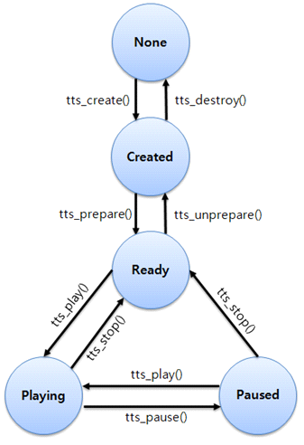

# Text-to-speech


The TTS (text-to-speech) features include synthesizing text into sound data as utterances and playing them. It is also possible to pause and stop playing.

When your application creates a handle and prepares the TTS service by the API, the TTS daemon is invoked and connected for background work. This daemon and your application communicate as the server and the client.

The main features of the TTS API include:

- Preparing the TTS service for use

  You can [connect the background TTS daemon](#prepare) to be able to operate the TTS.

- Using basic TTS processes

  The [basic processes](#basic_tts) allow you to set and unset callbacks, add text, set the mode, and control the playback. You can also [set TTS parameters](#parameter_tts).

- Retrieving TTS information

  You can [get information](#info_tts) on the supported voice, and the current state and voice.

<a name="basic_tts"></a>
## Basic TTS Processes

Using TTS, you can:

- Create a handle and register callback functions.
  - Create a TTS handle which is used for distinguishing your application from other applications also using the TTS.
  - To get notifications about state changes, language changes, starting or finishing utterances, and errors, [register callback functions](#set).
- Add text and set the mode.
  - [Add the text](#text) that you want to read out by the TTS module. The requested text is handled as an utterance. You can add several texts, and they are managed using a queue.
  - There is a limit on the maximum text length for one utterance, and the time spent for synthesizing is dependent on the text length.
  - [Get and set the TTS mode](#mode) to manage audio mixing with other sources.
- Play, pause, and stop playback.
  - [Synthesize the text in the queue and play the sound data after synthesizing](#control).
  - You can also pause and stop playing. If you call the function to stop, all requested data (both the sound data and text in the queue) is deleted.

The TTS life-cycle is described in the following figure.

**Figure: TTS life-cycle**



<a name="parameter_tts"></a>
## TTS Parameters

You can set the following parameters about the TTS:

- Credential

  The credential is a key to verify the authorization about using the TTS engine. The necessity of the credential depends on the TTS engine. If the TTS engine requests the credential, you can set it using the `tts_set_credential()` function.

- Private data

  The private data is a setting parameter for applying keys provided by the TTS engine. Using the `tts_set_private_data()` function, you can set the private data as the corresponding key of the TTS engine.

<a name="info_tts"></a>
## TTS Information Retrieval

You can get the following information about the TTS:

- [Get the current state](#get) of the TTS. The state is also applied as a precondition for each function.
- Get the default voice.
  - In the TTS, the voice is defined as a combination of the language and the type, such as male or female.
  - You can request the synthesis of the text with your own voice option by the parameter of the add text function. However, if you do not set a specific option, the TTS synthesizes the text with the default voice.
  - The default voice can be changed by the TTS setting an application or by the display language changing. If the display language is changed to a non-supported language, the language of the TTS is changed to UK English.
- Get a list of supported voices to check whether the language and voice type you want are supported.
- Get the error message when the error callback is invoked.
- Get private data from the TTS engine.

## Prerequisites

To enable your application to use the TTS functionality:

1. To use the functions and data types of the TTS (text-to-speech) API (in [mobile](../../api/mobile/latest/group__CAPI__UIX__TTS__MODULE.html) and [wearable](../../api/wearable/latest/group__CAPI__UIX__TTS__MODULE.html) applications), include the `<tts.h>` header file in your application:
   ```
   #include <tts.h>
   ```

2. To use the TTS library, create a TTS handle.

   The TTS handle is used in other TTS functions as a parameter. After the handle creation, the TTS state changes to `TTS_STATE_CREATED`.

   > **Note**
   >
   > TTS is not thread-safe and depends on the Ecore main loop. Implement TTS within the Ecore main loop and do not use it in a thread.

   ```
   void
   create_tts_handle()
   {
       tts_h tts;
       int ret;
       ret = tts_create(&tts);
       if (TTS_ERROR_NONE != ret)
           /* Error handling */
   }
   ```

3. When you no longer need the TTS library, destroy the TTS handle using the `tts_destroy()` function:

   ```
   void
   destroy_tts_handle(tts_h tts)
   {
       int ret;
       ret = tts_destroy(tts); /* tts is the TTS handle */
       if (TTS_ERROR_NONE != ret)
           /* Error handling */
   }
   ```

   > **Note**
   >
   > Do not use the `tts_destroy()` function in a callback function. Within a callback, the `tts_destroy()` function fails and returns `TTS_ERROR_OPERATION_FAILED`.

<a name="set"></a>
## Setting and Unsetting Callbacks

The enum values, as well as the parameter details, for the callback parameters are defined in the `tts.h` header file.

To set and unset callbacks:

1. The TTS provides various callbacks to get information, such as the state changes and start or completion of an utterance.

   Set the callbacks in the `TTS_STATE_CREATED` state.

   You can use the following callbacks:

   - State changed

     If you set the state change callback, it is invoked when the TTS state changes.

     ```
     /* Callback */
     void
     state_changed_cb(tts_h tts, tts_state_e previous, tts_state_e current, void* user_data)
     {
         /* Your code */
     }

     /* Set */
     void
     set_state_changed_cb(tts_h tts)
     {
         int ret;
         ret = tts_set_state_changed_cb(tts, state_changed_cb, NULL);
         if (TTS_ERROR_NONE != ret)
             /* Error handling */
     }

     /* Unset */
     void
     unset_state_changed_cb(tts_h tts)
     {
         int ret;
         ret = tts_unset_state_changed_cb(tts);
         if (TTS_ERROR_NONE != ret)
             /* Error handling */
     }
     ```

   - Default voice changed

     In the TTS library, the voice includes the language used and the voice type, such as male or female. The default voice of the TTS is changed either when the system language is changed, or through the TTS settings. To get a notification of a voice change, set the default voice changed callback:

     ```
     /* Callback */
     void
     default_voice_changed_cb(tts_h tts, const char* previous_language, int previous_voice_type,
                              const char* current_language, int current_voice_type, void* user_data)
     {
         /* Your code */
     }

     /* Set */
     void
     set_default_voice_changed_cb(tts_h tts)
     {
         int ret;
         ret = tts_set_default_voice_changed_cb(tts, default_voice_changed_cb, NULL);
         if (TTS_ERROR_NONE != ret)
             /* Error handling */
     }

     /* Unset */
     void
     unset_default_language_changed_cb(tts_h tts)
     {
         int ret;
         ret = tts_unset_default_voice_changed_cb(tts);
         if (TTS_ERROR_NONE != ret)
             /* Error handling */
     }
     ```

   - Engine changed

     If you set the engine change callback for the TTS, it is invoked when the engine is changed by the TTS:

     ```
     /* Callback */
     void
     engine_changed_cb(tts_h tts, const char* engine_id, const char* language,
                       int voice_type, bool need_credential, void* user_data)
     {
         /* Your code */
     }

     /* Set */
     void
     set_engine_changed_cb(tts_h tts)
     {
         int ret;
         ret = tts_set_engine_changed_cb(tts, engine_changed_cb, NULL);
         if (TTS_ERROR_NONE != ret)
             /* Error handling */
     }

     /* Unset */
     void
     unset_engine_changed_cb(tts_h tts)
     {
         int ret;
         ret = tts_unset_engine_changed_cb(tts);
         if (TTS_ERROR_NONE != ret)
             /* Error handling */
     }
     ```

   - Utterance started or completed

     If you add text in the TTS, that text is handled as an utterance and it obtains its own ID. After you request the TTS process to start, the text is synthesized by an engine and played out. To get a notification when an utterance is started or completed, set the respective callbacks:

     ```
     /* Started callback */
     void
     utterance_started_cb(tts_h tts, int utt_id, void* user_data)
     {
         /* Your code */
     }

     /* Completed callback */
     void
     utterance_completed_cb(tts_h tts, int utt_id, void* user_data)
     {
         /* Your code */
     }

     /* Set */
     void
     set_utterance_cb(tts_h tts)
     {
         int ret;
         ret = tts_set_utterance_started_cb(tts, utterance_started_cb, NULL);
         if (TTS_ERROR_NONE != ret)
             /* Error handling */

         ret = tts_set_utterance_completed_cb(tts, utterance_completed_cb, NULL);
         if (TTS_ERROR_NONE != ret)
             /* Error handling */
     }

     /* Unset */
     void
     unset_utterance_cb(tts_h tts)
     {
         int ret;
         ret = tts_unset_utterance_started_cb(tts);
         if (TTS_ERROR_NONE != ret)
             /* Error handling */
         ret = tts_unset_utterance_completed_cb(tts);
         if (TTS_ERROR_NONE != ret)
             /* Error handling */
     }
     ```

   - Error

     When an error occurs, the TTS library sends a message using a callback:

     ```
     /* Callback */
     void
     error_cb(tts_h tts, int utt_id, tts_error_e reason, void* user_data)
     {
         /* Your code */
     }

     /* Set */
     void
     set_error_cb(tts_h tts)
     {
         int ret;
         ret = tts_set_error_cb(tts, error_cb, NULL);
         if (TTS_ERROR_NONE != ret)
             /* Error handling */
     }

     /* Unset */
     void
     unset_error_cb(tts_h tts)
     {
         int ret;
         ret = tts_unset_error_cb(tts);
         if (TTS_ERROR_NONE != ret)
             /* Error handling */
     }
     ```

<a name="get"></a>
## Getting Information

To obtain the current state, the supported voice list, and the current voice:

- Get the current state using the `tts_get_state()` function.

    The TTS state is changed by various TTS functions, and it is applied as a precondition of each function.

    ```
    void
    get_state(tts_h tts)
    {
        tts_state_e current_state;
        int ret;
        ret = tts_get_state(tts, &current_state);
        if (TTS_ERROR_NONE != ret)
            /* Error handling */
    }
    ```

- Obtain a list of voices supported by the TTS using the `tts_foreach_supported_voices()` function.

    The foreach function triggers a separate callback for each supported voice. As long as the callback returns `true`, the foreach function continues to loop over the supported voices.

    ```
    bool
    supported_voice_cb(tts_h tts, const char* language, int voice_type, void* user_data)
    {
        return true; /* To continue to get the next supported language */

        return false; /* To stop the loop */
    }

    void
    get_supported_voice(tts_h tts)
    {
        int ret;
        ret = tts_foreach_supported_voices(tts, supported_language_cb, NULL);
        if (TTS_ERROR_NONE != ret)
            /* Error handling */
    }
    ```

- Get the default voice using the `tts_get_default_voice()` function.

    The TTS synthesizes the text using the default voice, if you do not set the language and the voice type as parameters of the `tts_add_text()` function.

    ```
    void
    get_default_voice(tts_h tts)
    {
        int ret;
        char* default_lang = NULL;
        int default_voice_type;
        ret = tts_get_default_voice(tts, &default_lang, &default_voice_type);
        if (TTS_ERROR_NONE != ret)
            /* Error handling */
    }
    ```

    You can get a notification about the default voice changes by setting a default voice changed callback.

- Get the error message.

  Call this function during the TTS error callback. If not, the error as an operation failure is returned. If the function succeeds, the error message must be released using the `free()` function, when it is no longer required.

  ```
  void
  error_cb(tts_h tts, int utt_id, tts_error_e reason, void* user_data)
  {
      int ret;
      char * err_msg = NULL;
      ret = tts_get_error_message(tts, &err_msg);
      if (TTS_ERROR_NONE != ret)
          /* Error handling */
      if (NULL != err_msg) {
          /* Memory release */
          free(err_msg);
          err_msg = NULL;
      }
  }

  void
  get_error_message(tts_h tts)
  {
      int ret;
      ret = tts_set_error_cb(tts, error_cb, NULL);
      if (TTS_ERROR_NONE != ret)
          /* Error handling */
  }
  ```

<a name="mode"></a>
## Getting and Setting the Mode

There are 3 different TTS modes available. The main difference is audio mixing with other sources. The default mode is `TTS_MODE_DEFAULT`, used for normal applications such as eBooks. If you set this mode and play your text, it can be interrupted when other sounds, such as ringtone or other TTS sounds, are played.

> **Note**
>
> The `TTS_MODE_NOTIFICATION` and `TTS_MODE_SCREEN_READER` modes are mixed with other sound sources, but they are used only for platform-specific features. Do not use them for normal applications.

Get and set the mode in the `TTS_STATE_CREATED` state:

```
void
set_mode(tts_h tts)
{
    int ret;
    tts_mode_e mode = TTS_MODE_DEFAULT;
    ret = tts_set_mode(tts, mode);
    if (TTS_ERROR_NONE != ret)
        /* Error handling */
}

void
get_mode(tts_h tts)
{
    int ret;
    tts_mode_e mode;
    ret = tts_get_mode(tts, &mode);
    if (TTS_ERROR_NONE != ret)
        /* Error handling */
}
```

<a name="prepare"></a>
## Connecting and Disconnecting TTS

To operate the TTS:

1. After you create the TTS handle, connect the background TTS daemon with the `tts_prepare()` function.

   The daemon synthesizes the text with the engine and plays the resulting sound data. The function is asynchronous and the TTS state changes to `TTS_STATE_READY`.

   ```
   void
   prepare_for_tts(tts_h tts)
   {
       int ret;
       ret = tts_prepare(tts);
       if (TTS_ERROR_NONE != ret)
           /* Error handling */
   }
   ```

   > **Note**
   >
   > If you get the error callback after calling the `tts_prepare()` function, TTS is not available.

2. When the connection is no longer needed, use the `tts_unprepare()` function to disconnect the TTS and change the state to `TTS_STATE_CREATED`:

   ```
   void
   unprepared_for_tts(tts_h tts)
   {
       int ret;
       ret = tts_unprepare(tts);
       if (TTS_ERROR_NONE != ret)
           /* Error handling */
   }
   ```

## Setting and Getting Options about the TTS Engine

To set and get the options about the TTS engine:

- Set the credential.

  The credential is a key to verify the authorization about using the TTS engine. The necessity of the credential depends on the engine. If the engine requests the credential, you can set it using the `tts_set_credential()` function:

  ```
  void
  set_credential(tts_h tts, const char* credential)
  {
      int ret;
      ret = tts_set_credential(tts, credential);
      if (TTS_ERROR_NONE != ret)
          /* Error handling */
  }
  ```

- Set and get the private data.

  The private data is a setting parameter for applying keys provided by the TTS engine. Using the `tts_set_private_data()` function, you can set the private data and use the corresponding key of the engine. To get the private data which corresponds to a specific key from the engine, use the `tts_get_private_data()` function.

  > **Note**
  >
  > The key and data are determined by the TTS engine. To set and get the private data, see the engine instructions.

  ```
  void
  set_private_data(tts_h tts, const char* key, const char* data)
  {
      int ret;
      ret = tts_set_private_data(tts, key, data);
      if (TTS_ERROR_NONE != ret)
          /* Error handling */
  }

  void
  get_private_data(tts_h tts, const char* key, char** data)
  {
      int ret;
      ret = tts_get_private_data(tts, key, data);
      if (TTS_ERROR_NONE != ret)
          /* Error handling */
  }
  ```

<a name="text"></a>
## Adding Text

There are defined values, `TTS_VOICE_TYPE_AUTO` and `TTS_VOICE_SPEED_AUTO` for following the default TTS setting. Those values, and the minimum and maximum limits for the speed, are defined in the `tts.h` header file.

To add text:

- You can request the TTS library to read your own text using the `tts_add_text()` function. The TTS library manages added text using queues, so it is possible to add several texts simultaneously. Each obtained text receives an utterance ID, which is used for synthesizing and playing the sound data.

  > **Note**
  >
  > If the added text is too long, some engines need a long time for synthesis. It is recommended to only use proper length text clips.

  When you do not set the language and use `NULL` for it, the default language is used for synthesizing text.

  You can add text at any point after the `tts_prepare()` function changes the state to `TTS_STATE_READY`.

  ```
  void
  add_text(tts_h tts)
  {
      const char* text = "tutorial"; /* Text for read */
      const char* language = "en_US"; /* Language */
      int voice_type = TTS_VOICE_TYPE_FEMALE; /* Voice type */
      int speed = TTS_SPEED_AUTO; /* Read speed */
      int utt_id; /* Utterance ID for the requested text */

      int ret;
      ret = tts_add_text(tts, text, language, voice_type, speed, &utt_id);
      if (TTS_ERROR_NONE != ret)
          /* Error handling */
  }
  ```

- There is a length limit for the added text in the engine.

  To retrieve the maximum value, use the `tts_get_max_text_size()` function in the `TTS_STATE_READY` state:

  ```
  void
  get_maximum_text_size(tts_h tts)
  {
      int ret;
      int size;
      ret = tts_get_max_text_size(tts, &size);
      if (TTS_ERROR_NONE != ret)
          /* Error handling */
  }
  ```

<a name="control"></a>
## Controlling the Playback

To start, pause, and stop the playback:

- To start synthesizing the text added in the queue and play the resulting sound data in sequence, use the `tts_play()` function.

  The state is changed to `TTS_STATE_PLAYING`, and the playback continues until you call the `tts_stop()` or the `tts_pause()` function.

  If there is no text in the queue, the TTS waits for text to be added in the `TTS_STATE_PLAYING` state. In that case, when you add text, the TTS starts synthesizing and playing it immediately. The TTS state need not change to `TTS_STATE_READY` state before using the `tts_stop()` function.

  > **Note**
  >
  > If you get the TTS state changed callback in the `TTS_STATE_PLAYING` state without a TTS function call, prepare the TTS state. The TTS state can change if other applications request TTS play, the audio session requests TTS pause, or the TTS engine changes.

  ```
  void
  start(tts_h tts)
  {
      int ret;
      ret = tts_play(tts);
      if (TTS_ERROR_NONE != ret)
          /* Error handling */
  }
  ```

- To pause the playback, use the `tts_pause()` function.

  The state is changed to `TTS_STATE_PAUSED`. To resume playback, use the `tts_play()` function.

  ```
  void
  pause(tts_h tts)
  {
      int ret;
      ret = tts_pause(tts);
      if (TTS_ERROR_NONE != ret)
          /* Error handling */
  }
  ```

- To stop the playback, use the `tts_stop()` function.

  All the texts in the queue are removed, and the state is changed to `TTS_STATE_READY`.

  ```
  void
  stop(tts_h tts)
  {
      int ret;
      ret = tts_stop(tts);
      if (TTS_ERROR_NONE != ret)
          /* Error handling */
  }
  ```

## Related Information
* Dependencies
  - Tizen 2.4 and Higher for Mobile
  - Tizen 2.3.1 and Higher for Wearable
