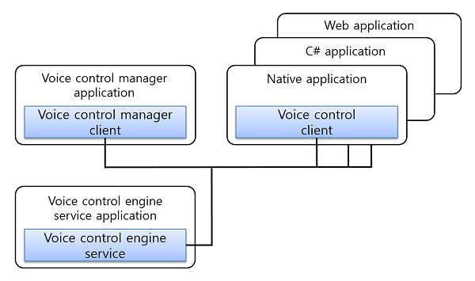
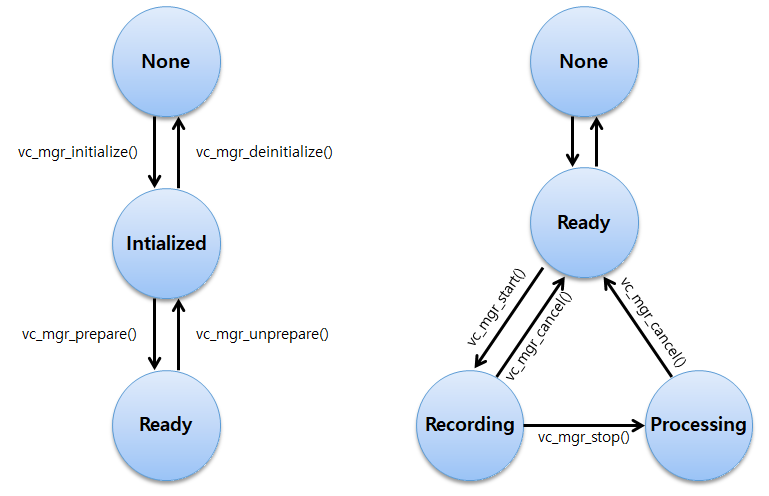

# Voice control manager


Voice control manager features allow you to record voice and get responses for the recognized voice commands. You can register general and system voice commands such as "power on", "power off", "music play", "music stop", and so on. Also, you can start and stop voice recording. When the voice recording finishes, you can receive multiple recognition results such as Automatic Speech Recognition (ASR) and matched commands from the commands list registered by the application using the voice control client.

The main features of the Voice control manager API include:

- Initializing voice control manager handle and register callbacks
  - You can initialize a voice control manager handle. Only one handle works on the device at any point in time.
  - You can get [notifications](#callback) of state changes, language changes, recognition results, specific results from service engine, and errors by registered callbacks.
- Managing commands
  - You can register commands as "system", "widget", "foreground", "system background", "background", and "exclusive" type on the voice control service. When you speak a registered command, the callback returns the recognized result.
- Starting, stopping, and canceling recognition
  - You can [start and stop voice recording](#start_and_stop_recording) using a microphone.
  - You can set to stop recording manually or automatically. If automatic stop is set, voice control manager stops recording when the end of speech is detected.
  - When the voice recording finishes, the voice control service recognizes the speech data and finds matching commands among the registered commands.
- Getting the recognition result
  - The recognition result is invoked by the registered event handler.
  - You can get a matched command list from the voice control engine.
  - You can select a command among the matched commands.
- Retrieving information
  - You can [get various kinds of information](#info) from the voice control manager.
    - Voice control manager state
      - The state is changed by function calls and applied as a precondition for each API.
    - Voice control service state
      - The voice control service states are controlled by starting and stopping command recognition.
    - Current language
      - You can get the current language that the voice control engine uses as a base to recognize your utterance.
      - Only the commands based on the current language can be recognized. Therefore, your utterance must be in the current language.
      - The current language can be changed in application settings or by changing the language on the device display.
    - Supported language
      - You can retrieve a list of supported languages to check whether the language you want is supported.

To use the voice control manager:

1.  Initialize the voice control manager and [register callbacks](#callback).

    The initialization allows the voice control manager to distinguish your application from any other application that also uses voice control. Only one voice control manager application can work on the device. Therefore, if another application that includes a voice control manager exists, your application cannot work properly on the same device. The registered callbacks can be notified of the changes in service status, current language, recognition results, and errors.

2.  Prepare the voice control manager.

    Prepare to invoke the voice control service for the background work, such as recording and recognizing the user's voice. When the application initializes and prepares the voice control manager, the voice control daemon is invoked and connected for the background work. The daemon and the application communicate as server and client.

3.  Set commands.

    You can [create a command list](#commands), and add or remove individual commands in the list. While creating an individual command, you can set the command text and type for each command handle. When all the commands are created and added to the command list, you can set the command list to the voice control manager for recognition.

4.  Get the recognized command results and text results from Automatic Speech Recognition (ASR).

    The recognized command result and ASR are sent through a registered callback. You receive the command matching the utterance. Multiple recognition results can be retrieved, if the duplicated commands are registered or you request multiple commands. In this case, you can select or reject the results using the `vc_mgr_all_result_cb` callback registered by `vc_mgr_set_all_result_cb()`.

5.  When no longer needed, unprepare and deinitialize the voice control manager.

    You must disconnect the voice control service and deinitialize the voice control manager using `vc_mgr_unprepare()` and `vc_mgr_deinitialize()`.

The following figure illustrates the overall configuration for the voice control framework:

**Figure: Overview of the voice control framework**



The voice control manager can start, stop, or cancel the voice recording, and the voice control service sends the recognized result to the voice control manager. The voice control client can register commands to recognize the voice and register them in each application.

The following figure illustrates the voice control manager life-cycle:

**Figure: Life-cycle states of Voice control manager (left) and Voice control service (right)**



The following are the voice control service states:
1.  The user starts recording for recognition by using a voice control manager application, button, or voice trigger. If the recording starts successfully, the voice control service state changes to `VC_SERVICE_STATE_RECORDING`.
2.  After the recording is completed, the service state changes to `VC_SERVICE_STATE_PROCESSING` for recognition processing.
3.  After the recognition is completed, the service state changes to `VC_SERVICE_STATE_READY`.

## Prerequisites

To enable your application to use the voice control manager functionality:

1.  To use the Voice control manager API, the application has to request permission by adding the following privileges to the `tizen-manifest.xml` file:

    ```xml
    <privileges>
        <privilege>http://tizen.org/privilege/recorder</privilege>
        <privilege>http://tizen.org/privilege/voicecontrol.manager</privilege>
    </privileges>
    ```

    > [!NOTE]
    > To use this privilege, your application must be signed with a platform-level certificate.

2.  To use the functions and data types of the Voice control manager API (in [mobile](../../api/mobile/latest/group__CAPI__UIX__VOICE__CONTROL__MANAGER__MODULE.html) and [wearable](../../api/wearable/latest/group__CAPI__UIX__VOICE__CONTROL__MANAGER__MODULE.html) applications), include the `<voice_control_manager.h>` header file in your application:

    ```c
    #include <voice_control_manager.h>
    ```

3.  Initialize the voice control with `vc_mgr_initialize()`:

    ```c
    void
    initialize_voice_control_manager()
    {
        int ret;
        ret = vc_mgr_initialize();
        if (VC_ERROR_NONE != ret)
            /* Error handling */
    }
    ```

    If the function call is successful, the voice control state changes to `VC_STATE_INITIALIZED`.

    > [!NOTE]
    > The voice control feature is not thread-safe and depends on the Ecore main loop. It is recommended to implement the voice control within the Ecore main loop and not in a thread.

3.  Prepare the voice control service with `vc_mgr_prepare()`, which connects the background voice control daemon. The daemon records and recognizes audio data and converts sound to text:

    ```c
    void
    prepare_voice_control_manager()
    {
        int ret;
        ret = vc_mgr_prepare();
        if (VC_ERROR_NONE != ret)
            /* Error handling */
    }
    ```

    `vc_mgr_prepare()` is asynchronous. When the preparation succeeds, the voice control manager state changes from `VC_STATE_INITIALIZED` to `VC_STATE_READY`. The error callback is triggered if `vc_mgr_prepare()` fails.

4.  When the voice control manager is no longer needed, unprepare and deinitialize it:

    ```c
    void
    unprepared_vc()
    {
        int ret;
        ret = vc_mgr_unprepare();
        if (VC_ERROR_NONE != ret)
            /* Error handling */
    }

    void
    deinitialize_voice_control()
    {
        int ret;
        ret = vc_mgr_deinitialize();
        if (VC_ERROR_NONE != ret)
            /* Error handling */
    }
    ```

    When `vc_mgr_unprepare()` succeeds, the voice control manager state changes from `VC_STATE_READY` to `VC_STATE_INITIALIZED`.

    > [!NOTE]
    > You must not call `vc_mgr_deinitialize()` in a callback. If called within a callback, `vc_mgr_deinitialize()` fails and returns `VC_ERROR_OPERATION_FAILED`.

<a name="callback"></a>
## Manage callbacks

For information on the callback functions, see the `voice_control_common.h` and `voice_control_manager.h` header files.

Set and unset callbacks to get notifications about recognition results, state changes, and errors:

> [!NOTE]
> Set and unset all callbacks when the voice control manager state is `VC_STATE_INITIALIZED`.

- Set the state changed callback to get invoked when the voice control manager state changes:

  ```c
  /* Callback */
  void
  state_changed_cb(vc_state_e previous, vc_state_e current, void* user_data)
  {
      /* Your code */
  }

  /* Set */
  void
  set_state_changed_cb()
  {
      int ret;
      ret = vc_mgr_set_state_changed_cb(state_changed_cb, NULL);
      if (VC_ERROR_NONE != ret)
          /* Error handling */
  }

  /* Unset */
  void
  unset_state_changed_cb()
  {
      int ret;
      ret = vc_mgr_unset_state_changed_cb();
      if (VC_ERROR_NONE != ret)
          /* Error handling */
  }
  ```

- Set the service state changed callback to get invoked when the Voice control service state changes:

  ```c
  /* Callback */
  void
  __service_state_changed_cb(vc_service_state_e previous, vc_service_state_e current, void* user_data)
  {
      /* Your code */
  }

  /* Set */
  void
  set_service_state_changed_cb()
  {
      int ret;
      ret = vc_mgr_set_service_state_changed_cb(__service_state_changed_cb, NULL);
      if (VC_ERROR_NONE != ret)
          /* Error handling */
  }

  /* Unset */
  void
  unset_service_state_changed_cb()
  {
      int ret;
      ret = vc_mgr_unset_service_state_changed_cb();
      if (VC_ERROR_NONE != ret)
          /* Error handling */
  }
  ```

- Set the current language changed callback to get invoked when the voice control setting language changes:

  ```c
  /* Callback */
  void
  __current_language_changed_cb(const char* previous, const char* current, void* user_data)
  {
      /* Your code */
  }

  /* Set */
  void
  set_current_language_changed_cb()
  {
      int ret;
      ret = vc_mgr_set_current_language_changed_cb(__current_language_changed_cb, NULL);
      if (VC_ERROR_NONE != ret)
          /* Error handling */
  }

  /* Unset */
  void
  unset_current_language_changed_cb()
  {
      int ret;
      ret = vc_mgr_unset_current_language_changed_cb();
      if (VC_ERROR_NONE != ret)
          /* Error handling */
  }
  ```

- Set the error callback to get invoked when an error occurs in the voice control manager process:

  ```c
  /* Callback */
  void
  __error_cb(vc_error_e reason, void* user_data)
  {
      /* Your code */
  }

  /* Set */
  void
  set_error_cb()
  {
      int ret;
      ret = vc_mgr_set_error_cb(__error_cb, NULL);
      if (VC_ERROR_NONE != ret)
          /* Error handling */
  }

  /* Unset */
  void
  unset_error_cb()
  {
      int ret;
      ret = vc_mgr_unset_error_cb();
      if (VC_ERROR_NONE != ret)
          /* Error handling */
  }
  ```

- Set the speech detected callback to get invoked when the beginning of speech or the end of speech is detected:

  ```c
  /* Callback */
  void
  __speech_detected_cb(void* user_data)
  {
      /* Your code */
  }

  /* Set */
  void
  set_speech_detected_cb()
  {
      int ret;
      ret = vc_mgr_set_speech_detected_cb(__speech_detected_cb, NULL);
      if (VC_ERROR_NONE != ret)
          /* Error handling */
  }

  /* Unset */
  void
  unset_speech_detected_cb()
  {
      int ret;
      ret = vc_mgr_unset_speech_detected_cb();
      if (VC_ERROR_NONE != ret)
          /* Error handling */
  }
  ```

- Set the dialog requested callback to get invoked when the voice control manager or engine requests conversation for additional information about the current utterance:

  ```c
  /* Callback */
  void
  __dialog_request_cb(int pid, const char *disp_text, const char *utt_text, bool continuous, void *user_data)
  {
      /* Your code */
  }

  /* Set */
  void
  set_dialog_request_cb()
  {
      int ret;
      ret = vc_mgr_set_dialog_request_cb(__dialog_request_cb, NULL);
      if (VC_ERROR_NONE != ret)
          /* Error handling */
  }

  /* Unset */
  void
  unset_dialog_request_cb()
  {
      int ret;
      ret = vc_mgr_unset_dialog_request_cb();
      if (VC_ERROR_NONE != ret)
          /* Error handling */
  }
  ```

- Set the private data updated callback to get invoked when the voice control engine sets private data to the voice control manager:

  ```c
  /* Callback */
  void
  __private_data_set_cb(const char *key, const char *data, void *user_data)
  {
      /* Your code */
  }

  /* Set */
  void
  set_private_data_set_cb()
  {
      int ret;
      ret = vc_mgr_set_private_data_set_cb(__private_data_set_cb, NULL);
      if (VC_ERROR_NONE != ret)
          /* Error handling */
  }

  /* Unset */
  void
  unset_private_data_set_cb()
  {
      int ret;
      ret = vc_mgr_unset_private_data_set_cb();
      if (VC_ERROR_NONE != ret)
          /* Error handling */
  }
  ```

- Set the specific engine result callback to get invoked when the voice control engine sends additional information about the undefined data:

  ```c
  /* Callback */
  void
  __specific_engine_result_cb(const char* engine_app_id, const char* event, const char* result, void *user_data)
  {
      /* Your code */
  }

  /* Set */
  void
  set_specific_engine_result_cb()
  {
      int ret;
      ret = vc_mgr_set_specific_engine_result_cb(__specific_engine_result_cb, NULL);
      if (VC_ERROR_NONE != ret)
          /* Error handling */
  }

  /* Unset */
  void
  unset_specific_engine_result_cb()
  {
      int ret;
      ret = vc_mgr_unset_specific_engine_result_cb();
      if (VC_ERROR_NONE != ret)
          /* Error handling */
  }
  ```

- Set the pre recognition result receive callback to get invoked when the voice control engine sets the pre recognition results (partial ASR) to the voice control manager:

  ```c
  /* Callback */
  void
  __pre_result_cb(vc_pre_result_event_e event, const char *result, void *user_data)
  {
      /* Your code */
  }

  /* Set */
  void
  set_pre_result_cb()
  {
      int ret;
      ret = vc_mgr_set_pre_result_cb(__pre_result_cb, NULL);
      if (VC_ERROR_NONE != ret)
          /* Error handling */
  }

  /* Unset */
  void
  unset_pre_result_cb()
  {
      int ret;
      ret = vc_mgr_unset_pre_result_cb();
      if (VC_ERROR_NONE != ret)
          /* Error handling */
  }
  ```

- Set the all recognition result receive callback to get invoked when voice control engine sends the all recognition result to the voice control manager.
  In the callback, the recognized result, recognized text, and the engine message results are included.
  The recognized result can include more than two voice commands, if the two voice commands have the same command string and are registered by each voice control clients.
  If you want to select specific command in the recognized result, you can use `vc_mgr_set_selected_results()` in the callback:

  ```c
  /* Callback */
  void
  __all_result_cb(vc_result_event_e event, vc_cmd_list_h vc_cmd_list, const char *result, const char *msg, void *user_data)
  {
      /* Your code */
  }

  /* Set */
  void
  set_all_result_cb()
  {
      int ret;
      ret = vc_mgr_set_all_result_cb(__all_result_cb, NULL);
      if (VC_ERROR_NONE != ret)
          /* Error handling */
  }

  /* Unset */
  void
  unset_all_result_cb()
  {
      int ret;
      ret = vc_mgr_unset_all_result_cb();
      if (VC_ERROR_NONE != ret)
          /* Error handling */
  }
  ```

- Set the recognition result receive callback to get invoked when the voice control engine updates the recognition result to the voice control manager. You can get the recognized result event, recognized commands list, and recognized text in this callback. If no commands match, the callback returns `VC_RESULT_EVENT_REJECTED` as the parameter `event`:

  ```c
  /* Callback */
  void
  __result_cb(vc_result_event_e event, vc_cmd_list_h vc_cmd_list, const char* result, void* user_data)
  {
      int ret = -1;
      int count = 0;
      ret = vc_cmd_list_get_count(vc_cmd_list, &count);
      if (VC_ERROR_NONE != ret) {
          /* No result */

          return;
      }

      vc_cmd_list_first(vc_cmd_list);

      int i = 0;
      int type = 0;
      char* cmd = NULL;
      vc_cmd_h result_command = NULL;
      for (i = 0; i < count; i++) {
          result_command = NULL;
          ret = vc_cmd_list_get_current(vc_cmd_list, &result_command);
          if (0 == ret && NULL != result_command) {
              cmd = NULL;
              type = 0;
              vc_cmd_get_command(result_command, &cmd);
              vc_cmd_get_type(result_command, &type);
              /* Check command and type */
          }
      }

      return;
  }

  /* Set */
  void
  set_result_cb()
  {
      int ret;
      ret = vc_set_result_cb(__result_cb, NULL);
      if (VC_ERROR_NONE != ret)
          /* Error handling */
  }

  /* Unset */
  void
  unset_result_cb()
  {
      int ret;
      ret = vc_unset_result_cb();
      if (VC_ERROR_NONE != ret)
          /* Error handling */
  }
  ```

- Set a callback function to be called when the voice control engine sends audio formats necessary for playing Text-To-Speech (TTS) feedback:

  ```c
  /* Callback */
  void
  __feedback_audio_format_cb(int rate, vc_audio_channel_e channel, vc_audio_type_e audio_type, void *user_data)
  {
      /* Your code */
  }

  /* Set */
  void
  set_feedback_audio_format_cb()
  {
      int ret;
      ret = vc_mgr_set_feedback_audio_format_cb(__feedback_audio_format_cb, NULL);
      if (VC_ERROR_NONE != ret)
          /* Error handling */
  }

  /* Unset */
  void
  unset_feedback_audio_format_cb()
  {
      int ret;
      ret = vc_mgr_unset_feedback_audio_format_cb();
      if (VC_ERROR_NONE != ret)
          /* Error handling */
  }
  ```

- Set a callback function to be called when the voice control engine sends audio streaming for Text-To-Speech (TTS) feedback:

  ```c
  /* Callback */
  void
  __feedback_streaming_cb(vc_feedback_event_e event, char* buffer, int len, void *user_data)
  {
      /* Your code */
  }

  /* Set */
  void
  set_feedback_streaming_cb()
  {
      int ret;
      ret = vc_mgr_set_feedback_streaming_cb(__feedback_streaming_cb, NULL);
      if (VC_ERROR_NONE != ret)
          /* Error handling */
  }

  /* Unset */
  void
  unset_feedback_streaming_cb()
  {
      int ret;
      ret = vc_mgr_unset_feedback_streaming_cb();
      if (VC_ERROR_NONE != ret)
          /* Error handling */
  }
  ```

- Set Text-To-Speech (TTS) streaming callback function to be called when the voice control client (VC-Client) sends audio streaming for TTS feedback:

  ```c
  /* Callback */
  void
  __vc_tts_streaming_cb(int pid, int utt_id, vc_feedback_event_e event, char* buffer, int len, void *user_data)
  {
      /* Your code */
  }

  /* Set */
  void
  set_vc_tts_streaming_cb()
  {
      int ret;
      ret = vc_mgr_set_vc_tts_streaming_cb(__vc_tts_streaming_cb, NULL);
      if (VC_ERROR_NONE != ret)
          /* Error handling */
  }

  /* Unset */
  void
  unset_vc_tts_streaming_cb()
  {
      int ret;
      ret = vc_mgr_unset_vc_tts_streaming_cb();
      if (VC_ERROR_NONE != ret)
          /* Error handling */
  }
  ```

<a name="start_and_stop_recording"></a>
## Start and stop recording

You can start, stop, or cancel recording using voice control manager:

- To start the recording, use `vc_mgr_start()` with `exclusive_command_option` as the parameter. The connected voice control service starts recording and the voice control service state is changed to `VC_SERVICE_STATE_RECORDING`. If the parameter `exclusive_command_option` value is `true`, the voice control service recognizes only the exclusive commands. `vc_mgr_start()` must be called when the voice control manager is in the `VC_STATE_READY` state:

  ```c
  void start_recording(bool exclusive_command_option)
  {
      int ret;
      ret = vc_mgr_start(exclusive_command_option);
      if (VC_ERROR_NONE != ret)
          /* Error handling */
  }
  ```

- To stop recording, use `vc_mgr_stop()`. The recording stops and the voice control service state is changed to `VC_SERVICE_STATE_PROCESSING`. When the recognition command result is processed, the `vc_result_cb` callback is invoked and the voice control service state changes back to `VC_SERVICE_STATE_READY`. `vc_mgr_stop()` must be called when the voice control service is in the `VC_SERVICE_STATE_RECORDING` state:

  ```c
  void stop_recording()
  {
      int ret;
      ret = vc_mgr_stop();
      if (VC_ERROR_NONE != ret)
          /* Error handling */
  }
  ```

- To cancel the recording, use `vc_mgr_cancel()`. This function must be called when the voice control service is in the `VC_SERVICE_STATE_RECORDING` or `VC_SERVICE_STATE_PROCESSING` state:

  ```c
  void cancel_recording()
  {
      int ret;
      ret = vc_mgr_cancel();
      if (VC_ERROR_NONE != ret)
          /* Error handling */
  }
  ```

<a name="send_requests"></a>
## Send requests

You can send requests using the voice control manager:

- To send the event information to the voice control engine for activating specific action, use `vc_mgr_do_action()`. This function must be called when the voice control manager is in the `VC_STATE_READY` state:

  ```c
  void send_do_action(vc_send_event_type type, char* send_event)
  {
      int ret;
      ret = vc_mgr_do_action(type, send_event);
      if (VC_ERROR_NONE != ret)
          /* Error handling */
  }
  ```

- To send the event and request message to a specific voice control engine, use `vc_mgr_send_specific_engine_request()`. This function must be called when the voice control manager is in the `VC_STATE_READY` state:

  ```c
  void send_specific_engine_request(const char* engine_app_id, const char* event, const char* request)
  {
      int ret;
      ret = vc_mgr_send_specific_engine_request(engine_app_id, event, request);
      if (VC_ERROR_NONE != ret)
          /* Error handling */
  }
  ```

<a name="info"></a>
## Retrieve voice control information

To get information about the current states, service states, current and supported languages:

- Get the current voice control manager state using `vc_mgr_get_state()`. The voice control manager state changes according to the function calls:

  ```c
  void get_state()
  {
      vc_state_e current_state;
      int ret;
      ret = vc_mgr_get_state(&current_state);
      if (VC_ERROR_NONE != ret)
          /* Error handling */
  }
  ```

- Get the current voice control manager service state using `vc_mgr_get_service_state()`. If the application uses continuous recognition, the voice control service state can be changed from `VC_SERVICE_STATE_PROCESSING` directly to `VC_SERVICE_STATE_RECORDING`:

  ```c
  void get_service_state()
  {
      vc_service_state_e service_state;
      int ret;
      ret = vc_mgr_get_service_state(&service_state);
      if (VC_ERROR_NONE != ret)
          /* Error handling */
  }
  ```

- Get the supported languages using `vc_mgr_foreach_supported_languages()`, which triggers a separate callback for each language. As long as the callback returns `true`, the function continues to loop over the supported languages. `vc_mgr_foreach_supported_languages()` is not used when the voice control service is in the `VC_SERVICE_STATE_NONE` state:

  ```c
  bool
  __supported_language_cb(const char* language, void* user_data)
  {
      return true; /* To continue to get the next language */

      return false; /* To stop the loop */
  }

  void
  get_supported_language()
  {
      int ret;
      ret = vc_mgr_foreach_supported_languages(__supported_language_cb, NULL);
      if (VC_ERROR_NONE != ret)
          /* Error handling */
  }
  ```

- Get the current language using `vc_mgr_get_current_language()`. Use the language changed callback to get notifications for any language change. `vc_mgr_get_current_language()` is not used when the voice control service is in the `VC_SERVICE_STATE_NONE` state:

  ```c
  void
  get_current_language()
  {
      int ret;
      char* current_lang = NULL;
      ret = vc_mgr_get_current_language(&current_lang);
      if (VC_ERROR_NONE != ret)
          /* Error handling */
  }
  ```

- Get the microphone volume during recording using `vc_mgr_get_recording_volume()`. The recording volume value is retrieved periodically with the short-term recorded sound data as decibels (dB). The recording volume normally has a negative value, and `0` is the maximum value. `vc_mgr_get_recording_volume()` is used when the voice control service is in the `VC_SERVICE_STATE_RECORDING` state:

  ```c
  void get_recording_volume()
  {
      int ret;
      float recording_volume = 0.0f;
      ret = vc_mgr_get_recording_volume(&recording_volume);
      if (VC_ERROR_NONE != ret)
          /* Error handling */
  }
  ```

- Get or set the audio type using `vc_mgr_get_audio_type()` and `vc_mgr_set_audio_type()`. The audio type values can be `VC_AUDIO_ID_BLUETOOTH` or `VC_AUDIO_ID_MSF` in the string. These functions are used when the voice control manager is in the `VC_STATE_READY` state:

  ```c
  /* Get */
  void get_audio_type()
  {
      int ret;
      char* audio_id = NULL;
      ret = vc_mgr_get_audio_type(&audio_id);
      if (VC_ERROR_NONE != ret)
          /* Error handling */
  }

  /* Set */
  void set_audio_type(const char* audio_id)
  {
      int ret;
      ret = vc_mgr_set_audio_type(audio_id);
      if (VC_ERROR_NONE != ret)
          /* Error handling */
  }
  ```

- Get or set the recognition mode using `vc_mgr_get_recognition_mode()` and `vc_mgr_set_recognition_mode()`. The default value of recognition mode is `VC_RECOGNITION_MODE_STOP_BY_SILENCE`. If you want to set the manual mode, you can use `VC_RECOGNITION_MODE_MANUAL`. These functions are used when the voice control manager is in the `VC_STATE_READY` state:

  ```c
  /* Get */
  void get_recognition_mode()
  {
      int ret;
      vc_recognition_mode_e mode;
      ret = vc_mgr_get_recognition_mode(&mode);
      if (VC_ERROR_NONE != ret)
          /* Error handling */
  }

  /* Set */
  void set_recognition_mode(vc_recognition_mode_e mode)
  {
      int ret;
      ret = vc_mgr_set_recognition_mode(mode);
      if (VC_ERROR_NONE != ret)
          /* Error handling */
  }
  ```

- Get or set private data between voice control manager and voice control engine using `vc_mgr_get_private_data()` and `vc_mgr_set_private_data()`.
  - `vc_mgr_get_private_data()` is used when the parameters move from voice control engine to voice control manager.
  - `vc_mgr_set_private_data()` is used when the parameters move from voice control manager to voice control engine. These functions are used when the voice control manager is in the `VC_STATE_READY` state:

  ```c
  /* Get */
  void get_private_data(const char* private_key)
  {
      int ret;
      char* data = NULL;
      ret = vc_mgr_get_private_data(private_key, &data);
      if (VC_ERROR_NONE != ret)
          /* Error handling */
  }

  /* Set */
  void set_private_data(const char* private_key, const char* private_data)
  {
      int ret;
      ret = vc_mgr_set_private_data(private_key, private_data);
      if (VC_ERROR_NONE != ret)
          /* Error handling */
  }
  ```

<a name="commands"></a>
## Manage commands

You can use command list to manage the commands. You can add or remove the commands to the command list and retrieve the command information using the command list.

To create a command list and commands:

1.  Create a command list with a command list handle.
    The command list can have multiple commands. Each command has a text and a type.
    The group can have `VC_COMMAND_TYPE_BACKGROUND`, `VC_COMMAND_TYPE_EXCLUSIVE`, `VC_COMMAND_TYPE_FOREGROUND`, `VC_COMMAND_TYPE_SYSTEM`, `VC_COMMAND_TYPE_SYSTEM_BACKGROUND`, and `VC_COMMAND_TYPE_WIDGET` type commands:

    > [!NOTE]
    > - The order of command group priority is `VC_COMMAND_TYPE_SYSTEM`, `VC_COMMAND_TYPE_WIDGET`, `VC_COMMAND_TYPE_FOREGROUND`, `VC_COMMAND_TYPE_SYSTEM_BACKGROUND`, and `VC_COMMAND_TYPE_BACKGROUND`. The `VC_COMMAND_TYPE_EXCLUSIVE` type is used in special situations.
    > - Normally, the `VC_COMMAND_TYPE_SYSTEM` and `VC_COMMAND_TYPE_SYSTEM_BACKGROUND` commands are only registered in the voice control manager.
    > - The `VC_COMMAND_TYPE_FOREGROUND` and `VC_COMMAND_TYPE_BACKGROUND` commands are used in the voice control client application.
    > - The `VC_COMMAND_TYPE_WIDGET` command is automatically registered in the elementary on the screen.
    > - The `VC_COMMAND_TYPE_EXCLUSIVE` commands have special priority, so these are used when recording starts with `vc_mgr_start(true)`.
    > - When recording starts with `vc_mgr_start(true)`, commands having other priorities are not recognized, only `VC_COMMAND_TYPE_EXCLUSIVE` commands are recognized.

    ```c
    void
    create_command_list()
    {
        int ret;
        vc_cmd_list_h vc_cmd_list;
        ret = vc_cmd_list_create(&vc_cmd_list);
        if (VC_ERROR_NONE != ret)
            /* Error handling */
    }
    ```

2.  Create a command with a command handle, and then set the command text and its type:

    ```c
    void
    create_command()
    {
        int ret;
        vc_cmd_h vc_cmd = NULL;
        ret = vc_cmd_create(&vc_cmd);
        if (VC_ERROR_NONE != ret)
            /* Error handling */

        ret = vc_cmd_set_command(vc_cmd, "open");
        if (VC_ERROR_NONE != ret)
            /* Error handling */

        ret = vc_cmd_set_type(vc_cmd, VC_COMMAND_TYPE_SYSTEM);
        if (VC_ERROR_NONE != ret)
            /* Error handling */
    }
    ```

3.  Add the command to the command list:

    ```c
    void
    add_command(vc_cmd_list_h vc_cmd_list, vc_cmd_h vc_cmd)
    {
        int ret;
        ret = vc_cmd_list_add(vc_cmd_list, vc_cmd);
        if (VC_ERROR_NONE != ret)
            /* Error handling */
    }
    ```

    If necessary, you can also remove commands from the command list. After you remove command and you no longer use it, destroy the command handle with `vc_cmd_destroy()`:

    ```c
    void
    remove_command(vc_cmd_list_h vc_cmd_list, vc_cmd_h vc_cmd)
    {
        int ret;
        ret = vc_cmd_list_remove(vc_cmd_list, vc_cmd);
        if (VC_ERROR_NONE != ret)
            /* Error handling */

        /* Destroy the command if no longer needed */
        ret = vc_cmd_destroy(vc_cmd);
        if (VC_ERROR_NONE != ret)
            /* Error handling */
    }
    ```

    To retrieve the commands you have added to the command list:

    - Use `vc_cmd_list_foreach_commands()` to get each command within a callback function:

      ```c
      bool
      __vc_get_command_cb(vc_cmd_h vc_command, void* user_data)
      {
          /* Your code */

          return true;
      }

      void
      foreach_command(vc_cmd_list_h vc_cmd_list)
      {
          int ret;
          vc_cmd_h vc_cmd;
          ret = vc_cmd_list_foreach_commands(vc_cmd_list, __vc_get_command_cb, NULL);
          if (VC_ERROR_NONE != ret)
              /* Error handling */
      }
      ```

    - Use `vc_cmd_list_get_current()` to get the current command in an output parameter:

      > [!NOTE]
      > When you get the command handle with `vc_cmd_list_get_current()`, you must not release it, as releasing it may cause an error. To release the command handle, firstly use `vc_cmd_list_remove()`, which removes the commands from the command list followed by `vc_cmd_destroy()`, that destroys the command list.

      ```c
      void
      get_commands(vc_cmd_list_h vc_cmd_list)
      {
          int i;
          int ret;
          int count;
          vc_cmd_h vc_cmd;
          char* command = NULL;
          int type = 0;

          ret = vc_cmd_list_get_count(vc_cmd_list, &count);
          if (VC_ERROR_NONE != ret)
              /* Error handling */

          if (0 >= count) {
              /* Error handling */

              return;
          }

          ret = vc_cmd_list_first(vc_cmd_list);
          if (VC_ERROR_NONE != ret)
              /* Error handling */

          do {
              ret = vc_cmd_list_get_current(vc_cmd_list, &vc_cmd);
              if (VC_ERROR_NONE == ret) {
                  ret = vc_cmd_get_command(vc_cmd, &command);
                  if (VC_ERROR_NONE != ret)
                      /* Error handling */

                  if (NULL != command) {
                      /* Command must be released */
                      free(command);
                  }

                  ret = vc_cmd_get_type(vc_cmd, &type);
                  if (VC_ERROR_NONE != ret)
                      /* Error handling */
                  /* Do not release the command handle */
              }

              ret = vc_cmd_list_next(vc_cmd_list);
          } while (VC_ERROR_ITERATION_END != ret);
      }
      ```

4.  Register the commands for recognition by setting the command list to the voice control. If you want to update the registered commands, set the command list again with the updated commands:

    ```c
    void
    set_command(vc_cmd_list_h vc_cmd_list, int type)
    {
        int ret;
        ret = vc_set_command_list(vc_cmd_list, type);
        if (VC_ERROR_NONE != ret)
            /* Error handling */
    }
    ```

5.  When no longer needed, unset the command list, and destroy the command and command list handles. When you destroy the command list, all the commands in the command list are not automatically released. If you no longer need the commands, set the second parameter of `vc_cmd_list_destroy()` to `true`:

    ```c
    /* Unset the command list */
    void
    unset_command(int type)
    {
        int ret;
        ret = vc_unset_command_list(type);
        if (VC_ERROR_NONE != ret)
            /* Error handling */
    }

    /* Destroy the command handle */
    void
    destroy_command(vc_cmd_h vc_cmd)
    {
        int ret;
        ret = vc_cmd_destroy(vc_cmd);
        if (VC_ERROR_NONE != ret)
            /* Error handling */
    }

    /* Destroy the command list handle */
    void
    destroy_command_list(vc_cmd_list_h vc_cmd_list)
    {
        int ret;
        ret = vc_cmd_list_destroy(vc_cmd_list, true); /* true destroys all commands */
        if (VC_ERROR_NONE != ret)
            /* Error handling */
    }
    ```

<a name="register_command"></a>
## Register commands

- You can register the commands for recognition by setting the command list to the voice control service from a file that includes the commands. The parameter `file_path` is used to get the path of the file. If you want to update the registered commands, set the command list again with the updated commands:

  ```c
  void set_command_list_from_file(const char* file_path)
  {
      /// file path contents.
      /*
          {
              "system": [
                  {
                  "format": "0",
                  "domain": "0",
                  "cmd": "open"
                  },
                  {
                  "format": "0",
                  "domain": "0",
                  "cmd": "test"
                  }
              ]
          }
      */

      int ret;
      ret = vc_mgr_set_command_list_from_file(file_path, VC_COMMAND_TYPE_SYSTEM);
      if (VC_ERROR_NONE != ret)
          /* Error handling */
  }
  ```

- Check whether the command format is supported:

  ```c
  void is_command_format_supported()
  {
      int ret;
      bool is_supported;
      ret = vc_mgr_is_command_format_supported(VC_COMMAND_FORMAT_FIXED, &is_supported);
      if (VC_ERROR_NONE != ret)
          /* Error handling */
  }
  ```

- Enable or disable command type as candidate command:

  ```c
  /* Enable */
  void enable_command_type(int cmd_type)
  {
      int ret;
      ret = vc_mgr_enable_command_type(cmd_type);
      if (VC_ERROR_NONE != ret)
          /* Error handling */
  }

  /* Disable */
  void disable_command_type(int cmd_type)
  {
      int ret;
      ret = vc_mgr_disable_command_type(cmd_type);
      if (VC_ERROR_NONE != ret)
          /* Error handling */
  }
  ```

## Related information

- Dependencies
  - Tizen 5.0 and Higher for Mobile
  - Tizen 5.0 and Higher for Wearable
