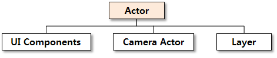
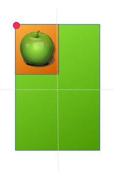
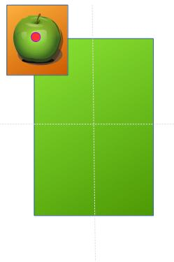
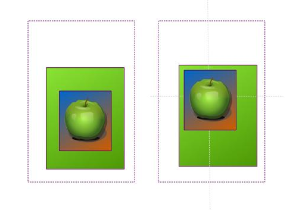

# Actors


An actor is the basic component that composes the entire scene. It can have visible (for example, UI components) or invisible (for example, a camera actor or layer) forms.

An actor is also the primary object with which DALi applications interact. All Controls and Layers are derived from Actors.

In an application, multiple types of event signals provided by actors can be handled through user-defined callback functions.

For additional actor usage examples, see [Actor Layout Examples](layout.md#example).

## Actor Types

**Figure: Actor types**



An actor has the following concrete types:

- **UI Components** are used to organize the application appearance. For more information, see [UI Components](ui-components.md).
- **Camera actor** determines which view of the whole virtual 3D world is rendered on the screen. By default, it is best suited for 2D applications, so you do not need to care about it in this case. For more information, see the `Dali::CameraActor` class (in [mobile](../../../api/mobile/latest/classDali_1_1CameraActor.html) and [wearable](../../../api/wearable/latest/classDali_1_1CameraActor.html) applications).
- **Layer** provides a mechanism for overlaying groups of actors on top of each other. For more information, see the `Dali::Layer` class (in [mobile](../../../api/mobile/latest/classDali_1_1Layer.html) and [wearable](../../../api/wearable/latest/classDali_1_1Layer.html) applications).

## Adding an Actor to the Stage

Stage is a top-level object that represents the entire screen.
It is used for displaying a hierarchy of actors managed by the [scene graph](http://en.wikipedia.org/wiki/Scene_graph) structure. This implies that an actor inherits a position relative to its parent position and can be moved to another position with respect to its current position.

The stage instance is a singleton object (the only instance of its class during the lifetime of the program). You can get a stage function using the following static function:

```
static Stage GetCurrent();
```

To display the contents of an actor, it must be added to a stage.
The following example shows how to connect a new actor to the stage:

```
Actor actor = Actor::New();
Stage::GetCurrent().Add( actor );
```

## Positioning Actors

By default an actor inherits its parent's position. The relative position between the actor and parent is determined by the following properties, **Parent origin** and **AnchorPoint**

In a 3D world, the Actor can be positioned in X,Y and Z axi. Although below only the X and Y is mentioned.

### ParentOrigin

**ParentOrigin** is reference point on the parent (which could be the stage) that the Actors position is set in relation to.
If CENTER, then the Actors position will be X and Y from the center of the parent.
While if TOP_LEFT, then the Actors position will be X and Y from the top left. Where X and Y is the displacement on each axis.

The default is top left (`Dali::ParentOrigin::TOP_LEFT`), which can be visualized in 2D as (0, 0), but is actually Vector3 (0, 0, 0.5) in the 3D DALi world.
For more information, see the `Dali::Actor::SetParentOrigin()` function.

Below the same ImageView (Apple) is parented to the large green rectangle.
The first example it has `Dali::ParentOrigin::CENTER` and the second is `Dali::ParentOrigin::TOP_LEFT`.
The red dot indicates the parent origin.
The AnchorPoint in both is `Dali::AnchorPoint::TOP_LEFT`.

| ParentOrigin::CENTER | ParentOrigin::TOP_LEFT |
|-----|-----|
|  |  |
| AnchorPoint::TOP_LEFT | AnchorPoint::TOP_LEFT |

### AnchorPoint

**AnchorPoint** is the point on the Actor that its position refers to.
Imagine its a pin or handle on the Actor that is used to position it.

The default is center (`Dali::AnchorPoint::CENTER`), which can be visualized in 2D as (0.5, 0.5), but is actually Vector3 (0.5, 0.5, 0.5) in the 3D DALi world.
For more information, see the `Dali::Actor::SetAnchorPoint()` function.

Below the same ImageView (Apple) is parented to the large green rectangle.
The first example it has `Dali::AnchorPoint::CENTER` and the second is `Dali::AnchorPoint::TOP_LEFT`.
The red dot indicates the anchor point.  The ParentOrigin in both is `Dali::ParentOrigin::TOP_LEFT`.

| AnchorPoint::CENTER | AnchorPoint::TOP_LEFT |
|-----|-----|
|  |  |
| ParentOrigin::TOP_LEFT | ParentOrigin::TOP_LEFT |

### Position

The Actor can have its Position set.
Positions are Vectors and displace from the ParentOrigin. ( ParentOrigin to AnchorPoint ).

Therefore by default, an actor's position indicates the vector to its center from the top-left corner of its parent. For example (with the default camera):
- An actor added directly to the stage with position (X = stageWidth\*0.5, Y = stageHeight\*0.5) appears in the center of the screen.
- An actor with the position (X = actorWidth\*0.5, Y = actorWidth\*0.5) appears at the top-left corner of the screen.

For more information, see the `Dali::Actor::SetPosition()` function.

### Position Inherritance

The `Actor::Property::INHERIT_POSITION` can be set to "false" which would mean the actor's position is set as a world position.
This is regardless of the ParentOrigin setting and the position of the parent.

Below the apple is parented to the green rectangle with position ( 0, 0 ), it is positioned at the center of the parent.

The second image has

```
appleImageView.SetProperty( Actor::Property::INHERIT_POSITION, false );
```

Now the apple is still parented to the green rectangle but positioned center to the stage (World Position (0,0) ).
The parent green rectangle can be repositioned without affecting the position of the child ( apple ).



## Event Handling for Actors

The `Dali::Actor` class provides following event signals:

**Table: Event signals**

| Event signal         | Description                              |
|----------------------|------------------------------------------|
| `TouchedSignal()`    | This signal is emitted when a touch input is received. |
| `HoveredSignal()`    | This signal is emitted when a hover input is received. |
| `WheelEventSignal()` | This signal is emitted when a wheel event is received. |
| `OnStageSignal()`    | This signal is emitted after the actor has been connected to the stage. |
| `OffStageSignal()`   | This signal is emitted after the actor has been disconnected from the stage. |
| `OnRelayoutSignal()` | This signal is emitted after the size has been set on the actor during relayout. |

Below example shows the `TouchedSignal()` being connected to.
The `OnTouch` callback is executed once the signal occurs ( The control is touched ).

```
void TouchedExample::Create( Application& application )
{
  // Control is one of the simplest types of Actor which is visible
  Control control = Control::New();
  control.SetSize( 100.0f, 100.0f );
  Stage::GetCurrent().Add( control );

  // Connect to a touch signal emitted by the control
  control.TouchedSignal().Connect( this, &TouchedExample::OnTouch );
}

bool TouchedExample::OnTouch( Actor actor, const TouchEvent& event )
{
  bool handled = false;
  unsigned int pointCount = event.GetPointCount();
  if( pointCount == 1 )
  {
    if( event.GetPoint( 0 ).state == TouchPoint::Down )
    {
      // Act on the first touch on screen
      handled = true;
    }
  }
  else if( pointCount > 1 )
  {
    if( event.GetPoint( pointCount-1 ).state == TouchPoint::Down )
    {
      // Act on a multi-touch on screen
      handled = true;
    }
  }

  // true if you have handled the touch, false otherwise
  return handled;
}
```

For more information, see [Event Handling](event-handling.md).

## Related Information
- Dependencies
  - Tizen 2.4 and Higher for Mobile
  - Tizen 3.0 and Higher for Wearable
