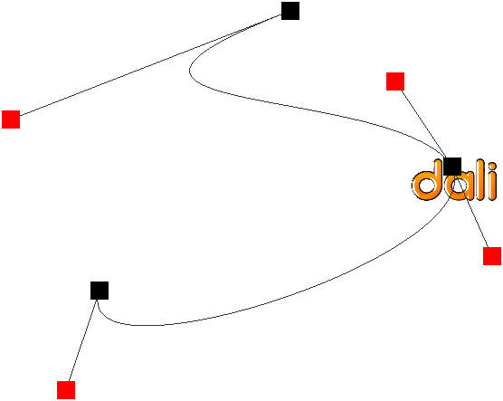

# Animation Types


DALi supports key frame and path animation.

[Key Frame Animation](#1)<br>
[Path Animation](#2)<br>

<a name="1"></a>
## Key Frame Animation

DALi provides support for animating between several different values, or key frames.
A key frame takes a progress value between 0.0f and 1.0f (0 and 100% respectively) and portrays the value of the property when the animation has progressed that much.
You can create several key frames:

```
KeyFrames keyFrames = KeyFrames::New();
keyFrames.Add( 0.0f, Vector3( 10.0f, 10.0f, 10.0f ) );
keyFrames.Add( 0.7f, Vector3( 200.0f, 200.0f, 200.0f ) );
keyFrames.Add( 1.0f, Vector3( 100.0f, 100.0f, 100.0f ) );
```

Next, you can add the key frames to your animation.

```
animation.AnimateBetween( Property( actor1, Dali::Actor::Property::POSITION ), keyFrames );
```

When you play the animation, DALi animates the position of `actor1` between the specified key frames. The `actor1` animates from (10.0f, 10.0f, 10.0f) to (200.0f, 200.f, 200.0f) by 70% of the animation time, and then spends the remaining time animating back to (100.0f, 100.0f, 100.0f).

The advantage of specifying a key frame at 0% is that regardless of where the `actor1` is, it starts from position (10.0f, 10.0f, 10.0f). If `AnimateTo()` is used, the start position is the `actor1`'s current position.

<a name="2"></a>
## Path Animation

The `Dali::Path` class can be used to animate the position and orientation of actors.

The black points in the following figure are points where the DALi logo travels to. The red points are the control points which express the curvature of the path on the black points.

**Figure: Path animation**



The following code presents the black points:

```
Path path = Path::New();
path.AddPoint( Vector3( 50.0f, 10.0f, 0.0f ) );
path.AddPoint( Vector3( 90.0f, 50.0f, 0.0f ) );
path.AddPoint( Vector3( 10.0f, 90.0f, 0.0f ) );
```

The control points can be added manually using `Path::AddControlPoint`. The `Dali::Path` class can also auto-generate the control points for you.

```
path.GenerateControlPoints( 0.25f );
```

Here 0.25f represents the curvature of the path you require. For more information, see the `GenerateControlPoints()` function in the `Dali::Path` class (in [mobile](../../../api/mobile/latest/classDali_1_1Path.html) and [wearable](../../../api/wearable/latest/classDali_1_1Path.html) applications).

To animate `actor1` along this path, use the following function:

```
animation.Animate( actor1, path, Vector3::ZERO );
```

The third parameter is the forward vector (in a local space coordinate system) that is oriented with the path's tangent direction.

## Related Information
- Dependencies
  - Tizen 2.4 and Higher for Mobile
  - Tizen 3.0 and Higher for Wearable
