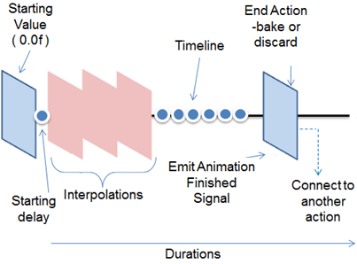

# Animation


This tutorial describes the DALi Animation framework.
In this tutorial, the following subjects are covered:

[Animation events](#1)<br>
[Setting up an Animation](#2)<br>
[Animation Notifications](#3)<br>

## Overview

You can use animation to allow your objects to move around and change their properties for a specified duration.

DALi provides a rich and easy to use animation framework which allows you to create visually rich applications. The `Dali::Animation` class can be used to animate the [animatable properties](properties.md#attributes) of any number of objects.

DALi animations [occur in a dedicated thread](multi-threaded.md#animations). This allows animations to run smoothly, regardless of the time taken to process the input, events, and other factors in the application code.

The following figure illustrates the animation components.

**Figure: DALi animation components**



For more information on Animation, see [Animation Types](animation-types.md) and [Constraints](constraints.md).

<a name="1"></a>
## Animation events

The following table lists the basic signals provided by the `Dali::Animation` class.

**Table: Dali::Animation input signals**

| Input signal         | Description                              |
|----------------------|------------------------------------------|
| `FinishedSignal()`   | Emitted when an Animation's animations have finished.  |


<a name="2"></a>
## Setting up an Animation

Below code creates an Animation with a duration of 3 seconds.

```
Animation animation = Animation::New( 3.0f );
```

Once created the following properties can be used to set up the animation.

### By, to and between

There are 3 animation functions that determine what should be animated.

| Function       | Description  |
|----------------|--------------|
| AnimateTo      | Animates a given property to the given value |
| AnimateBy      | Animates a given property by a given amount (which means that it animates to a value that is the sum of the starting position and the given value) |
| AnimateBetween | Animates a given property from a given value to a given value |

Below code animates the actor1 position to 10.0f, 50.0f, 0.0f.

```
// Animate the actor1 position TO 10.0f, 50.0f, 0.0f
animation.AnimateTo( Property( actor1, Dali::Actor::Property::POSITION ), Vector3( 10.0f, 50.0f, 0.0f ) );
```

Multiple functions can be attached to an animation. All with different targets (actors) and properties.

### Play and play range

Once the animation has been created and set up to Animate then it can be played. To play the animation, use the `Play()` function:

```
animation.Play();
```

This will play all functions attached to that animation.
The animation will play and execution of the event thread is not blocked (user interaction continues).

### Looping

The animation can be set to loop forever. To loop the animation to play multiple times:
```
animation.SetLooping( true );
```

Or set to loop a number of times.
```
animation.SetLoopCount( 5 );
```

Below will loop forever ( as SetLooping(true) )
```
animation.SetLoopCount( 0 );
```

The direction of looping can also be set with the following API:
`Animation::SetLoopingMode`

| LoopingMode  | Description       |
|--------------|-------------------|
| RESTART      | When the animation arrives at the end in looping mode, the animation restarts from the beginning. |
| AUTO_REVERSE | When the animation arrives at the end in looping mode, the animation reverses direction and runs backwards again. |

### End action

The following End Actions are available.
They determine what the animated Property value should be when the animation ends.

| EndAction | Description          |
|-----------|----------------------|
| Bake      | current value of the animation becomes the property's value, animation may have stopped before completion. |
| Discard   | change due to the animation is discarded, original property value maintained |
| BakeFinal | even if the animation does not complete the final target value becomes the property's value |

By default, when the animation ends, the properties that it was animating are baked (saved).
To discard the property changes when the animation ends or is stopped:
```
animation.SetEndAction( Animation::Discard );
```

### Stop Pause Clear

An animation can be paused and then continued with `Play()`. To pause the animation:
```
animation.Pause();
```

Or animation can be stopped. Once stopped, `Play()` will start it again. To stop the animation:
```
animation.Stop();
```

### Alpha functions

The animations change the target property in a Linear way, to configure this an Alpha function can be supplied.

Alpha functions are used in animations to specify the rate of change of the animation parameter over time.<br>
This allows the animation to be, for example, accelerated, decelerated, repeated, or bounced.<br>
The built-in supported functions can be viewed in the `Dali::AlphaFunction::BuiltinFunction` enumeration (in [mobile](../../../api/mobile/latest/classDali_1_1AlphaFunction.html#aacf7780cdb2077166a3cd20a8a9faf4b) and [wearable](../../../api/wearable/latest/classDali_1_1AlphaFunction.html#aacf7780cdb2077166a3cd20a8a9faf4b) applications).

An example of setting an Ease In alpha function for all attached functions :
```
animation.SetDefaultAlphaFunction( Dali::AlphaFunction::EASE_IN );
```

You can specify a different alpha function for each animation call within the 'Animation' object :
```
animation.AnimateTo( Property( actor1, Dali::Actor::Property::POSITION ),
                     Vector3( 10.0f, 50.0f, 0.0f ),
                     Dali::AlphaFunction::EASE_IN );
```

Custom Alpha functions can be created :
```
float MyAlphaFunction( float progress )
{
  // Do something cool with progress
  return progress;
}

AlphaFunction alphaFunction( &MyAlphaFunction );
animation.SetDefaultAlphaFunction( alphaFunction );
```

<a name="3"></a>
## Animation Notifications

Using DALi's signal framework, the application can be notified when the animation finishes. The `Dali::Animation` class is a "fire and forget" framework, which means that the animation continues to play even if the handle is discarded. ( a handle to the animation does not need to be kept. )
The `animation.Play()` can be called and the handle can go out of scope.

To track the animation the `FinishedSignal` signal can be used, it will trigger when the animation ends.
In the following example, the finished signal is emitted after 2 seconds:

```
void HelloWorldExample::Create( Application& application )
{
  // Create a button
  PushButton button = PushButton::New();
  Stage::GetCurrent().Add( button );

  // Create an animation for the button
  Animation animation = Animation::New( 2.0f ); // Duration 2 seconds
  animation.AnimateTo( Property( button, Actor::Property::POSITION ), Vector3( 100.0f, 100.0f, 0.0f ) );
  animation.FinishedSignal().Connect( this, &HelloWorldExample::OnFinished );
  animation.Play(); // Fire the animation and forget about it
} // At this point the animation handle has gone out of scope

void HelloWorldExample::OnFinished( Animation& animation )
{
  // Do something when the animation is finished
}
```


## Related Information
- Dependencies
  - Tizen 2.4 and Higher for Mobile
  - Tizen 3.0 and Higher for Wearable
