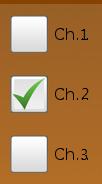
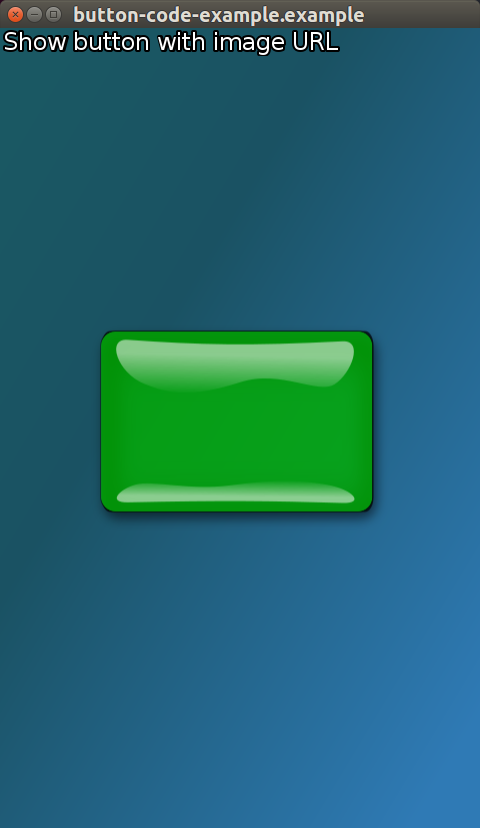
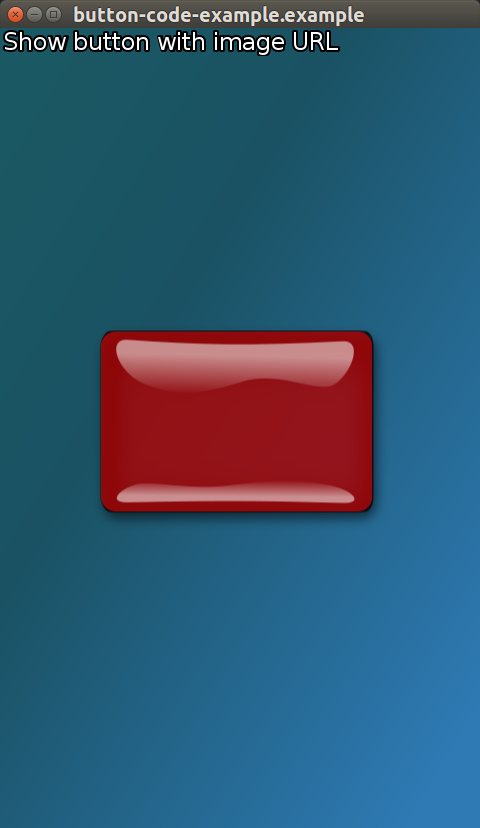
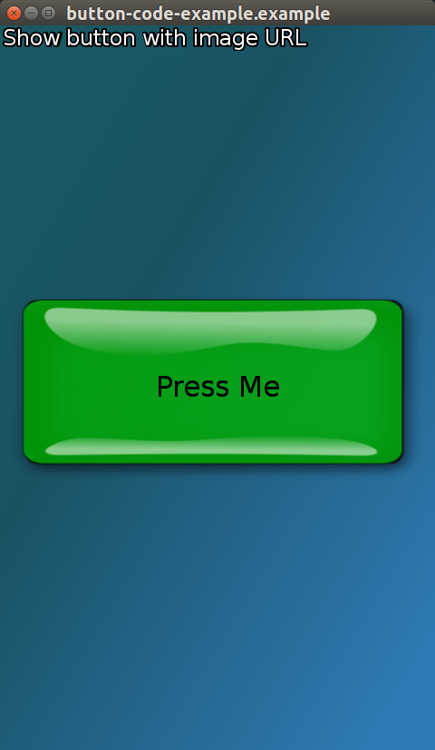
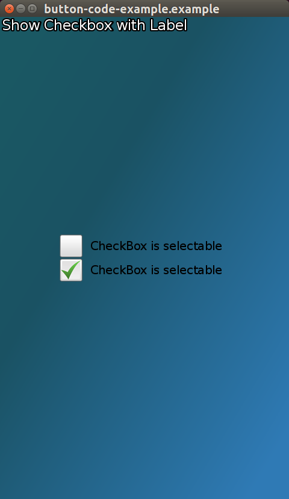
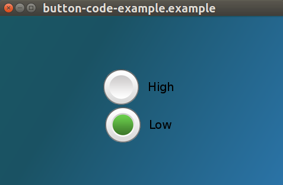

# Buttons


A button is a small object on the UI that you press in order to operate it. DALi provides button controls, such as `PushButton`, `CheckBoxButton`, and `RadioButton`.

In this tutorial, the following subjects are covered:

[Button events](#1)<br>
[PushButton](#2)<br>
[CheckBoxButton](#3)<br>
[RadioButton](#4)<br>
[Button creation with Visuals](#5)<br>

## Overview

`Dali::Toolkit::Button` is the base class for the button UI components.

Buttons can be **disabled**.
Buttons can be made **togglable**, and then **selected** or **unselected**.


<a name="1"></a>
## Button Events

 The following table lists the basic signals provided by the `Dali::Toolkit::Button` class.

**Table: Dali::Toolkit::Button input signals**

| Input signal           | Description                               |
|------------------------|-------------------------------------------|
| `PressedSignal()`      | Emitted when the button is touched.       |
| `ReleasedSignal()`     | Emitted when the button is touched, and the touch point leaves the boundary of the button.      |
| `ClickedSignal()`      | Emitted when the button is touched, and the touch point doesn't leave the boundary of the button.       |
| `StateChangedSignal()` | Emitted when the button state is changed. |

Here is an example of adding an event handler to a push button _Clicked_ event:

```
button.ClickedSignal().Connect( this, &ButtonClicked );

bool ChangeImageClicked( Button button )
{
  ...
  // button pressed
  return true;
}
```

Events are not fired when the disabled property is set to true.

The `Dali::Toolkit::Button` class provides the following properties which modify the fired events:

1. When *autorepeating* is set to true, the Pressed, Released and Clicked events are fired at regular intervals while the button is touched.

   The interval times can be modified with the _InitialAutoRepeatingDelay_ and _NextAutoRepeatingDelay_ properties.

   A togglable button can't be autorepeating. If the autorepeating property is set to true, then the togglable property is set to false but no event is fired.

2. When *togglable* is set to true, a _StateChanged_ event is fired, with the selected state.

   For a checkbox all 4 events are available, usually only the _StateChanged_ event is used to notify when the button changes its state to selected or unselected.

   For a radio button use the _StateChanged_ event to check when the radio button is selected.


<a name="2"></a>
## PushButton

The `Dali::Toolkit::PushButton` class provides a button that can be pressed to operate it. A push button changes its appearance when is pressed and returns to its original appearance when is released.

**Figure: PushButton**


A push button emits a `Button::PressedSignal()` signal when the button is pressed, a `Button::ClickedSignal()` signal when clicked, and a `Button::ReleasedSignal()` signal when released or the touch point leaves the boundary of the button.

The following code shows an example of a basic push button:

```
void HelloWorldExample::Create( Application& application )
{
  PushButton button = PushButton::New();
  button.SetParentOrigin( ParentOrigin::CENTER );
  button.SetLabelText( "Press" );
  Stage::GetCurrent().Add( button );

  // Connect to button signals emitted by the button
  button.ClickedSignal().Connect( this, &HelloWorldExample::OnButtonClicked );
  button.PressedSignal().Connect( this, &HelloWorldExample::OnButtonPressed );
  button.ReleasedSignal().Connect( this, &HelloWorldExample::OnButtonReleased );
}

bool HelloWorldExample::OnButtonClicked( Button button )
{
  // Do something when the button is clicked
  return true;
}

bool HelloWorldExample::OnButtonPressed( Button button )
{
  // Do something when the button is pressed
  return true;
}

bool HelloWorldExample::OnButtonReleased( Button button )
{
  // Do something when the button is released
  return true;
}
```

<a name="3"></a>
## CheckBoxButton

The `Dali::Toolkit::CheckBoxButton` class provides a check box button, which can be checked or unchecked.

**Figure: CheckBoxButton**



A checkbox button emits all 4 button input signals, but often you can simply use the `Button::StateChangedSignal()` signal to be notified when the button changes its state to selected or unselected.

The following code shows an example of a basic checkbox button:

```
void HelloWorldExample::Create( Application& application )
{
  CheckBoxButton button = CheckBoxButton::New();
  button.SetParentOrigin( ParentOrigin::CENTER );
  button.SetLabelText( "Check" );
  button.SetSize( 200, 40 );
  button.SetBackgroundColor( Color::WHITE );
  Stage::GetCurrent().Add( button );

  // Connect to a button signal emitted by the button
  button.StateChangedSignal().Connect( this, &HelloWorldExample::OnButtonStateChanged );
}

bool HelloWorldExample::OnButtonStateChanged( Button button )
{
  // Do something when the button state is changed
  // You can get the state using button.IsSelected() call
  return true;
}
```

<a name="4"></a>
## RadioButton

The `Dali::Toolkit::RadioButton` class provides a radio button with 2 states: selected and unselected.

**Figure: RadioButton**


Usually, radio buttons are grouped. When they have the same parent, 2 or more radio buttons are located in the same group. In each group, only 1 radio button can be selected at a given time. You can use the `Button::StateChangedSignal()` signal to check which radio button is selected.

The following code shows an example of a basic radio button:

```
void HelloWorldExample::Create( Application& application )
{
  Actor radioGroup = Actor::New();
  radioGroup.SetParentOrigin( ParentOrigin::CENTER );
  Stage::GetCurrent().Add( radioGroup );

  RadioButton button1 = RadioButton::New();
  button1.SetLabelText( "button1" );
  button1.SetBackgroundColor( Color::WHITE );
  button1.SetPosition( 0, -40 );
  radioGroup.Add( button1 );

  RadioButton button2 = RadioButton::New();
  button2.SetLabelText( "button2" );
  button2.SetBackgroundColor( Color::WHITE );
  button2.SetPosition( 0, 40 );
  radioGroup.Add( button2 );

  // Connect a single callback to button signals emitted by both button1 and button2
  button1.StateChangedSignal().Connect( this, &HelloWorldExample::OnButtonStateChanged );
  button2.StateChangedSignal().Connect( this, &HelloWorldExample::OnButtonStateChanged );
}

bool HelloWorldExample::OnButtonStateChanged( Toolkit::Button button )
{
  // Do something when the 2 buttons' states are changed
  // button parameter can be both button1 and button2
  // You can use button.GetLabelText() and button.IsSelected()
  // to know which button is selected
  return true;
}
```

<a name="5"></a>
## Button creation with Visuals

### Using Visuals

Buttons can contain various Visuals, not just ImageVisual.

Below is an example using [ImageVisual](#ButtonWithImageVisual), [TextVisual](#ButtonWithTextVisual) and [ColorVisual](#ButtonWithColorVisual)

<a name="ButtonWithImageVisual"></a>
#### Setting ImageVisual to a Button using a Property Map

Right button (Red) is when the button is selected.




Selected and unselected images are provided to the button as two property maps containing the required URL.

```
...
PushButton button = PushButton::New();

button.SetProperty( Button::Property::SELECTED_STATE_IMAGE,
                    Property::Map().Add( Visual::Property::TYPE,  Visual::IMAGE )
                    .Add( ImageVisual::Property::URL, DEMO_IMAGE_DIR "red-button.png" )
                    );

button.SetProperty( Button::Property::UNSELECTED_STATE_IMAGE,
                    Property::Map().Add( Visual::Property::TYPE,  Visual::IMAGE )
                    .Add( ImageVisual::Property::URL, DEMO_IMAGE_DIR "green-button.png" )
                    );

button.SetParentOrigin( ParentOrigin::CENTER );
mView.Add( button );  // Adding button to stage via mView which is a staged control.
```

<a name="ButtonWithTextVisual"></a>
### Setting Text to a PushButton using a Property Map (Full Control)



```
Toolkit::PushButton button = Toolkit::PushButton::New();
Property::Map textSettingsMap;
              textSettingsMap.Add( Visual::Property::TYPE, Toolkit::Visual::TEXT )
                             .Add( TextVisual::Property::TEXT, "Press Me" )
                             .Add( TextVisual::Property::MULTI_LINE, true )
                             .Add( TextVisual::Property::POINT_SIZE, 12.0f );

button.SetProperty( Toolkit::Button::Property::LABEL, textSettingsMap );
```

<a name="ButtonWithColorVisual"></a>
### Setting a ColorVisual to a PushButton using a Property Map

```
Toolkit::PushButton button = Toolkit::PushButton::New();
Property::Map visualSettingMap;
              visualSettingMap.Add( Visual::Property::TYPE, Toolkit::Visual::COLOR )
                              .Add( ColorVisual::Property::MIX_COLOR, Vector4( R, G, B, 1.0f ) );

button.SetProperty( DevelButton::Property::UNSELECTED_BACKGROUND_VISUAL, visualSettingMap );

OR

button.SetProperty( Toolkit::Button::Property::UNSELECTED_STATE_IMAGE, visualSettingMap );

```
<a name="ButtonWithMixedVisuals"></a>
### Setting a ColorVisual for the background and a TextVisual for the Label.

Using the above ColorVisual and TextVisual to have a color background with text in the foreground.

```
Toolkit::PushButton button = Toolkit::PushButton::New();
Property::Map visualSettingMap;
              visualSettingMap.Add( Visual::Property::TYPE, Toolkit::Visual::COLOR )
                              .Add( ColorVisual::Property::MIX_COLOR, Vector4( R, G, B, 1.0f ) );

button.SetProperty( Toolkit::Button::Property::UNSELECTED_STATE_IMAGE, visualSettingMap );

Property::Map textSettingsMap;
              textSettingsMap.Add( Visual::Property::TYPE, Toolkit::Visual::TEXT )
                             .Add( TextVisual::Property::TEXT, "Press Me" )
                             .Add( TextVisual::Property::MULTI_LINE, true )
                             .Add( TextVisual::Property::POINT_SIZE, 12.0f );

button.SetProperty( Toolkit::Button::Property::LABEL, textSettingsMap );
```

### Setting Text to a Button using a string (Basic)

```
Toolkit::PushButton button = Toolkit::PushButton::New();
button.SetProperty( Toolkit::Button::Property::LABEL, "Select" );
```

### Check box button set up
Two checkboxes with default selected and unselected images.



```
Toolkit::CheckBoxButton checkboxButton1 = Toolkit::CheckBoxButton::New();
checkboxButton1.SetProperty( Toolkit::Button::Property::LABEL, "CheckBox is selectable" );
checkboxButton1.StateChangedSignal().Connect( this, &ButtonCode::CheckBoxSelected );
checkboxButton1.SetParentOrigin( ParentOrigin::CENTER );
checkboxButton1.SetAnchorPoint( AnchorPoint::BOTTOM_CENTER );
checkboxButton1.SetName("one");

Toolkit::CheckBoxButton checkboxButton2 = Toolkit::CheckBoxButton::New();
checkboxButton2.SetProperty( Toolkit::Button::Property::LABEL, "CheckBox is selectable" );
checkboxButton2.StateChangedSignal().Connect( this, &ButtonCode::CheckBoxSelected );
checkboxButton2.SetParentOrigin( ParentOrigin::CENTER );
checkboxButton2.SetAnchorPoint( AnchorPoint::TOP_CENTER );
checkboxButton2.SetName("two");

mView.Add( checkboxButton1 );
mView.Add( checkboxButton2 );
```

### Radio buttons set up in a Group

Radio buttons parented to the same control only allow one to be selected at any time.



```
Control mView = Control::New();

Toolkit::RadioButton radioButton1 = Toolkit::RadioButton::New();
radioButton1.SetProperty( Toolkit::Button::Property::LABEL, "High" );
radioButton1.SetParentOrigin( ParentOrigin::CENTER );
radioButton1.SetAnchorPoint( AnchorPoint::BOTTOM_CENTER );
radioButton1.SetName("one");

Toolkit::RadioButton radioButton2 = Toolkit::RadioButton::New();
radioButton2.SetProperty( Toolkit::Button::Property::LABEL, "Low" );
radioButton2.SetParentOrigin( ParentOrigin::CENTER );
radioButton2.SetAnchorPoint( AnchorPoint::TOP_CENTER );
radioButton2.SetName("two");

mView.Add( radioButton1 );
mView.Add( radioButton2 );
```

## Related Information
- Dependencies
  - Tizen 2.4 and Higher for Mobile
  - Tizen 3.0 and Higher for Wearable
