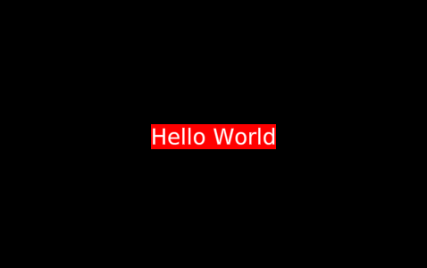

# Control


The `Dali::Toolkit::Control` class is the base class for all UI components in DALi. With this class, you can, for example, manage the background color and images for UI components.

In this tutorial, the following subjects are covered:

[Control events](#1)<br>
[Setting the Background Color](#2)<br>
[Setting the Background Image](#3)<br>
[Control Properties](#4)<br>

<a name="1"></a>
## Control events

The following table lists the basic signal provided by the `Dali::Toolkit::Control` class.

**Table: Dali::Toolkit::Control input signals**

| Input signal        | Description                                 |
|---------------------|---------------------------------------------|
| `KeyEventSignal()`  | Emitted when key event is received.         |
| `KeyInputFocusGainedSignal()` | Emitted when the control gets Key Input Focus.  |
| `KeyInputFocusLostSignal()`  | Emitted when the control loses Key Input Focus.  |
| `ResourceReadySignal()`  | Emitted after all resources required by a control are loaded and ready.  |

<a name="2"></a>
## Setting the Background Color

You can set a background color for a UI component. To set a red background for a component:

```
Control control = Control::New();
control.SetSize( 200.0f, 200.0f );
control.SetBackgroundColor( Color::RED );
```

**Figure: Control object with a red background**


You can handle all existing controls similarly. For example, to set the background color for a TextLabel:

```
TextLabel label = TextLabel::New( "Hello World" );
label.SetBackgroundColor( Dali::Color::RED );
```

**Figure: TextLabel object with a red background**



<a name="3"></a>
## Setting the Background Image

You can set a background image of a control:

```
Control control = Control::New();
Image image = Image::New( "image.png" );
control.SetProperty( Control::Property::BACKGROUND, image );
```

**Figure: Control object with a background image**


<a name="4"></a>
## Control Properties

The following table lists the available `Control` properties.

**Table: Control properties**

| Property          | Type    | Description                              |
|-------------------|---------|------------------------------------------|
| `STYLE_NAME`      | STRING  | The name of the style to be applied to the control |
| `KEY_INPUT_FOCUS` | BOOLEAN | Receives key events to the control       |
| `BACKGROUND`      | MAP     | The background of the control            |


## Related Information
- Dependencies
  - Tizen 2.4 and Higher for Mobile
  - Tizen 3.0 and Higher for Wearable
