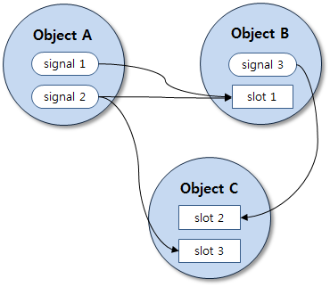

# Event Handling


The DALi event handling system is composed of 2 major concepts:

- **Signal**

  Notifications that contain event information emitted by GUI components.

- **Slot**

  Special functions that receive signals. Also known as event handlers, observers, listeners, or callbacks.

DALi emits various types of signals to an application to inform it of user actions and the application can handle them through slots.

The concept of signal and slots were introduced by Qt for communication between objects, and it inspires DALi.

Objects in DALi can provide 'signals' to inform an application of user actions or events, such as Touch data, Key events and Input signals. The application can connect to these signals if it requires notification of these events.

**Figure: Schematic example of signal-slot connections**



In the figure, signal 1 is connected to slot 1, signal 2 is connected to slot 1 and slot 3, and signal 3 is connected to slot 2.

The signal and slot system has following advantages:

- Object-oriented: supports callbacks for C++ member functions
- Type safe: the compiler is able to check for type safety
- Non-coupling: no dependency between caller and callee
- Non-type-intrusive: no modification to caller or callee types
- Generic: works for all types of call-backs
- Many-to-many relationship: 1 slot can connect to many signals and 1 signal can be connected to many slots, for example

## Touch Events

The `Dali::Actor` class (in [mobile](../../../api/mobile/latest/classDali_1_1Actor.html) and [wearable](../../../api/wearable/latest/classDali_1_1Actor.html) applications) provides the `TouchSignal()` function to inform the application that a user touches the actor. It is defined as follows:

```
typedef Signal<bool ( Actor, const TouchData& )> TouchDataSignalType;
TouchDataSignalType& TouchSignal();
```

This means that a slot of the following type can be connected to the return value of the `Actor::TouchSignal()` function:

```
bool YourCallbackName( Actor actor, const TouchData& data );
```

The return value `true` indicates that the touch event must be consumed. Otherwise, the signal is emitted on the next sensitive parent of the actor. Note that a callback function signature varies depending on its corresponding signal type. Some signal types do not have a return value in their callback functions.

Each point on the screen being or having been touched is represented by the `Dali::TouchPoint` object. This object stores information about the state of the touch point (such as down, up, or motion.) and the coordinates of the touch.

A collection of touch points at a specific moment in time is collated into the `Dali::TouchData` object (in [mobile](../../../api/mobile/latest/classDali_1_1TouchData.html) and [wearable](../../../api/wearable/latest/classDali_1_1TouchData.html) applications). When a multi-touch event occurs, each touch point represents the points that are currently being touched or the points where touch has stopped.

The following example shows how a connection to a touch event signal can be established:

```
// This sample code is for the HelloWorldExample class
// in Creating a DALi Application
void HelloWorldExample::Create( Application& application )
{
  // Control is one of the simplest types of Actor which is visible
  Control control = Control::New();
  control.SetParentOrigin( ParentOrigin::CENTER );
  control.SetSize( 100.0f, 100.0f );
  control.SetBackgroundColor( Color::WHITE );
  Stage::GetCurrent().Add( control );

  // Connect to a touch signal emitted by the control
  control.TouchSignal().Connect( this, &HelloWorldExample::OnTouch );
}

bool HelloWorldExample::OnTouch( Actor actor, TouchData& touch )
{
  const std::size_t pointCount = touch.GetPointCount();
  if( pointCount == 1 )
  {
    // Single touch event

    // Get touch state of the primary point
    PointState::Type pointState = touch.GetState( 0 );
    if( pointState == PointState::DOWN )
    {
      // User has just pressed on the device
    }
    else if( pointState == PointState::UP )
    {
      // User has just released their finger from the device
    }
  }
  else
  {
    // Multi-touch event
  }

  return true; // Touch handled
}
```

The touch event is first emitted to the hit actor by the primary touch point, which is the first point that the user touches. If this hit actor does not handle the event, then the event is offered to the hit actor's parent. Again, if the parent does not handle this event, it is then offered to its parent and so on until the stage is reached or the event is consumed.

If a parent and child actor both connect to the touch signal, the touch event is first offered to the child. If it is consumed by the child, the parent is not informed.

For more information on handling touch event data, see [Touch Data](touchdata.md).

## Key Events

The following example shows how to handle key events on the stage:

```
// This sample code is for the HelloWorldExample class
// in Creating a DALi Application
void HelloWorldExample::Create( Application& application )
{
  // Simple control to render the screen
  PushButton button = PushButton::New();
  Stage::GetCurrent().Add( button );
  // Connect to a key event signal emitted by the stage
  Stage::GetCurrent().KeyEventSignal().Connect( this, &HelloWorldExample::OnKeyEvent );
}

void HelloWorldExample::OnKeyEvent( const KeyEvent& event )
{
  if( event.state == KeyEvent::Down )
  {
    if( IsKey( event, DALI_KEY_ESCAPE ) || IsKey( event, DALI_KEY_BACK ) )
    {
      // Quit the application when escape or back key is pressed
      mApplication.Quit();
    }
  }
}
```

The stage is the topmost root object, so it can receive application-wide key events.

DALi provides its own key codes for several special keys, such as `DALI_KEY_ESCAPE` or `DALI_KEY_BACK`. The following table lists the available DALi key codes.

**Table: DALi key codes**

| Key codes                  | Description              |
|----------------------------|--------------------------|
| `DALI_KEY_INVALID`         | Invalid key value        |
| `DALI_KEY_ESCAPE`          | Escape key               |
| `DALI_KEY_BACKSPACE`       | Backspace key            |
| `DALI_KEY_SHIFT_LEFT`      | Left Shift key           |
| `DALI_KEY_SHIFT_RIGHT`     | Right Shift key          |
| `DALI_KEY_CURSOR_UP`       | Cursor up key            |
| `DALI_KEY_CURSOR_LEFT`     | Cursor left key          |
| `DALI_KEY_CURSOR_RIGHT`    | Cursor right key         |
| `DALI_KEY_CURSOR_DOWN`     | Cursor down key          |
| `DALI_KEY_BACK`            | Back key                 |
| `DALI_KEY_CAMERA`          | Camera key               |
| `DALI_KEY_CONFIG`          | Config key               |
| `DALI_KEY_POWER`           | Power key                |
| `DALI_KEY_PAUSE`           | Pause key                |
| `DALI_KEY_CANCEL`          | Cancel key               |
| `DALI_KEY_PLAY_CD`         | Play CD key              |
| `DALI_KEY_STOP_CD`         | Stop CD key              |
| `DALI_KEY_PAUSE_CD`        | Pause CD key             |
| `DALI_KEY_NEXT_SONG`       | Next song key            |
| `DALI_KEY_PREVIOUS_SONG`   | Previous song key        |
| `DALI_KEY_REWIND`          | Rewind key               |
| `DALI_KEY_FASTFORWARD`     | Fastforward key          |
| `DALI_KEY_MEDIA`           | Media key                |
| `DALI_KEY_PLAY_PAUSE`      | Play pause key           |
| `DALI_KEY_MUTE`            | Mute key                 |
| `DALI_KEY_MENU`            | Menu Key                 |
| `DALI_KEY_HOME`            | Home key                 |
| `DALI_KEY_HOMEPAGE`        | Homepage key             |
| `DALI_KEY_WEBPAGE`         | Webpage key              |
| `DALI_KEY_MAIL`            | Mail key                 |
| `DALI_KEY_SCREENSAVER`     | Screensaver key          |
| `DALI_KEY_BRIGHTNESS_UP`   | Brightness up key        |
| `DALI_KEY_BRIGHTNESS_DOWN` | Brightness down key      |
| `DALI_KEY_SOFT_KBD`        | Soft KBD key             |
| `DALI_KEY_QUICK_PANEL`     | Quick panel key          |
| `DALI_KEY_TASK_SWITCH`     | Task switch key          |
| `DALI_KEY_APPS`            | Apps key                 |
| `DALI_KEY_SEARCH`          | Search key               |
| `DALI_KEY_VOICE`           | Voice key                |
| `DALI_KEY_LANGUAGE`        | Language key             |
| `DALI_KEY_VOLUME_UP`       | Volume up key            |
| `DALI_KEY_VOLUME_DOWN`     | Volume down key          |

## Input Signals

Many DALi classes provide various signals to notify events to the application. Among them, the most basic type of signals are input signals. This section briefly introduces these input signals in DALi.

The basic DALi input signals are as follows:

- **Touch signal** notifies you of a screen touch or mouse click
- **Hovered signal** notifies you of mouse hovering
- **Wheel event signal** notifies you of wheel rolling (for example, mouse wheel)
- **Key event signal** notifies you of a keyboard input
- **Key input focus signals** notify you that a control is ready to receive key event signals
- **Keyboard focus signals** notify you of a moved focus by navigation keys (such as left or right)

These signals are provided by the following classes:

- `Dali::Actor`

  **Table: Dali::Actor input signals**

  | Input signals        | Description                              |
  | -------------------- | ---------------------------------------- |
  | `TouchSignal()`      | Emitted when touch input is received.<br>Callback: `bool YourCallbackName( Actor actor, const TouchData& touch );` |
  | `HoveredSignal()`    | Emitted when hover input is received.<br>Callback: `bool YourCallbackName( Actor actor, const HoverEvent& event );` |
  | `WheelEventSignal()` | Emitted when wheel event is received.<br>Callback: `bool YourCallbackName( Actor actor, const WheelEvent& event );` |

  The actor receiving events is passed to the callbacks.

- `Dali::Stage` (in [mobile](../../../api/mobile/latest/classDali_1_1Stage.html) and [wearable](../../../api/wearable/latest/classDali_1_1Stage.html) applications)

  **Table: Dali::Stage input signals**

  | Input signals      | Description                              |
  | ------------------ | ---------------------------------------- |
  | `TouchSignal()`    | Emitted when touch input is received.<br>Callback: `void YourCallbackName( const TouchData& data )` |
  | `HoveredSignal()`  | Emitted when hover input is received.<br>Callback: `void YourCallbackName( const TouchEvent& event );` |
  | `KeyEventSignal()` | Emitted when a key event is received.<br>Callback: `void YourCallbackName( const KeyEvent& event );` |

  Only events are passed to the callbacks since only a single stage instance can exist in DALi application. The callback return types are `void` because the stage has no parent to pass events to, even though it does not consume the events.

- `Dali::Toolkit::Control` (in [mobile](../../../api/mobile/latest/classDali_1_1Toolkit_1_1Control.html) and [wearable](../../../api/wearable/latest/classDali_1_1Toolkit_1_1Control.html) applications)

  **Table: Dali::Toolkit::Control input signals**

  | Input signals                            | Description                              |
  | ---------------------------------------- | ---------------------------------------- |
  | `KeyEventSignal()`                       | Emitted when a key event is received.<br>Callback: `bool YourCallbackName( Control control, const KeyEvent& event );` |
  | `KeyInputFocusGainedSignal()`            | Emitted when the control gets key input focus.<br>Callback: `bool YourCallbackName( Control control );` |
  | `KeyInputFocusLostSignal()`              | Emitted when the control loses key input focus, which can be due to it being gained by another control or actor or simply cleared from this control as no longer required.<br>Callback: `bool YourCallbackName( Control control );` |
  | `TouchSignal(), HoveredSignal(), KeyEventSignal()` | Same as the ones supported by `Actor`.   |

  The key event signal is provided by the `Dali::Stage` and `Dali::Toolkit::Control` classes, not by the `Dali::Actor` class. The `Dali::Actor` class is not designed to get key events. To receive key events, an actor must be an instance of the `Dali::Toolkit::Control` class or one of its subclasses.

  The `Dali::Toolkit::Control` class can also receive touch, hover, and wheel events as it inherits from the `Dali::Actor` class.

- `Dali::Toolkit::KeyboardFocusManager` (in [mobile](../../../api/mobile/latest/classDali_1_1Toolkit_1_1KeyboardFocusManager.html) and [wearable](../../../api/wearable/latest/classDali_1_1Toolkit_1_1KeyboardFocusManager.html) applications)

  **Table: Dali::Toolkit::KeyboardFocusManager input signals**

  | Input signals                  | Description                              |
  | ------------------------------ | ---------------------------------------- |
  | `PreFocusChangeSignal()`       | Emitted before the focus is going to be changed.<br>Callback: `Actor YourCallbackName( Actor currentFocusedActor, Actor proposedActorToFocus, Control::KeyboardFocus::Direction direction );` |
  | `FocusChangedSignal()`         | Emitted after the current focused actor has been changed.<br>Callback: `void YourCallbackName( Actor originalFocusedActor, Actor currentFocusedActor );` |
  | `FocusGroupChangedSignal()`    | Emitted when the focus group has been changed.<br>Callback: `void YourCallbackName( Actor currentFocusedActor, bool forward );` |
  | `FocusedActorEnterKeySignal()` | Emitted when the current focused actor has the enter key pressed on it.<br>Callback: `void YourCallbackName( Actor enterPressedActor );` |

  `Dali::Toolkit::KeyboardFocusManager` provides the functionality of handling keyboard navigation and maintaining the 2-dimensional keyboard focus chain. Dissimilar to the key input focus, the keyboard focus is about the focus moving between actors, and that is why this signal is provided by the specific focus managing class.

The following DALi classes provide signals:

- `Dali::Window`
- `Dali::Application`
- `Dali::Timer`
- `Dali::Actor`
- `Dali::Image`
- `Dali::ResourceImage`
- `Dali::LongPressGestureDetector`
- `Dali::TapGestureDetector`
- `Dali::PanGestureDetector`
- `Dali::PinchGestureDetector`
- `Dali::RenderTask`
- `Dali::Stage`
- `Dali::ObjectRegistry`
- `Dali::PropertyNotification`
- `Dali::Animation`
- `Dali::Toolkit::Button`
- `Dali::Toolkit::Control`
- `Dali::Toolkit::TextField`
- `Dali::Toolkit::View`
- `Dali::Toolkit::GaussianBlurViewSignal`
- `Dali::ScrollBar`
- `Dali::Toolkit::Scrollable`
- `Dali::Toolkit::ScrollView`
- `Dali::Toolkit::AccessibilityFocusManager`
- `Dali::Toolkit::KeyboardFocusManager`

For the signals of each class and their usage, see the DALi API Reference (in [mobile](../../../api/mobile/latest/group__dali.html) and [wearable](../../../api/wearable/latest/group__dali.html) applications).

## Gestures

Gesture is a user-friendly high-level event produced from a stream of touch events. The `Dali::GestureDetector` class (in [mobile](../../../api/mobile/latest/classDali_1_1GestureDetector.html) and [wearable](../../../api/wearable/latest/classDali_1_1GestureDetector.html) applications) analyzes a stream of touch events and attempts to determine the intention of the user.

If an actor is attached to a gesture detector and the detector recognizes a user intention (detects a predefined pattern in a stream of touch events), the actor emits a detected gesture signal to the application.

> **Note**  
> Instances of gesture detectors must not be local variables, because gestures cannot be detected after they are destroyed.

DALi currently supports following gesture detectors:

- `Dali::LongPressGestureDetector` (in [mobile](../../../api/mobile/latest/classDali_1_1LongPressGestureDetector.html) and [wearable](../../../api/wearable/latest/classDali_1_1LongPressGestureDetector.html) applications) detects when the user does a long-press action.
- `Dali::TapGestureDetector` (in [mobile](../../../api/mobile/latest/classDali_1_1TapGestureDetector.html) and [wearable](../../../api/wearable/latest/classDali_1_1TapGestureDetector.html) applications) detects when the user does a tap action.
- `Dali::PinchGestureDetector` (in [mobile](../../../api/mobile/latest/classDali_1_1PinchGestureDetector.html) and [wearable](../../../api/wearable/latest/classDali_1_1PinchGestureDetector.html) applications) detects when the user moves 2 fingers towards or away from each other.
- `Dali::PanGestureDetector` (in [mobile](../../../api/mobile/latest/classDali_1_1PanGestureDetector.html) and [wearable](../../../api/wearable/latest/classDali_1_1PanGestureDetector.html) applications) detects when the user moves 1 or more fingers in the same direction.

The following example shows how an application can be notified of a pan gesture:

```
// This sample code is for the HelloWorldExample class
// in Creating a DALi Application
class HelloWorldExample : public ConnectionTracker
{
  // Gesture detector must be a member variable to exist outside the local scope
  PanGestureDetector mDetector;
};

void HelloWorldExample::Create( Application& application )
{
  PushButton button = PushButton::New();
  button.SetParentOrigin( ParentOrigin::CENTER );
  button.SetSize( 100.0f, 100.0f );
  Stage::GetCurrent().Add( button );

  // Create a PanGestureDetector
  mDetector = PanGestureDetector::New();
  mDetector.Attach( button );
  // Attach the button to the detector
  mDetector.DetectedSignal().Connect( this, &HelloWorldExample::OnPan );
}

void HelloWorldExample::OnPan( Actor actor, const PanGesture& gesture )
{
  // Move the button using detected gesture
  actor.TranslateBy( Vector3( gesture.displacement ) );
}
```

## Automatic Connection Management

If you have a pair made up of a connected signal (for example, a button clicked signal) and a slot (for example, a toolbar object having the callback for the signal), and one of them (the button or the toolbar) is deleted without any notification, the application crashes when the signal is emitted or the slot tries to disconnect the signal.

DALi provides the automatic connection management mechanism to prevent this kind of situation. The key is the `Dali::ConnectionTracker` class (in [mobile](../../../api/mobile/latest/classDali_1_1ConnectionTracker.html) and [wearable](../../../api/wearable/latest/classDali_1_1ConnectionTracker.html) applications). It tracks connections between signals and slots, and performs an automatic disconnection when either the signal or slot is deleted.

Due to this mechanism, all the DALi sample codes start with a controller class derived from the `Dali::ConnectionTracker` class. This is a safe and typical way of making a DALi application. You can, of course, create other structures using the `Dali::ConnectionTracker` class.

## Related Information
- Dependencies
  - Tizen 2.4 and Higher for Mobile
  - Tizen 3.0 and Higher for Wearable
