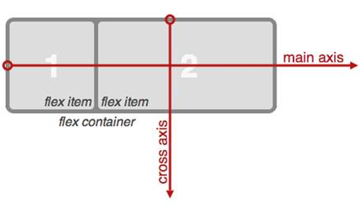
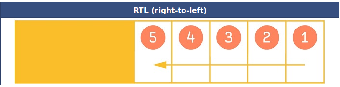
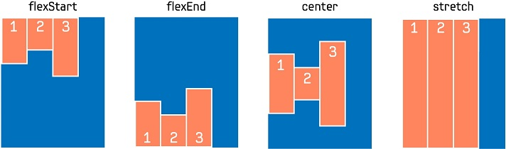
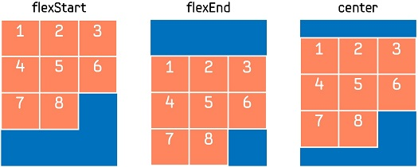
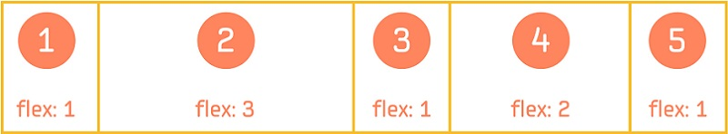
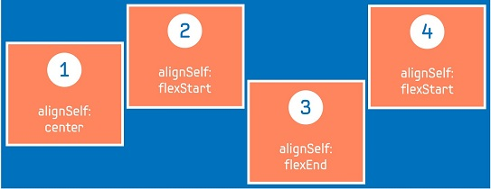
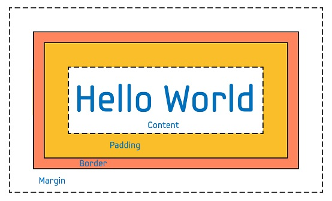

# FlexContainer


The `Dali::Toolkit::FlexContainer` class provides a control that implements a subset of the [CSS Flexible Box Layout Module Level 1 specification (defined by W3C)](https://www.w3.org/TR/css-flexbox-1/).

The flexible box (flexbox) is a CSS3 Web layout model, which allows responsive elements within a container, automatically arranged to different size screens or devices. The following figure illustrates the various directions and terms applied to a flex container with the "flex direction" defined as "row".

**Figure: Flex container terms**



In this tutorial, the following subjects are covered:

[Creating a Flexbox Layout with FlexContainer](#1)<br>
[FlexContainer Properties](#2)<br>
[FlexItem Properties](#3)<br>

<a name="1"></a>
## Creating a Flexbox Layout with FlexContainer

The following basic example shows how to create a gallery-like flexbox layout using the `Dali::Toolkit::FlexContainer` object.

**Figure: Flex container example**


1. Create a flex container as the whole view and set its resize policy to fill its parent (the stage):

   ```
   // Create the main flex container
   FlexContainer flexContainer = FlexContainer::New();
   flexContainer.SetParentOrigin( ParentOrigin::TOP_LEFT );
   flexContainer.SetAnchorPoint( AnchorPoint::TOP_LEFT );
   flexContainer.SetResizePolicy( ResizePolicy::FILL_TO_PARENT, Dimension::ALL_DIMENSIONS );
   // Set the background color to be white
   flexContainer.SetBackgroundColor( Color::WHITE );
   // Add the container to the stage
   Stage::GetCurrent().Add( flexContainer );
   ```

2. Set the flex direction of the main container to "column" to make the toolbar and the actual content display vertically:

   ```
   // Display toolbar and content vertically
   flexContainer.SetProperty( FlexContainer::Property::FLEX_DIRECTION, FlexContainer::COLUMN );
   ```

3. Create a new flex container as the toolbar and add it to the main container. Because the flex direction in the main container is column, the toolbar is arranged at the top of the main container.

   ```
   // Create the toolbar
   FlexContainer toolBar = FlexContainer::New();
   toolBar.SetParentOrigin( ParentOrigin::TOP_LEFT );
   toolBar.SetAnchorPoint( AnchorPoint::TOP_LEFT );
   // Set the background color for the toolbar
   toolBar.SetBackgroundColor( Color::CYAN );
   // Add it to the main container
   flexContainer.Add( toolBar );
   flexContainer.SetProperty( FlexContainer::Property::FLEX_DIRECTION, FlexContainer::COLUMN );
   ```

4. To make the buttons and title display horizontally and be vertically aligned to the center of the toolbar, set the toolbar flex direction to "row" and set its `ALIGN_ITEMS` property to center. Set the `FLEX` property to make the toolbar and the actual content share the height of the main container, so that the toolbar occupies 10 percent of the whole vertical space and the content occupies the rest of the vertical space.

    ```
    // Display toolbar items horizontally
    toolBar.SetProperty( FlexContainer::Property::FLEX_DIRECTION, FlexContainer::ROW );
    // Align toolbar items vertically center
    toolBar.SetProperty( FlexContainer::Property::ALIGN_ITEMS, FlexContainer::ALIGN_CENTER );
    // 10 percent of available space in the cross axis
    toolBar.SetProperty( FlexContainer::ChildProperty::FLEX, 0.1f );
    ```

5. Create a third flex container as the content area to display the image. It is displayed at the bottom of the main container.

   Make the item inside the content area container horizontally and vertically centered, so that the image is always at the center of the content area.

   ```
   // Create the content area
   FlexContainer content = FlexContainer::New();
   content.SetParentOrigin( ParentOrigin::TOP_LEFT );
   content.SetAnchorPoint( AnchorPoint::TOP_LEFT );
   // Display items horizontally
   content.SetProperty( FlexContainer::Property::FLEX_DIRECTION, FlexContainer::ROW );
   // Align items horizontally center
   content.SetProperty( FlexContainer::Property::JUSTIFY_CONTENT, FlexContainer::JUSTIFY_CENTER );
   // Align items vertically center
   content.SetProperty( FlexContainer::Property::ALIGN_ITEMS, FlexContainer::ALIGN_CENTER );
   // 90 percent of available space in the cross axis
   content.SetProperty( FlexContainer::ChildProperty::FLEX, 0.9f );
   // Add it to the main container
   flexContainer.Add( content );
   ```

6. Add items to the toolbar.

   The toolbar has 1 button on the left, 1 button on the right, and a title always in the center (regardless of the screen size). To achieve that, make the title flexible so that it automatically takes all the available horizontal space left. To make the layout look nicer, also add some space around the items.

   ```
   // Add a button to the left of the toolbar
   PushButton prevButton = PushButton::New();
   prevButton.SetParentOrigin( ParentOrigin::TOP_LEFT );
   prevButton.SetAnchorPoint( AnchorPoint::TOP_LEFT );
   // Minimum size the button must keep
   prevButton.SetMinimumSize( Vector2( 100.0f, 60.0f ) );
   // Set 10 pixel margin around the button
   prevButton.SetProperty( FlexContainer::ChildProperty::FLEX_MARGIN, Vector4( 10.0f, 10.0f, 10.0f, 10.0f ) );
   toolBar.Add( prevButton );
   // Set the button text
   Property::Map labelMap;
   labelMap["text"] = "Prev";
   labelMap["textColor"] = Color::BLACK;
   prevButton.SetProperty( Button::Property::LABEL, labelMap );
   // Add a title to the center of the toolbar
   TextLabel title = TextLabel::New( "Gallery" );
   title.SetParentOrigin( ParentOrigin::TOP_LEFT );
   title.SetAnchorPoint( AnchorPoint::TOP_LEFT );
   title.SetResizePolicy( ResizePolicy::USE_NATURAL_SIZE, Dimension::ALL_DIMENSIONS );
   title.SetProperty( TextLabel::Property::HORIZONTAL_ALIGNMENT, "CENTER" );
   title.SetProperty( TextLabel::Property::VERTICAL_ALIGNMENT, "CENTER" );
   // Take all the available space left apart from the 2 buttons
   title.SetProperty( FlexContainer::ChildProperty::FLEX, 1.0f );
   // Set 10 pixel margin around the title
   title.SetProperty( FlexContainer::ChildProperty::FLEX_MARGIN, Vector4( 10.0f, 10.0f, 10.0f, 10.0f ) );
   toolBar.Add( title );
   // Add a button to the right of the toolbar
   PushButton nextButton = PushButton::New();
   nextButton.SetParentOrigin( ParentOrigin::TOP_LEFT );
   nextButton.SetAnchorPoint( AnchorPoint::TOP_LEFT );
   // Minimum size the button must keep
   nextButton.SetMinimumSize( Vector2( 100.0f, 60.0f ) );
   // Set 10 pixel margin around the button
   nextButton.SetProperty( FlexContainer::ChildProperty::FLEX_MARGIN, Vector4( 10.0f, 10.0f, 10.0f, 10.0f ) );
   toolBar.Add( nextButton );
   // Set the button text
   labelMap["text"] = "Next";
   nextButton.SetProperty( Button::Property::LABEL, labelMap );
   ```

   The above settings are very convenient when running the application on different size devices or when changing the screen orientation, because the toolbar expands or shrinks based on the available space and the title is always at the center, keeping the layout of the toolbar the same.

7. Add the image to the content area:

   ```
   // Add an image to the center of the content area
   ImageView imageView = ImageView::New( "image.jpg" );
   imageView.SetParentOrigin( ParentOrigin::TOP_LEFT );
   imageView.SetAnchorPoint( AnchorPoint::TOP_LEFT );
   content.Add( imageView );
   ```

<a name="2"></a>
## FlexContainer Properties

You can modify the flex container appearance and behavior through the following properties:

- `CONTENT_DIRECTION` : This property specifies the primary direction in which content is ordered on a line.

  **Figure: CONTENT_DIRECTION LTR**

  

  **Figure: CONTENT_DIRECTION RTL**

  

**Table: CONTENT_DIRECTION values**

  | Property value | Description                     |
  |----------------|---------------------------------|
  | `INHERIT`      | Inherits the parent's direction |
  | `LTR`          | From left to right              |
  | `RTL`          | From right to left              |

- `FLEX_DIRECTION` : This property specifies the direction of the main axis, which determines the direction in which the flex items are laid out.

  **Figure: FLEX_DIRECTION**

  

**Table: FLEX_DIRECTION values**

  | Property value   | Description                              |
  |------------------|------------------------------------------|
  | `COLUMN`         | Flex items are laid out vertically as a column |
  | `COLUMN_REVERSE` | Flex items are laid out vertically as a column, but in a reverse order |
  | `ROW`            | Flex items are laid out horizontally as a row |
  | `ROW_REVERSE`    | Flex items are laid out horizontally as a row, but in a reverse order |

- `FLEX_WRAP` : This property specifies whether the flex items must wrap if there is not enough room for them on 1 flex line.

  **Figure: FLEX_WRAP**

  

**Table: FLEX_WRAP values**

  | Property value | Description                              |
  |-------------|------------------------------------------|
  | `NO_WRAP`   | Flex items laid out in a single line (shrunk to fit the flex container along the main axis) |
  | `WRAP`      | Flex items laid out in multiple lines, if needed |

- `JUSTIFY_CONTENT` : This property specifies the alignment of flex items when they do not use all available space on the main axis.

    **Figure: JUSTIFY_CONTENT**

    

**Table: JUSTIFY_CONTENT values**

  | Property value          | Description                              |
  |-------------------------|------------------------------------------|
  | `JUSTIFY_FLEX_START`    | Items are positioned at the beginning of the container |
  | `JUSTIFY_CENTER`        | Items are positioned at the center of the container |
  | `JUSTIFY_FLEX_END`      | Items are positioned at the end of the container |
  | `JUSTIFY_SPACE_BETWEEN` | Items are positioned with equal space between the lines |
  | `JUSTIFY_SPACE_AROUND`  | Items are positioned with equal space before, between, and after the lines |

- `ALIGN_ITEMS` : This property specifies the alignment of flex items when they do not use all available space on the cross axis.

  **Figure: ALIGN_ITEMS**

  

**Table: ALIGN_ITEMS values**

  | Property value     | Description                              |
  |--------------------|------------------------------------------|
  | `ALIGN_FLEX_START` | Items are aligned at the beginning of the container |
  | `ALIGN_CENTER`     | Items are aligned at the center of the container |
  | `ALIGN_FLEX_END`   | Items are aligned at the end of the container |
  | `ALIGN_STRETCH`    | Items are stretched to fit the container |

- `ALIGN_CONTENT` : This property specifies the alignment of flex lines when they do not use all available space on the cross axis, so only works when there are multiple lines.

  **Figure: ALIGN_CONTENT**

  

**Table: ALIGN_CONTENT values**

  | Property value     | Description                              |
  |--------------------|------------------------------------------|
  | `ALIGN_FLEX_START` | Items are aligned at the beginning of the container |
  | `ALIGN_CENTER`     | Items are aligned at the center of the container |
  | `ALIGN_FLEX_END`   | Items are aligned at the end of the container |


<a name="3"></a>
## FlexItem Properties

The flex item properties are non-animatable properties registered dynamically to each child that is to be added to the flex container, and once added, their values cannot be changed. When an actor is added to the flex container, these properties are checked to decide how to lay out the actor inside the flex container.

- `FLEX` : By default, the items in the flex container are not flexible. If set, this property makes the item flexible, which means the item can alter its width and height in order to receive the specified proportion of the free space in the flex container. If all items in the flex container use this pattern, their sizes are proportional to the specified flex factor. Flex items do not shrink below their minimum size (if set using the `Dali::Actor::SetMinimumSize()` function).

	**Figure: FLEX**

  

	The following example shows how the items achieve the proportion of free space as illustrated in the above figure:

    ```
    // Create the flex container
    FlexContainer flexContainer = FlexContainer::New();
    // Set the flex direction to lay out the items horizontally
    flexContainer.SetProperty( FlexContainer::Property::FLEX_DIRECTION, FlexContainer::ROW );

    // Create flex items and set the proportion
    Control item1 = Control::New();
    item1.SetProperty( FlexContainer::ChildProperty::FLEX, 1.0f );
    flexContainer.Add( item1 );
    Control item2 = Control::New();
    item2.SetProperty( FlexContainer::ChildProperty::FLEX, 3.0f );
    flexContainer.Add( item2 );
    Control item3 = Control::New();
    item3.SetProperty( FlexContainer::ChildProperty::FLEX, 1.0f );
    flexContainer.Add( item3 );
    Control item4 = Control::New();
    item4.SetProperty( FlexContainer::ChildProperty::FLEX, 2.0f );
    flexContainer.Add( item4 );
    Control item5 = Control::New();
    item5.SetProperty( FlexContainer::ChildProperty::FLEX, 1.0f );
    flexContainer.Add( item5 );
    ```

- `ALIGN_SELF` : This property specifies how the item aligns along the cross axis. If set, this property overrides the default alignment for all items defined by the container's `ALIGN_ITEMS` property.

	**Figure: ALIGN_SELF**

  

	The following example shows how the items achieve the alignment on the cross axis as illustrated in the above figure:

    ```
    // Create the flex container
    FlexContainer flexContainer = FlexContainer::New();
    // Set the flex direction to lay out the items horizontally
    flexContainer.SetProperty( FlexContainer::Property::FLEX_DIRECTION, FlexContainer::ROW );
    // Set the items to be aligned at the beginning of the container
    // on the cross axis by default
    flexContainer.SetProperty( FlexContainer::Property::ALIGN_ITEMS, FlexContainer::ALIGN_FLEX_START );

    // Create flex items and add them to the flex container
    Control item1 = Control::New();
    // Align item1 at the center of the container
    item1.SetProperty( FlexContainer::ChildProperty::ALIGN_SELF, FlexContainer::ALIGN_CENTER );
    flexContainer.Add( item1 );
    Control item2 = Control::New();
    // item2 is aligned at the beginning of the container
    flexContainer.Add( item2 );
    Control item3 = Control::New();
    // Align item3 at the bottom of the container
    item3.SetProperty( FlexContainer::ChildProperty::ALIGN_SELF, FlexContainer::ALIGN_FLEX_END );
    flexContainer.Add( item3 );
    Control item4 = Control::New();
    // item4 is aligned at the beginning of the container
    flexContainer.Add( item4 );
    ```

- `FLEX_MARGIN` : Each flex item inside the flex container is treated as a box (in CSS term) that is made up of:
  - Content: The content of the item
  - Padding: The space around the content (inside the border) of the item
  - Border: The border that goes around the padding and the content of the item
  - Flex margin: The space outside the border

	**Figure: FLEX_MARGIN**

  

	In DALi, the size of the flex item = content size + padding + border. The flex margin specifies the space around the flex item.

	The following example shows how to add some space around the items.

    ```
    // Create the flex container
    FlexContainer flexContainer = FlexContainer::New();
    // Create flex item
    Control item = Control::New();
    // Add the margin around the item
    item.SetProperty( FlexContainer::ChildProperty::FLEX_MARGIN, Vector4( 10.0f, 10.0f, 10.0f, 10.0f ) );
    // Add the item to the container
    flexContainer.Add( item );
    ```

## Related Information
- Dependencies
  - Tizen 3.0 and Higher for Mobile
  - Tizen 3.0 and Higher for Wearable
